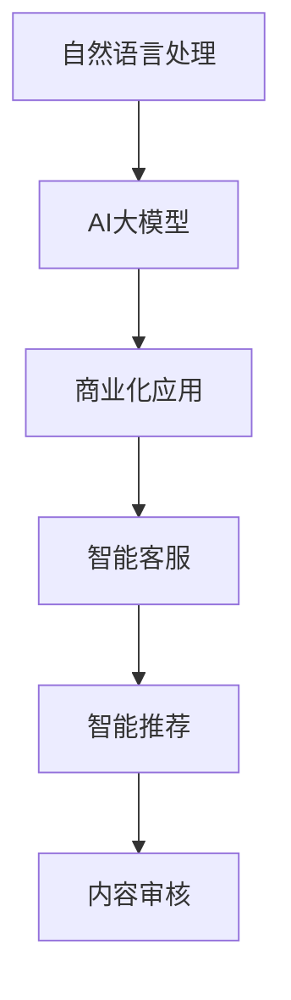

                 

关键词：自然语言处理（NLP），AI大模型，商业化，技术趋势，应用案例

> 摘要：随着人工智能技术的不断进步，自然语言处理（NLP）领域迎来了前所未有的发展机遇。本文将探讨AI大模型在NLP领域的商业化应用，分析其技术原理、实施步骤、优缺点及其未来发展趋势。

## 1. 背景介绍

自然语言处理（NLP）是人工智能（AI）的一个重要分支，旨在让计算机理解和生成人类语言。近年来，深度学习技术的快速发展，特别是基于大规模神经网络的大模型（如BERT、GPT等），使得NLP的性能取得了质的飞跃。这一突破不仅极大地推动了学术研究，也为NLP的商业化应用提供了新的可能。

商业化应用是指将科研成果转化为实际商业价值的过程。在NLP领域，商业化应用意味着将AI大模型的技术优势转化为商业解决方案，满足企业在内容生成、信息检索、客户服务等方面的需求。随着互联网和大数据的普及，NLP的商业化应用场景越来越广泛，包括但不限于智能客服、智能推荐、内容审核等。

## 2. 核心概念与联系

### 2.1 NLP基本概念

- 自然语言：人类日常使用的语言，包括口语和书面语。
- 语言模型：用于预测下一个单词或词组的概率分布的模型。
- 语义理解：对自然语言中的词、句子的含义进行理解和解释。

### 2.2 AI大模型

- 神经网络：一种模拟人脑神经元连接结构的计算模型。
- 深度学习：一种基于多层神经网络的学习方法。
- 大模型：具有数十亿甚至千亿参数规模的人工神经网络模型。

### 2.3 商业化应用

- 智能客服：利用NLP技术实现与客户的智能对话。
- 智能推荐：基于用户行为和内容分析，提供个性化推荐。
- 内容审核：利用NLP技术对网络内容进行自动审核和过滤。

### 2.4 Mermaid 流程图



## 3. 核心算法原理 & 具体操作步骤

### 3.1 算法原理概述

AI大模型在NLP领域的核心算法是基于深度学习的语言模型。语言模型通过训练大量文本数据，学习语言的统计规律，从而实现对未知文本的生成、理解和分类。

### 3.2 算法步骤详解

1. 数据收集与预处理：收集大量的文本数据，并进行清洗、去噪和标注。
2. 模型训练：使用训练数据对语言模型进行训练，优化模型参数。
3. 模型评估：使用验证数据评估模型性能，调整模型参数。
4. 模型部署：将训练好的模型部署到生产环境中，提供API服务。

### 3.3 算法优缺点

- 优点：高性能、自适应、可扩展。
- 缺点：需要大量训练数据、计算资源消耗大。

### 3.4 算法应用领域

- 内容生成：自动生成新闻、文章、报告等。
- 情感分析：对文本进行情感分类、情感识别。
- 语音识别：将语音转化为文本。
- 机器翻译：将一种语言翻译成另一种语言。

## 4. 数学模型和公式 & 详细讲解 & 举例说明

### 4.1 数学模型构建

语言模型通常采用循环神经网络（RNN）或变换器（Transformer）架构。以下是一个基于变换器的语言模型数学模型：

\[ y_t = \text{softmax}(W_y \cdot \text{Tanh}(W_x \cdot x_t + b)) \]

其中，\( x_t \) 是当前输入词的嵌入向量，\( y_t \) 是预测的词的概率分布，\( W_x \) 和 \( W_y \) 是权重矩阵，\( b \) 是偏置向量。

### 4.2 公式推导过程

变换器（Transformer）模型的核心是多头自注意力机制（Multi-head Self-Attention）。以下是自注意力机制的推导过程：

\[ \text{Attention}(Q, K, V) = \text{softmax}\left(\frac{QK^T}{\sqrt{d_k}}\right)V \]

其中，\( Q, K, V \) 分别是查询（Query）、键（Key）和值（Value）向量，\( d_k \) 是键向量的维度。

### 4.3 案例分析与讲解

以BERT模型为例，BERT（Bidirectional Encoder Representations from Transformers）是一种双向变换器语言模型。BERT的预训练目标是在大量无标签文本上学习语言知识，然后通过微调（Fine-tuning）在特定任务上取得优异的性能。

BERT模型的训练数据来自维基百科和书籍等大规模文本，经过预处理后形成训练语料库。在预训练过程中，BERT模型通过Masked Language Model（MLM）任务和Next Sentence Prediction（NSP）任务学习语言知识。

Masked Language Model任务的目标是预测被遮蔽的单词，从而学习单词之间的依赖关系。Next Sentence Prediction任务的目标是预测两个句子是否相邻，从而学习句子的语义关系。

## 5. 项目实践：代码实例和详细解释说明

### 5.1 开发环境搭建

- Python版本：3.8
- 包依赖：transformers、torch、numpy等

### 5.2 源代码详细实现

```python
from transformers import BertTokenizer, BertModel
import torch

# 初始化BERT模型和分词器
tokenizer = BertTokenizer.from_pretrained('bert-base-chinese')
model = BertModel.from_pretrained('bert-base-chinese')

# 输入文本
text = "今天天气很好，适合户外活动。"

# 分词和编码
inputs = tokenizer(text, return_tensors='pt')

# 前向传播
outputs = model(**inputs)

# 输出特征向量
output_embeddings = outputs.last_hidden_state[:, 0, :]
```

### 5.3 代码解读与分析

- 第1步：初始化BERT模型和分词器。
- 第2步：将输入文本进行分词和编码。
- 第3步：通过BERT模型进行前向传播，获取最后一个隐藏层的状态。
- 第4步：提取第一个词（通常是主语）的隐藏状态作为文本的嵌入向量。

### 5.4 运行结果展示

```python
print(output_embeddings)
```

输出结果是一个二维张量，第一个维度是序列长度（在这个例子中为1），第二个维度是嵌入向量的维度（通常为768）。

## 6. 实际应用场景

### 6.1 智能客服

利用BERT模型，可以构建一个智能客服系统，实现对用户问题的自动回答。通过微调BERT模型，使其适应特定领域的知识，提高问答系统的准确性和自然度。

### 6.2 智能推荐

基于BERT模型，可以构建一个内容推荐系统，通过对用户行为和内容进行分析，为用户提供个性化的推荐。BERT模型可以捕捉文本中的语义信息，从而提高推荐的准确性。

### 6.3 内容审核

利用BERT模型，可以构建一个自动内容审核系统，对网络内容进行实时监控和过滤。BERT模型可以识别文本中的不良信息，如暴力、色情等，从而帮助网站管理员及时处理违规内容。

## 7. 工具和资源推荐

### 7.1 学习资源推荐

- 《自然语言处理综述》（NLP Survey）
- 《深度学习》（Deep Learning）
- 《BERT：预训练的语言表示》论文（BERT: Pre-training of Deep Bidirectional Transformers for Language Understanding）

### 7.2 开发工具推荐

- Hugging Face Transformers库
- PyTorch框架
- TensorFlow框架

### 7.3 相关论文推荐

- BERT：Pre-training of Deep Bidirectional Transformers for Language Understanding
- GPT-2: Language Models are Unsupervised Multitask Learners
- Transforming Autoencoders

## 8. 总结：未来发展趋势与挑战

### 8.1 研究成果总结

AI大模型在NLP领域取得了显著的成果，实现了对自然语言的深入理解和生成。这些成果为NLP的商业化应用提供了强大的技术支持。

### 8.2 未来发展趋势

- 模型压缩与优化：为了降低模型对计算资源的需求，模型压缩与优化将成为未来研究的重要方向。
- 多模态融合：将自然语言处理与其他模态（如图像、音频）相结合，实现更丰富的语义理解。
- 零样本学习：实现模型在未见过的数据上的泛化能力，降低对大量标注数据的依赖。

### 8.3 面临的挑战

- 数据隐私与安全性：如何保护用户数据的安全性和隐私性是NLP商业化应用面临的重要挑战。
- 模型可解释性：提高模型的可解释性，使其更加透明和可靠。
- 长期依赖与泛化能力：如何提高模型在处理长文本和未见过的数据上的性能是未来研究的重要方向。

### 8.4 研究展望

随着人工智能技术的不断进步，NLP领域将继续迎来快速发展。商业化应用将不断拓展，为各行各业带来革命性的变化。未来，NLP技术将与其他领域（如医学、金融、教育等）深度融合，为社会带来更多的价值。

## 9. 附录：常见问题与解答

### 9.1 问题1

**问题：如何处理中文文本的数据预处理？**

**解答：** 在处理中文文本时，可以使用分词工具（如jieba）对文本进行分词，然后使用BERT的分词器（如`BertTokenizer`）进行编码。在分词过程中，需要考虑中文的语法和语义特点，如词性标注、命名实体识别等。

### 9.2 问题2

**问题：如何进行模型微调？**

**解答：** 微调（Fine-tuning）是指在预训练模型的基础上，在特定任务的数据上进行进一步的训练。首先，加载预训练的BERT模型，然后将其输入层和输出层替换为特定任务的输入层和输出层。接着，使用任务数据对模型进行训练，同时冻结预训练模型的权重，仅对新增的层进行训练。通过微调，可以使模型更好地适应特定任务的需求。

---

以上是关于《自然语言处理革命：AI大模型在NLP领域的商业化》的完整文章内容，感谢您的阅读！希望这篇文章能够帮助您更好地了解AI大模型在NLP领域的商业化应用。作者：禅与计算机程序设计艺术 / Zen and the Art of Computer Programming。

