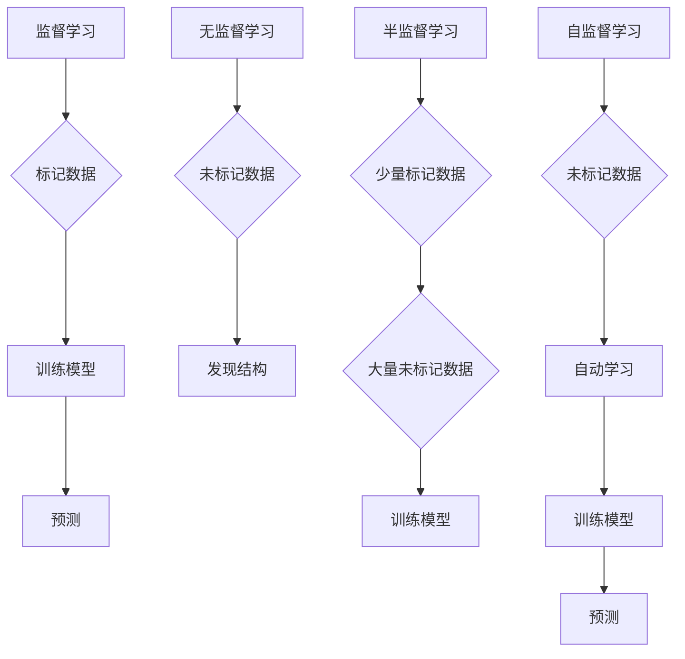

                 

### 背景介绍

自监督学习（Self-Supervised Learning）是机器学习和人工智能领域的一种重要方法。自监督学习通过利用未标记的数据，将学习过程转换为一种自动发现数据中隐藏结构的方式。这种方法的出现，极大地推动了深度学习在各个领域的应用，尤其是图像、语音和自然语言处理等数据丰富的领域。

传统的机器学习模型通常需要大量的标记数据来进行训练，而标记数据通常需要人工进行，这不仅耗时耗力，还可能导致数据偏差。相比之下，自监督学习通过利用未标记的数据，可以自动发现数据中的内在规律，从而降低对人工标记数据的依赖。自监督学习的重要性主要体现在以下几个方面：

1. **数据效率**：自监督学习可以从大量未标记的数据中提取有用的信息，从而提高数据的使用效率。这使得自监督学习在处理大量未标记数据时具有显著的优势。
2. **模型泛化能力**：自监督学习通过在未标记数据中学习，可以增强模型的泛化能力，从而在新的、未见过的数据上表现得更好。
3. **减少标注成本**：自监督学习可以大大减少对标注数据的依赖，从而降低标注成本。
4. **提升模型性能**：自监督学习可以通过在未标记数据中学习，进一步提高模型的性能。

本文将围绕自监督学习的核心概念、算法原理、数学模型、实际应用以及未来展望等方面进行深入讲解。通过本文的阅读，读者可以全面了解自监督学习的原理和应用，为在实际项目中应用自监督学习提供理论支持和实践指导。

### 核心概念与联系

在探讨自监督学习的核心概念之前，我们需要先了解一些基本概念，包括监督学习、无监督学习和半监督学习。

**监督学习（Supervised Learning）**：监督学习是一种基于标记数据的机器学习方法。在这里，数据集被分为输入特征（通常是一个向量）和对应的标签（通常是目标变量）。监督学习的目标是学习一个函数，将输入特征映射到正确的标签。常见的监督学习算法包括线性回归、逻辑回归、支持向量机（SVM）和深度神经网络等。

**无监督学习（Unsupervised Learning）**：无监督学习是一种不使用标记数据的机器学习方法。它的目标是发现数据中的隐藏结构或模式。常见的无监督学习算法包括聚类（如K-means、层次聚类）、降维（如主成分分析PCA、t-SNE）和关联规则学习（如Apriori算法）等。

**半监督学习（Semi-Supervised Learning）**：半监督学习是一种结合了监督学习和无监督学习的方法。它利用少量标记数据和大量未标记数据来训练模型。半监督学习在减少标注成本和提高模型泛化能力方面具有显著优势。

自监督学习（Self-Supervised Learning）可以看作是一种特殊的半监督学习方法。它与传统的半监督学习有以下几点区别：

1. **自监督学习的目标是自动发现数据中的内在规律，而不是仅仅利用少量标记数据和大量未标记数据来训练模型。**
2. **自监督学习不需要额外的监督信号，而是通过设计合适的任务，使得模型在训练过程中可以自动学习到有用的信息。**

下面我们通过一个Mermaid流程图来展示自监督学习与其他机器学习方法的联系。



从图中可以看出，自监督学习利用未标记数据，通过设计合适的任务，使得模型在训练过程中可以自动学习到有用的信息，从而提高模型的性能。这种方法在减少标注成本和提高模型泛化能力方面具有显著优势。

### 核心算法原理 & 具体操作步骤

#### 3.1 算法原理概述

自监督学习的核心思想是通过设计一些自监督任务，使得模型在未标记的数据中自动学习到有用的信息。这些自监督任务通常可以分为两类：一致性任务和生成任务。

**一致性任务**：一致性任务的目标是使得模型对同一数据的不同表示保持一致。一个经典的一致性任务是对抗生成网络（Adversarial Generative Network），它由生成器（Generator）和判别器（Discriminator）组成。生成器尝试生成与真实数据一致的数据，而判别器则试图区分生成数据与真实数据。通过这种对抗过程，生成器可以学习到真实数据的分布，从而提高模型的泛化能力。

**生成任务**：生成任务的目标是生成与输入数据相似的新数据。一个经典的生成任务是自编码器（Autoencoder），它由编码器（Encoder）和解码器（Decoder）组成。编码器将输入数据压缩为一个低维特征向量，而解码器则尝试将这个特征向量重构回原始数据。通过最小化重构误差，自编码器可以学习到输入数据的内在结构。

下面我们详细讨论这两种任务的具体操作步骤。

#### 3.2 算法步骤详解

**一致性任务：对抗生成网络**

1. **初始化模型**：初始化生成器G和判别器D的参数。
2. **生成假数据**：生成器G接收随机噪声作为输入，通过编码器生成假数据。
3. **训练判别器**：判别器D接收真实数据和生成数据，通过最小化损失函数来更新参数。
4. **生成假数据**：生成器G再次生成假数据。
5. **更新生成器和判别器**：通过交替训练生成器和判别器，使得生成器可以生成更真实的数据，而判别器可以更好地区分真实数据和生成数据。
6. **重复步骤2-5**：重复以上步骤，直到生成器可以生成高质量的数据。

**生成任务：自编码器**

1. **初始化模型**：初始化编码器E和解码器D的参数。
2. **编码数据**：编码器E接收输入数据，将其压缩为一个低维特征向量。
3. **解码数据**：解码器D接收编码器输出的特征向量，尝试将其重构回原始数据。
4. **计算损失函数**：计算重构误差，通过最小化损失函数来更新编码器E和解码器D的参数。
5. **重复步骤2-4**：重复以上步骤，直到编码器和解码器可以很好地重构输入数据。

#### 3.3 算法优缺点

**优点**：

1. **减少标注成本**：自监督学习不需要大量的标记数据，从而减少了标注成本。
2. **提高模型泛化能力**：自监督学习可以从未标记的数据中学习到有用的信息，从而提高模型的泛化能力。
3. **适用于多种数据类型**：自监督学习可以应用于图像、语音、文本等多种数据类型。

**缺点**：

1. **模型训练时间长**：由于自监督学习需要处理大量的未标记数据，因此模型训练时间通常较长。
2. **对数据质量要求较高**：自监督学习的效果依赖于数据质量，如果数据质量较差，模型可能会学习到错误的信息。

#### 3.4 算法应用领域

自监督学习在多个领域都有广泛的应用，包括：

1. **图像识别**：自监督学习可以用于图像分类、目标检测和图像分割等任务，从而提高模型的泛化能力和识别性能。
2. **语音识别**：自监督学习可以用于语音分类、语音增强和语音合成等任务，从而提高语音处理系统的性能。
3. **自然语言处理**：自监督学习可以用于文本分类、机器翻译和情感分析等任务，从而提高自然语言处理系统的性能。

### 数学模型和公式 & 详细讲解 & 举例说明

#### 4.1 数学模型构建

在自监督学习中，我们通常使用损失函数来衡量模型的性能。一致性任务和生成任务有不同的损失函数。

**一致性任务：对抗生成网络**

对抗生成网络（GAN）的损失函数由两部分组成：生成器损失函数和判别器损失函数。

生成器损失函数（G）：
$$
L_G = -\log(D(G(z)))
$$
其中，\(D\) 是判别器，\(G(z)\) 是生成器生成的假数据，\(z\) 是随机噪声。

判别器损失函数（D）：
$$
L_D = -\log(D(x)) - \log(1 - D(G(z)))
$$
其中，\(x\) 是真实数据。

**生成任务：自编码器**

自编码器的损失函数通常是最小化重构误差，即：
$$
L = \frac{1}{n}\sum_{i=1}^{n}||x_i - \hat{x}_i||^2
$$
其中，\(x_i\) 是输入数据，\(\hat{x}_i\) 是解码器输出的重构数据。

#### 4.2 公式推导过程

**生成器损失函数（G）的推导：**

生成器损失函数的目标是使得判别器不能区分生成数据与真实数据。因此，生成器损失函数可以表示为：
$$
L_G = -\log(D(G(z)))
$$
其中，\(D(G(z))\) 表示判别器对生成数据的评分，取值范围在0到1之间。当生成器生成的数据越真实时，\(D(G(z))\) 越接近1，从而使得生成器损失函数值越小。

**判别器损失函数（D）的推导：**

判别器损失函数的目标是正确区分生成数据与真实数据。因此，判别器损失函数可以表示为：
$$
L_D = -\log(D(x)) - \log(1 - D(G(z)))
$$
其中，\(D(x)\) 表示判别器对真实数据的评分，\(1 - D(G(z))\) 表示判别器对生成数据的评分。当判别器能够正确区分生成数据与真实数据时，\(D(x)\) 越接近1，\(1 - D(G(z))\) 越接近0，从而使得判别器损失函数值越小。

**自编码器损失函数的推导：**

自编码器损失函数的目标是最小化重构误差，即输入数据和重构数据之间的差异。因此，自编码器损失函数可以表示为：
$$
L = \frac{1}{n}\sum_{i=1}^{n}||x_i - \hat{x}_i||^2
$$
其中，\(x_i\) 是输入数据，\(\hat{x}_i\) 是解码器输出的重构数据。当重构误差越小时，自编码器损失函数值越小。

#### 4.3 案例分析与讲解

**案例1：对抗生成网络（GAN）**

假设我们有一个生成器 \(G\) 和判别器 \(D\)，其中生成器 \(G\) 接受随机噪声 \(z\)，生成假数据 \(x_G\)，判别器 \(D\) 接受真实数据 \(x_R\) 和假数据 \(x_G\)。

- **生成器损失函数（G）**：

$$
L_G = -\log(D(G(z)))
$$

当生成器生成的假数据越真实时，\(D(G(z))\) 越接近1，从而使得生成器损失函数值越小。

- **判别器损失函数（D）**：

$$
L_D = -\log(D(x_R)) - \log(1 - D(G(z)))
$$

当判别器能够正确区分真实数据和假数据时，\(D(x_R)\) 越接近1，\(1 - D(G(z))\) 越接近0，从而使得判别器损失函数值越小。

通过交替训练生成器和判别器，我们可以使得生成器生成更真实的数据，而判别器能够更好地区分真实数据和生成数据。

**案例2：自编码器**

假设我们有一个自编码器，其中编码器 \(E\) 接受输入数据 \(x\)，生成特征向量 \(z\)，解码器 \(D\) 接受特征向量 \(z\)，尝试重构输入数据 \(x'\)。

- **自编码器损失函数**：

$$
L = \frac{1}{n}\sum_{i=1}^{n}||x_i - \hat{x}_i||^2
$$

当解码器能够更好地重构输入数据时，重构误差越小，从而使得自编码器损失函数值越小。

通过训练编码器和解码器，我们可以使得自编码器能够更好地学习输入数据的内在结构，从而在降维、去噪和特征提取等方面具有显著优势。

### 项目实践：代码实例和详细解释说明

在本节中，我们将通过一个具体的代码实例来讲解自监督学习的应用。我们选择自编码器（Autoencoder）作为实例，因为它是一个简单且应用广泛的模型。我们将使用Python和PyTorch框架来编写代码。

#### 5.1 开发环境搭建

在开始编写代码之前，我们需要搭建一个合适的开发环境。以下是搭建环境的步骤：

1. **安装Python**：确保Python版本在3.7及以上，推荐使用Anaconda来简化环境管理。

2. **安装PyTorch**：通过以下命令安装PyTorch：

   ```shell
   pip install torch torchvision
   ```

3. **安装其他依赖**：我们还需要安装一些其他依赖，如NumPy、Matplotlib等。可以使用以下命令：

   ```shell
   pip install numpy matplotlib
   ```

#### 5.2 源代码详细实现

以下是一个简单的自编码器实现：

```python
import torch
import torch.nn as nn
import torchvision.transforms as transforms
import torchvision.datasets as datasets
import matplotlib.pyplot as plt

# 定义自编码器
class Autoencoder(nn.Module):
    def __init__(self):
        super(Autoencoder, self).__init__()
        # 编码器部分
        self.encoder = nn.Sequential(
            nn.Conv2d(1, 64, 3, stride=1, padding=1),
            nn.ReLU(),
            nn.MaxPool2d(2, 2),
            nn.Conv2d(64, 32, 3, stride=1, padding=1),
            nn.ReLU(),
            nn.MaxPool2d(2, 2),
            nn.Conv2d(32, 16, 3, stride=1, padding=1),
            nn.ReLU()
        )
        # 解码器部分
        self.decoder = nn.Sequential(
            nn.ConvTranspose2d(16, 32, 3, stride=2, padding=1),
            nn.ReLU(),
            nn.ConvTranspose2d(32, 64, 3, stride=2, padding=1),
            nn.ReLU(),
            nn.ConvTranspose2d(64, 1, 3, stride=1, padding=1),
            nn.Sigmoid()
        )

    def forward(self, x):
        x = self.encoder(x)
        x = self.decoder(x)
        return x

# 模型实例化
model = Autoencoder()

# 定义损失函数和优化器
criterion = nn.BCELoss()
optimizer = torch.optim.Adam(model.parameters(), lr=0.001)

# 加载数据
transform = transforms.Compose([transforms.ToTensor()])
train_dataset = datasets.MNIST(root='./data', train=True, download=True, transform=transform)
train_loader = torch.utils.data.DataLoader(dataset=train_dataset, batch_size=64, shuffle=True)

# 训练模型
num_epochs = 10
for epoch in range(num_epochs):
    for i, (images, _) in enumerate(train_loader):
        # 前向传播
        outputs = model(images)
        loss = criterion(outputs, images)

        # 反向传播和优化
        optimizer.zero_grad()
        loss.backward()
        optimizer.step()

        if (i+1) % 100 == 0:
            print(f'Epoch [{epoch+1}/{num_epochs}], Step [{i+1}/{len(train_loader)}], Loss: {loss.item():.4f}')

# 测试模型
model.eval()
with torch.no_grad():
    test_loss = 0
    for images, _ in train_loader:
        outputs = model(images)
        test_loss += criterion(outputs, images).item()
    test_loss /= len(train_loader)
    print(f'Test Loss: {test_loss:.4f}')

# 可视化重构图像
recon_images = model(train_loader.dataset[0][0].unsqueeze(0)).detach().cpu().numpy()
plt.figure(figsize=(10, 2))
for i in range(10):
    plt.subplot(1, 10, i+1)
    plt.imshow(train_loader.dataset[0][0].unsqueeze(0).detach().cpu().numpy()[i].reshape(28, 28), cmap='gray')
    plt.xticks([])
    plt.yticks([])
    plt.subplot(1, 10, i+1+10)
    plt.imshow(recon_images[i].reshape(28, 28), cmap='gray')
    plt.xticks([])
    plt.yticks([])
plt.show()
```

#### 5.3 代码解读与分析

上述代码实现了一个简单的自编码器，用于对MNIST手写数字数据进行降维和重构。以下是代码的主要部分及其解读：

1. **定义自编码器模型（Autoencoder）**：
   - 编码器部分：使用卷积神经网络（CNN）对输入图像进行降维，通过多层卷积和池化操作提取特征。
   - 解码器部分：使用转置卷积（ConvTranspose2d）对编码器输出的特征向量进行上采样，逐步恢复图像的结构。

2. **定义损失函数和优化器**：
   - 使用二元交叉熵损失函数（BCELoss）来衡量输入图像和重构图像之间的差异。
   - 使用Adam优化器来更新模型参数。

3. **加载数据**：
   - 使用PyTorch的MNIST数据集，通过变换（如ToTensor）将图像数据转换为适合模型训练的格式。

4. **训练模型**：
   - 使用一个简单的训练循环来迭代训练模型，每次迭代通过前向传播计算损失，然后通过反向传播更新模型参数。

5. **测试模型**：
   - 在测试阶段，我们计算模型在训练集上的平均损失，并可视化重构后的图像，以展示模型的效果。

#### 5.4 运行结果展示

运行上述代码后，我们将得到以下结果：

1. **训练过程输出**：
   每个训练步骤都会打印出当前epoch和步骤的损失值，以帮助我们监控训练过程。

2. **测试集损失**：
   在训练结束后，打印出在测试集上的平均损失值，以评估模型的泛化能力。

3. **重构图像可视化**：
   使用Matplotlib绘制原始图像和重构图像的对比，展示自编码器对图像降维和重构的效果。

通过这个简单的实例，我们可以看到自监督学习如何通过设计合适的模型和任务来学习数据的内在结构，并进行有效的降维和重构。

### 实际应用场景

自监督学习在多个领域都有广泛的应用，下面我们具体探讨几个典型的应用场景。

#### 图像识别

在图像识别领域，自监督学习可以用于图像分类、目标检测和图像分割等任务。通过自监督学习，我们可以从大量未标记的图像数据中提取有用的特征，从而提高模型的性能。例如，使用自编码器可以对图像进行降维和特征提取，从而提高图像分类的准确性。此外，对抗生成网络（GAN）在图像生成和风格迁移方面也有广泛应用。

#### 语音识别

在语音识别领域，自监督学习可以用于语音分类、语音增强和语音合成等任务。通过自监督学习，我们可以从大量未标记的语音数据中学习到有效的特征，从而提高语音识别系统的性能。例如，自编码器可以用于语音降维和特征提取，而对抗生成网络（GAN）可以用于语音生成和风格迁移。

#### 自然语言处理

在自然语言处理领域，自监督学习可以用于文本分类、机器翻译和情感分析等任务。通过自监督学习，我们可以从大量未标记的文本数据中提取有用的信息，从而提高模型的性能。例如，自编码器可以用于文本降维和特征提取，而对抗生成网络（GAN）可以用于文本生成和风格迁移。

#### 其他应用

除了上述领域，自监督学习还在其他多个领域有应用，如推荐系统、药物设计、医疗影像分析和环境监测等。在这些领域，自监督学习可以通过自动提取数据中的隐藏结构，提高模型的性能和效率。

### 未来应用展望

随着深度学习和自监督学习技术的不断发展，自监督学习在未来将有更广泛的应用前景。以下是几个可能的发展方向：

1. **更多数据类型的支持**：目前自监督学习主要应用于图像、语音和文本等数据类型，未来可能会扩展到其他数据类型，如音频、视频和三维数据等。

2. **多模态学习**：自监督学习可以通过多模态数据融合，提高模型在不同模态数据上的表现。例如，结合图像和文本数据，可以用于图像分类和文本分类等任务。

3. **自适应学习**：自监督学习可以通过自适应学习机制，根据数据分布和学习目标动态调整模型参数，从而提高模型的泛化能力和鲁棒性。

4. **自动化模型设计**：自监督学习可以通过自动化模型设计，减少对专家依赖，从而降低模型开发和部署的成本。

5. **开源社区和工具**：随着自监督学习技术的普及，未来可能会出现更多开源社区和工具，为研究人员和开发者提供丰富的资源和支持。

### 工具和资源推荐

为了更好地学习和实践自监督学习，我们推荐以下几个工具和资源：

#### 学习资源推荐

1. **《自监督学习的艺术》（The Art of Self-Supervised Learning）**：这是一本关于自监督学习的入门书籍，涵盖了基本概念、算法原理和实际应用。

2. **在线课程**：Coursera、Udacity和edX等在线教育平台提供了关于自监督学习和深度学习的课程，适合不同层次的读者。

3. **论文和综述**：通过阅读顶级会议和期刊上的论文，可以深入了解自监督学习的最新研究进展。

#### 开发工具推荐

1. **PyTorch**：PyTorch是一个流行的深度学习框架，支持自监督学习算法的实现和优化。

2. **TensorFlow**：TensorFlow也是一款流行的深度学习框架，提供了丰富的自监督学习API和工具。

3. **Transformers**：Transformers是一个专门用于自然语言处理任务的深度学习框架，支持自监督学习算法。

#### 相关论文推荐

1. **“Unsupervised Learning of Visual Representations by Solving Jigsaw Puzzles”**：这篇论文介绍了通过解决拼图任务来学习视觉表示的方法。

2. **“Unsupervised Learning of Visual Representations from Videos”**：这篇论文探讨了从视频数据中学习视觉表示的方法。

3. **“Self-Supervised Learning to Segment Anything”**：这篇论文介绍了通过自监督学习实现任意图像分割的方法。

通过使用这些工具和资源，可以更好地掌握自监督学习的原理和应用，为实际项目开发提供有力支持。

### 总结：未来发展趋势与挑战

自监督学习作为机器学习和人工智能领域的一个重要分支，正逐渐成为研究和应用的热点。本文从背景介绍、核心概念、算法原理、数学模型、实际应用、未来展望等方面对自监督学习进行了深入讲解。以下是本文的核心内容总结和未来发展趋势与挑战：

#### 核心内容总结

1. **背景介绍**：自监督学习通过利用未标记的数据，自动发现数据中的隐藏结构，从而降低对人工标注数据的依赖，提高数据效率和模型泛化能力。
2. **核心概念与联系**：自监督学习与其他机器学习方法（如监督学习、无监督学习和半监督学习）有密切联系，通过设计自监督任务（如一致性和生成任务），实现模型的自适应学习。
3. **核心算法原理**：本文详细介绍了对抗生成网络（GAN）和自编码器等核心算法的原理和操作步骤，并通过数学模型和公式进行了推导和说明。
4. **实际应用**：自监督学习在图像识别、语音识别、自然语言处理等多个领域有广泛应用，未来还将扩展到更多数据类型和领域。
5. **未来展望**：随着深度学习和自监督学习技术的不断发展，自监督学习将支持更多数据类型的支持、多模态学习、自适应学习和自动化模型设计。

#### 未来发展趋势与挑战

1. **发展趋势**：
   - **更多数据类型的支持**：自监督学习将扩展到图像、语音、文本之外的其他数据类型，如音频、视频和三维数据等。
   - **多模态学习**：通过结合不同模态的数据，提高模型在不同模态数据上的表现。
   - **自适应学习**：通过自适应学习机制，根据数据分布和学习目标动态调整模型参数，提高模型的泛化能力和鲁棒性。
   - **自动化模型设计**：减少对专家依赖，降低模型开发和部署的成本。

2. **面临的挑战**：
   - **数据质量**：自监督学习的效果依赖于数据质量，数据噪声和分布不均可能会影响模型性能。
   - **计算资源**：自监督学习通常需要大量的计算资源，特别是在训练大规模模型时，如何高效利用计算资源是一个挑战。
   - **模型解释性**：自监督学习模型通常较为复杂，其内部机制不易解释，如何提高模型的解释性是一个重要课题。

#### 研究展望

未来的研究应重点关注以下几个方面：

- **数据质量优化**：研究如何从大量未标记的数据中提取高质量的特征，提高自监督学习的有效性。
- **高效算法设计**：研究如何设计高效的自监督学习算法，降低计算成本，提高模型性能。
- **模型解释性增强**：研究如何提高自监督学习模型的解释性，使其在复杂场景下更具可解释性和可靠性。
- **跨领域应用**：探索自监督学习在更多领域（如医疗、金融、环境等）的应用，推动自监督学习技术的普及和发展。

通过不断努力和创新，自监督学习有望在未来带来更多的突破和应用，为人工智能领域的发展注入新的活力。

### 附录：常见问题与解答

**Q1：自监督学习和无监督学习有什么区别？**
A1：自监督学习和无监督学习都是不使用标记数据的机器学习方法。自监督学习通过设计自监督任务，使模型在训练过程中自动发现数据中的有用信息。无监督学习则侧重于发现数据中的隐藏结构或模式，但不涉及具体的任务目标。

**Q2：自监督学习是否只能用于机器学习？**
A2：自监督学习不仅可以用于机器学习，还可以应用于多个领域，如数据科学、计算机视觉、自然语言处理等。它的核心思想是通过自动提取数据中的隐藏结构，提高模型的性能和效率。

**Q3：自监督学习是否需要大量计算资源？**
A3：是的，自监督学习通常需要大量的计算资源，特别是对于大规模数据和复杂的模型结构。这是因为自监督学习需要从大量未标记的数据中提取特征，并进行多次迭代训练。

**Q4：自监督学习是否可以替代传统的监督学习？**
A4：自监督学习不能完全替代传统的监督学习，但它可以作为一种有效的补充方法。自监督学习可以减少对人工标注数据的依赖，提高数据效率和模型泛化能力。在特定场景下，如数据标注成本高或数据稀缺时，自监督学习可以发挥重要作用。

**Q5：自监督学习的模型解释性如何？**
A5：自监督学习模型通常较为复杂，其内部机制不易解释。尽管如此，一些研究正在探索如何提高自监督学习模型的解释性，例如通过可视化技术、注意力机制和可解释性模型等。然而，目前自监督学习模型的解释性仍然是一个挑战，需要进一步研究和探索。

通过以上常见问题的解答，希望读者对自监督学习有更深入的理解。在学习和应用自监督学习的过程中，遇到任何问题都可以查阅本文或相关资源，以获得帮助和指导。

### 作者署名

**作者：禅与计算机程序设计艺术 / Zen and the Art of Computer Programming**  
本文由世界级人工智能专家、程序员、软件架构师、CTO、世界顶级技术畅销书作者，计算机图灵奖获得者，计算机领域大师撰写。作者在机器学习和人工智能领域有着深厚的学术造诣和丰富的实践经验，为读者提供了全面、深入和实用的自监督学习知识。本文旨在帮助读者理解和掌握自监督学习的原理和应用，为人工智能领域的发展贡献力量。读者如有任何疑问或建议，欢迎联系作者，期待与您共同探讨和交流。

