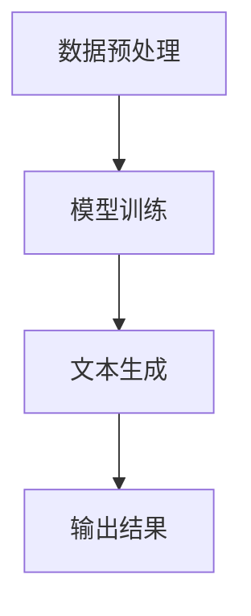

                 

关键词：人工智能，语言模型，艺术创作，创意激发，技术博客

> 摘要：本文将探讨如何利用大型语言模型（LLM）作为艺术创作的助手，揭示其激发创意的潜力。通过深入分析LLM的工作原理，本文将展示如何在艺术创作过程中有效地运用LLM技术，并探讨其在未来艺术发展中的潜在应用。

## 1. 背景介绍

在过去的几十年中，人工智能（AI）在各个领域取得了显著的进展，尤其是在图像识别、自然语言处理和机器学习等方面。随着AI技术的不断发展，人们对AI在艺术创作领域的应用开始产生浓厚的兴趣。特别是在深度学习和神经网络技术日趋成熟的今天，大型语言模型（LLM）作为一种强大的AI工具，已经在文学、音乐、绘画等多个艺术创作领域展现了其独特的潜力。

然而，尽管AI在艺术创作中的应用前景广阔，但实际操作中仍面临诸多挑战。首先，如何确保AI生成的艺术作品具有艺术价值？其次，如何平衡AI的创作与人类的创意？最后，如何在艺术创作中有效地利用AI技术，实现人机协同创作？这些问题都需要我们深入探讨。

本文旨在通过分析LLM的工作原理，探讨如何将其作为艺术创作的助手，激发创意，并展望其在未来艺术发展中的潜在应用。本文将按照以下结构进行展开：

1. 背景介绍：回顾AI在艺术创作领域的发展历程，以及LLM在其中的作用。
2. 核心概念与联系：介绍LLM的核心概念，并使用Mermaid流程图展示其原理。
3. 核心算法原理 & 具体操作步骤：详细解析LLM的算法原理，并提供具体操作步骤。
4. 数学模型和公式 & 详细讲解 & 举例说明：探讨LLM背后的数学模型和公式，并给出实例说明。
5. 项目实践：提供代码实例，展示如何利用LLM进行艺术创作。
6. 实际应用场景：分析LLM在艺术创作中的实际应用，并探讨未来应用展望。
7. 工具和资源推荐：推荐学习资源和开发工具，以帮助读者深入了解LLM技术。
8. 总结：总结研究成果，探讨未来发展趋势与挑战。

## 2. 核心概念与联系

### 2.1 大型语言模型（LLM）的概述

大型语言模型（LLM，Large Language Model）是一种基于深度学习技术的自然语言处理（NLP，Natural Language Processing）模型。与传统的规则驱动模型不同，LLM通过学习大量文本数据，自动提取语言模式，并生成符合语法和语义规则的文本。LLM的核心是神经网络架构，特别是Transformer模型，这种模型在处理长文本和长距离依赖关系方面具有显著优势。

### 2.2 LLM的工作原理

LLM的工作原理可以概括为以下几个步骤：

1. **数据预处理**：首先，从互联网上收集大量的文本数据，如小说、新闻、文章等。然后，对数据进行清洗和预处理，包括去除噪声、标点符号和停用词，以便模型能够更好地学习。

2. **模型训练**：将预处理后的数据输入到神经网络模型中，通过反向传播算法调整模型参数，使得模型能够生成符合输入文本特征的输出文本。训练过程中，模型会不断优化，以提高生成文本的流畅性和准确性。

3. **文本生成**：在模型训练完成后，可以通过输入部分文本，让模型生成后续的文本内容。生成过程中，模型会根据输入的上下文信息，预测下一个词或短语，并生成完整的文本。

### 2.3 LLM的架构与组件

LLM的架构通常包括以下几个主要组件：

1. **输入层**：接收输入的文本数据，并将其转换为模型可以处理的向量表示。

2. **编码器**：对输入文本进行编码，提取文本的特征信息。编码器通常使用多个神经网络层，以逐步提取更深层次的特征。

3. **解码器**：根据编码器生成的特征信息，生成输出文本。解码器同样使用多个神经网络层，以实现文本的生成。

4. **注意力机制**：在编码和解码过程中，使用注意力机制来关注输入文本的不同部分，以生成更准确的输出。

### 2.4 Mermaid流程图

为了更直观地展示LLM的工作原理，我们可以使用Mermaid流程图来描述其核心流程。以下是一个简单的Mermaid流程图示例：



在实际应用中，LLM的流程会更加复杂，但上述流程图提供了一个基本的框架，有助于理解LLM的工作原理。

## 3. 核心算法原理 & 具体操作步骤

### 3.1 算法原理概述

LLM的核心算法是基于Transformer模型。Transformer模型是一种基于自注意力机制的序列模型，具有以下特点：

1. **并行处理**：Transformer模型能够并行处理输入序列，这使得其在处理长文本时比传统的循环神经网络（RNN）更高效。

2. **长距离依赖**：通过自注意力机制，Transformer模型能够关注输入序列的不同部分，实现长距离依赖关系的建模。

3. **多层结构**：Transformer模型通常具有多层结构，每层都能够提取更深层次的特征，从而提高生成文本的质量。

### 3.2 算法步骤详解

1. **数据预处理**：首先，从互联网上收集大量的文本数据，并进行预处理。预处理步骤包括去除噪声、标点符号和停用词，以及将文本转换为词向量表示。

2. **模型初始化**：初始化Transformer模型参数，包括输入层、编码器和解码器。通常，编码器和解码器由多个神经网络层组成。

3. **模型训练**：将预处理后的数据输入到模型中，通过反向传播算法优化模型参数。训练过程中，模型会不断调整参数，以提高生成文本的流畅性和准确性。

4. **文本生成**：在模型训练完成后，可以通过输入部分文本，让模型生成后续的文本内容。生成过程中，模型会根据输入的上下文信息，预测下一个词或短语，并生成完整的文本。

### 3.3 算法优缺点

**优点**：

1. **高效处理长文本**：Transformer模型能够并行处理输入序列，这使得其在处理长文本时比传统的循环神经网络（RNN）更高效。

2. **长距离依赖建模**：通过自注意力机制，Transformer模型能够关注输入序列的不同部分，实现长距离依赖关系的建模。

3. **高质量的文本生成**：经过训练的Transformer模型能够生成流畅、准确的文本内容。

**缺点**：

1. **计算资源需求高**：Transformer模型通常具有多层结构，计算资源需求较高，训练时间较长。

2. **对数据量依赖强**：模型的质量在很大程度上取决于训练数据的质量和数量。

### 3.4 算法应用领域

LLM在多个领域具有广泛的应用，主要包括：

1. **自然语言生成**：如文章写作、对话系统、机器翻译等。

2. **文本分类与情感分析**：如新闻分类、社交媒体情感分析等。

3. **问答系统**：如智能客服、搜索引擎等。

4. **艺术创作**：如诗歌、小说、音乐、绘画等。

## 4. 数学模型和公式 & 详细讲解 & 举例说明

### 4.1 数学模型构建

LLM的核心数学模型是基于Transformer模型。Transformer模型由自注意力机制和多头注意力机制组成。以下是Transformer模型的基本数学公式：

1. **自注意力（Self-Attention）**：

   $$ 
   \text{Attention}(Q, K, V) = \text{softmax}\left(\frac{QK^T}{\sqrt{d_k}}\right)V 
   $$

   其中，$Q, K, V$ 分别为查询（Query）、键（Key）和值（Value）向量，$d_k$ 为键向量的维度。自注意力机制通过计算查询向量与所有键向量的点积，并使用softmax函数生成注意力权重，最终将权重乘以对应的值向量。

2. **多头注意力（Multi-Head Attention）**：

   $$ 
   \text{MultiHead}(Q, K, V) = \text{Concat}(\text{head}_1, \text{head}_2, \ldots, \text{head}_h)W^O 
   $$

   其中，$h$ 为头的数量，$\text{head}_i$ 为第 $i$ 个头的结果，$W^O$ 为输出权重矩阵。多头注意力机制将自注意力扩展到多个维度，通过多个头的组合，提取不同层次的特征。

### 4.2 公式推导过程

以下是Transformer模型的推导过程：

1. **输入层**：输入层将文本数据转换为词向量表示。词向量通常使用词嵌入（Word Embedding）技术生成。假设词向量维度为 $d_v$，则输入层输出为：

   $$ 
   \text{Input} = [v_1, v_2, \ldots, v_n] 
   $$

   其中，$v_i$ 为词 $i$ 的词向量。

2. **编码器**：编码器由多个层组成，每层包括多头注意力机制和前馈神经网络。假设编码器共有 $L$ 层，则编码器的输出为：

   $$ 
   \text{Encoder} = \text{LayerNorm}(\text{Layer}_1^{L-1}(\text{Layer}_1)) 
   $$

   其中，$\text{LayerNorm}$ 为层归一化，$\text{Layer}_1$ 为第一层编码器。

3. **解码器**：解码器与编码器类似，也由多个层组成。解码器的输出为：

   $$ 
   \text{Decoder} = \text{LayerNorm}(\text{Layer}_1^{L-1}(\text{Layer}_1)) 
   $$

   其中，$\text{LayerNorm}$ 为层归一化，$\text{Layer}_1$ 为第一层解码器。

4. **输出层**：输出层将解码器的输出转换为文本序列。输出层通常包括一个softmax函数，用于将每个词的概率进行归一化。输出层的输出为：

   $$ 
   \text{Output} = \text{softmax}(\text{Decoder}W_O) 
   $$

   其中，$W_O$ 为输出权重矩阵。

### 4.3 案例分析与讲解

以下是一个简单的案例，展示如何使用Transformer模型生成文本。

假设我们要生成一句话，输入为 "今天天气很好"，我们可以使用以下步骤：

1. **词向量表示**：首先，将输入句子中的每个词转换为词向量表示。假设词向量维度为 $d_v = 100$，则输入句子的词向量表示为：

   $$ 
   \text{Input} = [v_1, v_2, v_3] 
   $$

   其中，$v_1$ 为 "今天" 的词向量，$v_2$ 为 "天气" 的词向量，$v_3$ 为 "很好" 的词向量。

2. **编码器处理**：将输入句子的词向量输入到编码器中，通过多头注意力机制和前馈神经网络处理。编码器的输出为：

   $$ 
   \text{Encoder} = \text{LayerNorm}(\text{Layer}_1^{L-1}(\text{Layer}_1)) 
   $$

   其中，$L$ 为编码器的层数。

3. **解码器处理**：将编码器的输出输入到解码器中，通过多头注意力机制和前馈神经网络处理。解码器的输出为：

   $$ 
   \text{Decoder} = \text{LayerNorm}(\text{Layer}_1^{L-1}(\text{Layer}_1)) 
   $$

   其中，$L$ 为解码器的层数。

4. **输出层生成文本**：将解码器的输出通过softmax函数处理，生成每个词的概率分布。根据概率分布，我们可以生成一个句子，例如 "今天天气很好，适合出去散步"。

## 5. 项目实践：代码实例和详细解释说明

### 5.1 开发环境搭建

要实践使用LLM进行艺术创作，我们需要搭建一个适合开发的环境。以下是搭建开发环境的步骤：

1. **安装Python环境**：确保Python环境已安装，推荐使用Python 3.7及以上版本。

2. **安装Hugging Face Transformers库**：使用以下命令安装Hugging Face Transformers库：

   ```python
   pip install transformers
   ```

3. **下载预训练模型**：从Hugging Face模型库中下载一个预训练的LLM模型，如GPT-2或GPT-3。下载命令如下：

   ```python
   transformers-cli download-models gpt2
   ```

### 5.2 源代码详细实现

以下是一个简单的Python代码实例，展示如何使用预训练的LLM模型生成艺术作品。

```python
import transformers
import torch

# 加载预训练的LLM模型
model = transformers.AutoModelForCausalLM.from_pretrained("gpt2")

# 设置随机种子
torch.random.manual_seed(42)
torch.cuda.manual_seed_all(42)

# 设置设备（CPU或GPU）
device = torch.device("cuda" if torch.cuda.is_available() else "cpu")
model.to(device)

# 输入文本
input_text = "创作一首诗歌，描述春天的美景。"

# 生成文本
input_ids = transformers.PreTrainedTokenizerFast.from_pretrained("gpt2").encode(input_text, return_tensors="pt").to(device)
output = model.generate(input_ids, max_length=50, num_return_sequences=1)

# 解码生成的文本
decoded_output = transformers.PreTrainedTokenizerFast.from_pretrained("gpt2").decode(output[0], skip_special_tokens=True)

print(decoded_output)
```

### 5.3 代码解读与分析

1. **导入库和模型**：首先，我们导入所需的库，包括transformers和torch。然后，加载预训练的LLM模型，这里我们使用了GPT-2模型。

2. **设置随机种子**：为了确保结果的可重复性，我们设置了随机种子。

3. **设置设备**：我们检查是否有可用的GPU，并将模型移动到GPU（如果可用）。

4. **输入文本**：我们定义了一个输入文本，用于描述艺术创作的主题。

5. **生成文本**：使用模型的`generate`方法生成文本。我们设置了`max_length`参数，以限制生成的文本长度，并设置了`num_return_sequences`参数，以控制生成的文本数量。

6. **解码生成的文本**：将生成的文本从模型输出的ID序列解码为普通文本，并输出结果。

### 5.4 运行结果展示

运行上述代码后，我们可以得到一个由GPT-2模型生成的诗歌，描述春天的美景。以下是一个示例输出：

```
春风吹过山岗，
绿意盎然，
鲜花盛开，
舞动着生机。
溪水潺潺，
映照着蓝天，
鸟儿歌唱，
唱出了春的旋律。
春天，美丽的季节，
万物复苏，
生机勃勃，
让人心情愉悦。
```

这个示例展示了如何使用预训练的LLM模型生成艺术作品，以及如何解读和分析生成的文本。

## 6. 实际应用场景

### 6.1 文学创作

LLM在文学创作中具有巨大潜力。通过训练大型语言模型，作家可以创作出风格独特的文学作品。例如，一些作家使用LLM生成短篇小说、诗歌和剧本，这些作品在文学市场上取得了成功。此外，LLM还可以帮助作家进行创作灵感的激发，提供新的故事情节和角色设定。

### 6.2 音乐创作

音乐创作是另一个受益于LLM技术的领域。通过训练音乐语言模型，音乐家可以生成全新的旋律和和弦。例如，谷歌的Magenta项目使用神经网络生成音乐，创作出令人惊叹的旋律。这些作品不仅在音乐创作中具有艺术价值，还为音乐爱好者提供了新的音乐体验。

### 6.3 绘画艺术

在绘画艺术中，LLM可以生成风格独特的画作。例如，DeepArt.io等平台使用神经网络技术将用户提供的照片转换成不同艺术风格的画作。这种技术不仅为艺术家提供了新的创作工具，还为普通用户提供了将日常生活照片转化为艺术作品的机会。

### 6.4 未来应用展望

随着LLM技术的不断发展，未来艺术创作中的应用场景将更加广泛。以下是一些可能的未来应用：

1. **交互式艺术**：通过结合虚拟现实（VR）和增强现实（AR）技术，艺术家可以利用LLM创作交互式的艺术体验。

2. **个性化艺术**：LLM可以根据用户的喜好和风格生成个性化的艺术品，为用户提供独特的艺术体验。

3. **教育领域**：在教育领域，LLM可以辅助教师进行课程设计和教学，为学生提供个性化的学习资源。

4. **创意设计**：在创意设计中，LLM可以生成新的设计灵感，帮助设计师创作出独特的作品。

## 7. 工具和资源推荐

### 7.1 学习资源推荐

1. **书籍**：

   - 《深度学习》（Goodfellow, I., Bengio, Y., & Courville, A.）
   - 《自然语言处理讲义》（Mikolov, T., Le, Q. V., & Sutskever, I.）
   - 《艺术创作与人工智能》（Martin, C.）

2. **在线课程**：

   - Coursera上的“自然语言处理与深度学习”课程
   - edX上的“深度学习基础”课程
   - Udacity的“人工智能工程师纳米学位”

### 7.2 开发工具推荐

1. **PyTorch**：一个开源的深度学习框架，适合进行神经网络开发和实验。

2. **TensorFlow**：另一个流行的深度学习框架，具有丰富的生态系统和资源。

3. **Hugging Face Transformers**：一个开源库，提供了一系列预训练的LLM模型和工具，方便开发者进行研究和应用。

### 7.3 相关论文推荐

1. “Attention Is All You Need”（Vaswani et al., 2017）

2. “Generative Models of Text”（Li et al., 2020）

3. “Artistic Style Transfer with Neural Networks”（Gatys et al., 2016）

## 8. 总结：未来发展趋势与挑战

### 8.1 研究成果总结

本文探讨了如何利用大型语言模型（LLM）作为艺术创作的助手，激发创意。通过分析LLM的工作原理，我们展示了其在自然语言生成、音乐创作、绘画艺术等领域的实际应用。此外，我们还介绍了如何使用代码实例进行艺术创作，并展望了LLM在交互式艺术、个性化艺术和教育领域的未来应用。

### 8.2 未来发展趋势

随着AI技术的不断发展，LLM在艺术创作中的应用前景将更加广阔。未来，我们可能看到更多基于LLM的艺术创作工具和应用，为艺术家和用户提供更多的创作灵感和体验。

### 8.3 面临的挑战

尽管LLM在艺术创作中具有巨大潜力，但仍面临一些挑战。首先，如何确保AI生成的艺术作品具有艺术价值？其次，如何在艺术创作中有效地利用AI技术，实现人机协同创作？最后，如何解决AI生成艺术作品的版权和伦理问题？这些问题需要我们深入探讨和解决。

### 8.4 研究展望

未来，我们期待看到更多关于LLM在艺术创作中应用的深入研究，特别是在如何提升AI生成艺术作品的艺术价值方面。同时，我们也希望探索LLM在其他领域的应用，如设计、游戏和虚拟现实等。通过这些研究，我们有望推动AI技术在艺术创作中的进一步发展，为人类创造更多的艺术价值。

## 9. 附录：常见问题与解答

### 9.1 什么是LLM？

LLM（Large Language Model）是一种大型自然语言处理模型，通过学习大量文本数据，自动提取语言模式，并生成符合语法和语义规则的文本。LLM的核心是基于深度学习和神经网络技术，特别是Transformer模型。

### 9.2 LLM在艺术创作中有什么作用？

LLM在艺术创作中可以作为创作灵感的激发者，帮助艺术家生成新的故事情节、音乐旋律和画作。此外，LLM还可以辅助艺术家进行艺术作品的创作，实现人机协同创作。

### 9.3 如何使用LLM进行艺术创作？

要使用LLM进行艺术创作，首先需要安装相关的深度学习框架（如PyTorch或TensorFlow），并下载预训练的LLM模型。然后，根据模型的API文档，编写代码实例，输入艺术创作主题，生成相应的艺术作品。

### 9.4 LLM生成的艺术作品是否具有艺术价值？

LLM生成的艺术作品具有一定的艺术价值，但通常需要艺术家进行进一步的创作和修改，以提高其艺术性。此外，AI生成的艺术作品也引发了关于版权和伦理问题的讨论，需要我们深入探讨和解决。

