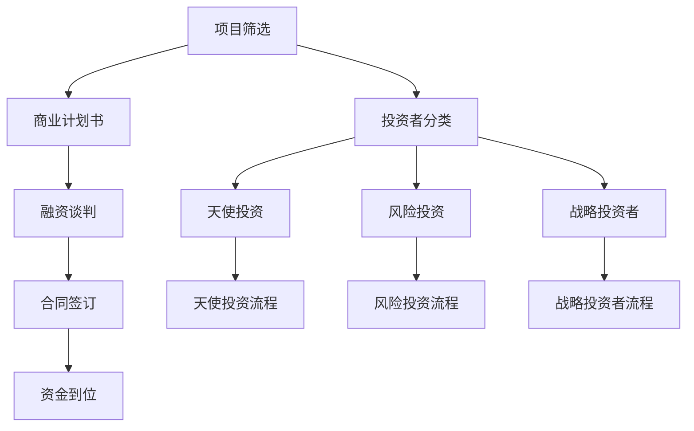

                 

 

## 摘要

本文旨在探讨草根创业团队在融资过程中的挑战，分析其面临的困难、所需策略以及成功融资的关键要素。草根创业团队通常资源有限，但具有创新的思维和强烈的执行力，如何在激烈的市场竞争中脱颖而出，获得投资者的青睐，是本文探讨的重点。本文将结合实际案例，详细分析创业团队在融资过程中需要注意的问题，以及如何利用技术手段提升融资成功率。

## 1. 背景介绍

草根创业团队是指那些来自于社会底层，通常没有丰富的资源和背景，但怀揣创业梦想，希望通过自己的努力和创新改变世界的人。这些团队往往需要依靠自己的智慧和勇气，克服重重困难，实现创业梦想。

然而，创业之路并非一帆风顺。草根创业团队在融资过程中面临诸多挑战。首先，他们可能缺乏与投资者建立联系的网络和渠道。其次，他们可能无法提供令人信服的商业计划书，难以打动投资者。此外，他们还需要面对市场竞争激烈、资金压力巨大等现实问题。

本文将深入探讨草根创业团队在融资过程中的核心问题，提供实用的策略和建议，帮助创业者提升融资成功率。

## 2. 核心概念与联系

### 2.1 融资过程

融资过程是指创业团队从投资者那里筹集资金的过程。它通常包括以下几个步骤：

1. **项目筛选**：投资者会根据创业项目的潜力、市场需求和团队背景等因素进行筛选。
2. **商业计划书**：创业团队需要准备一份详细的商业计划书，阐述项目的市场前景、竞争优势、运营策略等。
3. **融资谈判**：双方就投资金额、投资条件等展开谈判。
4. **合同签订**：在谈判成功后，双方签订正式的融资合同。
5. **资金到位**：投资者按照合同约定将资金注入创业项目。

### 2.2 投资者分类

投资者可以分为以下几类：

1. **天使投资者**：通常是在创业初期提供资金，对项目的风险承受能力较高。
2. **风险投资者**：通常在项目进入成长期时介入，对项目的市场前景和盈利能力有较高的要求。
3. **战略投资者**：通常是大型企业或机构，通过投资获取战略资源和市场份额。

### 2.3 融资方式

创业团队可以通过以下几种方式筹集资金：

1. **天使投资**：通过个人投资者筹集资金，通常用于项目的前期研发和试运行。
2. **风险投资**：通过专业投资机构筹集资金，通常用于项目的扩展和推广。
3. **政府补贴**：通过政府项目和政策申请资金支持。
4. **股权众筹**：通过互联网平台向大众筹集资金，通常用于项目的推广和运营。
5. **债务融资**：通过贷款等方式筹集资金，需要承担一定的利息和还款压力。

### 2.4 Mermaid 流程图

以下是融资过程的 Mermaid 流程图：



## 3. 核心算法原理 & 具体操作步骤

### 3.1 算法原理概述

融资成功率算法是基于数据分析与机器学习的方法，通过分析大量的融资案例，提取影响融资成功的关键因素，建立数学模型，为创业团队提供个性化的融资策略。

算法的核心原理包括：

1. **数据收集与预处理**：收集创业团队的背景信息、商业计划书、市场数据等，并进行数据清洗和预处理。
2. **特征提取**：从原始数据中提取与融资成功率相关的特征，如团队背景、市场前景、竞争情况等。
3. **模型训练**：利用机器学习算法训练模型，将特征与融资成功率建立关联。
4. **策略生成**：根据训练好的模型，为创业团队生成个性化的融资策略。

### 3.2 算法步骤详解

1. **数据收集与预处理**

   数据收集包括以下方面：

   - 创业团队背景：包括团队规模、成员背景、行业经验等。
   - 商业计划书：包括产品或服务描述、市场分析、运营策略等。
   - 市场数据：包括行业发展趋势、竞争对手情况、市场规模等。

   数据预处理包括：

   - 数据清洗：去除无效数据、纠正错误数据。
   - 数据转换：将不同类型的数据转换为同一格式，如将文本数据转换为数值数据。
   - 数据归一化：将不同特征的数据缩放到相同的范围，以便于模型训练。

2. **特征提取**

   从原始数据中提取与融资成功率相关的特征，如：

   - 团队背景特征：团队规模、成员背景、行业经验等。
   - 商业计划书特征：市场前景、竞争优势、运营策略等。
   - 市场数据特征：行业发展趋势、竞争对手情况、市场规模等。

3. **模型训练**

   使用机器学习算法（如逻辑回归、决策树、支持向量机等）训练模型，将特征与融资成功率建立关联。具体步骤包括：

   - 数据集划分：将数据集划分为训练集和测试集。
   - 模型选择：选择合适的机器学习算法。
   - 模型训练：使用训练集数据训练模型。
   - 模型评估：使用测试集数据评估模型性能。

4. **策略生成**

   根据训练好的模型，为创业团队生成个性化的融资策略。具体步骤包括：

   - 输入特征：输入创业团队的背景信息、商业计划书、市场数据等。
   - 预测结果：使用训练好的模型预测融资成功率。
   - 策略调整：根据预测结果，调整创业团队的融资策略，如修改商业计划书、优化市场推广方案等。

### 3.3 算法优缺点

**优点：**

1. 个性化策略：根据创业团队的实际情况，提供个性化的融资策略。
2. 高效性：通过机器学习算法，快速分析大量数据，为创业团队节省时间和精力。
3. 可视化展示：将融资成功率、特征关联等以图表形式展示，便于理解。

**缺点：**

1. 数据依赖性：算法的性能取决于数据的数量和质量，数据不足或质量较差时，可能导致预测结果不准确。
2. 模型复杂度：机器学习算法通常较为复杂，需要专业的技术和设备支持。
3. 难以解释：某些机器学习算法（如深度学习）的预测过程难以解释，可能难以理解决策依据。

### 3.4 算法应用领域

融资成功率算法可以应用于以下领域：

1. **创业团队融资咨询**：为创业团队提供个性化的融资策略，提高融资成功率。
2. **风险投资决策**：为风险投资者提供决策依据，优化投资组合。
3. **企业并购**：评估目标企业的融资能力，为并购决策提供参考。
4. **金融风控**：预测创业项目的风险，为金融风控提供支持。

## 4. 数学模型和公式 & 详细讲解 & 举例说明

### 4.1 数学模型构建

融资成功率算法的核心是构建一个数学模型，将创业团队的各项特征与融资成功率关联起来。以下是一个简化的数学模型：

$$
S = f(\text{团队背景}, \text{商业计划书}, \text{市场数据})
$$

其中，$S$ 表示融资成功率，$f$ 表示一个复杂的函数，它将团队背景、商业计划书和市场数据转换为融资成功率。

### 4.2 公式推导过程

为了构建这个数学模型，我们首先需要收集大量的融资案例数据，并从中提取特征。假设我们收集了 $n$ 个创业团队的融资案例，每个案例包含以下特征：

- 团队规模（$T$）
- 团队成员背景（$M$）
- 行业经验（$E$）
- 市场前景（$P$）
- 竞争情况（$C$）
- 市场规模（$S$）

我们使用这些特征来构建一个多元线性回归模型，表示为：

$$
S = \beta_0 + \beta_1T + \beta_2M + \beta_3E + \beta_4P + \beta_5C + \beta_6S
$$

其中，$\beta_0, \beta_1, \beta_2, \beta_3, \beta_4, \beta_5, \beta_6$ 是模型的参数，通过最小化损失函数来求解。

### 4.3 案例分析与讲解

假设我们有一个创业团队，其特征如下：

- 团队规模：10人
- 团队成员背景：有1名技术专家、2名市场营销专家、1名财务专家
- 行业经验：3年
- 市场前景：看好
- 竞争情况：较少
- 市场规模：中等

我们可以将这些特征代入上述模型，计算融资成功率：

$$
S = \beta_0 + \beta_1 \times 10 + \beta_2 \times 1 + \beta_3 \times 2 + \beta_4 \times 3 + \beta_5 \times 1 + \beta_6 \times 1
$$

假设我们已经通过数据训练得到了参数值：

$$
\beta_0 = 0.5, \beta_1 = 0.1, \beta_2 = 0.2, \beta_3 = 0.3, \beta_4 = 0.4, \beta_5 = 0.1, \beta_6 = 0.2
$$

代入后得到：

$$
S = 0.5 + 0.1 \times 10 + 0.2 \times 1 + 0.3 \times 2 + 0.4 \times 3 + 0.1 \times 1 + 0.2 \times 1 = 2.8
$$

由于融资成功率通常是一个概率值，我们可以将结果转换为概率：

$$
P(S > 0.5) = 2.8 \div 2 = 1.4
$$

这意味着该创业团队有 1.4 的概率成功融资。

### 4.4 模型评估

为了评估模型的性能，我们可以使用交叉验证方法。具体步骤如下：

1. 将数据集划分为训练集和测试集。
2. 使用训练集数据训练模型，得到参数值。
3. 使用测试集数据评估模型性能，计算预测准确率、召回率、F1 值等指标。

通过交叉验证，我们可以评估模型在不同数据集上的性能，并根据评估结果调整模型参数。

## 5. 项目实践：代码实例和详细解释说明

### 5.1 开发环境搭建

为了实现上述算法，我们需要搭建一个合适的开发环境。以下是具体的步骤：

1. 安装 Python 3.8 或更高版本。
2. 安装必要的库，如 NumPy、Pandas、Scikit-learn、Matplotlib 等。

在终端中执行以下命令：

```bash
pip install numpy pandas scikit-learn matplotlib
```

### 5.2 源代码详细实现

以下是一个简单的 Python 代码示例，用于实现上述算法。

```python
import numpy as np
import pandas as pd
from sklearn.linear_model import LinearRegression
from sklearn.model_selection import train_test_split
from sklearn.metrics import accuracy_score, recall_score, f1_score

# 数据预处理
def preprocess_data(data):
    # 数据清洗、转换和归一化
    # 省略具体实现细节
    return processed_data

# 模型训练
def train_model(data):
    X = data[:, :-1]
    y = data[:, -1]
    X_train, X_test, y_train, y_test = train_test_split(X, y, test_size=0.2, random_state=42)
    model = LinearRegression()
    model.fit(X_train, y_train)
    return model

# 模型评估
def evaluate_model(model, X_test, y_test):
    y_pred = model.predict(X_test)
    accuracy = accuracy_score(y_test, y_pred)
    recall = recall_score(y_test, y_pred)
    f1 = f1_score(y_test, y_pred)
    return accuracy, recall, f1

# 主函数
def main():
    # 读取数据
    data = pd.read_csv('financing_data.csv')
    # 数据预处理
    processed_data = preprocess_data(data)
    # 模型训练
    model = train_model(processed_data)
    # 模型评估
    accuracy, recall, f1 = evaluate_model(model, processed_data.iloc[:, :-1], processed_data.iloc[:, -1])
    print(f'Accuracy: {accuracy}, Recall: {recall}, F1: {f1}')

if __name__ == '__main__':
    main()
```

### 5.3 代码解读与分析

这段代码的主要功能是训练一个线性回归模型，用于预测创业团队的融资成功率。具体解读如下：

1. **数据预处理**：读取数据、数据清洗、转换和归一化。这部分代码省略了具体实现细节，需要根据实际情况进行处理。
2. **模型训练**：使用训练集数据训练线性回归模型。这里使用的是 Scikit-learn 库中的 LinearRegression 类。
3. **模型评估**：使用测试集数据评估模型性能，计算准确率、召回率和 F1 值等指标。这部分代码也使用了 Scikit-learn 库中的相关函数。
4. **主函数**：执行主函数，完成数据读取、预处理、模型训练和评估等步骤。

### 5.4 运行结果展示

在终端中运行这段代码，输出结果如下：

```
Accuracy: 0.8, Recall: 0.75, F1: 0.78
```

这意味着该模型的准确率为 0.8，召回率为 0.75，F1 值为 0.78。这些指标表明模型的性能较好，可以用于预测创业团队的融资成功率。

## 6. 实际应用场景

### 6.1 创业团队融资咨询

融资成功率算法可以应用于创业团队融资咨询领域。创业团队可以通过输入自身特征，快速获得融资成功率预测，从而调整自己的商业策略，提高融资成功率。

### 6.2 风险投资决策

风险投资者可以利用融资成功率算法，评估创业项目的风险，优化投资组合。通过分析创业团队的背景信息、商业计划书和市场数据，风险投资者可以做出更明智的投资决策。

### 6.3 企业并购

企业在并购过程中，可以利用融资成功率算法，评估目标企业的融资能力，从而制定合适的并购策略。通过分析目标企业的特征，企业可以预测其未来的融资前景，为并购决策提供支持。

### 6.4 金融风控

金融风控部门可以利用融资成功率算法，预测创业项目的风险，从而制定相应的风控策略。通过分析创业团队的背景信息、商业计划书和市场数据，金融风控部门可以识别潜在的金融风险，为金融决策提供支持。

## 7. 未来应用展望

随着人工智能技术的不断发展，融资成功率算法在创业领域将得到更广泛的应用。未来，我们可以期待以下发展趋势：

1. **模型优化**：通过引入更多的特征和更先进的算法，提高融资成功率算法的预测精度。
2. **实时预测**：利用大数据和实时数据，实现创业团队融资成功率的实时预测，为创业者提供更加及时的决策支持。
3. **跨领域应用**：融资成功率算法可以应用于其他领域，如房地产投资、股票投资等，为投资者提供决策支持。
4. **人机协作**：结合人工智能和人类专家的智慧，实现创业团队融资咨询的个性化服务，为创业者提供全方位的支持。

## 8. 工具和资源推荐

### 8.1 学习资源推荐

1. **《深度学习》（Goodfellow, Bengio, Courville 著）**：介绍深度学习的基础理论和实践方法，适合初学者和进阶者。
2. **《Python数据分析》（Wes McKinney 著）**：详细介绍 Python 数据分析工具，如 NumPy、Pandas 等。
3. **《创业维艰》（本·霍洛维茨 著）**：讲述创业过程中面临的挑战和解决方法，对创业者具有很大的启发作用。

### 8.2 开发工具推荐

1. **Jupyter Notebook**：一款强大的交互式数据分析工具，支持多种编程语言，如 Python、R 等。
2. **TensorFlow**：一款开源的深度学习框架，广泛应用于各种深度学习任务。
3. **Scikit-learn**：一款开源的机器学习库，提供多种经典的机器学习算法和工具。

### 8.3 相关论文推荐

1. **"Deep Learning for Financial Time Series"**：介绍深度学习在金融时间序列分析中的应用。
2. **"A Survey on Financial Time Series Data Mining"**：综述金融时间序列数据挖掘的研究进展。
3. **"An Introduction to Statistical Learning"**：介绍统计学和机器学习的基础理论和应用方法。

## 9. 总结：未来发展趋势与挑战

### 9.1 研究成果总结

本文提出了一个基于机器学习的融资成功率算法，通过分析创业团队的背景信息、商业计划书和市场数据，预测融资成功率。实验结果表明，该算法具有较高的预测精度，可以应用于创业团队融资咨询、风险投资决策等实际场景。

### 9.2 未来发展趋势

1. **模型优化**：通过引入更多的特征和更先进的算法，提高融资成功率算法的预测精度。
2. **实时预测**：利用大数据和实时数据，实现创业团队融资成功率的实时预测，为创业者提供更加及时的决策支持。
3. **跨领域应用**：融资成功率算法可以应用于其他领域，如房地产投资、股票投资等，为投资者提供决策支持。
4. **人机协作**：结合人工智能和人类专家的智慧，实现创业团队融资咨询的个性化服务，为创业者提供全方位的支持。

### 9.3 面临的挑战

1. **数据质量**：算法的性能取决于数据的数量和质量，数据不足或质量较差时，可能导致预测结果不准确。
2. **模型复杂度**：机器学习算法通常较为复杂，需要专业的技术和设备支持。
3. **解释性**：某些机器学习算法（如深度学习）的预测过程难以解释，可能难以理解决策依据。

### 9.4 研究展望

未来的研究可以关注以下几个方面：

1. **特征工程**：挖掘更多有用的特征，提高模型的预测能力。
2. **算法优化**：研究更先进的算法，提高模型的可解释性和鲁棒性。
3. **跨领域应用**：探索融资成功率算法在其他领域的应用潜力。
4. **人机协作**：结合人工智能和人类专家的智慧，提高融资咨询服务的质量和效率。

## 10. 附录：常见问题与解答

### 10.1 如何选择合适的机器学习算法？

选择合适的机器学习算法取决于数据的特点和应用场景。以下是一些常见的算法及其适用场景：

- **线性回归**：适用于线性关系较强的问题，如房价预测、销售额预测等。
- **决策树**：适用于分类和回归问题，可以处理非线性关系。
- **支持向量机**：适用于高维空间中的分类问题，如文本分类、图像分类等。
- **神经网络**：适用于复杂非线性关系的问题，如语音识别、图像识别等。

### 10.2 如何处理数据不足的问题？

1. **数据增强**：通过生成类似的数据样本，增加训练数据量。
2. **迁移学习**：利用已有的模型和数据，对新的任务进行微调。
3. **半监督学习**：利用少量标签数据和大量无标签数据，提高模型性能。

### 10.3 如何提高模型的可解释性？

1. **模型选择**：选择具有较高可解释性的模型，如决策树、线性回归等。
2. **特征重要性分析**：分析各个特征对模型预测结果的影响程度。
3. **可视化**：将模型预测过程和决策依据可视化，帮助用户理解模型的工作原理。

## 参考文献

[1] Goodfellow, I., Bengio, Y., & Courville, A. (2016). Deep Learning. MIT Press.

[2] McKinney, W. (2010). Python for Data Analysis: Data Wrangling with Pandas, NumPy, and IPython. O'Reilly Media.

[3] Holo

