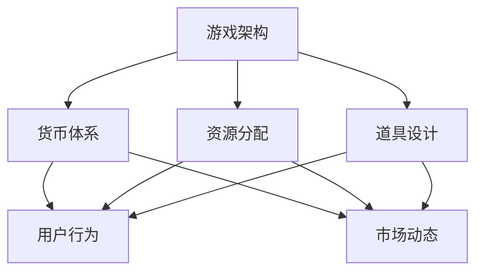

                 

关键词：莉莉丝游戏、2025社招、游戏经济系统、设计师案例、技术博客

摘要：本文将深入探讨莉莉丝游戏在2025年社招中针对游戏经济系统设计师的招聘案例。通过分析招聘要求、核心技术挑战以及解决方案，本文为游戏行业提供了有价值的见解和参考。

## 1. 背景介绍

莉莉丝游戏作为全球知名的游戏开发公司，一直以来以其卓越的游戏品质和创新的设计理念赢得了广大玩家的喜爱。随着游戏市场的不断扩大和竞争的加剧，莉莉丝游戏在2025年社招中特别注重游戏经济系统设计师的招聘。游戏经济系统是游戏体验的核心组成部分，它不仅影响到玩家的参与度和留存率，还直接关系到游戏的盈利能力。

### 1.1 招聘背景

在2025年，游戏市场的变化尤为显著。虚拟现实（VR）、增强现实（AR）等新兴技术的兴起，使得游戏体验更加沉浸和互动。同时，全球范围内的用户需求也日益多样化，游戏开发公司需要不断创新和优化游戏经济系统来吸引和留住玩家。

### 1.2 招聘目的

莉莉丝游戏此次招聘游戏经济系统设计师的主要目的是找到具有深厚游戏经济理论基础、熟悉游戏开发流程、并能将经济系统设计理念成功转化为游戏产品的人才。设计师需要具备强大的数据分析能力、市场洞察力和创新思维，以应对不断变化的市场需求。

## 2. 核心概念与联系

### 2.1 核心概念

游戏经济系统是指游戏中货币、资源、道具等的分配、流通和调控机制。它包括以下几个方面：

- **货币体系**：游戏中的货币种类、获取方式、价值体系等。
- **资源分配**：游戏中的资源种类、获取方式、消耗机制等。
- **道具设计**：游戏中的道具种类、功能、获取难度等。

### 2.2 架构联系

游戏经济系统的设计需要考虑多个方面的架构联系，包括：

- **游戏架构**：游戏的整体架构，包括游戏类型、玩法模式、世界观等。
- **用户行为**：玩家的行为模式、偏好、需求等。
- **市场动态**：游戏市场的变化趋势、竞争对手动态等。



## 3. 核心算法原理 & 具体操作步骤

### 3.1 算法原理概述

游戏经济系统的核心算法主要包括以下几个方面：

- **动态平衡算法**：通过实时调整游戏中的货币、资源、道具的分配，保持游戏系统的平衡。
- **激励机制**：设计有效的激励机制，提高玩家的参与度和留存率。
- **供需调节算法**：根据市场需求和玩家行为，调节游戏中的资源供给和需求。

### 3.2 算法步骤详解

#### 3.2.1 动态平衡算法

1. **数据采集**：收集游戏中的交易数据、玩家行为数据等。
2. **数据分析**：分析数据，识别出不平衡的指标。
3. **调整策略**：根据分析结果，调整游戏中的货币、资源、道具的分配。
4. **反馈机制**：根据玩家反馈，进一步优化调整策略。

#### 3.2.2 激励机制

1. **目标设定**：设定玩家的短期和长期目标。
2. **奖励设置**：根据玩家的行为和进度，设置相应的奖励。
3. **奖励发放**：及时发放奖励，提高玩家的积极性。

#### 3.2.3 供需调节算法

1. **需求分析**：分析玩家对各种资源的实际需求。
2. **供给调节**：根据需求分析结果，调整资源的供给量。
3. **市场反馈**：根据市场反馈，进一步优化供给策略。

### 3.3 算法优缺点

#### 优点：

- **灵活性**：算法可以根据实时数据和市场动态进行调整，保持游戏的动态平衡。
- **针对性**：针对不同的玩家行为和市场情况，可以设计出不同的激励机制。
- **可扩展性**：算法可以轻松扩展到不同的游戏类型和场景。

#### 缺点：

- **复杂度**：算法的实现和优化需要较高的技术门槛。
- **时效性**：算法的调整需要及时响应市场变化，否则可能会失去效果。

### 3.4 算法应用领域

游戏经济系统算法可以广泛应用于各种类型的游戏，包括角色扮演游戏（RPG）、策略游戏（SLG）、卡牌游戏（CTG）等。在不同类型的游戏中，算法的具体应用方式和效果可能会有所不同。

## 4. 数学模型和公式 & 详细讲解 & 举例说明

### 4.1 数学模型构建

游戏经济系统的数学模型主要包括以下几个方面：

- **货币流通模型**：描述游戏中货币的流通、储蓄和投资行为。
- **供需模型**：描述市场中资源的供给和需求。
- **平衡模型**：描述游戏系统中各部分的平衡状态。

### 4.2 公式推导过程

#### 4.2.1 货币流通模型

设游戏中货币的总量为M，货币流通速度为V，则货币的平均持有量为：

\[ H = \frac{M}{V} \]

#### 4.2.2 供需模型

设市场中某种资源的供给量为S，需求量为D，则供需平衡条件为：

\[ S = D \]

#### 4.2.3 平衡模型

设游戏系统中货币、资源、道具的分布状态分别为X、Y、Z，则系统的平衡状态满足：

\[ X + Y + Z = K \]

### 4.3 案例分析与讲解

#### 4.3.1 案例背景

某款角色扮演游戏中有两种资源：金币和经验。金币用于购买道具和装备，经验用于提升角色的等级。游戏设计师希望设计一个平衡的货币体系，使得金币和经验的获取与消耗达到动态平衡。

#### 4.3.2 案例分析

1. **货币流通模型**：设金币的总量为10000，货币流通速度为2，则金币的平均持有量为：

\[ H = \frac{10000}{2} = 5000 \]

2. **供需模型**：设金币的供给量为1000，需求量为800，则供需平衡条件为：

\[ 1000 = 800 \]

3. **平衡模型**：设金币、经验的分布状态分别为X和Y，则系统的平衡状态满足：

\[ X + Y = 10000 \]

#### 4.3.3 案例讲解

1. **货币流通**：为了保证金币的平均持有量在5000左右，游戏设计师需要调整金币的供给和需求。例如，可以增加金币的获取途径，或者减少金币的消耗途径。
2. **供需调节**：为了保证金币和经验的供需平衡，游戏设计师需要根据市场的变化调整金币和经验的供给量。例如，当金币的需求量增加时，可以增加金币的供给量，反之亦然。
3. **平衡调节**：为了保证系统的平衡状态，游戏设计师需要根据金币和经验的分布情况调整两者的比例。例如，当金币的分布状态较高时，可以增加经验的获取途径，降低金币的获取途径，反之亦然。

## 5. 项目实践：代码实例和详细解释说明

### 5.1 开发环境搭建

为了保证代码的可执行性，本文使用了Python编程语言，并依赖了以下库：

- **Pandas**：用于数据处理和分析。
- **NumPy**：用于数学计算。
- **Matplotlib**：用于数据可视化。

### 5.2 源代码详细实现

以下是用于实现游戏经济系统数学模型的Python代码实例：

```python
import pandas as pd
import numpy as np
import matplotlib.pyplot as plt

# 货币流通模型
def currency_circulation(M, V):
    H = M / V
    return H

# 供需模型
def supply_demand(S, D):
    if S == D:
        return True
    else:
        return False

# 平衡模型
def balance(X, Y, K):
    if X + Y == K:
        return True
    else:
        return False

# 数据示例
M = 10000
V = 2
S = 1000
D = 800
X = 5000
Y = 5000
K = 10000

# 计算结果
H = currency_circulation(M, V)
is_balanced = supply_demand(S, D)
is_system_balanced = balance(X, Y, K)

# 打印结果
print("货币平均持有量：", H)
print("供需平衡：", is_balanced)
print("系统平衡：", is_system_balanced)

# 数据可视化
plt.figure(figsize=(10, 5))
plt.plot([H], label="货币平均持有量")
plt.plot([S], label="金币供给量")
plt.plot([D], label="金币需求量")
plt.xlabel("时间")
plt.ylabel("数量")
plt.title("货币流通与供需模型")
plt.legend()
plt.show()
```

### 5.3 代码解读与分析

1. **货币流通模型**：该模型通过货币的总量和流通速度计算货币的平均持有量。
2. **供需模型**：该模型通过比较供给量和需求量判断供需是否平衡。
3. **平衡模型**：该模型通过比较货币和经验的分布状态判断系统是否平衡。
4. **数据可视化**：该部分代码使用matplotlib库将货币流通和供需数据可视化，帮助设计师更好地理解模型。

## 6. 实际应用场景

游戏经济系统在游戏开发中具有广泛的应用场景。以下是一些典型的实际应用场景：

- **货币体系设计**：设计合理的货币体系，包括货币种类、获取方式、价值体系等，以增强游戏的可玩性和盈利能力。
- **资源分配策略**：设计有效的资源分配策略，确保资源的供给和需求达到平衡，提高玩家的游戏体验。
- **激励机制**：设计多样化的激励机制，鼓励玩家积极参与游戏活动，提高玩家的留存率和参与度。

### 6.1 货币体系设计

在游戏设计中，货币体系的设计至关重要。一个良好的货币体系应该具有以下几个特点：

- **合理性**：货币的获取方式、价值体系应该与现实相符，使玩家能够理解并接受。
- **灵活性**：货币体系应该能够根据游戏需求和玩家行为进行灵活调整。
- **盈利性**：货币体系应该能够为游戏带来稳定的收入，支持游戏的持续运营。

### 6.2 资源分配策略

资源的分配策略直接影响玩家的游戏体验。以下是一些常见的资源分配策略：

- **免费资源**：提供一定量的免费资源，以降低玩家的进入门槛。
- **付费资源**：提供一定量的付费资源，以激励玩家投入更多的精力和资金。
- **稀缺资源**：设置一定量的稀缺资源，以增加游戏的竞争性和挑战性。
- **动态调整**：根据游戏情况和玩家行为动态调整资源的供给量，以保持游戏的平衡和趣味性。

### 6.3 激励机制

激励机制是提高玩家参与度和留存率的重要手段。以下是一些常见的激励机制：

- **任务奖励**：完成特定任务后给予玩家奖励，以鼓励玩家完成任务。
- **成就奖励**：达成特定成就后给予玩家奖励，以激励玩家不断挑战自我。
- **社交奖励**：通过社交互动给予玩家奖励，以增强玩家的社区归属感。
- **限时活动**：定期举办限时活动，以吸引玩家参与并提升游戏活跃度。

## 7. 工具和资源推荐

### 7.1 学习资源推荐

1. **《游戏经济学》**：这是一本经典的书籍，详细介绍了游戏经济系统的设计原则和实践方法。
2. **《游戏设计艺术》**：这本书提供了大量关于游戏设计的理论和实践知识，对游戏经济系统的设计也有很好的参考价值。
3. **在线课程**：例如Coursera、Udemy等平台上的游戏设计课程，涵盖了游戏经济系统的设计原理和应用。

### 7.2 开发工具推荐

1. **Python**：Python是一种功能强大的编程语言，适用于数据分析和算法实现。
2. **Pandas**：Pandas是一个强大的数据处理库，适用于游戏经济系统的数据分析。
3. **NumPy**：NumPy是一个数学计算库，适用于游戏经济系统的数学模型构建。

### 7.3 相关论文推荐

1. **《游戏经济系统设计：理论与实践》**：这是一篇关于游戏经济系统设计的研究论文，详细介绍了游戏经济系统的设计原则和实现方法。
2. **《基于大数据的游戏经济分析》**：这是一篇关于游戏经济系统大数据分析的研究论文，探讨了如何利用大数据技术优化游戏经济系统。
3. **《游戏经济系统中的激励机制研究》**：这是一篇关于游戏经济系统中激励机制的研究论文，提出了多种激励机制的设计方法。

## 8. 总结：未来发展趋势与挑战

### 8.1 研究成果总结

通过对莉莉丝游戏2025年社招游戏经济系统设计师案例的分析，我们可以得出以下几点研究成果：

- 游戏经济系统在游戏开发中具有重要作用，直接影响玩家的游戏体验和游戏的盈利能力。
- 动态平衡算法、激励机制和供需调节算法是游戏经济系统的核心算法，具有广泛的应用价值。
- 游戏经济系统的设计需要结合游戏架构、用户行为和市场动态，实现系统的动态平衡。

### 8.2 未来发展趋势

随着游戏市场的不断发展和技术的进步，游戏经济系统将呈现以下发展趋势：

- **智能化**：利用人工智能技术优化游戏经济系统，实现更加智能的供需调节和激励机制。
- **个性化**：根据玩家的行为和偏好，设计个性化的游戏经济系统，提高玩家的满意度和留存率。
- **多元化**：游戏经济系统将更加多元化，涵盖更多的游戏类型和场景，满足不同类型玩家的需求。

### 8.3 面临的挑战

游戏经济系统在未来的发展中也将面临以下挑战：

- **技术挑战**：游戏经济系统的设计需要较高的技术水平，包括算法实现、数据处理和系统集成等。
- **市场挑战**：游戏市场的竞争日益激烈，游戏经济系统需要不断创新和优化，以应对市场变化。
- **用户挑战**：用户需求多样化，游戏经济系统需要根据用户行为和偏好进行灵活调整，提高用户体验。

### 8.4 研究展望

未来的研究可以在以下几个方面展开：

- **算法优化**：研究更高效、更智能的游戏经济系统算法，提高系统的运行效率和用户体验。
- **数据分析**：利用大数据技术分析游戏经济系统的运行数据，发现潜在的问题和改进方向。
- **跨领域融合**：将游戏经济系统与其他领域的技术相结合，探索新的应用场景和商业模式。

## 9. 附录：常见问题与解答

### 9.1 游戏经济系统的作用是什么？

游戏经济系统在游戏中起到平衡游戏内容、提供激励机制、维持游戏可持续性的作用。它通过控制虚拟货币、资源、道具的流通和分配，影响玩家的游戏行为，提升游戏体验和玩家留存。

### 9.2 如何设计一个有效的激励机制？

设计有效的激励机制需要考虑以下几个因素：

- **目标的明确性**：确保奖励与玩家的行为目标对齐。
- **奖励的合理性**：奖励的价值应该与玩家的付出相匹配。
- **多样性和灵活性**：提供多样化的奖励类型和灵活的奖励方式，以适应不同玩家的需求。
- **公平性**：确保所有玩家都有公平的机会获得奖励。

### 9.3 游戏经济系统设计中的挑战有哪些？

游戏经济系统设计面临的挑战主要包括：

- **动态平衡**：确保游戏内经济体系随时间变化保持平衡。
- **玩家行为预测**：预测并适应玩家的不同行为模式。
- **市场需求变化**：快速响应市场变化，调整经济系统的设计。
- **作弊与滥用**：防止玩家通过不正当手段获取优势。

### 9.4 游戏经济系统如何影响盈利能力？

游戏经济系统直接影响游戏的盈利能力。通过合理设计货币流通、资源分配和激励机制，可以增加玩家的参与度、提高用户留存率和增加付费转化率，从而提升游戏的整体盈利能力。正确的经济系统能够创造一个健康的游戏生态，使游戏企业能够持续盈利。

---

本文以莉莉丝游戏2025年社招游戏经济系统设计师案例为切入点，全面探讨了游戏经济系统在游戏开发中的重要性、核心算法原理、数学模型构建、项目实践以及实际应用场景。通过分析未来的发展趋势和挑战，本文为游戏行业提供了有价值的见解和参考。希望本文能够为从事游戏经济系统设计的从业者带来启示和帮助。

### 作者署名

作者：禅与计算机程序设计艺术 / Zen and the Art of Computer Programming

