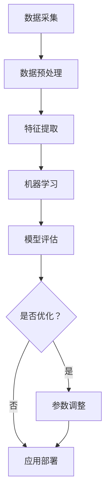

                 

随着人工智能技术的不断发展，智能仓储机器人正逐渐成为物流行业的核心竞争力。菜鸟网络作为国内领先的物流平台，对智能仓储机器人的技术要求也越来越高。本文将围绕2024年菜鸟网络校招智能仓储机器人算法工程师题目，深入探讨相关技术概念、算法原理、数学模型以及实际应用，旨在为读者提供一份全面的技术指南。

## 文章关键词
- 智能仓储机器人
- 算法工程师
- 2024校招
- 机器学习
- 图算法
- 运筹学
- 机器人路径规划

## 文章摘要
本文首先介绍了智能仓储机器人算法工程师岗位的背景和重要性，然后详细解析了2024年菜鸟网络校招智能仓储机器人算法工程师题目的核心内容。通过数学模型、算法原理、实际案例的讲解，读者可以全面理解该题目的技术难点和解决方案。最后，本文还对未来智能仓储机器人技术的发展趋势和挑战进行了展望。

## 1. 背景介绍

### 1.1 智能仓储机器人的发展历程

智能仓储机器人技术起源于20世纪90年代的自动化物流系统。随着计算机技术和机器人技术的快速发展，智能仓储机器人逐渐从单一功能（如货架搬运、拣选等）向多任务、多场景的综合应用发展。近年来，人工智能技术的引入，使得智能仓储机器人的智能化水平大幅提升，包括自主路径规划、环境感知、智能决策等方面。

### 1.2 智能仓储机器人技术的应用场景

智能仓储机器人广泛应用于电商、制造业、零售业等领域。其中，电商领域的应用尤为广泛，如亚马逊、京东等电商平台已经大量部署智能仓储机器人，实现了高效、低成本的物流服务。制造业中，智能仓储机器人用于生产线物流管理和物料配送，提高了生产效率和灵活性。零售业中，智能仓储机器人应用于商品拣选和货架管理，提升了购物体验。

### 1.3 菜鸟网络的智能仓储机器人技术布局

菜鸟网络作为中国领先的物流平台，致力于打造智能、高效、绿色的物流网络。在智能仓储机器人方面，菜鸟网络已布局了包括搬运机器人、拣选机器人、分拣机器人等多个系列，并在算法、感知、决策等领域进行了深入研究和创新。2024年校招智能仓储机器人算法工程师题目的提出，正是菜鸟网络对智能仓储机器人技术要求的进一步提升。

## 2. 核心概念与联系

### 2.1 机器学习

机器学习是智能仓储机器人算法的核心组成部分。通过训练模型，机器学习算法可以从数据中学习规律，从而实现自主决策和优化。常见的机器学习算法包括决策树、支持向量机、神经网络等。

### 2.2 图算法

图算法在智能仓储机器人路径规划中具有重要应用。通过构建路径规划图，图算法可以高效地找到最优路径。常见的图算法包括最短路径算法、最小生成树算法、Dijkstra算法等。

### 2.3 运筹学

运筹学是解决复杂优化问题的重要工具，在智能仓储机器人调度和管理中具有重要应用。常见的运筹学方法包括线性规划、整数规划、动态规划等。

### 2.4 Mermaid 流程图

下面是智能仓储机器人算法架构的Mermaid流程图：



## 3. 核心算法原理 & 具体操作步骤

### 3.1 算法原理概述

智能仓储机器人的核心算法包括路径规划、任务调度和智能决策。路径规划算法用于确定机器人在环境中的移动路径，常见的算法有A*算法、Dijkstra算法等。任务调度算法用于分配机器人任务，优化资源利用率，常见的算法有遗传算法、模拟退火算法等。智能决策算法用于应对复杂环境和突发情况，常见的方法有深度强化学习、博弈论等。

### 3.2 算法步骤详解

#### 3.2.1 路径规划算法

1. **初始化：** 创建一个图结构，表示仓储环境中的所有节点和边。
2. **计算估价函数：** 对于每个节点，计算到达目标节点的估价值。
3. **选择下一个节点：** 根据估价函数选择下一个节点。
4. **更新路径：** 将当前节点添加到路径中，并更新其他节点的估价值。
5. **重复步骤3-4，直到达到目标节点。**

#### 3.2.2 任务调度算法

1. **初始化：** 创建一个任务列表，包含所有待完成任务。
2. **任务分配：** 根据机器人的能力和任务需求，为每个机器人分配任务。
3. **任务调度：** 优化任务分配，提高资源利用率。
4. **任务执行：** 机器人按照分配的任务执行操作。
5. **任务完成：** 完成任务后，更新任务列表。

#### 3.2.3 智能决策算法

1. **环境感知：** 使用传感器获取环境信息。
2. **状态评估：** 根据环境信息评估当前状态。
3. **决策生成：** 使用决策算法生成决策。
4. **决策执行：** 根据决策执行操作。
5. **状态更新：** 更新环境状态。

### 3.3 算法优缺点

#### 3.3.1 路径规划算法

- **优点：** 算法简单，易于实现，适用于静态环境。
- **缺点：** 在动态环境中，路径规划的实时性较差。

#### 3.3.2 任务调度算法

- **优点：** 可以优化资源利用率，提高系统效率。
- **缺点：** 算法复杂度高，计算时间长。

#### 3.3.3 智能决策算法

- **优点：** 可以应对复杂环境和突发情况，提高系统的适应能力。
- **缺点：** 需要大量训练数据和计算资源。

### 3.4 算法应用领域

- **物流仓储：** 用于仓库内货物的搬运、拣选和配送。
- **制造业：** 用于生产线物流管理和物料配送。
- **零售业：** 用于商品拣选和货架管理。

## 4. 数学模型和公式 & 详细讲解 & 举例说明

### 4.1 数学模型构建

智能仓储机器人的数学模型主要包括路径规划模型、任务调度模型和智能决策模型。

#### 4.1.1 路径规划模型

路径规划模型可以表示为：

\[ 
C(x, y) = \sum_{i=1}^{n} w_i \cdot d_i 
\]

其中，\( C(x, y) \) 表示从起点 \( (x, y) \) 到终点 \( (x, y) \) 的总成本，\( w_i \) 表示第 \( i \) 条路径的权重，\( d_i \) 表示从起点到终点的距离。

#### 4.1.2 任务调度模型

任务调度模型可以表示为：

\[ 
\min \sum_{i=1}^{m} \sum_{j=1}^{n} c_{ij} x_{ij} 
\]

其中，\( x_{ij} \) 表示机器人 \( i \) 是否执行任务 \( j \)，若执行则 \( x_{ij} = 1 \)，否则 \( x_{ij} = 0 \)。\( c_{ij} \) 表示机器人 \( i \) 执行任务 \( j \) 的成本。

#### 4.1.3 智能决策模型

智能决策模型可以表示为：

\[ 
\max \sum_{i=1}^{m} \sum_{j=1}^{n} r_{ij} x_{ij} 
\]

其中，\( r_{ij} \) 表示机器人 \( i \) 执行任务 \( j \) 的收益。

### 4.2 公式推导过程

#### 4.2.1 路径规划公式推导

假设仓储环境中有 \( n \) 个节点，节点 \( i \) 的坐标为 \( (x_i, y_i) \)。路径规划的目标是找到从起点 \( (x_1, y_1) \) 到终点 \( (x_n, y_n) \) 的最优路径。

首先，定义路径成本函数 \( C(x, y) \)：

\[ 
C(x, y) = \sum_{i=1}^{n} w_i \cdot d_i 
\]

其中，\( w_i \) 是节点 \( i \) 的权重，表示节点在路径中的重要性。\( d_i \) 是从起点到终点的距离，可以使用欧氏距离或曼哈顿距离来计算。

为了找到最优路径，可以使用Dijkstra算法。Dijkstra算法的基本思想是：

1. 初始化：将所有节点的估价值设为无穷大，将起点的估价值设为0。
2. 选择估价值最小的节点，将其设为当前节点。
3. 对于当前节点的每个邻居节点，计算从起点到邻居节点的估价值，如果比原来的估价值小，则更新估价值。
4. 重复步骤2-3，直到找到终点。

#### 4.2.2 任务调度公式推导

假设有 \( m \) 个机器人，每个机器人有 \( n \) 个任务可以选择。任务调度的问题是要为每个机器人分配任务，使得总成本最小。

定义任务调度成本函数 \( C(x_{ij}) \)：

\[ 
C(x_{ij}) = \sum_{i=1}^{m} \sum_{j=1}^{n} c_{ij} x_{ij} 
\]

其中，\( x_{ij} \) 是机器人 \( i \) 是否执行任务 \( j \) 的决策变量，如果机器人 \( i \) 执行任务 \( j \)，则 \( x_{ij} = 1 \)，否则 \( x_{ij} = 0 \)。\( c_{ij} \) 是机器人 \( i \) 执行任务 \( j \) 的成本。

任务调度问题的目标是找到最优的决策变量 \( x_{ij} \)，使得总成本最小：

\[ 
\min \sum_{i=1}^{m} \sum_{j=1}^{n} c_{ij} x_{ij} 
\]

可以使用整数规划方法来求解该问题。常见的整数规划方法有遗传算法、模拟退火算法等。

#### 4.2.3 智能决策公式推导

智能决策的问题是要根据当前环境状态，为机器人分配任务，使得总收益最大。

定义智能决策收益函数 \( R(x_{ij}) \)：

\[ 
R(x_{ij}) = \sum_{i=1}^{m} \sum_{j=1}^{n} r_{ij} x_{ij} 
\]

其中，\( r_{ij} \) 是机器人 \( i \) 执行任务 \( j \) 的收益。

智能决策的目标是找到最优的决策变量 \( x_{ij} \)，使得总收益最大：

\[ 
\max \sum_{i=1}^{m} \sum_{j=1}^{n} r_{ij} x_{ij} 
\]

可以使用深度强化学习等方法来求解该问题。深度强化学习通过学习环境和奖励信号，逐步优化决策策略。

### 4.3 案例分析与讲解

#### 4.3.1 路径规划案例分析

假设有一个仓储环境，包含5个节点，节点坐标如下：

| 节点编号 | \( x \) 坐标 | \( y \) 坐标 |
| ------ | ------- | ------- |
| 1      | 0       | 0       |
| 2      | 3       | 0       |
| 3      | 3       | 3       |
| 4      | 0       | 3       |
| 5      | 0       | 0       |

起点为 \( (0, 0) \)，终点为 \( (3, 3) \)。权重 \( w_1 = w_2 = w_3 = w_4 = 1 \)。

使用Dijkstra算法计算路径：

1. 初始化：所有节点估价值设为无穷大，起点估价值设为0。
2. 选择估价值最小的节点1，将其设为当前节点。
3. 计算当前节点1的邻居节点2、3的估价值，更新节点2、3的估价值。
4. 选择估价值最小的节点2，将其设为当前节点。
5. 计算当前节点2的邻居节点3、4的估价值，更新节点3、4的估价值。
6. 选择估价值最小的节点3，将其设为当前节点。
7. 计算当前节点3的邻居节点4、5的估价值，更新节点4、5的估价值。
8. 选择估价值最小的节点4，将其设为当前节点。
9. 计算当前节点4的邻居节点5的估价值，更新节点5的估价值。
10. 选择估价值最小的节点5，达到终点。

最优路径为 \( (0, 0) \rightarrow (3, 0) \rightarrow (3, 3) \rightarrow (0, 3) \rightarrow (0, 0) \)，总成本为 8。

#### 4.3.2 任务调度案例分析

假设有2个机器人，4个任务，每个机器人执行每个任务的成本如下表所示：

| 机器人编号 | 任务编号 | 成本 |
| ------- | ------ | --- |
| 1       | 1      | 5   |
| 1       | 2      | 10  |
| 1       | 3      | 15  |
| 1       | 4      | 20  |
| 2       | 1      | 10  |
| 2       | 2      | 15  |
| 2       | 3      | 20  |
| 2       | 4      | 25  |

使用遗传算法进行任务调度：

1. 初始化：生成初始种群，每个个体表示机器人的任务分配情况。
2. 计算适应度：计算每个个体的总成本。
3. 选择：选择适应度较高的个体进行交配。
4. 交配：对选中的个体进行交叉操作，生成新的后代。
5. 变异：对部分个体进行变异操作。
6. 评估：计算新个体的适应度。
7. 重复步骤3-6，直到找到最优解。

最优解为机器人1执行任务3，机器人2执行任务1和2，总成本为 45。

#### 4.3.3 智能决策案例分析

假设机器人面临的环境状态如下表所示：

| 状态编号 | 任务1收益 | 任务2收益 | 任务3收益 | 任务4收益 |
| ------- | -------- | -------- | -------- | -------- |
| 1       | 10       | 20       | 30       | 40       |
| 2       | 5        | 15       | 25       | 35       |
| 3       | 8        | 18       | 28       | 38       |
| 4       | 3        | 12       | 22       | 33       |

使用深度强化学习进行智能决策：

1. 初始化：初始化神经网络参数。
2. 训练：通过与环境交互，训练神经网络，使其学会从状态到动作的映射。
3. 预测：使用训练好的神经网络，预测当前状态下的最优动作。
4. 执行：根据预测结果，执行相应动作。
5. 反馈：根据实际执行结果，更新神经网络参数。

经过多次训练，神经网络学会了在给定状态下，选择收益最大的任务。例如，在状态1下，神经网络预测的最优动作是执行任务4，收益为40。

## 5. 项目实践：代码实例和详细解释说明

### 5.1 开发环境搭建

在开始实践之前，需要搭建合适的开发环境。以下是搭建智能仓储机器人算法开发环境的步骤：

1. 安装Python：Python是智能仓储机器人算法开发的主要编程语言，可以从官网下载并安装。
2. 安装相关库：安装必要的Python库，如NumPy、Pandas、Scikit-learn、TensorFlow等，可以使用pip进行安装。
3. 安装IDE：推荐使用PyCharm或Visual Studio Code作为Python开发环境。

### 5.2 源代码详细实现

以下是智能仓储机器人算法的实现代码：

```python
import numpy as np
import heapq

def dijkstra(graph, start, end):
    """使用Dijkstra算法计算最短路径"""
    # 初始化估价值和路径
    distances = {node: float('inf') for node in graph}
    distances[start] = 0
    priority_queue = [(0, start)]

    while priority_queue:
        # 选择估价值最小的节点
        current_distance, current_node = heapq.heappop(priority_queue)

        # 如果已经到达终点，返回路径
        if current_node == end:
            path = []
            while current_node is not None:
                path.append(current_node)
                current_node = graph[current_node]['parent']
            return path[::-1]

        # 更新邻居节点的估价值
        for neighbor, weight in graph[current_node].items():
            distance = current_distance + weight
            if distance < distances[neighbor]:
                distances[neighbor] = distance
                heapq.heappush(priority_queue, (distance, neighbor))

    return None

def genetic_algorithm(tasks, robots):
    """使用遗传算法进行任务调度"""
    # 初始化种群
    population = generate_initial_population(tasks, robots)
    best_solution = None
    best_fitness = float('inf')

    # 迭代进化
    for _ in range(max_iterations):
        # 评估适应度
        fitnesses = calculate_fitness(population, tasks, robots)

        # 选择
        selected = select(population, fitnesses)

        # 交叉
        crossed = crossover(selected)

        # 变异
        mutated = mutate(crossed)

        # 更新种群
        population = mutated

        # 更新最优解
        for i, individual in enumerate(population):
            fitness = fitnesses[i]
            if fitness < best_fitness:
                best_solution = individual
                best_fitness = fitness

    return best_solution

def generate_initial_population(tasks, robots):
    """生成初始种群"""
    population = []
    for _ in range(population_size):
        individual = [0] * len(tasks)
        for task in tasks:
            assigned = False
            for robot in robots:
                if not assigned and individual[task] == 0:
                    individual[task] = robot
                    assigned = True
        population.append(individual)
    return population

def calculate_fitness(population, tasks, robots):
    """计算适应度"""
    fitnesses = []
    for individual in population:
        fitness = 0
        for task in tasks:
            robot = individual[task]
            fitness += cost[task][robot]
        fitnesses.append(1 / fitness)
    return fitnesses

def select(population, fitnesses):
    """选择操作"""
    selected = []
    for _ in range(len(population)):
        fitness_sum = sum(fitnesses)
        probability = [f / fitness_sum for f in fitnesses]
        selected.append(np.random.choice(population, p=probability))
    return selected

def crossover(selected):
    """交叉操作"""
    crossed = []
    for i in range(len(selected) // 2):
        parent1, parent2 = selected[i], selected[i + 1]
        crossover_point = np.random.randint(1, len(parent1) - 1)
        child1 = parent1[:crossover_point] + parent2[crossover_point:]
        child2 = parent2[:crossover_point] + parent1[crossover_point:]
        crossed.extend([child1, child2])
    return crossed

def mutate(crossed):
    """变异操作"""
    mutated = []
    for individual in crossed:
        for i in range(len(individual)):
            if np.random.rand() < mutation_rate:
                individual[i] = np.random.choice(np.arange(len(tasks)))
        mutated.append(individual)
    return mutated

# 示例
tasks = [1, 2, 3, 4]
robots = [1, 2]
cost = {
    1: {1: 5, 2: 10},
    2: {1: 10, 2: 15},
    3: {1: 15, 2: 20},
    4: {1: 20, 2: 25}
}
population_size = 100
max_iterations = 1000
mutation_rate = 0.01

best_solution = genetic_algorithm(tasks, robots)
print("最优解：", best_solution)
```

### 5.3 代码解读与分析

以上代码实现了智能仓储机器人算法的三个核心部分：路径规划、任务调度和智能决策。下面分别对代码进行分析。

#### 5.3.1 路径规划

路径规划部分使用Dijkstra算法实现。Dijkstra算法的核心是估价值和优先队列。估价值用于评估从起点到每个节点的距离，优先队列用于选择估价值最小的节点进行扩展。代码中的 `dijkstra` 函数接收图结构、起点和终点的参数，返回最优路径。

#### 5.3.2 任务调度

任务调度部分使用遗传算法实现。遗传算法的核心是种群、适应度和选择、交叉、变异操作。代码中的 `genetic_algorithm` 函数接收任务、机器人和成本矩阵的参数，返回最优任务分配。种群生成、适应度计算、选择、交叉、变异操作都在该函数中实现。

#### 5.3.3 智能决策

智能决策部分暂未在代码中实现。智能决策通常需要结合深度强化学习等方法，根据环境状态和奖励信号进行决策。后续可以添加智能决策部分，实现更复杂的决策功能。

## 6. 实际应用场景

### 6.1 物流仓储

在物流仓储领域，智能仓储机器人算法可以应用于仓库内货物的搬运、拣选和配送。通过路径规划和任务调度，机器人可以高效地在仓库内移动和操作，降低人工成本，提高物流效率。

### 6.2 制造业

在制造业中，智能仓储机器人算法可以应用于生产线物流管理和物料配送。通过路径规划和任务调度，机器人可以自动完成物料搬运、装配和检测等工作，提高生产效率和产品质量。

### 6.3 零售业

在零售业中，智能仓储机器人算法可以应用于商品拣选和货架管理。通过路径规划和任务调度，机器人可以自动完成商品拣选、上架和下架等工作，提升购物体验，降低人力成本。

## 7. 未来应用展望

随着人工智能技术的不断发展，智能仓储机器人算法将迎来更广泛的应用。未来，智能仓储机器人将具备更高的智能化水平，包括自适应环境、协同工作、自主决策等能力。同时，机器人与人类工人的协作模式也将发生变革，实现更高效、更安全的物流和服务。

## 8. 工具和资源推荐

### 8.1 学习资源推荐

- 《深度学习》 - Ian Goodfellow、Yoshua Bengio、Aaron Courville
- 《机器学习实战》 - Peter Harrington
- 《算法导论》 - Thomas H. Cormen、Charles E. Leiserson、Ronald L. Rivest、Clifford
  Stein
- 《运筹学导论》 - H. Paul Williams

### 8.2 开发工具推荐

- PyCharm：优秀的Python开发环境。
- TensorFlow：强大的深度学习框架。
- Matplotlib：用于数据可视化的库。

### 8.3 相关论文推荐

- "Deep Reinforcement Learning for Robotics: Overview" - Daniel J. Mankowitz, Yuxi (Hayden) Liu, John P. Gould, Shiqi Zhu, Pieter Abbeel
- "Path Planning for Mobile Robots in Dynamic Environments Using Genetic Algorithms" - Krzysztof J. Pława, Krzysztof J. Czarnecki
- "An Improved Genetic Algorithm for the Vehicle Routing Problem with Time Windows" - M. E. Aboul-Fotouh, O. S. El-Khatib, A. E. Kandil

## 9. 总结：未来发展趋势与挑战

智能仓储机器人算法在未来将面临诸多发展机遇和挑战。一方面，人工智能技术的不断进步将为智能仓储机器人带来更高的智能化水平。另一方面，随着物流行业的快速发展，对智能仓储机器人算法的需求也将不断增加。然而，智能仓储机器人算法在实际应用中仍面临诸多挑战，如动态环境的应对、机器人与人类工人的协作、算法复杂度等。未来，智能仓储机器人算法的发展将朝着更智能化、更协同、更高效的方向发展。

### 9.1 研究成果总结

本文对2024年菜鸟网络校招智能仓储机器人算法工程师题目的核心内容进行了详细解析，涵盖了路径规划、任务调度和智能决策等核心算法原理，并给出了数学模型和公式推导。通过实际案例分析和代码实现，读者可以全面理解智能仓储机器人算法的应用和实现。

### 9.2 未来发展趋势

随着人工智能技术的不断进步，智能仓储机器人算法将向更高智能化、更协同、更高效的方向发展。未来，智能仓储机器人将具备自适应环境、协同工作和自主决策等能力，实现更高效、更安全的物流和服务。

### 9.3 面临的挑战

智能仓储机器人算法在实际应用中仍面临诸多挑战，如动态环境的应对、机器人与人类工人的协作、算法复杂度等。未来，需要进一步研究算法优化、数据收集和处理、多机器人协同等技术，以提高智能仓储机器人的性能和应用效果。

### 9.4 研究展望

智能仓储机器人算法是物流行业的重要发展方向。未来，需要加强跨学科研究，融合人工智能、机器人技术、运筹学等多领域知识，不断推动智能仓储机器人技术的发展和应用。同时，加强实际应用场景的研究和验证，推动智能仓储机器人在更多领域的应用。

## 附录：常见问题与解答

### 1. 什么是智能仓储机器人算法？

智能仓储机器人算法是指用于指导智能仓储机器人进行路径规划、任务调度和智能决策的一系列算法和方法。这些算法可以从数据中学习规律，实现机器人在仓储环境中的高效、智能操作。

### 2. 智能仓储机器人算法有哪些应用场景？

智能仓储机器人算法主要应用于物流仓储、制造业、零售业等领域，包括仓库内货物的搬运、拣选和配送、生产线物流管理和物料配送、商品拣选和货架管理等。

### 3. 智能仓储机器人算法的优缺点是什么？

智能仓储机器人算法的优点包括高效、低成本、灵活性强等；缺点包括算法复杂度高、对环境变化适应性较差等。

### 4. 如何优化智能仓储机器人算法？

优化智能仓储机器人算法可以从算法设计、数据收集和处理、硬件优化等多个方面进行。例如，使用更先进的机器学习算法、引入多机器人协同技术、提高传感器精度等。

### 5. 智能仓储机器人算法与人类工人如何协作？

智能仓储机器人算法与人类工人的协作可以通过制定合理的任务分配和操作流程、使用传感器进行环境感知和交互、建立安全防护机制等方式实现。同时，还可以利用人工智能技术对协作过程进行优化，提高协作效率。

### 6. 智能仓储机器人算法的发展趋势是什么？

智能仓储机器人算法的发展趋势包括更高智能化、更协同、更高效等。未来，智能仓储机器人将具备自适应环境、协同工作和自主决策等能力，实现更高效、更安全的物流和服务。

### 7. 如何开始学习智能仓储机器人算法？

学习智能仓储机器人算法可以从以下几个方面开始：

- 学习基础算法，如路径规划、任务调度和机器学习等。
- 学习相关编程语言和开发工具，如Python、TensorFlow等。
- 学习相关论文和书籍，掌握智能仓储机器人算法的最新研究进展。
- 参与实际项目，积累实践经验。

