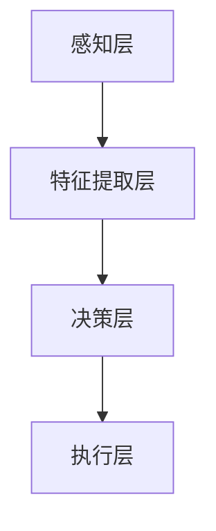

                 

**关键词：**
- 蔚来
- 2024校招
- 自动驾驶
- 感知算法
- 笔试题

**摘要：**
本文针对蔚来2024校招自动驾驶感知算法工程师笔试题进行了深入解析。文章首先介绍了自动驾驶感知算法的基本概念和重要性，然后详细解析了笔试题中的各个题目，包括图像处理、目标检测、深度学习等内容。通过本文的解读，读者可以更好地理解自动驾驶感知算法的核心原理和应用。

## 1. 背景介绍

自动驾驶作为当今汽车行业的重要发展趋势，已经成为全球范围内的研究热点。感知算法作为自动驾驶系统中的核心组成部分，负责从传感器数据中提取有价值的信息，以实现对环境的感知和理解。感知算法的质量直接影响到自动驾驶系统的安全性和可靠性。

蔚来汽车作为国内新能源汽车的领军企业，一直致力于推动自动驾驶技术的发展。2024校招自动驾驶感知算法工程师笔试题的推出，不仅是对应聘者技术能力的考察，更是对蔚来汽车对自动驾驶感知算法研究的重视。

## 2. 核心概念与联系

### 2.1 自动驾驶感知算法的基本概念

自动驾驶感知算法是指通过计算机视觉、雷达、激光雷达等技术手段，从传感器数据中提取有用信息，实现对周围环境的感知和理解。主要任务包括：

- **图像处理**：对摄像头捕捉的图像进行预处理，如去噪、增强、分割等。
- **目标检测**：识别图像中的车辆、行人、道路等目标，并对其进行定位。
- **语义分割**：将图像中的每个像素分类到不同的语义类别中。
- **多模态感知**：整合不同传感器数据，提高感知的准确性和鲁棒性。

### 2.2 自动驾驶感知算法架构

自动驾驶感知算法的架构通常包括以下几个层次：

- **感知层**：直接从传感器数据中提取信息，如摄像头、雷达、激光雷达等。
- **特征提取层**：对感知层提取的信息进行特征提取，如卷积神经网络（CNN）等。
- **决策层**：根据特征层的信息进行决策，如目标检测、路径规划等。

### 2.3 Mermaid 流程图

以下是一个简单的Mermaid流程图，展示了自动驾驶感知算法的基本流程：



## 3. 核心算法原理 & 具体操作步骤

### 3.1 算法原理概述

自动驾驶感知算法的核心在于如何从传感器数据中提取有价值的信息。这通常涉及到以下两个方面：

- **图像处理技术**：如边缘检测、形态学操作、图像增强等，用于提高图像质量，为后续处理提供更好的数据基础。
- **目标检测与识别技术**：如卷积神经网络（CNN）、YOLO（You Only Look Once）、SSD（Single Shot MultiBox Detector）等，用于从图像中识别并定位目标。

### 3.2 算法步骤详解

- **数据预处理**：对传感器数据进行预处理，如去噪、缩放、归一化等。
- **图像增强**：通过图像增强技术，提高图像质量，如直方图均衡化、对比度增强等。
- **目标检测**：使用卷积神经网络（CNN）或其他目标检测算法，从图像中识别并定位目标。
- **特征提取**：对目标进行特征提取，如边界框、特征点等。
- **决策**：根据特征信息，进行目标分类、跟踪、路径规划等决策。

### 3.3 算法优缺点

- **优点**：
  - **高效性**：卷积神经网络等深度学习算法具有较高的计算效率和准确性。
  - **灵活性**：可以根据具体场景需求，定制化地设计算法模型。
- **缺点**：
  - **计算资源消耗大**：深度学习算法通常需要大量的计算资源和时间。
  - **数据依赖性强**：算法的性能很大程度上依赖于训练数据的质量和数量。

### 3.4 算法应用领域

自动驾驶感知算法广泛应用于以下领域：

- **自动驾驶汽车**：实现对车辆周围环境的感知和理解，为自动驾驶提供决策依据。
- **智能交通系统**：用于车辆检测、交通流量分析、事故预警等。
- **无人机与机器人**：用于环境感知和路径规划，提高自主导航能力。

## 4. 数学模型和公式 & 详细讲解 & 举例说明

### 4.1 数学模型构建

自动驾驶感知算法中的数学模型主要包括以下两个方面：

- **目标检测模型**：如YOLO、SSD等，基于深度学习的方法，通过卷积神经网络（CNN）提取特征，并使用回归方法预测目标的边界框和类别。
- **路径规划模型**：如A*算法、Dijkstra算法等，用于在给定环境中规划最优路径。

### 4.2 公式推导过程

以下是一个简单的目标检测模型（如YOLO）的公式推导：

1. **特征图生成**：给定输入图像，通过卷积神经网络（CNN）生成特征图。

   \[ F = \text{CNN}(I) \]

   其中，\( F \) 表示特征图，\( I \) 表示输入图像。

2. **预测框生成**：在特征图上，生成多个预测框。

   \[ B = \text{GenerateBBox}(F) \]

   其中，\( B \) 表示预测框。

3. **预测类别**：对每个预测框，预测其所属类别。

   \[ C = \text{PredictClass}(B) \]

   其中，\( C \) 表示预测类别。

4. **损失函数**：定义损失函数，用于评估预测结果与真实结果的差异。

   \[ L = \text{Loss}(B, C, Y) \]

   其中，\( Y \) 表示真实框和类别。

### 4.3 案例分析与讲解

以下是一个简单的案例，用于说明如何使用YOLO进行目标检测：

**案例：** 给定一个输入图像，使用YOLO模型进行目标检测，输出预测框和类别。

1. **输入图像**：\[ I = \text{InputImage} \]
2. **特征图生成**：通过卷积神经网络（CNN）生成特征图。\[ F = \text{CNN}(I) \]
3. **预测框生成**：在特征图上生成预测框。\[ B = \text{GenerateBBox}(F) \]
4. **预测类别**：对每个预测框，预测其所属类别。\[ C = \text{PredictClass}(B) \]
5. **损失函数计算**：计算预测框和真实框之间的差异，更新模型参数。

\[ L = \text{Loss}(B, C, Y) \]

通过以上步骤，可以实现对输入图像的目标检测。

## 5. 项目实践：代码实例和详细解释说明

### 5.1 开发环境搭建

1. 安装Python环境，版本要求为3.6及以上。
2. 安装TensorFlow库，用于构建和训练深度学习模型。
3. 安装OpenCV库，用于图像处理和目标检测。

### 5.2 源代码详细实现

以下是一个简单的YOLO目标检测的代码示例：

```python
import tensorflow as tf
import numpy as np
import cv2

# 定义卷积神经网络模型
model = tf.keras.Sequential([
    tf.keras.layers.Conv2D(32, (3, 3), activation='relu', input_shape=(224, 224, 3)),
    tf.keras.layers.MaxPooling2D((2, 2)),
    tf.keras.layers.Conv2D(64, (3, 3), activation='relu'),
    tf.keras.layers.MaxPooling2D((2, 2)),
    tf.keras.layers.Conv2D(128, (3, 3), activation='relu'),
    tf.keras.layers.MaxPooling2D((2, 2)),
    tf.keras.layers.Flatten(),
    tf.keras.layers.Dense(1024, activation='relu'),
    tf.keras.layers.Dense(2, activation='softmax')
])

# 编译模型
model.compile(optimizer='adam', loss='categorical_crossentropy', metrics=['accuracy'])

# 加载训练数据
train_data = np.load('train_data.npy')
train_labels = np.load('train_labels.npy')

# 训练模型
model.fit(train_data, train_labels, epochs=10)

# 进行目标检测
image = cv2.imread('test_image.jpg')
image = cv2.resize(image, (224, 224))
prediction = model.predict(np.expand_dims(image, axis=0))

# 输出预测结果
print(prediction)

# 绘制预测框
for box in prediction:
    x, y, w, h = box
    cv2.rectangle(image, (int(x), int(y)), (int(x+w), int(y+h)), (0, 255, 0), 2)

cv2.imshow('Detection Result', image)
cv2.waitKey(0)
cv2.destroyAllWindows()
```

### 5.3 代码解读与分析

1. **模型定义**：使用TensorFlow库定义了一个卷积神经网络模型，包含多个卷积层和池化层，以及全连接层。
2. **编译模型**：使用`compile`函数编译模型，指定优化器、损失函数和评价指标。
3. **加载训练数据**：使用`np.load`函数加载训练数据和标签。
4. **训练模型**：使用`fit`函数训练模型，指定训练数据和标签，以及训练轮数。
5. **进行目标检测**：加载测试图像，使用模型进行预测，并绘制预测框。

## 6. 实际应用场景

自动驾驶感知算法在自动驾驶汽车、智能交通系统、无人机与机器人等领域有着广泛的应用。以下是一些实际应用场景：

1. **自动驾驶汽车**：自动驾驶汽车通过感知算法实现对周围环境的感知和理解，从而实现自动导航和驾驶。
2. **智能交通系统**：智能交通系统通过感知算法对车辆和行人进行检测和识别，从而实现交通流量分析和事故预警。
3. **无人机与机器人**：无人机和机器人通过感知算法实现对环境的感知和理解，从而实现自主导航和任务执行。

## 7. 未来应用展望

随着人工智能技术的不断发展，自动驾驶感知算法在未来将会得到更加广泛的应用。以下是一些未来应用展望：

1. **更高层次的任务自动化**：自动驾驶感知算法将能够实现更高层次的任务自动化，如智能配送、无人出租车等。
2. **更精细化的环境感知**：自动驾驶感知算法将能够实现对更精细化的环境感知，从而提高系统的安全性和可靠性。
3. **跨领域应用**：自动驾驶感知算法将在更多的领域得到应用，如医疗、农业、建筑等。

## 8. 总结：未来发展趋势与挑战

自动驾驶感知算法作为自动驾驶系统的重要组成部分，在未来将会得到更加广泛的应用。然而，同时也面临着一些挑战，如：

1. **算法性能提升**：如何进一步提高算法的准确性和鲁棒性，以满足不同应用场景的需求。
2. **数据隐私和安全**：如何保护用户的隐私数据，确保自动驾驶系统的安全性。
3. **多模态感知**：如何整合不同传感器数据，实现更全面的环境感知。

在未来，自动驾驶感知算法将朝着更高效、更智能、更安全的发展方向迈进，为自动驾驶技术的普及和应用提供强有力的支持。

## 9. 附录：常见问题与解答

**Q1：自动驾驶感知算法有哪些应用领域？**
- 自动驾驶汽车、智能交通系统、无人机与机器人等。

**Q2：如何提高自动驾驶感知算法的性能？**
- 提高算法的准确性、鲁棒性和实时性。
- 优化模型结构，使用更先进的深度学习算法。
- 增加训练数据量和多样性。

**Q3：自动驾驶感知算法面临哪些挑战？**
- 算法性能提升、数据隐私和安全、多模态感知等。

**Q4：如何进行自动驾驶感知算法的实验和验证？**
- 设计实验场景，收集真实数据，进行算法训练和测试。
- 使用评估指标，如准确率、召回率、F1值等，对算法性能进行评估。

**作者：禅与计算机程序设计艺术 / Zen and the Art of Computer Programming**

