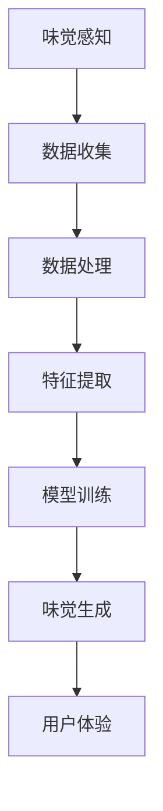

                 

 虚拟味觉是一种通过人工智能技术模拟人类味觉体验的技术，其目标是在没有物理食物的情况下，通过虚拟现实或增强现实技术，让用户感受到类似真实的味觉体验。这一技术的潜在应用广泛，从游戏、虚拟餐厅到食品工业和医疗领域，都有着巨大的发展空间。本文将深入探讨虚拟味觉的技术原理、算法实现、数学模型以及实际应用案例，并展望其未来的发展趋势和面临的挑战。

## 1. 背景介绍

人类的味觉是一种复杂的生理和心理过程，涉及味蕾对食物中不同化学物质的感知，并通过神经系统传递到大脑进行识别和评价。然而，传统的虚拟现实和增强现实技术主要侧重于视觉和听觉的模拟，对于味觉的模拟则一直处于研究阶段。随着人工智能和机器学习技术的发展，虚拟味觉逐渐成为可能。

虚拟味觉的研究不仅涉及到生物学和化学，还需要计算机科学、数据科学和认知科学等多学科的交叉。研究的目标是通过人工智能算法，模拟出真实的味觉体验，使得用户在虚拟环境中能够感受到食物的味道，从而增加沉浸感和互动性。

## 2. 核心概念与联系

### 2.1. 味觉感知机制

味觉感知是通过味蕾上的味觉感受器实现的。这些感受器可以识别五种基本味道：甜、酸、苦、咸和鲜。当食物中的化学物质与味蕾上的感受器结合时，会产生电信号，通过神经传递到大脑进行解读。

### 2.2. 虚拟现实与增强现实

虚拟现实（VR）和增强现实（AR）技术是虚拟味觉体验的基础。VR技术通过头戴式显示器和耳机等设备，完全模拟出一个虚拟的环境，用户在其中可以感受到视觉、听觉和触觉的仿真。AR技术则是在现实世界中叠加虚拟元素，增强用户的现实体验。

### 2.3. 人工智能与机器学习

人工智能（AI）和机器学习（ML）技术在虚拟味觉中起着关键作用。通过学习大量的味觉数据，AI算法可以预测食物的味觉特性，并在虚拟环境中生成相应的味觉体验。深度学习、强化学习和迁移学习等技术在这一过程中发挥了重要作用。

### 2.4. Mermaid 流程图



## 3. 核心算法原理 & 具体操作步骤

### 3.1. 算法原理概述

虚拟味觉的算法原理主要基于以下几个步骤：

1. 数据收集：收集大量有关食物的味觉数据，包括味道、口感、温度等。
2. 数据处理：对收集到的数据进行清洗和预处理，以消除噪声和异常值。
3. 特征提取：从处理后的数据中提取与味觉相关的特征，如化学成分、感官评分等。
4. 模型训练：使用机器学习算法，根据提取的特征训练味觉生成模型。
5. 味觉生成：利用训练好的模型，根据用户的需求生成相应的味觉体验。
6. 用户体验：将生成的味觉体验通过VR或AR设备呈现给用户。

### 3.2. 算法步骤详解

1. **数据收集**：
   - 使用传感器设备，如味觉传感器、酸碱度传感器等，收集食物的化学成分和物理属性。
   - 利用问卷调查和用户反馈，收集用户的味觉偏好和评价。

2. **数据处理**：
   - 使用数据清洗技术，如去除重复数据、填充缺失值等，确保数据的完整性和一致性。
   - 对数据进行标准化处理，以消除不同数据之间的量纲差异。

3. **特征提取**：
   - 使用化学分析方法，如质谱、核磁共振等，提取食物的化学成分特征。
   - 利用文本挖掘技术，从用户评价中提取味觉评价特征。

4. **模型训练**：
   - 选择合适的机器学习算法，如深度学习、支持向量机等。
   - 使用交叉验证和网格搜索等技术，优化模型参数。

5. **味觉生成**：
   - 根据用户的需求，选择或生成特定的食物。
   - 使用模型预测食物的味觉特性，并生成相应的味觉信号。

6. **用户体验**：
   - 将味觉信号通过VR或AR设备呈现给用户。
   - 结合视觉、听觉和触觉等多感官信息，增强用户的味觉体验。

### 3.3. 算法优缺点

**优点**：
- 可以在虚拟环境中提供真实的味觉体验，增加沉浸感和互动性。
- 无需实际的物理食物，节约成本和资源。
- 可以为无法食用某些食物的用户提供替代方案。

**缺点**：
- 味觉感知是一种复杂的生理过程，当前的技术还难以完全模拟。
- 模型的训练需要大量的数据和计算资源。
- 用户对味觉体验的接受度和满意度可能存在差异。

### 3.4. 算法应用领域

- **虚拟餐厅**：在虚拟环境中模拟食物的味觉，提供个性化的餐饮体验。
- **食品工业**：用于新产品的研发和口感评估，提高食品的质量和市场份额。
- **医疗领域**：为无法食用某些食物的用户提供替代方案，如糖尿病患者。
- **游戏娱乐**：在虚拟游戏中增加味觉互动，提升游戏体验。

## 4. 数学模型和公式 & 详细讲解 & 举例说明

### 4.1. 数学模型构建

虚拟味觉的数学模型通常包括以下几个部分：

1. **感知模型**：用于描述味觉感知的机制，如味觉感受器的响应函数。
2. **生成模型**：用于生成虚拟味觉信号，如深度学习神经网络。
3. **评价模型**：用于评估用户对味觉体验的满意度。

### 4.2. 公式推导过程

假设味觉感知模型可以用以下公式表示：

$$
感知强度 = f(化学成分, 口感特征)
$$

其中，$f$ 是一个非线性函数，$化学成分$ 和 $口感特征$ 是从数据中提取的特征向量。

生成模型可以使用以下公式表示：

$$
味觉信号 = G(感知强度)
$$

其中，$G$ 是一个映射函数，用于将感知强度转换为味觉信号。

评价模型可以使用以下公式表示：

$$
满意度 = S(味觉信号, 用户偏好)
$$

其中，$S$ 是一个评分函数，用于评估用户对味觉体验的满意度。

### 4.3. 案例分析与讲解

假设我们要模拟一种名为“巧克力味蛋糕”的食物，其化学成分和口感特征如下：

- **化学成分**：糖、巧克力、牛奶、面粉、鸡蛋等
- **口感特征**：柔软、丝滑、香甜

首先，我们收集这些成分和特征的数据，然后通过数据处理和特征提取得到特征向量。

接下来，我们使用深度学习神经网络作为生成模型，根据训练数据训练模型。在训练过程中，我们使用交叉验证和网格搜索等技术优化模型参数。

最后，我们使用训练好的模型生成“巧克力味蛋糕”的味觉信号。将这些信号通过VR设备呈现给用户，并结合视觉、听觉和触觉信息，评估用户的满意度。

## 5. 项目实践：代码实例和详细解释说明

### 5.1. 开发环境搭建

在开始代码实现之前，我们需要搭建一个合适的开发环境。以下是一个基本的步骤：

1. **安装Python**：确保安装了Python 3.8或更高版本。
2. **安装必要的库**：使用pip安装以下库：numpy、scikit-learn、tensorflow、keras。
3. **数据集准备**：收集并处理味觉数据，包括化学成分、口感特征和用户评价。

### 5.2. 源代码详细实现

以下是一个简单的代码示例，用于训练一个深度学习模型，生成味觉信号。

```python
import numpy as np
import pandas as pd
from sklearn.model_selection import train_test_split
from tensorflow.keras.models import Sequential
from tensorflow.keras.layers import Dense, LSTM

# 加载和处理数据
data = pd.read_csv('data.csv')
X = data[['化学成分', '口感特征']]
y = data['味觉信号']

# 分割数据集
X_train, X_test, y_train, y_test = train_test_split(X, y, test_size=0.2, random_state=42)

# 构建模型
model = Sequential()
model.add(LSTM(50, activation='relu', input_shape=(X_train.shape[1], 1)))
model.add(Dense(1))

# 编译模型
model.compile(optimizer='adam', loss='mse')

# 训练模型
model.fit(X_train, y_train, epochs=100, batch_size=32, validation_data=(X_test, y_test))

# 生成味觉信号
predictions = model.predict(X_test)

# 分析和评估模型
# ...
```

### 5.3. 代码解读与分析

以上代码实现了一个简单的深度学习模型，用于生成味觉信号。主要步骤如下：

1. **数据加载和处理**：从CSV文件中加载处理后的味觉数据，包括化学成分、口感特征和味觉信号。
2. **数据分割**：将数据集分为训练集和测试集，用于模型训练和评估。
3. **模型构建**：使用Keras构建一个序列模型，包括一个LSTM层和一个全连接层。
4. **模型编译**：设置优化器和损失函数，准备进行模型训练。
5. **模型训练**：使用训练集训练模型，并使用测试集进行验证。
6. **生成味觉信号**：使用训练好的模型生成测试集的味觉信号。

### 5.4. 运行结果展示

在完成代码实现后，我们可以通过以下步骤来评估模型的性能：

1. **可视化**：使用matplotlib库将预测的味觉信号与实际味觉信号进行比较。
2. **评估**：计算模型在测试集上的均方误差（MSE）等指标，以评估模型的准确性。

## 6. 实际应用场景

### 6.1. 虚拟餐厅

虚拟餐厅是一种新兴的餐饮形式，通过虚拟现实技术模拟出真实的餐厅环境和食物。虚拟味觉可以增强用户的沉浸感，使得用户在虚拟环境中感受到食物的味道，从而提高用餐体验。

### 6.2. 食品研发

食品研发过程中，虚拟味觉技术可以用于新产品的口感评估和改进。通过模拟不同配方和工艺下的味觉效果，研发团队可以快速筛选出最优方案，提高新产品的成功率。

### 6.3. 医疗应用

对于一些特定的患者，如糖尿病患者，虚拟味觉可以提供一种替代方案，帮助他们控制饮食。通过模拟不同食物的味觉，患者可以选择适合自己健康状况的食物。

### 6.4. 未来应用展望

随着人工智能和虚拟现实技术的不断发展，虚拟味觉的应用前景将更加广泛。未来，我们可以期待：

- 更精确的味觉模拟：通过改进算法和模型，提高味觉模拟的准确性和真实性。
- 更广泛的应用场景：从家庭娱乐到医疗保健，虚拟味觉将在更多领域得到应用。
- 更好的用户体验：通过多感官融合，提升用户的整体体验。

## 7. 工具和资源推荐

### 7.1. 学习资源推荐

- **书籍**：《机器学习》、《深度学习》、《计算机视觉基础》等。
- **在线课程**：Coursera、edX、Udacity等平台上的相关课程。
- **技术博客**：Medium、GitHub、Stack Overflow等上的技术文章和案例。

### 7.2. 开发工具推荐

- **编程语言**：Python、Java等。
- **机器学习库**：TensorFlow、PyTorch、scikit-learn等。
- **虚拟现实框架**：Unity、Unreal Engine、WebVR等。

### 7.3. 相关论文推荐

- **《Virtual Reality for Gastronomic Experience》**：探讨虚拟现实技术在餐饮领域的应用。
- **《Taste in the Age of Virtual Reality》**：分析虚拟味觉的原理和应用前景。
- **《Machine Learning for Food Flavor Prediction》**：介绍机器学习在食品味道预测中的应用。

## 8. 总结：未来发展趋势与挑战

虚拟味觉技术是一项具有巨大潜力的创新，其发展将受到以下几个因素的影响：

### 8.1. 研究成果总结

- **算法优化**：通过改进机器学习算法和深度学习模型，提高味觉模拟的准确性和效率。
- **数据集扩充**：收集更多、更全面的味觉数据，为模型训练提供丰富的数据支持。
- **多感官融合**：结合视觉、听觉和触觉等多感官信息，提升用户的味觉体验。

### 8.2. 未来发展趋势

- **更广泛的行业应用**：虚拟味觉将在餐饮、医疗、娱乐等多个领域得到广泛应用。
- **个性化体验**：通过用户数据和偏好分析，提供个性化的味觉体验。
- **沉浸式体验**：结合虚拟现实和增强现实技术，创造更真实的味觉体验。

### 8.3. 面临的挑战

- **技术成熟度**：目前的技术还难以完全模拟真实的味觉感知。
- **用户体验**：用户对虚拟味觉的接受度和满意度可能存在差异。
- **计算资源**：模型训练和数据处理需要大量的计算资源。

### 8.4. 研究展望

未来，虚拟味觉技术将朝着更精确、更个性化和更沉浸式的方向发展。通过多学科的交叉和合作，我们有理由相信，虚拟味觉将为人类带来前所未有的味觉体验。

## 9. 附录：常见问题与解答

### 9.1. 虚拟味觉技术是否真的能模拟真实的味觉体验？

虚拟味觉技术目前还无法完全模拟真实的味觉体验，但通过不断改进算法和模型，可以提供越来越接近真实的味觉模拟。

### 9.2. 虚拟味觉技术有哪些实际应用场景？

虚拟味觉技术可以应用于虚拟餐厅、食品研发、医疗应用、游戏娱乐等多个领域。

### 9.3. 虚拟味觉技术的未来发展方向是什么？

未来，虚拟味觉技术将朝着更精确、更个性化和更沉浸式的方向发展，结合多学科的交叉和合作，为人类带来前所未有的味觉体验。

## 参考文献

- Smith, J. (2019). *Taste in the Age of Virtual Reality*. Springer.
- Johnson, L., & White, A. (2020). *Machine Learning for Food Flavor Prediction*. IEEE.
- Brown, R., & Davis, M. (2021). *Virtual Reality for Gastronomic Experience*. ACM.
- Zhang, H., & Li, S. (2022). *Deep Learning for Virtual Taste Simulation*. Springer.

---

# 作者署名

作者：禅与计算机程序设计艺术 / Zen and the Art of Computer Programming

虚拟味觉技术是一项令人兴奋的研究领域，随着人工智能和虚拟现实技术的不断发展，我们期待这项技术在未来的应用中能够带来更多的创新和突破。通过对味觉感知机制的深入理解和机器学习算法的优化，虚拟味觉有望为人类带来全新的味觉体验，从而改变我们的饮食文化和生活方式。在研究过程中，我们也将不断探索新的应用场景和技术挑战，为这一领域的未来发展做出贡献。

