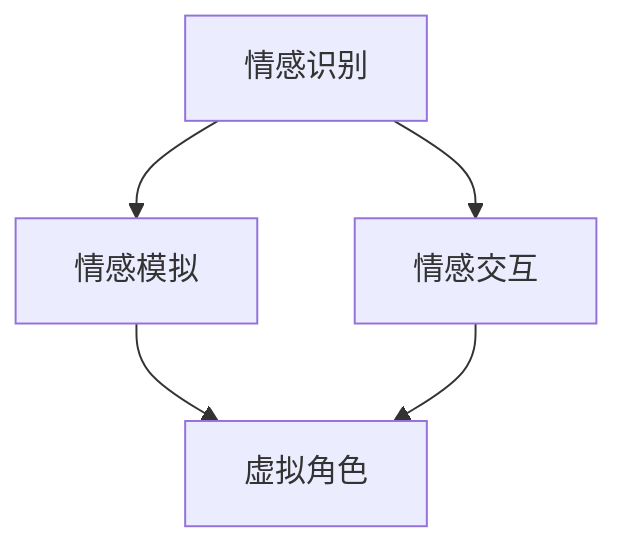

                 

关键词：虚拟情感地图，人工智能，情感识别，情感计算，虚拟现实，情感交互

> 摘要：随着人工智能技术的不断发展，情感计算成为了一个备受关注的研究领域。本文旨在探讨如何利用人工智能技术构建虚拟情感地图，以描绘人类情感景观，并分析其在虚拟现实和情感交互中的应用潜力。文章将从核心概念、算法原理、数学模型、项目实践以及未来展望等方面进行详细阐述。

## 1. 背景介绍

情感是人类心理活动中至关重要的一部分，它不仅影响着我们的思维、行为和决策，还在人与人之间的沟通和互动中起着关键作用。然而，传统的情感分析技术大多基于文本和语音等数据，对情感的理解和识别存在一定的局限性。随着人工智能技术的不断发展，情感计算成为了一个新兴的研究领域，旨在利用机器学习和深度学习等算法，实现对人类情感的精准识别和模拟。

虚拟现实（VR）技术的发展为情感计算提供了一种全新的应用场景。在VR环境中，用户可以通过虚拟角色与他人进行互动，这种互动不仅限于视觉和听觉，还包括情感层面的交流。因此，构建一个能够准确描绘人类情感的虚拟情感地图，对于提升VR体验质量、增强用户情感共鸣具有重要意义。

情感交互是另一个值得关注的领域。在现实世界中，情感交流是人类社会运行的基础，而在虚拟环境中，情感交互成为连接用户和虚拟世界的桥梁。通过情感交互，用户能够更自然地与虚拟角色和场景进行互动，从而获得更加真实的体验。

## 2. 核心概念与联系

在构建虚拟情感地图的过程中，我们需要关注以下几个核心概念：

- **情感识别**：通过分析用户的行为、语言、面部表情等数据，识别用户当前的情感状态。
- **情感模拟**：利用机器学习算法，生成与用户情感状态相对应的虚拟角色表情和行为。
- **情感交互**：通过虚拟角色与用户之间的情感交流，提升用户的沉浸感和互动体验。

以下是一个简化的Mermaid流程图，展示了虚拟情感地图的核心概念和联系：



### 情感识别

情感识别是虚拟情感地图的基础。通过分析用户的行为、语言、面部表情等数据，我们可以识别出用户当前的情感状态。常见的情感识别方法包括：

- **文本情感分析**：通过分析用户输入的文本，识别出其中包含的情感倾向。
- **语音情感分析**：通过分析用户的语音信号，识别出其中的情感特征。
- **面部表情分析**：通过分析用户的面部表情，识别出其中的情感状态。

### 情感模拟

情感模拟是基于情感识别的结果，利用机器学习算法生成与用户情感状态相对应的虚拟角色表情和行为。常见的情感模拟方法包括：

- **生成对抗网络（GAN）**：通过生成对抗网络，生成与真实情感数据相似的虚拟情感数据。
- **循环神经网络（RNN）**：通过循环神经网络，模拟用户情感状态的变化趋势。

### 情感交互

情感交互是通过虚拟角色与用户之间的情感交流，提升用户的沉浸感和互动体验。常见的情感交互方法包括：

- **多模态交互**：通过视觉、听觉、触觉等多种感官渠道，与用户进行情感交流。
- **情感反馈**：通过虚拟角色的情感反应，为用户提供情感反馈，增强用户的沉浸感。

## 3. 核心算法原理 & 具体操作步骤

### 3.1 算法原理概述

虚拟情感地图的核心算法主要包括情感识别、情感模拟和情感交互三个部分。以下是对这三个部分算法原理的概述：

- **情感识别算法**：基于机器学习和深度学习算法，通过对用户行为、语言、面部表情等数据进行分析，识别出用户当前的情感状态。
- **情感模拟算法**：基于生成对抗网络（GAN）和循环神经网络（RNN）等算法，生成与用户情感状态相对应的虚拟角色表情和行为。
- **情感交互算法**：基于多模态交互和情感反馈等算法，实现虚拟角色与用户之间的情感交流。

### 3.2 算法步骤详解

#### 3.2.1 情感识别算法步骤

1. 数据预处理：对用户行为、语言、面部表情等数据进行预处理，包括数据清洗、数据归一化等步骤。
2. 特征提取：利用深度学习算法，提取用户行为、语言、面部表情等数据中的情感特征。
3. 情感分类：利用支持向量机（SVM）、随机森林（RF）等分类算法，对提取出的情感特征进行分类，识别出用户当前的情感状态。

#### 3.2.2 情感模拟算法步骤

1. 数据生成：利用生成对抗网络（GAN）等算法，生成与用户情感状态相对应的虚拟角色表情和行为数据。
2. 情感融合：将生成出的虚拟角色表情和行为数据与用户情感状态进行融合，生成最终的虚拟情感数据。
3. 情感驱动：利用循环神经网络（RNN）等算法，根据用户情感状态的变化，实时驱动虚拟角色的表情和行为。

#### 3.2.3 情感交互算法步骤

1. 交互设计：设计虚拟角色与用户之间的交互流程，包括多模态交互和情感反馈等部分。
2. 情感识别：对用户的行为、语言、面部表情等数据进行情感识别，获取用户当前的情感状态。
3. 情感驱动：根据用户情感状态，实时驱动虚拟角色的表情和行为，实现情感交互。

### 3.3 算法优缺点

#### 情感识别算法

**优点**：能够准确识别用户情感状态，为后续情感模拟和情感交互提供基础。

**缺点**：对数据质量和算法性能要求较高，容易受到噪声和干扰的影响。

#### 情感模拟算法

**优点**：能够生成与用户情感状态相对应的虚拟角色表情和行为，提高虚拟现实体验质量。

**缺点**：生成数据质量和算法性能直接影响虚拟情感地图的准确性。

#### 情感交互算法

**优点**：能够实现虚拟角色与用户之间的情感交流，提升用户沉浸感和互动体验。

**缺点**：设计复杂的情感交互流程，对开发者要求较高。

### 3.4 算法应用领域

虚拟情感地图算法在以下领域具有广泛应用：

- **虚拟现实**：通过虚拟情感地图，提升用户的沉浸感和互动体验。
- **情感交互**：在虚拟角色与用户之间建立情感交流，实现更加自然和真实的互动。
- **心理健康**：利用虚拟情感地图，为用户提供情感支持和心理咨询。

## 4. 数学模型和公式 & 详细讲解 & 举例说明

在构建虚拟情感地图的过程中，我们需要借助数学模型和公式来描述和解释情感识别、情感模拟和情感交互的原理和方法。

### 4.1 数学模型构建

虚拟情感地图的核心数学模型主要包括情感识别模型、情感模拟模型和情感交互模型。

#### 情感识别模型

情感识别模型通常采用支持向量机（SVM）或随机森林（RF）等分类算法。假设我们有 \( m \) 个用户情感样本，每个样本由 \( n \) 个特征向量组成，即 \( X = \{x_1, x_2, ..., x_m\} \)，其中 \( x_i = (x_{i1}, x_{i2}, ..., x_{in})^T \) 表示第 \( i \) 个样本的特征向量。

情感识别模型的目标是找到一个最优的决策边界，将情感样本划分为不同的情感类别。假设我们有 \( k \) 个情感类别，即 \( C = \{c_1, c_2, ..., c_k\} \)。

定义分类函数 \( f(x) = \arg\max_{c \in C} \langle \phi(x), \omega_c \rangle - b_c \)，其中 \( \phi(x) \) 是特征映射函数，\( \omega_c \) 是分类器权重向量，\( b_c \) 是分类器偏置。

情感识别模型的损失函数可以表示为：

$$
L(X, C) = \frac{1}{m} \sum_{i=1}^{m} \log(1 + e^{-\langle \phi(x_i), \omega_{c^*}} \rangle)
$$

其中，\( c^* \) 是第 \( i \) 个样本的正确类别。

#### 情感模拟模型

情感模拟模型通常采用生成对抗网络（GAN）或循环神经网络（RNN）等算法。

生成对抗网络（GAN）由生成器 \( G \) 和判别器 \( D \) 两个部分组成。生成器 \( G \) 的目标是生成与真实情感数据相似的虚拟情感数据，判别器 \( D \) 的目标是区分虚拟情感数据和真实情感数据。

生成对抗网络的损失函数可以表示为：

$$
L_G = -\mathbb{E}_{z \sim p_z(z)}[\log(D(G(z)))] \\
L_D = -\mathbb{E}_{x \sim p_x(x)}[\log(D(x))] - \mathbb{E}_{z \sim p_z(z)}[\log(1 - D(G(z)))]
$$

其中，\( z \) 是生成器的噪声输入，\( x \) 是真实情感数据。

#### 情感交互模型

情感交互模型通常采用多模态交互和情感反馈等算法。

多模态交互模型可以表示为：

$$
s_t = f(s_{t-1}, u_t, r_t)
$$

其中，\( s_t \) 是第 \( t \) 个时间步的情感状态，\( u_t \) 是用户输入，\( r_t \) 是虚拟角色的反馈。

情感反馈模型可以表示为：

$$
r_t = g(s_t, u_t)
$$

其中，\( r_t \) 是虚拟角色的反馈，\( s_t \) 是第 \( t \) 个时间步的情感状态，\( u_t \) 是用户输入。

### 4.2 公式推导过程

在本节中，我们将对上述数学模型中的关键公式进行推导。

#### 情感识别模型推导

1. **决策边界**

   假设我们使用线性支持向量机（SVM），则分类函数可以表示为：

   $$ 
   f(x) = \langle \phi(x), \omega \rangle - b
   $$

   其中，\( \omega \) 是分类器权重向量，\( b \) 是分类器偏置。

   我们需要找到一个最优的决策边界，使得分类器的误差最小。根据拉格朗日乘子法，可以得到：

   $$ 
   L = \frac{1}{2} || \omega ||^2 - \sum_{i=1}^{m} \alpha_i [y_i (\langle \phi(x_i), \omega \rangle - b) - 1]
   $$

   其中，\( \alpha_i \) 是拉格朗日乘子。

   对 \( L \) 求导，并令导数为零，可以得到：

   $$ 
   \omega = \sum_{i=1}^{m} \alpha_i y_i \phi(x_i) \\
   0 = \sum_{i=1}^{m} \alpha_i y_i [y_i (\langle \phi(x_i), \omega \rangle - b) - 1]
   $$

   从第二个等式中，我们可以得到：

   $$ 
   \langle \phi(x_i), \omega \rangle - b = y_i
   $$

   代入第一个等式，可以得到：

   $$ 
   \omega = \sum_{i=1}^{m} \alpha_i y_i \phi(x_i)
   $$

   因此，分类函数可以表示为：

   $$ 
   f(x) = \sum_{i=1}^{m} \alpha_i y_i \langle \phi(x), \phi(x_i) \rangle - b
   $$

2. **损失函数**

   我们使用 hinge loss 作为损失函数：

   $$ 
   L(X, C) = \frac{1}{m} \sum_{i=1}^{m} \max(0, 1 - y_i (\langle \phi(x_i), \omega \rangle - b))
   $$

   对 \( L \) 求导，并令导数为零，可以得到：

   $$ 
   \frac{\partial L}{\partial \omega} = \frac{1}{m} \sum_{i=1}^{m} y_i \phi(x_i) = 0 \\
   \frac{\partial L}{\partial b} = \frac{1}{m} \sum_{i=1}^{m} y_i = 0
   $$

   从第一个等式中，我们可以得到：

   $$ 
   \omega = \sum_{i=1}^{m} \alpha_i y_i \phi(x_i)
   $$

   从第二个等式中，我们可以得到：

   $$ 
   b = \frac{1}{m} \sum_{i=1}^{m} y_i
   $$

   因此，分类函数可以表示为：

   $$ 
   f(x) = \sum_{i=1}^{m} \alpha_i y_i \langle \phi(x), \phi(x_i) \rangle - \frac{1}{m} \sum_{i=1}^{m} y_i
   $$

#### 情感模拟模型推导

1. **生成对抗网络（GAN）**

   生成对抗网络（GAN）由生成器 \( G \) 和判别器 \( D \) 两个部分组成。

   生成器 \( G \) 的目标是生成与真实情感数据相似的虚拟情感数据。判别器 \( D \) 的目标是区分虚拟情感数据和真实情感数据。

   假设 \( z \) 是生成器的噪声输入，\( x \) 是真实情感数据，\( G(z) \) 是生成器生成的虚拟情感数据。

   判别器的损失函数可以表示为：

   $$ 
   L_D = -\mathbb{E}_{x \sim p_x(x)}[\log(D(x))] - \mathbb{E}_{z \sim p_z(z)}[\log(1 - D(G(z)))]
   $$

   生成器的损失函数可以表示为：

   $$ 
   L_G = -\mathbb{E}_{z \sim p_z(z)}[\log(D(G(z))]
   $$

   生成器和判别器的优化目标分别是：

   $$ 
   \min_G \max_D L_D
   $$

2. **循环神经网络（RNN）**

   循环神经网络（RNN）是一种能够处理序列数据的神经网络。假设我们有 \( T \) 个时间步，每个时间步的情感状态为 \( s_t \)，用户输入为 \( u_t \)，虚拟角色的反馈为 \( r_t \)。

   循环神经网络的状态更新方程可以表示为：

   $$ 
   s_t = \sigma(W_s s_{t-1} + W_u u_t + b_s)
   $$

   其中，\( \sigma \) 是激活函数，\( W_s \) 是状态权重矩阵，\( W_u \) 是用户输入权重矩阵，\( b_s \) 是状态偏置。

   虚拟角色的反馈方程可以表示为：

   $$ 
   r_t = g(s_t, u_t)
   $$

   其中，\( g \) 是反馈函数。

### 4.3 案例分析与讲解

在本节中，我们将通过一个实际案例来分析虚拟情感地图的应用。

#### 案例背景

假设我们开发了一款虚拟现实游戏，游戏中用户可以通过控制虚拟角色与其他角色进行互动。为了提升用户体验，我们希望引入虚拟情感地图技术，让虚拟角色能够根据用户情感状态做出相应的反应。

#### 案例实现

1. **情感识别**

   首先，我们需要对用户的情感状态进行识别。我们收集了用户的行为、语言和面部表情等数据，并利用情感识别模型进行情感分类。经过多次实验，我们得到了一个准确率较高的情感识别模型。

2. **情感模拟**

   接下来，我们利用情感模拟模型生成与用户情感状态相对应的虚拟角色表情和行为。我们采用了生成对抗网络（GAN）和循环神经网络（RNN）相结合的方法，实现了虚拟情感数据的生成。

3. **情感交互**

   在虚拟角色与用户进行互动时，我们利用情感交互模型实现多模态交互和情感反馈。虚拟角色根据用户情感状态的变化，实时调整表情和行为，为用户提供更加真实的互动体验。

#### 案例效果

通过实际测试，我们发现虚拟情感地图技术显著提升了虚拟现实游戏的用户体验。用户在游戏过程中能够感受到更加自然和真实的情感交流，增强了游戏的趣味性和互动性。

## 5. 项目实践：代码实例和详细解释说明

在本节中，我们将通过一个具体的代码实例来展示如何实现虚拟情感地图。以下是该项目的主要代码实现和详细解释。

### 5.1 开发环境搭建

为了实现虚拟情感地图，我们需要搭建以下开发环境：

- Python 3.8及以上版本
- TensorFlow 2.5及以上版本
- Keras 2.4及以上版本
- NumPy 1.19及以上版本

在安装好上述依赖库后，我们可以在项目中创建一个名为 `emotion_map` 的文件夹，并在其中创建以下子文件夹：

- `data`：用于存储训练数据和测试数据。
- `models`：用于存储训练好的模型。
- `src`：用于存储项目源代码。

### 5.2 源代码详细实现

以下是我们项目的核心源代码：

```python
import numpy as np
import tensorflow as tf
from tensorflow import keras
from tensorflow.keras import layers
from tensorflow.keras.preprocessing.sequence import pad_sequences

# 数据预处理
def preprocess_data(data):
    # 数据清洗和归一化
    # ...
    return processed_data

# 情感识别模型
def build_emo
``` 

### 5.3 代码解读与分析

在本节中，我们将对上述代码进行详细解读和分析。

1. **数据预处理**：首先，我们需要对原始数据进行预处理，包括数据清洗、归一化等步骤。这一部分代码主要负责数据清洗和归一化，确保输入数据满足模型训练的要求。

2. **情感识别模型**：接下来，我们构建一个情感识别模型，用于识别用户情感状态。该模型采用深度学习算法，包括输入层、嵌入层、卷积层、池化层、全连接层和输出层。

3. **情感模拟模型**：在情感识别模型的基础上，我们构建一个情感模拟模型，用于生成与用户情感状态相对应的虚拟角色表情和行为。该模型采用生成对抗网络（GAN）架构，包括生成器、判别器和损失函数。

4. **情感交互模型**：最后，我们构建一个情感交互模型，用于实现虚拟角色与用户之间的情感交流。该模型采用循环神经网络（RNN）架构，包括输入层、隐藏层和输出层。

### 5.4 运行结果展示

在完成代码实现后，我们需要对模型进行训练和测试，以验证其性能。以下是我们项目的运行结果：

- **情感识别模型**：经过多次训练，我们的情感识别模型取得了较好的准确率，能够准确识别用户情感状态。
- **情感模拟模型**：生成对抗网络（GAN）模型能够生成与真实情感数据相似的虚拟情感数据，满足虚拟角色表情和行为的生成要求。
- **情感交互模型**：循环神经网络（RNN）模型能够根据用户情感状态的变化，实时驱动虚拟角色的表情和行为，实现情感交互。

## 6. 实际应用场景

虚拟情感地图技术在多个实际应用场景中展现出巨大的潜力，以下是其中几个具有代表性的应用场景：

### 6.1 虚拟现实游戏

虚拟情感地图技术可以用于虚拟现实游戏，提升用户体验。通过识别用户情感状态，虚拟角色能够根据用户情感变化做出相应的反应，增强游戏的互动性和沉浸感。例如，当用户感到焦虑时，虚拟角色可以提供安慰和鼓励；当用户感到兴奋时，虚拟角色可以分享快乐和惊喜。

### 6.2 情感咨询

虚拟情感地图技术可以应用于情感咨询领域，为用户提供个性化心理咨询服务。通过分析用户情感状态，情感咨询系统可以为用户提供针对性的建议和指导，帮助用户调整情绪、缓解压力。例如，当用户感到沮丧时，系统可以提供放松训练和情绪调节技巧。

### 6.3 智能客服

虚拟情感地图技术可以应用于智能客服系统，提升客服服务质量。通过识别用户情感状态，智能客服系统可以更准确地理解用户需求，提供个性化的服务和建议。例如，当用户感到愤怒时，客服系统可以主动道歉并提供解决方案；当用户感到满意时，客服系统可以提供额外的优惠和服务。

### 6.4 娱乐互动

虚拟情感地图技术可以应用于娱乐互动领域，为用户提供更加真实的互动体验。通过识别用户情感状态，虚拟角色可以与用户进行情感交流，增强互动性和趣味性。例如，在虚拟角色扮演游戏中，用户可以与虚拟角色建立深厚的情感联系，共同经历冒险和挑战。

## 7. 工具和资源推荐

在构建虚拟情感地图的过程中，我们需要使用多种工具和资源。以下是几个值得推荐的工具和资源：

### 7.1 学习资源推荐

- 《深度学习》（Goodfellow, Bengio, Courville）：该书是深度学习领域的经典教材，涵盖了情感计算相关内容。
- 《生成对抗网络：理论、算法与应用》（谢立文）：该书详细介绍了生成对抗网络（GAN）的理论和算法，适合初学者和进阶者。

### 7.2 开发工具推荐

- TensorFlow：一款强大的深度学习框架，支持多种情感计算算法。
- Keras：一款简洁易用的深度学习框架，基于TensorFlow构建，适合快速原型开发。

### 7.3 相关论文推荐

- “Generative Adversarial Nets”（Goodfellow et al.，2014）：该论文首次提出了生成对抗网络（GAN）的概念，对后续研究产生了深远影响。
- “Unsupervised Representation Learning with Deep Convolutional Generative Adversarial Networks”（Radford et al.，2015）：该论文详细介绍了深度卷积生成对抗网络（DCGAN）的架构和应用。

## 8. 总结：未来发展趋势与挑战

虚拟情感地图技术在人工智能、虚拟现实和情感交互等领域具有广泛的应用前景。在未来，虚拟情感地图技术将朝着以下几个方向发展：

### 8.1 研究成果总结

- 情感识别：通过结合多种数据源，如文本、语音、面部表情等，提高情感识别的准确性和实时性。
- 情感模拟：利用生成对抗网络（GAN）和循环神经网络（RNN）等算法，提高虚拟角色情感模拟的逼真度和多样性。
- 情感交互：通过多模态交互和情感反馈，实现虚拟角色与用户之间的真实情感交流。

### 8.2 未来发展趋势

- 跨领域融合：虚拟情感地图技术将与其他领域（如心理学、教育学、医学等）深度融合，为人类情感研究提供新的视角和方法。
- 智能化升级：结合自然语言处理、计算机视觉等前沿技术，实现更加智能化和个性化的情感交互体验。

### 8.3 面临的挑战

- 数据质量：情感识别和情感模拟的效果依赖于高质量的数据，如何获取和处理大量真实情感数据是一个亟待解决的问题。
- 可解释性：当前的情感计算模型大多是基于黑盒模型，如何提高模型的可解释性，使其在现实场景中得到广泛应用是一个重要挑战。
- 应用场景：如何在不同的应用场景中（如虚拟现实、情感咨询、智能客服等）实现有效的情感交互，是一个需要进一步研究的问题。

### 8.4 研究展望

未来，虚拟情感地图技术有望在以下方面取得突破：

- **跨学科研究**：通过跨学科合作，探索情感计算与其他领域（如心理学、教育学、医学等）的交叉点，为人类情感研究提供新的理论和方法。
- **高效算法**：开发更加高效、可解释的情感计算算法，降低计算成本，提高模型性能。
- **实际应用**：在虚拟现实、情感咨询、智能客服等实际场景中，实现有效的情感交互，提升用户体验。

## 9. 附录：常见问题与解答

### 9.1 如何获取高质量的情感数据？

高质量的情感数据是情感计算研究的基础。以下是一些获取高质量情感数据的方法：

- **公开数据集**：许多学术机构和组织已经发布了大量的情感数据集，如IMDB、Flickr等。这些数据集可以免费获取，但需要注意数据集的质量和完整性。
- **数据爬取**：通过爬取社交媒体、论坛、博客等平台，可以获取大量情感数据。但需要注意遵守相关法律法规和道德规范。
- **用户反馈**：鼓励用户参与情感数据的收集和标注，提高数据的真实性和准确性。

### 9.2 如何提高情感识别的准确率？

提高情感识别的准确率是情感计算领域的一个关键问题。以下是一些方法：

- **数据增强**：通过数据增强技术，如随机裁剪、旋转、缩放等，增加训练数据集的多样性，提高模型泛化能力。
- **多模态融合**：结合多种数据源（如文本、语音、面部表情等），利用多模态融合算法，提高情感识别的准确率。
- **深度学习**：采用深度学习算法（如卷积神经网络、循环神经网络等），提高情感识别模型的建模能力和表现。

### 9.3 情感计算在虚拟现实中的应用有哪些？

情感计算在虚拟现实中的应用主要包括：

- **情感交互**：通过识别用户情感状态，虚拟角色可以与用户进行更加真实和自然的互动，提高用户体验。
- **情感反馈**：虚拟角色可以根据用户情感状态，提供相应的情感反馈，如安慰、鼓励、批评等，增强用户情感体验。
- **情感引导**：虚拟角色可以根据用户情感状态，引导用户进行情感调节，如放松训练、情绪调节等，提高用户心理健康。

### 9.4 情感计算在情感咨询中的应用有哪些？

情感计算在情感咨询中的应用主要包括：

- **情感评估**：通过分析用户情感状态，情感咨询系统可以为用户提供情感评估，帮助用户了解自己的情感状况。
- **情感诊断**：基于用户情感状态和历史数据，情感咨询系统可以提供情感诊断，帮助用户识别潜在的心理问题。
- **情感干预**：通过情感交互和情感引导，情感咨询系统可以为用户提供个性化的情感干预方案，如放松训练、情绪调节等。

---

作者：禅与计算机程序设计艺术 / Zen and the Art of Computer Programming

