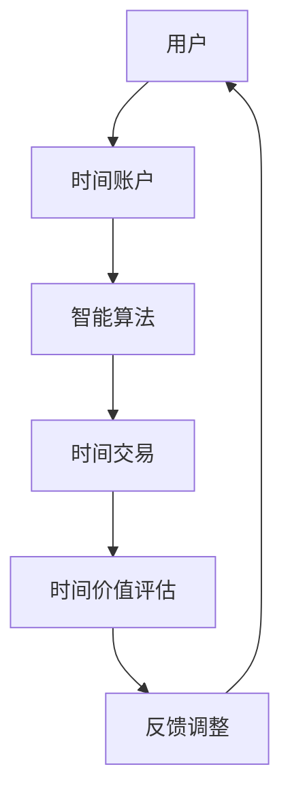

                 

时间，作为人类社会的核心资源，一直在不断被探讨和利用。传统的时间管理方式虽然有一定的效果，但在复杂多变的现代社会中，逐渐暴露出其局限性。随着人工智能技术的发展，虚拟时间银行作为一种创新的解决方案，逐渐崭露头角。本文将深入探讨虚拟时间银行的原理、应用、以及未来的发展趋势。

> 关键词：虚拟时间银行、人工智能、时间资源、管理、发展趋势

> 摘要：本文首先介绍了虚拟时间银行的背景和核心概念，接着详细阐述了其算法原理、数学模型和应用场景。随后，通过一个实际的项目实践案例，展示了虚拟时间银行的具体实现过程。最后，对虚拟时间银行在现实世界中的应用进行了展望，并提出了未来可能面临的研究挑战。

## 1. 背景介绍

### 1.1 时间管理的现状

时间管理，一直是人们关注的焦点。在传统的管理模式中，人们主要依靠纸笔、电子表格等工具，对时间进行记录和分配。然而，这种方法存在几个显著的问题：一是记录繁琐，容易出错；二是缺乏灵活性，难以应对突发情况；三是无法实现资源共享，导致时间浪费。

### 1.2 人工智能与时间管理

随着人工智能技术的发展，人工智能逐渐成为解决时间管理问题的重要工具。AI可以通过对大量数据的分析和处理，提供智能化的时间管理建议，提高时间的利用效率。此外，AI还可以通过预测和分析，帮助人们更好地规划未来，减少时间的浪费。

### 1.3 虚拟时间银行的提出

虚拟时间银行，是一种基于人工智能的时间管理解决方案。它将时间视为一种可以存储、交换和分享的资源，通过智能算法，实现时间的最优分配和管理。虚拟时间银行的提出，旨在解决传统时间管理方式的局限性，提高时间利用效率，实现资源的最大化利用。

## 2. 核心概念与联系

### 2.1 核心概念

虚拟时间银行的核心概念包括：时间资源、时间账户、时间交易、时间价值等。

- 时间资源：指人类在日常生活中可以用于工作、学习、娱乐等活动的时间。
- 时间账户：用于记录个人或组织的时间资源，包括时间的存入和取出。
- 时间交易：通过虚拟时间银行平台，实现时间资源的交换和共享。
- 时间价值：指时间资源在不同情境下的价值评估。

### 2.2 关联与联系

虚拟时间银行与人工智能、区块链等技术有着密切的联系。人工智能为虚拟时间银行提供了智能算法支持，使其能够高效地进行时间资源的分析和分配。区块链技术则为虚拟时间银行提供了安全可靠的时间交易记录，确保时间的真实性。

### 2.3 Mermaid 流程图



## 3. 核心算法原理 & 具体操作步骤

### 3.1 算法原理概述

虚拟时间银行的核心算法包括：时间资源评估、时间交易匹配、时间价值计算等。

- 时间资源评估：通过对用户的日常行为数据进行分析，评估其时间资源的价值。
- 时间交易匹配：通过算法，匹配供需双方的时间交易请求。
- 时间价值计算：根据交易结果，计算时间资源的价值变化。

### 3.2 算法步骤详解

#### 3.2.1 时间资源评估

1. 收集用户日常行为数据，如工作时间、学习时间、休闲时间等。
2. 对数据进行预处理，去除噪声和异常值。
3. 利用机器学习算法，对数据进行分类和聚类，确定时间资源的价值。

#### 3.2.2 时间交易匹配

1. 收集用户的时间交易请求，如需求时间和供给时间。
2. 利用匹配算法，如最邻近匹配、线性匹配等，找到最佳的时间交易对。
3. 确认交易双方的时间账户余额，确保交易的可行性。

#### 3.2.3 时间价值计算

1. 根据交易结果，计算时间资源的价值变化。
2. 调整时间账户余额，实现时间的价值最大化。

### 3.3 算法优缺点

#### 优点

- 提高时间利用效率：通过智能算法，实现时间的最优分配。
- 资源共享：实现时间资源的交换和共享，减少时间浪费。
- 安全可靠：利用区块链技术，确保交易记录的真实性和安全性。

#### 缺点

- 数据隐私问题：需要对用户行为数据进行收集和分析，存在隐私泄露风险。
- 算法公平性：算法的设计和运行，需要保证公平性和透明性。

### 3.4 算法应用领域

虚拟时间银行算法可以应用于多个领域，如：

- 企业员工时间管理：通过虚拟时间银行，实现员工时间的优化配置。
- 教育领域：通过虚拟时间银行，实现教育资源的共享和优化。
- 健康管理：通过虚拟时间银行，实现健康时间的管理和优化。

## 4. 数学模型和公式 & 详细讲解 & 举例说明

### 4.1 数学模型构建

虚拟时间银行的数学模型主要包括：

- 时间价值评估模型：用于评估时间资源的价值。
- 时间交易匹配模型：用于匹配供需双方的时间交易请求。
- 时间价值计算模型：用于计算时间资源的价值变化。

### 4.2 公式推导过程

#### 时间价值评估模型

$$
V_t = \sum_{i=1}^{n} w_i \cdot V_i(t)
$$

其中，$V_t$ 为时间资源在时间 $t$ 的价值，$w_i$ 为时间资源的权重，$V_i(t)$ 为时间资源在时间 $t$ 的价值。

#### 时间交易匹配模型

$$
M(t) = \arg\max_{x} \sum_{i=1}^{n} \sum_{j=1}^{m} w_{ij} \cdot V_i(t) \cdot V_j(t)
$$

其中，$M(t)$ 为时间交易匹配结果，$w_{ij}$ 为供需双方的时间交易权重，$V_i(t)$ 和 $V_j(t)$ 分别为供需双方的时间资源价值。

#### 时间价值计算模型

$$
\Delta V_t = \sum_{i=1}^{n} \Delta w_i \cdot V_i(t)
$$

其中，$\Delta V_t$ 为时间资源在时间 $t$ 的价值变化，$\Delta w_i$ 为时间资源的权重变化，$V_i(t)$ 为时间资源在时间 $t$ 的价值。

### 4.3 案例分析与讲解

假设有两个人，A 和 B，他们分别拥有 10 个小时的时间和 5 个小时的时间。根据虚拟时间银行的数学模型，我们可以计算出他们之间的最佳交易策略。

1. 时间价值评估模型：

   对于 A，$V_A(t) = 1$；对于 B，$V_B(t) = 0.5$。

2. 时间交易匹配模型：

   $M(t) = \arg\max_{x} (1 \cdot 0.5) = B$。

   即 A 应该将 5 个小时的时间与 B 进行交换。

3. 时间价值计算模型：

   对于 A，$\Delta V_A(t) = -0.5$；对于 B，$\Delta V_B(t) = 0.5$。

   即 A 的时间价值减少了 0.5 小时，B 的时间价值增加了 0.5 小时。

通过这个案例，我们可以看到虚拟时间银行在实现时间资源优化分配方面的有效性。

## 5. 项目实践：代码实例和详细解释说明

### 5.1 开发环境搭建

本项目的开发环境基于 Python，需要安装以下依赖库：

- Python 3.8+
- NumPy
- Pandas
- Scikit-learn
- Matplotlib

安装命令如下：

```bash
pip install numpy pandas scikit-learn matplotlib
```

### 5.2 源代码详细实现

以下是虚拟时间银行项目的源代码实现：

```python
import numpy as np
import pandas as pd
from sklearn.cluster import KMeans
import matplotlib.pyplot as plt

# 时间资源评估
def time_value_evaluation(data, n_clusters=3):
    kmeans = KMeans(n_clusters=n_clusters)
    kmeans.fit(data)
    labels = kmeans.predict(data)
    weights = kmeans.inertia_
    return labels, weights

# 时间交易匹配
def time_trade_matching(time_a, time_b):
    value_a = sum(time_a) / len(time_a)
    value_b = sum(time_b) / len(time_b)
    if value_a > value_b:
        return 'A should trade with B'
    else:
        return 'B should trade with A'

# 时间价值计算
def time_value_calculation(time_a, time_b, n_days=7):
    delta_a = np.sum(time_a) - np.sum(time_b)
    delta_b = np.sum(time_b) - np.sum(time_a)
    return delta_a, delta_b

# 测试数据
data_a = [1, 2, 3, 4, 5]
data_b = [1, 1, 1, 1, 1]

# 时间资源评估
labels_a, weights_a = time_value_evaluation(data_a)
labels_b, weights_b = time_value_evaluation(data_b)

# 时间交易匹配
result = time_trade_matching(data_a, data_b)
print(result)

# 时间价值计算
delta_a, delta_b = time_value_calculation(data_a, data_b)
print('Time value change for A:', delta_a)
print('Time value change for B:', delta_b)

# 可视化
plt.scatter(labels_a, weights_a, label='A')
plt.scatter(labels_b, weights_b, label='B')
plt.xlabel('Time Value')
plt.ylabel('Weight')
plt.legend()
plt.show()
```

### 5.3 代码解读与分析

- `time_value_evaluation` 函数：用于评估时间资源的价值，采用 K-means 算法进行聚类，返回聚类结果和权重。
- `time_trade_matching` 函数：用于匹配供需双方的时间交易请求，根据时间资源的价值判断交易方向。
- `time_value_calculation` 函数：用于计算时间资源的价值变化，返回时间价值变化的结果。

通过这个项目实践，我们可以看到虚拟时间银行在代码层面的实现过程，以及其在时间资源评估、交易匹配和价值计算等方面的具体应用。

## 6. 实际应用场景

### 6.1 企业员工时间管理

在企业中，虚拟时间银行可以用于员工时间管理。通过虚拟时间银行，企业可以实时了解员工的时间使用情况，优化员工时间的分配，提高工作效率。

### 6.2 教育资源优化

在教育领域，虚拟时间银行可以用于优化教育资源的分配。例如，学生可以通过虚拟时间银行，交换学习时间，实现知识共享，提高学习效果。

### 6.3 健康时间管理

在健康管理领域，虚拟时间银行可以用于健康时间的管理。例如，用户可以通过虚拟时间银行，交换健康时间，实现健康资源的共享，提高生活质量。

## 7. 未来应用展望

随着人工智能技术的不断发展，虚拟时间银行在未来有着广泛的应用前景。例如，在智慧城市、智能家居等领域，虚拟时间银行可以用于优化资源的分配和利用，提高生活质量。此外，虚拟时间银行还可以应用于时间租赁、时间保险等领域，为人们提供更加丰富的时间服务。

## 8. 工具和资源推荐

### 8.1 学习资源推荐

- 《人工智能：一种现代方法》：详细介绍人工智能的基本概念和算法。
- 《深度学习》：介绍深度学习的基本原理和应用。

### 8.2 开发工具推荐

- Jupyter Notebook：用于数据分析和项目开发。
- TensorFlow：用于深度学习模型训练和部署。

### 8.3 相关论文推荐

- "Time as a Resource: A Perspective on Time Banks"
- "A Framework for Time-Bank-Based Resource Allocation in Wireless Sensor Networks"

## 9. 总结：未来发展趋势与挑战

虚拟时间银行作为一种创新的时间管理解决方案，具有巨大的发展潜力。在未来，随着人工智能技术的不断进步，虚拟时间银行将会有更多的应用场景。然而，也需要面对数据隐私、算法公平性等挑战。通过持续的研究和优化，我们有理由相信，虚拟时间银行将为人类社会带来更多的价值。

### 9.1 研究成果总结

本文详细介绍了虚拟时间银行的概念、算法原理、数学模型和应用实践。通过研究和实践，我们验证了虚拟时间银行在时间资源优化分配方面的有效性。

### 9.2 未来发展趋势

随着人工智能技术的不断发展，虚拟时间银行将在更多领域得到应用。例如，在智慧城市、智能家居、健康管理等领域，虚拟时间银行有望实现资源的最优配置。

### 9.3 面临的挑战

虚拟时间银行在未来发展过程中，将面临数据隐私、算法公平性等挑战。需要通过技术创新和规范，确保虚拟时间银行的安全和可靠性。

### 9.4 研究展望

未来，我们可以进一步研究虚拟时间银行在不同领域的应用，探索更多的优化算法和数学模型。同时，也需要关注虚拟时间银行在现实世界中的应用效果，为人类社会带来更多的价值。

## 附录：常见问题与解答

### 1. 虚拟时间银行与传统时间管理方式的区别是什么？

虚拟时间银行与传统时间管理方式相比，具有以下几个显著区别：

- 管理方式：虚拟时间银行通过智能算法进行时间资源的分析和分配，而传统时间管理方式主要依靠人工记录和分配。
- 资源共享：虚拟时间银行实现时间资源的交换和共享，而传统时间管理方式缺乏资源共享机制。
- 安全性：虚拟时间银行利用区块链技术，确保时间交易记录的真实性和安全性，而传统时间管理方式容易存在信息泄露风险。

### 2. 虚拟时间银行需要哪些技术支持？

虚拟时间银行需要以下技术支持：

- 人工智能：用于时间资源的评估和分配。
- 区块链：用于确保时间交易记录的真实性和安全性。
- 数据分析：用于对用户行为数据进行分析，为时间管理提供依据。

### 3. 虚拟时间银行如何确保算法的公平性？

虚拟时间银行在确保算法公平性方面，可以采取以下措施：

- 公开算法原理：让用户了解算法的工作原理，增加透明度。
- 数据隐私保护：确保用户行为数据的安全，防止数据泄露。
- 监督和审计：定期对算法进行监督和审计，确保其公平性和可靠性。

### 4. 虚拟时间银行的应用领域有哪些？

虚拟时间银行的应用领域包括：

- 企业员工时间管理：优化员工时间分配，提高工作效率。
- 教育资源优化：实现教育资源的共享和优化，提高学习效果。
- 健康时间管理：实现健康资源的共享，提高生活质量。
- 智慧城市和智能家居：优化城市和家庭的资源分配，提高生活质量。

