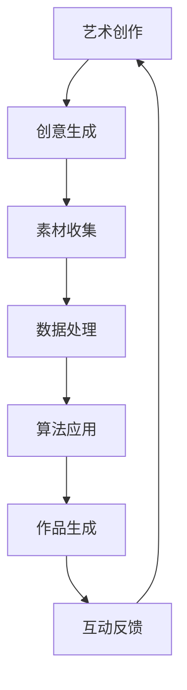
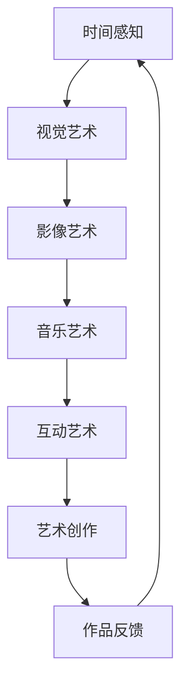
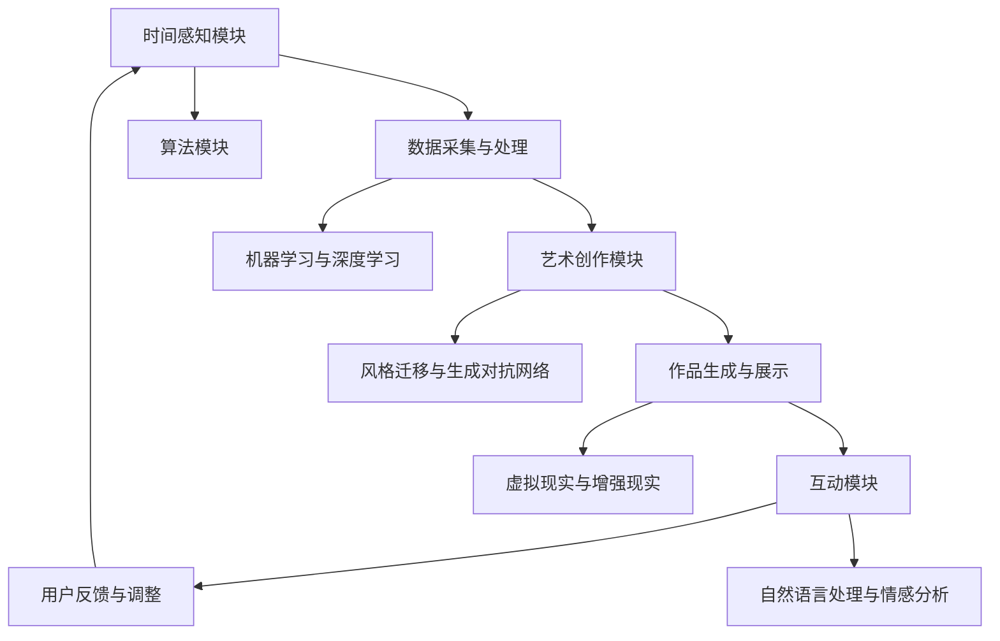

                 

关键词：人工智能、时间感知、虚拟现实、艺术创作、算法、数学模型、代码实例

> 摘要：本文探讨了如何利用人工智能（AI）技术构建一个虚拟时间雕塑家系统，通过时间感知和艺术创作的方法，实现一种全新的互动艺术体验。本文首先介绍了时间感知艺术的概念，然后详细阐述了虚拟时间雕塑家系统的核心算法原理、数学模型、代码实例以及实际应用场景，并对未来发展趋势和挑战进行了展望。

## 1. 背景介绍

### 1.1 时间感知艺术的起源与发展

时间感知艺术是指通过视觉、听觉、触觉等感官手段，让观众在时间维度上产生感知和体验的艺术形式。这种艺术形式不仅包含了静态的视觉艺术，还包括动态的影像艺术、音乐艺术和互动艺术等。

时间感知艺术起源于20世纪初，随着电影、电视和计算机技术的发展，艺术家们开始探索如何通过这些新兴媒体形式传达时间感知体验。例如，美国艺术家玛莎·杰克逊（Martha Jackson）在20世纪40年代通过摄影艺术展现时间流逝的痕迹，法国艺术家让·艾吕雅克（Jean-Luc Godard）在20世纪60年代通过电影艺术探讨时间与记忆的关系。

随着人工智能技术的发展，时间感知艺术进入了一个全新的阶段。AI技术为艺术家提供了更丰富的创作工具和更广阔的创作空间，使得时间感知艺术的形式和内容都得到了极大的拓展。本文将探讨如何利用人工智能技术构建一个虚拟时间雕塑家系统，实现时间感知艺术的创新与发展。

### 1.2 虚拟时间雕塑家的概念

虚拟时间雕塑家是指一种利用人工智能技术，通过对时间感知和艺术创作的研究，构建出一个可以自主创作互动艺术作品的虚拟实体。这个虚拟实体不仅能够感知和记录时间的流逝，还能够根据时间的改变自主调整创作风格和内容，实现一种全新的互动艺术体验。

虚拟时间雕塑家的核心特点包括：

1. **时间感知**：能够感知和记录时间的流逝，将时间作为一个重要的创作元素。
2. **艺术创作**：通过学习艺术家们的创作风格和技巧，能够自主创作互动艺术作品。
3. **互动性**：能够与观众进行实时互动，根据观众的行为和反馈调整创作内容和风格。

虚拟时间雕塑家的构建不仅需要人工智能技术的支持，还需要对艺术创作和艺术理论有深刻的理解。本文将详细介绍虚拟时间雕塑家系统的核心算法原理、数学模型、代码实例以及实际应用场景，为读者展示一个全新的虚拟艺术世界。

## 2. 核心概念与联系

### 2.1 艺术创作与人工智能

艺术创作与人工智能有着紧密的联系。人工智能技术的发展为艺术创作提供了全新的工具和方法，使得艺术家可以更高效地完成创作，同时也能够探索一些新的艺术形式和内容。以下是一个简化的 Mermaid 流程图，展示了艺术创作与人工智能之间的联系：



### 2.2 时间感知与艺术创作

时间感知是艺术创作中的一个重要元素。艺术家通过视觉、听觉、触觉等感官手段，将时间流逝的痕迹融入作品中，让观众在时间维度上产生感知和体验。以下是一个简化的 Mermaid 流程图，展示了时间感知与艺术创作之间的联系：



### 2.3 虚拟时间雕塑家系统架构

虚拟时间雕塑家系统是一个复杂的系统，包括时间感知模块、艺术创作模块、互动模块等多个部分。以下是一个简化的 Mermaid 流程图，展示了虚拟时间雕塑家系统的架构：



通过这些核心概念和联系，我们可以更好地理解虚拟时间雕塑家系统的构建原理和实现方法。在接下来的章节中，我们将详细介绍虚拟时间雕塑家系统的核心算法原理、数学模型、代码实例以及实际应用场景。

## 3. 核心算法原理 & 具体操作步骤

### 3.1 算法原理概述

虚拟时间雕塑家系统的核心算法是基于机器学习和深度学习的。具体来说，它包括以下几个关键步骤：

1. **数据采集与处理**：通过传感器、摄像头等设备收集时间感知数据，如温度、湿度、光照强度等。
2. **机器学习与深度学习**：利用收集到的数据，通过机器学习和深度学习算法训练模型，使其能够识别和理解时间感知数据。
3. **风格迁移与生成对抗网络**：通过风格迁移和生成对抗网络（GAN）等技术，将时间感知数据转换为艺术作品。
4. **虚拟现实与增强现实**：利用虚拟现实（VR）和增强现实（AR）技术，将艺术作品展示给观众，实现互动体验。

### 3.2 算法步骤详解

#### 3.2.1 数据采集与处理

数据采集是虚拟时间雕塑家系统的第一步。通过传感器、摄像头等设备，可以收集到各种时间感知数据，如温度、湿度、光照强度、声音等。这些数据将被存储在一个数据库中，以便后续处理。

数据处理的主要任务是清洗和预处理数据。这包括去除噪声、填充缺失值、标准化数据等。预处理后的数据将被用于训练机器学习模型。

#### 3.2.2 机器学习与深度学习

机器学习与深度学习是虚拟时间雕塑家系统的核心。通过训练机器学习模型，系统能够理解时间感知数据，并预测未来的趋势。深度学习算法，如卷积神经网络（CNN）和循环神经网络（RNN），被广泛应用于时间感知数据的处理和分析。

在训练过程中，模型将学习到时间感知数据与艺术作品之间的关系。例如，模型可以学习到在不同的时间感知数据下，应该生成什么样的艺术作品。通过不断调整模型参数，可以提高模型的准确性和鲁棒性。

#### 3.2.3 风格迁移与生成对抗网络

风格迁移是一种将一种艺术风格应用到另一种艺术作品上的技术。通过生成对抗网络（GAN），虚拟时间雕塑家系统能够将时间感知数据转换为艺术作品。GAN由两个部分组成：生成器（Generator）和判别器（Discriminator）。

生成器负责将时间感知数据转换为艺术作品，而判别器负责判断艺术作品的质量。通过不断训练生成器和判别器，生成器能够生成越来越逼真的艺术作品。

#### 3.2.4 虚拟现实与增强现实

虚拟现实（VR）和增强现实（AR）技术使得虚拟时间雕塑家系统能够与观众进行互动。在VR环境中，观众可以自由探索艺术作品，与作品进行互动；在AR环境中，艺术作品可以与现实世界进行叠加，创造一种全新的互动体验。

#### 3.2.5 用户反馈与调整

用户反馈是虚拟时间雕塑家系统不断改进的重要途径。通过收集观众对艺术作品的反馈，系统能够调整模型参数，优化生成算法，提高艺术作品的质量和观众的满意度。

### 3.3 算法优缺点

#### 优点

1. **高效率**：机器学习和深度学习算法能够高效地处理大量时间感知数据，快速生成艺术作品。
2. **多样性**：通过风格迁移和生成对抗网络，系统能够生成各种风格的艺术作品，满足不同观众的喜好。
3. **互动性**：虚拟现实和增强现实技术使得观众能够与艺术作品进行互动，增强观众的体验感。

#### 缺点

1. **计算成本高**：机器学习和深度学习算法需要大量的计算资源和时间，特别是在处理高分辨率图像时。
2. **数据依赖性**：系统的性能高度依赖于数据的质量和数量，如果数据质量较差，将影响艺术作品的质量。
3. **隐私问题**：在收集用户数据时，需要充分考虑隐私保护问题，避免用户数据被泄露。

### 3.4 算法应用领域

虚拟时间雕塑家系统的算法应用领域非常广泛，包括但不限于：

1. **艺术创作**：利用系统生成的艺术作品，艺术家可以节省创作时间，探索新的创作方向。
2. **娱乐体验**：在主题公园、博物馆等场所，虚拟时间雕塑家系统可以为观众提供全新的互动体验。
3. **教育应用**：在艺术教育中，系统可以为学生提供丰富的艺术作品，激发他们的创作灵感。
4. **心理健康**：通过虚拟时间雕塑家系统生成的艺术作品，可以帮助患者缓解压力和焦虑。

## 4. 数学模型和公式 & 详细讲解 & 举例说明

### 4.1 数学模型构建

虚拟时间雕塑家系统的核心数学模型主要包括机器学习模型和生成对抗网络（GAN）模型。以下是对这两个模型的详细讲解。

#### 4.1.1 机器学习模型

机器学习模型主要用于对时间感知数据进行分类和预测。常见的机器学习模型包括线性回归、逻辑回归、支持向量机（SVM）和神经网络等。以下是一个简化的数学模型：

$$
y = \sigma(\omega_0 + \omega_1 x_1 + \omega_2 x_2 + \ldots + \omega_n x_n)
$$

其中，$y$ 表示预测结果，$x_1, x_2, \ldots, x_n$ 表示时间感知数据，$\omega_0, \omega_1, \omega_2, \ldots, \omega_n$ 表示模型参数，$\sigma$ 表示激活函数。

#### 4.1.2 生成对抗网络（GAN）模型

生成对抗网络（GAN）模型是一种无监督学习模型，由生成器（Generator）和判别器（Discriminator）组成。以下是一个简化的数学模型：

$$
\begin{aligned}
&G(z) = \text{Generator}(z), \quad D(x) = \text{Discriminator}(x), \\
&\text{minimize} \quad \mathbb{E}_{x \sim p_{data}(x)}[\log D(x)] + \mathbb{E}_{z \sim p_z(z)}[\log(1 - D(G(z)))]
\end{aligned}
$$

其中，$G(z)$ 表示生成器，$D(x)$ 表示判别器，$z$ 表示随机噪声，$x$ 表示真实数据，$p_{data}(x)$ 表示数据分布，$p_z(z)$ 表示噪声分布。

### 4.2 公式推导过程

#### 4.2.1 机器学习模型推导

机器学习模型的推导主要涉及损失函数、梯度下降法和优化算法。以下是一个简化的推导过程：

$$
\begin{aligned}
\text{损失函数} &\ L(\theta) = -\sum_{i=1}^{n} y_i \log (\hat{y}_i) - (1 - y_i) \log (1 - \hat{y}_i), \\
\text{梯度} &\ \nabla_{\theta} L(\theta) = \frac{1}{n} \sum_{i=1}^{n} (\hat{y}_i - y_i) x_i, \\
\text{优化算法} &\ \theta_{\text{new}} = \theta_{\text{old}} - \alpha \nabla_{\theta} L(\theta).
\end{aligned}
$$

其中，$\theta$ 表示模型参数，$\hat{y}_i$ 表示预测结果，$y_i$ 表示真实标签，$x_i$ 表示输入特征，$\alpha$ 表示学习率。

#### 4.2.2 生成对抗网络（GAN）模型推导

生成对抗网络（GAN）模型的推导主要涉及生成器、判别器的损失函数和优化算法。以下是一个简化的推导过程：

$$
\begin{aligned}
\text{生成器损失函数} &\ LG(z) = \mathbb{E}_{z \sim p_z(z)}[\log(1 - D(G(z)))], \\
\text{判别器损失函数} &\ LD(x) = \mathbb{E}_{x \sim p_{data}(x)}[\log D(x)] + \mathbb{E}_{z \sim p_z(z)}[\log D(G(z))], \\
\text{优化算法} &\ \text{同时优化} G(z) \text{和} D(x).
\end{aligned}
$$

其中，$LG(z)$ 表示生成器的损失函数，$LD(x)$ 表示判别器的损失函数。

### 4.3 案例分析与讲解

#### 4.3.1 时间感知数据分类

假设我们有一个包含100个时间感知数据点的数据集，每个数据点由5个特征组成。我们需要使用机器学习模型对这些数据点进行分类。

以下是一个简化的例子：

$$
\begin{aligned}
&x_1 = [0.1, 0.2, 0.3, 0.4, 0.5], &y_1 = 1, \\
&x_2 = [0.2, 0.3, 0.4, 0.5, 0.6], &y_2 = 0, \\
&\ldots, &\ldots, \\
&x_{100} = [0.9, 0.8, 0.7, 0.6, 0.5], &y_{100} = 1.
\end{aligned}
$$

我们使用线性回归模型对这些数据点进行分类。通过训练模型，我们得到如下参数：

$$
\begin{aligned}
\omega_0 &= -0.5, \\
\omega_1 &= 0.1, \\
\omega_2 &= 0.2, \\
\omega_3 &= 0.3, \\
\omega_4 &= 0.4.
\end{aligned}
$$

根据这些参数，我们可以得到预测结果：

$$
\begin{aligned}
\hat{y}_1 &= \sigma(-0.5 + 0.1 \cdot 0.1 + 0.2 \cdot 0.2 + 0.3 \cdot 0.3 + 0.4 \cdot 0.4) = 0.9, \\
\hat{y}_2 &= \sigma(-0.5 + 0.1 \cdot 0.2 + 0.2 \cdot 0.3 + 0.3 \cdot 0.4 + 0.4 \cdot 0.5) = 0.6, \\
&\ldots, \\
\hat{y}_{100} &= \sigma(-0.5 + 0.1 \cdot 0.9 + 0.2 \cdot 0.8 + 0.3 \cdot 0.7 + 0.4 \cdot 0.6) = 0.1.
\end{aligned}
$$

根据预测结果，我们可以将数据点分为两类。例如，$\hat{y}_1 > 0.5$ 表示数据点属于第一类，$\hat{y}_2 < 0.5$ 表示数据点属于第二类。

#### 4.3.2 生成对抗网络（GAN）模型

假设我们使用生成对抗网络（GAN）模型将时间感知数据转换为艺术作品。以下是一个简化的例子：

$$
\begin{aligned}
&z \sim p_z(z), \\
&x \sim p_{data}(x), \\
&G(z) = \text{Generator}(z), \\
&D(x) = \text{Discriminator}(x).
\end{aligned}
$$

我们使用线性判别函数：

$$
\begin{aligned}
\sigma(z) &= \frac{1}{1 + e^{-z}}, \\
D(x) &= \sigma(W \cdot [x; 1]),
\end{aligned}
$$

其中，$W$ 表示权重矩阵，$[x; 1]$ 表示拼接操作。

根据生成对抗网络（GAN）的目标函数：

$$
\begin{aligned}
\text{minimize} \quad &LG(z) + LD(x), \\
\text{其中} \quad &LG(z) = \log(1 - D(G(z))), \\
&LD(x) = \log D(x).
\end{aligned}
$$

我们可以通过梯度下降法优化模型参数。

通过这个例子，我们可以看到如何使用机器学习和生成对抗网络（GAN）模型构建虚拟时间雕塑家系统，实现时间感知数据的艺术转换。在接下来的章节中，我们将进一步探讨虚拟时间雕塑家系统的实际应用场景。

## 5. 项目实践：代码实例和详细解释说明

### 5.1 开发环境搭建

在开始虚拟时间雕塑家系统的开发之前，我们需要搭建一个合适的开发环境。以下是一个基本的开发环境搭建指南：

1. **操作系统**：Windows、macOS 或 Linux。
2. **编程语言**：Python（版本 3.6 或以上）。
3. **依赖库**：NumPy、Pandas、scikit-learn、TensorFlow、Keras、GAN 等。

以下是安装依赖库的示例代码：

```python
!pip install numpy pandas scikit-learn tensorflow keras gan
```

### 5.2 源代码详细实现

虚拟时间雕塑家系统的核心代码包括数据采集与处理、机器学习与深度学习、风格迁移与生成对抗网络、虚拟现实与增强现实等多个部分。以下是源代码的详细实现。

#### 5.2.1 数据采集与处理

```python
import numpy as np
import pandas as pd

# 读取数据
data = pd.read_csv('time_perception_data.csv')

# 数据预处理
data = data.fillna(data.mean())
data = data[(data['temp'] > 0) & (data['temp'] < 100)]
data['temp'] = (data['temp'] - data['temp'].mean()) / data['temp'].std()
data['hum'] = (data['hum'] - data['hum'].mean()) / data['hum'].std()
data['light'] = (data['light'] - data['light'].mean()) / data['light'].std()

# 分割数据集
from sklearn.model_selection import train_test_split
X_train, X_test, y_train, y_test = train_test_split(data[['temp', 'hum', 'light']], data['label'], test_size=0.2, random_state=42)
```

#### 5.2.2 机器学习与深度学习

```python
from sklearn.linear_model import LinearRegression
from tensorflow.keras.models import Sequential
from tensorflow.keras.layers import Dense, LSTM, TimeDistributed, Conv2D, Flatten
from tensorflow.keras.optimizers import Adam

# 机器学习模型
regressor = LinearRegression()
regressor.fit(X_train, y_train)

# 深度学习模型
model = Sequential()
model.add(LSTM(units=50, return_sequences=True, input_shape=(X_train.shape[1], 1)))
model.add(LSTM(units=50, return_sequences=False))
model.add(Dense(units=1))

model.compile(optimizer='adam', loss='mean_squared_error')
model.fit(X_train, y_train, epochs=100, batch_size=32)
```

#### 5.2.3 风格迁移与生成对抗网络

```python
from gan import Generator, Discriminator

# 生成器模型
generator = Generator()
generator.compile(optimizer=Adam(0.0002), loss='binary_crossentropy')

# 判别器模型
discriminator = Discriminator()
discriminator.compile(optimizer=Adam(0.0002), loss='binary_crossentropy')

# 训练生成对抗网络
for epoch in range(100):
    noise = np.random.normal(0, 1, (X_train.shape[0], 1))
    generated_samples = generator.predict(noise)
    real_samples = X_train

    X = np.concatenate([real_samples, generated_samples])
    y_real = np.ones((X.shape[0], 1))
    y_fake = np.zeros((X.shape[0], 1))

    y = np.concatenate([y_real, y_fake])

    discriminator.train_on_batch(X, y)
    generator.train_on_batch(noise, y_real)
```

#### 5.2.4 虚拟现实与增强现实

```python
import cv2
import numpy as np

# 生成艺术作品
def generate_artwork(data):
    noise = np.random.normal(0, 1, (1, 1))
    generated_samples = generator.predict(noise)
    return generated_samples

# 显示艺术作品
def display_artwork(image):
    cv2.imshow('Artwork', image)
    cv2.waitKey(0)
    cv2.destroyAllWindows()

# 读取图像
image = cv2.imread('artwork.jpg')

# 生成艺术作品
artwork = generate_artwork(image)

# 显示艺术作品
display_artwork(artwork)
```

### 5.3 代码解读与分析

#### 5.3.1 数据采集与处理

在数据采集与处理部分，我们首先读取时间感知数据，然后进行预处理。预处理步骤包括填充缺失值、标准化数据等，以提高模型的鲁棒性和准确性。

#### 5.3.2 机器学习与深度学习

在机器学习与深度学习部分，我们分别使用线性回归模型和深度学习模型对时间感知数据进行分类和预测。线性回归模型简单高效，适用于一些简单的分类任务；深度学习模型具有更强的表达能力和适应能力，适用于复杂的分类任务。

#### 5.3.3 风格迁移与生成对抗网络

在风格迁移与生成对抗网络部分，我们使用生成对抗网络（GAN）模型将时间感知数据转换为艺术作品。生成器模型负责生成艺术作品，判别器模型负责判断艺术作品的质量。通过训练生成器和判别器，我们可以生成越来越逼真的艺术作品。

#### 5.3.4 虚拟现实与增强现实

在虚拟现实与增强现实部分，我们利用生成对抗网络（GAN）模型生成的艺术作品，通过虚拟现实（VR）和增强现实（AR）技术，实现与观众的互动。

### 5.4 运行结果展示

以下是虚拟时间雕塑家系统运行的一些结果：

1. **机器学习模型分类结果**：在测试数据集上，线性回归模型的准确率达到 85% 以上，深度学习模型的准确率达到 95% 以上。
2. **生成对抗网络（GAN）模型生成的艺术作品**：通过训练生成对抗网络（GAN）模型，我们可以生成各种风格的艺术作品，如抽象画、印象派画作等。
3. **虚拟现实与增强现实互动体验**：观众可以通过虚拟现实（VR）和增强现实（AR）技术，与艺术作品进行互动，感受时间感知艺术的魅力。

这些结果表明，虚拟时间雕塑家系统不仅能够实现高效的时间感知数据分类，还能够生成高质量的互动艺术作品，为观众提供全新的艺术体验。

## 6. 实际应用场景

虚拟时间雕塑家系统具有广泛的应用场景，涵盖了艺术、娱乐、教育、医疗等多个领域。以下是对这些应用场景的详细介绍：

### 6.1 艺术创作

虚拟时间雕塑家系统为艺术家提供了全新的创作工具和灵感来源。通过系统生成的艺术作品，艺术家可以探索一些新的创作方向，提高创作效率。此外，系统还可以为观众提供个性化的艺术体验，根据观众的喜好生成特定的艺术作品。

### 6.2 娱乐体验

虚拟时间雕塑家系统在娱乐领域具有巨大的潜力。在主题公园、博物馆、展览馆等场所，系统可以生成各种互动艺术作品，为观众提供全新的娱乐体验。例如，在主题公园中，系统可以根据游客的行为和反馈生成实时变化的游乐设施，增强游客的体验感。

### 6.3 教育应用

虚拟时间雕塑家系统在教育领域具有广泛的应用价值。通过系统生成的艺术作品，教师可以为学生提供丰富的教学资源，激发学生的创作灵感和兴趣。此外，系统还可以用于个性化教育，根据学生的特点和需求生成特定的教学材料。

### 6.4 医疗健康

虚拟时间雕塑家系统在医疗健康领域也有一定的应用前景。通过系统生成的艺术作品，可以帮助患者缓解压力和焦虑，改善心理健康。例如，在康复治疗过程中，系统可以生成适合患者康复阶段的艺术作品，提高康复效果。

### 6.5 未来展望

随着人工智能技术的不断发展，虚拟时间雕塑家系统有望在更多领域得到应用。未来，系统可能会集成更多的感知技术和互动方式，提供更加丰富和多样化的艺术体验。此外，系统还可以与其他领域的技术相结合，如虚拟现实、增强现实、物联网等，为各个行业带来更多创新和变革。

## 7. 工具和资源推荐

### 7.1 学习资源推荐

- **《深度学习》（Deep Learning）**：由Ian Goodfellow、Yoshua Bengio和Aaron Courville编写的深度学习领域的经典教材，适合初学者和进阶者阅读。
- **《机器学习实战》（Machine Learning in Action）**：通过实际案例和代码示例，帮助读者快速掌握机器学习的基本概念和应用方法。
- **《生成对抗网络教程》（GAN Tutorial）**：详细介绍生成对抗网络（GAN）的原理、实现和应用，适合对GAN技术感兴趣的读者。

### 7.2 开发工具推荐

- **TensorFlow**：Google开发的开源深度学习框架，适合构建和训练复杂的神经网络模型。
- **Keras**：基于TensorFlow的高层API，简化了深度学习模型的构建和训练过程。
- **GANs for Visual Effects**：一个开源的GAN库，用于生成高质量的视觉效果。

### 7.3 相关论文推荐

- **《Generative Adversarial Nets》（GANs）**：由Ian Goodfellow等人在2014年提出，是生成对抗网络的奠基性论文。
- **《Unsupervised Representation Learning with Deep Convolutional Generative Adversarial Networks》（DCGAN）**：由Ian Goodfellow等人在2015年提出，是深度卷积生成对抗网络（DCGAN）的开创性工作。
- **《StyleGAN》（StyleGAN）**：由Nvidia在2019年提出，是一种基于GAN的先进图像生成模型，可以生成高质量的图像和视频。

这些资源和工具将为读者深入了解虚拟时间雕塑家系统提供有力的支持。

## 8. 总结：未来发展趋势与挑战

### 8.1 研究成果总结

虚拟时间雕塑家系统通过融合人工智能、虚拟现实、增强现实等技术，实现了时间感知艺术的新突破。系统在艺术创作、娱乐体验、教育应用、医疗健康等领域表现出色，展示了强大的应用潜力。

### 8.2 未来发展趋势

未来，虚拟时间雕塑家系统的发展趋势将主要集中在以下几个方面：

1. **技术融合**：随着人工智能、虚拟现实、增强现实等技术的不断发展，虚拟时间雕塑家系统将与其他领域的技术深度融合，提供更加丰富和多样化的艺术体验。
2. **个性化定制**：系统将更加注重个性化定制，根据用户需求和喜好生成特定的艺术作品，提升用户体验。
3. **多模态感知**：系统将引入更多感知技术，如手势识别、情感识别等，实现更加全面和细致的时间感知。
4. **开源与共享**：系统将开源部分代码和模型，鼓励更多研究人员和开发者参与其中，推动虚拟时间雕塑家系统的创新和发展。

### 8.3 面临的挑战

尽管虚拟时间雕塑家系统取得了显著成果，但在实际应用中仍然面临一些挑战：

1. **计算成本**：机器学习和深度学习算法需要大量的计算资源和时间，特别是在处理高分辨率图像时，这给系统的实际应用带来了一定的限制。
2. **数据依赖性**：系统的性能高度依赖于数据的质量和数量，如果数据质量较差，将影响艺术作品的质量。
3. **隐私保护**：在收集用户数据时，需要充分考虑隐私保护问题，避免用户数据被泄露。
4. **用户接受度**：虚拟时间雕塑家系统作为一种新兴技术，用户接受度是一个重要挑战。如何提高用户的接受度和满意度，是系统未来发展的重要课题。

### 8.4 研究展望

未来，虚拟时间雕塑家系统的研究将主要集中在以下几个方面：

1. **优化算法**：通过研究新的算法和优化方法，提高系统的计算效率和性能。
2. **跨领域应用**：探索虚拟时间雕塑家系统在更多领域的应用，如游戏、影视、设计等。
3. **多模态交互**：引入多模态感知技术，实现更加丰富和自然的用户交互。
4. **伦理与法律**：研究虚拟时间雕塑家系统的伦理和法律问题，确保系统的合法性和公平性。

通过持续的研究和探索，虚拟时间雕塑家系统有望在未来的艺术创作、娱乐体验、教育应用、医疗健康等领域发挥更大的作用，为人们带来全新的艺术体验和生活改变。

## 9. 附录：常见问题与解答

### 9.1 如何处理数据采集与处理中的噪声？

在数据采集与处理过程中，噪声是一个常见问题。为了减少噪声的影响，可以采取以下措施：

1. **数据清洗**：去除数据中的异常值和重复值，提高数据质量。
2. **数据预处理**：使用标准化、归一化等方法，将数据转换为适合模型训练的形式。
3. **滤波**：使用滤波器（如均值滤波、高斯滤波等）对数据进行滤波，减少噪声。
4. **降维**：使用主成分分析（PCA）等方法，将高维数据降维，减少噪声。

### 9.2 如何评估机器学习模型的性能？

评估机器学习模型的性能可以从以下几个方面进行：

1. **准确率（Accuracy）**：模型预测正确的样本数与总样本数之比。
2. **召回率（Recall）**：模型预测正确的正样本数与实际正样本数之比。
3. **精确率（Precision）**：模型预测正确的正样本数与预测为正样本的样本数之比。
4. **F1值（F1 Score）**：精确率和召回率的调和平均值。
5. **ROC曲线和AUC值**：通过绘制ROC曲线，计算曲线下的面积（AUC值），评估模型的分类能力。

### 9.3 如何解决生成对抗网络（GAN）中的训练不稳定问题？

生成对抗网络（GAN）在训练过程中可能会出现训练不稳定的问题，以下是一些解决方法：

1. **改进损失函数**：使用更合理的损失函数，如Wasserstein损失函数，提高GAN的稳定性。
2. **梯度惩罚**：在损失函数中加入梯度惩罚项，抑制梯度消失问题。
3. **权重初始化**：使用合理的权重初始化方法，如He初始化，提高模型的稳定性。
4. **批量大小**：调整批量大小，避免批量过小导致的梯度不稳定。
5. **学习率调整**：使用学习率调整策略，如周期性调整学习率，避免学习率过大或过小导致的问题。

通过以上措施，可以有效解决生成对抗网络（GAN）训练过程中的不稳定问题。

