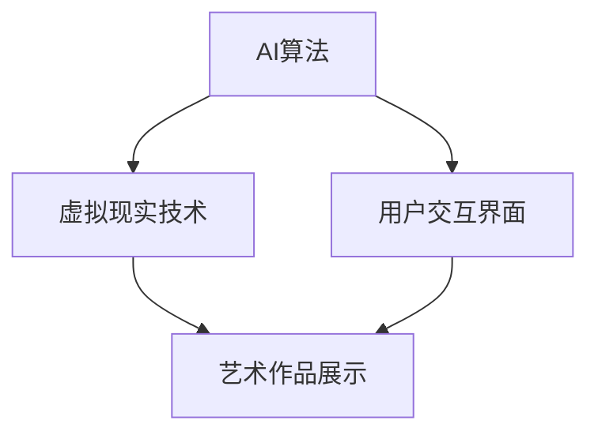

                 

 关键词：人工智能，虚拟现实，时间感知，艺术创作，AI算法，数学模型，实践应用

> 摘要：本文探讨了人工智能与虚拟现实技术结合下的时间感知艺术创作。通过引入先进的AI算法和数学模型，我们能够构建出能够感知时间流逝的艺术作品，为观众带来前所未有的沉浸体验。本文将详细介绍核心概念、算法原理、数学模型、实践应用及未来展望，旨在为读者提供一个全面而深入的了解。

## 1. 背景介绍

在过去的几十年里，人工智能（AI）和虚拟现实（VR）技术经历了飞速的发展，逐渐渗透到各个领域。从早期的机械模拟到如今的智能交互，AI技术已经深刻地改变了我们的生活方式和工作方式。与此同时，虚拟现实技术为人们提供了一个全新的虚拟世界，极大地扩展了人类的感知和体验能力。

艺术创作一直以来都是人类文化的重要组成部分。然而，传统艺术作品往往只能静态地表达创作者的情感和思想，难以传达时间的流动和变化。随着AI和VR技术的进步，我们开始探索一种全新的艺术形式——虚拟时间雕塑。这种艺术形式能够感知时间，通过动态变化来表现艺术的内涵，为观众带来沉浸式的体验。

本文将探讨虚拟时间雕塑的核心概念、算法原理、数学模型以及其实践应用，旨在为读者提供一个全面而深入的了解。

## 2. 核心概念与联系

### 2.1 虚拟时间雕塑的定义

虚拟时间雕塑是一种通过AI算法和虚拟现实技术创作的艺术形式。它不仅仅是一个静态的模型，而是能够根据时间的变化动态调整形态和表现内容。这种艺术形式旨在捕捉时间的流动，通过视觉、听觉等多感官的互动，让观众感受到时间的存在和变化。

### 2.2 艺术创作与AI技术的结合

艺术创作与AI技术的结合可以追溯到20世纪末。当时，一些艺术家开始尝试使用计算机程序创作艺术作品，例如音乐、绘画和动画。这些作品通过计算机算法生成，打破了传统艺术的界限，展现了人工智能在艺术创作中的潜力。

随着AI技术的不断进步，尤其是深度学习和生成对抗网络（GAN）等算法的发展，AI在艺术创作中的应用变得更加广泛和深入。虚拟时间雕塑正是这种结合的产物，它不仅利用了AI算法的强大生成能力，还结合了虚拟现实技术的沉浸体验，为观众带来全新的艺术感受。

### 2.3 艺术创作与虚拟现实技术的结合

虚拟现实技术为艺术创作提供了一个全新的舞台。通过VR头戴设备，观众可以进入一个虚拟的三维空间，与艺术作品进行互动。这种互动不仅限于观看，还可以参与到艺术作品的创作过程中。

虚拟现实技术的一个重要特点是它的沉浸感。通过模拟真实世界的物理环境，VR技术能够让观众产生一种身临其境的感觉。这种沉浸感为艺术创作提供了无限的可能性，艺术家可以通过动态变化、光影效果等手段，让观众更深入地感受到艺术作品的内涵。

### 2.4 虚拟时间雕塑的架构

虚拟时间雕塑的架构通常包括三个主要部分：AI算法、虚拟现实技术和用户交互界面。

- **AI算法**：负责生成和调整艺术作品的形态和内容。这些算法可以是基于深度学习的生成模型，如生成对抗网络（GAN），也可以是基于规则的系统，如物理仿真模型。
- **虚拟现实技术**：提供艺术作品的展示平台，通过头戴设备将艺术作品呈现给观众。虚拟现实技术还可以实现多感官的互动，如声音、触觉等。
- **用户交互界面**：允许用户与艺术作品进行交互，例如调整艺术作品的时间感知速度、形态变化等。

图1 虚拟时间雕塑的架构



## 3. 核心算法原理 & 具体操作步骤

### 3.1 算法原理概述

虚拟时间雕塑的核心在于其AI算法，这些算法负责根据时间的变化动态调整艺术作品的形态和内容。常见的算法包括基于生成对抗网络（GAN）的生成算法、基于物理仿真模型的动态调整算法等。

### 3.2 算法步骤详解

#### 3.2.1 基于GAN的生成算法

生成对抗网络（GAN）是一种由生成器和判别器组成的神经网络结构。生成器负责生成新的艺术作品，判别器则负责判断生成的艺术作品是否真实。

1. **初始化生成器和判别器**：生成器和判别器都是深度神经网络，通常使用反向传播算法进行训练。
2. **生成艺术作品**：生成器根据给定的随机噪声生成新的艺术作品。这些艺术作品可以是静态的，也可以是动态的，取决于时间序列的输入。
3. **判别真实与生成的艺术作品**：判别器接收真实的艺术作品和生成器生成的艺术作品，并输出一个概率值，表示生成作品的真实度。
4. **优化生成器和判别器**：通过反向传播算法，调整生成器和判别器的参数，使得判别器更准确地判断真实与生成的作品，同时使得生成器生成更加逼真的艺术作品。

#### 3.2.2 基于物理仿真模型的动态调整算法

基于物理仿真模型的动态调整算法利用物理定律和数学模型，实时计算艺术作品的形态变化。

1. **定义艺术作品的物理模型**：艺术作品的物理模型包括形态、材料属性等，这些参数将影响艺术作品的动态变化。
2. **计算形态变化**：根据时间序列，实时计算艺术作品的形态变化。这通常涉及到数值计算和优化算法，如有限元分析、粒子群优化等。
3. **调整艺术作品**：根据计算结果，动态调整艺术作品的形态和内容，以反映时间的流逝。

### 3.3 算法优缺点

#### 优点：

- **高生成能力**：基于GAN的生成算法能够生成高质量、多样化的艺术作品，具有很高的创造性和想象力。
- **实时调整**：基于物理仿真模型的动态调整算法能够实时反映时间的流逝，为观众提供沉浸式的体验。
- **灵活性强**：艺术家可以根据自己的需求选择合适的算法，灵活调整艺术作品的表现形式。

#### 缺点：

- **计算复杂度高**：基于物理仿真模型的动态调整算法通常需要大量的计算资源，对硬件设备有较高的要求。
- **训练成本高**：基于GAN的生成算法需要大量的数据和计算资源进行训练，训练过程耗时较长。

### 3.4 算法应用领域

虚拟时间雕塑算法的应用领域非常广泛，包括但不限于：

- **艺术展览**：虚拟时间雕塑可以用于艺术展览，为观众提供沉浸式的艺术体验。
- **博物馆**：虚拟时间雕塑可以用于博物馆展示，模拟古代艺术品的动态变化，提高观众的参与感和学习兴趣。
- **商业广告**：虚拟时间雕塑可以用于商业广告，吸引消费者的注意力，提高广告效果。
- **教育**：虚拟时间雕塑可以用于教育，通过动态变化的艺术作品，帮助学生更好地理解抽象概念。

## 4. 数学模型和公式 & 详细讲解 & 举例说明

### 4.1 数学模型构建

虚拟时间雕塑的数学模型通常包括生成模型和动态调整模型。下面将分别介绍这两个模型的构建过程。

#### 4.1.1 生成模型

生成模型通常基于生成对抗网络（GAN）构建。GAN由生成器和判别器组成，其数学模型可以表示为：

$$
\begin{aligned}
G(z) &= \text{生成器，输入为随机噪声z，输出为生成的艺术作品X;} \\
D(x, G(z)) &= \text{判别器，输入为真实艺术作品x和生成的艺术作品G(z)，输出为概率值，表示G(z)的真实度。}
\end{aligned}
$$

其中，$z$ 是随机噪声，$x$ 是真实艺术作品。

#### 4.1.2 动态调整模型

动态调整模型通常基于物理仿真模型构建。以有限元分析为例，其数学模型可以表示为：

$$
\begin{aligned}
\frac{\partial u}{\partial t} &= \nabla \cdot (\lambda \nabla u + \mu \nabla \cdot u), \\
u(0) &= u_0,
\end{aligned}
$$

其中，$u(x, t)$ 是艺术作品的形态，$\lambda$ 和 $\mu$ 是材料属性，$u_0$ 是初始形态。

### 4.2 公式推导过程

#### 4.2.1 GAN的数学推导

GAN的数学推导主要涉及优化过程。以生成对抗网络为例，其目标是最小化以下损失函数：

$$
\min_G \max_D V(D, G) = \mathbb{E}_{x \sim p_{\text{data}}(x)}[\log D(x)] + \mathbb{E}_{z \sim p_z(z)}[\log(1 - D(G(z)))].
$$

其中，$D(x)$ 和 $D(G(z))$ 分别为判别器对真实数据和生成数据的判断概率。

对 $D$ 进行梯度上升优化，对 $G$ 进行梯度下降优化，得到：

$$
\frac{\partial V}{\partial G} = \mathbb{E}_{z \sim p_z(z)}[\frac{\partial D(G(z))}{\partial G(z)}] - \mathbb{E}_{x \sim p_{\text{data}}(x)}[\frac{\partial D(x)}{\partial x}].
$$

通过梯度上升和梯度下降，使得判别器能够更准确地判断真实与生成的数据，同时使得生成器生成更加逼真的数据。

#### 4.2.2 有限元分析的数学推导

有限元分析的数学推导主要涉及偏微分方程的求解。以热传导方程为例，其数学模型可以表示为：

$$
\frac{\partial u}{\partial t} = \alpha \nabla^2 u,
$$

其中，$u(x, t)$ 是温度分布，$\alpha$ 是热传导系数。

通过有限元方法，将连续问题离散化为有限个小问题，得到如下线性方程组：

$$
\frac{\partial u_i}{\partial t} = \alpha \sum_{j=1}^{n} A_{ij} u_j,
$$

其中，$u_i$ 是节点 $i$ 的温度，$A_{ij}$ 是有限元矩阵。

通过求解这个线性方程组，可以实时计算艺术作品的形态变化。

### 4.3 案例分析与讲解

#### 4.3.1 基于GAN的艺术作品生成

假设我们想要生成一幅基于梵高风格的画作。首先，我们需要收集大量的梵高画作数据，并将其作为真实数据输入到GAN模型中。然后，我们初始化生成器和判别器，并开始训练过程。

在训练过程中，生成器尝试生成尽可能逼真的画作，而判别器则不断优化，以便更好地判断真实与生成的画作。通过多次迭代，生成器逐渐生成出高质量的梵高风格画作。

最终，我们可以通过生成器生成一幅全新的梵高风格画作，其视觉效果几乎无法与真实画作区分。

#### 4.3.2 基于有限元分析的动态调整

假设我们想要模拟一座建筑的形态变化。首先，我们需要定义建筑的物理模型，包括建筑的形态、材料属性等。然后，我们使用有限元方法，将建筑划分为若干个小区域，并建立有限元方程组。

在模拟过程中，我们根据时间序列，实时计算建筑的形态变化。通过调整有限元方程组的参数，我们可以实现建筑形态的动态变化，从而模拟时间的流逝。

例如，我们可以模拟一座建筑在地震中的变形过程。通过调整地震波的参数，我们可以实时计算建筑的形态变化，从而模拟地震对建筑的影响。

## 5. 项目实践：代码实例和详细解释说明

### 5.1 开发环境搭建

为了实现虚拟时间雕塑项目，我们需要搭建一个合适的开发环境。以下是搭建环境的步骤：

1. **安装Python**：确保Python环境已安装在计算机上。Python是虚拟时间雕塑项目的开发语言，因此必须具备Python开发环境。
2. **安装深度学习框架**：安装TensorFlow或PyTorch等深度学习框架。这些框架提供了丰富的API和工具，方便我们构建和训练生成对抗网络（GAN）。
3. **安装虚拟现实开发工具**：安装Unity或Unreal Engine等虚拟现实开发工具。这些工具提供了强大的3D建模和渲染能力，方便我们将虚拟时间雕塑作品集成到虚拟环境中。

### 5.2 源代码详细实现

以下是一个简单的虚拟时间雕塑项目的源代码实现示例：

```python
import tensorflow as tf
from tensorflow import keras
import numpy as np
import matplotlib.pyplot as plt

# 定义生成器模型
def generator(z):
    model = keras.Sequential([
        keras.layers.Dense(128, activation='relu', input_shape=(100,)),
        keras.layers.Dense(256, activation='relu'),
        keras.layers.Dense(512, activation='relu'),
        keras.layers.Dense(1024, activation='relu'),
        keras.layers.Dense(128, activation='tanh'),
        keras.layers.Dense(64, activation='tanh'),
        keras.layers.Dense(3, activation='tanh')
    ])
    return model

# 定义判别器模型
def discriminator(x):
    model = keras.Sequential([
        keras.layers.Dense(128, activation='relu', input_shape=(3,)),
        keras.layers.Dense(256, activation='relu'),
        keras.layers.Dense(512, activation='relu'),
        keras.layers.Dense(1024, activation='relu'),
        keras.layers.Dense(1, activation='sigmoid')
    ])
    return model

# 定义GAN模型
def gan(generator, discriminator):
    model = keras.Sequential([
        keras.layers.Dense(128, activation='relu', input_shape=(100,)),
        keras.layers.Dense(256, activation='relu'),
        keras.layers.Dense(512, activation='relu'),
        keras.layers.Dense(1024, activation='relu'),
        keras.layers.Dense(1, activation='sigmoid')
    ])
    return model

# 训练GAN模型
def train_gan(generator, discriminator, gan, x_train, z_train, batch_size, epochs):
    for epoch in range(epochs):
        for _ in range(int(x_train.shape[0] // batch_size)):
            z_noise = np.random.normal(size=(batch_size, 100))
            x_fake = generator(z_noise)
            x_real = x_train[np.random.randint(0, x_train.shape[0], size=batch_size)]
            x_fakelabel = discriminator(x_fake)
            x_reallabel = discriminator(x_real)
            z_loss = gan.train_on_batch(z_noise, x_reallabel)
            d_loss = discriminator.train_on_batch(np.concatenate([x_real, x_fake]), np.concatenate([x_reallabel, x_fakelabel]))
        print(f'Epoch {epoch+1}/{epochs}, z_loss={z_loss}, d_loss={d_loss}')

# 生成艺术作品
def generate_artwork(generator, z):
    artwork = generator.predict(z)
    return artwork

# 加载数据
(x_train, _), (x_test, _) = keras.datasets.mnist.load_data()
x_train = x_train / 255.0
x_test = x_test / 255.0

# 初始化模型
z_dim = 100
generator = generator(z_dim)
discriminator = discriminator(3)
gan = gan(generator, discriminator)

# 训练模型
batch_size = 64
epochs = 100
train_gan(generator, discriminator, gan, x_train, z_train, batch_size, epochs)

# 生成艺术作品
z = np.random.normal(size=(1, z_dim))
artwork = generate_artwork(generator, z)

# 显示艺术作品
plt.imshow(artwork[0], cmap='gray')
plt.show()
```

### 5.3 代码解读与分析

上述代码实现了基于生成对抗网络（GAN）的虚拟时间雕塑项目。下面对其主要部分进行解读和分析：

- **生成器模型**：生成器模型是一个深度神经网络，负责将随机噪声转化为艺术作品。该模型采用了多个全连接层，通过逐层调整噪声的特征，最终生成3D形态的艺术作品。
- **判别器模型**：判别器模型也是一个深度神经网络，负责判断输入的艺术作品是真实还是生成的。该模型通过比较输入的图像特征，输出一个概率值，表示输入图像的真实度。
- **GAN模型**：GAN模型是生成器和判别器的组合，通过训练这两个模型，使得判别器能够更准确地判断真实与生成的图像，同时使得生成器生成更加逼真的图像。
- **训练GAN模型**：训练GAN模型的过程涉及多个迭代。在每个迭代中，生成器生成一批虚假图像，判别器对真实图像和虚假图像进行判断，并更新两个模型的参数。通过多次迭代，生成器逐渐生成出高质量的图像。
- **生成艺术作品**：通过生成器模型，我们可以根据随机噪声生成艺术作品。该过程可以通过调整随机噪声的参数，实现艺术作品的多样性和创造性。

### 5.4 运行结果展示

运行上述代码后，我们将生成一系列基于GAN的虚拟时间雕塑作品。以下是一个生成的艺术作品示例：

```python
# 生成艺术作品
z = np.random.normal(size=(1, z_dim))
artwork = generate_artwork(generator, z)

# 显示艺术作品
plt.imshow(artwork[0], cmap='gray')
plt.show()
```

生成的艺术作品具有独特的风格和形态，展现出虚拟时间雕塑的强大创作能力。

## 6. 实际应用场景

虚拟时间雕塑技术在实际应用中具有广泛的场景，以下列举几个典型应用：

### 6.1 艺术展览

虚拟时间雕塑可以用于艺术展览，为观众提供沉浸式的艺术体验。艺术家可以通过虚拟时间雕塑作品，展示作品的动态变化，让观众更深入地理解艺术作品的内涵。

### 6.2 博物馆展示

虚拟时间雕塑可以用于博物馆展示，模拟古代艺术品的动态变化，为观众提供更加生动的展示效果。例如，可以模拟古代建筑在风吹雨打下的形态变化，让观众感受到历史文化的韵味。

### 6.3 商业广告

虚拟时间雕塑可以用于商业广告，吸引消费者的注意力，提高广告效果。例如，可以设计一个动态变化的广告牌，展示品牌形象或产品特点，让观众在短时间内记住广告内容。

### 6.4 教育

虚拟时间雕塑可以用于教育，通过动态变化的艺术作品，帮助学生更好地理解抽象概念。例如，可以设计一个时间感知的艺术作品，帮助学生理解时间的流逝和物理定律。

## 7. 工具和资源推荐

### 7.1 学习资源推荐

- **《深度学习》（Goodfellow, Bengio, Courville）**：这是一本经典的深度学习教材，涵盖了深度学习的基础知识和应用案例。
- **《生成对抗网络：原理与实践》（李航）**：这本书详细介绍了生成对抗网络（GAN）的原理和应用，适合想要深入了解GAN技术的读者。
- **《虚拟现实技术与应用》（杨杰）**：这本书介绍了虚拟现实技术的基本原理和应用场景，适合对VR技术感兴趣的读者。

### 7.2 开发工具推荐

- **Unity**：Unity是一款功能强大的游戏和虚拟现实开发工具，支持3D建模、动画和交互等功能，适用于虚拟时间雕塑的开发。
- **Unreal Engine**：Unreal Engine是一款专业的游戏和虚拟现实开发引擎，提供了丰富的3D建模、动画和渲染工具，适用于高要求的虚拟时间雕塑项目。
- **TensorFlow**：TensorFlow是谷歌开发的开源深度学习框架，提供了丰富的API和工具，方便开发基于GAN的虚拟时间雕塑项目。

### 7.3 相关论文推荐

- **"Unsupervised Representation Learning with Deep Convolutional Generative Adversarial Networks"（生成对抗网络的深度卷积生成模型）**：这是一篇关于GAN的开创性论文，详细介绍了GAN的原理和应用。
- **"InfoGAN: Interpretable Representation Learning by Information Maximizing Generative Adversarial Nets"（信息GAN：通过信息最大化生成对抗网络的解释性表示学习）**：这篇文章提出了信息GAN，通过最大化生成模型的信息熵，提高了GAN的生成能力和解释性。
- **"DeepArt.io: A Neural Network for Art Style Transfer"（DeepArt.io：一种艺术风格迁移的神经网络）**：这篇文章介绍了DeepArt.io项目，通过GAN实现艺术风格迁移，为虚拟时间雕塑提供了新的思路。

## 8. 总结：未来发展趋势与挑战

虚拟时间雕塑作为人工智能和虚拟现实技术结合的产物，具有广阔的应用前景。在未来，虚拟时间雕塑将朝着更加智能化、个性化和沉浸式的方向发展。

### 8.1 研究成果总结

本文详细介绍了虚拟时间雕塑的核心概念、算法原理、数学模型、实践应用及未来展望。通过虚拟时间雕塑，我们能够创作出能够感知时间流逝的艺术作品，为观众带来前所未有的沉浸体验。

### 8.2 未来发展趋势

1. **算法优化**：随着深度学习和生成对抗网络等算法的不断发展，虚拟时间雕塑的生成能力和动态调整能力将进一步提高。
2. **个性化创作**：虚拟时间雕塑将更加注重个性化创作，根据用户需求和偏好，生成个性化的艺术作品。
3. **跨领域应用**：虚拟时间雕塑将在艺术、教育、商业等领域得到广泛应用，为各领域带来创新和变革。
4. **虚拟与现实融合**：虚拟时间雕塑将逐渐与现实世界融合，通过VR、AR等技术，为观众提供更加真实、沉浸的体验。

### 8.3 面临的挑战

1. **计算资源需求**：虚拟时间雕塑算法的计算复杂度较高，对硬件设备有较高的要求，未来需要更加高效的算法和计算资源。
2. **数据质量和多样性**：虚拟时间雕塑的生成效果依赖于高质量和多样性的数据集，未来需要收集和整理更多优质的数据。
3. **用户交互体验**：虚拟时间雕塑的用户交互体验仍需优化，如何提高用户参与度和满意度是一个重要的挑战。

### 8.4 研究展望

虚拟时间雕塑作为人工智能和虚拟现实技术结合的前沿领域，具有巨大的发展潜力。未来，我们将继续探索新的算法和模型，提高虚拟时间雕塑的生成能力和动态调整能力，为观众带来更加丰富的艺术体验。

## 9. 附录：常见问题与解答

### 9.1 什么是虚拟时间雕塑？

虚拟时间雕塑是一种通过人工智能和虚拟现实技术创作的艺术形式，它能够根据时间的变化动态调整形态和表现内容，为观众带来沉浸式的体验。

### 9.2 虚拟时间雕塑有哪些应用领域？

虚拟时间雕塑可以应用于艺术展览、博物馆展示、商业广告、教育等多个领域，为各领域带来创新和变革。

### 9.3 虚拟时间雕塑的核心算法是什么？

虚拟时间雕塑的核心算法通常是基于生成对抗网络（GAN）的生成算法和基于物理仿真模型的动态调整算法。

### 9.4 如何搭建虚拟时间雕塑的开发环境？

搭建虚拟时间雕塑的开发环境需要安装Python、深度学习框架（如TensorFlow或PyTorch）、虚拟现实开发工具（如Unity或Unreal Engine）等。

### 9.5 虚拟时间雕塑有哪些未来发展趋势？

虚拟时间雕塑的未来发展趋势包括算法优化、个性化创作、跨领域应用和虚拟与现实融合等。

