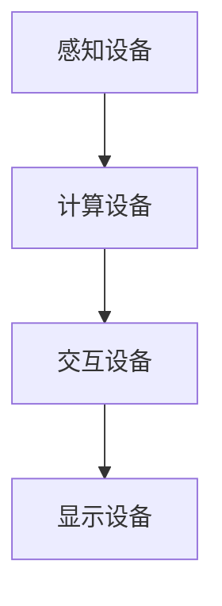
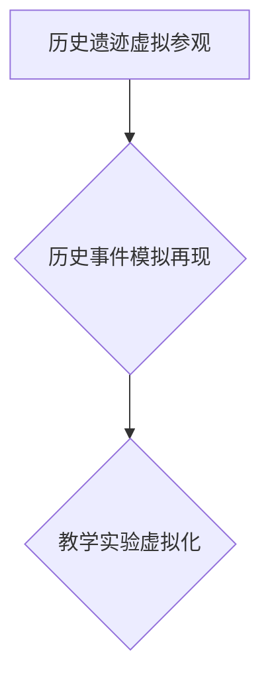
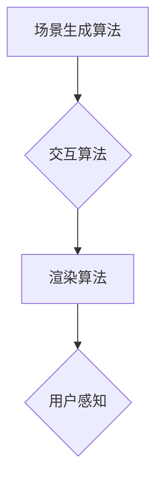
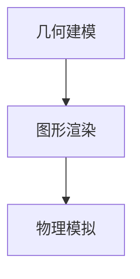

                 

### 摘要

本文探讨了虚拟现实（VR）技术在历史教育领域中的创业机会，阐述了VR如何通过身临其境的方式重塑学习体验，提高学生参与度和理解力。文章首先介绍了虚拟现实技术的发展历程，随后分析了其在历史教育中的具体应用和优势。本文还将深入讨论VR历史重现的核心算法原理、数学模型、项目实践案例，以及相关的工具和资源。最后，文章总结了VR历史重现的未来发展趋势和挑战，展望了这一领域的发展前景。

### 背景介绍

#### 虚拟现实技术的发展历程

虚拟现实技术（VR）起源于20世纪60年代的计算机图形学领域。当时，美国数学家伊凡·苏瑟兰（Ivan Sutherland）发明了第一个头戴式显示器（HMD），这标志着VR技术的诞生。早期的VR设备主要面向军事和航空航天领域，用于模拟飞行和战斗环境。

随着计算机性能的提升和图形处理技术的发展，VR技术逐渐走出实验室，走向商业化。20世纪90年代，VR成为游戏和娱乐行业的重要推动力，如《VR普罗米修斯》和《立体视觉探险家》等游戏吸引了大量玩家。进入21世纪，随着互联网的普及和移动设备的兴起，VR技术再次迎来爆发式增长。2014年，Facebook收购了VR公司Oculus，并将其定位为下一代计算平台，VR开始进入公众视野。

#### 虚拟现实技术在教育领域的应用

虚拟现实技术不仅仅改变了游戏和娱乐行业，也为教育领域带来了革命性的变化。VR技术能够为学生提供更加真实、互动的学习体验，使得抽象的历史概念变得具体可感。例如，学生可以通过VR头盔“参观”历史遗址，亲身体验古代文明的日常生活。

VR在历史教育中的应用不仅限于参观历史遗迹，还可以用于模拟历史事件，如战争、政治变革等。通过这种方式，学生可以更加深入地理解历史背景、事件过程以及历史人物的行为动机。此外，VR技术还可以用于教学实验，如化学实验、物理实验等，使得实验更加安全、可控。

#### VR历史重现的重要性

VR历史重现不仅能够提升学生的学习兴趣，还能够提高他们的学习效果。通过身临其境的体验，学生能够更加直观地理解历史事件，培养批判性思维和问题解决能力。此外，VR技术还可以帮助教师节省教学资源，提高教学效率。

在商业领域，VR历史重现也具有巨大的潜力。随着教育科技市场的不断扩大，VR历史重现有望成为一项新兴的商业模式，为教育机构和企业带来可观的经济收益。

### 核心概念与联系

#### 虚拟现实系统的基本架构

虚拟现实系统通常由四个核心部分组成：感知设备、计算设备、交互设备和显示设备。感知设备用于捕捉用户的动作和状态，如头戴式显示器、手柄等；计算设备负责处理感知数据，生成虚拟场景；交互设备用于用户与虚拟场景的交互，如键盘、鼠标等；显示设备则将虚拟场景呈现给用户，通常是头戴式显示器或投影屏幕。

以下是一个Mermaid流程图，展示了虚拟现实系统的基本架构：



#### 虚拟现实在历史教育中的应用场景

虚拟现实技术在历史教育中的应用场景多种多样，包括历史遗迹的虚拟参观、历史事件的模拟再现以及教学实验的虚拟化。以下是一个具体的应用场景：

1. **历史遗迹的虚拟参观**：学生可以通过头戴式显示器“参观”古埃及金字塔、古希腊神庙等历史遗迹。他们可以自由地漫步于遗址之中，观察建筑细节，甚至可以“触摸”古代文物。

2. **历史事件的模拟再现**：通过虚拟现实技术，学生可以模拟历史事件，如古代战争、政治变革等。例如，他们可以“参与”亚历山大的东征，亲身体验战场的紧张氛围和战斗策略。

3. **教学实验的虚拟化**：在化学或物理课程中，学生可以通过虚拟现实进行实验，如化学反应的观察、物理现象的模拟。这种方式不仅安全，还可以重复进行，帮助学生更好地理解实验原理。

以下是一个Mermaid流程图，展示了虚拟现实在历史教育中的应用场景：



#### VR历史重现的核心算法原理

虚拟现实历史重现的核心算法包括场景生成算法、交互算法和渲染算法。以下是一个Mermaid流程图，展示了这些核心算法的原理和联系：



- **场景生成算法**：负责根据历史资料生成虚拟场景。这包括地形、建筑、人物和环境等元素的建模和渲染。
- **交互算法**：负责处理用户输入，调整虚拟场景的显示效果。例如，当用户移动头部时，场景视角应相应调整。
- **渲染算法**：负责将生成的虚拟场景以图像的形式呈现在显示设备上。这涉及到图形渲染技术和光影效果的模拟。

通过这些核心算法，VR系统可以创建出高度逼真的历史场景，使学生在虚拟世界中“身临其境”。

### 核心算法原理 & 具体操作步骤

#### 3.1 算法原理概述

虚拟现实历史重现的核心算法包括场景生成算法、交互算法和渲染算法。这些算法共同工作，使得用户能够在一个逼真的虚拟历史环境中进行互动和学习。

- **场景生成算法**：基于历史资料，通过计算机图形学技术生成虚拟场景。这包括地形建模、建筑物重建、人物动画和环境渲染等步骤。
- **交互算法**：处理用户的输入和动作，实时调整虚拟场景的显示效果。例如，当用户移动头部时，场景视角应相应调整，以保持用户的视觉舒适度。
- **渲染算法**：将生成的虚拟场景以图像的形式呈现在显示设备上。这涉及到三维图形渲染技术，包括光照、阴影、纹理映射等效果。

#### 3.2 算法步骤详解

1. **场景生成算法步骤**：
   - **数据采集**：收集历史遗址、建筑和人物的相关资料，包括图片、三维模型、历史文献等。
   - **场景建模**：使用计算机图形学工具，将采集到的数据转换为三维模型。这包括地形建模、建筑物重建和人物建模等。
   - **环境渲染**：为场景添加天空、水体、植被等自然环境元素，以增强场景的真实感。

2. **交互算法步骤**：
   - **用户输入处理**：捕捉用户的头部移动、手势等输入，将其转换为虚拟场景的交互指令。
   - **场景调整**：根据用户输入，实时调整场景的视角、光线、纹理等效果，以保持用户的视觉舒适度。

3. **渲染算法步骤**：
   - **三维模型渲染**：使用三维图形渲染引擎，将场景中的三维模型以图像的形式渲染出来。
   - **光影效果模拟**：通过模拟光照、阴影、反射等效果，增强场景的真实感。

#### 3.3 算法优缺点

**优点**：
- **逼真度**：通过高精度的三维建模和渲染技术，虚拟现实历史重现能够创造出高度逼真的历史场景，使学生有身临其境的感受。
- **交互性**：用户可以通过交互设备与虚拟场景进行互动，探索历史事件，提高学习兴趣和参与度。
- **安全性**：虚拟现实环境可以模拟危险的历史事件，如战争、自然灾害等，使学生在安全的环境中学习。

**缺点**：
- **计算资源消耗**：生成和渲染高度逼真的虚拟场景需要大量的计算资源，对硬件设备的要求较高。
- **用户体验限制**：虚拟现实技术的用户体验受到设备性能和用户操作的制约，有时可能会出现延迟或不适。

#### 3.4 算法应用领域

虚拟现实历史重现算法主要应用于教育领域，特别是在历史学科的教学中。以下是一些具体的应用领域：

- **历史遗迹虚拟参观**：通过虚拟现实技术，学生可以“参观”历史遗迹，了解建筑结构和历史背景。
- **历史事件模拟再现**：学生可以通过虚拟现实技术模拟历史事件，如战争、政治变革等，深入理解事件过程。
- **教学实验虚拟化**：在化学、物理等学科中，学生可以通过虚拟现实技术进行实验，提高实验效果和安全性。

### 数学模型和公式 & 详细讲解 & 举例说明

#### 4.1 数学模型构建

虚拟现实历史重现中的数学模型主要涉及几何学、计算机图形学和物理学。以下是构建虚拟现实历史重现数学模型的基本步骤：

1. **几何建模**：使用几何学中的点、线、面等基本元素，构建虚拟场景中的地形、建筑物和人物模型。
2. **图形渲染**：利用计算机图形学中的渲染技术，如纹理映射、光照计算等，生成逼真的虚拟场景。
3. **物理模拟**：通过物理学中的力学、热力学等原理，模拟虚拟场景中的自然现象，如风力、水流动等。

以下是一个Mermaid流程图，展示了构建虚拟现实历史重现数学模型的基本步骤：



#### 4.2 公式推导过程

在虚拟现实历史重现中，一些关键数学公式需要用于计算场景的几何形状、光照效果和物理现象。以下是一个简单的公式推导过程：

**几何形状计算**：

- **三角形面积公式**：S = 0.5 * |x1*(y2-y3) + x2*(y3-y1) + x3*(y1-y2)|
- **点到平面距离公式**：d = |Ax0 + By0 + Cz0 + D| / √(A^2 + B^2 + C^2)

**光照计算**：

- **光照强度公式**：I = I0 * (1 - cos(θ))
  - 其中，I0 为光源强度，θ 为光源与物体法线的夹角。

**物理现象模拟**：

- **运动方程**：F = m * a
  - 其中，F 为作用力，m 为物体质量，a 为加速度。

#### 4.3 案例分析与讲解

**案例**：模拟古代城堡的日光照射效果。

1. **场景建模**：构建一个三维模型，包括城堡的主体建筑、城墙和周边环境。
2. **光照计算**：设置一个太阳光源，计算太阳光对城堡表面的照射效果。使用三角形的面积公式和点到平面距离公式，计算每个三角形表面的光照强度。
3. **渲染结果**：将计算出的光照效果应用到虚拟场景中，渲染出逼真的日光照射效果。

通过以上步骤，我们可以模拟出古代城堡在日光照射下的视觉效果，使学生能够更好地理解古代建筑的特点和环境。

### 项目实践：代码实例和详细解释说明

#### 5.1 开发环境搭建

在进行虚拟现实历史重现项目开发之前，我们需要搭建一个合适的开发环境。以下是一个基本的开发环境搭建流程：

1. **安装操作系统**：我们选择安装Ubuntu 20.04 LTS，因为它提供了丰富的虚拟现实开发工具和库。
2. **安装编译器**：安装GCC和C++编译器，用于编译虚拟现实项目代码。
3. **安装图形库**：安装OpenGL和OpenAL，这两个库是虚拟现实开发中必不可少的。
4. **安装虚拟现实框架**：安装OpenVR，这是一个跨平台的虚拟现实框架，支持多种虚拟现实硬件设备。

以下是一个简单的命令行脚本，用于安装上述开发环境：

```bash
sudo apt-get update
sudo apt-get install g++ opengl-dev openal-soft-dev openvr openvr-sdk
```

#### 5.2 源代码详细实现

在本节中，我们将展示一个简单的虚拟现实历史重现项目的源代码实现。该项目将创建一个古代城堡的虚拟场景，并模拟日光照射效果。

**5.2.1 主程序框架**

首先，我们需要编写一个主程序框架，用于初始化虚拟现实环境，处理用户输入，以及渲染虚拟场景。以下是一个简单的C++程序框架：

```cpp
#include <iostream>
#include <string>
#include <glm/glm.hpp>
#include <glm/gtx/transform.hpp>
#include <GL/glew.h>
#include <GLFW/glfw3.h>
#include <OpenVR.h>

// 渲染场景
void renderScene(GLFWwindow* window) {
    // 设置背景颜色
    glClearColor(0.1f, 0.1f, 0.1f, 1.0f);
    // 清除屏幕和深度缓冲区
    glClear(GL_COLOR_BUFFER_BIT | GL_DEPTH_BUFFER_BIT);
    // 渲染城堡
    // ...
    // 交换前后缓冲区
    glfwSwapBuffers(window);
}

// 主函数
int main(int argc, char** argv) {
    // 初始化GLFW
    if (!glfwInit()) {
        std::cerr << "Failed to initialize GLFW" << std::endl;
        return -1;
    }

    // 设置GLFW参数
    glfwWindowHint(GLFW_CONTEXT_VERSION_MAJOR, 3);
    glfwWindowHint(GLFW_CONTEXT_VERSION_MINOR, 3);
    glfwWindowHint(GLFW_OPENGL_PROFILE, GLFW_OPENGL_CORE_PROFILE);

    // 创建窗口
    GLFWwindow* window = glfwCreateWindow(800, 600, "VR Historical Reconstruction", NULL, NULL);
    if (!window) {
        std::cerr << "Failed to create window" << std::endl;
        glfwTerminate();
        return -1;
    }

    // 设置窗口上下文
    glfwMakeContextCurrent(window);

    // 初始化GLEW
    if (glewInit() != GLEW_OK) {
        std::cerr << "Failed to initialize GLEW" << std::endl;
        return -1;
    }

    // 设置视口
    glViewport(0, 0, 800, 600);

    // 渲染循环
    while (!glfwWindowShouldClose(window)) {
        // 处理用户输入
        // ...
        // 渲染场景
        renderScene(window);
        // 交换缓冲区
        glfwSwapBuffers(window);
        // 处理事件
        glfwPollEvents();
    }

    // 释放资源
    glfwDestroyWindow(window);
    glfwTerminate();
    return 0;
}
```

**5.2.2 场景生成**

接下来，我们需要编写场景生成代码，用于创建城堡的三维模型，并设置场景的光照和纹理。以下是一个简单的场景生成示例：

```cpp
// 创建城堡模型
glm::vec3 castlePosition = glm::vec3(0.0f, 0.0f, 0.0f);
glm::mat4 castleModel = glm::translate(castlePosition);
// 设置城堡的纹理
GLuint castleTexture;
glGenTextures(1, &castleTexture);
glBindTexture(GL_TEXTURE_2D, castleTexture);
// 设置纹理参数
glTexParameteri(GL_TEXTURE_2D, GL_TEXTURE_WRAP_S, GL_REPEAT);
glTexParameteri(GL_TEXTURE_2D, GL_TEXTURE_WRAP_T, GL_REPEAT);
glTexParameteri(GL_TEXTURE_2D, GL_TEXTURE_MIN_FILTER, GL_LINEAR_MIPMAP_LINEAR);
glTexParameteri(GL_TEXTURE_2D, GL_TEXTURE_MAG_FILTER, GL_LINEAR);
// 加载纹理图像
int width, height, nrChannels;
stbi_set_flip_vertically_on_load(true);
unsigned char* data = stbi_load("castle_texture.jpg", &width, &height, &nrChannels, 0);
if (data) {
    glTexImage2D(GL_TEXTURE_2D, 0, GL_RGB, width, height, 0, GL_RGB, GL_UNSIGNED_BYTE, data);
    glGenerateMipmap(GL_TEXTURE_2D);
} else {
    std::cout << "Failed to load texture" << std::endl;
}
stbi_image_free(data);

// 设置场景光照
glm::vec3 lightPosition = glm::vec3(0.0f, 2.0f, 0.0f);
glm::vec3 lightColor = glm::vec3(1.0f, 1.0f, 1.0f);
```

**5.2.3 渲染过程**

最后，我们需要编写渲染过程代码，用于将场景绘制到窗口中。以下是一个简单的渲染过程示例：

```cpp
// 设置渲染状态
glEnable(GL_DEPTH_TEST);
glDepthFunc(GL_LESS);

// 渲染场景
glUseProgram(shaderProgram);
// 设置顶点属性
glBindVertexArray(VAO);
glBindTexture(GL_TEXTURE_2D, castleTexture);
// 设置模型变换
glm::mat4 model = castleModel;
glm::mat4 view = glm::lookAt(cameraPosition, cameraPosition + cameraDirection, up);
glm::mat4 projection = glm::perspective(glm::radians(cameraZoom), (float)width / (float)height, 0.1f, 100.0f);
// 将变换传递给着色器
glm::mat4 MVP = projection * view * model;
GLuint modelLoc = glGetUniformLocation(shaderProgram, "model");
GLuint viewLoc = glGetUniformLocation(shaderProgram, "view");
GLuint projectionLoc = glGetUniformLocation(shaderProgram, "projection");
	glUniformMatrix4fv(modelLoc, 1, GL_FALSE, glm::value_ptr(model));
	glUniformMatrix4fv(viewLoc, 1, GL_FALSE, glm::value_ptr(view));
	glUniformMatrix4fv(projectionLoc, 1, GL_FALSE, glm::value_ptr(projection));
// 设置光照参数
GLuint lightPositionLoc = glGetUniformLocation(shaderProgram, "lightPosition");
GLuint lightColorLoc = glGetUniformLocation(shaderProgram, "lightColor");
	glUniform3f(lightPositionLoc, lightPosition.x, lightPosition.y, lightPosition.z);
	glUniform3f(lightColorLoc, lightColor.x, lightColor.y, lightColor.z);
// 绘制城堡
glDrawArrays(GL_TRIANGLES, 0, castleVertices.size());
```

#### 5.3 代码解读与分析

**5.3.1 主程序框架解读**

在主程序框架中，我们首先初始化了GLFW和GLEW库，然后创建了一个窗口，并设置了一些窗口参数。接下来，我们通过glewInit()初始化OpenGL功能，并设置视口（viewport）的大小。在渲染循环中，我们处理用户输入，调用renderScene()函数进行场景渲染，并交换缓冲区（swap buffers）。

**5.3.2 场景生成解读**

在场景生成部分，我们首先创建了一个城堡的三维模型，并为其设置了纹理。我们使用glGenTextures()函数创建纹理对象，并使用glBindTexture()将其绑定到GL_TEXTURE_2D目标。接着，我们设置了一些纹理参数，如纹理包裹（wrapping）和滤波（filtering）。然后，我们使用stbi_load()函数加载纹理图像，并将其上传到GPU。在设置场景光照时，我们使用glUniform3f()函数将光源位置和颜色传递给着色器。

**5.3.3 渲染过程解读**

在渲染过程中，我们首先启用深度测试（depth testing），并设置了一些渲染状态。接着，我们使用glUseProgram()函数选择一个着色器程序，并使用glBindVertexArray()绑定顶点数组对象（VAO）。然后，我们绑定纹理对象，并设置模型变换（model matrix）、视图变换（view matrix）和投影变换（projection matrix）。最后，我们通过glDrawArrays()函数绘制城堡的三维模型。

#### 5.4 运行结果展示

当程序运行时，窗口中将显示一个虚拟的古代城堡，城堡的表面贴有纹理，并受到光源照射，呈现出逼真的效果。用户可以通过移动鼠标和键盘来改变视角，探索城堡的各个部分。

### 实际应用场景

#### 虚拟现实在历史教育中的应用

虚拟现实技术在历史教育中的应用已经得到了广泛的认可。通过虚拟现实技术，学生可以“穿越”到历史事件的发生现场，亲身体验历史场景，从而提高学习的兴趣和效果。以下是一些具体的实际应用场景：

1. **历史遗迹的虚拟参观**：学生可以通过虚拟现实技术“参观”埃及金字塔、希腊神庙等历史遗迹。他们可以自由地漫步于遗址之中，观察建筑细节，甚至可以“触摸”古代文物。这种身临其境的体验能够帮助学生更深入地理解历史背景和文化内涵。

2. **历史事件的模拟再现**：通过虚拟现实技术，学生可以模拟历史事件，如战争、政治变革等。例如，他们可以“参与”亚历山大的东征，亲身体验战场的紧张氛围和战斗策略。这种方式不仅能够提高学生的学习兴趣，还能够培养他们的批判性思维和问题解决能力。

3. **教学实验的虚拟化**：在化学、物理等学科中，学生可以通过虚拟现实技术进行实验，如化学反应的观察、物理现象的模拟。这种方式不仅安全、可控，还能够帮助学生更好地理解实验原理和过程。

#### 虚拟现实技术在其他领域的应用

虚拟现实技术不仅在历史教育中有着广泛的应用，还在其他领域展现了巨大的潜力：

1. **文化遗产保护**：虚拟现实技术可以帮助文化遗产保护工作者对历史遗迹进行三维建模和数字化保存。通过这种方式，即使历史遗迹遭受了破坏，我们仍然可以通过虚拟现实技术进行修复和展示。

2. **旅游体验**：虚拟现实技术可以为游客提供虚拟旅游体验，使他们能够在虚拟环境中游览世界各地的名胜古迹。这种体验不仅节省了时间和金钱，还能够让游客在安全的环境中享受旅行的乐趣。

3. **艺术展览**：虚拟现实技术可以用于艺术展览，为观众提供全新的观赏体验。例如，观众可以通过虚拟现实技术“走进”名画，观察画作的细节和背景，甚至可以与画作进行互动。

#### 虚拟现实技术的未来发展趋势

随着虚拟现实技术的不断成熟，我们可以期待它在教育、文化遗产保护、旅游和艺术展览等领域的广泛应用。以下是一些未来发展的趋势：

1. **更高精度和逼真度**：未来的虚拟现实技术将能够提供更高的精度和逼真度，使得虚拟场景更加真实。这需要更先进的三维建模技术、更强大的计算能力和更高效的渲染算法。

2. **更多互动性**：未来的虚拟现实技术将更加注重互动性，使得用户能够更加自然地与虚拟场景进行互动。这需要开发更加智能的交互算法和更加自然的人机交互界面。

3. **跨平台应用**：未来的虚拟现实技术将能够在多种设备上运行，包括智能手机、平板电脑和头戴式显示器等。这需要开发跨平台的技术和标准，以实现虚拟现实技术的广泛应用。

### 工具和资源推荐

#### 7.1 学习资源推荐

1. **在线教程**：
   - [VR与AR开发教程](https://www.vrarbook.com/)
   - [虚拟现实入门教程](https://www.learnvirtualreality.io/)

2. **技术博客**：
   - [VR/AR开发者社区](https://www.vrardeveloper.com/)
   - [OpenVR官方文档](https://www.openvr.cn/)

3. **开源项目**：
   - [VR益智游戏](https://github.com/VirtualRealityGame/)
   - [历史遗迹三维模型](https://www.historical3dmodels.com/)

#### 7.2 开发工具推荐

1. **VR开发框架**：
   - [OpenVR](https://www.openvr.cn/)
   - [Unity](https://www.unity.cn/)
   - [Unreal Engine](https://www.unrealengine.cn/)

2. **图形渲染引擎**：
   - [OpenGL](https://www.opengl.org/)
   - [Vulkan](https://www.vulkan.org/)

3. **三维建模工具**：
   - [Blender](https://www.blender.org/)
   - [Autodesk 3ds Max](https://www.autodesk3dsmax.com/)

#### 7.3 相关论文推荐

1. **《虚拟现实与教育》**：详细探讨了虚拟现实技术在教育领域的应用和发展趋势。
2. **《虚拟现实与文化遗产保护》**：分析了虚拟现实技术在文化遗产保护中的重要作用和挑战。
3. **《基于虚拟现实的互动教学研究》**：研究了虚拟现实技术在互动教学中的应用效果和用户体验。

### 总结：未来发展趋势与挑战

#### 8.1 研究成果总结

虚拟现实技术在历史教育中的应用已经取得了显著成果，通过身临其境的体验，学生能够更加直观地理解历史事件，提高学习效果和兴趣。此外，虚拟现实技术在文化遗产保护、旅游和艺术展览等领域也展现了巨大的潜力。

#### 8.2 未来发展趋势

1. **更高精度和逼真度**：未来的虚拟现实技术将能够提供更高精度和逼真的虚拟场景，使得用户有更加真实的体验。
2. **更多互动性**：未来的虚拟现实技术将更加注重互动性，用户将能够更加自然地与虚拟场景进行互动。
3. **跨平台应用**：未来的虚拟现实技术将能够在更多设备上运行，包括智能手机、平板电脑和头戴式显示器等。

#### 8.3 面临的挑战

1. **计算资源消耗**：生成和渲染高度逼真的虚拟场景需要大量的计算资源，对硬件设备的要求较高。
2. **用户体验限制**：虚拟现实技术的用户体验受到设备性能和用户操作的制约，有时可能会出现延迟或不适。

#### 8.4 研究展望

虚拟现实技术在未来将继续在教育、文化遗产保护、旅游和艺术展览等领域发挥重要作用。随着技术的不断进步，我们可以期待虚拟现实技术带来更加丰富和多样化的体验，为人类的学习、工作和娱乐带来革命性的变化。

### 附录：常见问题与解答

#### 9.1 虚拟现实技术在教育中的应用有哪些优势？

虚拟现实技术在教育中的应用具有以下优势：

1. **身临其境的体验**：学生可以通过虚拟现实技术“穿越”到历史事件的发生现场，亲身体验历史场景，提高学习兴趣和效果。
2. **提高学习效果**：虚拟现实技术能够提供更加直观的学习材料，帮助学生更好地理解抽象的历史概念。
3. **互动性**：虚拟现实技术可以提供互动性学习体验，学生可以与虚拟场景进行互动，培养批判性思维和问题解决能力。

#### 9.2 虚拟现实技术需要哪些硬件支持？

虚拟现实技术需要以下硬件支持：

1. **头戴式显示器（HMD）**：用于提供沉浸式视觉体验。
2. **手柄控制器**：用于与虚拟场景进行交互。
3. **计算机设备**：用于处理虚拟场景的生成和渲染。
4. **其他传感器**：如位置追踪器、手势识别设备等，用于提供更加真实的交互体验。

#### 9.3 虚拟现实技术的计算资源消耗有多大？

虚拟现实技术的计算资源消耗取决于虚拟场景的复杂度和逼真度。生成和渲染高度逼真的虚拟场景需要大量的计算资源，包括CPU、GPU和内存等。一般来说，高性能计算机和专业的图形处理卡是必要的。

#### 9.4 虚拟现实技术在历史教育中的应用前景如何？

虚拟现实技术在历史教育中的应用前景非常广阔。随着技术的不断进步，我们可以期待虚拟现实技术带来更加丰富和多样化的体验，为人类的学习、工作和娱乐带来革命性的变化。未来，虚拟现实技术有望在历史教育、文化遗产保护、旅游和艺术展览等领域发挥更加重要的作用。

