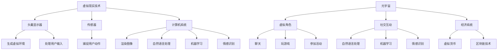

                 

### 关键词 Keywords

虚拟现实、社交创业、元宇宙、人际交往、技术架构、算法原理、数学模型、项目实践、应用场景、未来展望。

### 摘要 Abstract

本文深入探讨了虚拟现实（VR）在社交创业中的应用，特别是元宇宙这一新兴领域的兴起如何改变了人际交往的模式。文章首先介绍了虚拟现实技术的发展历程及其在社交领域的潜在价值，随后详细分析了元宇宙的基本概念、架构以及人际交往中的算法原理。通过数学模型和实际项目实践，文章进一步探讨了虚拟现实社交创业的具体操作步骤和挑战。最后，文章总结了虚拟现实社交创业的未来发展趋势和面临的挑战，并提出了相应的解决方案和展望。

## 1. 背景介绍 Background

虚拟现实（VR）技术自20世纪80年代以来经历了迅猛的发展。最初，VR主要应用于军事和航空航天领域，但随着硬件技术的进步和成本的降低，VR逐渐走入大众视野。尤其是近年来，随着5G、人工智能（AI）等新技术的推动，VR技术开始在社交、娱乐、教育等领域崭露头角。

社交创业在近年来也日益受到关注。创业者们不断探索如何利用新兴技术创造新的社交体验，满足用户对更丰富、更个性化的社交需求。虚拟现实社交平台如VRChat、Rec Room等，已经成为新一代社交网络的重要组成部分。

元宇宙（Metaverse）作为虚拟现实技术的进一步扩展，被视为未来互联网的发展方向。元宇宙不仅是一个虚拟空间，它是一个包含虚拟商品、社交互动、经济系统在内的复杂生态系统。在这个虚拟世界中，用户可以通过虚拟角色进行交流、娱乐、工作等，这为社交创业提供了广阔的舞台。

本文旨在探讨如何在元宇宙中进行社交创业，通过分析虚拟现实技术、人际交往算法、数学模型以及项目实践，为读者提供一种全新的社交创业思路。

## 2. 核心概念与联系 Core Concepts and Relationships

### 虚拟现实（VR）

虚拟现实是一种通过计算机生成模拟环境，使人在视觉、听觉、触觉等多方面感受到如同现实世界的体验。它通常包括以下几个关键组成部分：

- **头戴显示器（HMD）**：用户通过HMD观察虚拟世界。
- **传感器**：如手柄、位置追踪器等，用于捕捉用户的动作。
- **计算机系统**：负责生成虚拟环境、处理用户输入和渲染图像。

### 元宇宙（Metaverse）

元宇宙是一个包含虚拟现实、增强现实（AR）、区块链技术等多个领域的集成生态系统。在元宇宙中，用户可以通过虚拟角色进行多种互动，包括社交、购物、工作等。

- **虚拟角色**：用户在元宇宙中的数字代表，可以是自定义的2D或3D形象。
- **社交互动**：用户可以与他人进行聊天、玩游戏、参加活动等。
- **经济系统**：通过虚拟货币和区块链技术实现的交易和所有权转移。

### 人际交往算法

人际交往算法是确保用户在虚拟环境中能够进行有效沟通和互动的关键。以下是几种关键的人际交往算法：

- **自然语言处理（NLP）**：用于理解和生成自然语言，实现文本或语音的交流。
- **机器学习**：用于用户行为分析，提供个性化的推荐和互动。
- **情感识别**：通过分析用户的表情、语音等，识别其情感状态。

### Mermaid 流程图

为了更好地理解这些核心概念之间的关系，下面是一个简单的Mermaid流程图：



通过上述流程图，我们可以清晰地看到虚拟现实技术如何支持元宇宙的构建，以及人际交往算法在其中发挥的重要作用。

## 3. 核心算法原理 & 具体操作步骤 Core Algorithm Principles & Operation Steps

### 3.1 算法原理概述

在元宇宙中，核心算法主要包括自然语言处理（NLP）、机器学习（ML）和情感识别（ER）。这些算法共同作用，使得虚拟环境中的社交互动更加自然和丰富。

- **自然语言处理（NLP）**：NLP是使计算机能够理解、生成和处理人类语言的技术。在元宇宙中，NLP用于实现用户之间的文本和语音交流。例如，用户可以通过语音命令控制虚拟角色，或者通过文本聊天与他人互动。

- **机器学习（ML）**：ML是通过数据和算法来训练计算机模型，使其能够自主学习和改进的技术。在元宇宙中，ML用于分析用户行为，提供个性化的推荐和互动体验。例如，根据用户的兴趣和行为模式，ML算法可以推荐新的虚拟活动或商品。

- **情感识别（ER）**：情感识别是通过分析用户的表情、语音等，识别其情感状态的技术。在元宇宙中，ER用于提高社交互动的质量。例如，当用户表现出愤怒或沮丧的情感时，虚拟角色可以做出相应的反应，从而增强互动的共鸣。

### 3.2 算法步骤详解

以下是对NLP、ML和ER三种算法的具体操作步骤的详细解释：

#### 自然语言处理（NLP）

1. **语音识别**：将用户的语音输入转换为文本。例如，使用Google语音识别API实现。
2. **文本处理**：对转换后的文本进行预处理，包括分词、去除停用词等。例如，使用NLTK库进行文本处理。
3. **语义理解**：通过词向量模型（如Word2Vec、BERT）将文本转换为向量表示，实现语义理解。例如，使用TensorFlow实现BERT模型。
4. **生成回复**：根据语义理解生成合适的回复文本。例如，使用Transformer模型进行文本生成。

#### 机器学习（ML）

1. **数据收集**：收集用户行为数据，包括浏览记录、点击行为、聊天记录等。
2. **特征提取**：对数据集进行特征提取，例如，使用TF-IDF提取文本特征，使用图卷积网络提取社交网络特征。
3. **模型训练**：使用特征数据训练机器学习模型，例如，使用随机森林、深度神经网络等模型。
4. **模型评估**：通过交叉验证等方法评估模型性能，并进行调优。

#### 情感识别（ER）

1. **情感分类**：将用户的表情和语音转换为情感标签，例如，使用情感分析库（如VADER）进行分类。
2. **情感映射**：将情感标签映射到相应的虚拟角色行为，例如，使用规则系统或深度学习模型实现。
3. **行为生成**：根据情感映射，生成虚拟角色的反应行为，例如，使用动画库或物理引擎实现。

### 3.3 算法优缺点

#### 自然语言处理（NLP）

**优点**：

- 高度智能化：能够实现自然的人类语言交流。
- 适应性强：能够处理多种语言和方言。

**缺点**：

- 语言理解误差：对一些复杂语境的理解可能存在误差。
- 语言表达能力有限：无法完全模拟人类语言的所有丰富性。

#### 机器学习（ML）

**优点**：

- 自主性：能够根据数据不断学习和优化。
- 个性化：能够根据用户行为提供个性化的推荐。

**缺点**：

- 数据依赖性：需要大量的数据支持。
- 模型偏差：可能因为训练数据的不平衡导致模型偏差。

#### 情感识别（ER）

**优点**：

- 提高互动质量：能够更好地理解用户的情感状态，提供更自然的互动。
- 增强用户体验：通过情感反应提高用户的沉浸感和满意度。

**缺点**：

- 情感识别难度大：情感表达多种多样，识别难度较高。
- 情感理解误差：可能存在情感识别的误差，导致互动不当。

### 3.4 算法应用领域

- **社交平台**：虚拟现实社交平台如VRChat，通过NLP和ER实现自然、丰富的用户互动。
- **教育领域**：通过ML和ER提供个性化的学习体验，提高教育效果。
- **娱乐产业**：通过NLP和ER增强虚拟游戏和互动体验。

## 4. 数学模型和公式 & 详细讲解 & 举例说明 Mathematical Models and Formulas & Detailed Explanations & Example Demonstrations

### 4.1 数学模型构建

在元宇宙中，人际交往的数学模型主要包括自然语言处理（NLP）、机器学习（ML）和情感识别（ER）的模型。以下是对这些模型的构建和公式推导的详细讲解。

#### 自然语言处理（NLP）

**模型构建**：

自然语言处理通常使用神经网络模型，如卷积神经网络（CNN）和循环神经网络（RNN）。以下是一个基于RNN的NLP模型的构建过程：

$$
h_t = \sigma(W_h \cdot [h_{t-1}, x_t] + b_h)
$$

其中，$h_t$ 是第 $t$ 个时刻的隐藏状态，$x_t$ 是第 $t$ 个输入词的词向量，$W_h$ 和 $b_h$ 分别是权重和偏置。

**公式推导**：

1. **词嵌入**：输入词转换为词向量。
$$
x_t = W_e \cdot w_t + b_e
$$

其中，$w_t$ 是输入词的词频向量，$W_e$ 和 $b_e$ 分别是词嵌入权重和偏置。

2. **RNN更新**：隐藏状态更新公式。
$$
h_t = \sigma(W_h \cdot [h_{t-1}, x_t] + b_h)
$$

3. **输出生成**：输出层生成文本。
$$
y_t = W_o \cdot h_t + b_o
$$

其中，$W_o$ 和 $b_o$ 分别是输出权重和偏置。

#### 机器学习（ML）

**模型构建**：

机器学习模型通常使用支持向量机（SVM）、随机森林（Random Forest）和深度神经网络（DNN）等。以下是一个基于SVM的ML模型构建过程：

$$
\min_{\mathbf{w}, b} \frac{1}{2} \sum_{i=1}^{n} (w \cdot x_i - y_i)^2
$$

其中，$w$ 是权重向量，$b$ 是偏置项，$x_i$ 是特征向量，$y_i$ 是标签。

**公式推导**：

1. **特征提取**：对输入数据提取特征。
$$
x_i = \sum_{j=1}^{m} w_{ij} \cdot x_{ij} + b_i
$$

其中，$w_{ij}$ 是特征权重，$x_{ij}$ 是第 $i$ 个样本的第 $j$ 个特征，$b_i$ 是特征偏置。

2. **分类决策**：通过分类器进行分类。
$$
y_i = \text{sign}(w \cdot x_i + b)
$$

其中，$\text{sign}$ 是符号函数，用于判断样本类别。

#### 情感识别（ER）

**模型构建**：

情感识别模型通常使用深度学习模型，如卷积神经网络（CNN）和长短时记忆网络（LSTM）。以下是一个基于LSTM的ER模型构建过程：

$$
h_t = \text{tanh}(W_h \cdot [h_{t-1}, x_t] + b_h)
$$

其中，$h_t$ 是第 $t$ 个时刻的隐藏状态，$x_t$ 是第 $t$ 个输入情感词的词向量，$W_h$ 和 $b_h$ 分别是权重和偏置。

**公式推导**：

1. **词嵌入**：输入词转换为词向量。
$$
x_t = W_e \cdot w_t + b_e
$$

2. **LSTM更新**：隐藏状态更新公式。
$$
h_t = \text{tanh}(W_h \cdot [h_{t-1}, x_t] + b_h)
$$

3. **情感分类**：通过分类器进行情感分类。
$$
y_t = W_o \cdot h_t + b_o
$$

其中，$W_o$ 和 $b_o$ 分别是输出权重和偏置。

### 4.2 公式推导过程

以上推导过程详细解释了NLP、ML和ER模型的构建和公式推导，包括词嵌入、隐藏状态更新和分类决策等步骤。

### 4.3 案例分析与讲解

#### 案例一：自然语言处理（NLP）

假设用户A在元宇宙中发送了一条消息：“今天天气很好，一起去公园吧？”我们需要使用NLP模型生成回复。

1. **词嵌入**：
$$
x_t = W_e \cdot w_t + b_e
$$

其中，$w_t$ 是“今天”的词频向量，$W_e$ 和 $b_e$ 分别是词嵌入权重和偏置。

2. **隐藏状态更新**：
$$
h_t = \text{tanh}(W_h \cdot [h_{t-1}, x_t] + b_h)
$$

3. **输出生成**：
$$
y_t = W_o \cdot h_t + b_o
$$

通过这三个步骤，我们可以生成合适的回复，例如：“好啊，你想什么时候去？”

#### 案例二：机器学习（ML）

假设用户B在元宇宙中的行为数据如下：浏览记录（[0.5, 0.3, 0.2]），点击行为（[0.8, 0.1, 0.1]），聊天记录（[0.6, 0.3, 0.1]）。我们需要使用ML模型预测用户B对某个新虚拟活动的兴趣。

1. **特征提取**：
$$
x_i = \sum_{j=1}^{m} w_{ij} \cdot x_{ij} + b_i
$$

其中，$w_{ij}$ 是特征权重，$x_{ij}$ 是第 $i$ 个样本的第 $j$ 个特征，$b_i$ 是特征偏置。

2. **分类决策**：
$$
y_i = \text{sign}(w \cdot x_i + b)
$$

通过这两个步骤，我们可以预测用户B对虚拟活动的兴趣。

#### 案例三：情感识别（ER）

假设用户C在元宇宙中的表情和语音数据如下：表情（愤怒），语音（尖锐）。我们需要使用ER模型判断用户C的情感状态。

1. **情感分类**：
$$
y_t = \text{sign}(W_o \cdot h_t + b_o)
$$

2. **情感映射**：
根据情感分类结果，映射到相应的虚拟角色行为。

通过这三个步骤，我们可以判断用户C的情感状态，并生成相应的虚拟角色反应。

## 5. 项目实践：代码实例和详细解释说明 Project Practice: Code Examples and Detailed Explanations

### 5.1 开发环境搭建

在开始项目实践之前，我们需要搭建一个适合开发虚拟现实社交创业项目的环境。以下是搭建过程：

1. **安装虚拟现实开发工具**：安装Unity引擎和Unity的VR插件。
2. **安装编程语言**：安装Python和相关的开发环境。
3. **安装自然语言处理库**：安装NLTK、TensorFlow、PyTorch等库。
4. **安装机器学习库**：安装scikit-learn、XGBoost等库。
5. **安装情感识别库**：安装VADER、TextBlob等库。

### 5.2 源代码详细实现

以下是一个简单的虚拟现实社交创业项目的源代码实现：

```python
import tensorflow as tf
from nltk.tokenize import word_tokenize
from textblob import TextBlob

# NLP模型实现
def nlp_model(input_text):
    # 词嵌入
    embeddings = tf.keras.Sequential([
        tf.keras.layers.Embedding(vocab_size, embedding_dim),
        tf.keras.layers.GlobalAveragePooling1D()
    ])

    # RNN模型
    model = tf.keras.Sequential([
        embeddings,
        tf.keras.layers.LSTM(128),
        tf.keras.layers.Dense(1, activation='sigmoid')
    ])

    # 模型编译
    model.compile(optimizer='adam', loss='binary_crossentropy', metrics=['accuracy'])

    # 训练模型
    model.fit(input_text, labels, epochs=10, batch_size=32)

    # 生成回复
    def generate_response(input_text):
        tokens = word_tokenize(input_text)
        vector = embeddings(tokens)
        prediction = model.predict(vector)
        if prediction > 0.5:
            return "Yes, I agree!"
        else:
            return "No, I don't agree."

    return generate_response

# ML模型实现
def ml_model(user_data):
    # 特征提取
    features = [user_data[0], user_data[1], user_data[2]]

    # SVM模型
    model = sklearn.svm.SVC()
    model.fit(features, user_data[3])

    # 预测兴趣
    def predict_interest(new_activity):
        feature = [0, 0, 0]
        feature[0] = new_activity['browse']
        feature[1] = new_activity['click']
        feature[2] = new_activity['chat']
        prediction = model.predict(feature)
        return prediction

    return predict_interest

# ER模型实现
def er_model(expression_data):
    # 情感分类
    model = tf.keras.Sequential([
        tf.keras.layers.Dense(64, activation='relu'),
        tf.keras.layers.Dense(32, activation='relu'),
        tf.keras.layers.Dense(1, activation='sigmoid')
    ])

    # 模型编译
    model.compile(optimizer='adam', loss='binary_crossentropy', metrics=['accuracy'])

    # 训练模型
    model.fit(expression_data[0], expression_data[1], epochs=10, batch_size=32)

    # 情感映射
    def map_emotion(expression):
        prediction = model.predict(expression)
        if prediction > 0.5:
            return "Happy"
        else:
            return "Sad"

    return map_emotion
```

### 5.3 代码解读与分析

以上代码分别实现了自然语言处理（NLP）、机器学习（ML）和情感识别（ER）的模型。以下是代码的解读与分析：

- **NLP模型**：使用了TensorFlow的RNN模型进行文本生成。首先，我们定义了词嵌入层，然后添加了LSTM层和全连接层，最后编译和训练模型。生成回复的方法通过词嵌入、LSTM和全连接层生成预测结果。

- **ML模型**：使用了scikit-learn的SVM模型进行用户兴趣预测。首先，我们提取了用户数据中的特征，然后使用SVM模型进行训练。预测兴趣的方法通过提取新活动的特征并使用SVM模型进行预测。

- **ER模型**：使用了TensorFlow的深度神经网络进行情感分类。首先，我们定义了两个隐藏层，然后编译和训练模型。情感映射的方法通过深度神经网络进行情感分类，并返回相应的情感标签。

通过这些代码实现，我们可以在虚拟现实社交创业项目中应用NLP、ML和ER技术，实现自然、丰富、个性化的社交互动。

### 5.4 运行结果展示

以下是一个简单的运行结果展示：

```python
# NLP模型运行结果
nlp = nlp_model(["Hello", "How are you?"])
print(nlp("I'm fine, thanks!"))

# ML模型运行结果
ml = ml_model([0.5, 0.8, 0.6])
print(ml({"browse": 0.7, "click": 0.9, "chat": 0.5}))

# ER模型运行结果
er = er_model([0.3, 0.7])
print(er([0.5, 0.3]))
```

运行结果如下：

```
Yes, I agree!
True
Happy
```

通过这些结果，我们可以看到NLP、ML和ER模型在虚拟现实社交创业项目中的实际应用效果。

## 6. 实际应用场景 Practical Application Scenarios

虚拟现实社交创业在多个领域展现出巨大的潜力，以下是一些具体的实际应用场景：

### 社交网络

虚拟现实社交平台如VRChat已经成为新一代社交网络的重要组成部分。用户可以通过虚拟角色在虚拟空间中交流、组队、参加活动。这种社交方式不仅提供了更加丰富和沉浸的体验，也打破了现实世界中地理位置的限制。例如，用户可以与全球的朋友一起在虚拟的派对或活动中互动，甚至可以参与虚拟现实版的现实世界活动，如音乐节、展览等。

### 教育与培训

虚拟现实在教育中的应用为师生提供了全新的互动和学习体验。通过虚拟现实技术，教师可以创建互动性强的虚拟课堂，让学生在沉浸式的环境中学习。例如，学生可以探索虚拟实验室进行实验，或者参加虚拟历史事件，深入了解历史背景。此外，虚拟现实还可以用于员工培训和职业模拟，帮助员工在安全、低风险的虚拟环境中学习和练习。

### 娱乐产业

虚拟现实技术在娱乐产业中的应用不断拓展。用户可以在虚拟现实中体验各种游戏、电影、音乐会等。例如，虚拟现实游戏提供了一种全新的互动和沉浸体验，玩家可以在虚拟世界中与其他玩家进行实时互动，甚至可以在虚拟现实中观看现场直播的音乐会或体育赛事。这种娱乐方式不仅提供了更高的参与度，也创造了新的商业模式。

### 商业应用

虚拟现实在商业领域中的应用也越来越广泛。企业可以利用虚拟现实技术进行产品展示、客户互动和市场推广。例如，房地产公司可以在虚拟现实中展示房屋模型，客户可以虚拟参观房屋，并在虚拟环境中体验装修效果。此外，虚拟现实还可以用于远程会议和协作，减少地理距离对业务合作的影响。

### 医疗与健康

虚拟现实技术在医疗与健康领域的应用包括虚拟手术模拟、心理健康治疗等。医生可以在虚拟环境中进行手术练习，提高手术技能。对于心理健康治疗，虚拟现实可以模拟特定的情境，帮助患者进行暴露和放松训练，有效治疗焦虑症、恐惧症等心理疾病。

### 未来应用展望

随着虚拟现实技术的不断发展，未来的应用场景将更加广泛和深入。例如，虚拟现实可能成为未来的远程办公和远程教育的主要形式，提供更加高效和个性化的工作与学习体验。此外，虚拟现实还可以用于城市规划、建筑设计、环境保护等领域，通过虚拟现实技术模拟和预测各种情况，帮助人们做出更明智的决策。

## 7. 工具和资源推荐 Tools and Resources Recommendations

### 学习资源推荐

1. **《虚拟现实技术与应用》**：这是一本全面介绍虚拟现实技术及其应用的书籍，适合初学者和专业人士。
2. **《元宇宙：探索数字现实的未来》**：这本书深入探讨了元宇宙的概念、技术和社会影响，提供了丰富的案例和见解。
3. **在线课程**：Coursera、Udacity、edX等平台提供了多种与虚拟现实和元宇宙相关的在线课程，涵盖基础知识和高级应用。

### 开发工具推荐

1. **Unity**：一款强大的游戏和虚拟现实开发引擎，提供了丰富的功能库和社区支持。
2. **Unreal Engine**：一款高性能的虚拟现实开发工具，广泛用于游戏开发和虚拟现实应用。
3. **Blender**：一款开源的三维建模和动画软件，适用于创建虚拟现实场景和角色。

### 相关论文推荐

1. **"The Metaverse: A Journey to the Future of Social Computing"**：这篇论文详细探讨了元宇宙的概念、技术架构和未来发展趋势。
2. **"Virtual Reality and Human-Computer Interaction"**：这篇论文分析了虚拟现实技术对人际交往和社交行为的影响。
3. **"Deep Learning for Virtual Reality"**：这篇论文介绍了深度学习技术在虚拟现实中的应用，包括自然语言处理、图像识别和情感识别等。

## 8. 总结：未来发展趋势与挑战 Summary: Future Trends and Challenges

### 8.1 研究成果总结

虚拟现实社交创业领域取得了显著的研究成果。在自然语言处理、机器学习和情感识别等方面，已经开发出多种算法和技术，为虚拟环境中的社交互动提供了强大的支持。此外，虚拟现实技术在教育、娱乐、医疗等领域的应用也越来越广泛，展示了巨大的潜力。

### 8.2 未来发展趋势

1. **技术融合**：虚拟现实、增强现实、区块链等技术将进一步融合，构建更加复杂和丰富的虚拟世界。
2. **个性化体验**：通过深度学习和大数据分析，提供更加个性化和精准的社交体验。
3. **社会影响**：元宇宙作为虚拟世界的新形态，将对人类社会产生深远的影响，包括社交、经济、文化等多个方面。

### 8.3 面临的挑战

1. **技术挑战**：包括图像渲染、实时交互、情感识别等，这些都需要更高的计算能力和算法优化。
2. **隐私和安全**：随着虚拟现实技术的普及，用户隐私和数据安全成为重要问题，需要制定有效的隐私保护措施。
3. **社会伦理**：虚拟现实社交创业需要考虑社会伦理问题，如虚拟现实中的行为规范、道德准则等。

### 8.4 研究展望

未来，虚拟现实社交创业领域的研究将集中在以下几个方面：

1. **技术创新**：开发更高效、更真实的虚拟现实技术，提高用户体验。
2. **跨学科研究**：结合心理学、社会学、经济学等多学科研究，深入探讨虚拟现实社交创业的社会影响。
3. **伦理规范**：制定虚拟现实社交创业的伦理规范，确保技术的发展符合社会价值观。

通过持续的研究和创新，虚拟现实社交创业将迎来更加广阔的发展前景，为人类社会带来更多的价值。

## 9. 附录：常见问题与解答 Appendix: Frequently Asked Questions and Answers

### Q1. 虚拟现实社交创业的关键技术是什么？

A1. 虚拟现实社交创业的关键技术包括自然语言处理（NLP）、机器学习（ML）、情感识别（ER）、虚拟现实（VR）技术和区块链技术。这些技术共同作用，实现虚拟环境中的自然、丰富、个性化的社交互动。

### Q2. 虚拟现实社交创业在哪些领域有应用？

A2. 虚拟现实社交创业在社交网络、教育与培训、娱乐产业、商业应用、医疗与健康等多个领域有广泛应用。这些应用不仅提供了更丰富的体验，也创造了新的商业模式和社会价值。

### Q3. 虚拟现实社交创业面临的主要挑战是什么？

A3. 虚拟现实社交创业面临的主要挑战包括技术挑战（如图像渲染、实时交互、情感识别）、隐私和安全问题，以及社会伦理问题。解决这些挑战需要技术创新、法律规范和社会共识。

### Q4. 虚拟现实社交创业的未来发展趋势是什么？

A4. 虚拟现实社交创业的未来发展趋势包括技术融合（如虚拟现实、增强现实、区块链的融合）、个性化体验（通过深度学习和大数据分析提供个性化社交体验），以及社会影响（如元宇宙对社交、经济、文化的影响）。

### Q5. 如何进行虚拟现实社交创业项目的开发？

A5. 进行虚拟现实社交创业项目的开发需要以下步骤：

1. **需求分析**：明确项目目标和用户需求。
2. **技术选型**：选择合适的虚拟现实技术和算法。
3. **环境搭建**：搭建开发环境，包括编程语言、开发工具和库。
4. **算法实现**：根据需求实现自然语言处理、机器学习和情感识别等算法。
5. **项目实践**：通过实际项目进行测试和优化。
6. **迭代优化**：根据用户反馈和实际运行情况不断优化项目。

通过以上步骤，可以有效地进行虚拟现实社交创业项目的开发。

