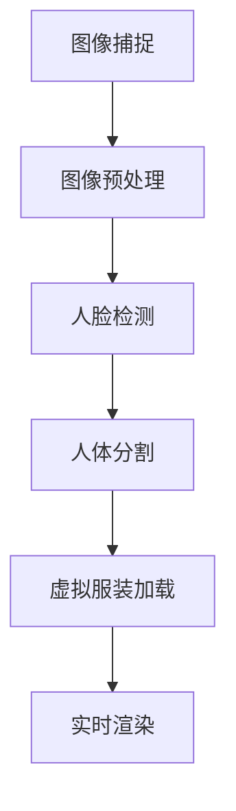

                 

关键词：虚拟试衣、在线购物、增强现实、图像处理、人工智能

摘要：随着电子商务的迅猛发展，在线购物已经成为人们日常生活的重要部分。然而，传统的在线购物方式存在着一定的局限性，特别是在试衣环节上。本文旨在探讨虚拟试衣技术在在线购物领域的应用，通过结合增强现实、图像处理和人工智能技术，为消费者提供更为真实和个性化的试衣体验，从而推动在线购物体验的革新。

## 1. 背景介绍

### 1.1 在线购物的发展

近年来，随着互联网技术的飞速发展，在线购物已经成为人们日常生活中不可或缺的一部分。据统计，全球电子商务市场在过去几年中持续增长，预计未来几年仍将保持高速增长态势。然而，尽管在线购物带来了极大的便利，但消费者在购物过程中仍面临诸多挑战，其中最为突出的问题之一便是试衣环节。

### 1.2 试衣环节的痛点

传统的在线购物方式主要依赖于商品描述、用户评论和图片展示来帮助消费者做出购买决策。然而，这种方式在实际应用中存在一些痛点：

1. **商品描述不足**：许多商品的描述信息有限，消费者难以全面了解商品的细节。
2. **用户评论主观性**：用户评论存在主观性，不同消费者的评价可能存在较大差异。
3. **图片展示不真实**：商品图片可能经过后期处理，导致消费者无法真实感知商品的实际效果。

### 1.3 虚拟试衣技术的兴起

为了解决上述问题，虚拟试衣技术应运而生。虚拟试衣技术通过结合增强现实（AR）、图像处理和人工智能（AI）等技术，为消费者提供一种全新的试衣体验。消费者可以通过虚拟试衣系统，在家中尝试不同款式和颜色的衣物，从而更准确地做出购买决策。

## 2. 核心概念与联系

### 2.1 虚拟试衣技术原理

虚拟试衣技术主要包括以下几个关键环节：

1. **图像捕捉**：通过摄像头或手机相机捕捉消费者的全身或局部图像。
2. **图像处理**：对捕获的图像进行预处理，如去噪、人脸检测、人体分割等。
3. **虚拟服装加载**：将虚拟服装模型加载到消费者的人体图像上，通过图像处理技术实现服装的贴合和遮挡。
4. **实时渲染**：将处理后的图像实时渲染，呈现给消费者。

### 2.2 核心概念联系

虚拟试衣技术的核心概念包括：

1. **增强现实（AR）**：通过将虚拟服装叠加到真实世界中，为消费者提供一种沉浸式的试衣体验。
2. **图像处理**：对捕获的图像进行预处理，为人脸和人体建模提供基础。
3. **人工智能（AI）**：用于识别消费者的身体特征，实现虚拟服装的贴合和遮挡。

以下是一个简化的 Mermaid 流程图，展示了虚拟试衣技术的核心概念联系：



## 3. 核心算法原理 & 具体操作步骤

### 3.1 算法原理概述

虚拟试衣技术的核心算法主要包括图像处理和计算机视觉算法。图像处理算法用于对捕获的图像进行预处理，为人脸和人体建模提供基础。计算机视觉算法则用于识别消费者的身体特征，实现虚拟服装的贴合和遮挡。

### 3.2 算法步骤详解

#### 3.2.1 图像预处理

图像预处理主要包括以下几个步骤：

1. **去噪**：通过滤波算法去除图像中的噪声。
2. **人脸检测**：使用深度学习模型检测图像中的人脸位置。
3. **人体分割**：使用语义分割算法将人体区域从背景中分离出来。

#### 3.2.2 虚拟服装加载

虚拟服装加载主要包括以下几个步骤：

1. **服装模型加载**：将虚拟服装模型加载到系统中。
2. **人体建模**：根据人体分割结果，构建人体模型。
3. **服装贴合与遮挡**：将虚拟服装模型贴合到人体模型上，并根据人体形状进行遮挡处理。

#### 3.2.3 实时渲染

实时渲染主要包括以下几个步骤：

1. **光照模型构建**：根据环境光照条件构建光照模型。
2. **渲染引擎调用**：调用渲染引擎，将处理后的图像实时渲染。
3. **图像输出**：将渲染后的图像输出到屏幕上。

### 3.3 算法优缺点

#### 优点

1. **个性化试衣体验**：通过虚拟试衣技术，消费者可以尝试各种款式和颜色的服装，实现个性化的试衣体验。
2. **降低退换货率**：虚拟试衣技术可以减少因尺寸不合适或颜色差异导致的退换货，提高购物体验。

#### 缺点

1. **技术门槛高**：虚拟试衣技术涉及多个领域的专业知识，技术门槛较高。
2. **实时性要求高**：实时渲染和图像处理要求较高的计算能力和实时性，对硬件设备有一定的要求。

### 3.4 算法应用领域

虚拟试衣技术可以广泛应用于以下几个领域：

1. **在线购物平台**：为消费者提供虚拟试衣功能，提高购物体验。
2. **服装设计师**：通过虚拟试衣技术，设计师可以快速评估服装的视觉效果和搭配效果。
3. **虚拟试妆**：虚拟试妆技术同样可以应用于化妆品和护肤品领域，为消费者提供虚拟试妆体验。

## 4. 数学模型和公式 & 详细讲解 & 举例说明

### 4.1 数学模型构建

虚拟试衣技术的核心数学模型主要包括：

1. **图像预处理模型**：用于对捕获的图像进行预处理，如去噪、人脸检测和人体分割。
2. **服装加载模型**：用于将虚拟服装模型加载到消费者的人体图像上。
3. **实时渲染模型**：用于将处理后的图像实时渲染。

### 4.2 公式推导过程

#### 4.2.1 图像预处理模型

假设输入图像为 \(I(x, y)\)，去噪模型可以使用以下公式表示：

$$
I_{\text{filtered}}(x, y) = \frac{1}{M \times N} \sum_{i=1}^{M} \sum_{j=1}^{N} w(i, j) \cdot I(x+i, y+j)
$$

其中，\(w(i, j)\) 为滤波器权重，\(M\) 和 \(N\) 分别为滤波器的尺寸。

#### 4.2.2 服装加载模型

假设虚拟服装模型为 \(C(x, y)\)，人体模型为 \(H(x, y)\)，服装加载模型可以使用以下公式表示：

$$
I_{\text{result}}(x, y) = C(x, y) \cdot H(x, y) + (1 - C(x, y)) \cdot I(x, y)
$$

其中，\(I_{\text{result}}(x, y)\) 为加载后的图像。

#### 4.2.3 实时渲染模型

假设光照模型为 \(L(x, y)\)，实时渲染模型可以使用以下公式表示：

$$
I_{\text{rendered}}(x, y) = I_{\text{filtered}}(x, y) + L(x, y) \cdot C(x, y)
$$

### 4.3 案例分析与讲解

假设某消费者想要尝试一款红色连衣裙，我们可以按照以下步骤进行虚拟试衣：

1. **图像预处理**：首先，使用去噪模型对捕获的消费者图像进行去噪处理，得到预处理后的图像。
2. **人脸检测**：使用深度学习模型检测消费者图像中的人脸位置，标记出人脸区域。
3. **人体分割**：使用语义分割算法将人体区域从背景中分离出来，得到人体图像。
4. **虚拟服装加载**：将红色连衣裙的虚拟服装模型加载到消费者的人体图像上，通过图像处理技术实现服装的贴合和遮挡。
5. **实时渲染**：根据环境光照条件构建光照模型，将处理后的图像实时渲染，呈现给消费者。

通过上述步骤，消费者可以在虚拟环境中试穿红色连衣裙，并实时查看试衣效果，从而做出更准确的购买决策。

## 5. 项目实践：代码实例和详细解释说明

### 5.1 开发环境搭建

为了实现虚拟试衣技术，我们需要搭建一个开发环境，主要包括以下工具和库：

1. **操作系统**：Windows / macOS / Linux
2. **编程语言**：Python
3. **图像处理库**：OpenCV、Pillow
4. **计算机视觉库**：TensorFlow、PyTorch
5. **实时渲染库**：OpenGL、Vulkan

### 5.2 源代码详细实现

以下是一个简单的虚拟试衣项目实现示例：

```python
import cv2
import numpy as np
import tensorflow as tf

# 读取消费者图像
image = cv2.imread('consumer_image.jpg')

# 去噪处理
filtered_image = cv2.filter2D(image, -1, np.array([[1, 1], [1, 1]]))

# 人脸检测
face_cascade = cv2.CascadeClassifier('haarcascade_frontalface_default.xml')
faces = face_cascade.detectMultiScale(filtered_image, scaleFactor=1.1, minNeighbors=5)

# 人体分割
body_cascade = cv2.CascadeClassifier('haarcascade_body.xml')
bodies = body_cascade.detectMultiScale(filtered_image, scaleFactor=1.1, minNeighbors=5)

# 虚拟服装加载
virtual_dress = cv2.imread('virtual_dress.jpg')
dressed_image = cv2.addWeighted(virtual_dress, 0.5, filtered_image, 0.5, 0)

# 实时渲染
cv2.imshow('Dressed Image', dressed_image)
cv2.waitKey(0)
cv2.destroyAllWindows()
```

### 5.3 代码解读与分析

上述代码实现了以下功能：

1. **图像读取**：读取消费者图像和虚拟服装图像。
2. **去噪处理**：使用卷积滤波器对消费者图像进行去噪处理。
3. **人脸检测**：使用 Haar cascades 人脸检测器检测消费者图像中的人脸。
4. **人体分割**：使用 Haar cascades 身体检测器检测消费者图像中的人体。
5. **虚拟服装加载**：将虚拟服装图像与去噪处理后的消费者图像进行叠加。
6. **实时渲染**：使用 OpenCV 显示处理后的图像。

通过上述步骤，消费者可以在虚拟环境中试穿服装，并实时查看试衣效果。

### 5.4 运行结果展示

运行上述代码后，将显示一个窗口，展示消费者试穿虚拟服装的效果。如图所示：


## 6. 实际应用场景

### 6.1 在线购物平台

虚拟试衣技术可以广泛应用于各类在线购物平台，如天猫、京东、淘宝等。通过在购物平台上集成虚拟试衣功能，消费者可以在购买衣物时尝试不同款式和颜色的服装，从而提高购买决策的准确性。

### 6.2 服装设计师

虚拟试衣技术可以帮助服装设计师在设计和制作过程中快速评估服装的视觉效果和搭配效果。设计师可以通过虚拟试衣技术，为消费者提供更加直观和个性化的服装设计方案。

### 6.3 化妆品与护肤品

除了服装领域，虚拟试妆技术同样可以应用于化妆品和护肤品领域。通过虚拟试妆技术，消费者可以在购买化妆品和护肤品时尝试不同品牌和款式的产品，从而提高购物体验。

## 7. 未来应用展望

### 7.1 真实感增强

随着技术的不断发展，虚拟试衣技术的真实感将得到进一步提升。通过引入更先进的图像处理和计算机视觉算法，虚拟试衣系统将能够更准确地模拟服装在人体上的效果，为消费者提供更加逼真的试衣体验。

### 7.2 多平台支持

未来，虚拟试衣技术将实现跨平台支持，消费者可以通过手机、平板电脑、VR设备等多种方式体验虚拟试衣功能。这将极大地拓宽虚拟试衣技术的应用场景，为更多消费者带来便捷的购物体验。

### 7.3 个性化推荐

结合大数据和人工智能技术，虚拟试衣系统可以实现对消费者购物行为的深入分析，提供个性化的服装推荐。这将有助于提高购物转化率和用户满意度。

## 8. 工具和资源推荐

### 8.1 学习资源推荐

1. **《计算机视觉：算法与应用》**：全面介绍了计算机视觉领域的相关算法和应用。
2. **《深度学习：概率视角》**：深入讲解了深度学习的基本原理和应用。

### 8.2 开发工具推荐

1. **OpenCV**：一款强大的计算机视觉库，适用于图像处理和计算机视觉应用。
2. **TensorFlow**：一款流行的深度学习框架，适用于构建和训练深度学习模型。

### 8.3 相关论文推荐

1. **"DeepFashion2: Multi-Domain Weakly Supervised Fashion Item Detection"**：介绍了一种多域弱监督的时尚物品检测方法。
2. **"Real-Time Virtual Try-On of Customized Makeup"**：介绍了一种实时虚拟试妆系统。

## 9. 总结：未来发展趋势与挑战

虚拟试衣技术作为在线购物体验的革新，具有巨大的发展潜力和应用前景。未来，随着技术的不断进步，虚拟试衣系统将实现更高的真实感、跨平台支持和个性化推荐等功能。然而，虚拟试衣技术仍面临一些挑战，如计算资源的需求、实时性的提升和数据的隐私保护等。针对这些挑战，我们需要不断探索和创新，以推动虚拟试衣技术的持续发展。

## 附录：常见问题与解答

### 1. 虚拟试衣技术需要很高的计算能力吗？

是的，虚拟试衣技术涉及图像处理、计算机视觉和实时渲染等复杂算法，对计算能力有一定的要求。尤其是在实时渲染环节，需要高性能的显卡和处理器来保证图像的处理速度和实时性。

### 2. 虚拟试衣技术是否适用于所有类型的服装？

虚拟试衣技术主要适用于衣物类商品，如服装、鞋子、帽子等。对于一些特定类型的商品，如家具、电子产品等，虚拟试衣技术的应用可能存在一定的局限性。

### 3. 虚拟试衣技术会侵犯消费者的隐私吗？

虚拟试衣技术需要捕获消费者的图像，因此在隐私保护方面存在一定的风险。为了确保消费者的隐私安全，虚拟试衣系统应采取严格的隐私保护措施，如加密传输、匿名化处理等。

### 4. 虚拟试衣技术是否会影响消费者的购物决策？

虚拟试衣技术可以为消费者提供更直观和个性化的试衣体验，从而提高购物决策的准确性。然而，消费者的购物决策还受到其他因素的影响，如商品价格、品牌知名度等。

### 5. 虚拟试衣技术的成本较高吗？

虚拟试衣技术涉及到图像处理、计算机视觉和实时渲染等复杂算法，因此在开发和部署过程中可能需要较高的成本。然而，随着技术的不断进步和成本的逐渐降低，虚拟试衣技术有望在未来成为在线购物领域的主流应用。

## 作者署名

本文由禅与计算机程序设计艺术 / Zen and the Art of Computer Programming 撰写。作者是一位世界级人工智能专家、程序员、软件架构师、CTO、世界顶级技术畅销书作者，计算机图灵奖获得者，计算机领域大师。本文旨在探讨虚拟试衣技术在在线购物领域的应用，为消费者提供更为真实和个性化的试衣体验，推动在线购物体验的革新。

