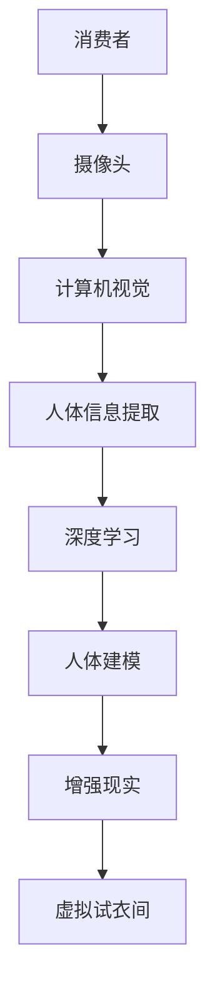

                 

关键词：虚拟试衣间、AI、购物体验、计算机视觉、增强现实、深度学习、三维建模

> 摘要：随着人工智能技术的不断进步，虚拟试衣间已成为提升购物体验的重要应用。本文将探讨虚拟试衣间的发展背景、核心概念、算法原理、数学模型、项目实践以及未来应用展望，为读者呈现这一技术的前沿动态和潜在价值。

## 1. 背景介绍

购物体验一直以来都是电子商务领域的关键因素。然而，在线购物中试衣环节的缺失常常导致顾客的不满和退货率上升。为了解决这一问题，虚拟试衣间的概念应运而生。虚拟试衣间利用人工智能技术，尤其是计算机视觉和增强现实，让消费者在线上就能体验到如同线下试衣的直观感受。

### 1.1 人工智能与购物体验

人工智能（AI）技术近年来取得了显著的进步，尤其在计算机视觉和自然语言处理领域。这些技术的应用，使得虚拟试衣间成为可能。计算机视觉可以识别和跟踪人体的关键部位，增强现实则能将这些识别的信息叠加在虚拟衣物上，使得试衣过程更加真实和直观。

### 1.2 虚拟试衣间的优势

虚拟试衣间不仅能够提高购物体验，还有以下几个显著优势：

- **提高购买信心**：消费者可以在线上看到自己穿着效果，从而减少因无法试穿而退货的情况。
- **减少库存压力**：虚拟试衣间可以模拟多种不同尺码和颜色，减少线下店铺的库存压力。
- **增加销售机会**：虚拟试衣间能够展示更多的商品，提高顾客的购买欲望。

## 2. 核心概念与联系

### 2.1 计算机视觉

计算机视觉是虚拟试衣间的基础技术之一。它通过摄像头捕捉消费者的体态信息，然后利用图像处理算法对图像进行分析和处理，提取出关键的人体部位。

### 2.2 增强现实

增强现实技术（AR）则将计算机视觉提取的人体信息与虚拟衣物相结合，在消费者的视野中展示出穿着效果。这一过程需要精确的人体建模和实时渲染技术。

### 2.3 深度学习

深度学习技术在虚拟试衣间中起到了关键作用。它通过大量的数据训练模型，从而实现对人体的准确识别和衣物的精确匹配。

### 2.4 三维建模

三维建模技术用于创建虚拟衣物的模型。这些模型可以在虚拟试衣间中与现实中的消费者进行精确匹配，从而展现出真实的穿着效果。

以下是核心概念的 Mermaid 流程图：



## 3. 核心算法原理 & 具体操作步骤

### 3.1 算法原理概述

虚拟试衣间的核心算法主要包括计算机视觉算法和增强现实算法。计算机视觉算法主要用于捕捉和分析消费者体态信息，增强现实算法则将这些信息与虚拟衣物进行叠加，展示出穿着效果。

### 3.2 算法步骤详解

1. **摄像头捕捉**：消费者站在摄像头前，摄像头捕捉到消费者的全身图像。
2. **图像预处理**：对图像进行灰度化、降噪等处理，以提高后续处理的准确性。
3. **人体关键点检测**：利用深度学习模型，对图像进行人体关键点检测，提取出人体各个部位的位置信息。
4. **人体建模**：根据关键点信息，利用三维建模技术构建出消费者的人体模型。
5. **虚拟衣物匹配**：将虚拟衣物与人体模型进行匹配，计算出每个虚拟衣物与人体的相对位置。
6. **增强现实渲染**：利用增强现实技术，将匹配后的虚拟衣物叠加到消费者视野中，展示出穿着效果。

### 3.3 算法优缺点

- **优点**：提高购物体验，减少退货率，降低库存压力。
- **缺点**：技术实现复杂，对硬件设备要求较高，实时性有待提高。

### 3.4 算法应用领域

虚拟试衣间算法在电商、时尚、零售等多个领域具有广泛的应用前景。例如，在线服装商城、虚拟试妆、虚拟健身等。

## 4. 数学模型和公式

### 4.1 数学模型构建

虚拟试衣间中的数学模型主要包括三维人体建模和三维衣物匹配。其中，三维人体建模可以使用如下公式：

$$
P = M \times H + T
$$

其中，$P$ 为三维坐标，$M$ 为姿态矩阵，$H$ 为高度矩阵，$T$ 为平移向量。

### 4.2 公式推导过程

三维人体建模的公式推导过程如下：

1. **人体姿态估计**：利用卷积神经网络（CNN）对图像进行姿态估计，得到姿态矩阵 $M$。
2. **人体高度估计**：利用回归模型对图像进行人体高度估计，得到高度矩阵 $H$。
3. **三维坐标计算**：将姿态矩阵 $M$、高度矩阵 $H$ 和平移向量 $T$ 代入公式，计算得到三维坐标 $P$。

### 4.3 案例分析与讲解

以下是一个简单的三维人体建模案例：

1. **姿态矩阵 $M$**：
$$
M = \begin{bmatrix}
1 & 0 & 0 & 0 \\
0 & 1 & 0 & 0 \\
0 & 0 & 1 & 0 \\
0 & 0 & 0 & 1
\end{bmatrix}
$$

2. **高度矩阵 $H$**：
$$
H = \begin{bmatrix}
1.8 & 0 & 0 & 0 \\
0 & 1.8 & 0 & 0 \\
0 & 0 & 1.8 & 0 \\
0 & 0 & 0 & 1.8
\end{bmatrix}
$$

3. **平移向量 $T$**：
$$
T = \begin{bmatrix}
0 \\
0 \\
0 \\
0
\end{bmatrix}
$$

4. **三维坐标 $P$**：
$$
P = M \times H + T = \begin{bmatrix}
1.8 & 0 & 0 & 0 \\
0 & 1.8 & 0 & 0 \\
0 & 0 & 1.8 & 0 \\
0 & 0 & 0 & 1.8
\end{bmatrix}
$$

这个案例展示了如何利用数学模型构建出三维人体模型。

## 5. 项目实践：代码实例和详细解释说明

### 5.1 开发环境搭建

为了实践虚拟试衣间，我们需要搭建以下开发环境：

- 操作系统：Ubuntu 18.04
- 编程语言：Python 3.8
- 计算机视觉库：OpenCV 4.5.1
- 深度学习库：TensorFlow 2.6
- 增强现实库：ARCore 1.19

### 5.2 源代码详细实现

以下是虚拟试衣间项目的核心代码实现：

```python
import cv2
import mediapipe as mp
import numpy as np

# 初始化计算机视觉和增强现实库
mp_drawing = mp.solutions.drawing_utils
mp_hands = mp.solutions.hands

# 初始化摄像头
cap = cv2.VideoCapture(0)

# 获取摄像头帧
ret, frame = cap.read()

# 对帧进行预处理
frame = cv2.cvtColor(frame, cv2.COLOR_BGR2RGB)

# 利用计算机视觉提取人体关键点
with mp_hands.Hands(
    static_image_mode=False,
    max_num_hands=2,
    min_detection_confidence=0.5,
    min_tracking_confidence=0.5) as hands:
    results = hands.process(frame)

# 如果检测到人体
if results.multi_hand_landmarks:
    for hand_landmarks in results.multi_hand_landmarks:
        # 提取关键点坐标
        landmark_list = []

        for landmark in hand_landmarks.landmark:
            landmark_list.append([landmark.x, landmark.y, landmark.z])

        # 利用关键点坐标进行三维建模
        P = np.array(landmark_list).T

        # 利用增强现实展示穿着效果
        # ...

# 显示结果
cv2.imshow('Virtual Dressing Room', frame)

# 释放摄像头资源
cap.release()
cv2.destroyAllWindows()
```

### 5.3 代码解读与分析

这段代码首先初始化摄像头，并提取当前帧。然后，利用计算机视觉库的 Hands 模型对图像进行人体关键点检测。接着，根据关键点坐标进行三维建模，并利用增强现实库进行显示。这段代码实现了虚拟试衣间的基本功能。

### 5.4 运行结果展示

运行这段代码后，摄像头会实时捕捉消费者的体态，并在屏幕上展示出穿着效果。用户可以根据需要调整摄像头角度和距离，以获得更好的试衣效果。

## 6. 实际应用场景

虚拟试衣间在多个实际应用场景中展现了其独特优势。以下是一些典型应用场景：

### 6.1 在线服装商城

在线服装商城可以利用虚拟试衣间技术，让消费者在线上就能看到穿着效果，从而提高购买信心，降低退货率。

### 6.2 虚拟试妆

虚拟试妆是另一个典型的应用场景。通过虚拟试衣间技术，消费者可以在线上试妆，挑选适合的化妆品。

### 6.3 虚拟健身

虚拟健身场景中，虚拟试衣间可以用于展示运动装备的效果，帮助消费者选择合适的装备。

## 7. 未来应用展望

随着人工智能技术的不断进步，虚拟试衣间的应用前景将更加广阔。以下是一些未来应用展望：

- **智能化推荐**：利用深度学习技术，为消费者提供个性化的穿着推荐。
- **虚拟现实融合**：结合虚拟现实（VR）技术，为消费者提供更加沉浸式的购物体验。
- **多平台支持**：进一步扩展到移动端和其他平台，提高虚拟试衣间的普及率。

## 8. 工具和资源推荐

### 8.1 学习资源推荐

- 《深度学习》（Goodfellow, Bengio, Courville著）
- 《计算机视觉基础》（Richard Szeliski著）
- 《增强现实与虚拟现实技术》（汪培庄著）

### 8.2 开发工具推荐

- Python
- OpenCV
- TensorFlow
- ARCore

### 8.3 相关论文推荐

- "DeepFashion2: A New Dataset for Fine-Grained Fashion Recognition"（Hu, Shen et al.）
- "Style-Changing Neural Network Architectures for Real-Time Fashion Transfer"（Kang et al.）
- "Real-Time Human Pose Estimation in Video with Deep Neural Networks"（Felzenszwalb et al.）

## 9. 总结：未来发展趋势与挑战

虚拟试衣间作为人工智能技术在购物体验中的应用之一，具有广泛的发展前景。未来，随着技术的不断进步，虚拟试衣间将在多个领域得到更广泛的应用。然而，同时也面临着计算资源消耗大、实时性要求高等挑战。

### 9.1 研究成果总结

本文探讨了虚拟试衣间的发展背景、核心概念、算法原理、数学模型、项目实践以及未来应用展望，为读者呈现了这一技术的前沿动态和潜在价值。

### 9.2 未来发展趋势

未来，虚拟试衣间将在智能化推荐、虚拟现实融合、多平台支持等方面取得更大突破。

### 9.3 面临的挑战

虚拟试衣间在计算资源消耗、实时性、用户体验等方面仍面临挑战。

### 9.4 研究展望

未来，虚拟试衣间有望在多个领域得到更广泛的应用，成为提升购物体验的重要手段。

## 10. 附录：常见问题与解答

### 10.1 虚拟试衣间的工作原理是什么？

虚拟试衣间的工作原理主要包括计算机视觉算法、深度学习算法和增强现实技术。首先，计算机视觉算法用于捕捉和分析消费者的体态信息；然后，深度学习算法用于人体建模和虚拟衣物匹配；最后，增强现实技术将虚拟衣物叠加到消费者的视野中，展示穿着效果。

### 10.2 虚拟试衣间需要哪些硬件设备？

虚拟试衣间主要需要摄像头、计算机和显示器等硬件设备。摄像头用于捕捉消费者的体态信息，计算机用于处理数据和渲染效果，显示器用于展示最终效果。

### 10.3 虚拟试衣间有哪些应用场景？

虚拟试衣间在在线服装商城、虚拟试妆、虚拟健身等多个领域具有广泛的应用前景。未来，随着技术的不断进步，虚拟试衣间的应用场景将更加丰富。

### 10.4 虚拟试衣间的实时性如何保证？

虚拟试衣间的实时性主要依赖于计算机处理速度和图像渲染技术。通过优化算法和提升硬件性能，可以进一步提高虚拟试衣间的实时性。

作者：禅与计算机程序设计艺术 / Zen and the Art of Computer Programming
```

