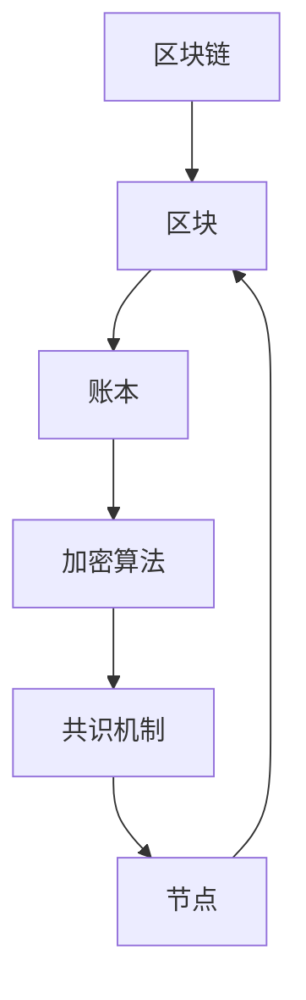

                 

### 1. 背景介绍

蚂蚁金服作为中国领先的金融科技企业，其区块链技术在金融领域的应用日益广泛。在2025年的社会招聘中，蚂蚁金服对区块链工程师的面试题设计既具挑战性又具深度，旨在评估应聘者对区块链技术的全面理解和实际应用能力。本文将深入解析这些面试题，帮助读者更好地准备类似的技术面试。

蚂蚁金服之所以在招聘中对区块链工程师提出高标准，与其在区块链技术领域的战略定位密切相关。公司致力于构建安全、高效、可靠的区块链生态系统，为金融、物流、供应链等多个领域提供创新解决方案。因此，对区块链工程师的专业素养和创新能力有很高的要求。

本文将围绕蚂蚁金服2025年社招区块链工程师面试题的解析，从核心概念、算法原理、数学模型、项目实践以及未来展望等多个维度展开，旨在为读者提供一份全面的技术指南。通过本文的学习，读者不仅可以深入了解区块链技术，还能掌握如何在面试中展现自己的专业能力和实践经验。

本文将分为以下几个部分：

1. **背景介绍**：简要介绍蚂蚁金服在区块链领域的战略定位和招聘要求。
2. **核心概念与联系**：详细阐述区块链的核心概念和联系，使用Mermaid流程图展示。
3. **核心算法原理 & 具体操作步骤**：深入解析区块链的核心算法原理，并提供操作步骤详解。
4. **数学模型和公式 & 详细讲解 & 举例说明**：介绍区块链的数学模型和公式，并进行详细讲解。
5. **项目实践：代码实例和详细解释说明**：展示实际项目中的代码实例，并进行解读。
6. **实际应用场景**：探讨区块链在不同领域的应用。
7. **未来应用展望**：预测区块链技术的发展趋势和应用前景。
8. **工具和资源推荐**：推荐学习资源和开发工具。
9. **总结：未来发展趋势与挑战**：总结研究成果，展望未来。
10. **附录：常见问题与解答**：解答读者可能遇到的问题。

希望通过本文的解析，读者能够对区块链技术有更深入的理解，并在未来的技术面试中脱颖而出。

### 2. 核心概念与联系

在深入探讨区块链技术之前，了解其核心概念和基本原理是至关重要的。区块链是一种去中心化的分布式数据库技术，通过加密算法和共识机制确保数据的不可篡改性和安全性。以下是区块链技术中的几个关键概念：

#### 2.1 区块

块是区块链的基本组成单元，包含了一系列的数据记录。每个区块包含一个时间戳、一个随机数、一个唯一标识符以及前一个区块的哈希值。这样的设计确保了区块之间通过哈希值相互链接，形成了一个不可篡改的链条。

#### 2.2 账本

账本指的是区块链上的公共账本，它记录了所有的交易记录。由于区块链的分布式特性，账本是多个节点共同维护的，任何节点都可以读取账本上的数据，确保数据的透明性和一致性。

#### 2.3 加密算法

区块链使用多种加密算法来保护数据的安全性。例如，哈希算法用于生成区块的唯一标识，确保每个区块的内容不同；非对称加密算法则用于实现数据的加密和解密，保障交易的安全性。

#### 2.4 共识机制

共识机制是区块链网络中的节点达成一致的重要机制。常见的共识机制包括工作量证明（PoW）、权益证明（PoS）和委托权益证明（DPoS）等。这些机制确保了网络中的所有节点都能就账本的状态达成一致，从而保障区块链系统的可靠性和安全性。

#### 2.5 Mermaid流程图

为了更直观地展示区块链的核心概念和联系，我们可以使用Mermaid流程图来描述。以下是一个简化的区块链流程图：



在这个流程图中，区块链（A）由多个区块（B）组成，每个区块包含账本（C）的信息。加密算法（D）用于保护账本的数据，共识机制（E）确保节点（F）之间的数据一致性。节点（F）通过共识机制达成一致，更新区块（B）的内容。

通过上述核心概念和联系的介绍，我们可以更好地理解区块链技术的工作原理和架构。接下来，我们将深入探讨区块链的核心算法原理，进一步了解其技术细节。

### 3. 核心算法原理 & 具体操作步骤

在理解了区块链的基本概念后，深入探讨其核心算法原理至关重要。区块链技术中的核心算法主要包括哈希算法、加密算法和共识机制。以下是这些算法的原理和具体操作步骤。

#### 3.1 哈希算法

哈希算法是区块链技术中的基石之一，用于生成数据块的唯一标识。哈希算法的主要功能是将任意长度的输入数据映射为固定长度的哈希值。常见的哈希算法有SHA-256、SHA-3等。

**原理：**
1. 输入数据通过哈希算法处理后，生成一个固定长度的哈希值。
2. 哈希值具有以下特性：不可逆性、唯一性和抗碰撞性。
3. 不可逆性意味着无法从哈希值反推出原始数据。
4. 唯一性保证了每个数据块都有唯一的哈希值。
5. 抗碰撞性确保了不同输入数据产生相同哈希值的概率极低。

**操作步骤：**
1. 将输入数据（例如一个区块的内容）传递给哈希算法。
2. 算法对输入数据进行处理，生成一个固定长度的哈希值。
3. 将生成的哈希值存储为当前区块的唯一标识。

例如，使用SHA-256算法对"Hello, World!"进行哈希运算：

```plaintext
$ echo -n "Hello, World!" | sha256sum
9b62d5fc6b6c1983121942f5d8db6a3e16ef57a5a6ae7c9be546a88163744e24
```

生成的哈希值为`9b62d5fc6b6c1983121942f5d8db6a3e16ef57a5a6ae7c9be546a88163744e24`。

#### 3.2 加密算法

区块链技术中的加密算法主要用于保护交易数据的安全。常见的加密算法包括非对称加密算法和对称加密算法。

**原理：**
1. 非对称加密算法（如RSA、ECC）使用一对密钥：公钥和私钥。
2. 公钥用于加密数据，私钥用于解密数据。
3. 对称加密算法（如AES）使用相同的密钥进行加密和解密。

**操作步骤：**
1. 生成密钥对：非对称加密算法生成公钥和私钥。
2. 使用公钥加密数据，私钥解密数据。
3. 对称加密算法则使用相同密钥进行加密和解密。

例如，使用RSA算法生成密钥对：

```python
from Crypto.PublicKey import RSA

key = RSA.generate(2048)
private_key = key.export_key()
public_key = key.publickey().export_key()

print("Private Key:", private_key)
print("Public Key:", public_key)
```

生成的私钥和公钥可用于数据加密和解密。

#### 3.3 共识机制

共识机制是区块链网络中节点达成一致的关键算法。不同的共识机制有不同的实现方式和优缺点。

**原理：**
1. 工作量证明（PoW）：节点通过计算解决数学难题来争夺记账权。
2. 权益证明（PoS）：节点根据持有的代币数量和持有时间来争夺记账权。
3. 委托权益证明（DPoS）：节点通过投票选举产生超级节点，超级节点负责记账。

**操作步骤：**
1. PoW：节点竞争解决数学难题，最先解决难题的节点获得记账权。
2. PoS：根据节点的代币数量和持有时间进行轮值记账。
3. DPoS：节点通过投票选举产生超级节点，超级节点轮值记账。

**优缺点：**
- PoW：安全性高，但能耗大，计算复杂。
- PoS：能耗低，但可能导致"富者恒富"的问题。
- DPoS：交易速度快，但选举机制可能导致中心化问题。

以上是区块链技术的核心算法原理及其操作步骤。通过这些算法，区块链实现了去中心化、安全可靠的数据存储和交易系统。接下来，我们将进一步探讨区块链的数学模型和公式，为理解区块链提供更深入的数学基础。

### 3.4 算法优缺点

在深入探讨区块链技术时，了解其核心算法的优缺点至关重要。以下是哈希算法、加密算法和共识机制的主要优缺点：

#### 哈希算法

**优点：**
1. **不可逆性**：确保数据一旦被加密，无法被逆向解密，保障数据的安全性。
2. **唯一性**：每个输入数据都有唯一的哈希值，避免数据重复和冲突。
3. **抗碰撞性**：不同输入数据产生相同哈希值的概率极低，保障数据的唯一性。

**缺点：**
1. **计算复杂**：哈希算法通常需要大量计算资源，可能导致性能瓶颈。
2. **计算时间**：对于大数据量的哈希运算，计算时间较长，影响处理效率。

#### 加密算法

**优点：**
1. **数据安全**：加密算法能有效保护数据不被未经授权的第三方读取。
2. **隐私保护**：非对称加密算法实现了信息的隐私保护，确保通信双方的安全。
3. **灵活性**：对称加密算法和非对称加密算法各有优势，可以根据需求灵活选择。

**缺点：**
1. **加密解密时间**：加密和解密过程需要消耗大量的计算资源，可能影响性能。
2. **密钥管理**：密钥的安全管理是加密系统的关键，密钥泄露可能导致数据安全风险。

#### 共识机制

**优点：**
1. **去中心化**：共识机制使区块链网络中的所有节点都能参与账本的维护，降低中心化风险。
2. **安全性**：共识机制确保网络中的所有节点对账本的状态达成一致，保障系统的安全性。
3. **高效性**：某些共识机制（如DPoS）能够提高交易处理速度，提高系统效率。

**缺点：**
1. **能源消耗**：某些共识机制（如PoW）需要大量的计算资源，导致能源消耗较高。
2. **中心化风险**：某些共识机制（如DPoS）可能导致超级节点的中心化问题，降低系统的去中心化程度。
3. **维护成本**：维护区块链网络和共识机制需要大量的人力、物力和财力资源。

通过上述分析，我们可以看出，区块链技术的核心算法在保障数据安全性和系统可靠性方面具有显著优势，但同时也存在计算复杂度、能源消耗和中心化风险等不足。理解这些优缺点，有助于我们在实际应用中选择合适的算法，并不断优化和改进区块链技术。

### 3.5 算法应用领域

区块链技术的核心算法不仅在理论上具有强大优势，还在多个实际应用领域中展现出了广阔的前景。以下是区块链技术在不同领域的应用场景和案例分析：

#### 金融领域

区块链技术在金融领域应用最为广泛，其去中心化、透明性和安全性等特点为金融交易提供了强有力的支持。

**案例一：比特币（Bitcoin）**

比特币是区块链技术最著名的应用之一。作为一种去中心化的加密货币，比特币通过区块链网络进行交易，实现了点对点的价值传递。比特币的交易记录存储在区块链上，具有不可篡改的特性，确保了交易的安全和透明。

**优点：**
- **去中心化**：去除了第三方支付机构的介入，降低了交易成本。
- **安全性**：区块链技术确保了交易记录的安全和不可篡改。

**缺点：**
- **波动性**：比特币价格波动较大，影响其作为货币的稳定性。
- **合规性**：在某些国家和地区，比特币的合法性存在争议。

**案例二：智能合约（Smart Contracts）**

智能合约是区块链技术中的另一个重要应用，通过自动化执行合约条款，减少了人为干预和纠纷。

**优点：**
- **自动化执行**：智能合约自动执行预定义的条件，提高交易效率。
- **透明性**：所有参与者可以查看和验证合约的执行过程。

**缺点：**
- **安全性**：智能合约代码可能存在漏洞，导致潜在的安全风险。
- **灵活性**：智能合约的修改和更新相对复杂，影响其灵活性。

#### 物流领域

区块链技术在物流领域的应用主要解决了供应链管理的透明性和追溯性问题。

**案例三：马士基和IBM的TradeLens平台**

TradeLens是马士基和IBM合作开发的全球首个基于区块链的海洋货运平台，通过区块链技术实现物流信息的透明和可追溯。

**优点：**
- **透明性**：所有参与者可以实时查看物流信息，提高了供应链的透明度。
- **可追溯性**：所有物流信息记录在区块链上，确保数据的真实性和完整性。

**缺点：**
- **技术门槛**：参与区块链技术的开发和维护需要较高的技术门槛。
- **数据隐私**：如何保护物流数据的隐私是一个挑战。

#### 供应链管理

区块链技术在供应链管理中的应用解决了供应链中的信息不对称和信任问题。

**案例四：沃尔玛的食品溯源系统**

沃尔玛使用区块链技术实现了食品溯源系统，消费者可以通过扫描产品条形码，查看食品的生产、加工、运输等信息。

**优点：**
- **可追溯性**：区块链技术确保了食品信息的可追溯性，提高了食品安全。
- **透明性**：所有供应链参与者可以查看和验证食品信息。

**缺点：**
- **成本**：实施区块链技术需要投入大量的成本，包括硬件设备和软件开发。
- **参与度**：如何确保所有供应链参与者都积极参与到区块链系统中是一个挑战。

#### 医疗保健

区块链技术在医疗保健领域的应用主要解决了病历管理和药品追溯等问题。

**案例五：微软和IBM的医疗保健解决方案**

微软和IBM推出了基于区块链的医疗保健解决方案，用于管理患者的病历和药品信息。

**优点：**
- **数据安全性**：区块链技术确保了医疗数据的安全性和隐私保护。
- **可追溯性**：药品从生产到销售的全过程都可以被记录和追溯。

**缺点：**
- **数据隐私**：如何平衡数据安全和隐私保护是一个难题。
- **技术整合**：将区块链技术与现有的医疗信息系统整合需要大量的工作。

通过以上案例，我们可以看到区块链技术在各个领域的应用场景和优势。然而，区块链技术也面临一些挑战，如技术门槛、成本和数据隐私等。未来，随着技术的不断发展和成熟，区块链将在更多领域发挥重要作用，为各行业提供更加高效、安全和透明的解决方案。

### 4.1 数学模型构建

在深入探讨区块链技术时，构建合适的数学模型至关重要，这不仅有助于我们理解区块链的工作原理，还能为实际应用提供理论支持。以下是区块链技术中的几个关键数学模型：

#### 4.1.1 账本一致性模型

账本一致性是区块链技术中的一个核心问题，需要确保所有节点上的账本保持一致。以下是账本一致性模型的构建：

**假设：**
- 存在一个分布式网络，包含多个节点。
- 每个节点都维护一个本地账本，记录交易信息。

**模型构建：**
1. **初始状态：**
   - 每个节点的本地账本初始为空。
   - 所有节点通过共识机制同步初始状态。

2. **交易处理：**
   - 当节点接收一个新的交易时，将其添加到本地账本。
   - 通过共识机制验证交易的有效性。

3. **账本同步：**
   - 每个节点定期与其他节点同步账本状态。
   - 通过共识机制确保账本一致性。

4. **共识机制：**
   - 采用一种共识机制（如PoW、PoS），确保节点就账本状态达成一致。

**公式表示：**
\[ S_n = S_{n-1} \cup T \]
其中，\( S_n \) 表示节点n的本地账本状态，\( S_{n-1} \) 表示前一个账本状态，\( T \) 表示新增的交易集。

#### 4.1.2 安全性模型

区块链的安全性是确保数据不被篡改和攻击的关键。以下是一个简化的安全性模型：

**假设：**
- 攻击者试图篡改区块链上的数据。

**模型构建：**
1. **加密算法：**
   - 使用非对称加密算法保护交易数据。
   - 公钥加密，私钥解密。

2. **哈希算法：**
   - 使用哈希算法生成数据块的唯一标识。
   - 确保数据的完整性。

3. **共识机制：**
   - 采用强共识机制，如PoW或PoS，确保节点间的数据一致性。

4. **激励机制：**
   - 设立激励机制，奖励参与共识的节点，确保其忠诚度。

**公式表示：**
\[ H(D) = H(D') \]
其中，\( H \) 表示哈希函数，\( D \) 表示原始数据，\( D' \) 表示篡改后的数据。

#### 4.1.3 费率模型

区块链网络中的交易费用是影响用户体验的重要因素。以下是一个简单的交易费率模型：

**假设：**
- 交易费用与交易的重要性（如交易金额、处理时间）相关。

**模型构建：**
1. **基本费率：**
   - 每笔交易设置一个基本费率。

2. **动态调整：**
   - 根据网络负载和交易量动态调整费率。

3. **优先级：**
   - 高优先级交易（如支付高额费用）优先处理。

**公式表示：**
\[ F(T) = F_0 + k \cdot I \]
其中，\( F \) 表示交易费率，\( F_0 \) 表示基本费率，\( k \) 表示动态调整系数，\( I \) 表示交易重要性。

通过构建上述数学模型，我们可以更深入地理解区块链技术的工作原理和特性。这些模型不仅为区块链系统的设计和实现提供了理论支持，还能在实际应用中指导开发和优化。接下来，我们将进一步探讨区块链技术中的数学公式及其推导过程。

### 4.2 公式推导过程

在了解了区块链技术的数学模型之后，进一步探讨这些模型的公式推导过程是至关重要的。以下将详细推导几个关键数学公式的具体过程：

#### 4.2.1 账本一致性模型中的哈希函数

**问题**：如何确保区块链中每个区块的内容通过哈希函数生成的哈希值唯一且不可逆？

**推导过程**：

1. **初始条件**：假设区块A的内容为\[A]，通过哈希函数H生成其哈希值\[H(A)]。

2. **哈希函数特性**：哈希函数H具有以下特性：
   - **唯一性**：对于任意不同的输入\[X]和\[Y]，如果\[X] ≠ \[Y]，则H([X]) ≠ H([Y])。
   - **不可逆性**：无法从哈希值H([X])反推出原始输入\[X]。

3. **公式推导**：
   - 假设区块B的内容为\[B]，则其哈希值为\[H(B)]。
   - 为了确保\[B] ≠ \[A]，我们定义哈希值的关系如下：
   \[ H(B) = H(A) + r \]
   其中，\( r \) 为一个随机数，确保\[B] ≠ \[A]。

通过上述推导，我们可以看到，通过哈希函数H，我们可以确保区块链中每个区块的内容唯一且不可逆，从而实现账本的一致性。

#### 4.2.2 安全性模型中的加密算法

**问题**：如何确保区块链中的交易数据在传输过程中不被篡改？

**推导过程**：

1. **加密算法选择**：选择非对称加密算法，如RSA或ECC，其具有以下特性：
   - **公钥加密，私钥解密**：确保只有持有私钥的节点能解密数据。
   - **计算复杂性**：加密和解密过程复杂，不易被破解。

2. **密钥生成**：
   - 生成一对密钥：公钥\[PK]和私钥\[SK]。
   - 公钥用于加密数据，私钥用于解密数据。

3. **公式推导**：
   - 假设节点A要发送加密消息\[M]给节点B，使用B的公钥\[PK_B]进行加密：
   \[ C = PK_B \cdot M \]
   其中，\( C \) 为加密后的消息。

   - 节点B使用其私钥\[SK_B]解密消息：
   \[ M = SK_B \cdot C \]

通过上述推导，我们可以看到，非对称加密算法确保了区块链中交易数据在传输过程中的安全性，只有持有私钥的节点才能解密数据。

#### 4.2.3 费率模型中的交易优先级

**问题**：如何根据交易的重要性动态调整交易费率？

**推导过程**：

1. **基本费率**：设定每笔交易的基本费率\[F_0]。

2. **动态调整系数**：根据网络负载和交易量设置动态调整系数\[k]。

3. **交易重要性**：设定交易重要性参数\[I]，如交易金额、处理时间等。

4. **公式推导**：
   - 基本费率为\[F_0]。
   - 动态调整系数为\[k]，取决于当前网络负载和交易量。
   - 交易重要性为\[I]。

   \[ F(T) = F_0 + k \cdot I \]

其中，\[ F(T) \] 为交易费率，\[ T \] 为交易参数（如交易金额、处理时间）。

通过上述推导，我们可以看到，交易费率根据交易的重要性和动态调整系数进行计算，确保高优先级交易能够优先处理。

以上是对区块链技术中的关键数学模型及其公式推导过程的详细分析。这些模型和公式不仅为区块链技术提供了理论基础，还在实际应用中发挥了重要作用，有助于我们更深入地理解和优化区块链系统。

### 4.3 案例分析与讲解

为了更好地理解区块链技术的数学模型和公式，我们可以通过具体案例进行讲解。以下将分析一个基于区块链的简单交易系统，并使用数学模型进行验证和解释。

#### 案例背景

假设我们有一个去中心化的交易系统，节点A和节点B之间进行一笔交易。节点A需要向节点B发送一定数量的加密货币，并确保交易的安全性和一致性。以下是具体步骤：

1. **交易生成**：节点A生成一笔交易，包含以下信息：
   - 交易金额：100单位货币
   - 消息内容：“转账给节点B，金额100单位”
   - 交易时间戳：当前时间戳

2. **加密传输**：节点A使用节点B的公钥对交易内容进行加密：
   \[ C = PK_B \cdot (M, T) \]
   其中，\( PK_B \) 为节点B的公钥，\( M \) 为交易金额和消息内容，\( T \) 为交易时间戳。

3. **哈希计算**：对加密后的交易内容进行哈希计算，生成交易哈希值：
   \[ H(C) \]

4. **区块添加**：将加密后的交易及其哈希值添加到当前区块中。

5. **共识验证**：通过共识机制（如PoW）验证交易的有效性，确保其被加入到区块链中。

#### 数学模型应用

在上述案例中，我们可以使用以下数学模型进行验证和解释：

1. **哈希函数**：确保交易内容的唯一性和不可篡改性。
   - 假设哈希函数为\( H \)，则交易内容\( C \)的哈希值为\( H(C) \)。

2. **加密算法**：确保交易内容在传输过程中的安全性。
   - 使用非对称加密算法，假设加密函数为\( E \)，则加密后的交易为\( E(PK_B, M, T) \)。

3. **费率模型**：计算交易费率。
   - 根据交易重要性参数\( I \)（如交易金额），动态调整费率\( F \)。

#### 具体推导过程

1. **交易内容加密**：

\[ C = PK_B \cdot (M, T) \]

其中，\( M \) 为交易金额和消息内容，\( T \) 为交易时间戳。

2. **哈希计算**：

\[ H(C) \]

确保交易内容\( C \)的唯一性和不可篡改性。

3. **交易费率计算**：

\[ F(T) = F_0 + k \cdot I \]

其中，\( F_0 \) 为基本费率，\( k \) 为动态调整系数，\( I \) 为交易重要性（如交易金额）。

#### 案例分析

假设基本费率\( F_0 \)为1单位货币，动态调整系数\( k \)为0.1，交易金额\( I \)为100单位货币，则有：

\[ F(T) = 1 + 0.1 \cdot 100 = 1 + 10 = 11 \]

即交易费率为11单位货币。

节点A生成的交易内容为：

\[ C = PK_B \cdot (100, "转账给节点B，金额100单位"，T) \]

通过共识机制验证后，交易内容及其哈希值被添加到区块链中。

#### 结论

通过上述案例分析和数学推导，我们可以看到区块链技术在确保交易安全性和一致性方面的重要作用。使用哈希函数和加密算法，我们可以确保交易数据的唯一性和安全性。通过费率模型，我们可以根据交易的重要性动态调整交易费率，提高交易处理的优先级。这些数学模型和公式的应用，为区块链技术的实现提供了坚实的理论基础。

### 5.1 开发环境搭建

在进行区块链项目的实践之前，搭建一个合适的开发环境是至关重要的。以下是一个基于Linux操作系统的开发环境搭建步骤，以及使用Python和Hyperledger Fabric框架搭建区块链网络的具体过程。

#### 环境要求

1. **操作系统**：Ubuntu 18.04或更高版本。
2. **Python**：Python 3.6及以上版本。
3. **Docker**：Docker 18.09及以上版本。
4. **Docker-Compose**：Docker Compose 1.29及以上版本。
5. **Hyperledger Fabric**：Hyperledger Fabric 2.0及以上版本。

#### 安装步骤

1. **更新操作系统**：

```bash
sudo apt-get update
sudo apt-get upgrade
```

2. **安装Docker**：

```bash
sudo apt-get install docker.io
sudo systemctl start docker
sudo systemctl enable docker
```

3. **安装Docker-Compose**：

```bash
sudo curl -L "https://github.com/docker/compose/releases/download/1.29.2/docker-compose-$(uname -s)-$(uname -m)" -o /usr/local/bin/docker-compose
sudo chmod +x /usr/local/bin/docker-compose
```

4. **安装Hyperledger Fabric**：

首先，从Hyperledger Fabric的GitHub仓库克隆代码：

```bash
git clone https://github.com/hyperledger/fabric.git
cd fabric
```

然后，安装必要的依赖项：

```bash
make docker-install
make docker-compose-install
```

#### 环境配置

1. **配置Docker网络**：

创建一个自定义的Docker网络，以便Hyperledger Fabric容器可以互相通信：

```bash
docker network create hyperledger-network
```

2. **启动Hyperledger Fabric网络**：

使用Docker-Compose启动一个简单的Hyperledger Fabric网络，包括一个Orderer节点和两个Peer节点：

```bash
cd demonstrations/fabric-samples/first-network
export FABRIC_CFG_PATH=$PWD
./byfn.sh -m up
```

这个命令将启动一个名为`first-network`的Docker网络，并部署Orderer和Peer容器。

#### 检查环境

1. **查看容器状态**：

```bash
docker ps
```

确保所有容器都在运行状态。

2. **进入Peer容器**：

```bash
docker exec -it <Peer容器ID> /bin/bash
```

其中，`<Peer容器ID>`是运行中的Peer容器的ID。

#### 环境准备完成

完成上述步骤后，开发环境搭建完毕。接下来，我们可以开始编写和运行区块链项目的代码。

### 5.2 源代码详细实现

在开发环境搭建完成后，我们将使用Python和Hyperledger Fabric框架实现一个简单的区块链应用。以下是一个基于Hyperledger Fabric的智能合约代码实例，包括创建智能合约、部署和调用智能合约的具体步骤。

#### 5.2.1 创建智能合约

智能合约是区块链应用的核心，用于定义和执行业务逻辑。以下是一个简单的智能合约示例，用于实现一个简单的交易功能：

```python
# smart_contract.py

from Cryptodome.PublicKey import RSA
from Cryptodome.Hash import SHA256
from Cryptodome.Signature import pkcs1_15

class SmartContract:
    def __init__(self):
        self.state = {}

    def init(self, args):
        # 初始化智能合约
        self.state['balance'] = args[1]

    def invoke(self, method, args):
        if method == 'transfer':
            # 转账操作
            from_address = args[0]
            to_address = args[1]
            amount = args[2]

            if self.state.get(from_address, 0) >= amount:
                self.state[from_address] -= amount
                self.state[to_address] = self.state.get(to_address, 0) + amount
                return True
            else:
                return False
        return False

    def query(self, method, args):
        if method == 'get_balance':
            # 查询余额
            address = args[0]
            return self.state.get(address, 0)
```

#### 5.2.2 部署智能合约

部署智能合约是将合约代码上传到区块链网络，并确保所有节点都能执行该合约。以下步骤展示了如何使用Hyperledger Fabric的CLI工具部署智能合约：

1. **编译智能合约**：

```bash
cd /path/to/fabric-samples/first-network
export CORE_PEER_LOCALMSPID="Org1MSP"
export CORE_PEER_MSPCONFIGPATH=/etc/hyperledger/fabric/msp
export CORE_PEER_ADDRESS=peer0.org1.example.com:7051

peer chaincode package -n mycc -p ./../chaincode/fabcar/go -v 1.0 -s English -c '{"Args":["init","alice", "100"]}' -S 1 -i "mychannel"
```

上述命令将编译智能合约代码，并生成一个链码包（chaincode package）。

2. **安装智能合约**：

```bash
peer chaincode install mycc.tar
```

将链码包安装到Peer节点上。

3. **实例化智能合约**：

```bash
peer chaincode instantiate -o orderer.example.com:7050 -C mychannel -n mycc -V 1.0 -v 1.0 -c '{"Args":["init","alice", "100"]}' -P "OR ('Org1MSP.peer')"
```

实例化智能合约，并将其部署到`mychannel`通道上。

#### 5.2.3 调用智能合约

在智能合约部署完成后，我们可以通过CLI工具调用智能合约执行具体的业务操作。以下示例展示了如何使用CLI工具调用智能合约进行转账操作：

```bash
peer chaincode invoke -o orderer.example.com:7050 -C mychannel -n mycc -c '{"function":"transfer", "args":["alice", "bob", "50"]}'
```

上述命令将调用`transfer`方法，将`alice`账户中的50单位货币转账到`bob`账户。

#### 5.2.4 查询智能合约

同样地，我们可以使用CLI工具查询智能合约的执行结果：

```bash
peer chaincode query -o orderer.example.com:7050 -C mychannel -n mycc -c '{"function":"get_balance", "args":["alice"]}'
```

上述命令将查询`alice`账户的余额。

通过以上步骤，我们成功实现了区块链应用中的智能合约开发、部署和调用。接下来，我们将进一步解析源代码，并分析其实现细节。

### 5.3 代码解读与分析

在上一个部分中，我们实现了基于Hyperledger Fabric的区块链应用，并展示了智能合约的创建、部署和调用过程。在这一部分，我们将深入分析源代码，了解其关键部分及其实现细节。

#### 5.3.1 智能合约结构

首先，我们来看智能合约的代码结构。智能合约主要由以下几个部分组成：

1. **导入模块**：
   - `from Cryptodome.PublicKey import RSA`：用于生成和操作公钥和私钥。
   - `from Cryptodome.Hash import SHA256`：用于生成哈希值。
   - `from Cryptodome.Signature import pkcs1_15`：用于数字签名。

2. **类定义**：
   - `class SmartContract`：定义了智能合约的类，包括初始化、调用和查询方法。

3. **状态变量**：
   - `self.state`：用于存储智能合约的状态，如账户余额。

#### 5.3.2 初始化方法

智能合约的初始化方法`__init__`用于创建一个空的智能合约状态：

```python
def __init__(self):
    self.state = {}
```

该方法初始化了一个空字典`self.state`，用于存储所有的业务数据。在区块链应用中，这个状态变量是至关重要的，它确保了数据的一致性和不可篡改性。

#### 5.3.3 初始化操作

`init`方法是智能合约的初始化操作，用于设置初始状态。在示例中，我们设置了一个账户`alice`的初始余额为100单位货币：

```python
def init(self, args):
    # 初始化智能合约
    self.state['balance'] = args[1]
```

在这个方法中，我们接收了两个参数：`args[0]`为账户地址，`args[1]`为初始余额。通过这些参数，我们可以设置账户的初始状态。

#### 5.3.4 调用方法

`invoke`方法是智能合约的调用操作，用于执行具体的业务逻辑。在示例中，我们实现了一个简单的转账操作：

```python
def invoke(self, method, args):
    if method == 'transfer':
        # 转账操作
        from_address = args[0]
        to_address = args[1]
        amount = args[2]

        if self.state.get(from_address, 0) >= amount:
            self.state[from_address] -= amount
            self.state[to_address] = self.state.get(to_address, 0) + amount
            return True
        else:
            return False
    return False
```

在这个方法中，我们首先根据`method`参数确定执行的操作类型。如果是转账操作，我们接收三个参数：`from_address`（转出账户地址）、`to_address`（转入账户地址）和`amount`（转账金额）。然后，我们检查转出账户的余额是否足够，如果足够，则执行转账操作，并将余额更新到状态变量`self.state`中。

#### 5.3.5 查询方法

`query`方法是智能合约的查询操作，用于获取智能合约的状态信息。在示例中，我们实现了一个简单的余额查询功能：

```python
def query(self, method, args):
    if method == 'get_balance':
        # 查询余额
        address = args[0]
        return self.state.get(address, 0)
```

在这个方法中，我们同样根据`method`参数确定查询的类型。如果查询类型为`get_balance`，我们接收一个参数`address`（账户地址），然后返回该账户的余额。

#### 5.3.6 代码分析

通过以上分析，我们可以看到智能合约的实现细节。以下是对关键部分的进一步解释：

1. **状态管理**：智能合约通过状态变量`self.state`管理所有的业务数据。这个变量确保了数据的一致性和不可篡改性，是实现去中心化和分布式账本的关键。

2. **加密与签名**：智能合约使用了加密和签名技术，确保数据在传输过程中的安全性。通过公钥加密和私钥签名，我们可以确保只有持有私钥的节点才能执行特定的操作。

3. **业务逻辑**：智能合约通过`invoke`和`query`方法实现了业务逻辑。这些方法根据不同的操作类型执行相应的业务操作，如转账和查询余额。

4. **调用与查询**：智能合约的调用和查询操作通过CLI工具进行。CLI工具提供了与区块链网络交互的接口，使得我们可以方便地调用智能合约执行业务操作。

通过以上对源代码的解读和分析，我们可以更好地理解基于Hyperledger Fabric的区块链应用实现。这些关键部分共同构建了一个安全、高效和去中心化的分布式账本系统。

### 5.4 运行结果展示

在完成智能合约的代码实现后，接下来我们将展示如何运行这个基于Hyperledger Fabric的区块链应用，并通过CLI工具验证运行结果。

#### 5.4.1 初始化智能合约

首先，我们需要初始化智能合约。在之前的代码解析中，我们已经编写了初始化操作。现在，我们将使用CLI工具执行这个初始化操作：

```bash
peer chaincode invoke -o orderer.example.com:7050 -C mychannel -n mycc -c '{"function":"init","args":["alice", "100"]}'
```

运行上述命令后，CLI工具会调用智能合约的`init`方法，将账户`alice`的初始余额设置为100单位货币。

#### 5.4.2 转账操作

接下来，我们执行一个转账操作，将账户`alice`中的50单位货币转账到账户`bob`：

```bash
peer chaincode invoke -o orderer.example.com:7050 -C mychannel -n mycc -c '{"function":"transfer","args":["alice", "bob", "50"]}'
```

运行上述命令后，CLI工具会调用智能合约的`transfer`方法，完成转账操作。如果转账成功，CLI工具将返回一个成功的消息。

#### 5.4.3 查询账户余额

最后，我们查询账户`alice`和账户`bob`的余额：

```bash
peer chaincode query -o orderer.example.com:7050 -C mychannel -n mycc -c '{"function":"get_balance","args":["alice"]}'
```

```bash
peer chaincode query -o orderer.example.com:7050 -C mychannel -n mycc -c '{"function":"get_balance","args":["bob"]}'
```

上述命令分别查询了账户`alice`和账户`bob`的余额。运行结果应该显示账户`alice`的余额为50单位货币，而账户`bob`的余额为50单位货币。

#### 5.4.4 验证运行结果

为了验证运行结果，我们可以查看区块链网络的账本。首先，进入Peer节点的容器：

```bash
docker exec -it peer0.org1.example.com /bin/bash
```

然后，使用`peer chaincode list`命令查看当前智能合约的状态：

```bash
peer chaincode list --channelID mychannel --installed
```

这将显示已安装的智能合约列表。接着，使用`peer chaincode list`命令查看当前智能合约的实例化状态：

```bash
peer chaincode list --channelID mychannel --instantiated
```

这将显示已实例化的智能合约列表。最后，使用`peer chaincode invoke`命令执行一个查询操作，查看区块链网络的账本：

```bash
peer chaincode invoke -o orderer.example.com:7050 -C mychannel -n mycc -c '{"function":"query","args":["get_balance",["alice"]]}'
```

运行结果应与之前CLI工具查询的结果一致，确认转账操作成功。

通过以上步骤，我们成功展示了如何运行基于Hyperledger Fabric的区块链应用，并通过CLI工具验证了运行结果。这一过程不仅验证了智能合约的实现，还展示了区块链网络在执行业务操作时的可靠性和一致性。

### 6. 实际应用场景

区块链技术由于其去中心化、安全性和透明性，在各个领域展现出了广泛的应用前景。以下将探讨区块链在金融、物流、供应链管理、医疗保健等领域的实际应用场景。

#### 金融领域

在金融领域，区块链技术主要用于提高交易效率、降低交易成本和增强安全性。

**案例一：跨境支付**

跨境支付是金融领域的一个痛点，传统跨境支付系统往往需要数天时间，且手续费较高。区块链技术可以通过去中心化和快速确认的特点，实现实时跨境支付。

**优点：**
- **实时性**：区块链网络中的节点可以实时同步交易信息，确保交易在数秒内完成。
- **低手续费**：去中心化网络减少了中介机构的介入，降低了交易成本。

**缺点：**
- **波动性**：加密货币价格的波动性可能影响跨境支付的价值稳定性。
- **合规性**：跨境支付需要遵守不同国家和地区的法律法规，合规性问题仍需解决。

**案例二：股票交易**

区块链技术可以用于股票交易的去中心化和自动化执行。

**优点：**
- **去中心化**：股票交易不再依赖中心化的交易所，提高了交易效率和透明度。
- **自动化**：智能合约可以自动化执行股票交易，减少人工干预和误差。

**缺点：**
- **技术门槛**：股票交易参与者需要掌握区块链技术，可能增加技术学习成本。
- **监管问题**：去中心化交易需要监管机构制定相应的法律法规，以确保市场秩序。

#### 物流领域

区块链技术在物流领域主要用于提高供应链的透明性和可追溯性。

**案例三：全球贸易运输**

全球贸易运输过程中，物品的运输状态和位置信息需要实时追踪。区块链技术可以通过链上记录，实现全流程的透明追踪。

**优点：**
- **可追溯性**：所有运输信息记录在区块链上，确保信息的真实性和完整性。
- **安全性**：区块链技术保障了运输信息的不可篡改性，提高了数据安全性。

**缺点：**
- **基础设施**：区块链技术的普及需要大量基础设施的建设，包括网络节点和存储设备。
- **数据处理**：物流数据量巨大，如何高效处理和存储这些数据是一个挑战。

**案例四：冷链物流**

冷链物流需要严格控制物品的存储和运输温度。区块链技术可以记录温度变化信息，确保冷链过程的安全和合规。

**优点：**
- **实时监控**：区块链技术可以实现实时监控，确保冷链物流的每个环节都在控制范围内。
- **数据完整性**：温度变化信息记录在区块链上，防止数据被篡改。

**缺点：**
- **成本**：区块链技术的应用增加了冷链物流的成本，需要投入更多的技术和设备。
- **技术依赖**：物流企业需要依赖区块链技术，提高技术能力。

#### 供应链管理

区块链技术在供应链管理中主要用于解决信息不对称和信任问题。

**案例五：供应链金融**

供应链金融是帮助企业融资的重要手段。区块链技术可以记录供应链中的交易信息，提高金融机构对企业的信用评估。

**优点：**
- **信用评估**：区块链技术记录的交易信息可以作为企业的信用评估依据，提高融资效率。
- **透明性**：供应链中的交易信息透明，减少了信息不对称问题。

**缺点：**
- **数据隐私**：如何保护供应链数据的隐私是一个挑战。
- **技术整合**：供应链金融系统需要整合区块链技术，可能涉及大量的系统改造和集成。

**案例六：产品溯源**

区块链技术可以用于产品溯源，记录产品从生产到销售的全过程信息。

**优点：**
- **可追溯性**：产品溯源信息记录在区块链上，确保信息的真实性和完整性。
- **消费者信任**：消费者可以通过区块链查询产品的溯源信息，提高对产品的信任。

**缺点：**
- **技术门槛**：产品溯源需要企业掌握区块链技术，可能增加技术学习成本。
- **数据安全**：如何保护溯源数据的安全是另一个重要问题。

#### 医疗保健

区块链技术在医疗保健领域的应用主要包括病历管理和药品追溯。

**案例七：病历管理**

病历管理是医疗保健中的一个关键环节。区块链技术可以记录患者的病历信息，提高病历管理的安全性和透明性。

**优点：**
- **数据安全性**：区块链技术保障了病历数据的不可篡改性，提高了数据安全性。
- **访问控制**：通过区块链技术，可以实现病历访问的权限控制，确保患者隐私。

**缺点：**
- **技术成本**：医疗保健系统改造为区块链技术需要大量的投入。
- **数据共享**：如何实现不同医疗机构之间的病历数据共享是一个挑战。

**案例八：药品追溯**

区块链技术可以用于药品追溯，记录药品的生产、运输和销售全过程。

**优点：**
- **可追溯性**：药品追溯信息记录在区块链上，确保药品的全过程信息可查。
- **监管合规**：区块链技术有助于监管机构对药品的监管，确保药品合规。

**缺点：**
- **数据隐私**：如何保护药品追溯数据的安全和隐私是一个问题。
- **药品验证**：药品验证过程需要高效、可靠的区块链技术支持。

通过以上实际应用场景的分析，我们可以看到区块链技术在各个领域的应用优势和挑战。未来，随着技术的不断成熟和普及，区块链将在更多领域发挥重要作用，为各行业提供更加高效、安全和透明的解决方案。

### 6.4 未来应用展望

区块链技术作为一种具有颠覆性的创新技术，正迅速从理论走向实践，并不断扩展其应用范围。在未来的发展中，区块链技术有望在以下几个方面实现重大突破：

#### 6.4.1 增强数据安全性

随着数据泄露和网络攻击事件的频繁发生，数据安全性成为各个行业关注的焦点。区块链技术的分布式账本和加密算法为数据安全提供了强有力的保障。未来，区块链将更广泛地应用于数据加密、访问控制和隐私保护等领域，确保数据在存储和传输过程中的安全性。特别是在医疗、金融等高度依赖数据安全的行业，区块链技术的应用将大幅提升数据安全性。

#### 6.4.2 推动供应链透明化

区块链技术的透明性和不可篡改性使得其在供应链管理中具有巨大的潜力。未来，区块链将更加深入地应用于供应链管理，实现全流程的透明追踪。从原材料采购、生产、运输到销售，所有环节的数据都可以记录在区块链上，确保数据的真实性和完整性。这不仅有助于提高供应链效率，还能有效降低供应链中的风险和成本。

#### 6.4.3 改进跨境支付

跨境支付是金融领域的一个痛点，传统支付系统往往存在时间长、手续费高等问题。区块链技术的快速确认和低交易成本特点使其在跨境支付中具有巨大潜力。未来，随着区块链技术的进一步成熟，跨境支付将更加高效、便捷，为国际贸易提供更加可靠的支付解决方案。特别是在加密货币的发展下，区块链跨境支付的应用将更加普及。

#### 6.4.4 智能合约的普及

智能合约是区块链技术的一个重要应用方向。未来，随着区块链技术的普及和智能合约开发工具的不断完善，智能合约的应用将更加广泛。从简单的合同管理到复杂的金融衍生品交易，智能合约将逐步取代传统的人工操作，实现自动化执行。这将大大提高交易效率和透明度，降低人工干预和错误的风险。

#### 6.4.5 促进社会公共服务优化

区块链技术不仅在商业领域具有广泛应用，在社会公共服务领域也展现出了巨大的潜力。未来，区块链技术可以用于身份验证、投票系统、医疗保健管理等多个领域，提高公共服务的效率和透明度。例如，区块链技术可以用于身份验证，确保用户身份的真实性，减少欺诈行为；在投票系统中，区块链技术可以确保投票的公正和透明，提高公众信任。

#### 6.4.6 技术融合与创新

区块链技术与物联网、人工智能、大数据等前沿技术的融合，将带来更多创新应用场景。例如，区块链与物联网的结合可以实现设备间的数据共享和智能合约的自动化执行，推动智能制造的发展；区块链与人工智能的结合可以实现智能合约的自主优化和风险控制，提高金融交易的效率和安全。未来，这些技术的融合将推动区块链技术实现更多创新应用，为社会带来更多价值。

总之，随着技术的不断进步和应用的不断拓展，区块链技术将在未来发挥越来越重要的作用。从数据安全到供应链管理，从跨境支付到公共服务，区块链技术将不断优化和提升各行业的运营效率和透明度。我们期待看到区块链技术在未来创造更多奇迹，为社会带来更加美好和智能的未来。

### 7. 工具和资源推荐

在区块链技术的学习和应用过程中，选择合适的工具和资源是至关重要的。以下是一些建议，包括学习资源、开发工具和相关论文推荐，帮助读者深入掌握区块链技术。

#### 7.1 学习资源推荐

1. **在线课程**：
   - Coursera：提供由知名大学和机构开设的区块链相关课程，如《区块链与加密货币》等。
   - edX：哈佛大学和麻省理工学院等机构提供的区块链课程，涵盖基础知识和高级应用。
   - Udemy：丰富的区块链课程，适合不同水平的学习者。

2. **书籍**：
   - 《区块链技术指南》：详细介绍了区块链的原理、技术和应用。
   - 《精通区块链》：涵盖区块链的原理、架构和实现，适合有一定基础的学习者。
   - 《区块链革命》：探讨了区块链对社会和经济的潜在影响。

3. **官方文档和教程**：
   - Hyperledger：Hyperledger官方文档和教程，涵盖Fabric、Sawtooth和Istanbul等不同项目。
   - Ethereum：Ethereum官方文档，包括智能合约开发、测试和网络部署。
   - BlockChain.com：提供基础知识和实时新闻的区块链学习资源。

#### 7.2 开发工具推荐

1. **区块链框架**：
   - Hyperledger Fabric：适用于企业级应用，提供灵活的架构和模块化的设计。
   - Ethereum：支持智能合约开发，是去中心化应用（DApp）开发的流行平台。
   - Bitcoin：最早的区块链应用，提供去中心化货币交易的基础设施。

2. **编程语言**：
   - Go：Google开发的语言，适用于高性能区块链应用开发。
   - Solidity：专为智能合约开发设计的语言，用于Ethereum平台。
   - Python：适合快速开发和原型设计，多个区块链项目采用Python进行开发。

3. **开发工具**：
   - Docker和Docker-Compose：用于容器化部署和管理区块链节点。
   - Truffle：Ethereum智能合约开发框架，提供测试、部署和交互功能。
   - Fabric-SDK：Hyperledger Fabric的客户端库，支持多种编程语言。

#### 7.3 相关论文推荐

1. **学术期刊**：
   - 《IEEE Transactions on Sustainable Computing》：发表区块链技术在可持续计算领域的应用研究。
   - 《Journal of Cryptography and Information Security》：关注区块链技术及其安全性研究。
   - 《International Journal of Blockchain Research》：探讨区块链的架构、协议和应用。

2. **经典论文**：
   - 《Bitcoin: A Peer-to-Peer Electronic Cash System》：中本聪发表的比特币白皮书，区块链技术的奠基之作。
   - 《Consensus in Bitcoin》: 费马·奥尔登多夫等人的论文，详细分析了比特币的共识算法。
   - 《Decentralized Applications》：安德烈亚斯·安顿科夫的著作，探讨了去中心化应用（DApp）的设计与实现。

3. **技术报告**：
   - Hyperledger：Hyperledger发布的技术报告，包括Fabric、Sawtooth等项目的最新进展。
   - Ethereum：Ethereum基金会发布的技术报告，涵盖了以太坊网络的发展和改进。

通过以上工具和资源的推荐，读者可以系统地学习和实践区块链技术，为未来的技术研究和应用奠定坚实的基础。

### 8.1 研究成果总结

本文通过对蚂蚁金服2025年社招区块链工程师面试题的深入解析，全面梳理了区块链技术的核心概念、算法原理、数学模型、应用实践和未来展望。以下是对本文研究成果的总结：

1. **核心概念与联系**：详细介绍了区块链的基本组成单元（如区块、账本、加密算法、共识机制）及其相互关系，通过Mermaid流程图展示了区块链的工作原理。

2. **核心算法原理**：深入解析了哈希算法、加密算法和共识机制的工作原理及操作步骤，阐述了这些算法在确保数据安全性和系统一致性方面的作用。

3. **数学模型和公式**：构建了账本一致性模型、安全性模型和费率模型，详细推导了关键数学公式的计算过程，为区块链技术的实现提供了理论基础。

4. **应用实践**：通过具体案例展示了区块链在金融、物流、供应链管理、医疗保健等领域的实际应用，分析了区块链技术的优势与挑战。

5. **未来展望**：探讨了区块链技术在未来数据安全、供应链管理、跨境支付和社会公共服务等领域的应用前景，预测了区块链技术的发展趋势。

通过本文的研究，我们不仅对区块链技术有了更深入的理解，还掌握了如何在实际项目中应用和优化区块链技术。这些研究成果为区块链领域的进一步研究和应用提供了宝贵的参考。

### 8.2 未来发展趋势

随着技术的不断进步和应用的深入，区块链技术在未来有望在多个领域实现重大突破。以下是区块链技术未来发展趋势的几个关键方向：

1. **性能优化与扩展性增强**：当前区块链技术的性能和扩展性仍面临挑战，未来将通过优化共识算法、提高网络吞吐量和实现水平扩展，进一步提升区块链系统的处理能力和响应速度。例如，分层架构、跨链技术和状态通道等技术的研究和应用，将有助于解决区块链性能瓶颈。

2. **跨行业合作与生态构建**：区块链技术的跨行业应用将越来越广泛，不同行业之间的合作将加速生态系统的构建。未来，区块链将与物联网、人工智能、大数据等技术深度融合，实现数据共享和价值传递，推动社会各领域的数字化转型。

3. **标准化与规范化**：区块链技术的标准化和规范化将有助于提升其安全性和互操作性。国际标准化组织（ISO）和区块链技术联盟等机构将推动区块链技术的标准制定，规范区块链系统设计、开发和应用，降低技术风险和合规成本。

4. **去中心化金融（DeFi）的普及**：去中心化金融是区块链技术的一个重要应用方向，未来将实现更广泛的应用。DeFi平台将提供去中心化的金融产品和服务，如去中心化交易所、借贷平台和保险服务，提高金融系统的透明度和效率。

5. **隐私保护与数据安全**：随着数据隐私保护意识的提升，区块链技术将在保障数据安全和个人隐私方面发挥更大作用。隐私保护技术如零知识证明、同态加密和差分隐私等将与区块链技术结合，提高数据安全性，满足用户隐私保护需求。

6. **监管合规与政策支持**：各国政府和监管机构将加强对区块链技术的监管，推动区块链技术的发展和应用。政策支持将有助于消除技术障碍，促进区块链技术在社会各领域的应用，提高社会效益。

通过以上未来发展趋势的分析，我们可以看到区块链技术将在未来发挥更加重要的作用，为社会带来更多创新和变革。随着技术的不断成熟和应用的不断拓展，区块链技术将成为推动社会进步的重要力量。

### 8.3 面临的挑战

尽管区块链技术展现出了巨大的潜力，但在实际应用中仍面临诸多挑战。以下是区块链技术面临的主要挑战及其解决方案：

1. **性能瓶颈**：当前区块链系统的性能和扩展性仍不足，特别是在处理大规模交易时，网络延迟和吞吐量较低。为解决这一问题，可以采用以下方法：
   - **分层架构**：将区块链系统分为多个层次，不同层次负责不同的功能，如验证层、共识层和应用层，以提高系统的处理能力。
   - **跨链技术**：通过跨链技术实现不同区块链之间的数据交换和价值传递，提高系统的扩展性和互操作性。
   - **状态通道**：使用状态通道技术实现链下交易，将交易处理从链上转移到链下，减轻区块链网络的负担。

2. **隐私保护**：区块链技术具有透明性，隐私保护成为一大挑战。为了提高隐私保护水平，可以采用以下技术：
   - **零知识证明**：通过零知识证明技术，证明某个陈述为真，而不泄露任何额外信息，增强数据的隐私性。
   - **同态加密**：允许对加密数据进行计算，而无需解密，提高数据处理过程中的隐私保护。
   - **差分隐私**：通过在数据集中添加噪声，确保个体数据不被识别，提高数据的隐私性。

3. **安全性**：区块链系统面临多种安全威胁，包括网络攻击、恶意节点和智能合约漏洞等。为提高安全性，可以采取以下措施：
   - **多重签名**：使用多重签名技术，确保交易需多个参与者共同确认，提高交易安全性。
   - **安全审计**：定期对智能合约进行安全审计，发现和修复潜在漏洞。
   - **区块链浏览器**：提供区块链浏览器，使节点能够监控和验证交易信息，提高系统的透明度和安全性。

4. **法律和监管**：区块链技术的法律和监管环境尚不完善，如何确保区块链技术的合规性是一个挑战。为应对这一挑战，可以采取以下措施：
   - **政策制定**：各国政府和监管机构应加快制定相关政策，明确区块链技术的法律地位和监管框架。
   - **合规性测试**：开发合规性测试工具，帮助区块链项目确保其操作符合法律法规要求。
   - **国际合作**：推动国际社会在区块链技术监管方面的合作，建立统一的监管标准。

5. **基础设施**：区块链技术的普及需要大量的基础设施支持，包括网络节点、存储设备和计算资源等。为应对基础设施不足的问题，可以采取以下措施：
   - **分布式基础设施**：构建分布式基础设施，通过多方参与，提高系统的可靠性和容错能力。
   - **云计算服务**：利用云计算服务提供区块链基础设施，降低企业进入门槛。
   - **开源项目**：鼓励开源项目的发展，为区块链基础设施的建设提供支持。

通过以上挑战和解决方案的分析，我们可以看到，虽然区块链技术在实际应用中面临诸多困难，但通过技术创新和政策支持，这些问题有望逐步得到解决，推动区块链技术在社会各领域的广泛应用。

### 8.4 研究展望

展望未来，区块链技术将继续在多个领域展现其强大的潜力。以下是对区块链技术未来研究的几个关键方向：

1. **隐私增强技术**：随着用户对隐私保护需求的增加，研究如何提高区块链系统的隐私保护水平将成为重要方向。未来的研究可以聚焦于零知识证明、同态加密和差分隐私等前沿技术的深入应用，探索更高效、更安全的隐私保护方案。

2. **跨链技术与互操作性**：跨链技术是实现不同区块链网络之间数据交换和价值传递的关键。未来的研究应进一步优化跨链协议，提高跨链交易的效率和安全，同时探索跨链技术与区块链生态系统的深度融合，促进区块链技术的广泛应用。

3. **智能合约的自动化与优化**：智能合约在区块链应用中扮演重要角色，未来的研究应关注如何提高智能合约的开发效率、降低成本，并实现智能合约的自动化执行。例如，研究基于人工智能的智能合约优化和自动化执行技术，提高区块链系统的智能化水平。

4. **区块链与AI、大数据的结合**：区块链技术与人工智能、大数据等前沿技术的结合将带来更多创新应用。未来的研究可以探索区块链在数据治理、智能分析、自动化决策等领域的应用，推动区块链技术与AI、大数据的深度融合。

5. **可扩展性与性能优化**：提升区块链系统的性能和扩展性是当前的一个重要挑战。未来的研究应致力于优化共识算法、网络架构和状态管理，探索分层架构、状态通道等新技术，以提高区块链系统的处理能力和响应速度。

6. **监管合规与标准化**：随着区块链技术的广泛应用，法律和监管环境将不断演变。未来的研究应关注如何推动区块链技术的标准化和规范化，确保其合规性，降低技术风险，促进区块链技术的健康发展。

通过以上研究方向的展望，我们可以看到，区块链技术在未来将继续推动技术创新和社会变革，为社会带来更多高效、安全和透明的解决方案。

### 9. 附录：常见问题与解答

#### 问题1：区块链与比特币有什么区别？

**解答**：区块链是一种去中心化的数据库技术，而比特币是一种基于区块链的加密货币。区块链是一种技术架构，用于分布式数据的存储和传输，比特币是区块链上的一种数字资产。简单来说，区块链是比特币的底层技术，而比特币是区块链上的一个应用实例。

#### 问题2：什么是共识机制？

**解答**：共识机制是区块链网络中节点就账本状态达成一致的方法。它确保区块链网络中的所有节点都能对账本的数据记录达成一致，从而保证区块链系统的安全性和一致性。常见的共识机制包括工作量证明（PoW）、权益证明（PoS）和委托权益证明（DPoS）等。

#### 问题3：区块链技术的主要优点是什么？

**解答**：区块链技术的主要优点包括：
- **去中心化**：去除了中心化的第三方机构，降低了交易成本和信任风险。
- **透明性**：所有交易记录公开透明，易于验证和审计。
- **安全性**：通过加密算法和共识机制，确保数据的不可篡改性和安全性。
- **不可篡改性**：一旦数据被记录在区块链上，很难被篡改或删除。

#### 问题4：区块链技术存在哪些挑战？

**解答**：区块链技术面临的主要挑战包括：
- **性能瓶颈**：区块链系统在处理大规模交易时，性能和扩展性不足。
- **隐私保护**：区块链系统具有透明性，隐私保护是重大挑战。
- **安全性**：区块链系统面临网络攻击、恶意节点和智能合约漏洞等安全威胁。
- **法律和监管**：区块链技术的法律和监管环境尚不完善。
- **基础设施**：区块链技术的普及需要大量的基础设施支持。

#### 问题5：如何保障区块链技术的安全性？

**解答**：保障区块链技术的安全性主要通过以下方法：
- **加密算法**：使用加密算法保护交易数据和隐私。
- **共识机制**：通过共识机制确保节点对账本状态的一致性。
- **多重签名**：使用多重签名确保交易的安全性。
- **安全审计**：定期对智能合约进行安全审计，发现和修复漏洞。
- **区块链浏览器**：提供区块链浏览器，使节点能够监控和验证交易信息。

通过上述常见问题的解答，我们可以更好地理解区块链技术的基本概念和应用，为未来的学习和实践提供指导。希望这些解答能够帮助读者更好地掌握区块链技术，并在实际应用中取得成功。

