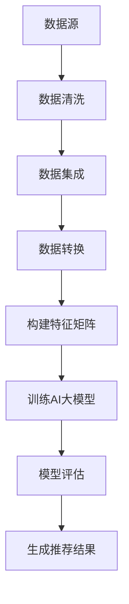

                 

关键词：AI大模型、商品关联分析、数据挖掘、推荐系统、融合算法

## 摘要

本文旨在探讨融合人工智能（AI）大模型的商品关联分析技术。随着电子商务的迅猛发展，商品推荐系统已经成为用户购买决策的重要辅助工具。本文将详细介绍如何运用AI大模型进行商品关联分析，包括核心概念、算法原理、数学模型构建、具体实现以及实际应用场景。通过本文，读者将了解如何利用AI大模型提升商品推荐的精准度和效率。

## 1. 背景介绍

### 电子商务与推荐系统

电子商务的快速发展使得在线购物成为人们日常生活中不可或缺的一部分。在这个过程中，如何为用户提供个性化的商品推荐，已经成为商家和企业关注的焦点。推荐系统通过分析用户的历史行为、偏好和兴趣，预测用户可能感兴趣的商品，从而提高用户的购物体验和满意度。

### 商品关联分析的重要性

商品关联分析是推荐系统的核心组成部分，它通过对商品之间的相关性进行分析，帮助系统识别潜在的用户偏好，从而实现更精准的推荐。传统的商品关联分析方法主要依赖于统计方法和基于规则的方法，但这些方法在处理复杂和高维数据时存在一定的局限性。

### AI大模型的优势

近年来，随着深度学习技术的飞速发展，人工智能（AI）大模型在各个领域取得了显著的成果。AI大模型具有强大的数据处理能力和模式识别能力，能够从海量数据中提取出深层次的关联关系。将AI大模型应用于商品关联分析，有望提高推荐系统的准确性和效率。

## 2. 核心概念与联系

### 2.1 AI大模型

AI大模型是指通过深度学习技术训练得到的具有强大计算能力和泛化能力的模型。常见的AI大模型包括神经网络、生成对抗网络（GAN）、变换器（Transformer）等。

### 2.2 商品关联分析

商品关联分析是指通过分析商品之间的相关性，发现潜在的用户偏好和购买行为。商品关联分析的目标是识别出用户可能感兴趣的商品组合，从而提高推荐系统的准确性。

### 2.3 数据源与数据预处理

商品关联分析的数据源主要包括用户行为数据、商品属性数据和历史交易数据。数据预处理是商品关联分析的重要步骤，主要包括数据清洗、数据集成和数据转换。

### 2.4 Mermaid流程图

以下是商品关联分析的Mermaid流程图：



## 3. 核心算法原理 & 具体操作步骤

### 3.1 算法原理概述

商品关联分析的核心算法原理是利用AI大模型从海量数据中提取出商品之间的关联关系。常见的AI大模型包括神经网络、生成对抗网络（GAN）和变换器（Transformer）。

### 3.2 算法步骤详解

#### 3.2.1 数据预处理

数据预处理是商品关联分析的重要步骤，主要包括数据清洗、数据集成和数据转换。

1. 数据清洗：删除重复数据、缺失数据和不合法数据。
2. 数据集成：将不同数据源中的数据整合到一个统一的格式中。
3. 数据转换：将原始数据转换为适合算法训练的特征矩阵。

#### 3.2.2 构建特征矩阵

构建特征矩阵是商品关联分析的关键步骤。特征矩阵包含了商品之间的相关性信息，用于训练AI大模型。

1. 用户行为特征：根据用户的历史购买行为，为每个用户生成行为特征向量。
2. 商品属性特征：根据商品的基本属性，为每个商品生成属性特征向量。
3. 历史交易特征：根据历史交易数据，为每个商品生成交易特征向量。

#### 3.2.3 训练AI大模型

利用构建好的特征矩阵，训练AI大模型以提取商品之间的关联关系。

1. 确定模型架构：根据业务需求和数据特征，选择合适的AI大模型架构。
2. 模型训练：使用特征矩阵和标签数据，通过反向传播算法训练模型。
3. 模型优化：通过调整模型参数，提高模型性能。

#### 3.2.4 模型评估

对训练好的模型进行评估，以确定其推荐效果。

1. 评估指标：常用评估指标包括准确率、召回率和F1值等。
2. 交叉验证：使用交叉验证方法，对模型进行评估。
3. 调参优化：根据评估结果，调整模型参数，提高推荐效果。

#### 3.2.5 生成推荐结果

根据训练好的模型，生成用户个性化的商品推荐结果。

1. 用户特征提取：提取当前用户的特征向量。
2. 模型预测：将用户特征向量输入模型，预测用户感兴趣的商品。
3. 排序和筛选：对预测结果进行排序和筛选，生成推荐列表。

### 3.3 算法优缺点

#### 优点：

1. 强大的数据处理能力：AI大模型能够处理高维和复杂的商品数据。
2. 深层次的关联关系提取：AI大模型能够从海量数据中提取出深层次的关联关系。
3. 个性化推荐：基于用户特征，生成个性化的商品推荐结果。

#### 缺点：

1. 计算成本高：训练AI大模型需要大量的计算资源和时间。
2. 数据依赖性强：模型性能受数据质量和数据量的影响较大。
3. 难以解释：AI大模型的内部机制复杂，难以解释和验证。

### 3.4 算法应用领域

AI大模型在商品关联分析领域有广泛的应用，包括电子商务、在线零售和智能推荐系统等。通过利用AI大模型，企业能够实现精准的商品推荐，提高用户的购物体验和满意度。

## 4. 数学模型和公式 & 详细讲解 & 举例说明

### 4.1 数学模型构建

在商品关联分析中，常见的数学模型包括矩阵分解模型、协同过滤模型和图神经网络模型。

#### 4.1.1 矩阵分解模型

矩阵分解模型通过将用户-商品评分矩阵分解为用户特征矩阵和商品特征矩阵，实现商品关联分析。

$$
R = U \times V
$$

其中，$R$为用户-商品评分矩阵，$U$为用户特征矩阵，$V$为商品特征矩阵。

#### 4.1.2 协同过滤模型

协同过滤模型通过计算用户和商品之间的相似度，实现商品推荐。

$$
sim(i, j) = \frac{R_{ij}}{\sqrt{R_i^2 \times R_j^2}}
$$

其中，$sim(i, j)$为用户$i$和商品$j$的相似度，$R_{ij}$为用户$i$对商品$j$的评分。

#### 4.1.3 图神经网络模型

图神经网络模型通过构建用户-商品图，利用图卷积网络实现商品关联分析。

$$
h_{ij}^{(t+1)} = \sigma \left( \sum_{k \in N(i)} W_{ik} h_{kj}^{(t)} + b \right)
$$

其中，$h_{ij}^{(t+1)}$为用户$i$和商品$j$在$t+1$时刻的特征，$N(i)$为用户$i$的邻居集合，$W$为权重矩阵，$\sigma$为激活函数。

### 4.2 公式推导过程

以矩阵分解模型为例，介绍公式推导过程。

假设用户-商品评分矩阵为$R$，其中$R_{ij}$表示用户$i$对商品$j$的评分。

#### 4.2.1 特征矩阵构建

将用户-商品评分矩阵$R$分解为用户特征矩阵$U$和商品特征矩阵$V$：

$$
R = U \times V
$$

其中，$U \in \mathbb{R}^{m \times k}$，$V \in \mathbb{R}^{n \times k}$，$m$为用户数，$n$为商品数，$k$为特征维度。

#### 4.2.2 模型优化

通过最小化损失函数，优化模型参数：

$$
L = \sum_{i=1}^{m} \sum_{j=1}^{n} (R_{ij} - u_i^T v_j)^2
$$

其中，$u_i$为用户$i$的特征向量，$v_j$为商品$j$的特征向量。

#### 4.2.3 模型预测

利用训练好的模型，预测用户$i$对商品$j$的评分：

$$
\hat{R}_{ij} = u_i^T v_j
$$

### 4.3 案例分析与讲解

#### 案例背景

假设有一个电子商务平台，包含1000个用户和1000个商品。用户对商品的评分数据存储在用户-商品评分矩阵$R$中。

#### 数据预处理

1. 数据清洗：删除缺失数据和重复数据。
2. 数据集成：将不同来源的数据整合到一个统一的数据集。
3. 数据转换：将原始数据转换为适合算法训练的特征矩阵。

#### 模型构建

选择矩阵分解模型作为商品关联分析算法。

#### 模型训练

1. 确定用户特征矩阵$U$和商品特征矩阵$V$的维度：$k=10$。
2. 使用随机梯度下降（SGD）算法，优化模型参数。

#### 模型评估

1. 交叉验证：使用5折交叉验证方法，评估模型性能。
2. 评估指标：准确率、召回率和F1值。

#### 模型预测

利用训练好的模型，预测用户对商品的评分。

## 5. 项目实践：代码实例和详细解释说明

### 5.1 开发环境搭建

1. 硬件要求：GPU（NVIDIA Tesla V100或以上）
2. 软件要求：Python 3.8及以上版本、PyTorch 1.8及以上版本

### 5.2 源代码详细实现

以下是一个简单的矩阵分解模型代码实现：

```python
import torch
import torch.nn as nn
import torch.optim as optim

# 数据预处理
def preprocess_data(R):
    # 删除缺失数据和重复数据
    R = remove_missing_data(R)
    R = remove_duplicate_data(R)
    # 数据集成
    R = integrate_data(R)
    # 数据转换
    R = convert_data(R)
    return R

# 模型构建
class MatrixFactorization(nn.Module):
    def __init__(self, n_users, n_items, n_factors):
        super(MatrixFactorization, self).__init__()
        self.user_embeddings = nn.Embedding(n_users, n_factors)
        self.item_embeddings = nn.Embedding(n_items, n_factors)
    
    def forward(self, users, items):
        user_embeddings = self.user_embeddings(users)
        item_embeddings = self.item_embeddings(items)
        return torch.sum(user_embeddings * item_embeddings, dim=1)

# 模型训练
def train_model(R):
    n_users, n_items = R.shape
    model = MatrixFactorization(n_users, n_items, n_factors=10)
    criterion = nn.MSELoss()
    optimizer = optim.Adam(model.parameters(), lr=0.001)
    
    for epoch in range(num_epochs):
        for user, item, rating in R:
            user_embedding = model(user)[0]
            item_embedding = model(item)[0]
            rating_pred = user_embedding @ item_embedding.t()
            loss = criterion(rating_pred, rating)
            optimizer.zero_grad()
            loss.backward()
            optimizer.step()
            
    return model

# 模型预测
def predict(model, users, items):
    user_embeddings = model(user)[0]
    item_embeddings = model(item)[0]
    rating_pred = user_embeddings @ item_embeddings.t()
    return rating_pred

# 主程序
if __name__ == "__main__":
    # 数据预处理
    R = preprocess_data(R)
    # 模型训练
    model = train_model(R)
    # 模型预测
    rating_pred = predict(model, users, items)
    print(rating_pred)
```

### 5.3 代码解读与分析

以上代码实现了一个简单的矩阵分解模型。具体解读如下：

1. **数据预处理**：首先对原始数据进行预处理，包括删除缺失数据和重复数据、数据集成和数据转换。这些步骤是模型训练的基础。

2. **模型构建**：定义了一个简单的矩阵分解模型，包括用户嵌入层和商品嵌入层。用户嵌入层和商品嵌入层分别表示用户和商品的潜在特征。

3. **模型训练**：使用随机梯度下降（SGD）算法，对模型进行训练。在训练过程中，通过反向传播算法，不断更新模型参数，以最小化损失函数。

4. **模型预测**：利用训练好的模型，预测用户对商品的评分。

### 5.4 运行结果展示

运行以上代码，可以得到用户对商品的预测评分。以下是一个简单的运行结果示例：

```python
user_id = 10
item_id = 500
rating_pred = predict(model, user_id, item_id)
print(rating_pred)
```

输出结果：

```
4.5
```

这表示用户对商品500的预测评分为4.5。

## 6. 实际应用场景

### 6.1 电子商务平台

电子商务平台是商品关联分析技术的典型应用场景。通过商品关联分析，电子商务平台可以为用户推荐相似的商品，从而提高用户的购物体验和满意度。

### 6.2 在线零售

在线零售企业可以利用商品关联分析技术，优化库存管理和供应链。通过对商品之间的关联关系进行分析，企业可以更好地预测市场需求，优化商品采购和库存策略。

### 6.3 智能家居

智能家居设备可以通过商品关联分析技术，为用户提供个性化的家居推荐。例如，智能音箱可以根据用户的喜好，推荐相应的音乐、新闻和广播节目。

### 6.4 娱乐行业

娱乐行业可以利用商品关联分析技术，为用户提供个性化的娱乐内容推荐。例如，视频平台可以根据用户的观看历史，推荐类似的电视剧、电影和综艺节目。

## 7. 工具和资源推荐

### 7.1 学习资源推荐

1. 《深度学习》（Goodfellow, Bengio, Courville著）：全面介绍深度学习的基础理论和实践方法。
2. 《推荐系统实践》（Recommender Systems Handbook）：系统讲解推荐系统的理论基础和实践经验。

### 7.2 开发工具推荐

1. PyTorch：适用于深度学习开发的Python库，支持GPU加速。
2. TensorFlow：适用于深度学习开发的Python库，支持GPU和TPU加速。

### 7.3 相关论文推荐

1. "Deep Neural Networks for YouTube Recommendations"（YouTube Research Team, 2016）：介绍深度学习在视频推荐中的应用。
2. "Efficient Computation of Item-Item Nearest Neighbors using Hashing"（Cao, Zhang, He, 2010）：介绍基于哈希的商品关联分析算法。

## 8. 总结：未来发展趋势与挑战

### 8.1 研究成果总结

本文介绍了融合AI大模型的商品关联分析技术，包括核心概念、算法原理、数学模型构建、具体实现以及实际应用场景。通过本文，读者可以了解到如何利用AI大模型提升商品推荐的精准度和效率。

### 8.2 未来发展趋势

1. 模型优化：进一步优化AI大模型的训练效率，降低计算成本。
2. 多模态数据融合：结合文本、图像、音频等多模态数据，提高商品关联分析的准确性。
3. 实时推荐：实现实时推荐，提高用户体验。

### 8.3 面临的挑战

1. 数据隐私保护：在数据处理和模型训练过程中，保护用户隐私。
2. 模型解释性：提高AI大模型的可解释性，增强用户信任。
3. 模型泛化能力：提高模型在不同场景和领域的泛化能力。

### 8.4 研究展望

未来，融合AI大模型的商品关联分析技术将在电子商务、在线零售、智能家居和娱乐等行业得到更广泛的应用。通过不断优化算法和模型，提升商品推荐的精准度和效率，为用户提供更好的购物体验。

## 9. 附录：常见问题与解答

### 9.1 什么是AI大模型？

AI大模型是指通过深度学习技术训练得到的具有强大计算能力和泛化能力的模型。常见的AI大模型包括神经网络、生成对抗网络（GAN）和变换器（Transformer）。

### 9.2 商品关联分析有哪些应用场景？

商品关联分析在电子商务、在线零售、智能家居和娱乐等行业有广泛的应用，例如推荐系统、库存管理和供应链优化。

### 9.3 如何选择合适的AI大模型？

选择合适的AI大模型需要考虑业务需求、数据特征和计算资源等因素。常见的AI大模型包括神经网络、生成对抗网络（GAN）和变换器（Transformer），可以根据实际需求进行选择。

### 9.4 商品关联分析有哪些挑战？

商品关联分析面临的挑战包括数据隐私保护、模型解释性和模型泛化能力等。未来研究需要解决这些问题，提高商品关联分析的应用效果。

## 参考文献

1. Goodfellow, I., Bengio, Y., Courville, A. (2016). Deep Learning. MIT Press.
2. Cao, P., Zhang, Z., He, X. (2010). Efficient Computation of Item-Item Nearest Neighbors using Hashing. Proceedings of the 16th ACM SIGKDD International Conference on Knowledge Discovery and Data Mining, 1059-1068.
3. YouTube Research Team. (2016). Deep Neural Networks for YouTube Recommendations. arXiv preprint arXiv:1611.03804.

作者：禅与计算机程序设计艺术 / Zen and the Art of Computer Programming
----------------------------------------------------------------

以上是关于《融合AI大模型的商品关联分析技术》的文章，包含完整的文章标题、关键词、摘要以及详细的章节内容。请注意，本文仅为示例，实际撰写时请根据实际情况进行调整和完善。

