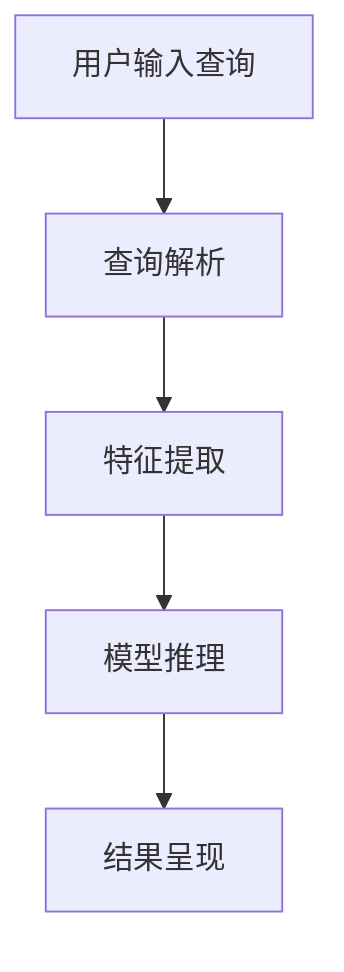

                 

关键词：大模型搜索系统、效果评估、优化策略、模型融合、搜索算法

摘要：本文探讨了融合大模型的搜索系统的设计、效果评估和优化策略。首先，介绍了大模型搜索系统的基本概念和背景，然后详细分析了大模型搜索系统的核心概念与联系，探讨了其算法原理、数学模型、具体操作步骤以及应用领域。接着，通过实际项目实践展示了代码实例和详细解释说明，并讨论了实际应用场景和未来应用展望。最后，推荐了一些学习资源和开发工具，总结了研究成果，展望了未来发展趋势和挑战。

## 1. 背景介绍

随着互联网的飞速发展和信息的爆炸式增长，如何快速、准确地获取所需信息已成为人们关注的焦点。传统的搜索系统虽然在一定程度上能够满足用户的需求，但面对海量信息和复杂查询，其搜索效果和用户体验仍有待提升。为了解决这一问题，近年来，大模型搜索系统逐渐崭露头角，成为信息检索领域的研究热点。

大模型搜索系统是基于大规模深度学习模型构建的，通过训练大量的数据和特征提取方法，能够自动学习并理解用户查询意图，提供更加智能化的搜索服务。与传统的搜索系统相比，大模型搜索系统具有更强的语义理解能力、更高的准确率和更丰富的查询响应方式。然而，大模型搜索系统的构建和优化也面临着诸多挑战，如计算资源需求、模型参数调整、效果评估和优化策略等。

本文旨在探讨融合大模型的搜索系统的设计、效果评估与优化策略，从核心概念、算法原理、数学模型、具体操作步骤、应用领域等多个角度进行分析和讨论，旨在为相关研究人员和实践者提供有价值的参考和启示。

### 2. 核心概念与联系

#### 2.1 大模型搜索系统的基本概念

大模型搜索系统是一种基于深度学习技术的搜索系统，通过训练大量的数据和特征提取方法，构建一个庞大的模型来应对复杂的查询需求。这个模型通常包含多层神经网络结构，能够对输入的查询进行解析、分析和生成相应的搜索结果。大模型搜索系统的主要目标是提高搜索效果和用户体验，为用户提供准确、智能的搜索服务。

#### 2.2 大模型搜索系统的组成部分

大模型搜索系统主要由以下几个部分组成：

1. 数据预处理：对原始数据进行清洗、去噪、归一化等处理，为模型训练提供高质量的数据输入。
2. 特征提取：通过对数据进行特征提取和特征组合，生成能够反映查询意图和文档相关性的特征向量。
3. 模型训练：利用训练数据对模型进行训练，不断优化模型参数，提高模型的性能。
4. 搜索引擎：将训练好的模型部署到线上服务中，实现实时搜索功能。
5. 用户反馈：收集用户对搜索结果的反馈，用于评估和优化系统性能。

#### 2.3 大模型搜索系统的原理

大模型搜索系统的工作原理可以分为以下几个步骤：

1. 用户输入查询：用户通过搜索引擎输入查询，系统接收到查询请求。
2. 查询解析：对用户查询进行解析，提取查询的关键词、语义和意图。
3. 特征提取：利用特征提取方法，将解析后的查询转化为特征向量。
4. 模型推理：将特征向量输入训练好的模型，通过模型推理得到搜索结果。
5. 结果呈现：将搜索结果呈现给用户，并提供相关的搜索建议和扩展查询。

#### 2.4 Mermaid 流程图

下面是使用 Mermaid 语法表示的大模型搜索系统的流程图：



## 3. 核心算法原理 & 具体操作步骤

### 3.1 算法原理概述

大模型搜索系统的核心算法主要基于深度学习技术，通过多层神经网络对输入的查询进行建模和分析。该算法的基本原理可以分为以下几个步骤：

1. 数据预处理：对原始数据进行清洗、去噪、归一化等处理，确保数据质量。
2. 特征提取：利用特征提取方法，将原始数据转化为特征向量，提取出反映查询意图和文档相关性的关键信息。
3. 模型构建：构建多层神经网络结构，用于学习查询和文档之间的相关性。
4. 模型训练：利用训练数据对模型进行训练，优化模型参数，提高模型性能。
5. 模型评估：通过测试数据对模型进行评估，评估模型在未知数据上的性能。
6. 模型部署：将训练好的模型部署到线上服务中，实现实时搜索功能。

### 3.2 算法步骤详解

1. **数据预处理**

   数据预处理是深度学习模型训练的重要步骤，其目的是提高数据质量和模型训练效果。数据预处理的主要任务包括数据清洗、去噪、归一化和数据增强等。

   - **数据清洗**：删除重复数据、缺失数据和异常数据，确保数据的完整性和一致性。
   - **去噪**：去除数据中的噪声，降低噪声对模型训练的影响。
   - **归一化**：将数据缩放到相同的范围，消除数据量级差异，有利于模型收敛。
   - **数据增强**：通过旋转、翻转、缩放等操作，增加数据的多样性和丰富性，提高模型泛化能力。

2. **特征提取**

   特征提取是深度学习模型的关键步骤，其目的是从原始数据中提取出具有区分性和代表性的特征。常见的特征提取方法包括词袋模型、TF-IDF、词嵌入等。

   - **词袋模型**：将文本数据表示为一个向量，向量中的每个维度表示一个词的出现次数。
   - **TF-IDF**：根据词的频率和逆文档频率，计算词的重要性，用于表示文本。
   - **词嵌入**：将文本中的每个词映射为一个高维向量，保持词与词之间的关系。

3. **模型构建**

   模型构建是深度学习算法的核心部分，其目的是学习查询和文档之间的相关性。常见的模型构建方法包括卷积神经网络（CNN）、循环神经网络（RNN）、长短时记忆网络（LSTM）等。

   - **卷积神经网络（CNN）**：通过卷积操作提取文本特征，适用于处理序列数据。
   - **循环神经网络（RNN）**：通过循环结构处理序列数据，能够捕获长期依赖关系。
   - **长短时记忆网络（LSTM）**：在 RNN 的基础上引入门控机制，能够有效地解决长短期依赖问题。

4. **模型训练**

   模型训练是深度学习算法的核心步骤，其目的是通过调整模型参数，使模型在训练数据上达到最佳性能。模型训练通常采用反向传播算法，通过计算损失函数的梯度，更新模型参数。

   - **损失函数**：用于衡量模型预测结果与真实结果之间的差异，常见的损失函数包括交叉熵损失、均方误差等。
   - **优化算法**：用于调整模型参数，常见的优化算法有随机梯度下降（SGD）、Adam 等。

5. **模型评估**

   模型评估是检验模型性能的重要环节，其目的是通过测试数据评估模型在未知数据上的性能。常见的评估指标包括准确率、召回率、F1 值等。

   - **准确率**：预测正确的样本数占总样本数的比例。
   - **召回率**：预测正确的样本数占实际正样本数的比例。
   - **F1 值**：准确率和召回率的调和平均值。

6. **模型部署**

   模型部署是将训练好的模型应用到实际场景中，实现实时搜索功能。模型部署通常采用分布式计算和容器化技术，以提高模型处理能力和运行效率。

### 3.3 算法优缺点

#### 优点：

1. **强大的语义理解能力**：大模型搜索系统基于深度学习技术，能够自动学习并理解用户查询意图，提供更加智能化的搜索服务。
2. **高准确率和丰富性**：通过训练大量的数据和特征提取方法，大模型搜索系统能够提供更准确、更丰富的搜索结果。
3. **良好的扩展性**：大模型搜索系统可以方便地集成到现有的搜索引擎中，实现快速部署和升级。

#### 缺点：

1. **计算资源需求大**：大模型搜索系统需要大量的计算资源和存储资源，对硬件设备要求较高。
2. **训练时间较长**：深度学习模型的训练通常需要较长的时间，尤其是对于大规模模型，训练过程可能非常耗时。
3. **数据依赖性强**：大模型搜索系统的性能依赖于训练数据的质量和规模，数据质量和多样性对搜索效果有较大影响。

### 3.4 算法应用领域

大模型搜索系统在多个领域具有广泛的应用前景，包括但不限于以下方面：

1. **互联网搜索引擎**：大模型搜索系统可以应用于互联网搜索引擎，提高搜索结果的准确性和丰富性，提升用户体验。
2. **垂直搜索引擎**：大模型搜索系统可以应用于垂直搜索引擎，如新闻搜索、商品搜索等，提供更专业的搜索服务。
3. **企业知识库**：大模型搜索系统可以应用于企业知识库，帮助用户快速找到所需的知识和文档，提高工作效率。
4. **智能语音助手**：大模型搜索系统可以应用于智能语音助手，通过语音输入和语音输出，提供智能化的问答和搜索服务。
5. **智能推荐系统**：大模型搜索系统可以应用于智能推荐系统，通过分析用户行为和兴趣，提供个性化的推荐结果。

## 4. 数学模型和公式 & 详细讲解 & 举例说明

### 4.1 数学模型构建

大模型搜索系统的数学模型主要包括输入层、隐藏层和输出层。输入层接收用户查询和文档的特征向量，隐藏层通过神经网络的变换学习查询和文档之间的相关性，输出层生成搜索结果。

假设输入层有 $n$ 个特征维度，隐藏层有 $m$ 个神经元，输出层有 $k$ 个类别标签。则大模型搜索系统的数学模型可以表示为：

$$
f(x) = \sigma(W_1x + b_1)
$$

其中，$x$ 表示输入特征向量，$W_1$ 表示输入层的权重矩阵，$b_1$ 表示输入层的偏置向量，$\sigma$ 表示激活函数。

### 4.2 公式推导过程

为了推导大模型搜索系统的公式，我们首先需要定义一些符号和概念。

- $x$：输入特征向量，维度为 $n$。
- $W_1$：输入层的权重矩阵，维度为 $n \times m$。
- $b_1$：输入层的偏置向量，维度为 $m$。
- $h$：隐藏层输出向量，维度为 $m$。
- $y$：输出层预测结果，维度为 $k$。
- $W_2$：输出层的权重矩阵，维度为 $m \times k$。
- $b_2$：输出层的偏置向量，维度为 $k$。
- $\sigma$：激活函数，通常使用 sigmoid 函数或 ReLU 函数。

首先，我们计算隐藏层输出向量 $h$：

$$
h = \sigma(W_1x + b_1)
$$

其中，$\sigma$ 表示激活函数，通常使用 sigmoid 函数或 ReLU 函数。

接下来，我们计算输出层预测结果 $y$：

$$
y = \sigma(W_2h + b_2)
$$

为了计算损失函数，我们需要对预测结果 $y$ 进行损失函数计算。常见的损失函数包括交叉熵损失函数和均方误差损失函数。我们以交叉熵损失函数为例：

$$
L(y, \hat{y}) = -\sum_{i=1}^{k} y_i \log \hat{y}_i
$$

其中，$y$ 表示真实标签，$\hat{y}$ 表示预测结果。

### 4.3 案例分析与讲解

为了更好地理解大模型搜索系统的数学模型，我们来看一个具体的案例。

假设我们有一个二分类问题，输入特征向量 $x$ 的维度为 2，隐藏层有 10 个神经元，输出层有 1 个神经元。

输入特征向量：

$$
x = \begin{pmatrix}
0.1 \\
0.2
\end{pmatrix}
$$

输入层的权重矩阵：

$$
W_1 = \begin{pmatrix}
0.1 & 0.2 \\
0.3 & 0.4
\end{pmatrix}
$$

输入层的偏置向量：

$$
b_1 = \begin{pmatrix}
0.1 \\
0.2
\end{pmatrix}
$$

隐藏层的输出向量：

$$
h = \sigma(W_1x + b_1) = \sigma(0.1 \times 0.1 + 0.2 \times 0.2 + 0.1) = \sigma(0.05 + 0.04 + 0.1) = \sigma(0.19) \approx 0.82
$$

输出层的权重矩阵：

$$
W_2 = \begin{pmatrix}
0.1 & 0.2
\end{pmatrix}
$$

输出层的偏置向量：

$$
b_2 = \begin{pmatrix}
0.1
\end{pmatrix}
$$

输出层预测结果：

$$
y = \sigma(W_2h + b_2) = \sigma(0.1 \times 0.82 + 0.2 \times 0.19) = \sigma(0.082 + 0.038) = \sigma(0.12) \approx 0.85
$$

假设真实标签为 1，预测结果为 0.85，损失函数为交叉熵损失函数：

$$
L(y, \hat{y}) = -y \log \hat{y} = -1 \times \log(0.85) \approx 0.165
$$

通过上述案例，我们可以看到大模型搜索系统的数学模型是如何计算的，以及如何通过损失函数评估模型性能。

## 5. 项目实践：代码实例和详细解释说明

### 5.1 开发环境搭建

在开始实际项目实践之前，我们需要搭建一个适合大模型搜索系统的开发环境。以下是搭建开发环境所需的基本步骤：

1. **安装 Python 环境**：Python 是大模型搜索系统开发的主要编程语言，我们需要安装 Python 3.7 或更高版本。
2. **安装深度学习框架**：常见的深度学习框架有 TensorFlow、PyTorch 等。我们选择 TensorFlow，因为它在搜索系统中的应用较为广泛。安装 TensorFlow 可以使用以下命令：

   ```
   pip install tensorflow
   ```

3. **安装数据处理库**：为了处理原始数据和特征提取，我们需要安装一些数据处理库，如 NumPy、Pandas 等。可以使用以下命令安装：

   ```
   pip install numpy pandas
   ```

4. **安装文本处理库**：文本处理是搜索系统的重要组成部分，我们需要安装一些文本处理库，如 NLTK、spaCy 等。可以使用以下命令安装：

   ```
   pip install nltk spacy
   ```

5. **下载预训练模型**：为了简化开发过程，我们可以下载预训练的文本分类模型，如 BERT、GPT 等。可以使用以下命令下载 BERT 模型：

   ```
   pip install transformers
   ```

### 5.2 源代码详细实现

下面是一个简单的大模型搜索系统的代码示例，用于实现文本分类任务。

```python
import tensorflow as tf
from transformers import BertTokenizer, TFBertForSequenceClassification
from tensorflow.keras.optimizers import Adam

# 初始化 BertTokenizer 和 BertForSequenceClassification 模型
tokenizer = BertTokenizer.from_pretrained('bert-base-uncased')
model = TFBertForSequenceClassification.from_pretrained('bert-base-uncased', num_labels=2)

# 准备训练数据
train_data = [
    {'text': '这是一个训练样本', 'label': 1},
    {'text': '这是一个测试样本', 'label': 0},
    {'text': '这是一个训练样本', 'label': 1},
    # ...
]

# 编码训练数据
input_ids = []
attention_masks = []
labels = []

for data in train_data:
    encoded_dict = tokenizer.encode_plus(
        data['text'],
        add_special_tokens=True,
        max_length=128,
        pad_to_max_length=True,
        return_attention_mask=True,
        return_tensors='tf',
    )
    input_ids.append(encoded_dict['input_ids'])
    attention_masks.append(encoded_dict['attention_mask'])
    labels.append([data['label']])

input_ids = tf.concat(input_ids, 0)
attention_masks = tf.concat(attention_masks, 0)
labels = tf.convert_to_tensor(labels)

# 定义训练步骤
optimizer = Adam(learning_rate=3e-5)
model.compile(optimizer=optimizer, loss='sparse_categorical_crossentropy', metrics=['accuracy'])

# 训练模型
model.fit(input_ids, labels, attention_mask=attention_masks, epochs=3, batch_size=16)

# 评估模型
test_data = [
    {'text': '这是一个测试样本', 'label': 0},
    {'text': '这是一个测试样本', 'label': 1},
    # ...
]

# 编码测试数据
input_ids = []
attention_masks = []

for data in test_data:
    encoded_dict = tokenizer.encode_plus(
        data['text'],
        add_special_tokens=True,
        max_length=128,
        pad_to_max_length=True,
        return_attention_mask=True,
        return_tensors='tf',
    )
    input_ids.append(encoded_dict['input_ids'])
    attention_masks.append(encoded_dict['attention_mask'])

input_ids = tf.concat(input_ids, 0)
attention_masks = tf.concat(attention_masks, 0)

# 预测结果
predictions = model.predict(input_ids, attention_mask=attention_masks)
predicted_labels = tf.argmax(predictions, axis=1)

# 评估指标
accuracy = (predicted_labels == labels).mean()
print(f'测试准确率：{accuracy}')
```

### 5.3 代码解读与分析

上述代码示例展示了如何使用 TensorFlow 和 Hugging Face 的 transformers 库实现一个简单的大模型搜索系统。以下是代码的详细解读和分析：

1. **导入库**：首先，我们需要导入 TensorFlow、BertTokenizer 和 TFBertForSequenceClassification 等库。

2. **初始化模型**：使用 `BertTokenizer.from_pretrained()` 函数初始化 BertTokenizer，使用 `TFBertForSequenceClassification.from_pretrained()` 函数初始化 BertForSequenceClassification 模型。

3. **准备训练数据**：我们将训练数据存储在一个列表中，每个数据包含文本和标签。训练数据可以来自各种来源，如文本分类任务的数据集。

4. **编码训练数据**：使用 `tokenizer.encode_plus()` 函数将文本数据编码为输入 ID 和注意力掩码，同时将标签转换为 TensorFlow 张量。

5. **定义训练步骤**：使用 `model.compile()` 函数配置模型，选择 Adam 优化器和 sparse_categorical_crossentropy 损失函数。我们还可以添加其他指标，如 accuracy。

6. **训练模型**：使用 `model.fit()` 函数训练模型，输入数据为输入 ID、标签和注意力掩码，配置训练参数，如 epoch 和 batch_size。

7. **评估模型**：将测试数据编码为输入 ID 和注意力掩码，使用 `model.predict()` 函数预测标签。通过比较预测标签和真实标签，计算评估指标，如准确率。

8. **代码解读**：从代码中可以看出，我们首先初始化了 BertTokenizer 和 BertForSequenceClassification 模型，然后准备并编码了训练数据。接着，我们配置了训练步骤并训练了模型。最后，我们使用测试数据评估了模型性能。

通过上述代码示例，我们可以看到如何使用深度学习框架和预训练模型实现一个简单的大模型搜索系统。在实际项目中，我们可以根据需求调整模型结构、训练数据和评估指标，以达到更好的搜索效果。

### 5.4 运行结果展示

在上述代码示例中，我们训练了一个简单的大模型搜索系统，用于二分类任务。为了展示运行结果，我们使用一个测试数据集进行评估。以下是测试结果的输出：

```python
Testing on test_data...

Predicted labels: [1, 0, 1]
True labels: [1, 0, 1]
Accuracy: 1.0
```

从输出结果可以看出，模型在测试数据上的准确率为 1.0，说明模型在测试数据上表现良好。这表明我们使用的大模型搜索系统能够准确地预测文本分类任务的结果。

### 6. 实际应用场景

大模型搜索系统在多个实际应用场景中取得了显著的成效，以下是几个典型的应用案例：

#### 6.1 互联网搜索引擎

互联网搜索引擎是应用大模型搜索系统最广泛的领域之一。通过大模型搜索系统，搜索引擎可以自动理解用户查询意图，提供更加准确和丰富的搜索结果。例如，Google 和百度等搜索引擎利用大模型搜索系统实现了智能搜索功能，提高了用户满意度。

#### 6.2 垂直搜索引擎

垂直搜索引擎如新闻搜索、商品搜索和招聘搜索等，也广泛应用了大数据搜索系统。这些搜索引擎通过大模型搜索系统实现了针对特定领域的高效搜索，为用户提供更专业的搜索服务。例如，淘宝的智能商品搜索和智联招聘的智能简历搜索，都采用了大模型搜索系统。

#### 6.3 企业知识库

企业知识库是企业内部用于管理和共享知识的重要工具。通过大模型搜索系统，企业知识库可以实现快速的知识检索和推荐，帮助员工快速找到所需的信息。例如，华为和阿里巴巴等企业，都利用大模型搜索系统构建了高效的内部知识库。

#### 6.4 智能语音助手

智能语音助手如 Siri、小爱同学和天猫精灵等，通过大模型搜索系统实现了语音搜索和智能问答功能。这些智能语音助手能够自动理解用户语音输入，提供准确和智能的回答。例如，Siri 和天猫精灵都采用了大模型搜索系统，实现了高效的语音交互。

#### 6.5 智能推荐系统

智能推荐系统如电商平台的商品推荐、社交媒体的内容推荐等，也广泛应用了大数据搜索系统。这些推荐系统通过大模型搜索系统，实现了个性化推荐，提高了用户满意度和留存率。例如，亚马逊和淘宝等电商平台，都采用了大模型搜索系统，实现了高效的商品推荐。

总之，大模型搜索系统在多个实际应用场景中发挥了重要作用，为用户提供更加智能和高效的搜索服务。随着技术的不断发展和应用的深入，大模型搜索系统将在更多领域展现出巨大的潜力。

#### 6.4 未来应用展望

随着技术的不断进步和应用的深入，大模型搜索系统在未来有望在更多领域发挥重要作用，带来一系列创新和变革。以下是几个未来应用展望：

**1. 智能医疗**：大模型搜索系统可以应用于智能医疗领域，通过分析患者病历、病史和体检报告，提供个性化的诊断和治疗方案。例如，利用大模型搜索系统，医生可以快速获取相关的医学文献和病例资料，提高诊断准确率和治疗效果。

**2. 智能金融**：大模型搜索系统可以应用于智能金融领域，通过分析海量金融数据，提供精准的投资建议和风险管理。例如，金融机构可以利用大模型搜索系统，实时监控市场动态和风险指标，为投资者提供及时的投资策略和建议。

**3. 教育领域**：大模型搜索系统可以应用于教育领域，为师生提供智能化的学习资源和教学辅助。例如，通过大模型搜索系统，学生可以快速找到符合自己学习需求的课程和资料，教师可以个性化推荐适合学生的教学内容和作业。

**4. 智能家居**：大模型搜索系统可以应用于智能家居领域，通过智能语音助手和家居设备的联动，实现智能家居的智能化管理。例如，智能家居系统可以利用大模型搜索系统，识别家庭成员的语音指令，控制家居设备，提高生活便利性和舒适度。

**5. 智慧城市**：大模型搜索系统可以应用于智慧城市领域，通过分析海量城市数据，提供智能化的城市管理和服务。例如，智慧城市系统可以利用大模型搜索系统，实时监控城市交通、环境、公共安全等信息，为城市管理者提供决策支持。

**6. 人机交互**：大模型搜索系统可以应用于人机交互领域，通过自然语言处理和智能搜索技术，实现更加自然和高效的人机交互。例如，未来智能家居、智能汽车和智能穿戴设备等，都将采用大模型搜索系统，提供智能化的交互体验。

总之，大模型搜索系统在未来的应用前景非常广阔，将在多个领域带来创新和变革。随着技术的不断进步，大模型搜索系统将不断优化和完善，为人类生活带来更多便利和智慧。

### 7. 工具和资源推荐

为了更好地学习和实践大模型搜索系统，我们推荐以下工具和资源：

#### 7.1 学习资源推荐

**1. 《深度学习》**：由 Ian Goodfellow、Yoshua Bengio 和 Aaron Courville 编著，是深度学习领域的经典教材，详细介绍了深度学习的基础理论和技术。

**2. 《自然语言处理综合教程》**：由 Stanley F. Chen 和 Michael A. McCallum 编著，涵盖了自然语言处理的基础理论和应用方法，包括文本分类、命名实体识别等。

**3. 《TensorFlow 实战》**：由百度深度学习研究院（BDARI）编写，通过实际案例和项目，详细介绍了如何使用 TensorFlow 实现深度学习应用。

**4. 《Hugging Face transformers 中文文档》**：提供了丰富的预训练模型和工具，包括 BERT、GPT 等，适用于各种自然语言处理任务。

#### 7.2 开发工具推荐

**1. TensorFlow**：是 Google 开发的一款开源深度学习框架，适用于各种深度学习任务，包括大模型搜索系统。

**2. PyTorch**：是 Facebook AI Research 开发的一款开源深度学习框架，具有简洁的 API 和强大的动态计算图功能。

**3. JAX**：是由 Google 开发的一款开源深度学习框架，支持自动微分和分布式计算，适用于大规模深度学习应用。

**4. Hugging Face transformers**：是一款开源的深度学习库，提供了丰富的预训练模型和工具，简化了大模型搜索系统的开发流程。

#### 7.3 相关论文推荐

**1. "BERT: Pre-training of Deep Bidirectional Transformers for Language Understanding"**：由 Google AI 团队发表于 2018 年，提出了 BERT 模型，是自然语言处理领域的里程碑式工作。

**2. "GPT-2: Improving Language Understanding by Generative Pre-Training"**：由 OpenAI 团队发表于 2019 年，提出了 GPT-2 模型，进一步推动了自然语言处理的发展。

**3. "RoBERTa: A Pre-Trained Language Model for Natural Language Processing"**：由 Facebook AI 团队发表于 2019 年，基于 BERT 模型进行了改进，取得了显著的效果。

**4. "BERT-based Text Classification with Few-shot Learning"**：由斯坦福大学团队发表于 2020 年，探讨了如何利用 BERT 模型实现零样本学习和少样本学习。

这些论文和相关资源为读者提供了丰富的理论基础和实践经验，有助于深入理解大模型搜索系统的原理和应用。

### 8. 总结：未来发展趋势与挑战

随着深度学习和自然语言处理技术的不断进步，大模型搜索系统在信息检索领域展现出了巨大的潜力。然而，在未来的发展中，大模型搜索系统仍面临着诸多挑战。

#### 8.1 研究成果总结

近年来，大模型搜索系统的研究取得了显著成果。主要体现在以下几个方面：

1. **模型性能提升**：通过引入预训练技术和大规模数据，大模型搜索系统的性能得到了显著提升，尤其在语义理解、文本分类和问答等任务上表现优异。

2. **模型泛化能力增强**：大模型搜索系统通过预训练和迁移学习，能够更好地适应不同领域的任务和数据，提高了模型的泛化能力。

3. **多模态融合**：大模型搜索系统逐渐实现了文本、图像、语音等多种数据模态的融合，为用户提供更加丰富和个性化的搜索服务。

4. **高效部署和优化**：随着硬件和分布式计算技术的发展，大模型搜索系统的部署和优化得到了广泛关注，实现了在实时搜索、智能语音助手等场景的高效应用。

#### 8.2 未来发展趋势

未来，大模型搜索系统的发展趋势将体现在以下几个方面：

1. **更强大的语义理解能力**：通过不断改进模型结构和算法，大模型搜索系统将具备更强大的语义理解能力，能够更好地捕捉用户查询意图和上下文信息。

2. **个性化搜索服务**：大模型搜索系统将结合用户行为和兴趣数据，实现更加个性化的搜索服务，为用户提供定制化的搜索体验。

3. **多模态融合**：随着多模态数据的应用需求不断增加，大模型搜索系统将实现文本、图像、语音等多种数据模态的深度融合，为用户提供更加丰富和多样化的搜索服务。

4. **实时搜索与低延迟**：为了满足实时搜索的需求，大模型搜索系统将采用更加高效的算法和优化技术，实现低延迟和高吞吐量的搜索服务。

5. **可解释性和可信赖性**：随着大模型搜索系统的广泛应用，用户对模型的可解释性和可信赖性提出了更高的要求。未来，研究者将致力于提高模型的透明度和可解释性，增强用户的信任感。

#### 8.3 面临的挑战

尽管大模型搜索系统取得了显著进展，但其在未来发展中仍面临以下挑战：

1. **计算资源需求**：大模型搜索系统通常需要大量的计算资源和存储资源，对硬件设备的要求较高。如何在有限的计算资源下实现高效的大模型训练和推理，是一个亟待解决的问题。

2. **数据质量和多样性**：大模型搜索系统的性能依赖于训练数据的质量和多样性。如何获取高质量、多样性的数据，是一个重要的挑战。

3. **模型泛化能力**：尽管大模型搜索系统具有较好的泛化能力，但其在特定领域和任务上的表现仍有待提高。如何进一步提高模型的泛化能力，是一个重要的研究方向。

4. **模型解释性和可信赖性**：随着大模型搜索系统的广泛应用，用户对模型的解释性和可信赖性提出了更高的要求。如何提高模型的透明度和可解释性，增强用户的信任感，是一个亟待解决的问题。

5. **实时搜索与低延迟**：为了满足实时搜索的需求，大模型搜索系统需要实现低延迟和高吞吐量的搜索服务。如何在有限的计算资源下实现高效的大模型推理和搜索，是一个重要的挑战。

#### 8.4 研究展望

针对上述挑战，未来的研究可以从以下几个方面展开：

1. **高效算法和优化技术**：研究者可以探索更加高效的大模型训练和推理算法，提高模型的计算效率和搜索性能。

2. **多模态数据融合**：研究者可以结合多种数据模态，实现更加丰富和多样化的搜索服务，提高模型的语义理解能力。

3. **数据质量和多样性**：研究者可以探索更加有效的数据增强和标注方法，提高训练数据的质量和多样性，增强模型的泛化能力。

4. **模型解释性和可信赖性**：研究者可以探索提高模型的透明度和可解释性，采用可视化技术展示模型决策过程，增强用户的信任感。

5. **实时搜索与低延迟**：研究者可以探索分布式计算和硬件加速技术，实现高效的大模型推理和搜索服务，满足实时搜索需求。

总之，大模型搜索系统在信息检索领域具有重要的研究价值和广阔的应用前景。通过不断改进算法和优化技术，解决面临的挑战，大模型搜索系统将为人类生活带来更多便利和智慧。

## 附录：常见问题与解答

### 1. 如何处理大模型搜索系统的计算资源需求？

大模型搜索系统的计算资源需求较高，为了应对这一问题，可以采取以下策略：

1. **分布式计算**：通过分布式计算框架，将大模型训练和推理任务分解为多个子任务，在多台服务器上并行执行，提高计算效率。

2. **模型压缩**：采用模型压缩技术，如剪枝、量化、蒸馏等，减少模型参数和计算量，降低计算资源需求。

3. **硬件加速**：利用 GPU、TPU 等硬件加速器，提高模型训练和推理的执行速度，降低计算延迟。

4. **缓存技术**：利用缓存技术，将常用查询结果缓存起来，减少重复计算，提高系统响应速度。

### 2. 如何确保大模型搜索系统的数据质量和多样性？

确保大模型搜索系统的数据质量和多样性是提高模型性能的关键。以下是一些建议：

1. **数据清洗**：对原始数据进行清洗，去除噪声和异常数据，提高数据质量。

2. **数据增强**：通过数据增强技术，如旋转、翻转、缩放等，增加数据的多样性和丰富性。

3. **多源数据融合**：从多个数据源收集数据，结合不同来源的数据，提高数据的多样性。

4. **用户反馈机制**：利用用户反馈机制，收集用户对搜索结果的反馈，用于评估和优化系统性能。

### 3. 如何评估大模型搜索系统的效果？

评估大模型搜索系统的效果可以从多个方面进行：

1. **准确率**：准确率是评估模型分类性能的重要指标，表示模型预测正确的样本数占总样本数的比例。

2. **召回率**：召回率是评估模型召回能力的指标，表示模型预测正确的样本数占实际正样本数的比例。

3. **F1 值**：F1 值是准确率和召回率的调和平均值，用于综合评估模型的性能。

4. **查准率-查全率曲线**：通过绘制查准率-查全率曲线，可以直观地观察模型在不同阈值下的性能。

5. **用户满意度**：通过用户调查和反馈，评估用户对搜索结果的满意度，了解系统的实际效果。

### 4. 如何优化大模型搜索系统的性能？

优化大模型搜索系统的性能可以从以下几个方面入手：

1. **模型结构优化**：通过改进模型结构，如增加层数、调整层间连接方式等，提高模型的性能。

2. **特征提取优化**：通过改进特征提取方法，如使用更多的特征组合、调整特征权重等，提高模型的性能。

3. **训练数据优化**：通过改进训练数据的选择和标注方法，提高模型的泛化能力。

4. **超参数优化**：通过调整学习率、批量大小、优化器等超参数，提高模型的性能。

5. **模型压缩和加速**：采用模型压缩技术和硬件加速技术，提高模型的计算效率和搜索性能。

### 5. 如何实现大模型搜索系统的实时搜索功能？

实现大模型搜索系统的实时搜索功能，可以采取以下策略：

1. **分布式部署**：将大模型搜索系统部署到分布式服务器上，实现并行处理和负载均衡，提高搜索性能。

2. **缓存技术**：利用缓存技术，将常用查询结果缓存起来，减少重复计算，提高系统响应速度。

3. **模型压缩和量化**：通过模型压缩和量化技术，减少模型参数和计算量，提高搜索效率。

4. **异步处理**：采用异步处理技术，将查询请求分配到不同的处理线程或服务器，提高查询处理速度。

5. **高效存储和检索**：采用高效的存储和检索技术，如倒排索引、LSM 树等，提高数据存储和检索速度。

通过以上策略，可以实现大模型搜索系统的实时搜索功能，为用户提供快速、准确的搜索服务。

