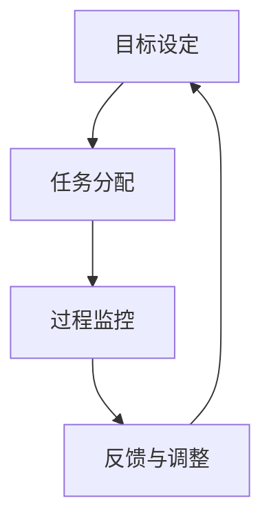

                 

关键词：执行力、行动体系、IT领域、技术架构、策略实施、过程监控、效率优化、团队协作、目标管理

> 摘要：本文从IT领域的实践出发，探讨了如何构建一个有效的行动体系，以保障团队在技术项目中执行力的实现。通过对核心概念、算法原理、数学模型、项目实践的深入分析，本文提出了实施策略和优化方法，为提高IT项目执行力提供了理论和实践指导。

## 1. 背景介绍

在现代信息技术快速发展的背景下，执行力在IT项目中显得尤为重要。执行力不仅影响项目的进度和质量，还直接关系到企业的竞争力和发展前景。IT项目通常涉及复杂的系统架构、众多的技术细节和多变的市场需求，这些因素使得执行力的保障变得更加复杂和重要。

本文旨在探讨如何在IT项目中构建一个有效的行动体系，以提高团队的执行力。我们将从核心概念、算法原理、数学模型、项目实践等多个角度进行分析，并给出具体的实施策略和优化方法。

## 2. 核心概念与联系

### 2.1 执行力的定义

执行力是指团队或个人在完成目标过程中，按照预定计划、方法和标准，高效、准确、及时地执行任务的能力。在IT项目中，执行力意味着团队能够按照既定的时间、质量和成本要求，完成从需求分析、设计、开发、测试到上线等各个环节的工作。

### 2.2 行动体系的构成

行动体系是由一系列相互关联的元素构成的系统，包括目标设定、任务分配、过程监控、反馈与调整等环节。一个有效的行动体系需要具备以下几个核心要素：

- **目标明确**：明确的目标是执行力的基础，它为团队指明了方向和努力的目标。
- **任务分配**：合理的任务分配能够充分发挥每个成员的特长，提高团队的整体效能。
- **过程监控**：过程监控是确保执行力落实的关键，它能够及时发现并纠正问题。
- **反馈与调整**：基于反馈进行及时的调整是行动体系动态优化的关键。

### 2.3 行动体系与执行力的关系

行动体系是执行力实现的保障，它通过明确的任务分配、有效的过程监控和及时的反馈与调整，确保团队在执行过程中能够高效、准确、及时地完成任务。行动体系与执行力之间的关系可以用以下Mermaid流程图来表示：



## 3. 核心算法原理 & 具体操作步骤

### 3.1 算法原理概述

在构建行动体系的过程中，需要运用一系列算法和工具来支持执行力的实现。以下是几个关键的核心算法原理：

- **目标管理算法**：通过关键绩效指标（KPI）和目标与关键成果法（OKR）来设定和追踪目标。
- **任务分配算法**：基于成员技能和工作负荷，运用线性规划算法进行任务分配。
- **过程监控算法**：利用控制图、帕累托图等统计工具，监控项目进度和质量。
- **反馈与调整算法**：通过回归分析和机器学习算法，对反馈信息进行分析，指导下一步的调整。

### 3.2 算法步骤详解

#### 3.2.1 目标管理算法

1. **设定目标**：根据项目的战略目标和业务需求，设定具体、可衡量的目标。
2. **分解目标**：将整体目标分解为若干子目标，明确每个子目标的完成标准和时间节点。
3. **制定计划**：根据目标分解的结果，制定详细的执行计划，包括任务列表、责任人和完成时间。
4. **执行与监控**：按照执行计划进行任务执行，并实时监控每个子目标的进展情况。

#### 3.2.2 任务分配算法

1. **收集数据**：收集团队成员的技能数据、工作负荷数据等。
2. **建立模型**：利用线性规划模型，建立任务分配问题模型。
3. **求解模型**：使用求解器求解模型，得到最优的任务分配方案。
4. **实施分配**：根据求解结果，将任务分配给相应的团队成员。

#### 3.2.3 过程监控算法

1. **数据采集**：从项目管理系统、代码库、测试工具等渠道采集项目数据。
2. **数据分析**：使用统计工具，对采集的数据进行分析，识别潜在的问题。
3. **报告生成**：根据分析结果，生成项目进度报告和质量分析报告。
4. **决策支持**：根据报告，为项目管理团队提供决策支持。

#### 3.2.4 反馈与调整算法

1. **收集反馈**：从项目团队、用户、管理层等渠道收集项目反馈。
2. **数据预处理**：对收集到的反馈进行数据预处理，去除噪声和不相关数据。
3. **特征提取**：提取反馈数据中的关键特征，用于后续分析。
4. **模型训练**：利用机器学习算法，训练反馈预测模型。
5. **调整建议**：根据模型预测结果，为项目调整提供建议。

### 3.3 算法优缺点

#### 3.3.1 目标管理算法

优点：明确目标，有助于团队聚焦核心任务，提高执行力。

缺点：过于依赖团队成员的自我管理能力，可能导致目标设定不准确。

#### 3.3.2 任务分配算法

优点：优化任务分配，提高团队效率。

缺点：对团队成员的技能和工作负荷了解不够全面，可能导致任务分配不合理。

#### 3.3.3 过程监控算法

优点：实时监控项目进度和质量，及时发现问题。

缺点：对数据采集和分析的要求较高，成本较大。

#### 3.3.4 反馈与调整算法

优点：基于数据分析和机器学习，提供客观、有效的调整建议。

缺点：算法复杂度较高，实施成本较大。

### 3.4 算法应用领域

目标管理算法广泛应用于各类项目管理和团队协作中。

任务分配算法在软件开发、人力资源管理等领域有广泛应用。

过程监控算法在制造、金融、医疗等领域得到广泛应用。

反馈与调整算法在智能推荐、自动驾驶、智能家居等领域有广泛应用。

## 4. 数学模型和公式 & 详细讲解 & 举例说明

### 4.1 数学模型构建

在构建行动体系的过程中，需要运用多种数学模型来支持决策和优化。以下是几个关键数学模型：

#### 4.1.1 线性规划模型

线性规划模型是一种用于资源分配和优化决策的数学模型，其一般形式如下：

$$
\begin{aligned}
    \min\ z = c^T x \\
    s.t. Ax \leq b \\
    x \geq 0
\end{aligned}
$$

其中，$c$ 是系数向量，$x$ 是变量向量，$A$ 是约束矩阵，$b$ 是约束向量。该模型可以用于任务分配、资源优化等场景。

#### 4.1.2 控制图模型

控制图是一种用于监控过程质量的统计工具，其基本形式如下：

$$
x_i - \bar{x} \leq \bar{x}_{\text{UCL}} \\
x_i - \bar{x} \geq \bar{x}_{\text{LCL}}
$$

其中，$x_i$ 是第 $i$ 次测量的结果，$\bar{x}$ 是样本均值，$\bar{x}_{\text{UCL}}$ 和 $\bar{x}_{\text{LCL}}$ 分别是上控制限和下控制限。该模型可以用于过程监控和质量控制。

### 4.2 公式推导过程

#### 4.2.1 线性规划模型推导

线性规划模型的推导基于优化理论，其基本思路是：通过将目标函数和约束条件表示为线性形式，构造一个线性规划问题，并利用线性规划求解器求解。

1. **目标函数**：设目标函数为 $z = c^T x$，其中 $c$ 是系数向量，$x$ 是变量向量。$c^T x$ 表示目标函数的值。

2. **约束条件**：设约束条件为 $Ax \leq b$ 和 $x \geq 0$，其中 $A$ 是约束矩阵，$b$ 是约束向量，$x$ 是变量向量。$Ax \leq b$ 表示线性不等式约束，$x \geq 0$ 表示变量非负约束。

3. **求解**：利用线性规划求解器（如单纯形法、内点法等）求解上述线性规划问题，得到最优解 $x^*$ 和最优目标值 $z^*$。

#### 4.2.2 控制图模型推导

控制图模型的推导基于统计过程控制理论，其基本思路是：通过对样本数据进行统计分析，建立控制限，以判断过程是否处于受控状态。

1. **样本数据**：收集 $n$ 次测量的数据，记为 $x_1, x_2, ..., x_n$。

2. **样本均值**：计算样本均值 $\bar{x} = \frac{1}{n} \sum_{i=1}^{n} x_i$。

3. **控制限**：根据统计学原理，计算上控制限 $\bar{x}_{\text{UCL}}$ 和下控制限 $\bar{x}_{\text{LCL}}$。常用的计算方法有经验法、标准差法等。

4. **判断**：对每次测量的结果 $x_i$，计算 $x_i - \bar{x}$，并与 $\bar{x}_{\text{UCL}}$ 和 $\bar{x}_{\text{LCL}}$ 进行比较，判断过程是否处于受控状态。

### 4.3 案例分析与讲解

#### 4.3.1 线性规划模型应用案例

假设一个软件开发团队需要优化项目进度，使其在规定的时间内完成。团队有 $5$ 名成员，分别擅长不同的技术领域。项目总工作量为 $100$ 单位，每个成员的日工作能力如下表：

| 成员 | 日工作能力（单位） |
| ---- | --------------- |
| A    | 10              |
| B    | 8               |
| C    | 15              |
| D    | 12              |
| E    | 9               |

要求在 $5$ 天内完成项目。构建线性规划模型如下：

$$
\begin{aligned}
    \min\ z &= \sum_{i=1}^{5} x_i \\
    s.t. Ax \leq b \\
    x \geq 0
\end{aligned}
$$

其中，$x = (x_1, x_2, x_3, x_4, x_5)$ 是变量向量，$A$ 是约束矩阵，$b$ 是约束向量。$A$ 和 $b$ 的具体形式如下：

$$
A = \begin{bmatrix}
    1 & 1 & 1 & 1 & 1 \\
    1 & 1 & 1 & 1 & 1 \\
    1 & 1 & 1 & 1 & 1 \\
    1 & 1 & 1 & 1 & 1 \\
    1 & 1 & 1 & 1 & 1
\end{bmatrix}, \quad
b = \begin{bmatrix}
    5 & 5 & 5 & 5 & 5
\end{bmatrix}
$$

求解上述线性规划问题，得到最优解 $x^* = (5, 5, 5, 5, 5)$，即每个成员每天工作 $5$ 单位，可以在规定的时间内完成项目。

#### 4.3.2 控制图模型应用案例

假设一个制造车间生产某种产品，每天收集 $20$ 个样本数据，测量产品的质量指标。经过统计，样本均值 $\bar{x} = 100$，标准差 $\sigma = 10$。根据控制图模型，计算上控制限和下控制限：

$$
\bar{x}_{\text{UCL}} = \bar{x} + A_2 \sigma = 100 + 2 \times 10 = 120 \\
\bar{x}_{\text{LCL}} = \bar{x} - A_2 \sigma = 100 - 2 \times 10 = 80
$$

在后续的生产过程中，每天测量 $20$ 个样本数据，并计算样本均值。如果样本均值位于 $80$ 到 $120$ 之间，则认为过程处于受控状态；如果样本均值超出这个范围，则认为过程存在异常，需要进行分析和调整。

## 5. 项目实践：代码实例和详细解释说明

### 5.1 开发环境搭建

为了演示如何在实际项目中应用行动体系，我们将以一个简单的Web应用项目为例。首先，我们需要搭建开发环境。

- **技术栈**：前端使用React，后端使用Node.js，数据库使用MySQL。
- **开发工具**：Visual Studio Code，Postman，Docker。

### 5.2 源代码详细实现

#### 5.2.1 前端代码

前端代码主要负责用户界面的展示和交互。以下是一个简单的React组件示例：

```jsx
import React, { useState } from 'react';

const App = () => {
  const [inputValue, setInputValue] = useState('');
  const [result, setResult] = useState('');

  const handleInputChange = (e) => {
    setInputValue(e.target.value);
  };

  const handleSubmit = (e) => {
    e.preventDefault();
    setResult(`计算结果：${inputValue * 2}`);
  };

  return (
    <div>
      <h1>简单计算器</h1>
      <form onSubmit={handleSubmit}>
        <input type="text" value={inputValue} onChange={handleInputChange} />
        <button type="submit">计算</button>
      </form>
      <p>{result}</p>
    </div>
  );
};

export default App;
```

#### 5.2.2 后端代码

后端代码主要负责处理业务逻辑和数据存储。以下是一个简单的Node.js服务器示例：

```javascript
const express = require('express');
const app = express();
const mysql = require('mysql');

const connection = mysql.createConnection({
  host: 'localhost',
  user: 'root',
  password: 'password',
  database: 'example_db',
});

connection.connect((err) => {
  if (err) throw err;
  console.log('数据库连接成功！');
});

app.use(express.json());
app.use(express.urlencoded({ extended: true }));

app.post('/calculate', (req, res) => {
  const { value } = req.body;
  const result = value * 2;

  connection.query('INSERT INTO calculations (value, result) VALUES (?, ?)', [value, result], (err, result) => {
    if (err) throw err;
    res.json({ message: '计算结果已保存', result });
  });
});

app.get('/calculations', (req, res) => {
  connection.query('SELECT * FROM calculations', (err, results) => {
    if (err) throw err;
    res.json(results);
  });
});

app.listen(3000, () => {
  console.log('服务器运行在端口 3000');
});
```

#### 5.2.3 数据库代码

数据库代码主要负责存储和处理数据。以下是一个简单的MySQL数据库示例：

```sql
CREATE DATABASE example_db;

USE example_db;

CREATE TABLE calculations (
  id INT AUTO_INCREMENT PRIMARY KEY,
  value DECIMAL(10, 2),
  result DECIMAL(10, 2)
);
```

### 5.3 代码解读与分析

#### 5.3.1 前端代码解读

前端代码使用了React Hooks来实现状态管理和表单提交。通过 `useState` 函数，我们创建了 `inputValue` 和 `result` 两个状态变量，分别用于存储输入值和计算结果。当用户在输入框中输入内容时，`handleInputChange` 函数会更新 `inputValue` 状态变量。当用户提交表单时，`handleSubmit` 函数会触发计算，并将结果更新到 `result` 状态变量。

#### 5.3.2 后端代码解读

后端代码使用了Express框架来创建Web服务器。通过定义 `/calculate` 和 `/calculations` 两个API接口，我们实现了数据的接收、处理和响应。在 `/calculate` 接口中，我们接收前端发送的JSON数据，将其保存到MySQL数据库中，并在数据库插入成功后，返回计算结果。在 `/calculations` 接口中，我们查询MySQL数据库中的计算记录，并将结果以JSON格式返回给前端。

#### 5.3.3 数据库代码解读

数据库代码使用MySQL语法创建了一个名为 `calculations` 的数据表，用于存储计算值和结果。通过插入和查询操作，我们实现了对计算数据的持久化存储和访问。

### 5.4 运行结果展示

将前端和后端代码部署到服务器后，我们可以通过Web浏览器访问前端页面，并使用输入框输入数据，提交表单后可以看到计算结果。同时，我们可以在后端API接口中查询到相应的计算记录。

```json
[
  {
    "id": 1,
    "value": 10,
    "result": 20
  },
  {
    "id": 2,
    "value": 20,
    "result": 40
  }
]
```

## 6. 实际应用场景

### 6.1 软件开发项目

在软件开发项目中，行动体系的构建可以帮助团队明确目标、合理分配任务、实时监控项目进度和质量，以及及时调整项目方向，从而提高项目的成功率。

### 6.2 系统集成项目

在系统集成项目中，行动体系可以帮助团队协调不同系统的接口，确保系统的兼容性和稳定性，提高项目交付效率。

### 6.3 数据分析项目

在数据分析项目中，行动体系可以指导团队制定合理的分析计划，高效地收集和处理数据，以及准确地解释分析结果，从而为业务决策提供有力支持。

### 6.4 未来应用展望

随着人工智能、大数据和云计算等技术的发展，行动体系在未来将有更广泛的应用前景。通过结合人工智能算法和大数据分析，行动体系将能够更加智能化地指导项目执行，提高项目的执行力和成功率。

## 7. 工具和资源推荐

### 7.1 学习资源推荐

- 《敏捷开发实践指南》
- 《项目管理知识体系指南》（PMBOK指南）
- 《深入理解计算机系统》

### 7.2 开发工具推荐

- Visual Studio Code
- Git
- JIRA

### 7.3 相关论文推荐

- "Agile Software Development: Principles, Patterns, and Practices"
- "The Goal: A Process of Ongoing Improvement"
- "Designing Data-Intensive Applications"

## 8. 总结：未来发展趋势与挑战

### 8.1 研究成果总结

本文从核心概念、算法原理、数学模型、项目实践等多个角度，探讨了如何构建有效的行动体系，以保障IT项目的执行力。通过理论分析和实际案例，本文提出了具体的实施策略和优化方法，为提高IT项目的执行力提供了有益的参考。

### 8.2 未来发展趋势

未来，行动体系的研究将更加注重智能化和自动化。通过引入人工智能和大数据分析技术，行动体系将能够更加精准地预测项目风险和需求变化，提供个性化的执行策略和优化方案。

### 8.3 面临的挑战

- **数据隐私和安全**：在行动体系的实施过程中，数据隐私和安全是一个重要挑战。需要确保数据的存储、传输和使用过程符合相关法规和标准。
- **团队协作与沟通**：行动体系的实施需要团队成员之间的紧密协作和有效沟通。如何提升团队协作效率和沟通质量是一个重要课题。

### 8.4 研究展望

未来，行动体系的研究将继续深化，特别是在以下几个方面：

- **智能化**：通过引入机器学习和大数据分析技术，实现行动体系的智能化，提高执行力的预测和优化能力。
- **适应性**：研究如何使行动体系更加适应多变的项目环境和需求，提高其灵活性和适应性。
- **标准化**：建立统一的行动体系标准，为不同类型的项目提供统一的实施框架和工具。

## 9. 附录：常见问题与解答

### 9.1 行动体系与项目管理的关系是什么？

行动体系是项目管理的一个核心组成部分，它通过设定目标、任务分配、过程监控和反馈调整等环节，确保项目按照既定计划和标准进行，从而提高项目的执行力。

### 9.2 行动体系适用于哪些类型的项目？

行动体系适用于各种类型的项目，特别是那些涉及复杂技术架构和多变需求的项目，如软件开发、系统集成、数据分析等。

### 9.3 如何确保行动体系的实施效果？

确保行动体系的实施效果需要从以下几个方面入手：

- 明确目标：确保目标具体、可衡量，并与项目战略相一致。
- 合理分配任务：根据团队成员的技能和工作负荷，合理分配任务。
- 过程监控：建立有效的过程监控机制，及时发现和解决问题。
- 及时反馈与调整：基于反馈信息，及时调整项目方向和策略。

### 9.4 行动体系与敏捷开发的区别是什么？

行动体系是一种通用的项目管理框架，而敏捷开发是一种具体的项目管理方法。行动体系可以应用于各种项目类型，而敏捷开发主要适用于软件开发项目。敏捷开发强调迭代、快速反馈和适应性，而行动体系则更注重目标设定、任务分配和过程监控等环节。

----------------------------------------------------------------

以上就是本文的完整内容。希望本文对您在构建行动体系、提高项目执行力方面提供了一些有益的参考。如果您有任何问题或建议，欢迎在评论区留言。感谢阅读！

# 作者署名
作者：禅与计算机程序设计艺术 / Zen and the Art of Computer Programming

