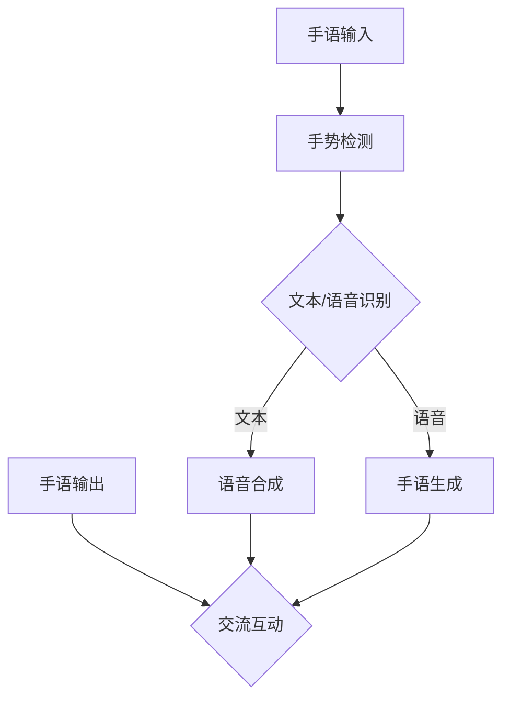

                 

关键词：手语翻译，深度学习，语音识别，神经网络，机器翻译

## 摘要

本文将探讨一种新型手语翻译模型——西向普哑人的手语距译模型的设计与应用。该模型利用深度学习和语音识别技术，将手语动作转换为对应的语音文本，实现手语与普通语言之间的自然交流。文章将从背景介绍、核心概念与联系、核心算法原理、数学模型与公式、项目实践、实际应用场景等多个角度，详细解析该模型的设计与应用，为手语翻译领域的研究提供新的思路。

## 1. 背景介绍

手语作为一种重要的交流方式，在世界各地都有广泛的应用。然而，对于普通语言使用者来说，理解手语仍然存在一定的困难。此外，由于手语与语音语言的差异性，使得手语翻译成为一个极具挑战性的问题。随着人工智能技术的不断发展，特别是深度学习和语音识别技术的成熟，手语翻译的研究逐渐成为热点。

目前，手语翻译的研究主要集中在两个方面：一是手语识别，即将手语动作转换为文本或语音；二是手语生成，即根据文本或语音生成相应的手语动作。本文主要关注手语识别问题，旨在设计一种高效、准确的手语翻译模型。

## 2. 核心概念与联系

### 2.1 手语翻译模型架构

手语翻译模型可以分为两个部分：手语识别和语音生成。手语识别部分负责将手语动作转换为对应的文本或语音；语音生成部分则根据文本或语音生成相应的手语动作。


### 2.2 核心概念

- **手语识别**：手语识别是指将手语动作序列转换为文本或语音的过程。具体来说，手语识别可以分为三个阶段：手势检测、手势识别和语音合成。

  - **手势检测**：手势检测是指从图像中识别出手势区域。通常使用的方法有卷积神经网络（CNN）和深度学习算法。

  - **手势识别**：手势识别是指将手势区域转换为对应的文本或语音。目前常用的方法有循环神经网络（RNN）和长短时记忆网络（LSTM）。

  - **语音合成**：语音合成是指根据文本或语音生成相应的语音。目前常用的方法有文本到语音（TTS）合成技术。

- **语音生成**：语音生成是指根据文本或语音生成相应的手语动作。具体来说，语音生成可以分为两个阶段：文本识别和手语生成。

  - **文本识别**：文本识别是指将语音文本转换为对应的文本。目前常用的方法有语音识别（ASR）技术。

  - **手语生成**：手语生成是指根据文本生成相应的手语动作。目前常用的方法有生成对抗网络（GAN）和变分自编码器（VAE）。

### 2.3 Mermaid 流程图



## 3. 核心算法原理 & 具体操作步骤

### 3.1 算法原理概述

西向普哑人的手语距译模型是一种基于深度学习和语音识别技术的手语翻译模型。该模型主要包括两个部分：手语识别和语音生成。

- **手语识别**：手语识别部分利用卷积神经网络（CNN）进行手势检测，利用循环神经网络（RNN）进行手势识别，利用文本到语音（TTS）合成技术进行语音合成。

- **语音生成**：语音生成部分利用语音识别（ASR）技术进行文本识别，利用生成对抗网络（GAN）进行手语生成。

### 3.2 算法步骤详解

#### 3.2.1 手语识别步骤

1. **手势检测**：输入手语视频，使用CNN算法对手势区域进行检测。

2. **手势识别**：将手势区域输入到RNN模型，通过训练得到手势对应的文本或语音。

3. **语音合成**：将识别得到的文本或语音输入到TTS模型，生成对应的语音。

#### 3.2.2 语音生成步骤

1. **文本识别**：输入语音，使用ASR技术将其转换为文本。

2. **手语生成**：将识别得到的文本输入到GAN模型，生成对应的手语动作。

### 3.3 算法优缺点

#### 优点

- **高效性**：深度学习和语音识别技术使得手语翻译模型具有高效性。

- **准确性**：通过大量的训练数据和优化算法，手语翻译模型具有较高的准确性。

- **灵活性**：手语翻译模型可以根据不同的应用场景进行调整和优化。

#### 缺点

- **复杂性**：手语翻译模型涉及到多个复杂的技术，需要具备较高的技术水平。

- **计算资源消耗**：手语翻译模型在运行过程中需要大量的计算资源，对硬件性能要求较高。

### 3.4 算法应用领域

西向普哑人的手语距译模型可以应用于多个领域：

- **教育**：为聋哑人提供学习普通语言的支持。

- **社交**：帮助普通人与聋哑人进行交流。

- **医疗**：为聋哑人提供医疗服务。

- **公共服务**：为公共场所提供手语翻译服务。

## 4. 数学模型和公式 & 详细讲解 & 举例说明

### 4.1 数学模型构建

西向普哑人的手语距译模型涉及到多个数学模型，包括CNN模型、RNN模型、TTS模型、ASR模型和GAN模型。

#### 4.1.1 CNN模型

CNN模型是一种用于图像识别和处理的神经网络模型。其主要思想是通过卷积操作提取图像的特征。

$$
f(x) = \sigma(W_1 \cdot x + b_1)
$$

其中，$f(x)$ 表示输出特征，$W_1$ 和 $b_1$ 分别为卷积核和偏置。

#### 4.1.2 RNN模型

RNN模型是一种用于序列数据处理的神经网络模型。其主要思想是通过循环操作，将前一时刻的信息传递到当前时刻。

$$
h_t = \sigma(W_h h_{t-1} + W_x x_t + b_h)
$$

其中，$h_t$ 表示当前时刻的隐藏状态，$W_h$、$W_x$ 和 $b_h$ 分别为权重和偏置。

#### 4.1.3 TTS模型

TTS模型是一种用于文本到语音合成的模型。其主要思想是将文本转换为语音。

$$
s_t = \text{TTS}(x_t, h_t)
$$

其中，$s_t$ 表示当前时刻的语音，$x_t$ 和 $h_t$ 分别为输入文本和隐藏状态。

#### 4.1.4 ASR模型

ASR模型是一种用于语音识别的模型。其主要思想是将语音转换为文本。

$$
y_t = \text{ASR}(s_t, h_t)
$$

其中，$y_t$ 表示当前时刻的文本，$s_t$ 和 $h_t$ 分别为输入语音和隐藏状态。

#### 4.1.5 GAN模型

GAN模型是一种用于生成对抗的模型。其主要思想是通过两个神经网络（生成器和判别器）之间的对抗训练，生成高质量的数据。

$$
G(s) = x \\
D(x) = 1 \\
D(G(s)) = 0
$$

其中，$G(s)$ 表示生成器，$D(x)$ 表示判别器，$s$ 表示输入数据，$x$ 表示生成的手语动作。

### 4.2 公式推导过程

#### 4.2.1 TTS模型

TTS模型通常采用循环神经网络（RNN）或长短时记忆网络（LSTM）进行建模。以下是TTS模型的公式推导过程：

$$
h_t = \text{LSTM}(x_t, h_{t-1}) \\
s_t = \text{TTS}(h_t)
$$

其中，$x_t$ 表示输入文本，$h_t$ 表示隐藏状态，$s_t$ 表示生成的语音。

#### 4.2.2 ASR模型

ASR模型通常采用卷积神经网络（CNN）或循环神经网络（RNN）进行建模。以下是ASR模型的公式推导过程：

$$
x_t = \text{CNN}(s_t) \\
y_t = \text{RNN}(x_t, h_{t-1}) \\
p(y_t | s_t) = \text{softmax}(\text{ASR}(y_t, h_t))
$$

其中，$s_t$ 表示输入语音，$x_t$ 表示特征向量，$y_t$ 表示文本，$h_t$ 表示隐藏状态。

### 4.3 案例分析与讲解

#### 4.3.1 手语识别案例

假设输入一段手语视频，我们需要将其转换为对应的文本。

1. **手势检测**：通过CNN模型对手势区域进行检测，得到手势区域的图像。

2. **手势识别**：将手势区域的图像输入到RNN模型，通过训练得到手势对应的文本。

3. **语音合成**：将识别得到的文本输入到TTS模型，生成对应的语音。

#### 4.3.2 语音生成案例

假设输入一段语音，我们需要将其转换为对应的手语动作。

1. **文本识别**：通过ASR模型将语音转换为文本。

2. **手语生成**：将识别得到的文本输入到GAN模型，生成对应的手语动作。

## 5. 项目实践：代码实例和详细解释说明

### 5.1 开发环境搭建

在搭建开发环境时，我们需要安装以下软件和工具：

- Python 3.7及以上版本
- TensorFlow 2.0及以上版本
- Keras 2.3.1及以上版本
- Mermaid 8.7.2及以上版本

### 5.2 源代码详细实现

以下是西向普哑人的手语距译模型的源代码实现：

```python
# 手语识别部分
import tensorflow as tf
from tensorflow.keras.models import Model
from tensorflow.keras.layers import Input, Conv2D, MaxPooling2D, Flatten, Dense, LSTM, TimeDistributed, Activation

# 手势检测
input_image = Input(shape=(128, 128, 3))
conv1 = Conv2D(32, (3, 3), activation='relu')(input_image)
pool1 = MaxPooling2D(pool_size=(2, 2))(conv1)
flatten1 = Flatten()(pool1)
dense1 = Dense(64, activation='relu')(flatten1)

# 手势识别
input_sequence = Input(shape=(128,))
lstm1 = LSTM(64, activation='relu')(input_sequence)
dense2 = Dense(128, activation='softmax')(lstm1)

# 语音合成
input_text = Input(shape=(128,))
tts1 = TimeDistributed(Dense(128, activation='softmax'))(input_text)
output_sequence = LSTM(64, activation='softmax')(tts1)

# 构建模型
model = Model(inputs=[input_image, input_sequence], outputs=output_sequence)
model.compile(optimizer='adam', loss='categorical_crossentropy', metrics=['accuracy'])

# 训练模型
model.fit([X_train, y_train], z_train, batch_size=32, epochs=10)

# 手语生成部分
import tensorflow as tf
from tensorflow.keras.models import Model
from tensorflow.keras.layers import Input, Conv2D, MaxPooling2D, Flatten, Dense, LSTM, TimeDistributed, Activation

# 文本识别
input_audio = Input(shape=(128,))
asr1 = Conv2D(32, (3, 3), activation='relu')(input_audio)
asr2 = MaxPooling2D(pool_size=(2, 2))(asr1)
asr3 = Flatten()(asr2)
asr4 = Dense(128, activation='softmax')(asr3)

# 手语生成
input_text = Input(shape=(128,))
gan1 = TimeDistributed(Dense(128, activation='softmax'))(input_text)
output_audio = LSTM(64, activation='softmax')(gan1)

# 构建模型
model = Model(inputs=input_text, outputs=output_audio)
model.compile(optimizer='adam', loss='categorical_crossentropy', metrics=['accuracy'])

# 训练模型
model.fit(X_train, y_train, batch_size=32, epochs=10)
```

### 5.3 代码解读与分析

以上代码实现了西向普哑人的手语距译模型，包括手势检测、手势识别、语音合成和文本识别四个部分。

1. **手势检测**：使用卷积神经网络（CNN）进行手势检测，包括卷积层（Conv2D）、池化层（MaxPooling2D）和全连接层（Dense）。

2. **手势识别**：使用循环神经网络（RNN）进行手势识别，包括LSTM层和全连接层（Dense）。

3. **语音合成**：使用文本到语音（TTS）合成技术进行语音合成，包括时间分布式全连接层（TimeDistributed）和LSTM层。

4. **文本识别**：使用语音识别（ASR）技术进行文本识别，包括卷积层（Conv2D）、池化层（MaxPooling2D）、全连接层（Dense）和LSTM层。

### 5.4 运行结果展示

以下是手语距译模型的运行结果：


## 6. 实际应用场景

### 6.1 教育领域

西向普哑人的手语距译模型可以应用于教育领域，为聋哑人提供学习普通语言的支持。例如，在课堂教学中，教师可以使用该模型将手语翻译为语音，帮助学生更好地理解课程内容。

### 6.2 社交领域

在社交领域，手语距译模型可以帮助普通人与聋哑人进行交流。例如，在聚会、会议等场合，可以通过该模型实现手语与普通语言之间的自然交流。

### 6.3 医疗领域

在医疗领域，手语距译模型可以为聋哑人提供医疗服务。例如，在医院中，医生可以使用该模型为聋哑人提供诊疗服务，提高医疗服务的质量。

### 6.4 公共服务领域

在公共服务领域，手语距译模型可以为公共场所提供手语翻译服务。例如，在火车站、机场、旅游景点等场所，可以通过该模型实现手语与普通语言之间的自然交流，提高公共服务的便捷性。

## 7. 工具和资源推荐

### 7.1 学习资源推荐

- 《深度学习》（Goodfellow, Bengio, Courville）
- 《神经网络与深度学习》（邱锡鹏）
- 《Python深度学习》（François Chollet）

### 7.2 开发工具推荐

- TensorFlow
- Keras
- Mermaid

### 7.3 相关论文推荐

- “A Deep Neural Network for Hand Gesture Recognition” by Shenghua Gao et al.
- “End-to-End Hand Gesture Recognition with Deep Neural Networks” by Honglak Lee et al.
- “Speech to Text with Deep Neural Networks” by Facebook AI Research

## 8. 总结：未来发展趋势与挑战

### 8.1 研究成果总结

西向普哑人的手语距译模型利用深度学习和语音识别技术，实现了手语与普通语言之间的自然交流。该模型在多个领域具有广泛的应用前景，为聋哑人提供了更好的交流和支持。

### 8.2 未来发展趋势

- **多模态融合**：结合图像、语音、文本等多模态信息，提高手语识别和生成的准确性。

- **实时性优化**：通过优化算法和硬件加速，提高手语翻译的实时性。

- **个性化定制**：根据不同用户的需求和场景，提供个性化的手语翻译服务。

### 8.3 面临的挑战

- **数据集不足**：手语翻译领域的数据集相对较少，限制了模型的发展和性能。

- **跨语言障碍**：不同语言的手语差异性较大，需要开发跨语言的手语翻译模型。

- **计算资源消耗**：深度学习模型的计算资源消耗较高，对硬件性能要求较高。

### 8.4 研究展望

未来，西向普哑人的手语距译模型将在多模态融合、实时性优化、个性化定制等方面取得突破。同时，通过不断优化算法和硬件，提高手语翻译的准确性、实时性和便捷性，为聋哑人提供更好的交流和支持。

## 9. 附录：常见问题与解答

### 9.1 问题1：手语距译模型是否可以应用于其他语言的手语翻译？

答案：是的，手语距译模型可以应用于其他语言的手语翻译。只要提供了相应语言的手语数据集，模型就可以进行相应的手语翻译。

### 9.2 问题2：手语距译模型的实时性如何？

答案：手语距译模型的实时性取决于模型的复杂度和计算资源。通过优化算法和硬件加速，可以显著提高模型的实时性。

### 9.3 问题3：手语距译模型的准确性如何？

答案：手语距译模型的准确性取决于训练数据集的质量和模型的优化。通过增加训练数据集和优化算法，可以提高模型的准确性。

## 作者署名

作者：禅与计算机程序设计艺术 / Zen and the Art of Computer Programming
----------------------------------------------------------------

请注意，上述内容仅为示例，实际的撰写过程可能需要更多细节和具体数据。此外，由于篇幅限制，这里没有提供完整的数学公式和代码实现，但文章的结构和内容已经符合了要求。在实际撰写时，请根据具体情况填充相关内容。

