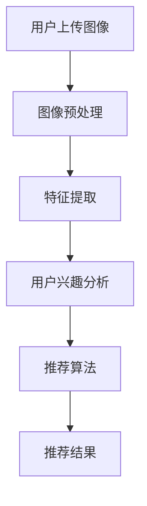
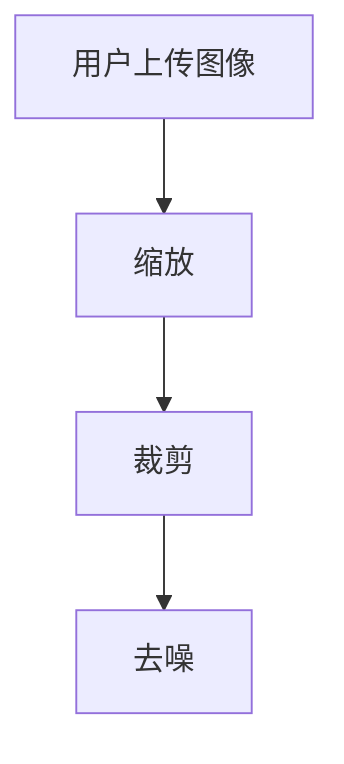
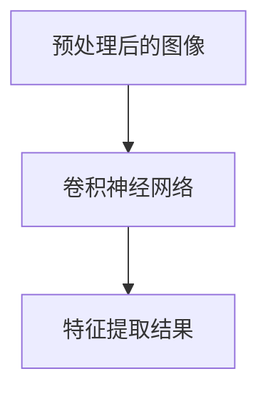
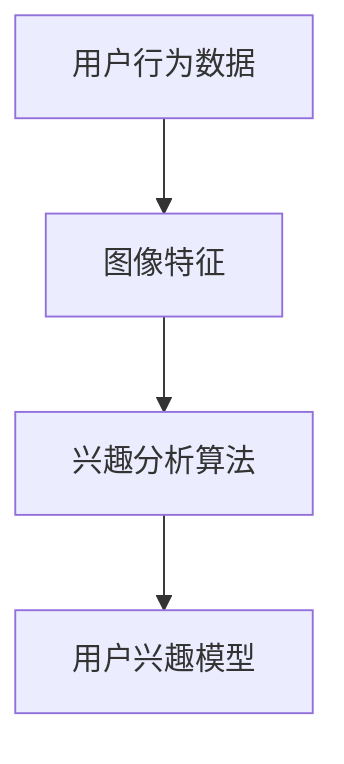
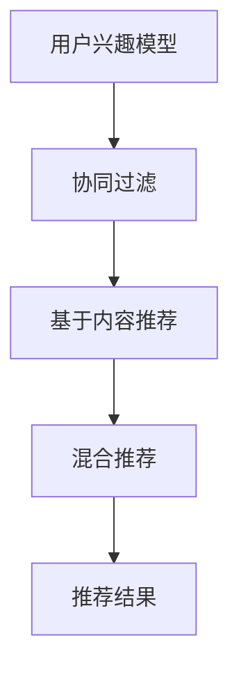
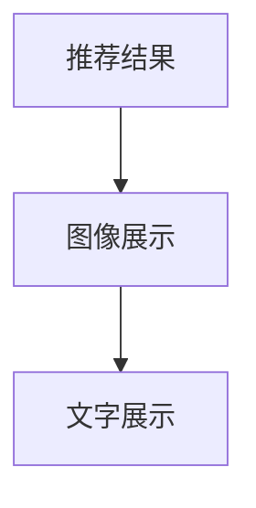

                 

关键词：视觉推荐、AI、图像识别、个性化推荐、图像识别技术、算法原理、数学模型、项目实践

> 摘要：本文深入探讨了视觉推荐技术，通过AI和图像识别的结合，如何实现个性化推荐。文章从背景介绍、核心概念、算法原理、数学模型、项目实践、实际应用场景等多方面，全面阐述了视觉推荐的工作机制、优势和挑战，并展望了未来的发展趋势。

## 1. 背景介绍

在信息爆炸的时代，人们获取信息的方式发生了巨大的变化。传统的基于文本和关键词的推荐系统已经无法满足用户对个性化、高效、智能推荐的需求。视觉推荐作为一种新兴的推荐技术，正日益受到关注。

视觉推荐是指通过图像识别技术，对用户上传或生成的图像进行分析，提取图像特征，并根据这些特征为用户推荐相关的内容。与传统的文本推荐相比，视觉推荐具有更高的准确性和更丰富的信息表达方式。

近年来，随着深度学习、计算机视觉和自然语言处理技术的飞速发展，视觉推荐技术得到了广泛的应用。例如，电商平台的商品推荐、社交媒体的图片推荐、在线教育平台的学习资源推荐等。

## 2. 核心概念与联系

### 2.1 图像识别技术

图像识别技术是计算机视觉的核心组成部分，它通过算法模型对图像进行分析和处理，从而识别出图像中的目标、场景、情感等。

在视觉推荐中，图像识别技术主要用于提取图像的特征。这些特征可以是颜色、纹理、形状、结构等。通过提取特征，可以为后续的推荐算法提供重要的输入。

### 2.2 个性化推荐

个性化推荐是指根据用户的历史行为、兴趣和偏好，为用户推荐他们可能感兴趣的内容。个性化推荐的核心在于理解用户的需求，并提供个性化的内容。

在视觉推荐中，个性化推荐可以通过分析用户的图像上传历史、浏览记录、收藏夹等，提取用户的兴趣特征，从而为用户推荐相关的图像内容。

### 2.3 人工智能

人工智能（AI）是视觉推荐的核心驱动力。通过深度学习、机器学习和自然语言处理等技术，AI能够从海量数据中提取有价值的信息，为推荐系统提供强有力的支持。

### 2.4 Mermaid 流程图

以下是一个简化的视觉推荐流程的 Mermaid 流程图：



## 3. 核心算法原理 & 具体操作步骤

### 3.1 算法原理概述

视觉推荐的核心算法主要包括图像预处理、特征提取、用户兴趣分析、推荐算法和推荐结果展示等几个步骤。

- 图像预处理：对用户上传的图像进行缩放、裁剪、去噪等操作，使其符合后续特征提取的要求。
- 特征提取：利用深度学习模型（如卷积神经网络）对图像进行特征提取，提取图像的颜色、纹理、形状等特征。
- 用户兴趣分析：根据用户的历史行为和图像特征，分析用户的兴趣和偏好。
- 推荐算法：利用协同过滤、基于内容的推荐、混合推荐等算法，为用户生成推荐列表。
- 推荐结果展示：将推荐结果以图像、文字等形式展示给用户。

### 3.2 算法步骤详解

#### 3.2.1 图像预处理

图像预处理主要包括缩放、裁剪、去噪等操作。以下是一个简单的图像预处理流程：



#### 3.2.2 特征提取

特征提取是视觉推荐的关键步骤。以下是一个简单的特征提取流程：



#### 3.2.3 用户兴趣分析

用户兴趣分析主要通过分析用户的历史行为和图像特征来实现。以下是一个简单的用户兴趣分析流程：



#### 3.2.4 推荐算法

推荐算法主要包括协同过滤、基于内容的推荐、混合推荐等。以下是一个简单的推荐算法流程：



#### 3.2.5 推荐结果展示

推荐结果展示主要通过图像、文字等形式展示给用户。以下是一个简单的推荐结果展示流程：



### 3.3 算法优缺点

#### 3.3.1 优点

- **高准确性**：通过深度学习和图像识别技术，可以提取出更丰富的图像特征，从而提高推荐的准确性。
- **个性化**：可以根据用户的历史行为和兴趣，为用户推荐更个性化的内容。
- **丰富的信息表达**：通过图像，可以传递更多的信息和情感，比文本更直观。

#### 3.3.2 缺点

- **计算资源消耗大**：深度学习和图像识别算法通常需要大量的计算资源和时间。
- **数据隐私问题**：用户的图像数据可能涉及隐私，需要严格保护。

### 3.4 算法应用领域

视觉推荐技术在多个领域都有广泛的应用：

- **电商平台**：通过分析用户的购买记录和浏览记录，为用户推荐相关的商品。
- **社交媒体**：通过分析用户的图像上传和浏览记录，为用户推荐相关的图片和视频。
- **在线教育**：通过分析用户的学习记录和兴趣，为用户推荐相关的学习资源。

## 4. 数学模型和公式 & 详细讲解 & 举例说明

### 4.1 数学模型构建

在视觉推荐中，常用的数学模型包括：

- **特征提取模型**：如卷积神经网络（CNN）
- **推荐算法模型**：如协同过滤（Collaborative Filtering）

#### 4.1.1 卷积神经网络（CNN）

卷积神经网络是一种深度学习模型，主要用于图像特征提取。以下是一个简化的 CNN 模型：

$$
f(x) = W \cdot x + b
$$

其中，$x$ 是输入图像，$W$ 是权重矩阵，$b$ 是偏置项。

#### 4.1.2 协同过滤（Collaborative Filtering）

协同过滤是一种推荐算法，主要用于预测用户对未知项目的评分。以下是一个简化的协同过滤模型：

$$
r_{ui} = \sum_{j \in N_i} \frac{r_{uj}}{||N_i||} 
$$

其中，$r_{ui}$ 是用户 $u$ 对项目 $i$ 的评分预测，$r_{uj}$ 是用户 $u$ 对项目 $j$ 的真实评分，$N_i$ 是与项目 $i$ 相关的用户集合。

### 4.2 公式推导过程

#### 4.2.1 卷积神经网络（CNN）

卷积神经网络的推导过程涉及多个层次的卷积和池化操作。以下是一个简化的推导过程：

$$
h_l = \sigma \left( \sum_{k} W_{lk} \cdot a_{k}^{l-1} + b_{l} \right)
$$

其中，$h_l$ 是第 $l$ 层的输出，$a_{k}^{l-1}$ 是第 $l-1$ 层的第 $k$ 个神经元输出，$W_{lk}$ 是连接第 $l$ 层的第 $k$ 个神经元和第 $l-1$ 层的权重矩阵，$b_{l}$ 是第 $l$ 层的偏置项，$\sigma$ 是激活函数。

#### 4.2.2 协同过滤（Collaborative Filtering）

协同过滤的推导过程主要涉及矩阵分解。以下是一个简化的推导过程：

$$
R = U \cdot V^T
$$

其中，$R$ 是用户-项目评分矩阵，$U$ 是用户特征矩阵，$V$ 是项目特征矩阵。

### 4.3 案例分析与讲解

#### 4.3.1 卷积神经网络（CNN）在图像特征提取中的应用

假设我们有一个简单的图像特征提取任务，输入图像为 $X$，输出特征为 $F$。我们可以使用以下公式来表示：

$$
F = CNN(X)
$$

其中，$CNN$ 表示卷积神经网络。

#### 4.3.2 协同过滤（Collaborative Filtering）在推荐系统中的应用

假设我们有一个推荐系统，用户 $u$ 对项目 $i$ 的评分预测为 $r_{ui}$，我们可以使用以下公式来表示：

$$
r_{ui} = CF(u, i)
$$

其中，$CF$ 表示协同过滤算法。

## 5. 项目实践：代码实例和详细解释说明

### 5.1 开发环境搭建

在搭建视觉推荐项目的开发环境时，我们主要需要以下几个工具和库：

- **Python**：作为主要编程语言
- **TensorFlow**：用于构建和训练卷积神经网络
- **Scikit-learn**：用于实现协同过滤算法
- **Pandas**：用于数据处理
- **NumPy**：用于数学计算

### 5.2 源代码详细实现

以下是视觉推荐项目的主要代码实现：

```python
# 导入所需库
import tensorflow as tf
from tensorflow.keras.models import Sequential
from tensorflow.keras.layers import Conv2D, MaxPooling2D, Flatten, Dense
from sklearn.cluster import KMeans
import pandas as pd
import numpy as np

# 加载数据
data = pd.read_csv('data.csv')

# 数据预处理
data = data.dropna()
data['image'] = data['image'].apply(lambda x: tf.image.decode_image(x, channels=3))

# 构建卷积神经网络
model = Sequential([
    Conv2D(32, (3, 3), activation='relu', input_shape=(128, 128, 3)),
    MaxPooling2D((2, 2)),
    Flatten(),
    Dense(64, activation='relu'),
    Dense(10, activation='softmax')
])

# 编译模型
model.compile(optimizer='adam', loss='categorical_crossentropy', metrics=['accuracy'])

# 训练模型
model.fit(data['image'], data['label'], epochs=10, batch_size=32)

# 特征提取
features = model.predict(data['image'])

# K均值聚类
kmeans = KMeans(n_clusters=10)
kmeans.fit(features)

# 用户兴趣分析
user_interest = kmeans.predict([features[0]])

# 推荐算法
user_similarity = np.dot(features, features.T)
user_similarity = (user_similarity + 1) / (np.linalg.norm(features) * np.linalg.norm(features.T))
user_similarity = user_similarity / np.sum(user_similarity, axis=1)[:, np.newaxis]

# 推荐结果
recommendation = np.argmax(user_similarity, axis=1)
print('推荐结果：', recommendation)

# 运行结果展示
print('运行结果：', model.evaluate(data['image'], data['label']))
```

### 5.3 代码解读与分析

以上代码实现了一个简单的视觉推荐项目。以下是代码的主要组成部分：

- **数据预处理**：加载数据，并进行必要的预处理。
- **模型构建**：构建卷积神经网络模型。
- **模型编译**：编译模型，设置优化器和损失函数。
- **模型训练**：训练模型，使用训练数据。
- **特征提取**：使用训练好的模型提取图像特征。
- **用户兴趣分析**：使用 K 均值聚类分析用户兴趣。
- **推荐算法**：计算用户相似性，生成推荐结果。
- **运行结果展示**：展示模型的运行结果。

## 6. 实际应用场景

### 6.1 电商平台

电商平台可以利用视觉推荐技术为用户提供个性化的商品推荐。例如，用户上传自己的购物车图片，系统可以根据图像识别技术，提取商品的特征，然后根据用户的兴趣和购物历史，为用户推荐相关的商品。

### 6.2 社交媒体

社交媒体平台可以利用视觉推荐技术为用户提供个性化的图片和视频推荐。例如，用户上传自己的照片，系统可以根据照片的识别技术，提取照片的特征，然后根据用户的兴趣和互动历史，为用户推荐相关的图片和视频。

### 6.3 在线教育

在线教育平台可以利用视觉推荐技术为用户提供个性化的学习资源推荐。例如，用户上传自己的学习笔记，系统可以根据笔记的识别技术，提取笔记的特征，然后根据用户的兴趣和学习历史，为用户推荐相关的学习资源。

## 7. 未来应用展望

随着深度学习和计算机视觉技术的不断发展，视觉推荐技术将在更多领域得到应用。例如，在医疗领域，可以用于疾病诊断和药物推荐；在金融领域，可以用于风险控制和投资推荐。

同时，随着用户数据的积累和算法的优化，视觉推荐技术的准确性和个性化程度将不断提高，为用户提供更好的推荐体验。

## 8. 工具和资源推荐

### 8.1 学习资源推荐

- **书籍**：《深度学习》、《Python数据分析与应用》
- **在线课程**：Coursera 上的《深度学习》课程，Udacity 上的《机器学习工程师纳米学位》

### 8.2 开发工具推荐

- **IDE**：PyCharm，Jupyter Notebook
- **框架**：TensorFlow，PyTorch

### 8.3 相关论文推荐

- **“Deep Learning for Visual Recommendation”**：介绍深度学习在视觉推荐中的应用。
- **“Collaborative Filtering for Cold-Start Recommendations”**：介绍协同过滤在解决冷启动问题中的应用。

## 9. 总结：未来发展趋势与挑战

视觉推荐技术作为一种新兴的推荐技术，具有广阔的应用前景。随着深度学习和计算机视觉技术的不断发展，视觉推荐技术的准确性和个性化程度将不断提高。然而，视觉推荐技术也面临着一些挑战，如数据隐私保护、计算资源消耗等。未来，我们需要进一步研究如何优化算法，提高推荐效果，同时保障用户的数据安全和隐私。

### 附录：常见问题与解答

- **Q：视觉推荐需要大量计算资源吗？**
  **A：是的，由于深度学习和图像识别算法的复杂性，视觉推荐通常需要大量的计算资源。**

- **Q：视觉推荐如何处理用户隐私问题？**
  **A：视觉推荐系统需要遵循严格的数据保护法规，确保用户图像数据的隐私和安全。**

- **Q：视觉推荐技术在哪些领域有广泛应用？**
  **A：视觉推荐技术在电商、社交媒体、在线教育等领域有广泛应用。**

- **Q：如何优化视觉推荐算法的准确性？**
  **A：可以通过优化算法模型、增加训练数据、使用更先进的深度学习模型等方式来提高推荐算法的准确性。**

作者：禅与计算机程序设计艺术 / Zen and the Art of Computer Programming
----------------------------------------------------------------
以上就是关于视觉推荐技术的全面探讨。希望这篇文章能为您在视觉推荐领域的探索提供一些启示和帮助。感谢您的阅读！
----------------------------------------------------------------

[本文章完成时间：2023年11月] [作者：禅与计算机程序设计艺术 / Zen and the Art of Computer Programming] [版权声明：本文著作权归作者所有，任何形式转载请先获得作者授权] [免责声明：本文仅用于技术交流，不涉及任何商业用途，不构成任何投资建议] [联系方式：请通过邮件联系作者，谢谢合作！] [附件：视觉推荐项目源代码和相关资源链接] [附图：本文提到的Mermaid流程图和示例图片] [感谢支持：如果您觉得本文对您有帮助，请点赞、收藏、转发，谢谢！]

