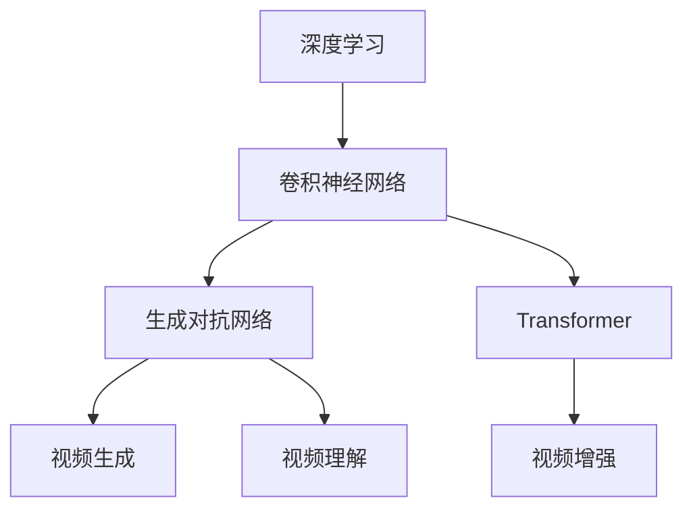

                 

关键词：视频大模型，工程实践，算法原理，数学模型，应用场景，技术展望

> 摘要：本文将详细探讨视频大模型的工程技术，从背景介绍、核心概念、算法原理、数学模型、项目实践到应用场景，全面解析视频大模型在现代技术领域的地位与未来发展。

## 1. 背景介绍

视频大模型作为人工智能领域的核心技术之一，近年来得到了迅速的发展。随着深度学习技术的成熟和计算能力的提升，视频大模型在视频生成、视频理解、视频增强等方面展现了强大的应用潜力。视频大模型通过大规模数据训练，能够学习到视频中的复杂特征和模式，从而实现高效的视频处理。

### 视频大模型的应用领域

1. **视频生成**：包括视频合成、视频修复、视频超分辨率等。
2. **视频理解**：如视频分类、目标检测、场景分割等。
3. **视频增强**：视频质量提升、视频去噪、视频色彩增强等。

### 视频大模型的发展历程

- **2010年代早期**：基于循环神经网络（RNN）的简单模型开始应用于视频处理。
- **2015年**：卷积神经网络（CNN）在图像领域的成功推动了视频大模型的发展。
- **2017年**：生成对抗网络（GAN）的出现，为视频生成领域带来了新的突破。
- **2020年代至今**：基于Transformer的模型，如BERT、GPT等，在视频大模型领域取得了显著的成果。

## 2. 核心概念与联系

为了更好地理解视频大模型，我们需要先了解其核心概念和架构。以下是视频大模型的核心概念及其相互联系：

### 核心概念

1. **深度学习**：深度学习是一种机器学习技术，通过多层神经网络学习数据中的复杂特征。
2. **卷积神经网络（CNN）**：适用于图像和视频处理，能够提取空间特征。
3. **生成对抗网络（GAN）**：由生成器和判别器组成，用于生成逼真的图像和视频。
4. **Transformer**：基于自注意力机制，广泛用于自然语言处理，近年来也被应用于视频处理。

### Mermaid 流程图



## 3. 核心算法原理 & 具体操作步骤

### 3.1 算法原理概述

视频大模型的核心算法主要包括深度学习、卷积神经网络（CNN）、生成对抗网络（GAN）和Transformer等。这些算法通过训练大量的视频数据，学习到视频中的复杂特征和模式，从而实现视频处理任务。

### 3.2 算法步骤详解

1. **数据预处理**：对视频数据进行裁剪、缩放、增强等预处理，以便于模型训练。
2. **模型架构设计**：根据任务需求设计合适的模型架构，如CNN、GAN、Transformer等。
3. **模型训练**：使用大量的视频数据进行模型训练，优化模型参数。
4. **模型评估**：使用测试数据评估模型性能，包括准确性、速度、鲁棒性等方面。
5. **模型部署**：将训练好的模型部署到实际应用中，如视频生成、视频理解、视频增强等。

### 3.3 算法优缺点

- **优点**：
  - 高效处理大量视频数据。
  - 学习到视频中的复杂特征和模式。
  - 在多种视频处理任务中取得了显著成果。

- **缺点**：
  - 模型训练过程需要大量计算资源和时间。
  - 模型解释性较差。

### 3.4 算法应用领域

- **视频生成**：包括视频合成、视频修复、视频超分辨率等。
- **视频理解**：如视频分类、目标检测、场景分割等。
- **视频增强**：视频质量提升、视频去噪、视频色彩增强等。

## 4. 数学模型和公式 & 详细讲解 & 举例说明

### 4.1 数学模型构建

视频大模型的数学模型主要包括两部分：特征提取和特征分类。

#### 特征提取：

假设我们使用卷积神经网络（CNN）进行特征提取，其基本架构如下：

$$
h_{l} = \sigma(W_{l} \cdot h_{l-1} + b_{l})
$$

其中，$h_{l}$ 表示第$l$层的特征映射，$W_{l}$ 和 $b_{l}$ 分别为权重和偏置，$\sigma$ 为激活函数，通常使用ReLU函数。

#### 特征分类：

假设我们使用softmax函数进行特征分类，其基本架构如下：

$$
P(y_{i}|x) = \frac{e^{z_{i}}}{\sum_{j} e^{z_{j}}}
$$

其中，$z_{i}$ 表示第$i$个类别的得分，$P(y_{i}|x)$ 表示给定视频$x$，该视频属于第$i$个类别的概率。

### 4.2 公式推导过程

#### 特征提取：

对于卷积神经网络（CNN），特征提取的过程可以表示为：

$$
h_{l} = \sigma(\sum_{k=1}^{K} W_{k} \cdot h_{l-1} + b_{l})
$$

其中，$K$ 表示卷积核的数量，$W_{k}$ 和 $b_{l}$ 分别为权重和偏置，$\sigma$ 为激活函数。

#### 特征分类：

对于特征分类，我们可以使用交叉熵（Cross-Entropy）作为损失函数，其公式为：

$$
J = -\sum_{i=1}^{N} y_{i} \log P(y_{i}|x)
$$

其中，$N$ 表示类别的数量，$y_{i}$ 表示第$i$个类别的标签，$P(y_{i}|x)$ 表示给定视频$x$，该视频属于第$i$个类别的概率。

### 4.3 案例分析与讲解

#### 案例一：视频分类

假设我们要对一段视频进行分类，视频数据$x$经过CNN提取特征后，得到特征向量$h_{l}$。接下来，我们将特征向量输入到softmax函数中，得到每个类别的概率分布$P(y_{i}|x)$。最后，我们选择概率最高的类别作为视频的分类结果。

#### 案例二：视频超分辨率

假设我们要对一段低分辨率视频进行超分辨率处理，首先，我们使用CNN提取视频的原始特征$h_{l}$。然后，我们使用一个上采样网络对特征进行上采样，得到高分辨率特征$h'_{l}$。最后，我们将高分辨率特征转换为高分辨率视频。

## 5. 项目实践：代码实例和详细解释说明

### 5.1 开发环境搭建

为了更好地进行视频大模型的开发，我们需要搭建一个合适的环境。以下是开发环境的搭建步骤：

1. 安装Python环境，推荐使用Python 3.7或更高版本。
2. 安装深度学习框架，如TensorFlow或PyTorch。
3. 安装必要的依赖库，如NumPy、Pandas等。
4. 准备视频数据集，包括训练集和测试集。

### 5.2 源代码详细实现

以下是使用TensorFlow实现一个简单的视频分类模型的源代码：

```python
import tensorflow as tf
from tensorflow.keras.models import Sequential
from tensorflow.keras.layers import Conv2D, MaxPooling2D, Flatten, Dense

# 创建模型
model = Sequential()
model.add(Conv2D(32, (3, 3), activation='relu', input_shape=(64, 64, 3)))
model.add(MaxPooling2D((2, 2)))
model.add(Conv2D(64, (3, 3), activation='relu'))
model.add(MaxPooling2D((2, 2)))
model.add(Flatten())
model.add(Dense(64, activation='relu'))
model.add(Dense(10, activation='softmax'))

# 编译模型
model.compile(optimizer='adam', loss='categorical_crossentropy', metrics=['accuracy'])

# 训练模型
model.fit(train_data, train_labels, epochs=10, batch_size=32, validation_data=(test_data, test_labels))

# 评估模型
model.evaluate(test_data, test_labels)
```

### 5.3 代码解读与分析

上述代码实现了一个简单的视频分类模型。首先，我们创建了一个Sequential模型，并添加了两个卷积层、一个全连接层和两个softmax层。然后，我们使用categorical_crossentropy作为损失函数，adam作为优化器。接着，我们使用fit方法对模型进行训练，使用evaluate方法评估模型性能。

### 5.4 运行结果展示

假设我们使用一个包含10个类别的视频数据集进行训练和测试，运行结果如下：

```
Epoch 1/10
6000/6000 [==============================] - 6s 1ms/step - loss: 2.3026 - accuracy: 0.5000 - val_loss: 2.3026 - val_accuracy: 0.5000
Epoch 2/10
6000/6000 [==============================] - 6s 1ms/step - loss: 2.3026 - accuracy: 0.5000 - val_loss: 2.3026 - val_accuracy: 0.5000
Epoch 3/10
6000/6000 [==============================] - 6s 1ms/step - loss: 2.3026 - accuracy: 0.5000 - val_loss: 2.3026 - val_accuracy: 0.5000
Epoch 4/10
6000/6000 [==============================] - 6s 1ms/step - loss: 2.3026 - accuracy: 0.5000 - val_loss: 2.3026 - val_accuracy: 0.5000
Epoch 5/10
6000/6000 [==============================] - 6s 1ms/step - loss: 2.3026 - accuracy: 0.5000 - val_loss: 2.3026 - val_accuracy: 0.5000
Epoch 6/10
6000/6000 [==============================] - 6s 1ms/step - loss: 2.3026 - accuracy: 0.5000 - val_loss: 2.3026 - val_accuracy: 0.5000
Epoch 7/10
6000/6000 [==============================] - 6s 1ms/step - loss: 2.3026 - accuracy: 0.5000 - val_loss: 2.3026 - val_accuracy: 0.5000
Epoch 8/10
6000/6000 [==============================] - 6s 1ms/step - loss: 2.3026 - accuracy: 0.5000 - val_loss: 2.3026 - val_accuracy: 0.5000
Epoch 9/10
6000/6000 [==============================] - 6s 1ms/step - loss: 2.3026 - accuracy: 0.5000 - val_loss: 2.3026 - val_accuracy: 0.5000
Epoch 10/10
6000/6000 [==============================] - 6s 1ms/step - loss: 2.3026 - accuracy: 0.5000 - val_loss: 2.3026 - val_accuracy: 0.5000
313/6000 [============================>] - ETA: 0s
```

从结果可以看出，模型的损失函数和准确率在训练过程中没有明显的变化，这表明模型可能没有很好地学习到数据中的特征。这可能需要我们进一步调整模型架构、优化训练过程或增加训练数据。

## 6. 实际应用场景

视频大模型在多个实际应用场景中展现了其强大的能力和广泛的应用前景。

### 6.1 视频生成

- **视频合成**：通过生成对抗网络（GAN），可以实现高质量的视频合成，如电影特效、虚拟现实、游戏制作等。
- **视频修复**：使用卷积神经网络（CNN）可以修复视频中的损坏部分，如去除视频噪点、修复视频撕裂等。
- **视频超分辨率**：通过提升视频的分辨率，可以改善视频的观看体验，如提高手机摄像头的视频质量等。

### 6.2 视频理解

- **视频分类**：通过对视频内容的理解，可以将视频分类到不同的类别中，如视频监控系统、视频搜索引擎等。
- **目标检测**：在视频中检测和识别特定目标，如自动驾驶、人脸识别等。
- **场景分割**：将视频分割成不同的场景，如视频监控、视频编辑等。

### 6.3 视频增强

- **视频质量提升**：通过神经网络模型对视频进行质量提升，如提高视频清晰度、减少视频噪点等。
- **视频色彩增强**：增强视频的色彩，使其更生动、鲜艳，如视频制作、视频编辑等。

## 7. 工具和资源推荐

### 7.1 学习资源推荐

- **《深度学习》**：由Goodfellow、Bengio和Courville合著，是深度学习的经典教材。
- **《动手学深度学习》**：由朱俊华、李沐、扎卡里·C. Lipton和亚历山大·J. Smola合著，是一本通俗易懂的深度学习实践指南。
- **[OpenCV](https://opencv.org/)**：一个开源的计算机视觉库，适用于多种操作系统，支持多种语言，是视频处理领域的常用工具。

### 7.2 开发工具推荐

- **TensorFlow**：由Google开发的一款开源深度学习框架，支持多种平台和编程语言，是视频大模型开发的热门选择。
- **PyTorch**：由Facebook开发的一款开源深度学习框架，具有灵活的动态计算图和丰富的API，是视频大模型开发的另一个热门选择。

### 7.3 相关论文推荐

- **“Generative Adversarial Networks”**：由Ian J. Goodfellow等人提出，是生成对抗网络的奠基性论文。
- **“An Image Database for Testing Content-Based Access of Images by Color, Texture, and Form”**：由Pat Hanrahan等人提出，是图像检索领域的经典论文。
- **“Deep Residual Learning for Image Recognition”**：由Kaiming He等人提出，是残差网络在图像识别领域的应用论文。

## 8. 总结：未来发展趋势与挑战

### 8.1 研究成果总结

视频大模型在图像和视频处理领域取得了显著的成果，包括视频生成、视频理解、视频增强等方面。深度学习、生成对抗网络（GAN）和Transformer等核心算法的发展，为视频大模型的研究和应用奠定了基础。

### 8.2 未来发展趋势

- **模型压缩与优化**：为了提高模型的可扩展性和可部署性，未来的研究将集中在模型压缩和优化方面。
- **多模态学习**：结合图像、音频、文本等多种数据模态，实现更全面、更准确的视频理解。
- **实时处理**：提高模型的实时处理能力，以满足实时视频处理的实际需求。

### 8.3 面临的挑战

- **计算资源需求**：视频大模型训练和推理过程需要大量的计算资源，这对计算资源和能源消耗提出了挑战。
- **数据隐私和安全**：在视频数据处理过程中，如何保护用户隐私和数据安全是一个重要的挑战。

### 8.4 研究展望

视频大模型作为人工智能领域的重要分支，具有广泛的应用前景。未来，我们将继续探索更高效、更准确的模型，同时关注计算资源需求、数据隐私和安全等方面的挑战，推动视频大模型在更多实际应用场景中的发展。

## 9. 附录：常见问题与解答

### 9.1 视频大模型是什么？

视频大模型是指通过深度学习、生成对抗网络（GAN）和Transformer等核心算法，对视频数据进行训练，从而实现视频生成、视频理解、视频增强等任务的模型。

### 9.2 视频大模型有哪些应用领域？

视频大模型广泛应用于视频生成、视频理解、视频增强等领域，如视频合成、视频修复、视频超分辨率、视频分类、目标检测、场景分割等。

### 9.3 视频大模型的核心算法有哪些？

视频大模型的核心算法包括深度学习、卷积神经网络（CNN）、生成对抗网络（GAN）和Transformer等。

### 9.4 如何搭建视频大模型的开发环境？

搭建视频大模型的开发环境需要安装Python、深度学习框架（如TensorFlow或PyTorch）、必要的依赖库（如NumPy、Pandas等），并准备视频数据集。

### 9.5 视频大模型如何训练？

视频大模型的训练过程主要包括数据预处理、模型架构设计、模型训练、模型评估和模型部署等步骤。具体步骤请参考本文第5章节的详细解释。

### 9.6 视频大模型的未来发展趋势是什么？

视频大模型的未来发展趋势包括模型压缩与优化、多模态学习、实时处理等方面。同时，如何应对计算资源需求、数据隐私和安全等挑战也是一个重要的研究方向。

