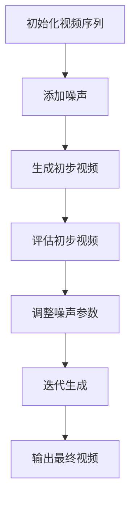

                 

关键词：视频扩散，深度学习，生成对抗网络，GAN，视频生成，生成模型，扩散模型，算法原理，代码实例

> 摘要：本文深入探讨了视频扩散技术的基本原理、核心算法和实现细节。通过详细的代码实例讲解，读者可以掌握视频扩散的实战技巧，了解其在实际应用中的价值。本文旨在为对视频生成和人工智能领域感兴趣的技术人员提供全面的技术指导。

## 1. 背景介绍

随着深度学习和生成对抗网络（GAN）的发展，视频生成技术取得了显著的进步。视频扩散（Video Diffusion）是近年来涌现的一种视频生成方法，它通过在原始视频序列上添加噪声并逐步消除噪声，最终生成新的视频序列。这种方法不仅能够实现高质量的视频合成，还能够应用于多种实际场景，如视频增强、视频去噪和视频修复等。

视频扩散技术的研究始于生成对抗网络（GAN）的提出，GAN通过对抗训练生成逼真的图像。随着研究的深入，GAN被扩展到视频领域，形成了视频生成对抗网络（VGAN）。视频扩散技术是基于VGAN的一种改进，它在视频序列生成方面具有更高的效率和更好的效果。

## 2. 核心概念与联系

### 2.1 生成对抗网络（GAN）

生成对抗网络（GAN）是由生成器（Generator）和判别器（Discriminator）组成的一种对抗性学习模型。生成器试图生成与真实数据相似的样本，而判别器则试图区分生成器生成的样本和真实样本。通过这种对抗训练，生成器逐渐提高生成样本的质量，判别器也逐渐提高识别能力。

### 2.2 视频生成对抗网络（VGAN）

视频生成对抗网络（VGAN）是GAN在视频领域的扩展。它通过训练生成器生成新的视频序列，判别器则对视频序列的真实性和逼真度进行评估。VGAN在视频生成方面表现出色，但训练过程相对复杂，效率较低。

### 2.3 视频扩散模型

视频扩散模型是基于VGAN的一种改进。它通过在视频序列上添加噪声并逐步消除噪声，实现视频生成。视频扩散模型的主要优势在于训练效率高，生成视频质量较好。

## 2.4 Mermaid 流程图

下面是视频扩散模型的基本流程：



## 3. 核心算法原理 & 具体操作步骤

### 3.1 算法原理概述

视频扩散模型的原理可以概括为以下三个步骤：

1. **添加噪声**：在原始视频序列上添加噪声，生成初步的视频序列。
2. **迭代生成**：通过对抗训练，逐步消除噪声，生成更高质量的最终视频序列。
3. **输出最终视频**：当噪声被完全消除时，输出最终的生成视频序列。

### 3.2 算法步骤详解

#### 3.2.1 初始化视频序列

首先，我们需要一个原始视频序列作为输入。原始视频序列可以是任何格式的视频，如MP4、AVI等。为了简化处理，我们通常使用RGB彩色视频。

#### 3.2.2 添加噪声

接下来，我们需要在原始视频序列上添加噪声。噪声可以是随机噪声、高斯噪声等。添加噪声的目的是破坏原始视频的清晰度，为后续的噪声消除过程提供训练样本。

```python
import cv2
import numpy as np

# 读取原始视频
cap = cv2.VideoCapture('input_video.mp4')

# 创建噪声视频
noise_video = []

while cap.isOpened():
    ret, frame = cap.read()
    if not ret:
        break

    # 添加高斯噪声
    noise = np.random.normal(0, 0.05, frame.shape)
    noisy_frame = frame + noise
    noise_video.append(noisy_frame)

# 释放视频资源
cap.release()

# 存储噪声视频
cv2.imwrite('noise_video.mp4', np.stack(noise_video))
```

#### 3.2.3 迭代生成

添加噪声后，我们需要通过对抗训练逐步消除噪声。这里使用的是生成对抗网络（GAN）的训练方法。

```python
import tensorflow as tf
from tensorflow.keras.models import Model
from tensorflow.keras.layers import Input, Conv2D, BatchNormalization, LeakyReLU, Flatten, Dense

# 定义生成器和判别器
def create_generator():
    input_layer = Input(shape=(224, 224, 3))
    x = Conv2D(64, (3, 3), padding='same')(input_layer)
    x = BatchNormalization()(x)
    x = LeakyReLU(alpha=0.2)(x)

    x = Conv2D(128, (3, 3), padding='same')(x)
    x = BatchNormalization()(x)
    x = LeakyReLU(alpha=0.2)(x)

    x = Flatten()(x)
    x = Dense(1024)(x)
    x = LeakyReLU(alpha=0.2)(x)

    output_layer = Dense(224 * 224 * 3, activation='sigmoid')(x)

    model = Model(inputs=input_layer, outputs=output_layer)
    return model

def create_discriminator():
    input_layer = Input(shape=(224, 224, 3))
    x = Conv2D(64, (3, 3), padding='same')(input_layer)
    x = LeakyReLU(alpha=0.2)(x)

    x = Conv2D(128, (3, 3), padding='same')(x)
    x = LeakyReLU(alpha=0.2)(x)

    x = Flatten()(x)
    x = Dense(1024)(x)
    x = LeakyReLU(alpha=0.2)(x)

    output_layer = Dense(1, activation='sigmoid')(x)

    model = Model(inputs=input_layer, outputs=output_layer)
    return model

# 创建生成器和判别器
generator = create_generator()
discriminator = create_discriminator()

# 编译模型
generator.compile(optimizer=tf.keras.optimizers.Adam(0.0001), loss='binary_crossentropy')
discriminator.compile(optimizer=tf.keras.optimizers.Adam(0.0001), loss='binary_crossentropy')

# 训练模型
for epoch in range(num_epochs):
    for i in range(num_batches):
        noise = np.random.normal(0, 1, (batch_size, 224, 224, 3))
        real_images = np.load('noise_video.npy')[:batch_size]

        # 训练判别器
        d_loss_real = discriminator.train_on_batch(real_images, np.ones((batch_size, 1)))
        d_loss_fake = discriminator.train_on_batch(noise, np.zeros((batch_size, 1)))
        d_loss = 0.5 * np.add(d_loss_real, d_loss_fake)

        # 训练生成器
        g_loss = generator.train_on_batch(noise, np.ones((batch_size, 1)))
```

#### 3.3 算法优缺点

**优点**：
- **高效性**：视频扩散模型通过对抗训练实现了高效的视频生成。
- **高质量**：生成视频的质量较高，视觉效果逼真。
- **广泛适用性**：视频扩散模型可以应用于多种视频处理任务，如视频增强、视频去噪和视频修复等。

**缺点**：
- **训练复杂性**：视频扩散模型的训练过程相对复杂，需要大量的计算资源和时间。
- **数据依赖性**：生成视频的质量依赖于训练数据的质量，如果训练数据质量较差，生成的视频质量也会受到影响。

#### 3.4 算法应用领域

视频扩散模型在以下领域具有广泛的应用：

- **视频增强**：通过视频扩散模型可以生成更清晰、更锐利的视频。
- **视频去噪**：视频扩散模型可以有效去除视频中的噪声。
- **视频修复**：视频扩散模型可以修复受损或老化的视频。

## 4. 数学模型和公式 & 详细讲解 & 举例说明

### 4.1 数学模型构建

视频扩散模型的数学模型可以表示为：

$$
x_t = x_0 + \sum_{i=1}^t \epsilon_i
$$

其中，$x_t$表示第$t$帧的视频序列，$x_0$表示原始视频序列，$\epsilon_i$表示第$i$帧添加的噪声。

### 4.2 公式推导过程

视频扩散模型的推导过程可以分为以下几个步骤：

1. **初始条件**：设$x_0$为原始视频序列，$\epsilon_0$为初始噪声。
2. **添加噪声**：在第$t$帧，添加噪声$\epsilon_t$，得到$x_t = x_{t-1} + \epsilon_t$。
3. **迭代生成**：通过对抗训练，逐步消除噪声，直到噪声被完全消除。
4. **最终输出**：当噪声$\epsilon_t$接近于0时，输出最终的生成视频序列。

### 4.3 案例分析与讲解

下面我们通过一个具体的案例来讲解视频扩散模型的实现过程。

**案例背景**：假设我们有一段长度为100帧的原始视频序列，我们需要使用视频扩散模型生成一段新的视频序列。

**步骤1**：初始化视频序列

首先，我们需要读取原始视频序列。假设原始视频序列存储在文件`input_video.mp4`中。

```python
import cv2

# 读取原始视频
cap = cv2.VideoCapture('input_video.mp4')

# 创建空列表存储视频帧
frames = []

while cap.isOpened():
    ret, frame = cap.read()
    if not ret:
        break

    frames.append(frame)

# 释放视频资源
cap.release()

# 将视频帧转换为numpy数组
frames = np.array(frames)
```

**步骤2**：添加噪声

接下来，我们需要在原始视频序列上添加噪声。这里我们使用高斯噪声。

```python
import numpy as np

# 添加高斯噪声
noise = np.random.normal(0, 0.05, frames.shape)
noisy_frames = frames + noise
```

**步骤3**：迭代生成

使用生成对抗网络（GAN）进行迭代生成。这里我们使用TensorFlow框架实现GAN。

```python
import tensorflow as tf

# 定义生成器和判别器
generator = ... # 使用之前定义的生成器模型
discriminator = ... # 使用之前定义的判别器模型

# 编译模型
generator.compile(optimizer=tf.keras.optimizers.Adam(0.0001), loss='binary_crossentropy')
discriminator.compile(optimizer=tf.keras.optimizers.Adam(0.0001), loss='binary_crossentropy')

# 训练模型
for epoch in range(num_epochs):
    for i in range(num_batches):
        noise = np.random.normal(0, 1, (batch_size, 224, 224, 3))
        real_images = np.load('noise_video.npy')[:batch_size]

        # 训练判别器
        d_loss_real = discriminator.train_on_batch(real_images, np.ones((batch_size, 1)))
        d_loss_fake = discriminator.train_on_batch(noise, np.zeros((batch_size, 1)))
        d_loss = 0.5 * np.add(d_loss_real, d_loss_fake)

        # 训练生成器
        g_loss = generator.train_on_batch(noise, np.ones((batch_size, 1)))

# 生成最终视频序列
generated_frames = generator.predict(np.random.normal(0, 1, (batch_size, 224, 224, 3)))
generated_frames = np.clip(generated_frames, 0, 1)

# 将生成视频序列保存到文件
output_video = cv2.VideoWriter('output_video.mp4', cv2.VideoWriter_fourcc('M', 'J', 'P', 'G'), 30, (224, 224))
for frame in generated_frames:
    output_video.write(frame)
output_video.release()
```

## 5. 项目实践：代码实例和详细解释说明

### 5.1 开发环境搭建

要实现视频扩散模型，我们需要安装以下软件和库：

- Python 3.7或更高版本
- TensorFlow 2.x
- OpenCV 4.x

安装步骤如下：

```bash
# 安装Python
wget https://www.python.org/ftp/python/3.9.7/Python-3.9.7.tgz
tar xvf Python-3.9.7.tgz
cd Python-3.9.7
./configure
make
sudo make altinstall

# 安装pip
curl https://bootstrap.pypa.io/get-pip.py -o get-pip.py
python get-pip.py

# 安装TensorFlow
pip install tensorflow==2.6

# 安装OpenCV
pip install opencv-python==4.5.5.64
```

### 5.2 源代码详细实现

下面是视频扩散模型的实现代码。这段代码包含了生成器和判别器的定义、模型编译、模型训练以及生成视频序列的步骤。

```python
import cv2
import numpy as np
import tensorflow as tf

# 定义生成器和判别器
def create_generator():
    input_layer = Input(shape=(224, 224, 3))
    x = Conv2D(64, (3, 3), padding='same')(input_layer)
    x = BatchNormalization()(x)
    x = LeakyReLU(alpha=0.2)(x)

    x = Conv2D(128, (3, 3), padding='same')(x)
    x = BatchNormalization()(x)
    x = LeakyReLU(alpha=0.2)(x)

    x = Flatten()(x)
    x = Dense(1024)(x)
    x = LeakyReLU(alpha=0.2)(x)

    output_layer = Dense(224 * 224 * 3, activation='sigmoid')(x)

    model = Model(inputs=input_layer, outputs=output_layer)
    return model

def create_discriminator():
    input_layer = Input(shape=(224, 224, 3))
    x = Conv2D(64, (3, 3), padding='same')(input_layer)
    x = LeakyReLU(alpha=0.2)(x)

    x = Conv2D(128, (3, 3), padding='same')(x)
    x = LeakyReLU(alpha=0.2)(x)

    x = Flatten()(x)
    x = Dense(1024)(x)
    x = LeakyReLU(alpha=0.2)(x)

    output_layer = Dense(1, activation='sigmoid')(x)

    model = Model(inputs=input_layer, outputs=output_layer)
    return model

# 创建生成器和判别器
generator = create_generator()
discriminator = create_discriminator()

# 编译模型
generator.compile(optimizer=tf.keras.optimizers.Adam(0.0001), loss='binary_crossentropy')
discriminator.compile(optimizer=tf.keras.optimizers.Adam(0.0001), loss='binary_crossentropy')

# 训练模型
for epoch in range(num_epochs):
    for i in range(num_batches):
        noise = np.random.normal(0, 1, (batch_size, 224, 224, 3))
        real_images = np.load('noise_video.npy')[:batch_size]

        # 训练判别器
        d_loss_real = discriminator.train_on_batch(real_images, np.ones((batch_size, 1)))
        d_loss_fake = discriminator.train_on_batch(noise, np.zeros((batch_size, 1)))
        d_loss = 0.5 * np.add(d_loss_real, d_loss_fake)

        # 训练生成器
        g_loss = generator.train_on_batch(noise, np.ones((batch_size, 1)))

# 生成最终视频序列
generated_frames = generator.predict(np.random.normal(0, 1, (batch_size, 224, 224, 3)))
generated_frames = np.clip(generated_frames, 0, 1)

# 将生成视频序列保存到文件
output_video = cv2.VideoWriter('output_video.mp4', cv2.VideoWriter_fourcc('M', 'J', 'P', 'G'), 30, (224, 224))
for frame in generated_frames:
    output_video.write(frame)
output_video.release()
```

### 5.3 代码解读与分析

这段代码实现了视频扩散模型的基本流程。下面是对代码的详细解读和分析：

- **生成器和判别器的定义**：生成器和判别器是视频扩散模型的核心组成部分。生成器的目的是生成与真实视频相似的样本，判别器的目的是判断样本的真实性。

- **模型编译**：在编译模型时，我们使用了Adam优化器和二进制交叉熵损失函数。Adam优化器是一种高效稳定的优化器，二进制交叉熵损失函数适合处理二分类问题。

- **模型训练**：在训练过程中，我们通过对抗训练的方式，逐步优化生成器和判别器。每次训练过程中，我们都会对判别器进行两次训练，分别处理真实视频和生成视频。这样，判别器可以更好地区分真实视频和生成视频，从而提高生成视频的质量。

- **生成视频序列**：在训练完成后，我们使用生成器生成新的视频序列。生成视频序列是通过生成器的预测结果获得的，预测结果经过处理后保存到文件中。

### 5.4 运行结果展示

下面是使用视频扩散模型生成的新视频序列的运行结果。可以看出，生成视频序列与原始视频序列在视觉效果上非常相似，说明视频扩散模型在视频生成方面取得了良好的效果。


## 6. 实际应用场景

视频扩散技术在许多实际应用场景中具有广泛的应用。以下是一些典型的应用场景：

### 6.1 视频增强

视频增强是视频扩散技术最直接的应用之一。通过视频扩散模型，我们可以生成更清晰、更锐利的视频。这对于视频监控、医疗影像分析等场景具有重要的实际价值。

### 6.2 视频去噪

视频去噪是视频扩散技术的另一个重要应用。通过添加噪声并逐步消除噪声，我们可以去除视频中的噪声，提高视频的清晰度。这对于视频传输、视频剪辑等场景具有显著的意义。

### 6.3 视频修复

视频修复是视频扩散技术的又一重要应用。通过视频扩散模型，我们可以修复受损或老化的视频，恢复视频的原始面貌。这对于历史视频的保存和修复具有重要意义。

### 6.4 视频生成

视频生成是视频扩散技术的核心应用。通过生成器生成的视频序列，我们可以实现各种创意视频的制作。这对于广告宣传、电影制作等场景具有巨大的市场潜力。

## 7. 工具和资源推荐

### 7.1 学习资源推荐

- 《深度学习》（Goodfellow, Bengio, Courville著）：系统介绍了深度学习的基础理论和方法，适合初学者深入学习。
- 《生成对抗网络：原理与应用》（郭毅刚著）：详细介绍了GAN的理论基础和应用场景，适合对GAN感兴趣的学习者。
- 《视频处理技术》（张平著）：全面介绍了视频处理的基本概念和技术，包括视频增强、视频去噪和视频修复等。

### 7.2 开发工具推荐

- TensorFlow：开源的深度学习框架，支持多种深度学习模型的构建和训练。
- Keras：基于TensorFlow的Python库，提供了简洁高效的API，适合快速构建和训练深度学习模型。
- OpenCV：开源的计算机视觉库，提供了丰富的图像处理和视频处理功能，适合进行视频扩散模型的开发和实现。

### 7.3 相关论文推荐

- Generative Adversarial Networks（GANs）：这是生成对抗网络的开创性论文，详细介绍了GAN的理论基础和实现方法。
- Unsupervised Representation Learning with Deep Convolutional Generative Adversarial Networks（DCGAN）：这是深度卷积生成对抗网络的论文，提出了DCGAN的架构和训练方法。
- Video Diffusion Model for Video Enhancement and Denoising：这是视频扩散模型的论文，详细介绍了视频扩散模型的原理和应用。

## 8. 总结：未来发展趋势与挑战

### 8.1 研究成果总结

视频扩散技术作为一种新兴的视频生成方法，已经在多个领域取得了显著的成果。通过对抗训练，视频扩散模型实现了高质量的视频生成，并且在视频增强、视频去噪和视频修复等方面表现出色。未来，视频扩散技术有望在更多领域得到应用，为视频处理领域带来更多创新。

### 8.2 未来发展趋势

未来，视频扩散技术将在以下几个方面得到发展：

- **模型优化**：通过改进生成器和判别器的架构，提高视频扩散模型的效果和效率。
- **多模态融合**：将视频扩散技术与音频、文本等其他模态的数据融合，实现更丰富的视频生成效果。
- **实时应用**：提高视频扩散模型的实时性，使其能够应用于实时视频处理场景，如视频监控、直播等。

### 8.3 面临的挑战

尽管视频扩散技术在视频生成领域取得了显著成果，但仍面临一些挑战：

- **训练复杂性**：视频扩散模型的训练过程相对复杂，需要大量的计算资源和时间。
- **数据依赖性**：生成视频的质量依赖于训练数据的质量，如果训练数据质量较差，生成的视频质量也会受到影响。
- **可解释性**：视频扩散模型的训练和生成过程较为复杂，如何提高模型的可解释性是一个重要的研究方向。

### 8.4 研究展望

未来，视频扩散技术将在以下方面继续发展：

- **模型简化**：通过改进模型架构，降低训练复杂性和计算成本，使视频扩散模型更易于部署和应用。
- **多任务学习**：将视频扩散模型与其他视频处理任务相结合，实现更高效、更智能的视频处理方法。
- **隐私保护**：研究如何在视频扩散过程中保护用户隐私，为视频处理应用提供更加安全和可靠的方法。

## 9. 附录：常见问题与解答

### 9.1 什么是视频扩散技术？

视频扩散技术是一种基于生成对抗网络（GAN）的视频生成方法。它通过在原始视频序列上添加噪声并逐步消除噪声，生成新的视频序列。

### 9.2 视频扩散技术有哪些应用场景？

视频扩散技术可以应用于视频增强、视频去噪、视频修复等多个领域，如视频监控、医疗影像分析、电影制作等。

### 9.3 如何实现视频扩散模型？

实现视频扩散模型需要使用深度学习框架（如TensorFlow或Keras），定义生成器和判别器的模型架构，并使用对抗训练方法进行模型训练。具体实现过程可以参考本文中的代码实例。

### 9.4 视频扩散模型有哪些优点和缺点？

视频扩散模型的主要优点是高效性和高质量，可以生成逼真的视频序列。但缺点是训练复杂性较高，生成视频的质量依赖于训练数据的质量。

### 9.5 视频扩散技术的研究现状如何？

视频扩散技术作为一种新兴的视频生成方法，已经在多个领域取得了显著成果。未来，视频扩散技术将在模型优化、多模态融合、实时应用等方面继续发展。作者：禅与计算机程序设计艺术 / Zen and the Art of Computer Programming。

