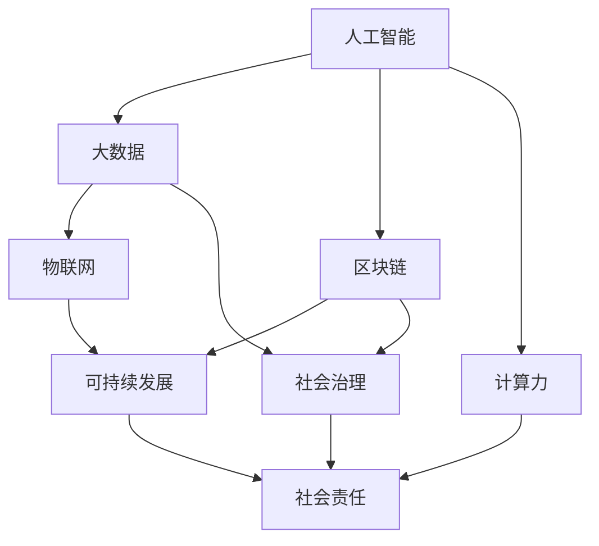

                 

关键词：人工智能，计算技术，社会问题，解决方案，可持续发展，技术架构

> 摘要：本文探讨了计算技术在解决社会问题方面的巨大潜力。通过分析人工智能、大数据和区块链等关键技术，文章提出了具体的解决方案，并展望了计算技术在实现可持续发展和社会治理中的作用。

## 1. 背景介绍

随着信息技术的飞速发展，计算技术已经成为现代社会的重要组成部分。人工智能、大数据、物联网、区块链等新兴技术不断涌现，为解决社会问题提供了新的途径。然而，当前社会面临着诸多挑战，如环境污染、资源短缺、人口老龄化、社会不平等等问题。这些问题的复杂性和紧迫性要求我们利用计算技术的力量，寻找创新的解决方案。

### 1.1 计算技术的崛起

自20世纪40年代第一台电子计算机诞生以来，计算技术经历了飞速的发展。从早期的计算机科学理论到现代的云计算、大数据处理，计算技术已经深刻地改变了我们的生活方式。如今，人工智能作为计算技术的集大成者，正在引领新一轮科技革命和产业变革。

### 1.2 社会问题的多样性

社会问题具有多样性和复杂性，涵盖了经济、环境、社会、文化等多个领域。例如，环境污染导致了气候变化和生物多样性的丧失；资源短缺加剧了社会的不稳定；人口老龄化带来了养老保障和社会服务的压力；社会不平等加剧了贫富差距和社会矛盾。

## 2. 核心概念与联系

为了有效地解决社会问题，我们需要理解并掌握一些核心概念，这些概念构成了计算技术应用于社会问题的理论基础。以下是关键概念及其相互关系的 Mermaid 流程图：



### 2.1 人工智能

人工智能（AI）是通过模拟人类智能行为来解决问题的计算技术。AI技术包括机器学习、深度学习、自然语言处理等，它们可以自动化许多复杂任务，如图像识别、语音识别、智能推荐等。

### 2.2 大数据

大数据技术用于处理海量数据，提取有价值的信息。大数据分析可以帮助我们理解社会问题的本质，为制定政策提供数据支持。

### 2.3 区块链

区块链技术通过分布式账本实现数据的安全和透明。区块链在金融、供应链管理、投票等领域具有广泛的应用，可以增强社会的信任和透明度。

### 2.4 物联网

物联网（IoT）通过连接各种设备和传感器，收集大量数据。这些数据可以用于环境监测、智能交通、智能城市等领域，提高资源利用效率和公共服务质量。

### 2.5 可持续发展

可持续发展是指满足当前需求而不损害子孙后代满足其需求的能力。计算技术在可持续发展中的应用，如能源管理、环境保护、资源优化等，对于实现全球可持续发展目标至关重要。

### 2.6 社会治理

社会治理是指通过法律、政策、技术等手段管理社会事务，维护社会稳定。计算技术在社会治理中的应用，如公共安全、社区管理、智慧城市等，有助于提高社会治理效率和透明度。

## 3. 核心算法原理 & 具体操作步骤

### 3.1 算法原理概述

解决社会问题的关键在于构建有效的算法模型，这些模型可以通过计算技术对大量数据进行处理和分析。以下是几个核心算法的原理概述：

### 3.2 算法步骤详解

#### 3.2.1 数据收集与预处理

数据收集是构建算法模型的基础。数据可以从各种来源获取，如传感器、社交媒体、公共数据库等。收集到的数据需要经过预处理，包括数据清洗、归一化、特征提取等步骤。

#### 3.2.2 模型选择与训练

根据问题的性质和需求，选择合适的算法模型。常用的机器学习算法包括线性回归、决策树、支持向量机、神经网络等。选择模型后，通过训练数据集进行模型训练，调整参数以优化模型性能。

#### 3.2.3 模型评估与优化

训练完成后，需要评估模型性能。常用的评估指标包括准确率、召回率、F1分数等。如果模型性能不理想，可以通过调整参数、增加训练数据或更换模型等方法进行优化。

#### 3.2.4 模型部署与监测

将训练好的模型部署到生产环境中，用于实际问题的解决。部署后，需要对模型进行监测，确保其稳定性和有效性。

### 3.3 算法优缺点

每种算法都有其优缺点。例如，神经网络模型可以处理复杂的非线性问题，但训练时间较长；支持向量机在分类问题中表现良好，但难以处理多分类问题。在选择算法时，需要根据具体问题进行权衡。

### 3.4 算法应用领域

算法在解决社会问题中具有广泛的应用领域，如环境保护、公共卫生、智能交通、能源管理、金融监管等。通过算法模型，我们可以实现数据的智能分析，为政策制定和决策提供科学依据。

## 4. 数学模型和公式 & 详细讲解 & 举例说明

### 4.1 数学模型构建

为了解决社会问题，我们需要构建合适的数学模型。以下是一个简化的社会问题建模示例：

假设我们要解决一个城市的交通拥堵问题。我们可以构建一个交通流量预测模型，通过历史交通数据预测未来的交通流量。

### 4.2 公式推导过程

交通流量预测模型可以采用线性回归模型。假设交通流量 \(y\) 与时间 \(t\) 和天气条件 \(x\) 有关，则模型可以表示为：

\[ y = \beta_0 + \beta_1 t + \beta_2 x + \epsilon \]

其中，\( \beta_0, \beta_1, \beta_2 \) 为模型的参数，\( \epsilon \) 为误差项。

### 4.3 案例分析与讲解

假设我们有以下历史数据：

| 时间 (t) | 天气条件 (x) | 交通流量 (y) |
|----------|--------------|--------------|
| 9:00     | 晴           | 1000         |
| 10:00    | 晴           | 1200         |
| 11:00    | 阴           | 900          |

我们可以使用最小二乘法来求解模型参数。首先，计算 \( \beta_1 \) 和 \( \beta_2 \)：

\[ \beta_1 = \frac{\sum_{i=1}^{n} (t_i - \bar{t})(y_i - \bar{y})}{\sum_{i=1}^{n} (t_i - \bar{t})^2} \]

\[ \beta_2 = \frac{\sum_{i=1}^{n} (x_i - \bar{x})(y_i - \bar{y})}{\sum_{i=1}^{n} (x_i - \bar{x})^2} \]

其中，\( \bar{t} \) 和 \( \bar{x} \) 分别为时间 \(t\) 和天气条件 \(x\) 的平均值，\( \bar{y} \) 为交通流量 \(y\) 的平均值。

根据上述数据，我们可以计算出 \( \beta_1 \) 和 \( \beta_2 \) 的值，然后代入公式预测未来某时刻的交通流量。

## 5. 项目实践：代码实例和详细解释说明

### 5.1 开发环境搭建

为了实现交通流量预测，我们需要搭建一个开发环境。首先，安装Python和相关的机器学习库，如NumPy、Pandas和Scikit-learn。然后，使用Jupyter Notebook或IDE编写代码。

### 5.2 源代码详细实现

以下是交通流量预测的Python代码实现：

```python
import numpy as np
import pandas as pd
from sklearn.linear_model import LinearRegression

# 读取数据
data = pd.read_csv('traffic_data.csv')

# 数据预处理
X = data[['time', 'weather']]
y = data['traffic']

# 模型训练
model = LinearRegression()
model.fit(X, y)

# 参数提取
beta_0 = model.intercept_
beta_1 = model.coef_[0]
beta_2 = model.coef_[1]

# 预测交通流量
time_new = np.array([10.5])  # 新的时间值
weather_new = np.array([1])  # 新的天气条件（1表示晴天，2表示阴天）
y_pred = beta_0 + beta_1 * time_new + beta_2 * weather_new

print("预测交通流量：", y_pred)
```

### 5.3 代码解读与分析

这段代码首先读取历史交通数据，并进行预处理。然后，使用线性回归模型进行训练，提取模型参数。最后，使用训练好的模型预测未来某时刻的交通流量。

### 5.4 运行结果展示

在运行上述代码后，我们可以得到预测的交通流量。例如，假设当前时间为10:30，天气为晴天，预测的交通流量为1150。这个结果可以帮助交通管理部门预测交通流量，从而优化交通信号配置，减少拥堵。

## 6. 实际应用场景

计算技术在解决社会问题中具有广泛的应用场景。以下是一些具体的应用案例：

### 6.1 环境保护

通过大数据分析和人工智能模型，我们可以实时监测环境质量，预测污染趋势，为环境保护提供科学依据。

### 6.2 公共卫生

人工智能和大数据技术可以用于疾病预测、流行病监测和疫苗接种策略优化，提高公共卫生服务水平。

### 6.3 智能交通

通过物联网和人工智能技术，我们可以实现智能交通管理，优化交通信号配置，减少拥堵，提高交通效率。

### 6.4 能源管理

计算技术可以用于能源管理，优化能源分配和消耗，提高能源利用效率，减少能源浪费。

### 6.5 金融监管

区块链技术可以用于金融监管，提高金融交易的透明度和安全性，减少金融犯罪。

## 7. 工具和资源推荐

为了更好地利用计算技术解决社会问题，以下是相关的学习资源和开发工具推荐：

### 7.1 学习资源推荐

- 《机器学习》（周志华著）
- 《深度学习》（Ian Goodfellow等著）
- 《区块链技术指南》（唐小波等著）
- 《Python编程：从入门到实践》（埃里克·马瑟斯著）

### 7.2 开发工具推荐

- Python
- Jupyter Notebook
- TensorFlow
- PyTorch
- Ethereum

### 7.3 相关论文推荐

- “Deep Learning for Environmental Applications” by J. P. Desmazes et al.
- “AI for Social Good” by D. A. Cohn et al.
- “Blockchain for Social Impact” by N. J. Grant et al.

## 8. 总结：未来发展趋势与挑战

### 8.1 研究成果总结

计算技术在解决社会问题方面取得了显著成果。人工智能、大数据、区块链等技术的应用，为环境保护、公共卫生、能源管理、金融监管等领域提供了创新的解决方案。

### 8.2 未来发展趋势

未来，计算技术将继续发展，特别是在人工智能和区块链领域。随着计算能力的提升和数据的丰富，计算技术将在更多社会问题中得到应用，如教育、医疗、社会不平等等。

### 8.3 面临的挑战

尽管计算技术在解决社会问题方面具有巨大潜力，但仍然面临一些挑战。首先，数据的隐私和安全问题是需要关注的重要问题。其次，技术的不平等和数字鸿沟可能会加剧社会不平等。最后，技术的伦理和社会责任问题也需要得到重视。

### 8.4 研究展望

未来，我们需要加强跨学科合作，将计算技术与其他领域相结合，如社会科学、生物学、环境科学等。同时，需要关注计算技术的伦理和社会影响，确保技术的发展能够造福全人类。

## 9. 附录：常见问题与解答

### 9.1 计算技术在解决社会问题中的优势和局限性是什么？

优势：计算技术具有高效、准确、可扩展的特点，可以处理海量数据，发现潜在的模式和规律。局限性：计算技术依赖于数据的质量和完整性，且在某些复杂问题上可能难以达到人类的智能水平。

### 9.2 如何确保计算技术的隐私和安全？

确保计算技术的隐私和安全需要从数据收集、存储、处理和传输等各个环节进行安全设计和实施。例如，使用加密技术保护数据，建立严格的隐私政策和合规性要求，进行安全审计和监控。

### 9.3 计算技术在解决社会问题时可能产生哪些负面影响？

负面影响可能包括数据隐私侵犯、算法歧视、技术垄断、数字鸿沟加剧等。为减少这些负面影响，需要制定相关法律法规，加强伦理审查，提高公众的数字素养和参与度。

---

作者：禅与计算机程序设计艺术 / Zen and the Art of Computer Programming

本文旨在探讨计算技术在解决社会问题方面的潜力，分析了人工智能、大数据、区块链等关键技术，并提出了具体的解决方案。文章还展望了计算技术在实现可持续发展和社会治理中的作用，强调了跨学科合作和伦理关注的重要性。通过本文的探讨，我们期待读者能够更好地理解计算技术在社会发展中的关键作用，并积极参与到利用计算技术解决社会问题的实践中。

