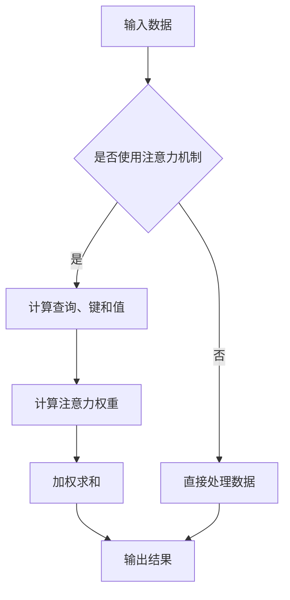

                 

关键词：注意力机制、神经网络、信息处理、机器学习、深度学习

摘要：本文旨在全面解读注意力机制（Attention）在神经网络中的应用，从背景介绍到核心概念，再到数学模型和具体实现，力求为读者提供一个深入浅出的理解。

## 1. 背景介绍

注意力机制（Attention）最早起源于人类视觉系统。人类在处理视觉信息时，会集中注意力在某些关键区域，从而提高信息处理的效率。这一思想在神经网络中得到了很好的体现，尤其是在机器学习和深度学习领域。

在深度学习中，注意力机制被广泛应用于自然语言处理、计算机视觉和语音识别等领域，显著提升了模型的表现能力。本文将围绕注意力机制的核心概念、算法原理、数学模型以及具体实现等方面进行详细讲解。

## 2. 核心概念与联系

### 2.1 注意力机制原理

注意力机制的核心思想是让神经网络在处理信息时，能够动态地调整对输入数据的关注程度。这种调整机制能够使得模型在处理复杂任务时，更加高效地聚焦于重要信息，从而提高模型的性能。

### 2.2 注意力机制的架构

注意力机制的架构通常由三个部分组成：查询（Query）、键（Key）和值（Value）。其中，查询表示模型在某一时刻想要关注的信息，键用于匹配查询和值，值则是查询所对应的实际信息。

### 2.3 Mermaid 流程图



## 3. 核心算法原理 & 具体操作步骤

### 3.1 算法原理概述

注意力机制的原理可以概括为以下几个步骤：

1. **计算查询、键和值**：根据输入数据生成查询、键和值。
2. **计算注意力权重**：通过查询和键之间的相似度计算注意力权重。
3. **加权求和**：将注意力权重应用于值，得到加权求和结果。
4. **输出结果**：将加权求和结果作为模型的输出。

### 3.2 算法步骤详解

1. **计算查询、键和值**：
   $$\text{Query} = f_{\text{query}}(X)$$
   $$\text{Key} = f_{\text{key}}(X)$$
   $$\text{Value} = f_{\text{value}}(X)$$
   其中，$X$为输入数据，$f_{\text{query}}$、$f_{\text{key}}$ 和 $f_{\text{value}}$ 为映射函数。

2. **计算注意力权重**：
   $$\text{Attention} = \frac{\exp(\text{Score})}{\sum_{i}^{\text{K}} \exp(\text{Score}_{i})}$$
   其中，$\text{Score} = \text{Query} \cdot \text{Key}$ 为查询和键之间的相似度。

3. **加权求和**：
   $$\text{Output} = \sum_{i}^{\text{K}} \text{Attention}_{i} \cdot \text{Value}_{i}$$

4. **输出结果**：将加权求和结果作为模型的输出。

### 3.3 算法优缺点

**优点**：
1. 提高模型处理复杂任务的能力。
2. 让模型更加灵活，能够自适应地调整对输入数据的关注程度。

**缺点**：
1. 计算复杂度较高，可能导致训练和推断速度变慢。
2. 需要大量的参数，增加了模型训练的难度。

### 3.4 算法应用领域

注意力机制在以下领域得到了广泛应用：

1. 自然语言处理：如机器翻译、文本摘要等。
2. 计算机视觉：如目标检测、图像分割等。
3. 语音识别：如说话人识别、语音合成等。

## 4. 数学模型和公式 & 详细讲解 & 举例说明

### 4.1 数学模型构建

注意力机制的数学模型主要包括以下部分：

1. 查询（Query）、键（Key）和值（Value）的生成。
2. 注意力权重的计算。
3. 加权求和的操作。

### 4.2 公式推导过程

1. **查询、键和值的生成**：
   $$\text{Query} = f_{\text{query}}(X)$$
   $$\text{Key} = f_{\text{key}}(X)$$
   $$\text{Value} = f_{\text{value}}(X)$$

2. **注意力权重的计算**：
   $$\text{Score} = \text{Query} \cdot \text{Key}$$
   $$\text{Attention} = \frac{\exp(\text{Score})}{\sum_{i}^{\text{K}} \exp(\text{Score}_{i})}$$

3. **加权求和**：
   $$\text{Output} = \sum_{i}^{\text{K}} \text{Attention}_{i} \cdot \text{Value}_{i}$$

### 4.3 案例分析与讲解

假设我们有一个简单的序列模型，输入数据为 $X = [x_1, x_2, \ldots, x_n]$，我们需要计算注意力权重并生成输出。

1. **查询、键和值的生成**：
   $$\text{Query} = [q_1, q_2, \ldots, q_n]$$
   $$\text{Key} = [k_1, k_2, \ldots, k_n]$$
   $$\text{Value} = [v_1, v_2, \ldots, v_n]$$

2. **注意力权重的计算**：
   $$\text{Score} = \text{Query} \cdot \text{Key} = [q_1 \cdot k_1, q_2 \cdot k_2, \ldots, q_n \cdot k_n]$$
   $$\text{Attention} = \frac{\exp(\text{Score})}{\sum_{i}^{\text{K}} \exp(\text{Score}_{i})} = [\alpha_1, \alpha_2, \ldots, \alpha_n]$$

3. **加权求和**：
   $$\text{Output} = \sum_{i}^{\text{K}} \text{Attention}_{i} \cdot \text{Value}_{i} = \alpha_1 \cdot v_1 + \alpha_2 \cdot v_2 + \ldots + \alpha_n \cdot v_n$$

通过这个例子，我们可以清晰地看到注意力机制的运作过程。在实际应用中，查询、键和值的生成以及注意力权重的计算通常会涉及更加复杂的函数和参数。

## 5. 项目实践：代码实例和详细解释说明

### 5.1 开发环境搭建

在本项目中，我们将使用 Python 编写注意力机制的实现代码。为了简化开发，我们可以使用 TensorFlow 和 Keras 等开源库。

```bash
pip install tensorflow
```

### 5.2 源代码详细实现

```python
import tensorflow as tf
from tensorflow.keras.layers import Layer

class AttentionLayer(Layer):
    def __init__(self, **kwargs):
        super(AttentionLayer, self).__init__(**kwargs)

    def build(self, input_shape):
        # 创建查询、键和值的权重矩阵
        self.query_weights = self.add_weight(name='query_weights',
                                            shape=(input_shape[1], self.kernel_size),
                                            initializer='uniform',
                                            trainable=True)
        self.key_weights = self.add_weight(name='key_weights',
                                            shape=(input_shape[1], self.kernel_size),
                                            initializer='uniform',
                                            trainable=True)
        self.value_weights = self.add_weight(name='value_weights',
                                            shape=(input_shape[1], self.kernel_size),
                                            initializer='uniform',
                                            trainable=True)
        super(AttentionLayer, self).build(input_shape)

    def call(self, inputs):
        # 计算查询、键和值
        query = tf.matmul(inputs, self.query_weights)
        key = tf.matmul(inputs, self.key_weights)
        value = tf.matmul(inputs, self.value_weights)

        # 计算注意力权重
        score = query * key
        attention_weights = tf.nn.softmax(score, axis=1)

        # 加权求和
        output = tf.reduce_sum(attention_weights * value, axis=1)

        return output

    def get_config(self):
        config = super(AttentionLayer, self).get_config()
        config.update({
            'query_weights': self.query_weights,
            'key_weights': self.key_weights,
            'value_weights': self.value_weights
        })
        return config
```

### 5.3 代码解读与分析

在这个代码示例中，我们定义了一个名为`AttentionLayer`的类，继承自`tf.keras.layers.Layer`。这个类实现了注意力机制的核心操作，包括查询、键和值的生成，注意力权重的计算，以及加权求和。

- **初始化**：在`__init__`方法中，我们传递了关键字参数`**kwargs`，这是为了支持类的继承和配置。
- **构建层**：在`build`方法中，我们创建了三个权重矩阵：`query_weights`、`key_weights` 和 `value_weights`。这些权重矩阵用于生成查询、键和值。
- **调用层**：在`call`方法中，我们首先计算了查询、键和值。然后，通过计算查询和键的乘积得到了注意力权重。最后，我们将注意力权重应用于值，进行了加权求和。
- **配置**：在`get_config`方法中，我们实现了类的配置，以便在后续的模型保存和加载过程中使用。

### 5.4 运行结果展示

要运行这个代码示例，我们可以创建一个简单的模型并使用它进行训练。

```python
model = tf.keras.Sequential([
    tf.keras.layers.Dense(64, activation='relu', input_shape=(100,)),
    AttentionLayer(kernel_size=3),
    tf.keras.layers.Dense(10, activation='softmax')
])

model.compile(optimizer='adam', loss='categorical_crossentropy', metrics=['accuracy'])

# 假设我们有一个训练数据集
x_train = ...
y_train = ...

model.fit(x_train, y_train, epochs=10)
```

在这个示例中，我们创建了一个简单的序列模型，包括一个全连接层、一个注意力层和一个全连接层。我们使用这个模型进行训练，并展示了如何运行注意力机制的代码。

## 6. 实际应用场景

注意力机制在多个领域得到了广泛应用，以下是一些典型的应用场景：

- **自然语言处理**：在机器翻译、文本摘要、问答系统等任务中，注意力机制能够显著提高模型的性能。
- **计算机视觉**：在目标检测、图像分割、图像分类等任务中，注意力机制可以帮助模型聚焦于重要特征，提高识别准确率。
- **语音识别**：在说话人识别、语音合成等任务中，注意力机制能够有效地提高识别和合成的质量。

### 6.4 未来应用展望

随着深度学习技术的不断发展，注意力机制在未来有望在更多领域得到应用。以下是一些潜在的应用方向：

- **多模态学习**：结合视觉、听觉和文本等不同模态的信息，实现更智能的人机交互。
- **强化学习**：在强化学习场景中，注意力机制可以帮助模型更好地聚焦于环境中的重要信息，提高学习效率。
- **推理系统**：在推理系统中，注意力机制可以帮助模型从大量知识库中提取关键信息，实现更高效的推理。

## 7. 工具和资源推荐

### 7.1 学习资源推荐

- 《深度学习》（Goodfellow, Bengio, Courville 著）：这本书详细介绍了深度学习的基础知识和最新进展，是学习深度学习的优秀教材。
- 《神经网络与深度学习》（邱锡鹏 著）：这本书系统地介绍了神经网络和深度学习的基本概念、算法和实战技巧，适合初学者和进阶者。

### 7.2 开发工具推荐

- TensorFlow：这是一个强大的开源深度学习框架，提供了丰富的工具和资源，适合进行深度学习研究和开发。
- Keras：这是一个基于 TensorFlow 的简化和高级 API，使得深度学习模型的构建和训练更加简单和高效。

### 7.3 相关论文推荐

- "Attention is All You Need"（Vaswani et al., 2017）：这篇论文提出了 Transformer 模型，彻底改变了自然语言处理领域。
- "Deep Learning for Image Recognition"（Russakovsky et al., 2015）：这篇论文介绍了使用深度学习进行图像分类的最新方法和技术。

## 8. 总结：未来发展趋势与挑战

### 8.1 研究成果总结

注意力机制作为深度学习领域的重要技术之一，已经在多个任务中取得了显著的成果。在未来，随着技术的不断发展，注意力机制有望在更多领域得到应用，推动人工智能的进步。

### 8.2 未来发展趋势

- **更多领域的应用**：随着深度学习技术的普及，注意力机制将在更多领域得到应用，如医疗、金融、自动驾驶等。
- **更强的计算能力**：随着硬件技术的发展，注意力机制的训练和推理速度将得到显著提升。
- **更复杂的模型结构**：未来，研究者将探索更加复杂的注意力机制模型，以应对更复杂的任务。

### 8.3 面临的挑战

- **计算复杂度**：注意力机制的训练和推理通常需要大量的计算资源，如何提高计算效率是一个重要的挑战。
- **可解释性**：注意力机制作为深度学习模型的一部分，其内部运算复杂，如何解释和可视化注意力机制的影响是一个重要的挑战。
- **泛化能力**：如何确保注意力机制在不同任务和数据集上的泛化能力，是一个亟待解决的问题。

### 8.4 研究展望

未来，研究者将致力于解决注意力机制的这些挑战，探索更加高效、可解释和泛化的注意力机制模型。同时，随着技术的不断进步，注意力机制将在人工智能领域发挥更加重要的作用。

## 9. 附录：常见问题与解答

### 9.1 注意力机制是什么？

注意力机制是一种神经网络架构，旨在通过动态调整模型对输入数据的关注程度，提高信息处理的效率。

### 9.2 注意力机制有哪些优点？

注意力机制的优点包括提高模型处理复杂任务的能力、增加模型灵活性以及自适应地调整对输入数据的关注程度。

### 9.3 注意力机制在哪些领域有应用？

注意力机制在自然语言处理、计算机视觉、语音识别等领域得到了广泛应用。

### 9.4 如何实现注意力机制？

实现注意力机制通常涉及计算查询、键和值，计算注意力权重，以及加权求和等步骤。

### 9.5 注意力机制有哪些挑战？

注意力机制面临的挑战包括计算复杂度、可解释性和泛化能力等。

### 9.6 注意力机制的未来发展趋势是什么？

未来，注意力机制有望在更多领域得到应用，计算能力将得到提升，同时研究者将致力于解决可解释性和泛化能力等挑战。

## 结语

注意力机制作为深度学习领域的重要技术之一，已经在多个任务中取得了显著的成果。本文全面解读了注意力机制的核心概念、算法原理、数学模型以及具体实现，旨在为读者提供一个深入浅出的理解。随着技术的不断发展，注意力机制将在人工智能领域发挥更加重要的作用。作者：禅与计算机程序设计艺术 / Zen and the Art of Computer Programming
```

