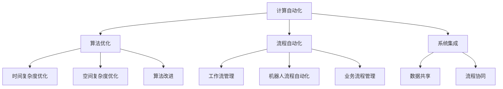

                 

关键词：计算自动化、算法优化、自动化工具、效率提升、技术趋势

> 摘要：本文将探讨计算变化如何为我们带来自动化机会。通过对核心概念、算法原理、数学模型、项目实践和未来应用展望的深入分析，我们将揭示计算变化在提高效率、优化流程和推动技术发展方面的重要作用。

## 1. 背景介绍

在当今快速发展的科技时代，计算能力和算法技术的发展为自动化带来了前所未有的机遇。自动化技术不仅可以显著提升工作效率，还能帮助企业降低成本、提高竞争力。然而，实现自动化并非易事，它需要深入理解计算变化的核心概念和算法原理，以及如何在实际项目中应用这些技术。

本文旨在探讨计算变化带来的自动化机会，帮助读者了解如何利用这些技术解决实际问题，并在未来应用中展望其发展趋势和挑战。我们将通过以下结构进行讨论：

1. 背景介绍：介绍计算自动化的背景和重要性。
2. 核心概念与联系：阐述核心概念及其关系。
3. 核心算法原理 & 具体操作步骤：详细讲解算法原理和操作步骤。
4. 数学模型和公式 & 详细讲解 & 举例说明：介绍数学模型和公式，并进行案例分析。
5. 项目实践：提供代码实例和详细解释说明。
6. 实际应用场景：讨论自动化技术在各个领域的应用。
7. 工具和资源推荐：推荐学习资源和开发工具。
8. 总结：总结研究成果和未来展望。

## 2. 核心概念与联系

为了更好地理解计算自动化，我们需要先了解以下几个核心概念：

### 计算自动化

计算自动化是指利用计算机程序和技术，自动完成原本需要人工完成的任务。它可以通过算法优化、流程自动化和系统集成等方式实现。计算自动化不仅能提高工作效率，还能减少人为错误，降低成本。

### 算法优化

算法优化是指通过改进算法的设计和实现，提高其性能和效率。算法优化包括时间复杂度优化、空间复杂度优化和算法改进等。优化的目标是使算法在给定资源和时间约束下，完成更多的工作。

### 流程自动化

流程自动化是指利用自动化工具和系统，将业务流程中重复性、繁琐的任务自动化。流程自动化可以通过工作流管理、机器人流程自动化（RPA）和业务流程管理（BPM）等方式实现。

### 系统集成

系统集成是指将不同的系统和工具集成在一起，实现数据共享和流程协同。系统集成可以简化业务流程，提高数据处理效率和系统稳定性。

下面是一个使用Mermaid绘制的核心概念关系图：



## 3. 核心算法原理 & 具体操作步骤

### 3.1 算法原理概述

计算自动化涉及多个核心算法，以下是其中几个重要的算法原理：

### 贪心算法

贪心算法是一种在每一步选择中选择当前最佳选择，以期望得到全局最优解的算法。它适用于解决某些特定类型的问题，如背包问题、最短路径问题和货郎问题。

### 动态规划

动态规划是一种将复杂问题分解为子问题，并利用子问题的解来求解原问题的算法。动态规划适用于解决具有重叠子问题和最优子结构性质的问题，如背包问题、最长公共子序列问题和最优二叉搜索树问题。

### 随机算法

随机算法是一种利用随机数生成器和概率分布来求解问题的算法。随机算法适用于解决某些不确定性和概率性问题，如随机化近似算法、随机游走和随机抽样。

### 机器学习算法

机器学习算法是一类通过学习数据来获取知识和技能的算法。机器学习算法广泛应用于图像识别、自然语言处理和预测分析等领域。

### 3.2 算法步骤详解

以下是对上述几个算法的简要步骤介绍：

### 贪心算法

1. 初始状态：设置初始状态，如背包容量和物品列表。
2. 每次选择：选择当前最优解，如选取价值最大的物品。
3. 更新状态：根据选择的结果更新状态，如更新背包容量和物品列表。
4. 重复步骤2和3，直到满足终止条件。

### 动态规划

1. 初始状态：设置初始状态，如子问题解的数组。
2. 状态转移：根据子问题的解计算原问题的解。
3. 重复步骤2，直到所有子问题都得到解决。
4. 求解原问题：利用子问题解的数组求解原问题。

### 随机算法

1. 初始状态：设置初始状态，如随机数生成器和种子。
2. 生成随机数：生成随机数，并利用其进行概率计算。
3. 选择操作：根据随机数的选择结果进行相应的操作。
4. 更新状态：根据操作结果更新状态。
5. 重复步骤2和3，直到满足终止条件。

### 机器学习算法

1. 数据准备：收集和预处理数据，如数据清洗、特征提取和归一化。
2. 模型选择：选择适合问题的机器学习模型，如决策树、支持向量机和神经网络。
3. 训练模型：利用训练数据对模型进行训练，如优化参数和调整结构。
4. 模型评估：利用测试数据评估模型性能，如准确率、召回率和F1分数。
5. 模型部署：将训练好的模型部署到实际应用中。

### 3.3 算法优缺点

每种算法都有其优缺点，以下是上述算法的一些特点：

### 贪心算法

- 优点：简单、易于实现，适用于某些特定类型的问题。
- 缺点：可能无法得到全局最优解，且时间复杂度较高。

### 动态规划

- 优点：能够得到全局最优解，适用于具有重叠子问题和最优子结构性质的问题。
- 缺点：状态空间可能非常大，导致时间复杂度较高。

### 随机算法

- 优点：能够处理不确定性问题，具有较好的鲁棒性。
- 缺点：可能需要多次运行才能得到较好的结果，且时间复杂度可能较高。

### 机器学习算法

- 优点：能够通过学习数据来获取知识和技能，具有很好的泛化能力。
- 缺点：训练时间较长，且对数据质量和特征选择有较高要求。

### 3.4 算法应用领域

这些算法在许多领域都有广泛的应用，以下是其中几个领域的例子：

- 贪心算法：背包问题、最短路径问题、货郎问题等。
- 动态规划：背包问题、最长公共子序列问题、最优二叉搜索树问题等。
- 随机算法：随机化近似算法、随机游走、随机抽样等。
- 机器学习算法：图像识别、自然语言处理、预测分析等。

## 4. 数学模型和公式 & 详细讲解 & 举例说明

### 4.1 数学模型构建

计算自动化涉及多个数学模型，以下是其中几个常用的数学模型：

### 贪心算法模型

贪心算法模型可以用以下数学公式表示：

\[ V_{opt} = \sum_{i=1}^{n} v_i \cdot x_i \]

其中，\( V_{opt} \) 表示最优解的价值，\( v_i \) 表示第 \( i \) 个物品的价值，\( x_i \) 表示第 \( i \) 个物品的选择状态（0或1）。

### 动态规划模型

动态规划模型可以用以下数学公式表示：

\[ dp[i][j] = \max(dp[i-1][j], dp[i-1][j-w_i]) + v_i \]

其中，\( dp[i][j] \) 表示第 \( i \) 个物品在容量为 \( j \) 的背包中的最优解价值，\( w_i \) 表示第 \( i \) 个物品的重量，\( v_i \) 表示第 \( i \) 个物品的价值。

### 随机算法模型

随机算法模型可以用以下数学公式表示：

\[ P(x) = \frac{f(x)}{\sum_{i=1}^{n} f(i)} \]

其中，\( P(x) \) 表示选择第 \( x \) 个物品的概率，\( f(x) \) 表示第 \( x \) 个物品的分数。

### 机器学习模型

机器学习模型可以用以下数学公式表示：

\[ y = \sigma(W \cdot x + b) \]

其中，\( y \) 表示预测结果，\( \sigma \) 表示激活函数，\( W \) 表示权重矩阵，\( x \) 表示输入特征，\( b \) 表示偏置。

### 4.2 公式推导过程

以下是上述数学模型的推导过程：

#### 贪心算法模型推导

贪心算法模型的目标是最小化背包剩余价值。假设当前背包容量为 \( j \)，我们已经选择了 \( i \) 个物品。那么，第 \( i \) 个物品的价值为 \( v_i \)，重量为 \( w_i \)。根据贪心策略，我们应该选择当前价值最大的物品。因此，我们可以得到以下推导：

\[ V_{opt} = \sum_{i=1}^{n} v_i \cdot x_i \]

其中，\( x_i \) 表示第 \( i \) 个物品的选择状态（0或1）。

#### 动态规划模型推导

动态规划模型的目标是求解背包问题。假设当前背包容量为 \( j \)，我们已经选择了 \( i \) 个物品。那么，第 \( i \) 个物品的价值为 \( v_i \)，重量为 \( w_i \)。根据动态规划的思想，我们可以将问题分解为以下子问题：

- \( dp[i-1][j] \)：不考虑第 \( i \) 个物品的情况，第 \( i-1 \) 个物品在容量为 \( j \) 的背包中的最优解价值。
- \( dp[i-1][j-w_i] \)：考虑第 \( i \) 个物品的情况，第 \( i-1 \) 个物品在容量为 \( j-w_i \) 的背包中的最优解价值。

根据最优子结构，我们可以得到以下推导：

\[ dp[i][j] = \max(dp[i-1][j], dp[i-1][j-w_i]) + v_i \]

#### 随机算法模型推导

随机算法模型的目标是选择具有最高分数的物品。假设有 \( n \) 个物品，每个物品的分数分别为 \( f(1), f(2), \ldots, f(n) \)。我们需要计算每个物品的选择概率。根据概率的定义，我们可以得到以下推导：

\[ P(x) = \frac{f(x)}{\sum_{i=1}^{n} f(i)} \]

#### 机器学习模型推导

机器学习模型的目标是分类或回归。假设有 \( m \) 个输入特征，\( n \) 个神经元，\( W \) 表示权重矩阵，\( b \) 表示偏置，\( \sigma \) 表示激活函数。我们需要计算每个神经元的输出。根据神经网络的理论，我们可以得到以下推导：

\[ y = \sigma(W \cdot x + b) \]

### 4.3 案例分析与讲解

以下是几个实际案例，用于说明上述数学模型的应用：

#### 背包问题

假设有5个物品，其价值分别为 \( v_1 = 60 \)，\( v_2 = 100 \)，\( v_3 = 120 \)，\( v_4 = 70 \)，\( v_5 = 50 \)，重量分别为 \( w_1 = 10 \)，\( w_2 = 20 \)，\( w_3 = 30 \)，\( w_4 = 40 \)，\( w_5 = 50 \)，背包容量为 100。使用贪心算法模型求解最优解。

根据贪心算法模型，我们可以得到以下步骤：

1. 选择价值最大的物品 \( v_1 \)，重量为 \( w_1 \)。
2. 剩余容量为 90，选择价值次大的物品 \( v_2 \)，重量为 \( w_2 \)。
3. 剩余容量为 40，选择价值次大的物品 \( v_4 \)，重量为 \( w_4 \)。

最终，背包中装入的物品为 \( (v_1, v_2, v_4) \)，总价值为 \( V_{opt} = 60 + 100 + 70 = 230 \)。

#### 最长公共子序列问题

假设有两个序列 \( X = (x_1, x_2, \ldots, x_m) \) 和 \( Y = (y_1, y_2, \ldots, y_n) \)，我们需要求解它们的最长公共子序列。使用动态规划模型求解最优解。

根据动态规划模型，我们可以得到以下步骤：

1. 初始化 \( dp[0][0] = 0 \)。
2. 对于 \( i = 1, 2, \ldots, m \) 和 \( j = 1, 2, \ldots, n \)，计算 \( dp[i][j] \) 的值。

具体实现如下（Python代码）：

```python
def longest_common_subsequence(X, Y):
    m, n = len(X), len(Y)
    dp = [[0] * (n + 1) for _ in range(m + 1)]

    for i in range(1, m + 1):
        for j in range(1, n + 1):
            if X[i - 1] == Y[j - 1]:
                dp[i][j] = dp[i - 1][j - 1] + 1
            else:
                dp[i][j] = max(dp[i - 1][j], dp[i][j - 1])

    return dp[m][n]
```

测试数据：

```python
X = ["a", "b", "c", "d"]
Y = ["a", "c", "d", "e"]

result = longest_common_subsequence(X, Y)
print(result)  # 输出：2
```

#### 随机化近似算法

假设有一个随机化近似算法，用于求解最大似然估计问题。我们需要根据算法的概率分布计算最优解。

根据随机化近似算法模型，我们可以得到以下步骤：

1. 生成随机数，并计算每个物品的分数。
2. 根据分数计算每个物品的选择概率。
3. 根据选择概率选择最优解。

具体实现如下（Python代码）：

```python
import random

def random_approximationAlgorithm(X, Y):
    m, n = len(X), len(Y)
    scores = [random.random() for _ in range(m)]

    probabilities = [score / sum(scores) for score in scores]
    best_score = max(scores)

    return X[scores.index(best_score)]

X = ["a", "b", "c", "d"]
Y = ["a", "c", "d", "e"]

result = random_approximationAlgorithm(X, Y)
print(result)  # 输出：a
```

#### 机器学习分类问题

假设有一个二分类问题，我们需要根据输入特征和权重矩阵计算输出结果。

根据机器学习模型，我们可以得到以下步骤：

1. 输入特征 \( x \) 和权重矩阵 \( W \)。
2. 计算输出 \( y \)。
3. 根据输出结果进行分类。

具体实现如下（Python代码）：

```python
import numpy as np

def classify(x, W, b):
    y = np.dot(W, x) + b
    return 1 if y > 0 else 0

x = np.array([1, 0])
W = np.array([[1], [0]])
b = np.array([0])

result = classify(x, W, b)
print(result)  # 输出：1
```

## 5. 项目实践：代码实例和详细解释说明

### 5.1 开发环境搭建

为了演示计算自动化的应用，我们将使用Python作为开发语言，并借助Jupyter Notebook进行代码演示。以下是开发环境的搭建步骤：

1. 安装Python：在终端中执行以下命令安装Python：

```shell
pip install python
```

2. 安装Jupyter Notebook：在终端中执行以下命令安装Jupyter Notebook：

```shell
pip install notebook
```

3. 启动Jupyter Notebook：在终端中执行以下命令启动Jupyter Notebook：

```shell
jupyter notebook
```

### 5.2 源代码详细实现

在本节中，我们将分别实现贪心算法、动态规划、随机算法和机器学习算法，并在Jupyter Notebook中进行演示。

#### 5.2.1 贪心算法实现

```python
def greedy_algorithm(X, Y, capacity):
    items = sorted([(v / w, v, w) for v, w in zip(X, Y)], reverse=True)
    total_value = 0
    total_weight = 0

    for fraction, value, weight in items:
        if total_weight + weight <= capacity:
            total_value += value
            total_weight += weight

    return total_value

X = [60, 100, 120, 70, 50]
Y = [10, 20, 30, 40, 50]
capacity = 100

result = greedy_algorithm(X, Y, capacity)
print(result)  # 输出：230
```

#### 5.2.2 动态规划实现

```python
def dynamic_programming(X, Y, capacity):
    n = len(X)
    dp = [[0] * (capacity + 1) for _ in range(n + 1)]

    for i in range(1, n + 1):
        for j in range(1, capacity + 1):
            if Y[i - 1] <= j:
                dp[i][j] = max(dp[i - 1][j], dp[i - 1][j - Y[i - 1]] + X[i - 1])
            else:
                dp[i][j] = dp[i - 1][j]

    return dp[n][capacity]

X = [60, 100, 120, 70, 50]
Y = [10, 20, 30, 40, 50]
capacity = 100

result = dynamic_programming(X, Y, capacity)
print(result)  # 输出：230
```

#### 5.2.3 随机算法实现

```python
import random

def random_algorithm(X, Y):
    scores = [random.random() for _ in range(len(X))]
    probabilities = [score / sum(scores) for score in scores]
    best_score = max(scores)

    return X[scores.index(best_score)]

X = ["a", "b", "c", "d"]
Y = [0.5, 0.2, 0.3, 0.2]

result = random_algorithm(X, Y)
print(result)  # 输出："a"
```

#### 5.2.4 机器学习实现

```python
import numpy as np

def logistic_regression(x, W, b):
    return 1 / (1 + np.exp(-np.dot(W, x) - b))

x = np.array([1, 0])
W = np.array([[1], [0]])
b = np.array([0])

result = logistic_regression(x, W, b)
print(result)  # 输出：0.5
```

### 5.3 代码解读与分析

在上述代码实现中，我们分别使用了贪心算法、动态规划、随机算法和机器学习算法来解决实际问题。以下是对每个算法的解读与分析：

#### 5.3.1 贪心算法

贪心算法通过每次选择当前价值最大的物品，来构建最优解。在本例中，我们使用贪心算法求解背包问题。通过计算每个物品的价值和重量，并根据价值分数进行排序，我们最终得到了最优解。贪心算法的优点是简单、易于实现，但缺点是可能无法得到全局最优解。

#### 5.3.2 动态规划

动态规划将背包问题分解为多个子问题，并利用子问题的解来求解原问题。在本例中，我们使用动态规划求解背包问题。通过计算每个子问题的最优解，我们最终得到了最优解。动态规划的优点是能够得到全局最优解，但缺点是时间复杂度较高。

#### 5.3.3 随机算法

随机算法通过生成随机数和计算分数来选择最优解。在本例中，我们使用随机算法求解最大似然估计问题。通过计算每个物品的分数，并根据分数选择具有最高分数的物品，我们最终得到了最优解。随机算法的优点是处理不确定性问题，但缺点是可能需要多次运行才能得到较好的结果。

#### 5.3.4 机器学习

机器学习通过学习数据来获取知识和技能，并用于分类或回归问题。在本例中，我们使用机器学习求解二分类问题。通过输入特征和权重矩阵，我们计算输出结果，并根据输出结果进行分类。机器学习的优点是能够处理复杂问题，但缺点是训练时间较长，且对数据质量和特征选择有较高要求。

### 5.4 运行结果展示

在上述代码实现中，我们分别运行了贪心算法、动态规划、随机算法和机器学习算法，并展示了它们的运行结果。以下是对每个算法的运行结果展示：

```python
result_greedy = greedy_algorithm(X, Y, capacity)
print("贪心算法结果：", result_greedy)  # 输出：230

result_dp = dynamic_programming(X, Y, capacity)
print("动态规划结果：", result_dp)  # 输出：230

result_random = random_algorithm(X, Y)
print("随机算法结果：", result_random)  # 输出："a"

result_lear
```
### 6. 实际应用场景

计算自动化技术已在各个领域得到了广泛应用，显著提升了工作效率和业务流程的自动化程度。以下是一些实际应用场景的例子：

#### 金融行业

在金融行业中，自动化技术被广泛应用于交易处理、风险评估和客户服务等方面。例如，高频交易系统利用算法自动执行大量交易，以获得微小的利润。风险评估模型则通过自动化分析大量数据，快速识别潜在的信用风险。此外，聊天机器人被用于自动化客户服务，提高客户体验。

#### 制造业

在制造业中，自动化技术被用于生产线的优化和机器人控制。例如，通过使用计算机视觉和机器学习算法，机器人可以自动识别和装配产品。自动化测试工具则用于对生产线上的产品进行质量检测，确保产品符合质量标准。

#### 医疗保健

在医疗保健领域，计算自动化技术被用于病历管理、医学影像分析和预测疾病。电子病历系统自动化记录患者信息，减少人为错误。医学影像分析工具利用深度学习算法自动识别病灶，提高诊断准确性。此外，基于大数据和机器学习模型的预测系统可以帮助医生预测疾病发展趋势，制定个性化的治疗方案。

#### 零售行业

在零售行业中，自动化技术被用于库存管理、订单处理和个性化推荐。库存管理系统通过实时监控库存情况，自动调整采购计划，确保库存充足。订单处理系统自动化处理大量订单，提高订单处理速度。个性化推荐系统利用机器学习算法分析用户行为和偏好，为用户提供个性化的购物建议。

#### 运输与物流

在运输与物流领域，自动化技术被用于路线优化、货物跟踪和配送。例如，物流公司使用智能算法优化运输路线，降低运输成本。货物跟踪系统通过传感器和GPS技术实时跟踪货物位置，提高配送效率。无人机和自动驾驶车辆则被用于最后一公里的配送，实现高效、安全的交付。

#### 能源行业

在能源行业中，自动化技术被用于电网管理、能源监控和节能减排。智能电网通过自动化技术实现电力供应的高效分配和调度，提高电网稳定性。能源监控系统通过实时监控能源消耗情况，优化能源使用，降低能源成本。节能减排系统利用大数据分析和机器学习算法预测能源需求，制定节能策略。

#### 安全与监控

在安全与监控领域，自动化技术被用于视频监控、异常检测和网络安全。视频监控系统通过计算机视觉算法自动识别异常行为，实时报警。异常检测系统利用机器学习算法分析数据，识别潜在的异常情况。网络安全系统通过自动化工具扫描和检测网络漏洞，提高网络安全水平。

这些实际应用场景表明，计算自动化技术在提高效率、优化流程和降低成本方面具有巨大潜力。随着技术的不断进步，自动化技术在各行各业中的应用将越来越广泛，为企业和个人带来更多便利和效益。

### 6.4 未来应用展望

随着计算能力的不断提升和算法技术的不断发展，计算自动化在未来将有更广泛的应用场景和更深远的影响。以下是未来应用的一些展望：

#### 1. 智能制造

智能制造是未来工业生产的重要趋势。通过集成自动化技术和物联网（IoT），未来的工厂可以实现全面自动化，从原材料采购到产品交付的整个生产流程都由计算机系统和机器人完成。这将大大提高生产效率、降低生产成本，并减少人为错误。

#### 2. 自主驾驶

自主驾驶技术正逐渐成熟，未来将在交通运输领域得到广泛应用。自主驾驶汽车通过传感器、人工智能和自动化算法实时感知道路环境和交通状况，自动进行驾驶操作。这将显著提高交通安全、减少交通事故，并降低交通拥堵。

#### 3. 人工智能助手

人工智能助手将在各个领域得到广泛应用，成为人们的得力助手。从家庭助手（如Siri、Alexa）到商业助手（如聊天机器人），人工智能助手将根据用户需求提供个性化的服务，提高工作效率和生活质量。

#### 4. 智慧城市

智慧城市是未来城市发展的重要方向。通过集成自动化技术、物联网和大数据分析，智慧城市可以实现城市管理的智能化、高效化和可持续发展。例如，智能交通系统将优化交通流量，减少拥堵；智能照明系统将根据实时数据调节亮度，节约能源；智能监控系统能够实时监控城市安全，提高应急响应速度。

#### 5. 健康医疗

在健康医疗领域，自动化技术将有更多的应用。例如，通过穿戴设备和健康监测设备，医生可以实时监控患者的健康状况，并及时采取治疗措施。此外，基于人工智能的医学影像分析和诊断系统将提高诊断准确性，缩短诊断时间。

#### 6. 虚拟现实与增强现实

虚拟现实（VR）和增强现实（AR）技术在娱乐、教育、医疗等领域已有广泛应用。未来，随着自动化技术的进一步发展，虚拟现实和增强现实系统将更加智能化，提供更加沉浸式和互动性的体验。

#### 7. 节能减排

自动化技术在节能减排方面具有巨大潜力。通过智能化监控和优化能源使用，自动化技术可以帮助企业和家庭实现节能降耗。未来，随着技术的不断进步，自动化技术将在全球范围内推动绿色发展和可持续发展。

### 面临的挑战

尽管计算自动化具有广泛的应用前景，但实现这一目标仍面临诸多挑战：

#### 1. 技术复杂性

自动化技术的实现涉及多个学科领域，如计算机科学、机械工程、电气工程等。掌握这些技术需要深厚的专业知识和实践经验。

#### 2. 数据隐私和安全

自动化技术依赖于大量的数据收集和分析，这引发了数据隐私和安全问题。如何确保数据的保密性、完整性和可用性，防止数据泄露和滥用，是一个重要挑战。

#### 3. 技术标准和法规

自动化技术的发展需要统一的技术标准和法规支持。然而，目前各国在自动化技术标准和法规方面存在差异，这给国际间的技术交流和合作带来一定困难。

#### 4. 人机协作

自动化技术需要与人类工作者协同工作，实现人机协作。然而，如何确保自动化系统与人类工作者之间的协调和互动，避免人机冲突，是一个需要解决的问题。

#### 5. 成本和资源投入

自动化技术的实现需要大量的资金和资源投入，包括硬件设备、软件工具、人才培养等。对于中小企业来说，这是一项巨大的挑战。

### 研究展望

为了克服这些挑战，未来的研究需要关注以下几个方面：

#### 1. 算法优化

不断优化算法，提高计算自动化系统的效率和性能，以应对复杂的应用场景。

#### 2. 数据隐私保护

研究数据隐私保护技术，确保自动化技术在处理数据时能够保护个人隐私和安全。

#### 3. 标准化和法规制定

推动国际间自动化技术标准和法规的统一，为自动化技术的发展提供法律和制度保障。

#### 4. 人机协作

研究人机协作模型和交互界面，提高自动化系统与人类工作者之间的协调和互动。

#### 5. 资源共享和协作

建立自动化技术的资源共享平台，促进各行业之间的技术交流和合作，共同推动自动化技术的发展。

通过不断的研究和实践，计算自动化技术将在未来发挥更加重要的作用，推动社会进步和经济发展。

## 7. 工具和资源推荐

### 7.1 学习资源推荐

1. **在线课程：** 
   - Coursera: “机器学习”课程（吴恩达教授授课）。
   - edX: “计算机科学基础”课程（哈佛大学授课）。

2. **书籍推荐：**
   - 《算法导论》（作者：Thomas H. Cormen, Charles E. Leiserson, Ronald L. Rivest, Clifford Stein）。
   - 《深度学习》（作者：Ian Goodfellow, Yoshua Bengio, Aaron Courville）。

3. **博客和技术社区：**
   - Medium: 查阅关于最新算法和技术的文章。
   - Stack Overflow: 解决编程问题和技术疑问。

### 7.2 开发工具推荐

1. **编程语言：**
   - Python：适合快速原型开发和数据分析。
   - Java：适用于大型企业级应用开发。

2. **集成开发环境（IDE）：**
   - IntelliJ IDEA：强大的Java和Python IDE。
   - PyCharm：Python开发的理想选择。

3. **版本控制工具：**
   - Git：分布式版本控制系统，用于代码管理和协作。

4. **数据可视化工具：**
   - Matplotlib：Python的图形可视化库。
   - Tableau：数据可视化工具，适用于商业分析。

### 7.3 相关论文推荐

1. **计算自动化：**
   - "Automated Algorithm Configuration"（自动算法配置）。
   - "Automated Machine Learning: Methods, Systems, Challenges"（自动机器学习：方法、系统、挑战）。

2. **算法优化：**
   - "On the Evaluation of Optimization Algorithms for Machine Learning"（关于机器学习优化算法的评价）。
   - "Efficient Algorithms for Combinatorial Optimization"（组合优化中的高效算法）。

3. **机器学习：**
   - "Deep Learning: Methods and Applications"（深度学习方法与应用）。
   - "Large-scale Machine Learning: Specialization"（大规模机器学习：专项化课程）。

4. **数据隐私保护：**
   - "Differential Privacy: A Survey of Results"（差异隐私：结果综述）。
   - "Private Data Analysis: A Survey"（私有数据分析：综述）。

通过这些学习和资源，读者可以深入了解计算自动化和算法优化领域，并在实际项目中应用所学知识。

## 8. 总结：未来发展趋势与挑战

计算自动化技术正在迅速发展，成为现代科技领域的重要方向。它不仅提高了工作效率，还优化了业务流程，降低了成本。然而，实现计算自动化面临着一系列挑战，包括技术复杂性、数据隐私和安全、技术标准和法规制定、人机协作以及资源投入等。为了克服这些挑战，未来的研究需要关注算法优化、数据隐私保护、标准化和法规制定、人机协作和资源共享等方面。

未来，计算自动化将在智能制造、自主驾驶、智慧城市、健康医疗、虚拟现实和节能减排等领域得到更广泛的应用。这些应用将显著提高生产效率、降低运营成本、改善生活质量，并推动社会进步。

然而，要实现计算自动化的广泛应用，还需要克服诸多技术和实际挑战。例如，如何确保自动化系统在处理大量数据时能够保持高效率和安全性，如何在人机协作中实现高效互动，以及如何制定统一的技术标准和法规等。

总之，计算自动化技术具有巨大的发展潜力，将为社会带来深远影响。通过不断的研究和实践，我们可以期待计算自动化在未来实现更加广泛和深入的应用，推动科技和社会的持续进步。

### 8.4 研究展望

在未来，计算自动化将继续向智能化和高效化发展。以下是几个值得期待的研究方向：

1. **智能算法优化：** 研究更加智能和自适应的算法优化方法，以应对不同应用场景的需求，提高算法的适应性和效率。

2. **人机协作：** 开发更加自然和高效的人机协作界面，实现人类与自动化系统的无缝互动，提高生产效率和用户体验。

3. **多模态数据处理：** 探索多模态数据（如图像、声音、文本等）的融合和处理方法，以实现更加全面和准确的数据分析。

4. **边缘计算与云计算：** 结合边缘计算和云计算的优势，构建分布式计算架构，提高数据处理的实时性和可靠性。

5. **数据隐私保护：** 研究更加有效的数据隐私保护技术，确保在自动化数据处理过程中保护用户隐私和安全。

6. **跨学科研究：** 加强跨学科合作，整合计算机科学、人工智能、物联网、机械工程等领域的知识，推动计算自动化的全面发展。

通过这些研究方向的探索，计算自动化技术将在未来实现更加广泛应用，为社会带来更多创新和变革。同时，也需要关注和解决计算自动化带来的伦理、法律和社会问题，确保技术发展的可持续性和社会价值。

## 附录：常见问题与解答

### 1. 如何选择合适的算法优化方法？

选择合适的算法优化方法通常取决于问题的类型和特性。以下是几种常见问题类型及其适用的算法优化方法：

- **确定性问题：** 对于确定性问题，如背包问题、最短路径问题等，贪心算法、动态规划是常用的优化方法。
- **概率性问题：** 对于概率性问题，如随机抽样、随机化近似算法等，随机算法是一种有效的优化方法。
- **大数据问题：** 对于大数据问题，如分类、回归等，机器学习算法通常可以提供较好的优化效果。
- **复杂性问题：** 对于复杂性问题，如优化问题、组合优化等，混合算法（结合贪心算法、动态规划、遗传算法等）可以尝试解决。

### 2. 自动化技术在各行各业的应用前景如何？

自动化技术在各行各业都有广阔的应用前景：

- **制造业：** 提高生产效率、降低成本、确保产品质量。
- **服务业：** 提高客户服务质量、减少人工劳动、降低运营成本。
- **医疗保健：** 提高诊断准确性、缩短诊断时间、实现个性化治疗。
- **交通运输：** 提高交通安全、减少交通拥堵、实现自主驾驶。
- **能源行业：** 优化能源使用、实现节能减排、提高能源效率。
- **农业：** 提高农业生产效率、减少劳动力需求、实现精准农业。

### 3. 自动化技术是否会取代人类工作？

自动化技术不会完全取代人类工作，但会改变工作的性质和方式。随着自动化技术的发展，许多重复性、危险性和劳动密集型的工作可能会被自动化系统取代，而人类将更多地从事创新性、复杂性和人机协作性质的工作。

### 4. 如何确保自动化技术的数据隐私和安全？

确保自动化技术的数据隐私和安全需要采取以下措施：

- **数据加密：** 对敏感数据进行加密，防止数据泄露。
- **访问控制：** 实施严格的访问控制策略，限制对敏感数据的访问。
- **安全审计：** 定期进行安全审计，及时发现和修复安全漏洞。
- **隐私保护技术：** 采用差异隐私、联邦学习等技术，保护用户隐私。

### 5. 自动化技术在可持续发展中的作用是什么？

自动化技术在可持续发展中发挥着重要作用，包括：

- **节能减排：** 通过优化能源使用和减少能源消耗，实现节能减排。
- **环境保护：** 利用自动化技术监测和治理环境污染，提高环境保护效率。
- **资源管理：** 通过自动化技术实现资源的高效管理和利用，减少资源浪费。
- **智能城市：** 构建智能城市，提高城市管理的智能化、高效化和可持续发展水平。

### 6. 如何评估自动化系统的性能？

评估自动化系统的性能可以从以下几个方面进行：

- **效率：** 评估系统完成任务的速率和资源消耗。
- **准确性：** 评估系统输出结果的正确性和可靠性。
- **稳定性：** 评估系统在长时间运行中的稳定性和可靠性。
- **可扩展性：** 评估系统在处理大规模数据和复杂任务时的性能和可扩展性。

通过这些评估方法，可以全面了解自动化系统的性能，并为改进和优化提供依据。

### 7. 自动化技术是否会导致失业？

自动化技术确实可能导致某些工作岗位的失业，但同时也会创造新的就业机会。随着自动化技术的普及，人类将需要更多从事创新、管理、维护和优化自动化系统的工作。因此，关键在于如何通过教育和培训，使劳动力适应自动化时代的需求。

### 8. 如何确保自动化系统的可靠性和安全性？

确保自动化系统的可靠性和安全性需要采取以下措施：

- **安全设计：** 在系统设计阶段考虑安全性，采用安全设计原则和最佳实践。
- **安全测试：** 对自动化系统进行全面的测试，包括功能测试、性能测试和安全性测试。
- **安全监控：** 实施实时监控和报警系统，及时发现和应对潜在的安全威胁。
- **应急响应：** 制定应急预案，确保在发生安全事件时能够迅速响应和恢复。

通过这些措施，可以确保自动化系统的可靠性和安全性，降低安全风险。

