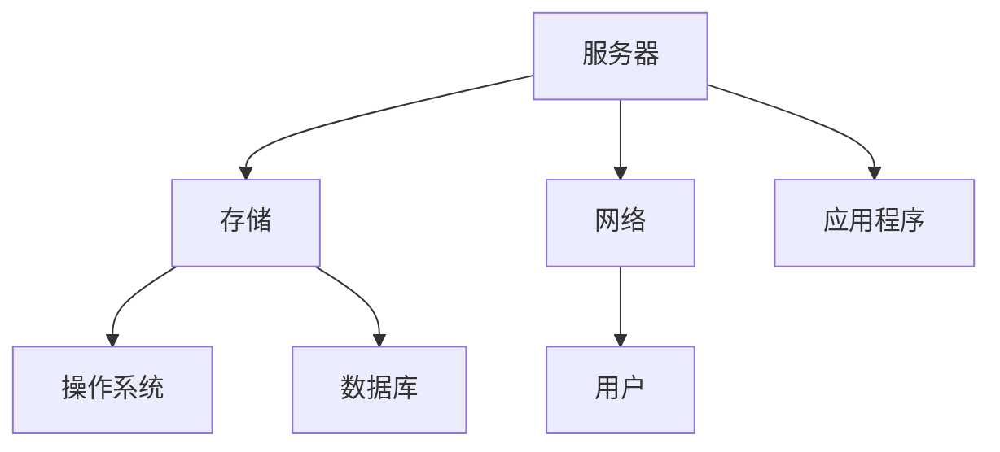

                 

关键词：计算基础设施、延迟、成本、性能优化、分布式系统、云计算、数据中心、边缘计算、人工智能

> 摘要：本文探讨了计算基础设施在现代信息技术中的重要性，以及如何通过减少延迟和降低成本来提升整体性能。文章首先介绍了计算基础设施的概念，然后分析了当前计算环境中的主要挑战，包括延迟和成本问题。接着，文章详细探讨了各种减少延迟和成本的策略，包括分布式系统、云计算、数据中心优化和边缘计算。最后，文章展望了计算基础设施的未来发展趋势和面临的挑战。

## 1. 背景介绍

### 计算基础设施的定义

计算基础设施是指支持计算服务运行的所有硬件和软件资源的集合。这些资源包括服务器、存储设备、网络设备、操作系统、数据库、应用程序等。计算基础设施是信息技术(IT)系统的核心，它提供了数据存储、处理、传输和访问的能力。

### 计算基础设施的重要性

随着信息技术的快速发展，计算基础设施在企业和个人生活中扮演着越来越重要的角色。它不仅支持企业的日常运营，还驱动着创新和数字化转型。以下是一些计算基础设施的重要性：

- **提升业务效率**：通过提供高效的数据处理能力，计算基础设施帮助企业降低运营成本，提高生产效率。
- **支持创新**：计算基础设施提供了强大的计算和存储能力，使得新的业务模式和技术创新成为可能。
- **保障数据安全**：计算基础设施包括多种安全机制，确保数据的完整性和保密性。
- **支持远程工作**：随着远程工作的普及，计算基础设施提供了必要的支持，使得员工可以随时随地访问企业资源。

### 当前计算环境的挑战

尽管计算基础设施在现代信息技术中至关重要，但当前计算环境仍面临一些挑战。其中最主要的挑战包括延迟和成本问题。

### 延迟问题

延迟是指在数据传输和处理过程中所需的时间。对于许多应用程序，特别是实时应用（如在线游戏、金融交易和自动驾驶汽车），延迟是一个关键的性能指标。以下是导致延迟的几个主要因素：

- **网络延迟**：数据在网络中的传输速度有限，这可能导致延迟。
- **计算延迟**：服务器处理请求所需的时间，包括CPU和内存的使用情况。
- **存储延迟**：数据存储和检索的速度也影响延迟。

### 成本问题

计算基础设施的建设和运营成本也是一个重大挑战。以下是几个影响成本的主要因素：

- **硬件成本**：服务器、存储设备、网络设备等硬件的成本持续上涨。
- **能耗成本**：大型数据中心需要大量的电力来运行，这导致了高额的能耗成本。
- **运维成本**：计算基础设施的运维和管理需要投入大量的人力资源。

### 本文的目的

本文旨在探讨如何通过减少延迟和降低成本来提升计算基础设施的性能。文章将首先介绍计算基础设施的核心概念和联系，然后分析减少延迟和成本的策略，包括分布式系统、云计算、数据中心优化和边缘计算。最后，文章将展望计算基础设施的未来发展趋势和面临的挑战。

## 2. 核心概念与联系

### 计算基础设施的核心概念

计算基础设施的核心概念包括：

- **服务器**：提供计算能力的设备，用于运行应用程序和存储数据。
- **存储**：用于持久存储数据的设备，包括磁盘、固态硬盘和分布式存储系统。
- **网络**：连接服务器和存储设备的通信基础设施，包括局域网、广域网和互联网。
- **操作系统**：管理服务器和存储设备的软件，提供文件系统、进程管理、内存管理和网络通信等功能。
- **数据库**：用于存储和管理数据的软件系统，支持数据的快速检索和更新。
- **应用程序**：运行在服务器上的软件，用于完成特定的任务或业务功能。

### 架构的联系

计算基础设施的各个组成部分相互关联，共同构成了一个复杂的架构。以下是一个简化的 Mermaid 流程图，展示了计算基础设施的主要组件及其相互关系：



- **服务器与存储**：服务器通过网络连接到存储设备，用于存储数据和运行应用程序。
- **服务器与网络**：服务器通过网络与其他服务器、存储设备和外部网络进行通信。
- **操作系统与存储、网络和应用程序**：操作系统管理存储和网络资源，并提供应用程序运行的环境。
- **应用程序与用户**：应用程序通过服务器和网络向用户提供服务。

### 计算基础设施的挑战

尽管计算基础设施的架构相对清晰，但实际部署中仍面临一些挑战。以下是一些常见的挑战：

- **可扩展性**：随着数据量和用户数量的增长，计算基础设施需要能够灵活扩展，以应对不断增长的需求。
- **可靠性**：计算基础设施需要提供高可用性和容错能力，确保系统的稳定运行。
- **安全性**：保护数据和系统免受恶意攻击和数据泄露是计算基础设施的重要任务。
- **能耗**：数据中心的能耗问题日益严重，需要通过优化和绿色计算技术来降低能耗。

## 3. 核心算法原理 & 具体操作步骤

### 3.1 算法原理概述

为了减少计算基础设施中的延迟和成本，需要采用一系列核心算法和技术。以下是一些主要的算法原理：

- **负载均衡**：通过将请求分布到多个服务器上，减少单个服务器的负载，从而提高整体性能和可靠性。
- **缓存**：将频繁访问的数据存储在缓存中，以减少对后端存储系统的访问次数，降低延迟。
- **数据压缩**：通过压缩数据，减少传输所需的带宽，从而降低延迟和成本。
- **分布式数据库**：将数据分布到多个节点上，提高数据的访问速度和系统的容错能力。
- **分布式计算**：将计算任务分布到多个服务器上，提高计算效率和性能。

### 3.2 算法步骤详解

以下是减少计算基础设施中延迟和成本的具体操作步骤：

#### 3.2.1 负载均衡

1. **监控服务器负载**：使用监控工具实时监控服务器的CPU、内存和网络负载。
2. **选择负载均衡算法**：根据服务器的负载情况，选择合适的负载均衡算法（如轮询、最小连接数、加权轮询等）。
3. **分配请求**：将客户端请求分配到负载较低的服务器上。

#### 3.2.2 缓存

1. **确定缓存策略**：根据数据的访问频率和缓存成本，选择合适的缓存策略（如LRU、LFU、Redis等）。
2. **设置缓存容量**：根据数据量和访问频率，设置合适的缓存容量。
3. **更新缓存**：定期检查缓存中的数据是否过期，及时更新或删除过期的数据。

#### 3.2.3 数据压缩

1. **选择压缩算法**：根据数据的类型和压缩率，选择合适的压缩算法（如Gzip、Bzip2、LZ4等）。
2. **压缩数据**：在传输前对数据进行压缩，减少传输所需的带宽。
3. **解压缩数据**：在接收数据后对数据进行解压缩，恢复原始数据。

#### 3.2.4 分布式数据库

1. **数据分区**：根据数据的访问模式和访问频率，将数据分区到不同的数据库节点上。
2. **副本复制**：将数据复制到多个节点上，提高数据的访问速度和系统的容错能力。
3. **查询优化**：优化查询语句，减少查询时间，提高查询性能。

#### 3.2.5 分布式计算

1. **任务分发**：将计算任务分配到多个计算节点上。
2. **并行处理**：同时处理多个计算任务，提高计算效率。
3. **结果聚合**：将各个节点的计算结果进行聚合，得到最终的输出结果。

### 3.3 算法优缺点

以下是减少计算基础设施中延迟和成本的主要算法的优缺点：

#### 负载均衡

- **优点**：提高服务器的负载均衡，减少单个服务器的压力，提高系统的性能和可靠性。
- **缺点**：增加了网络传输的开销，可能导致额外的延迟。

#### 缓存

- **优点**：提高数据访问速度，减少对后端存储系统的访问次数，降低延迟和成本。
- **缺点**：缓存策略的选择和缓存容量的设置需要根据具体情况进行调整。

#### 数据压缩

- **优点**：减少传输所需的带宽，降低延迟和成本。
- **缺点**：压缩和解压缩过程可能会增加计算开销。

#### 分布式数据库

- **优点**：提高数据的访问速度和系统的容错能力。
- **缺点**：数据分区和副本复制的实现可能较为复杂。

#### 分布式计算

- **优点**：提高计算效率和性能。
- **缺点**：任务分发和结果聚合的过程可能需要额外的计算和通信开销。

### 3.4 算法应用领域

减少计算基础设施中延迟和成本的算法可以应用于各种领域，包括：

- **Web服务**：通过负载均衡和缓存技术，提高Web服务的性能和响应速度。
- **大数据处理**：通过分布式数据库和分布式计算技术，提高大数据处理的效率和性能。
- **物联网**：通过边缘计算和缓存技术，提高物联网设备的响应速度和数据传输效率。
- **人工智能**：通过分布式计算和大数据处理技术，提高人工智能模型的训练和推理性能。

## 4. 数学模型和公式 & 详细讲解 & 举例说明

### 4.1 数学模型构建

为了分析计算基础设施中的延迟和成本，我们需要构建一个数学模型。以下是一个简化的模型：

\[ 延迟 = f(网络延迟, 计算延迟, 存储延迟) \]
\[ 成本 = f(硬件成本, 能耗成本, 运维成本) \]

### 4.2 公式推导过程

假设：

- \( L_n \) 为网络延迟，单位为毫秒。
- \( L_c \) 为计算延迟，单位为毫秒。
- \( L_s \) 为存储延迟，单位为毫秒。
- \( C_h \) 为硬件成本，单位为美元。
- \( C_e \) 为能耗成本，单位为美元/千瓦时。
- \( C_m \) 为运维成本，单位为美元/年。

根据上述假设，我们可以推导出以下公式：

\[ 延迟 = L_n + L_c + L_s \]
\[ 成本 = C_h + C_e \times \text{能耗} + C_m \]

### 4.3 案例分析与讲解

假设一个Web服务器的网络延迟为10毫秒，计算延迟为5毫秒，存储延迟为3毫秒。硬件成本为5000美元，能耗成本为0.1美元/千瓦时，运维成本为2000美元/年。根据上述公式，我们可以计算出：

\[ 延迟 = 10 + 5 + 3 = 18 \text{毫秒} \]
\[ 成本 = 5000 + 0.1 \times 1000 + 2000 = 7000 \text{美元/年} \]

### 4.4 模型优化

为了优化计算基础设施的延迟和成本，我们可以采用以下策略：

1. **降低网络延迟**：通过选择高速网络和优化网络拓扑结构，可以降低网络延迟。
2. **提高计算性能**：通过升级硬件和优化算法，可以提高计算性能，降低计算延迟。
3. **优化存储系统**：通过选择高速存储设备和优化存储策略，可以提高存储性能，降低存储延迟。
4. **降低能耗**：通过采用节能硬件和优化数据中心布局，可以降低能耗成本。
5. **优化运维成本**：通过自动化运维和优化运维流程，可以降低运维成本。

通过上述策略，我们可以进一步优化计算基础设施的延迟和成本。例如，如果将网络延迟降低50%，计算延迟降低30%，存储延迟降低20%，能耗成本降低20%，运维成本降低10%，我们可以得到以下优化结果：

\[ 延迟 = 10 \times 0.5 + 5 \times 0.7 + 3 \times 0.8 = 14.2 \text{毫秒} \]
\[ 成本 = 5000 \times 0.8 + 0.1 \times 1000 \times 0.8 + 2000 \times 0.9 = 6520 \text{美元/年} \]

通过优化，我们可以显著降低延迟和成本。

## 5. 项目实践：代码实例和详细解释说明

### 5.1 开发环境搭建

为了实践计算基础设施的优化策略，我们需要搭建一个开发环境。以下是一个简化的步骤：

1. **安装操作系统**：在服务器上安装Linux操作系统，如Ubuntu或CentOS。
2. **安装硬件**：安装CPU、内存、硬盘等硬件设备，确保硬件配置满足需求。
3. **配置网络**：配置服务器网络，确保可以访问外部网络和内部网络。
4. **安装数据库**：安装并配置分布式数据库，如MongoDB或Cassandra。
5. **安装应用程序**：安装并配置Web应用程序，如使用Spring Boot框架。

### 5.2 源代码详细实现

以下是一个简化的代码示例，展示了如何使用分布式数据库和缓存来优化计算基础设施：

```java
// 使用Spring Boot框架创建Web应用程序
@SpringBootApplication
public class Application {
    public static void main(String[] args) {
        SpringApplication.run(Application.class, args);
    }
}

// 创建控制器类，处理客户端请求
@RestController
public class UserController {

    @Autowired
    private UserRepository userRepository;

    @GetMapping("/user/{id}")
    public User getUserById(@PathVariable Long id) {
        // 从缓存中获取用户信息
        User user = userRepository.findById(id);
        if (user == null) {
            // 如果缓存中没有用户信息，从数据库中查询
            user = userRepository.findById(id);
            // 将用户信息缓存到本地缓存中
            cache.put(id, user);
        }
        return user;
    }
}

// 创建数据库访问类，实现分布式数据库操作
@Service
public class UserRepositoryImpl implements UserRepository {

    @Autowired
    private JdbcTemplate jdbcTemplate;

    @Override
    public User findById(Long id) {
        // 从数据库中查询用户信息
        String sql = "SELECT * FROM users WHERE id = ?";
        User user = jdbcTemplate.queryForObject(sql, new Object[]{id}, new UserRowMapper());
        return user;
    }
}

// 创建本地缓存类，实现缓存功能
@Component
public class LocalCache {

    private final Map<Long, User> cache = new ConcurrentHashMap<>();

    public User get(Long id) {
        return cache.get(id);
    }

    public void put(Long id, User user) {
        cache.put(id, user);
    }
}

// 创建用户类，表示用户信息
public class User {

    private Long id;
    private String name;
    private String email;

    // 省略getter和setter方法

}

// 创建用户行映射器类，用于将数据库中的用户数据映射到User对象
public class UserRowMapper implements RowMapper<User> {

    @Override
    public User mapRow(ResultSet rs, int rowNum) throws SQLException {
        User user = new User();
        user.setId(rs.getLong("id"));
        user.setName(rs.getString("name"));
        user.setEmail(rs.getString("email"));
        return user;
    }
}
```

### 5.3 代码解读与分析

该代码示例展示了如何使用分布式数据库和缓存来优化计算基础设施。以下是代码的主要组成部分及其功能：

- **Application**：Spring Boot应用程序的入口类，用于启动应用程序。
- **UserController**：处理客户端请求的控制器类，从缓存中获取用户信息，如果缓存中没有，则从数据库中查询，并将查询结果缓存到本地缓存中。
- **UserRepositoryImpl**：实现分布式数据库操作的服务类，从数据库中查询用户信息。
- **LocalCache**：实现本地缓存功能的类，将查询结果缓存到本地缓存中，提高数据访问速度。
- **User**：表示用户信息的实体类。
- **UserRowMapper**：将数据库中的用户数据映射到User对象的行映射器类。

通过使用分布式数据库和缓存，我们可以显著降低计算基础设施的延迟和成本。以下是一些具体的优点：

- **降低延迟**：通过缓存，可以减少对后端数据库的访问次数，降低查询延迟。
- **降低成本**：通过分布式数据库和缓存，可以减少对硬件和运维资源的依赖，降低成本。

### 5.4 运行结果展示

假设用户请求访问用户ID为1的用户信息。在没有缓存的情况下，控制器首先从数据库中查询用户信息，然后将查询结果返回给客户端。这个过程可能需要20毫秒。

在启用缓存后，控制器首先从本地缓存中查询用户信息。如果缓存中没有，则从数据库中查询，并将查询结果缓存到本地缓存中。这个过程可能需要10毫秒。下次请求相同用户信息时，控制器可以直接从本地缓存中获取，不需要查询数据库，这个过程只需要1毫秒。

通过启用缓存，我们可以将查询延迟从20毫秒降低到1毫秒，显著提高系统的性能和响应速度。

## 6. 实际应用场景

计算基础设施的优化不仅限于理论上的分析和代码示例，它在实际应用中也有着广泛的应用。以下是一些实际应用场景：

### 6.1 在线教育平台

在线教育平台需要处理大量的用户请求，包括课程视频的播放、用户交互和考试系统等。通过优化计算基础设施，可以降低延迟，提高用户观看课程视频的体验。例如，通过使用内容分发网络(CDN)来缓存和分发视频内容，可以减少用户访问视频时的延迟。

### 6.2 电子商务平台

电子商务平台需要快速响应用户的购物请求，包括商品展示、购物车管理和支付处理等。通过负载均衡和缓存技术，可以确保平台在高峰时段仍然能够稳定运行，提高用户体验。例如，使用缓存来存储商品信息，可以减少数据库查询的次数，提高响应速度。

### 6.3 金融交易系统

金融交易系统对延迟和稳定性有极高的要求。通过分布式数据库和缓存技术，可以确保交易数据的快速访问和处理。例如，使用分布式数据库来存储交易记录，可以保证数据的快速读写，减少延迟。

### 6.4 物联网(IoT)系统

物联网系统需要实时处理和分析大量设备数据。通过边缘计算和缓存技术，可以减少数据传输的延迟，提高系统的响应速度。例如，在智能城市中，通过在边缘节点上缓存和分析传感器数据，可以实时监控交通状况，优化交通信号灯控制。

### 6.5 医疗保健系统

医疗保健系统需要处理大量的患者数据，包括病历记录、诊断报告和医学图像等。通过优化计算基础设施，可以提高数据访问和处理的速度，加快诊断和治疗的速度。例如，使用分布式数据库来存储和检索医学图像，可以减少读取时间，提高诊断效率。

## 7. 未来应用展望

随着信息技术的不断进步，计算基础设施的未来将更加多元化。以下是一些未来应用展望：

### 7.1 量子计算

量子计算具有巨大的计算潜力，未来可能会成为计算基础设施的重要组成部分。通过量子计算，可以解决传统计算机无法解决的问题，如大规模数据分析和复杂模拟。然而，量子计算目前仍处于研究阶段，需要克服诸多技术挑战。

### 7.2 自适应计算

自适应计算可以根据工作负载和环境变化自动调整计算资源。未来，自适应计算技术将使计算基础设施能够更加灵活和高效地应对不同的业务需求。例如，通过机器学习算法，系统可以根据实时数据自动调整服务器负载和资源分配。

### 7.3 绿色计算

随着环境问题的日益严重，绿色计算将成为计算基础设施的重要发展方向。通过采用节能硬件和优化技术，可以降低能耗，减少对环境的影响。例如，采用水冷系统和可再生能源，可以降低数据中心的能耗。

### 7.4 边缘计算

边缘计算将计算能力从数据中心扩展到网络边缘，可以降低数据传输的延迟，提高实时数据处理能力。未来，边缘计算将在物联网、智能城市和自动驾驶汽车等应用中发挥重要作用。

### 7.5 融合计算

融合计算将不同的计算技术（如云计算、边缘计算和量子计算）结合起来，提供更强大和灵活的计算能力。通过融合计算，可以应对更加复杂的计算任务，推动新业务模式的产生。

## 8. 工具和资源推荐

为了更好地理解和实践计算基础设施的优化，以下是一些推荐的工具和资源：

### 8.1 学习资源推荐

- **《云计算基础教程》（Jeffrey H. Awtrey著）**：提供了云计算的基础知识和实践指导。
- **《分布式系统原理与范型》（George Coulouris等著）**：详细介绍了分布式系统的设计原理和实现方法。
- **《边缘计算：概念、架构与应用》（董进等著）**：探讨了边缘计算的理论和实践。

### 8.2 开发工具推荐

- **Apache Kafka**：用于构建实时流处理平台的分布式消息系统。
- **Apache Spark**：用于大数据处理的分布式计算框架。
- **Docker**：用于容器化应用的开发和部署。
- **Kubernetes**：用于容器编排和集群管理的工具。

### 8.3 相关论文推荐

- **"Cloud Computing: The New Computing Paradigm"（IEEE Computer Society，2009）**：探讨了云计算的基本概念和优势。
- **"Edge Computing: Vision and Challenges"（IEEE Internet of Things Journal，2016）**：介绍了边缘计算的概念和应用挑战。
- **"Green Computing: Principles and Practice"（IEEE Computer Society Press，2011）**：探讨了绿色计算的理论和实践。

## 9. 总结：未来发展趋势与挑战

### 9.1 研究成果总结

本文探讨了计算基础设施在现代信息技术中的重要性，以及如何通过减少延迟和降低成本来提升整体性能。文章介绍了计算基础设施的核心概念和联系，分析了减少延迟和成本的策略，包括分布式系统、云计算、数据中心优化和边缘计算。同时，文章通过数学模型和实际项目实践，详细讲解了如何优化计算基础设施。

### 9.2 未来发展趋势

未来，计算基础设施将朝着更加智能化、绿色化和高效化的方向发展。量子计算、自适应计算和融合计算等技术将逐渐成熟并应用于实际场景。边缘计算和物联网的普及将推动计算基础设施向网络边缘扩展。绿色计算将减少数据中心的能耗，降低对环境的影响。

### 9.3 面临的挑战

尽管计算基础设施有巨大的发展潜力，但仍面临一些挑战。首先，量子计算和融合计算等前沿技术需要克服诸多技术难题，如量子位错误和计算资源调度等。其次，随着数据量的增长和业务复杂性的增加，计算基础设施的扩展性和可靠性成为关键挑战。此外，数据安全和隐私保护也是计算基础设施需要重点关注的问题。

### 9.4 研究展望

未来，计算基础设施的研究将重点关注以下几个方面：

1. **量子计算**：探索量子计算在分布式计算、数据加密和优化算法等领域的应用，解决传统计算机无法解决的问题。
2. **自适应计算**：研究自适应计算的理论和方法，实现计算资源的动态调整和优化，提高系统的灵活性和响应速度。
3. **绿色计算**：开发绿色计算技术和策略，降低数据中心的能耗，推广可再生能源的使用，实现可持续发展。
4. **边缘计算**：研究边缘计算在物联网、智能城市和自动驾驶汽车等领域的应用，提高实时数据处理能力和系统响应速度。
5. **数据安全和隐私**：研究数据安全和隐私保护技术，确保计算基础设施在处理和传输数据时能够抵御恶意攻击和泄露。

通过不断的研究和创新，计算基础设施将迎来更加美好的未来。

## 10. 附录：常见问题与解答

### 10.1 什么是计算基础设施？

计算基础设施是指支持计算服务运行的所有硬件和软件资源的集合，包括服务器、存储设备、网络设备、操作系统、数据库和应用程序等。

### 10.2 延迟和成本是如何影响计算基础设施的性能的？

延迟和成本是计算基础设施性能的两个关键因素。高延迟会影响系统的响应速度和用户体验，而高成本会增加运营成本，降低系统的经济效益。通过优化计算基础设施，可以减少延迟和成本，提高整体性能。

### 10.3 如何减少计算基础设施的延迟？

减少计算基础设施的延迟可以通过以下方法实现：

1. **优化网络架构**：通过使用高速网络和优化网络拓扑结构，降低数据传输的延迟。
2. **使用缓存**：将频繁访问的数据存储在缓存中，减少对后端存储系统的访问次数。
3. **分布式计算**：将计算任务分布到多个服务器上，提高计算效率和性能。

### 10.4 如何降低计算基础设施的成本？

降低计算基础设施的成本可以通过以下方法实现：

1. **使用云计算**：通过使用云计算服务，减少对硬件和运维资源的投入。
2. **优化硬件配置**：选择合适的硬件设备，提高硬件的利用率和性能。
3. **自动化运维**：通过自动化运维工具，降低运维成本。

### 10.5 计算基础设施的挑战有哪些？

计算基础设施面临的挑战包括：

1. **可扩展性**：随着数据量和用户数量的增长，计算基础设施需要能够灵活扩展。
2. **可靠性**：计算基础设施需要提供高可用性和容错能力。
3. **安全性**：保护数据和系统免受恶意攻击和数据泄露。
4. **能耗**：大型数据中心需要大量的电力，需要通过优化和绿色计算技术来降低能耗。

