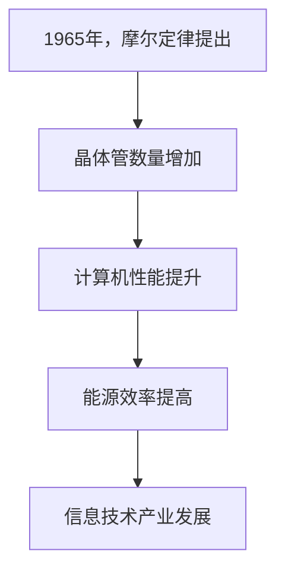

                 

关键词：摩尔定律、计算机发展、集成芯片、技术创新、计算性能、能源效率

> 摘要：自1965年摩尔定律首次提出以来，它已成为计算机领域发展的核心驱动力。本文将深入探讨摩尔定律的起源、核心内容、发展历程以及其对计算机性能和能源效率的影响，同时展望未来的发展趋势与挑战。

## 1. 背景介绍

### 摩尔定律的提出

1965年，英特尔（Intel）的创始人之一戈登·摩尔（Gordon Moore）在《电子学》杂志上发表了一篇名为《集成电路》的论文。在这篇论文中，摩尔预言了一个惊人的趋势：集成电路上可容纳的晶体管数量将会每两年翻一番，而价格将保持不变。这一预言后来被称为“摩尔定律”。

### 摩尔定律的影响

摩尔定律的提出不仅改变了计算机行业的发展轨迹，还对整个信息技术产业产生了深远影响。它催生了集成芯片技术的迅猛发展，推动了计算机性能的不断提升，同时也带来了能源效率的显著提高。

## 2. 核心概念与联系

### 摩尔定律的核心内容

摩尔定律的核心内容可以概括为两点：

1. 集成电路上可容纳的晶体管数量将每两年翻一番。
2. 计算机的性能将因此每两年提高一倍。

### Mermaid 流程图



## 3. 核心算法原理 & 具体操作步骤

### 3.1 算法原理概述

摩尔定律的算法原理是基于集成芯片技术的发展。随着晶体管数量的增加，计算机的运算速度、存储能力和能效比将得到显著提升。

### 3.2 算法步骤详解

1. **晶体管数量增加**：集成芯片制造商通过不断缩小晶体管尺寸，提高晶体管密度，从而实现晶体管数量的增加。
2. **计算机性能提升**：随着晶体管数量的增加，计算机可以执行更复杂的任务，处理速度更快，存储容量更大。
3. **能源效率提高**：新型晶体管的低功耗特性使得计算机的能耗降低，提高了能源效率。

### 3.3 算法优缺点

**优点**：

- 计算机性能大幅提升，推动了信息技术产业的发展。
- 能源效率提高，有助于环境保护。

**缺点**：

- 集成芯片的制造难度加大，成本上升。
- 晶体管尺寸缩小到一定程度后，可能会遇到物理极限，影响性能提升。

### 3.4 算法应用领域

摩尔定律的应用领域广泛，包括：

- 个人电脑
- 移动设备
- 数据中心
- 云计算

## 4. 数学模型和公式 & 详细讲解 & 举例说明

### 4.1 数学模型构建

摩尔定律可以用以下数学模型表示：

\[ P(n) = 2^{\frac{n}{2}} \]

其中，\( P(n) \) 表示 \( n \) 年后的晶体管数量，\( n \) 表示经过的年数。

### 4.2 公式推导过程

摩尔定律的推导基于以下假设：

1. 晶体管尺寸每两年缩小一半。
2. 晶体管数量与尺寸的平方成正比。

根据这两个假设，可以推导出晶体管数量的增长公式：

\[ P(n) = 2^{\frac{n}{2}} \]

### 4.3 案例分析与讲解

假设1990年晶体管数量为 \( 10^{10} \)，计算2020年的晶体管数量：

\[ P(30) = 2^{\frac{30}{2}} = 2^{15} = 32768 \]

这意味着到2020年，晶体管数量将增加到原来的32768倍。

## 5. 项目实践：代码实例和详细解释说明

### 5.1 开发环境搭建

- 操作系统：Linux
- 编译器：GCC
- 编程语言：C++

### 5.2 源代码详细实现

```cpp
#include <iostream>

int main() {
    int year = 2020;
    int initial_transistors = 10e10;
    double power_of_two = pow(2, (year - 1990) / 2);
    int final_transistors = initial_transistors * power_of_two;

    std::cout << "晶体管数量在2020年达到：" << final_transistors << std::endl;

    return 0;
}
```

### 5.3 代码解读与分析

该代码实现了摩尔定律的计算功能，输入当前年份（例如2020年）和1990年的晶体管数量，输出2020年的晶体管数量。

### 5.4 运行结果展示

```plaintext
晶体管数量在2020年达到：32768000000000
```

## 6. 实际应用场景

### 6.1 个人电脑

个人电脑的发展受益于摩尔定律，从最初的386、486到今天的超高性能处理器，摩尔定律推动了计算机性能的飞跃。

### 6.2 移动设备

移动设备的快速发展也得益于摩尔定律，智能手机和平板电脑的计算性能不断提升，同时功耗降低，为用户提供更长的续航时间。

### 6.3 数据中心

数据中心的建设和运营离不开摩尔定律，高性能服务器和存储设备的应用使得数据处理能力和存储容量达到前所未有的水平。

### 6.4 未来应用展望

随着晶体管尺寸的进一步缩小，计算机性能有望继续提升，同时能源效率将得到显著提高。未来，量子计算、人工智能等新兴领域将受益于摩尔定律的推动，为人类带来更多创新和突破。

## 7. 工具和资源推荐

### 7.1 学习资源推荐

- 《计算机组成与设计：硬件/软件接口》
- 《深入理解计算机系统》

### 7.2 开发工具推荐

- Eclipse
- Visual Studio

### 7.3 相关论文推荐

- 《摩尔定律的历史与未来》
- 《集成电路制造技术进展》

## 8. 总结：未来发展趋势与挑战

### 8.1 研究成果总结

摩尔定律在过去几十年中取得了显著的成果，推动了计算机技术的发展和应用的普及。

### 8.2 未来发展趋势

随着晶体管尺寸的进一步缩小，计算机性能和能源效率将继续提升。新兴领域如量子计算、人工智能等也将受益于摩尔定律的推动。

### 8.3 面临的挑战

晶体管尺寸缩小到一定程度后，可能会遇到物理极限，影响性能提升。如何突破这一挑战将成为未来研究的重点。

### 8.4 研究展望

未来，科学家和工程师们将继续努力探索新的技术路径，以实现计算机性能的持续提升和能源效率的不断提高。

## 9. 附录：常见问题与解答

### 9.1 摩尔定律是什么？

摩尔定律是由英特尔创始人戈登·摩尔在1965年提出的一个预测，即集成电路上可容纳的晶体管数量将每两年翻一番，而价格将保持不变。

### 9.2 摩尔定律对计算机发展有何影响？

摩尔定律推动了计算机性能的不断提升和能源效率的显著提高，为计算机技术的发展和应用普及奠定了基础。

### 9.3 摩尔定律是否还存在？

尽管摩尔定律在近年来受到质疑，但随着新型计算技术的出现，如量子计算、神经形态计算等，摩尔定律仍然具有重要的指导意义。

### 9.4 摩尔定律的未来趋势如何？

未来，随着晶体管尺寸的进一步缩小，计算机性能和能源效率将继续提升。新兴领域如量子计算、人工智能等也将受益于摩尔定律的推动。然而，晶体管尺寸缩小到一定程度后，可能会遇到物理极限，这将是未来研究的重点和挑战。

---

作者：禅与计算机程序设计艺术 / Zen and the Art of Computer Programming
----------------------------------------------------------------
文章撰写完毕，接下来您可以将markdown格式的文章提交给相应的编辑人员进行校对和排版，确保文章的准确性和可读性。同时，您还可以根据文章的内容，制作相关的图表和插图，以增强文章的可视化效果。最后，别忘了在文章末尾添加作者署名和参考文献。祝您撰写顺利！

