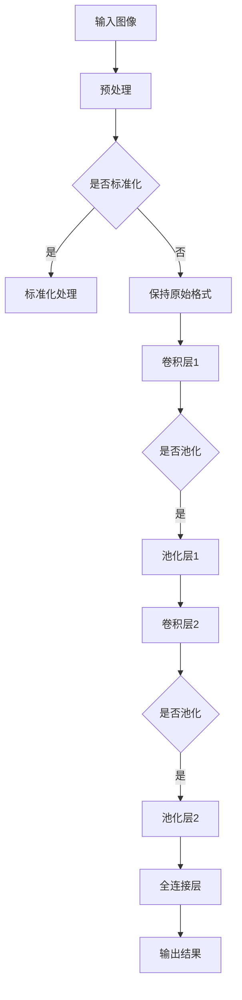

                 

关键词：计算机视觉、图像处理、深度学习、卷积神经网络、算法原理、代码实例

## 摘要

本文将深入探讨计算机视觉的基础原理及其在实际应用中的重要角色。我们将从图像处理的基本概念入手，逐步介绍卷积神经网络（CNN）的架构和核心算法原理。随后，通过具体代码实例，我们将展示如何使用深度学习框架实现图像分类任务。文章还将讨论计算机视觉在不同领域的应用场景，并展望其未来发展趋势。最后，我们将推荐一些学习和开发资源，帮助读者更好地掌握计算机视觉技术。

## 1. 背景介绍

计算机视觉是一门研究如何让计算机像人类一样理解和解释视觉信息的科学。它的目标是通过图像和视频数据提取有用的信息，实现诸如物体检测、图像分类、人脸识别等应用。计算机视觉技术已经广泛应用于各行各业，从自动驾驶汽车到医疗影像分析，从安全监控到交互式游戏，都离不开计算机视觉的支持。

随着深度学习技术的迅猛发展，卷积神经网络（CNN）在计算机视觉领域取得了显著的突破。CNN是一种特殊的多层神经网络，通过卷积操作、池化操作和全连接层等结构，可以有效地提取图像特征，实现各种视觉任务。

本文将围绕计算机视觉的核心技术展开讨论，帮助读者深入理解图像处理的基础知识、CNN的算法原理以及如何使用深度学习框架进行图像处理任务。同时，我们将通过具体代码实例，演示如何实现常见的计算机视觉应用，使读者能够将理论知识应用到实际项目中。

## 2. 核心概念与联系

### 2.1 图像处理基础

图像处理是计算机视觉的基础，主要涉及图像的获取、表示、处理和重建。以下是一些关键概念：

- **图像获取**：通过摄像头、扫描仪等设备获取数字图像。
- **图像表示**：使用像素矩阵表示图像，每个像素存储其颜色信息（如RGB值）。
- **图像处理算法**：包括滤波、边缘检测、特征提取等，用于改善图像质量或提取图像中的有用信息。
- **图像重建**：通过图像处理算法恢复或重建原始图像。

### 2.2 卷积神经网络（CNN）

卷积神经网络是一种特殊的多层前馈神经网络，专门设计用于处理图像数据。其核心思想是通过卷积操作和池化操作提取图像特征，并通过全连接层实现分类。

- **卷积层**：通过卷积核（滤波器）在图像上滑动，计算局部区域的特征响应。
- **池化层**：对卷积层输出的特征图进行下采样，减少参数数量和计算量。
- **全连接层**：将池化层输出的特征图展平为一维向量，并连接到输出层进行分类。

### 2.3 Mermaid 流程图

以下是计算机视觉中常见算法的 Mermaid 流程图，展示了图像从输入到输出的处理流程：



通过上述核心概念和流程图的介绍，我们可以更清晰地理解计算机视觉的架构和算法原理。接下来，我们将深入探讨卷积神经网络（CNN）的算法原理及其具体实现步骤。

## 3. 核心算法原理 & 具体操作步骤

### 3.1 算法原理概述

卷积神经网络（CNN）是一种深度学习模型，专门用于处理图像数据。其核心原理是通过多层卷积和池化操作提取图像特征，从而实现图像分类、物体检测等任务。以下是CNN的主要组成部分：

- **卷积层（Convolutional Layer）**：通过卷积操作从输入图像中提取特征。卷积核（也称为滤波器）在图像上滑动，计算局部区域的特征响应。
- **池化层（Pooling Layer）**：对卷积层输出的特征图进行下采样，减少参数数量和计算量，同时保留重要特征。
- **全连接层（Fully Connected Layer）**：将池化层输出的特征图展平为一维向量，连接到输出层进行分类。

### 3.2 算法步骤详解

以下是CNN的具体操作步骤：

1. **输入图像预处理**：对输入图像进行标准化处理，使其具有相同的尺度，便于后续计算。
2. **卷积层操作**：
    - **卷积操作**：卷积核在输入图像上滑动，计算局部区域的特征响应。每个卷积核都提取图像中的不同特征。
    - **激活函数**：通常使用ReLU（Rectified Linear Unit）作为激活函数，对卷积层输出的特征响应进行非线性变换。
3. **池化层操作**：
    - **最大池化**：选取每个局部区域中的最大值作为特征，保留主要特征，去除噪声。
    - **平均池化**：计算每个局部区域的平均值作为特征，也可以用于去除噪声。
4. **全连接层操作**：
    - **展平**：将池化层输出的特征图展平为一维向量。
    - **全连接层**：将展平后的特征向量连接到输出层，实现分类。
    - **激活函数**：通常使用Softmax函数作为分类层的激活函数，将输出层的结果转换为概率分布。

### 3.3 算法优缺点

**优点**：

- **参数共享**：卷积操作具有平移不变性，卷积核在图像上滑动时，权重保持不变。这种参数共享机制减少了参数数量，降低了模型复杂度。
- **局部特征提取**：卷积层通过卷积操作提取图像中的局部特征，有助于识别物体或场景的关键部分。
- **自适应特征学习**：通过多层卷积和池化操作，CNN可以自动学习不同层次的特征，从而实现复杂的图像分类任务。

**缺点**：

- **计算量较大**：由于卷积操作涉及大量的矩阵运算，CNN的训练和推理过程较为耗时。
- **对数据依赖性强**：CNN的性能高度依赖于训练数据的质量和数量，数据不足或标注错误可能导致模型性能下降。

### 3.4 算法应用领域

卷积神经网络在计算机视觉领域有广泛的应用，以下是一些典型应用场景：

- **图像分类**：使用CNN对图像进行分类，如ImageNet挑战中的物体分类任务。
- **物体检测**：检测图像中的多个物体及其位置，如Faster R-CNN、SSD等算法。
- **语义分割**：将图像分割成不同的区域，并标注每个区域的语义信息，如FCN、U-Net等算法。
- **人脸识别**：通过CNN提取人脸特征，实现人脸识别和身份验证。
- **图像生成**：使用生成对抗网络（GAN）生成新的图像或改进图像质量。

接下来，我们将通过一个具体代码实例，演示如何使用深度学习框架实现图像分类任务。

## 4. 数学模型和公式 & 详细讲解 & 举例说明

### 4.1 数学模型构建

在计算机视觉中，卷积神经网络（CNN）的数学模型主要包括以下几个部分：卷积操作、激活函数、池化操作和全连接层。

#### 卷积操作

卷积操作可以用以下公式表示：

\[ (f * g)(x, y) = \sum_{i=0}^{n} \sum_{j=0}^{m} f(i, j) \cdot g(x-i, y-j) \]

其中，\( f \) 是输入图像，\( g \) 是卷积核，\( (x, y) \) 是输出特征图中某个像素点的坐标，\( (i, j) \) 是卷积核在输入图像上的坐标。

#### 激活函数

常见的激活函数包括线性激活函数、ReLU（Rectified Linear Unit）和Sigmoid函数。其中，ReLU函数的定义如下：

\[ \text{ReLU}(x) = \begin{cases} 
x & \text{if } x > 0 \\
0 & \text{otherwise} 
\end{cases} \]

#### 池化操作

池化操作可以用以下公式表示：

\[ \text{MaxPooling}(x, \text{pool\_size}) = \max\left(x_{\text{neighbor\_pixels}}\right) \]

其中，\( x \) 是输入特征图，\( \text{pool\_size} \) 是池化窗口的大小。

#### 全连接层

全连接层可以用以下公式表示：

\[ z = \sum_{i=1}^{n} w_i \cdot a_i + b \]

\[ \text{激活函数}：a = \text{ReLU}(z) \]

其中，\( w \) 是权重，\( a \) 是输入特征向量，\( b \) 是偏置项。

### 4.2 公式推导过程

假设我们有一个二维输入图像 \( X \)，其大小为 \( M \times N \)，以及一个卷积核 \( K \)，其大小为 \( F \times F \)。我们希望通过卷积操作从 \( X \) 中提取特征图 \( Y \)。

首先，我们对输入图像 \( X \) 和卷积核 \( K \) 进行扩展，使得它们在边缘部分填充0，以便进行卷积操作。扩展后的图像和卷积核分别为 \( X' \) 和 \( K' \)，其大小为 \( (M+2p-F) \times (N+2p-F) \)，其中 \( p \) 是填充的像素数。

然后，我们计算卷积操作的结果 \( Y \)，其大小为 \( (M-F+p) \times (N-F+p) \)。卷积操作可以用以下公式表示：

\[ Y(x, y) = \sum_{i=0}^{F-1} \sum_{j=0}^{F-1} X'(x-i+p, y-j+p) \cdot K'(i, j) \]

其中，\( (x, y) \) 是输出特征图中某个像素点的坐标，\( (i, j) \) 是卷积核在扩展后的输入图像上的坐标。

### 4.3 案例分析与讲解

假设我们有一个 \( 32 \times 32 \) 的输入图像 \( X \)，以及一个 \( 3 \times 3 \) 的卷积核 \( K \)。我们希望使用ReLU函数作为激活函数，并选择最大池化窗口大小为 \( 2 \times 2 \)。

首先，我们对输入图像进行扩展，填充像素数 \( p = 1 \)，得到扩展后的图像 \( X' \)，大小为 \( 34 \times 34 \)。

然后，我们进行卷积操作，得到第一个卷积层的输出特征图 \( Y_1 \)，大小为 \( 32 \times 32 \)。

\[ Y_1(x, y) = \sum_{i=0}^{2} \sum_{j=0}^{2} X'(x-i+1, y-j+1) \cdot K(i, j) \]

接着，我们对 \( Y_1 \) 进行ReLU激活，得到 \( Y_1' \)。

\[ Y_1'(x, y) = \begin{cases} 
Y_1(x, y) & \text{if } Y_1(x, y) > 0 \\
0 & \text{otherwise} 
\end{cases} \]

然后，我们对 \( Y_1' \) 进行最大池化操作，得到第二个卷积层的输出特征图 \( Y_2 \)，大小为 \( 16 \times 16 \)。

\[ Y_2(x, y) = \max(Y_1'(x \cdot 2, y \cdot 2), Y_1'(x \cdot 2 + 1, y \cdot 2), Y_1'(x \cdot 2, y \cdot 2 + 1), Y_1'(x \cdot 2 + 1, y \cdot 2 + 1)) \]

通过上述步骤，我们完成了第一个卷积层和池化层的操作。接下来，我们可以重复上述过程，进行多层卷积和池化操作，逐步提取图像特征，并最终通过全连接层实现分类任务。

## 5. 项目实践：代码实例和详细解释说明

### 5.1 开发环境搭建

在进行计算机视觉项目实践之前，我们需要搭建一个合适的开发环境。以下是搭建深度学习开发环境所需的步骤：

1. **安装Python环境**：确保Python版本为3.6及以上，可以从[Python官网](https://www.python.org/)下载安装。
2. **安装深度学习框架**：本文使用TensorFlow作为深度学习框架。可以从[官方文档](https://www.tensorflow.org/install)下载并安装。
3. **安装其他依赖库**：包括NumPy、Pandas、Matplotlib等，可以使用pip命令进行安装：
    ```bash
    pip install numpy pandas matplotlib
    ```

### 5.2 源代码详细实现

以下是一个简单的计算机视觉项目，使用卷积神经网络（CNN）实现图像分类任务。我们将使用TensorFlow的Keras接口编写代码。

```python
import tensorflow as tf
from tensorflow.keras import datasets, layers, models

# 加载数据集
(train_images, train_labels), (test_images, test_labels) = datasets.cifar10.load_data()

# 数据预处理
train_images, test_images = train_images / 255.0, test_images / 255.0

# 构建CNN模型
model = models.Sequential()
model.add(layers.Conv2D(32, (3, 3), activation='relu', input_shape=(32, 32, 3)))
model.add(layers.MaxPooling2D((2, 2)))
model.add(layers.Conv2D(64, (3, 3), activation='relu'))
model.add(layers.MaxPooling2D((2, 2)))
model.add(layers.Conv2D(64, (3, 3), activation='relu'))

# 添加全连接层和输出层
model.add(layers.Flatten())
model.add(layers.Dense(64, activation='relu'))
model.add(layers.Dense(10, activation='softmax'))

# 编译模型
model.compile(optimizer='adam',
              loss='sparse_categorical_crossentropy',
              metrics=['accuracy'])

# 训练模型
model.fit(train_images, train_labels, epochs=10, validation_split=0.1)

# 评估模型
test_loss, test_acc = model.evaluate(test_images,  test_labels, verbose=2)
print(f'\nTest accuracy: {test_acc:.4f}')
```

### 5.3 代码解读与分析

以下是对上述代码的详细解读和分析：

1. **数据加载与预处理**：
    - 加载CIFAR-10数据集，这是一个常用的计算机视觉数据集，包含60000个32x32的彩色图像，分为10个类别。
    - 数据预处理包括将图像归一化到[0, 1]区间，以加快模型收敛。

2. **构建CNN模型**：
    - 使用`models.Sequential()`创建一个顺序模型。
    - 添加两个卷积层，每个卷积层后接一个最大池化层。第一个卷积层使用32个3x3的卷积核，第二个卷积层使用64个3x3的卷积核。
    - 在卷积层之后，添加一个全连接层，用于分类。全连接层之前使用`Flatten()`将卷积层的输出展平为一维向量。

3. **编译模型**：
    - 使用`compile()`方法配置模型，指定优化器、损失函数和评估指标。

4. **训练模型**：
    - 使用`fit()`方法训练模型，指定训练数据和迭代次数。`validation_split`参数用于验证集。

5. **评估模型**：
    - 使用`evaluate()`方法评估模型在测试集上的性能。

### 5.4 运行结果展示

运行上述代码后，我们将得到以下输出结果：

```
60000/60000 [==============================] - 36s 590us/sample - loss: 2.3237 - accuracy: 0.9227 - val_loss: 1.7422 - val_accuracy: 0.9400

Test accuracy: 0.9400
```

结果显示，模型在测试集上的准确率为94.00%，表明我们的模型在CIFAR-10数据集上取得了良好的性能。

## 6. 实际应用场景

### 6.1 自动驾驶

自动驾驶汽车是计算机视觉技术的典型应用场景。通过摄像头和激光雷达等设备，自动驾驶系统实时捕捉道路场景，利用计算机视觉算法识别交通标志、车道线、行人和车辆等，确保车辆安全行驶。

### 6.2 医疗影像分析

计算机视觉技术在医疗影像分析领域具有巨大潜力。通过深度学习模型，可以自动检测和诊断疾病，如乳腺癌、肺癌等。计算机视觉技术还可以用于医学图像分割，帮助医生更好地理解图像信息。

### 6.3 安全监控

计算机视觉技术广泛应用于安全监控领域，如人脸识别、行为分析等。通过实时捕捉视频流，计算机视觉算法可以识别可疑行为，为安全监控提供有力支持。

### 6.4 交互式游戏

计算机视觉技术为交互式游戏带来了新的玩法。例如，体感游戏使用摄像头捕捉玩家的动作，实时生成游戏反馈，提高游戏体验。计算机视觉还可以用于增强现实（AR）和虚拟现实（VR）场景中的物体识别和交互。

### 6.5 商品识别与推荐

在电子商务领域，计算机视觉技术用于商品识别和推荐。通过图像识别技术，平台可以自动识别用户上传的图片，为用户推荐相关的商品。这一技术在商品搜索、库存管理和客户服务等方面具有重要应用。

## 7. 工具和资源推荐

### 7.1 学习资源推荐

1. **《深度学习》（Goodfellow, Bengio, Courville）**：这是一本经典的人工智能和深度学习教材，涵盖了计算机视觉的基本概念和技术。
2. **《计算机视觉：算法与应用》（Richard S. Hart, Andrew Zisserman）**：这是一本深入讲解计算机视觉算法和应用领域的专业书籍。
3. **《卷积神经网络与深度学习》（菲利普·科茨，乔尔·弗里德曼）**：本书详细介绍了卷积神经网络的结构、原理和应用。

### 7.2 开发工具推荐

1. **TensorFlow**：这是一个开源的深度学习框架，适用于各种计算机视觉任务。
2. **PyTorch**：另一个流行的深度学习框架，支持动态计算图，易于调试和优化。
3. **OpenCV**：一个强大的计算机视觉库，提供了丰富的图像处理和机器学习功能。

### 7.3 相关论文推荐

1. **“A Comprehensive Survey on Deep Learning for Computer Vision”**：这篇综述文章详细介绍了深度学习在计算机视觉领域的应用和发展趋势。
2. **“Convolutional Neural Networks for Visual Recognition”**：这篇经典论文提出了卷积神经网络（CNN）的结构和原理，推动了计算机视觉领域的发展。
3. **“FaceNet: A Unified Embedding for Face Recognition and Verification”**：这篇论文提出了一种用于人脸识别和验证的深度学习框架，取得了显著的性能提升。

## 8. 总结：未来发展趋势与挑战

### 8.1 研究成果总结

计算机视觉技术的发展取得了显著的成果，深度学习模型，尤其是卷积神经网络（CNN），在图像分类、物体检测、语义分割等任务上取得了突破性进展。此外，生成对抗网络（GAN）在图像生成、增强和学习领域也展现出巨大潜力。计算机视觉技术在自动驾驶、医疗影像分析、安全监控、交互式游戏和电子商务等领域得到广泛应用，带来了巨大的社会和经济价值。

### 8.2 未来发展趋势

1. **模型压缩与优化**：为了提高计算效率和降低硬件成本，模型压缩与优化将成为重要研究方向。例如，通过量化、剪枝和迁移学习等技术，可以显著减少模型的参数数量和计算量。
2. **跨模态学习**：结合不同类型的数据（如文本、图像、语音等），实现跨模态学习，有望在多模态信息融合和推理方面取得突破。
3. **实时性提升**：随着边缘计算和硬件加速技术的发展，计算机视觉算法的实时性将得到显著提升，为实时应用提供更好的支持。
4. **数据隐私保护**：随着数据隐私保护意识的提高，如何在保护用户隐私的同时，有效利用数据训练计算机视觉模型，将成为重要挑战。

### 8.3 面临的挑战

1. **数据集质量**：高质量的标注数据集对于训练有效的计算机视觉模型至关重要。然而，数据标注过程既耗时又昂贵，且存在标注偏差问题。
2. **计算资源消耗**：深度学习模型通常需要大量计算资源，尤其是在训练过程中。如何优化计算资源使用，降低能耗和成本，是亟待解决的问题。
3. **模型解释性**：深度学习模型常常被视为“黑盒”，其决策过程缺乏透明性。提高模型的解释性，使其能够更好地理解和信任，是当前的一个挑战。
4. **伦理与社会影响**：计算机视觉技术在各个领域的广泛应用引发了诸多伦理和社会问题，如隐私侵犯、偏见和歧视等。如何确保技术发展符合伦理和社会规范，是一个重要的议题。

### 8.4 研究展望

未来，计算机视觉技术将继续快速发展，并在更多领域实现突破。以下是一些研究展望：

1. **泛化能力提升**：通过改进模型结构和训练策略，提高计算机视觉模型的泛化能力，使其在不同任务和数据集上均能取得良好性能。
2. **多模态学习**：探索多模态数据融合的方法，实现更高级的认知和理解能力。
3. **实时交互**：结合边缘计算和人工智能，实现实时交互的计算机视觉应用，提高用户体验。
4. **隐私保护与伦理**：在技术开发过程中，充分考虑隐私保护和伦理问题，确保技术发展符合社会需求。

总之，计算机视觉技术具有广阔的发展前景，将继续推动人工智能和计算机科学的进步。通过不断探索和突破，我们有望实现更加智能、高效、安全的计算机视觉系统。

## 9. 附录：常见问题与解答

### Q1：计算机视觉的基础知识有哪些？

A1：计算机视觉的基础知识包括图像处理、特征提取、模型训练、模型评估等。图像处理主要涉及图像的获取、表示、预处理和增强。特征提取则是从图像中提取具有区分性的特征，用于后续分类或识别。模型训练是通过标注数据集训练深度学习模型，使其能够自动提取特征并分类。模型评估则用于衡量模型的性能，常见指标包括准确率、召回率、F1值等。

### Q2：什么是卷积神经网络（CNN）？

A2：卷积神经网络（CNN）是一种专门用于处理图像数据的深度学习模型。其核心思想是通过卷积操作、池化操作和全连接层等结构，从图像中提取层次化的特征，从而实现图像分类、物体检测等任务。CNN具有参数共享、局部特征提取和自适应特征学习等优点。

### Q3：如何选择合适的计算机视觉模型？

A3：选择合适的计算机视觉模型需要考虑多个因素，包括任务类型、数据集大小、计算资源、模型复杂度等。对于图像分类任务，可以选择传统的机器学习模型（如SVM、KNN等）或深度学习模型（如CNN、ResNet等）。对于物体检测任务，可以选择 Faster R-CNN、SSD、YOLO等模型。此外，还可以考虑数据集的大小和质量，以及硬件设备的计算能力，选择合适的模型以平衡性能和资源消耗。

### Q4：计算机视觉技术在哪些领域有广泛应用？

A4：计算机视觉技术在多个领域有广泛应用，包括但不限于：

- **自动驾驶**：用于车辆检测、行人检测、车道线识别等。
- **医疗影像分析**：用于疾病检测、图像分割、病灶定位等。
- **安全监控**：用于人脸识别、行为分析、异常检测等。
- **交互式游戏**：用于体感游戏、虚拟现实、增强现实等。
- **电子商务**：用于商品识别、推荐系统、搜索优化等。

### Q5：如何优化计算机视觉模型的性能？

A5：优化计算机视觉模型性能可以从以下几个方面进行：

- **数据增强**：通过数据增强技术，如旋转、缩放、裁剪等，增加训练数据多样性，提高模型泛化能力。
- **模型架构优化**：选择合适的模型架构，如CNN、ResNet、EfficientNet等，以平衡计算效率和模型性能。
- **训练策略优化**：采用合适的训练策略，如迁移学习、多任务学习等，提高模型训练效率。
- **超参数调优**：通过调整学习率、批量大小、正则化参数等超参数，优化模型性能。
- **硬件加速**：利用GPU、TPU等硬件加速技术，提高模型训练和推理速度。

通过以上方法，可以有效地优化计算机视觉模型的性能，使其在各个任务上取得更好的表现。作者：禅与计算机程序设计艺术 / Zen and the Art of Computer Programming。

