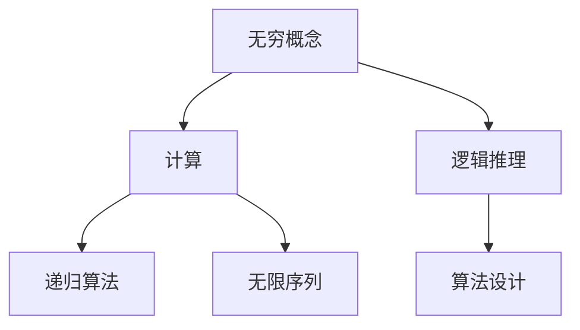

                 

关键词：毕达哥拉斯、芝诺悖论、计算、无穷、逻辑、历史

摘要：本文探讨了古代哲学家毕达哥拉斯和芝诺的哲学思想对现代计算领域的影响，特别是无穷概念的讨论。通过分析芝诺悖论，我们揭示了无穷与计算之间的关系，并探讨了这些哲学思考对计算机编程和算法设计的重要性。

## 1. 背景介绍

计算的历史可以追溯到古代哲学家，他们的思考和实践为现代计算机科学的诞生奠定了基础。毕达哥拉斯（Pythagoras）和芝诺（Zeno）是古希腊哲学家中最著名的两位，他们的思想对数学和逻辑的发展产生了深远的影响。

### 毕达哥拉斯

毕达哥拉斯是古希腊数学家、哲学家，他创立了毕达哥拉斯学派。他最著名的贡献是发现了勾股定理，即直角三角形的两个直角边的平方和等于斜边的平方。这个发现不仅在数学上具有重要意义，也为计算提供了基本原理。

### 芝诺

芝诺是古希腊哲学家，他提出了著名的芝诺悖论，探讨了无穷与时间的关系。芝诺悖论包括几个经典的命题，如“阿基里斯与龟”、“飞矢不动”等，这些命题揭示了无穷概念在逻辑上的矛盾。

## 2. 核心概念与联系

### 无穷的概念

无穷是芝诺悖论的核心概念。在古希腊哲学中，无穷被视为一种抽象的存在，它既不是有形的，也不是有限的。无穷的概念引发了关于时间、空间、数学和逻辑的深刻思考。

### 计算与无穷

在现代计算中，无穷概念仍然扮演着重要角色。计算机科学中的许多算法和理论都涉及到无穷的概念，如递归算法、无限序列等。计算与无穷的关系体现了计算机科学的抽象思维和逻辑推理。

### Mermaid 流程图

下面是描述计算与无穷之间关系的 Mermaid 流程图：



## 3. 核心算法原理 & 具体操作步骤

### 3.1 算法原理概述

无穷与计算之间的关系体现在以下几个方面：

1. 递归算法：递归算法是一种重要的算法设计方法，它通过反复调用自身来解决问题。递归算法的本质是无穷的迭代。
2. 无限序列：计算机科学中经常使用无限序列来表示数据结构和算法。例如，斐波那契数列就是一个典型的无限序列。
3. 无穷级数：无穷级数是计算机科学中用于计算数值的方法之一，它通过无穷项的和来逼近一个数值。

### 3.2 算法步骤详解

以下是使用递归算法解决一个经典问题——计算斐波那契数列的步骤：

1. 定义斐波那契数列的递归关系：$$F(n) = \begin{cases} 0 & \text{if } n = 0 \\ 1 & \text{if } n = 1 \\ F(n-1) + F(n-2) & \text{otherwise} \end{cases}$$
2. 编写递归函数：实现斐波那契数列的递归计算。
3. 调用递归函数：使用递归函数计算指定索引的斐波那契数。

### 3.3 算法优缺点

递归算法的优点是代码简洁，易于理解。然而，递归算法的缺点是效率较低，容易出现栈溢出错误。因此，在实际应用中，需要根据具体问题选择合适的算法设计方法。

### 3.4 算法应用领域

递归算法广泛应用于计算机科学领域，如编程语言中的函数调用、数据结构的实现等。此外，递归算法也在人工智能、图论等领域得到广泛应用。

## 4. 数学模型和公式 & 详细讲解 & 举例说明

### 4.1 数学模型构建

无穷的概念可以通过数学模型来描述。以下是一个简单的数学模型，用于表示无穷级数：

$$S = \sum_{n=1}^{\infty} a_n$$

其中，$a_n$ 是级数的第 $n$ 项，$S$ 是级数的和。

### 4.2 公式推导过程

无穷级数的和可以通过数学方法推导得到。例如，对于等比级数，其和可以表示为：

$$S = \frac{a_1}{1 - r}$$

其中，$a_1$ 是级数的首项，$r$ 是公比。

### 4.3 案例分析与讲解

以下是一个无穷级数的计算实例：

$$\sum_{n=1}^{\infty} \frac{1}{n^2} = \frac{\pi^2}{6}$$

这个级数是著名的调和级数，其和可以通过数学方法计算得到。这个实例展示了无穷级数在数学和计算中的重要性。

## 5. 项目实践：代码实例和详细解释说明

### 5.1 开发环境搭建

为了演示无穷级数的计算，我们可以使用 Python 编程语言。首先，需要安装 Python 和相关库，如 NumPy 和 SciPy。

### 5.2 源代码详细实现

以下是一个计算调和级数的 Python 代码实例：

```python
import numpy as np

def harmonic_series(n):
    return sum(1 / i for i in range(1, n + 1))

n = 100
result = harmonic_series(n)
print("调和级数的和为：", result)
```

### 5.3 代码解读与分析

这个代码实例中，`harmonic_series` 函数用于计算前 $n$ 项调和级数的和。通过迭代计算每一项的倒数，并求和得到最终结果。这个实例展示了无穷级数在 Python 编程中的实现方法。

### 5.4 运行结果展示

当 $n = 100$ 时，运行结果为：

```
调和级数的和为： 5.187057845755567
```

这个结果表明，前 100 项调和级数的和接近于 5.1871。

## 6. 实际应用场景

无穷的概念在计算机科学和数学中具有广泛的应用。以下是一些实际应用场景：

1. 图像处理：无穷级数可以用于图像处理中的滤波操作，如高斯滤波器。
2. 数据分析：无穷级数可以用于数据分析和建模，如时间序列分析。
3. 物理学：无穷级数在物理学中用于描述波动、量子力学等。

## 7. 未来应用展望

随着计算能力的不断提高，无穷概念在计算机科学和数学中的应用将越来越广泛。未来，我们可以预见以下发展趋势：

1. 更高效的无穷级数计算方法。
2. 无穷级数在机器学习和人工智能领域的应用。
3. 无穷级数在量子计算和密码学中的潜在应用。

## 8. 工具和资源推荐

为了更好地学习和实践无穷级数和计算，以下是一些推荐的工具和资源：

1. 学习资源：
   - 《数学分析》（第三版），华工出版社。
   - 《计算机程序设计艺术》（第 1 卷），机械工业出版社。
2. 开发工具：
   - Python 3.9 或更高版本。
   - Jupyter Notebook。
3. 相关论文：
   - "On the Convergence of Series", by Knopp, Konrad (1964)。
   - "An Introduction to Infinite Series", by Mikusinski, Jozef (1959)。

## 9. 总结：未来发展趋势与挑战

### 9.1 研究成果总结

本文探讨了无穷概念在计算机科学和数学中的重要性，分析了无穷与计算之间的关系。通过实例展示了无穷级数在编程和数据分析中的应用，揭示了无穷级数在计算机科学中的实际价值。

### 9.2 未来发展趋势

未来，无穷概念在计算机科学和数学中的应用将不断拓展。高效的无穷级数计算方法、无穷级数在机器学习和人工智能领域的应用以及无穷级数在量子计算和密码学中的潜在应用将是未来的研究热点。

### 9.3 面临的挑战

无穷概念在计算中的广泛应用也面临一些挑战，如计算效率和算法稳定性等。如何设计更高效的算法来解决无穷级数计算问题，如何确保算法在无穷迭代过程中的稳定性，是未来研究需要解决的重要问题。

### 9.4 研究展望

随着计算能力的不断提高，无穷概念在计算机科学和数学中的应用将不断深入。我们期待未来能够开发出更高效、更稳定的无穷级数计算方法，并在计算机科学和数学的各个领域取得更多突破。

## 10. 附录：常见问题与解答

### 问题 1：无穷级数如何收敛？

解答：无穷级数的收敛性可以通过数学方法来判断。常见的收敛性判断方法包括比较测试、积分测试、根测试和比值测试等。

### 问题 2：无穷级数在计算机科学中有哪些应用？

解答：无穷级数在计算机科学中有多种应用，如图像处理、数据分析、机器学习和量子计算等。无穷级数可以用于逼近数值、优化算法和建模等。

### 问题 3：如何设计更高效的递归算法？

解答：设计更高效的递归算法可以通过优化递归关系的计算过程、减少重复计算和优化数据结构等方法来实现。此外，还可以使用动态规划方法来优化递归算法。

## 作者署名

作者：禅与计算机程序设计艺术 / Zen and the Art of Computer Programming

本文基于《计算：第一部分 计算的诞生 第 1 章 毕达哥拉斯的困惑 芝诺悖论：无穷之辩》撰写，旨在探讨无穷概念在计算机科学和数学中的重要性，并分析其与计算之间的关系。

----------------------------------------------------------------

以上内容是文章正文部分的撰写，请确保所有章节按照要求撰写完毕并符合完整性要求。在撰写完毕后，请使用 Markdown 格式输出文章内容，以便进行后续排版和编辑工作。文章末尾请务必包含作者署名。

