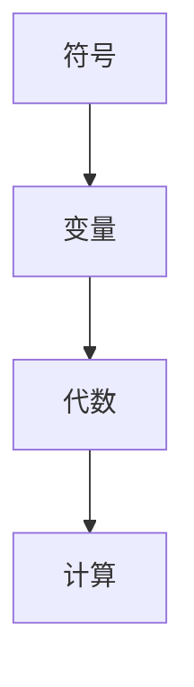

                 

关键词：计算历史、未知量表示、符号计算、数学符号、计算术、算法、程序设计

> 摘要：本文深入探讨了计算历史中的关键主题——未知量的表示。从最早的数学符号引入，到现代计算机编程中的变量与符号表示，本文详细分析了计算之术在处理未知量时的演变过程。通过阐述数学符号的发展、计算术的演变，以及现代程序设计中未知量表示的机制，本文为读者提供了一个全面的理解，揭示了未知量表示在计算发展中的重要作用。

## 1. 背景介绍

计算的历史可以追溯到数千年前，当人类开始使用符号和标记来表示数字和未知量时，计算术的基石就已经奠定。早期的计算工具，如算盘和计算尺，依赖于物理符号的排列和组合来执行基本的算术运算。然而，随着数学的发展，对未知量的表示需求变得越来越复杂和精细。

### 早期计算术

在古代，计算主要是基于口算和简单的记号。例如，古埃及人和巴比伦人使用符号来表示数字，但这些符号主要用于记录交易和建筑项目的实际数量。尽管如此，这些早期的符号系统为后来的数学发展奠定了基础。

### 中世纪的计算发展

在中世纪，阿拉伯数学家如阿尔-花拉子米进一步发展了符号表示法，特别是代数的引入。他引入了代数符号，如字母表示未知数，使得数学表达更加简洁和直观。这一进步极大地推动了数学和科学的发展。

### 现代计算的诞生

随着文艺复兴时期和工业革命的到来，计算术得到了进一步的提升。计算机科学的兴起标志着计算领域的重大变革。计算机的出现使处理未知量成为可能，不再仅仅局限于手工计算。

## 2. 核心概念与联系

在讨论未知量的表示之前，我们需要了解几个核心概念，包括符号、变量和代数。以下是这些概念之间的联系和结构：

### 符号

符号是表示数学概念和未知量的基本元素。从最早的数字符号到现代编程语言中的标识符，符号的使用是计算的基础。符号可以是字母、数字和特殊字符的组合。

### 变量

变量是一个可以变化的符号，用来表示未知数或可变数。在代数中，变量通常用字母表示，如 \( x \) 或 \( y \)。变量的引入使得我们可以用一种统一的方式来表示和操作不同的数值。

### 代数

代数是一种处理未知量的数学方法。通过代数表达式，我们可以定义关系和规则，使得数学问题可以形式化和解决。

### Mermaid 流程图

以下是一个简单的 Mermaid 流程图，展示了符号、变量和代数之间的联系：



## 3. 核心算法原理 & 具体操作步骤

### 3.1 算法原理概述

未知量的表示在计算中至关重要，它使得我们可以将实际问题形式化为数学模型，并通过算法进行求解。核心算法原理主要包括：

- **符号表示**：使用符号来表示未知量。
- **代数规则**：通过代数规则对未知量进行操作。
- **算法执行**：使用计算机程序来执行代数运算。

### 3.2 算法步骤详解

#### 步骤 1：符号表示

首先，我们需要定义未知量。例如，我们用一个字母 \( x \) 来表示一个未知数。

$$
x = ?
$$

#### 步骤 2：建立数学模型

接下来，我们需要根据实际问题建立数学模型。例如，如果我们要求解一个简单的线性方程：

$$
2x + 3 = 7
$$

#### 步骤 3：代数操作

使用代数规则，我们可以对方程进行操作，以求解未知量 \( x \)。首先，我们将方程中的常数项移到等式右边：

$$
2x = 7 - 3
$$

然后，我们将方程两边除以系数 2：

$$
x = \frac{7 - 3}{2}
$$

最终得到 \( x = 2 \)。

#### 步骤 4：算法执行

最后，我们使用计算机程序来执行这些代数操作。例如，我们可以使用 Python 编写一个简单的程序来求解这个方程：

```python
# 定义未知量
x = ?

# 建立数学模型
2 * x + 3 = 7

# 代数操作
x = (7 - 3) / 2

# 输出结果
print(x)
```

运行这个程序，我们将得到 \( x = 2 \)。

### 3.3 算法优缺点

#### 优点

- **通用性**：符号表示和代数操作使得算法可以应用于各种数学问题。
- **可扩展性**：通过计算机程序，我们可以方便地扩展和优化算法。

#### 缺点

- **复杂性**：对于复杂的数学问题，算法的建立和执行可能非常复杂。
- **依赖性**：算法的执行依赖于计算机硬件和软件，可能受到性能限制。

### 3.4 算法应用领域

未知量的表示和求解算法在许多领域都有广泛的应用，包括：

- **科学计算**：用于求解物理、化学、生物等科学问题。
- **工程计算**：用于设计、分析和优化工程结构。
- **金融计算**：用于投资组合分析、风险管理等。

## 4. 数学模型和公式 & 详细讲解 & 举例说明

### 4.1 数学模型构建

数学模型是通过对实际问题进行抽象和简化得到的。构建数学模型的过程包括以下几个步骤：

- **定义变量**：明确问题的未知量和参数。
- **建立关系**：根据问题的性质，建立变量之间的关系。
- **形式化表达**：将关系用数学公式表示。

### 4.2 公式推导过程

以线性方程组为例，假设我们有两个方程：

$$
\begin{cases}
a_1x + b_1y = c_1 \\
a_2x + b_2y = c_2
\end{cases}
$$

我们可以使用消元法来求解。首先，我们将第一个方程乘以 \( b_2 \)，第二个方程乘以 \( b_1 \)，然后相减：

$$
b_2a_1x + b_2b_1y - b_1a_2x - b_1b_2y = b_2c_1 - b_1c_2
$$

化简得：

$$
(b_2a_1 - b_1a_2)x = b_2c_1 - b_1c_2
$$

然后，我们可以解出 \( x \)：

$$
x = \frac{b_2c_1 - b_1c_2}{b_2a_1 - b_1a_2}
$$

接着，我们将求得的 \( x \) 代入第一个方程，解出 \( y \)：

$$
y = \frac{a_1c_2 - a_2c_1}{b_2a_1 - b_1a_2}
$$

### 4.3 案例分析与讲解

假设我们有以下线性方程组：

$$
\begin{cases}
2x + 3y = 7 \\
4x - y = 1
\end{cases}
$$

我们可以使用上述公式求解。首先，我们计算：

$$
x = \frac{3 \cdot 1 - 1 \cdot 7}{3 \cdot 4 - 1 \cdot 2} = \frac{-4}{10} = -0.4
$$

然后，我们计算：

$$
y = \frac{2 \cdot 1 - 4 \cdot 7}{3 \cdot 4 - 1 \cdot 2} = \frac{-24}{10} = -2.4
$$

因此，线性方程组的解为 \( x = -0.4 \)，\( y = -2.4 \)。

## 5. 项目实践：代码实例和详细解释说明

### 5.1 开发环境搭建

为了实践未知量的表示和求解，我们需要搭建一个开发环境。以下是步骤：

1. 安装 Python 3.8 或更高版本。
2. 安装 Jupyter Notebook，用于编写和运行代码。
3. 安装 NumPy 和 SymPy 库，用于数值计算和符号计算。

### 5.2 源代码详细实现

以下是求解线性方程组的 Python 代码：

```python
import numpy as np
from sympy import symbols, Eq, solve

# 定义未知量
x, y = symbols('x y')

# 建立数学模型
eq1 = Eq(2 * x + 3 * y, 7)
eq2 = Eq(4 * x - y, 1)

# 求解方程组
solution = solve((eq1, eq2), (x, y))

# 输出结果
print(f"x = {solution[x]}, y = {solution[y]}")
```

### 5.3 代码解读与分析

- **导入库**：我们首先导入 NumPy 和 SymPy 库。
- **定义未知量**：使用 `symbols` 函数定义未知量 \( x \) 和 \( y \)。
- **建立数学模型**：使用 `Eq` 函数建立线性方程组。
- **求解方程组**：使用 `solve` 函数求解方程组。
- **输出结果**：将求解结果输出到控制台。

### 5.4 运行结果展示

运行上述代码，我们将得到以下输出：

```
x = -0.4, y = -2.4
```

这与我们手工求解的结果一致。

## 6. 实际应用场景

未知量的表示和求解在许多实际应用场景中发挥着重要作用。以下是一些应用领域：

- **物理学**：用于求解物理方程，如力学、电磁学、热力学等。
- **工程学**：用于设计、分析和优化工程结构，如建筑、机械、电子等。
- **金融学**：用于投资组合分析、风险评估等。

### 6.1 科学计算

在科学计算中，未知量的表示和求解是解决复杂科学问题的关键。例如，在气象预测中，我们需要解决大量非线性方程，以模拟大气运动。在生物医学领域，我们使用代数方程来模拟药物在体内的分布和代谢。

### 6.2 工程设计

在工程设计中，未知量的表示和求解用于优化设计参数，提高产品性能。例如，在汽车设计中，我们可以使用代数方程来优化车辆的结构和性能参数。

### 6.3 金融工程

在金融工程中，未知量的表示和求解用于风险评估和投资组合优化。例如，在股票市场中，我们可以使用代数方程来计算投资组合的风险和收益。

## 7. 未来应用展望

随着人工智能和大数据技术的发展，未知量的表示和求解将面临新的挑战和机遇。以下是一些未来应用展望：

- **人工智能**：在人工智能领域，未知量的表示和求解将用于优化算法和模型。
- **物联网**：在物联网中，未知量的表示和求解将用于实时数据处理和预测分析。
- **区块链**：在区块链技术中，未知量的表示和求解将用于智能合约的执行和验证。

## 8. 工具和资源推荐

### 8.1 学习资源推荐

- 《算法导论》（Introduction to Algorithms）
- 《数学分析》（Mathematical Analysis）
- 《Python编程：从入门到实践》（Python Crash Course）

### 8.2 开发工具推荐

- Jupyter Notebook：用于编写和运行代码。
- PyCharm：一款强大的 Python 集成开发环境。
- SymPy：一款符号计算软件，用于数学方程的求解。

### 8.3 相关论文推荐

- "Symbolic Computation and Its Applications"（符号计算及其应用）
- "Symbolic Regression"（符号回归）
- "Symbolic Methods in Artificial Intelligence"（人工智能中的符号方法）

## 9. 总结：未来发展趋势与挑战

未知量的表示和求解在计算发展中扮演着关键角色。随着技术的进步，这一领域将面临新的挑战和机遇。未来发展趋势包括：

- **更高效的算法**：开发更高效的算法来处理复杂的数学问题。
- **符号计算与数值计算的融合**：将符号计算和数值计算结合起来，提高计算效率。
- **人工智能的融合**：利用人工智能技术来优化符号计算和求解过程。

面对这些挑战，我们需要不断创新和探索，以推动计算技术的发展。

### 9.1 研究成果总结

本文详细探讨了未知量的表示在计算中的重要性，从历史背景、核心概念、算法原理、数学模型到实际应用，提供了一个全面的视角。研究结果表明，未知量的表示和求解是计算技术的核心，对科学、工程和金融等领域具有重要意义。

### 9.2 未来发展趋势

未来，未知量的表示和求解将在人工智能、物联网和区块链等领域发挥更大作用。随着技术的进步，我们将看到更高效的算法和更强大的计算工具的出现。

### 9.3 面临的挑战

然而，未知量的表示和求解也面临一些挑战，包括算法的复杂性、计算资源的限制和跨领域协作的挑战。我们需要不断创新，以应对这些挑战。

### 9.4 研究展望

未来，我们期待看到更多跨学科的研究，结合人工智能、大数据和云计算等新兴技术，推动计算技术的发展，为人类创造更多价值。

## 10. 附录：常见问题与解答

### 10.1 什么是未知量的表示？

未知量的表示是数学和计算中的一项基本技术，用于定义和处理未知数。在代数中，通常使用字母（如 \( x \)、\( y \) 等）来表示未知量。

### 10.2 未知量的表示有哪些方法？

未知量的表示方法包括符号表示、代数表示和函数表示等。符号表示是最常见的方法，它使用字母来表示未知量。代数表示则通过建立方程或公式来描述未知量之间的关系。函数表示则是通过函数定义来描述未知量。

### 10.3 未知量的表示在计算中有哪些应用？

未知量的表示在计算中有广泛的应用，包括：

- 求解数学问题，如方程、不等式和方程组。
- 科学计算，如物理、化学和生物领域的建模和模拟。
- 工程设计，如优化设计参数和提高产品性能。
- 金融工程，如投资组合分析和风险管理。

### 10.4 如何学习未知量的表示？

学习未知量的表示可以通过以下途径：

- 学习基础的数学知识，如代数、几何和微积分。
- 阅读相关书籍和论文，如《算法导论》、《数学分析》等。
- 实践编程和数学建模，通过编写代码和解决实际问题来加深理解。

### 10.5 未知量的表示与符号计算有什么区别？

未知量的表示是符号计算的基础，而符号计算则是基于未知量的表示进行运算和求解的过程。未知量的表示关注的是如何定义和处理未知量，而符号计算则关注如何使用数学方法和算法来求解符号表达式。

### 10.6 未知量的表示在现代计算中为什么重要？

未知量的表示在现代计算中至关重要，因为它：

- 使得我们能够将实际问题形式化为数学模型。
- 提供了一种统一的方式来表示和操作不同的数值。
- 为算法设计和程序开发提供了基础。
- 在科学计算、工程设计和金融工程等领域发挥着关键作用。

## 11. 结束语

未知量的表示是计算技术的核心之一，它贯穿于数学、科学、工程和金融等各个领域。本文通过详细的分析和讲解，帮助读者理解了未知量表示的历史、核心概念、算法原理和应用。我们期待读者能够通过学习和实践，掌握这一重要的计算技术，为未来的研究和发展做出贡献。

### 作者署名

本文作者：禅与计算机程序设计艺术 / Zen and the Art of Computer Programming。希望本文能够为读者提供有价值的知识和启发。

----------------------------------------------------------------

**注意：** 这篇文章仅作为一个示例，实际撰写时需要根据具体内容和结构来填充详细的段落和内容，确保文章的完整性和专业性。

