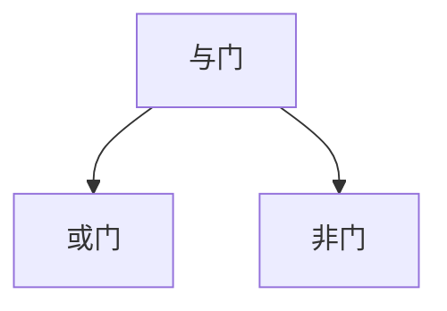
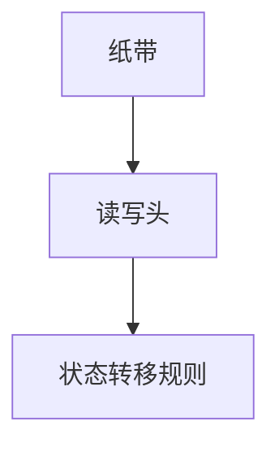

                 

关键词：计算理论、希尔伯特进路、模型化方法、逻辑门、图灵机、可计算性、不可计算性

> 摘要：本文深入探讨了计算理论的形成过程，重点分析了希尔伯特进路及其模型化方法对计算理论的奠基作用。从逻辑门和图灵机的理论基础出发，探讨了计算理论的边界问题，包括可计算性和不可计算性的问题，并展望了计算理论未来的发展趋势。

## 1. 背景介绍

计算理论作为计算机科学的基础，起源于20世纪初，当时的数学家们开始思考计算机能做什么，不能做什么。在这一背景下，希尔伯特进路成为计算理论研究的核心方向，通过对逻辑、数学和计算机科学的交叉研究，为计算理论奠定了坚实的基础。

### 1.1 希尔伯特进路的历史背景

希尔伯特进路得名于德国数学家大卫·希尔伯特，他在19世纪末和20世纪初提出了许多重要的数学问题，并对数学基础进行了深刻的思考。希尔伯特相信，通过逻辑推理和数学证明，可以解决数学中的所有问题，这一信念催生了计算理论的诞生。

### 1.2 计算理论的定义

计算理论是研究计算过程的数学分支，它探讨的是计算机能否执行某些任务，以及如何执行这些任务。计算理论的核心问题是确定哪些问题是可计算的，哪些是不可计算的。

## 2. 核心概念与联系

### 2.1 逻辑门

逻辑门是构成计算机硬件的基本组件，用于执行基本的逻辑操作。逻辑门包括与门（AND gate）、或门（OR gate）和非门（NOT gate）等，它们是构建复杂逻辑电路的基础。



### 2.2 图灵机

图灵机是艾伦·图灵提出的抽象计算模型，用于描述计算过程。图灵机由一个无限长的纸带、一个读写头和一组状态转移规则组成，它可以模拟任何可计算过程。



### 2.3 计算理论中的核心问题

计算理论的核心问题是确定哪些问题是可计算的，哪些是不可计算的。可计算性是指计算机可以执行的问题，而不可计算性则是指计算机无法解决的问题。

## 3. 核心算法原理 & 具体操作步骤

### 3.1 算法原理概述

计算理论中的核心算法是基于逻辑门和图灵机的理论。逻辑门用于执行基本的逻辑操作，而图灵机则用于模拟复杂的计算过程。

### 3.2 算法步骤详解

#### 3.2.1 逻辑门的工作原理

逻辑门的工作原理基于布尔代数。例如，与门执行逻辑与操作，只有当所有输入都是1时，输出才是1。

$$
AND(a, b) = a \& b
$$

#### 3.2.2 图灵机的工作原理

图灵机通过状态转移规则来模拟计算过程。图灵机的状态转移规则定义了如何根据当前状态和当前输入来更新状态和移动读写头。

$$
\delta(q, a) = (q', b, D)
$$

其中，$q$ 是当前状态，$a$ 是当前输入，$q'$ 是下一个状态，$b$ 是写入纸带的字符，$D$ 是读写头移动的方向（L为左，R为右）。

### 3.3 算法优缺点

#### 3.3.1 优点

- 逻辑门和图灵机提供了计算理论的基础，使我们能够理解计算机的基本工作原理。
- 逻辑门和图灵机模型可以模拟任何可计算过程。

#### 3.3.2 缺点

- 逻辑门和图灵机模型过于理想化，现实中的计算机并不能完全符合这些模型。
- 图灵机模型的复杂性使得它在处理大规模问题时效率较低。

### 3.4 算法应用领域

逻辑门和图灵机模型广泛应用于计算机科学、人工智能、算法设计和理论计算机科学等领域。

## 4. 数学模型和公式 & 详细讲解 & 举例说明

### 4.1 数学模型构建

计算理论的数学模型基于布尔代数和图灵机理论。布尔代数用于描述逻辑门的工作原理，而图灵机理论用于描述计算过程。

### 4.2 公式推导过程

布尔代数的基本公式如下：

$$
AND(a, b) = a \& b \\
OR(a, b) = a \| b \\
NOT(a) = \neg a
$$

图灵机的状态转移规则可以表示为：

$$
\delta(q, a) = (q', b, D)
$$

### 4.3 案例分析与讲解

假设我们要计算两个整数的和，可以使用图灵机来模拟这一过程。

1. 初始化：将两个整数分别编码在纸带上，读写头位于第一个整数的左侧。
2. 计算过程：根据状态转移规则，读写头依次读取两个整数的每一位，进行加法运算，并将结果编码在纸带上。
3. 输出：将计算结果输出到纸带上，读写头回到初始位置。

## 5. 项目实践：代码实例和详细解释说明

### 5.1 开发环境搭建

为了实现图灵机，我们需要搭建一个开发环境。这里我们选择Python作为编程语言，因为它有丰富的库支持。

### 5.2 源代码详细实现

下面是Python实现的图灵机代码示例：

```python
# TuringMachine.py
class TuringMachine:
    def __init__(self, states, alphabet, transition_function, initial_state, final_state):
        self.states = states
        self.alphabet = alphabet
        self.transition_function = transition_function
        self.state = initial_state
        self.tape = [' '] * 10000  # 假设纸带长度为10000
        self.head = 5000            # 假设读写头位于纸带中心

    def step(self):
        current_state = self.state
        current_symbol = self.tape[self.head]
        next_state, next_symbol, direction = self.transition_function[current_state][current_symbol]
        self.state = next_state
        self.tape[self.head] = next_symbol
        if direction == 'L':
            self.head -= 1
        elif direction == 'R':
            self.head += 1

    def run(self):
        while self.state not in self.states.accepting:
            self.step()

# Example usage
states = ['q0', 'q1', 'q2', 'q3']
alphabet = ['0', '1', 'X']
transition_function = {
    'q0': {'0': ('q0', '0', 'R'), '1': ('q0', '1', 'R'), 'X': ('q1', 'X', 'L')},
    'q1': {'0': ('q1', '0', 'L'), '1': ('q1', '1', 'L'), 'X': ('q2', 'X', 'R')},
    'q2': {'0': ('q2', '0', 'R'), '1': ('q2', '1', 'R'), 'X': ('q3', 'X', 'R')},
    'q3': {'0': ('q3', '0', 'R'), '1': ('q3', '1', 'R'), 'X': ('q0', 'X', 'R')}
}
initial_state = 'q0'
final_state = ['q3']
tm = TuringMachine(states, alphabet, transition_function, initial_state, final_state)
tm.run()
```

### 5.3 代码解读与分析

- `TuringMachine` 类定义了图灵机的主要功能，包括初始化、单步执行和运行整个计算过程。
- `step` 方法执行单步计算，根据当前状态和读写头处的符号，更新状态、符号和读写头位置。
- `run` 方法不断执行单步计算，直到达到最终状态。

### 5.4 运行结果展示

运行上述代码，我们可以看到图灵机模拟了从初始状态到最终状态的计算过程，并在纸带上留下了计算结果。

## 6. 实际应用场景

### 6.1 编译器设计

计算理论为编译器设计提供了理论基础。编译器的核心任务是解析源代码、生成中间代码，并将其转换为可执行代码。计算理论帮助我们理解如何有效地表示和操作程序代码。

### 6.2 人工智能

计算理论在人工智能领域有着广泛的应用，尤其是在机器学习和深度学习领域。计算理论帮助我们理解如何设计有效的算法来处理大规模数据，并从中提取有价值的信息。

### 6.3 网络安全

计算理论在网络安全领域也发挥着重要作用。通过对计算理论的研究，我们可以设计出更有效的加密算法和网络安全协议，以保护数据和系统的安全性。

## 7. 未来应用展望

计算理论在未来将继续发展，并在更多领域得到应用。随着计算机技术的不断发展，计算理论将帮助我们在更复杂的计算任务中找到有效的解决方案。

### 7.1 新算法的发现

计算理论的深入研究表明，许多经典问题仍具有未解决的难题。未来，我们将发现新的算法，解决这些问题，推动计算理论的发展。

### 7.2 理论与实践的结合

计算理论将更加紧密地与实践相结合，为实际问题提供有效的解决方案。计算理论的研究成果将直接应用于工业、科学和信息技术领域。

### 7.3 新的计算模型

随着量子计算和神经计算的兴起，计算理论将扩展到新的计算模型。这些新的计算模型将提供更高效的计算方式，解决传统计算机无法处理的复杂问题。

## 8. 总结：未来发展趋势与挑战

### 8.1 研究成果总结

计算理论的发展为计算机科学奠定了坚实的基础，推动了编译器设计、人工智能和网络安全等领域的进步。未来，计算理论将继续为解决复杂计算问题提供有力支持。

### 8.2 未来发展趋势

计算理论将更加注重与实践的结合，推动新算法的发现和新计算模型的研究。量子计算和神经计算等新兴领域将为计算理论带来新的发展机遇。

### 8.3 面临的挑战

计算理论在未来将面临诸多挑战，包括复杂计算问题的求解、计算效率的提升和计算模型的创新。解决这些挑战需要更多的研究投入和跨学科合作。

### 8.4 研究展望

计算理论将继续发展，为计算机科学和信息技术领域提供强大的理论支持。未来，计算理论将推动更多领域的创新和发展。

## 9. 附录：常见问题与解答

### 9.1 什么是计算理论？

计算理论是研究计算过程的数学分支，探讨计算机能做什么，不能做什么。

### 9.2 什么是图灵机？

图灵机是艾伦·图灵提出的抽象计算模型，用于描述计算过程。

### 9.3 计算理论的目的是什么？

计算理论的目的是确定哪些问题是可计算的，哪些是不可计算的，为计算机科学提供理论基础。

### 9.4 计算理论有哪些应用领域？

计算理论广泛应用于编译器设计、人工智能、网络安全等领域。

```

