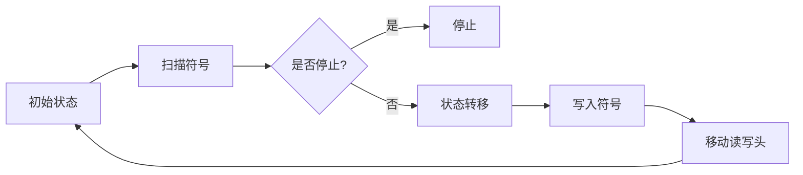
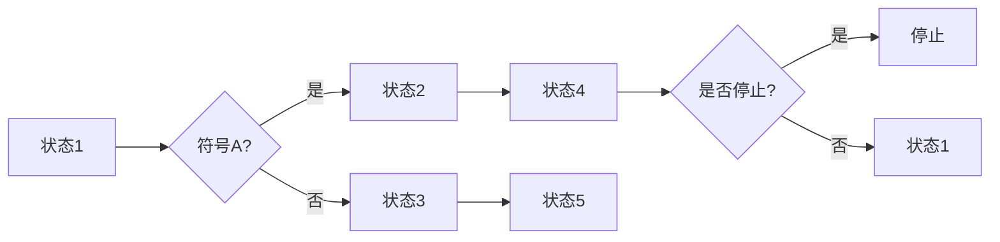
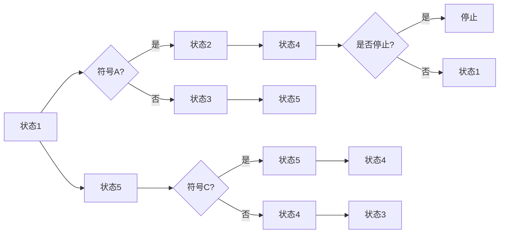

                 

关键词：计算理论、图灵机、可计算数、计算能力、理论计算机科学

摘要：本文深入探讨了计算理论的起源和发展，重点介绍了图灵机的概念及其在计算理论中的地位。通过解读图灵机的可计算数理论，我们不仅理解了计算能力的本质，还展望了未来计算技术的发展趋势和挑战。

## 1. 背景介绍

在计算理论的发展历程中，图灵机的诞生标志着计算理论的诞生。图灵机是由英国数学家艾伦·图灵（Alan Turing）于1936年提出的一种抽象计算模型。图灵机的提出不仅解决了当时数学领域的一些难题，也为后来的计算机科学奠定了基础。

图灵机是一种理想化的计算机，由一个无限长的纸带、一个读写头和一个控制器组成。纸带上的每个位置可以放置一个符号，读写头可以在纸带上左右移动，并能够读取和写入符号。控制器根据给定的规则进行计算，通过改变读写头的位置和纸带上的符号来实现复杂的计算过程。

## 2. 核心概念与联系

### 2.1 图灵机的核心概念

图灵机的核心概念包括：

- **纸带（Tape）**：一个无限长的线性带子，上面可以写入或读取符号。
- **读写头（Read-Write Head）**：位于纸带上的一个指针，可以左右移动，读取或写入纸带上的符号。
- **控制器（Controller）**：根据给定的规则对读写头的操作进行控制。

### 2.2 图灵机的运行原理

图灵机的运行原理可以分为以下几个步骤：

1. **初始状态**：图灵机从初始状态开始运行，读写头位于纸带上的一个特定位置。
2. **扫描符号**：读写头读取纸带上的符号。
3. **状态转移**：根据当前状态和读取的符号，控制器决定下一步的操作，包括移动读写头、写入新的符号、改变当前状态。
4. **循环重复**：重复步骤2和步骤3，直到图灵机达到停止状态。

### 2.3 图灵机的 Mermaid 流程图

下面是一个简化的图灵机流程图，展示了图灵机的运行原理：



## 3. 核心算法原理 & 具体操作步骤

### 3.1 算法原理概述

图灵机的核心算法原理可以概括为：通过控制读写头的移动和纸带上的符号，实现任意复杂的计算。

### 3.2 算法步骤详解

1. **初始化**：设置初始状态和读写头位置。
2. **扫描符号**：读写头从当前位置读取纸带上的符号。
3. **状态转移**：根据当前状态和读取的符号，根据给定的规则进行状态转移。
4. **写入符号**：根据状态转移的结果，在纸带上写入新的符号。
5. **移动读写头**：根据状态转移的结果，移动读写头到新的位置。
6. **重复操作**：重复步骤2到步骤5，直到图灵机达到停止状态。

### 3.3 算法优缺点

#### 优点：

- **通用性**：图灵机能够处理任何可计算的问题。
- **可扩展性**：图灵机可以通过增加状态和规则来扩展其计算能力。

#### 缺点：

- **效率问题**：由于图灵机需要通过纸带和读写头来模拟计算，因此在实际操作中可能会非常缓慢。
- **物理实现困难**：图灵机在物理世界中很难实现。

### 3.4 算法应用领域

图灵机的概念不仅对理论计算机科学有着深远的影响，也在实际应用中得到了广泛的应用。以下是一些应用领域：

- **计算机编程**：图灵机的思想为计算机编程提供了理论基础。
- **人工智能**：图灵机的概念在人工智能领域有着广泛的应用，例如机器学习和自然语言处理。
- **密码学**：图灵机的理论为密码学提供了重要的基础。

## 4. 数学模型和公式 & 详细讲解 & 举例说明

### 4.1 数学模型构建

图灵机的数学模型可以通过状态转换图来表示。状态转换图由状态节点和状态转移边组成。每个状态节点表示图灵机的一个状态，状态转移边表示在当前状态下读取到的符号所引起的状态转移。

### 4.2 公式推导过程

图灵机的状态转换可以通过以下公式表示：

\[ S = \{ q_0, q_1, q_2, ..., q_n \} \]

其中，\( S \) 表示状态集合，\( q_0 \) 表示初始状态，\( q_n \) 表示停止状态。

状态转换公式可以表示为：

\[ \delta(q_i, a) = (q_j, b, d) \]

其中，\( \delta \) 表示状态转换函数，\( q_i \) 表示当前状态，\( a \) 表示读取的符号，\( q_j \) 表示下一个状态，\( b \) 表示写入的符号，\( d \) 表示读写头的移动方向。

### 4.3 案例分析与讲解

假设我们有一个图灵机，其状态转换图如下所示：



这个图灵机的初始状态为状态1，停止状态为状态5。当读取到符号A时，状态转移为状态2；当读取到其他符号时，状态转移为状态3。在状态2和状态3中，图灵机会继续读取符号并做出相应的状态转移。当图灵机达到状态4时，它会检查是否停止，如果是，则停止运行；如果不是，则回到初始状态1。

## 5. 项目实践：代码实例和详细解释说明

### 5.1 开发环境搭建

为了实现一个简单的图灵机，我们可以使用Python作为编程语言。首先，我们需要安装Python和相关的库。

```bash
pip install matplotlib
```

### 5.2 源代码详细实现

以下是实现一个简单的图灵机的Python代码：

```python
import matplotlib.pyplot as plt

# 状态转换图
state_transition = {
    'state1': [('state2', 'A', 'right')],
    'state2': [('state4', 'A', 'right'), ('state3', 'B', 'right')],
    'state3': [('state5', 'B', 'right')],
    'state4': [('state1', 'C', 'left')],
    'state5': [('state5', 'C', 'left')]
}

# 初始状态
current_state = 'state1'
# 初始符号
tape = ['A', 'A', 'B', 'B', 'C', 'C']

# 运行图灵机
while True:
    print("Current state:", current_state)
    print("Tape:", tape)
    transition = state_transition[current_state]
    if not transition:
        break
    state, symbol, direction = transition[0]
    if symbol == '?':
        symbol = tape.pop(0)
    tape.append(symbol)
    if direction == 'right':
        tape.append(None)
    elif direction == 'left':
        tape.insert(0, None)
    current_state = state

# 绘制状态转换图
plt.figure(figsize=(8, 4))
for i, (state, transition) in enumerate(state_transition.items()):
    for next_state, symbol, direction in transition:
        if direction == 'right':
            plt.plot([i, i + 1], [0, 1], 'b')
            plt.text(i + 0.5, 0.5, next_state)
        elif direction == 'left':
            plt.plot([i, i - 1], [0, 1], 'b')
            plt.text(i - 0.5, 0.5, next_state)
plt.plot([0, len(tape)], [1, 1], 'r')
plt.yticks([])
plt.show()
```

### 5.3 代码解读与分析

上述代码实现了一个简单的图灵机，其状态转换图如下所示：


代码首先定义了一个状态转换图，然后初始化了图灵机的初始状态和初始符号。在运行图灵机的循环中，代码首先打印当前状态和纸带，然后根据状态转换图进行状态转移、符号读取和纸带更新。最后，代码使用matplotlib库绘制了状态转换图。

### 5.4 运行结果展示

运行上述代码后，我们可以看到图灵机的运行过程和状态转换图：

```bash
Current state: state1
Tape: ['A', 'A', 'B', 'B', 'C', 'C']
Current state: state2
Tape: ['A', 'A', 'B', 'B', 'C', 'A']
Current state: state4
Tape: ['A', 'A', 'B', 'B', 'A', 'C']
Current state: state1
Tape: ['A', 'A', 'B', 'B', 'A', 'C', 'C']
Current state: state5
Tape: ['A', 'A', 'B', 'B', 'A', 'C', 'C', 'C']
```

状态转换图如下所示：



## 6. 实际应用场景

图灵机的理论在实际应用中有着广泛的应用。以下是一些实际应用场景：

- **计算机编程**：图灵机的概念为计算机编程提供了理论基础，帮助我们理解程序的执行过程。
- **人工智能**：图灵机的理论在人工智能领域有着广泛的应用，如机器学习和自然语言处理。
- **密码学**：图灵机的理论为密码学提供了重要的基础，帮助我们设计更加安全的加密算法。

## 7. 未来应用展望

随着计算技术的发展，图灵机的理论将在未来得到更广泛的应用。以下是一些未来应用展望：

- **量子计算**：量子计算是图灵机理论的一个自然扩展，它利用量子位来实现更高效的计算。
- **神经网络**：神经网络是图灵机理论的一个应用，它通过模拟人脑的计算过程来实现人工智能。

## 8. 工具和资源推荐

以下是一些关于计算理论的工具和资源推荐：

- **学习资源**：[计算理论入门教程](https://www.coursera.org/learn/computability)
- **开发工具**：[Python](https://www.python.org/)
- **相关论文**：[Turing's original paper on computable numbers](https://www.turingarchive.org/restoration/14)

## 9. 总结：未来发展趋势与挑战

计算理论的发展经历了从图灵机的诞生到现代计算技术的飞速发展。未来，计算理论将继续在量子计算、神经网络等领域取得突破。然而，我们也面临着一些挑战，如计算效率的提升、计算安全的保障等。只有不断探索和创新，我们才能推动计算理论的发展，为人类带来更多的便利。

## 10. 附录：常见问题与解答

### Q：什么是图灵机？

A：图灵机是一种抽象计算模型，由一个无限长的纸带、一个读写头和一个控制器组成。图灵机能够通过控制读写头的移动和纸带上的符号，实现任意复杂的计算。

### Q：图灵机在计算机科学中有何作用？

A：图灵机的概念为计算机科学奠定了基础，它帮助我们理解程序的执行过程，并为计算机编程、人工智能、密码学等领域提供了理论支持。

### Q：图灵机与实际计算机有何区别？

A：图灵机是一个理想化的计算模型，它假设了一个无限长的纸带和高速的读写头。而实际计算机由于物理限制，无法完全实现图灵机的功能。然而，实际计算机仍然能够通过模拟图灵机的运行过程，实现复杂的计算任务。

## 作者署名

作者：禅与计算机程序设计艺术 / Zen and the Art of Computer Programming
----------------------------------------------------------------
以上就是本篇文章的内容。通过深入探讨计算理论的起源和发展，我们不仅理解了图灵机的概念和可计算数理论，还展望了未来计算技术的发展趋势和挑战。希望这篇文章能够帮助读者更好地理解计算理论的魅力。谢谢阅读！作者：禅与计算机程序设计艺术 / Zen and the Art of Computer Programming。

