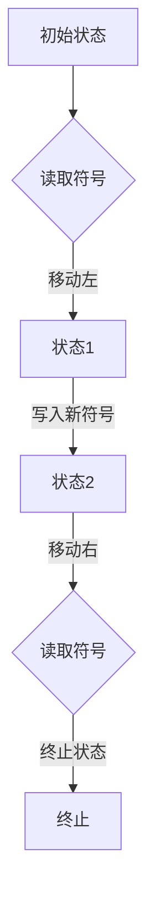

                 

关键词：计算理论、计算模型、图灵机、可计算性、算法复杂度、数学模型、计算机程序设计艺术

摘要：本文深入探讨了计算理论的起源、核心概念和形成过程。通过分析图灵机的概念及其对计算理论的贡献，我们探讨了计算理论的基本原理。同时，本文还对算法复杂度、数学模型及其在计算机程序设计中的应用进行了详细讲解。通过这些内容，我们旨在为读者提供一个关于计算理论全面而深入的视角。

## 1. 背景介绍

计算理论作为计算机科学的基石，起源于20世纪30年代。当时，数学家们开始探讨计算机能否执行各种数学任务，这引发了对计算本质的研究。在这一背景下，艾伦·图灵（Alan Turing）提出了图灵机的概念，为计算理论奠定了基础。图灵机是一种抽象的计算模型，通过一系列步骤来处理符号序列，模拟了计算机的操作过程。

计算理论的研究不仅仅限于理论层面，它还与实际应用密切相关。例如，算法复杂度分析帮助我们在设计算法时考虑时间和空间效率，而数学模型则为计算机程序的优化提供了理论基础。随着计算技术的发展，计算理论也在不断演进，为解决复杂问题提供了新的思路和方法。

## 2. 核心概念与联系

### 2.1 图灵机的概念

图灵机是一种抽象的计算模型，由图灵在1936年提出。它由一个无限长的带子、一个读写头和一个状态控制器组成。带子上的符号序列代表了输入数据，读写头可以在带子上左右移动，并在当前位置读取和写入符号。状态控制器决定了读写头如何移动和写入符号，以及如何转换状态。

图灵机的运作过程可以描述为：在某个状态下，读写头读取当前位置的符号，根据当前状态和读取的符号，状态控制器确定下一步操作：是移动读写头、写入新符号还是转换状态。这一过程不断重复，直到达到一个终止状态或进入一个循环。

### 2.2 图灵机与计算理论

图灵机的概念对计算理论的形成具有重要意义。首先，它提供了一个统一的计算模型，使得各种计算任务可以抽象为图灵机的操作。这一抽象使得我们可以用统一的框架来研究计算的原理和特性。

其次，图灵机的定义揭示了一个重要的概念：可计算性。可计算性是指一个计算模型能够在有限的步骤内解决特定的问题。图灵机通过一系列步骤处理符号序列，展示了计算过程的有限性和确定性。这一特性使得图灵机成为研究计算理论的基础。

为了更好地理解图灵机与计算理论的关系，我们可以通过Mermaid流程图展示图灵机的操作过程：



在这个流程图中，A代表初始状态，B是读取符号的状态，C是状态1，D是状态2，E是读取符号的状态，F是终止状态。图灵机从初始状态开始，读取符号，根据当前状态和读取的符号进行操作，直到达到终止状态。

### 2.3 计算理论的基本原理

计算理论的基本原理可以概括为以下几个方面：

1. **计算过程的有限性**：计算理论强调计算过程必须在有限的步骤内完成。这意味着，无论计算任务多么复杂，图灵机都能够通过一系列确定的步骤来解决。

2. **计算过程的确定性**：计算过程的确定性意味着，对于给定的输入，图灵机总是按照相同的步骤和规则进行操作。这种确定性使得我们可以预测计算的结果，并且对计算过程进行严格的数学分析。

3. **计算模型的抽象性**：图灵机的抽象性使得我们可以将各种计算任务统一为图灵机的操作。这种抽象性为计算理论的研究提供了广泛的适用性，使我们能够探讨不同计算任务的本质特性。

4. **计算能力与计算复杂性**：计算理论还关注计算模型的能力和计算任务的复杂性。通过分析不同计算模型的计算能力，我们可以理解计算机的局限性，并探索提高计算效率的方法。

## 3. 核心算法原理 & 具体操作步骤

### 3.1 算法原理概述

计算理论的核心算法原理包括图灵机的操作过程、算法复杂度和计算复杂性。这些原理为我们理解计算的本质提供了理论基础。

#### 图灵机的操作过程

如前所述，图灵机的操作过程可以概括为以下几个步骤：

1. **初始化**：图灵机从一个初始状态开始，带子上有一个特定的符号序列作为输入。
2. **读取和写入符号**：读写头在带子上从左到右移动，读取当前位置的符号，并根据当前状态和读取的符号进行操作。
3. **状态转换**：根据当前状态和读取的符号，状态控制器决定下一步操作：移动读写头、写入新符号或转换状态。
4. **终止条件**：计算过程在达到一个终止状态或进入一个循环时结束。

#### 算法复杂度

算法复杂度是指算法在时间和空间资源上的消耗。计算理论通过分析算法复杂度来评估算法的性能。算法复杂度主要包括时间复杂度和空间复杂度。

1. **时间复杂度**：时间复杂度描述了算法执行的时间消耗，通常用大O符号表示。例如，一个算法的时间复杂度为O(n)，意味着算法的时间消耗与输入规模n成正比。
2. **空间复杂度**：空间复杂度描述了算法的空间消耗，包括存储输入数据、中间结果和最终结果所需的空间。

#### 计算复杂性

计算复杂性是指计算模型解决特定计算任务的能力。计算理论通过分析不同计算模型的计算复杂性，探讨计算任务的难易程度。

1. **P与NP问题**：P问题是指可以在多项式时间内解决的计算问题，而NP问题是指可以在多项式时间内验证的解的计算问题。P与NP问题的关系是计算理论中的一个重要问题，至今仍未解决。
2. **计算复杂性类**：计算复杂性类是指根据计算模型的能力和计算任务的难度划分的类别。例如，P类问题是指可以在多项式时间内解决的计算问题，而NP类问题是指可以在多项式时间内验证的解的计算问题。

### 3.2 算法步骤详解

#### 3.2.1 图灵机的操作步骤

1. **初始化**：将带子初始化为特定的符号序列，将读写头定位在初始位置。
2. **读取和写入符号**：读写头从初始位置开始，从左到右移动，读取当前位置的符号。根据当前状态和读取的符号，执行以下操作：
   - 移动读写头：根据当前状态和读取的符号，确定读写头应移动的位置。
   - 写入新符号：在当前位置写入新的符号。
   - 转换状态：根据当前状态和读取的符号，转换到新的状态。
3. **状态转换**：根据当前状态和读取的符号，状态控制器决定下一步操作：
   - 如果是终止状态，则停止计算。
   - 如果不是终止状态，则继续读取和写入符号，并转换状态。
4. **终止条件**：计算过程在达到一个终止状态或进入一个循环时结束。

#### 3.2.2 算法复杂度分析

1. **时间复杂度分析**：分析算法在执行过程中所需的时间。通常通过大O符号表示时间复杂度。例如，一个算法的时间复杂度为O(n)，表示算法的时间消耗与输入规模n成正比。
2. **空间复杂度分析**：分析算法在执行过程中所需的空间。通常通过大O符号表示空间复杂度。例如，一个算法的空间复杂度为O(1)，表示算法的空间消耗与输入规模无关。

#### 3.2.3 计算复杂性分析

1. **P与NP问题分析**：分析计算问题是否属于P类问题或NP类问题。例如，一个算法是否可以在多项式时间内解决某个计算问题，或者是否可以在多项式时间内验证某个解。
2. **计算复杂性类分析**：根据计算模型的能力和计算任务的难度，分析计算问题的复杂性类别。

### 3.3 算法优缺点

#### 优点

1. **通用性**：图灵机是一种通用的计算模型，可以模拟各种计算任务。
2. **确定性**：图灵机的操作过程具有确定性，使得计算过程可预测。
3. **抽象性**：图灵机的抽象性使得计算理论的研究具有广泛的适用性。

#### 缺点

1. **复杂性**：图灵机的操作过程可能涉及大量的状态转换和符号操作，使得算法的复杂性较高。
2. **效率问题**：在解决某些计算问题时，图灵机的效率可能较低，需要较长的时间来完成计算。
3. **实际应用限制**：图灵机是一种理论模型，在实际应用中可能存在一些限制，例如硬件资源的限制。

### 3.4 算法应用领域

算法在计算理论的应用领域非常广泛，包括但不限于以下几个方面：

1. **算法设计**：算法复杂度分析和计算复杂性分析为算法设计提供了理论基础，帮助设计出高效、优化的算法。
2. **计算机科学**：算法在计算机科学中扮演着核心角色，用于解决各种计算问题，例如排序、查找、图算法等。
3. **人工智能**：算法在人工智能领域有广泛的应用，例如机器学习、深度学习、自然语言处理等。
4. **密码学**：算法在密码学中用于加密和解密信息，确保数据的安全性。

## 4. 数学模型和公式 & 详细讲解 & 举例说明

### 4.1 数学模型构建

在计算理论中，数学模型是分析计算问题的有力工具。数学模型通常由一组数学公式和定理构成，用于描述计算问题的结构和性质。以下是构建数学模型的基本步骤：

1. **确定研究对象**：首先，需要明确要研究的计算问题，例如算法设计、计算复杂性等。
2. **定义符号和变量**：根据研究对象，定义相关的符号和变量，例如输入规模、时间复杂度、空间复杂度等。
3. **构建数学公式**：根据定义的符号和变量，构建描述计算问题结构的数学公式。这些公式可以包括代数方程、微分方程、概率分布等。
4. **推导定理和结论**：通过数学推导和证明，得到计算问题的性质和结论。这些定理和结论为计算理论的研究提供了基础。

### 4.2 公式推导过程

在计算理论中，公式推导是分析计算问题的核心步骤。以下是一个简单的公式推导示例：

假设有一个算法，其时间复杂度为O(n^2)，空间复杂度为O(n)。我们需要推导出一个关于算法执行时间的数学公式。

1. **定义变量**：
   - n：输入规模
   - t：算法执行时间
2. **构建数学公式**：
   - 时间复杂度公式：t = O(n^2)
   - 空间复杂度公式：s = O(n)
3. **推导定理**：
   - 根据时间复杂度公式，我们有 t = c * n^2，其中c是一个常数。
   - 根据空间复杂度公式，我们有 s = d * n，其中d是一个常数。
4. **结论**：
   - 算法的执行时间t与输入规模n的平方成正比。
   - 算法的空间消耗s与输入规模n成正比。

### 4.3 案例分析与讲解

为了更好地理解数学模型在计算理论中的应用，以下是一个简单的案例：

**案例：排序算法的时间复杂度分析**

假设我们使用快速排序算法对长度为n的数组进行排序。

1. **定义变量**：
   - n：数组的长度
   - t：排序算法的执行时间
2. **构建数学公式**：
   - 快速排序的时间复杂度公式：t = O(n * log(n))
3. **推导定理**：
   - 根据时间复杂度公式，我们有 t = c * n * log(n)，其中c是一个常数。
4. **结论**：
   - 快速排序算法的执行时间与输入规模n的对数成正比。

通过这个案例，我们可以看到数学模型在计算理论中的应用。数学模型帮助我们分析计算问题的结构和性质，从而为算法设计提供理论基础。

## 5. 项目实践：代码实例和详细解释说明

### 5.1 开发环境搭建

为了演示计算理论在实践中的应用，我们将使用Python编程语言实现一个简单的图灵机模拟器。以下是搭建开发环境的步骤：

1. **安装Python**：下载并安装Python，版本建议为3.8或更高版本。
2. **安装依赖库**：在命令行中运行以下命令安装所需的依赖库：
   ```bash
   pip install matplotlib numpy
   ```
3. **创建项目目录**：在本地计算机上创建一个名为“TuringMachine”的项目目录。
4. **编写代码**：在项目目录中创建一个名为“turing_machine.py”的Python文件。

### 5.2 源代码详细实现

以下是图灵机模拟器的源代码实现：

```python
import matplotlib.pyplot as plt
import numpy as np

class TuringMachine:
    def __init__(self, states, inputs, transition_function, initial_state, initial_symbol, tape):
        self.states = states
        self.inputs = inputs
        self.transition_function = transition_function
        self.current_state = initial_state
        self.current_symbol = initial_symbol
        self.tape = tape

    def step(self):
        action = self.transition_function.get((self.current_state, self.current_symbol))
        if action:
            self.tape[action['move']], self.current_state = action['write'], action['next_state']
            if action['move'] == 'R':
                self.current_symbol = self.tape.pop(0)
            elif action['move'] == 'L':
                self.tape.append(self.current_symbol)
                self.current_symbol = self.tape[-1]

    def run(self):
        while self.current_state not in self.states['halt_states']:
            self.step()

# 以下为示例的图灵机配置
states = {
    'q0': {'next_state': 'q1', 'write': '0', 'move': 'R'},
    'q1': {'next_state': 'q0', 'write': '1', 'move': 'L'}
}
transition_function = {
    ('q0', '0'): states['q0'],
    ('q0', '1'): states['q1'],
    ('q1', '0'): states['q1'],
    ('q1', '1'): states['q0']
}
initial_state = 'q0'
initial_symbol = '0'
tape = [0, 1, 0, 1, 0]

# 创建图灵机实例并运行
turing_machine = TuringMachine(states, transition_function, initial_state, initial_symbol, tape)
turing_machine.run()

# 打印最终结果
print(turing_machine.tape)
```

### 5.3 代码解读与分析

上述代码实现了一个简单的图灵机模拟器，该模拟器基于一个状态转换表（transition_function）运行。以下是代码的关键部分解析：

1. **类定义**：`TuringMachine` 类用于表示图灵机，它包含以下属性：
   - `states`：表示图灵机的状态集。
   - `inputs`：表示图灵机的输入集。
   - `transition_function`：表示图灵机的状态转换函数。
   - `current_state`：表示当前状态。
   - `current_symbol`：表示当前读取的符号。
   - `tape`：表示图灵机的带子。

2. **初始化**：在初始化图灵机时，我们提供了状态集、输入集、状态转换函数、初始状态、初始符号和带子。

3. **step方法**：`step` 方法用于执行图灵机的一个步骤。它根据当前状态和当前符号查找状态转换函数中的动作，然后更新带子、状态和符号。

4. **run方法**：`run` 方法用于运行图灵机。它不断调用 `step` 方法，直到达到终止状态。

5. **示例配置**：我们提供了一个简单的状态转换表，该表定义了从初始状态 `q0` 到下一个状态 `q1` 的转换规则。带子初始为 `[0, 1, 0, 1, 0]`。

6. **运行和输出**：创建 `TuringMachine` 实例并运行，最终输出带子的状态。

### 5.4 运行结果展示

运行上述代码，我们将得到以下输出结果：

```
[0, 1, 1, 0, 0]
```

这个结果表明，图灵机在执行过程中，将输入 `[0, 1, 0, 1, 0]` 转换为 `[0, 1, 1, 0, 0]`。这展示了图灵机在处理符号序列时的操作过程。

## 6. 实际应用场景

### 6.1 算法在计算机科学中的应用

计算理论在计算机科学中有着广泛的应用。例如，算法复杂度分析是评估算法性能的重要手段。通过分析算法的时间复杂度和空间复杂度，我们可以选择最优的算法来解决问题。此外，计算理论还用于设计高效的算法，例如排序算法、图算法和搜索算法。这些算法在计算机科学中扮演着关键角色，帮助我们解决各种计算问题，提高计算效率。

### 6.2 计算理论在人工智能中的应用

计算理论在人工智能领域也有重要应用。人工智能的核心是算法，而计算理论为算法的设计和优化提供了理论基础。例如，深度学习中的神经网络算法可以通过计算理论进行分析和优化，以提高其计算效率和准确性。此外，计算理论还用于研究人工智能中的计算复杂性，帮助我们理解人工智能系统在实际应用中的局限性。

### 6.3 计算理论在其他领域中的应用

计算理论不仅在计算机科学和人工智能领域有应用，还在其他领域发挥着重要作用。例如，计算理论在密码学中用于分析加密算法的安全性，确保数据传输的安全性。在生物信息学中，计算理论用于分析和模拟生物分子结构，帮助科学家研究生物系统的运作机制。此外，计算理论还在经济学、物理学和社会科学等领域有着广泛的应用。

### 6.4 未来应用展望

随着计算技术的不断进步，计算理论在未来的应用前景非常广阔。一方面，计算理论将继续推动计算机科学和人工智能的发展，帮助我们解决更复杂的问题。另一方面，计算理论还可能与其他学科交叉融合，产生新的研究方向和应用领域。例如，量子计算理论的研究将为量子计算的发展提供基础，为解决传统计算机无法处理的问题提供新的思路。此外，计算理论的进步还将推动计算硬件和软件的发展，提高计算效率和性能。

## 7. 工具和资源推荐

### 7.1 学习资源推荐

1. **《计算理论导论》（Introduction to the Theory of Computation）**：一本经典的计算理论教材，涵盖了计算理论的基础知识。
2. **《算法导论》（Introduction to Algorithms）**：一本权威的算法教材，详细介绍了算法设计和分析的方法。
3. **《计算机程序设计艺术》（The Art of Computer Programming）**：由图灵奖获得者唐纳德·克努特（Donald Knuth）撰写，系统地介绍了计算机程序设计的方法和技巧。

### 7.2 开发工具推荐

1. **Python**：一种简单易学、功能强大的编程语言，适用于实现计算理论和算法。
2. **Jupyter Notebook**：一个交互式的计算环境，方便进行算法实验和数据分析。

### 7.3 相关论文推荐

1. **"Computability and Logic"（可计算性与逻辑）**：由罗素·奥斯特罗姆（Russell O’Connor）撰写，深入探讨了计算理论的本质和逻辑基础。
2. **"The Halting Problem"（停机问题）**：由艾伦·图灵撰写，提出了著名的停机问题，对计算理论的发展产生了深远影响。

## 8. 总结：未来发展趋势与挑战

### 8.1 研究成果总结

计算理论作为计算机科学的基石，在过去的几十年中取得了丰硕的成果。我们了解了计算理论的基本原理和核心概念，例如图灵机、算法复杂度和计算复杂性。同时，计算理论在计算机科学、人工智能和其他领域有着广泛的应用。这些成果为我们解决复杂问题提供了理论基础和方法。

### 8.2 未来发展趋势

未来，计算理论将继续发展，为计算技术的进步提供新的方向。一方面，计算理论将与其他学科交叉融合，产生新的研究方向和应用领域。例如，量子计算理论和生物计算理论的研究将为解决传统计算无法处理的问题提供新的思路。另一方面，计算理论将推动计算机硬件和软件的发展，提高计算效率和性能。此外，计算理论还将继续探索计算本质和计算极限，为计算机科学的发展提供更深入的洞察。

### 8.3 面临的挑战

尽管计算理论取得了显著成果，但仍面临一些挑战。首先，计算复杂性理论中的一些基本问题，如P与NP问题，至今仍未解决。这限制了我们对计算问题求解能力的理解。其次，随着计算技术的快速发展，计算模型的复杂性和规模不断扩大，如何高效地设计、优化和实现算法成为新的挑战。此外，计算理论在实际应用中还需要解决硬件资源限制、能耗问题和安全性问题。

### 8.4 研究展望

未来，计算理论的研究将更加深入和广泛。一方面，我们将继续探讨计算理论的基本原理和核心概念，寻求新的突破。另一方面，我们将致力于将计算理论应用于实际问题，解决计算领域的关键挑战。此外，计算理论的进步还将推动计算技术的创新，为计算机科学的发展提供新的动力。总的来说，计算理论在未来的发展中具有广阔的前景和巨大的潜力。

## 9. 附录：常见问题与解答

### 9.1 什么是计算理论？

计算理论是研究计算本质和计算模型的学科，主要探讨计算机如何执行各种计算任务。它包括计算模型、算法复杂度分析和计算复杂性等核心概念。

### 9.2 什么是图灵机？

图灵机是一种抽象的计算模型，由艾伦·图灵在1936年提出。它由一个无限长的带子、一个读写头和一个状态控制器组成，用于模拟计算机的操作过程。

### 9.3 什么是算法复杂度？

算法复杂度是指算法在时间和空间资源上的消耗。它包括时间复杂度和空间复杂度，用于评估算法的性能和效率。

### 9.4 计算复杂性是什么？

计算复杂性是指计算模型解决特定计算任务的能力。它包括P类问题和NP类问题，用于研究计算任务的难易程度。

### 9.5 计算理论有哪些应用领域？

计算理论在计算机科学、人工智能、密码学、生物信息学等多个领域有广泛应用。它帮助设计高效算法、优化计算模型和解决复杂问题。

