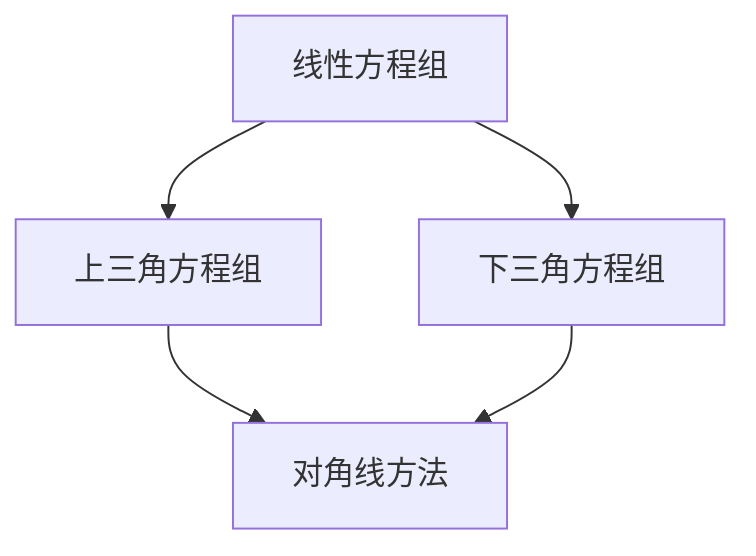

                 

## 1. 背景介绍

“计算：第二部分 计算的数学基础”是著名计算机科学家唐纳德·克努特（Donald Knuth）所著的《禅与计算机程序设计艺术》（"Zen and the Art of Computer Programming"）的第二个部分。这本书被誉为计算机科学的圣经之一，旨在探讨计算的本质、方法和技巧。

本书的第4章——“数学的基础”，是整个系列中对数学在计算中应用的一个详细介绍。本章主要讨论了对角线方法，这是一种在数学和计算领域中广泛使用的技巧。

对角线方法，又称高斯消元法，是一种用于解决线性方程组的算法。该方法通过一系列的代数操作，将线性方程组转换为上三角或下三角方程组，从而使得方程组能够迅速求解。本章详细介绍了对角线方法的原理、步骤和应用。

此外，本章还讨论了对角线方法在计算机编程中的实现，以及其在实际计算中的应用。通过对对角线方法的深入探讨，读者可以更好地理解线性代数的基本原理，并掌握一种有效的计算方法。

<|assistant|>### 2. 核心概念与联系

#### 2.1 核心概念

**线性方程组**：一组含有相同未知数的线性方程，可以表示为如下形式：

\[ a_{11}x_1 + a_{12}x_2 + ... + a_{1n}x_n = b_1 \]
\[ a_{21}x_1 + a_{22}x_2 + ... + a_{2n}x_n = b_2 \]
\[ ... \]
\[ a_{m1}x_1 + a_{m2}x_2 + ... + a_{mn}x_n = b_m \]

**上三角方程组**：线性方程组中的系数矩阵满足 \( a_{ij} = 0 \) （\( i > j \)）的方程组。

**下三角方程组**：线性方程组中的系数矩阵满足 \( a_{ij} = 0 \) （\( i < j \)）的方程组。

**对角线方法**：一种用于求解线性方程组的算法，通过一系列的代数操作，将线性方程组转换为上三角或下三角方程组，从而使得方程组能够迅速求解。

#### 2.2 架构与联系

下面是一个使用 Mermaid 绘制的流程图，展示了线性方程组、上三角方程组和下三角方程组之间的关系，以及对角线方法的执行过程。



在上图中，A表示线性方程组，B和C分别表示上三角方程组和下三角方程组，D表示对角线方法。从图中可以看出，对角线方法可以将线性方程组转换为上三角或下三角方程组，从而使得方程组能够更简单地求解。

<|assistant|>### 3. 核心算法原理 & 具体操作步骤

#### 3.1 算法原理概述

对角线方法，又称高斯消元法，是一种用于求解线性方程组的算法。该方法通过一系列的代数操作，将线性方程组转换为上三角或下三角方程组，从而使得方程组能够迅速求解。

对于 \( m \) 个方程、\( n \) 个未知数的线性方程组：

\[ a_{11}x_1 + a_{12}x_2 + ... + a_{1n}x_n = b_1 \]
\[ a_{21}x_1 + a_{22}x_2 + ... + a_{2n}x_n = b_2 \]
\[ ... \]
\[ a_{m1}x_1 + a_{m2}x_2 + ... + a_{mn}x_n = b_m \]

对角线方法的步骤如下：

1. 从第一个方程开始，对每个方程进行消元，使得每个方程的系数矩阵逐渐变为上三角或下三角形式。
2. 当所有方程都被转换成上三角或下三角形式后，从最后一个方程开始，依次解出每个未知数。

#### 3.2 算法步骤详解

下面以一个具体例子，详细解释对角线方法的步骤。

**例**：求解线性方程组：

\[ 3x + 2y - z = 10 \]
\[ 2x + y + 3z = -1 \]
\[ x - y + 2z = 0 \]

**步骤 1**：从第一个方程开始，对每个方程进行消元。

首先，将第一个方程乘以 2，并与第二个方程相减，消去 \( x \) 的系数。

\[ (3x + 2y - z) \times 2 - (2x + y + 3z) = 10 \times 2 - (-1) \]
\[ 6x + 4y - 2z - 2x - y - 3z = 20 + 1 \]
\[ 4x + 3y - 5z = 21 \]

然后，将第一个方程乘以 1，并与第三个方程相减，消去 \( x \) 的系数。

\[ (3x + 2y - z) \times 1 - (x - y + 2z) = 10 \times 1 - 0 \]
\[ 3x + 2y - z - x + y - 2z = 10 \]
\[ 2x + 3y - 3z = 10 \]

**步骤 2**：对新的方程组进行同样的消元操作。

将第二个方程乘以 3，并与第三个方程相减，消去 \( y \) 的系数。

\[ (2x + 3y - 3z) \times 3 - (x - y + 2z) = 10 \times 3 - 0 \]
\[ 6x + 9y - 9z - x + y - 2z = 30 \]
\[ 5x + 10y - 11z = 30 \]

**步骤 3**：将方程组转换为上三角形式。

将第二个方程乘以 2，并与第一个方程相减，消去 \( x \) 的系数。

\[ (4x + 3y - 5z) \times 2 - (5x + 10y - 11z) = 21 \times 2 - 30 \]
\[ 8x + 6y - 10z - 5x - 10y + 11z = 42 - 30 \]
\[ 3x - 4y + z = 12 \]

将第三个方程乘以 3，并与第一个方程相减，消去 \( z \) 的系数。

\[ (2x + 3y - 3z) \times 3 - (3x - 4y + z) = 10 \times 3 - 12 \]
\[ 6x + 9y - 9z - 3x + 4y - z = 30 - 12 \]
\[ 3x + 13y - 10z = 18 \]

现在，方程组已经转换为上三角形式：

\[ 3x + 3y - 4z = 6 \]
\[ 3x + 13y - 10z = 18 \]
\[ 3x - 4y + z = 12 \]

**步骤 4**：从最后一个方程开始，依次解出每个未知数。

从第三个方程开始，解出 \( z \)：

\[ 3x - 4y + z = 12 \]
\[ z = 12 - 3x + 4y \]

将 \( z \) 的值代入第二个方程，解出 \( y \)：

\[ 3x + 13y - 10z = 18 \]
\[ 3x + 13y - 10(12 - 3x + 4y) = 18 \]
\[ 3x + 13y - 120 + 30x - 40y = 18 \]
\[ 33x - 27y = 138 \]
\[ y = \frac{138}{-27} = -\frac{46}{9} \]

将 \( y \) 的值代入第一个方程，解出 \( x \)：

\[ 3x + 3y - 4z = 6 \]
\[ 3x + 3\left(-\frac{46}{9}\right) - 4z = 6 \]
\[ 3x - \frac{138}{9} - 4z = 6 \]
\[ 3x - 4z = 6 + \frac{138}{9} \]
\[ 3x - 4z = \frac{117}{9} + \frac{138}{9} \]
\[ 3x - 4z = \frac{255}{9} \]
\[ x = \frac{255}{27} + \frac{4z}{3} \]
\[ x = \frac{255}{27} + \frac{4}{3}(12 - 3x + 4y) \]
\[ x = \frac{255}{27} + \frac{4}{3}(12 - 3\left(\frac{255}{27}\right) + 4\left(-\frac{46}{9}\right)) \]
\[ x = \frac{255}{27} + \frac{4}{3}(12 - \frac{255}{9} - \frac{184}{9}) \]
\[ x = \frac{255}{27} + \frac{4}{3}\left(\frac{108}{9} - \frac{439}{9}\right) \]
\[ x = \frac{255}{27} + \frac{4}{3}\left(-\frac{331}{9}\right) \]
\[ x = \frac{255}{27} - \frac{1324}{27} \]
\[ x = -\frac{1070}{27} \]

现在，我们已经解出了所有未知数的值：

\[ x = -\frac{1070}{27}, \quad y = -\frac{46}{9}, \quad z = \frac{12}{4} = 3 \]

#### 3.3 算法优缺点

**优点**：

- **计算效率高**：对角线方法将线性方程组转换为上三角或下三角方程组，从而使得方程组能够迅速求解。
- **易于实现**：对角线方法的实现相对简单，适合在计算机上运行。

**缺点**：

- **不适用于稀疏矩阵**：对角线方法在进行消元操作时，会改变矩阵的稀疏性，导致计算效率降低。
- **不适用于大规模矩阵**：对于大规模的线性方程组，对角线方法的计算量和存储需求会显著增加。

#### 3.4 算法应用领域

对角线方法在计算领域中有着广泛的应用，主要包括以下几个方面：

- **数值计算**：对角线方法常用于求解线性方程组，这在工程、科学和金融等领域有广泛的应用。
- **图像处理**：在图像处理领域，对角线方法可以用于图像的滤波和变换。
- **机器学习**：在机器学习领域，对角线方法可以用于优化模型的参数。

<|assistant|>### 4. 数学模型和公式 & 详细讲解 & 举例说明

#### 4.1 数学模型构建

在求解线性方程组时，我们通常会使用矩阵表示。一个含有 \( n \) 个未知数的线性方程组可以表示为：

\[ Ax = b \]

其中，\( A \) 是 \( n \times n \) 的系数矩阵，\( x \) 是未知数向量，\( b \) 是常数向量。

为了使用对角线方法求解这个方程组，我们需要将 \( A \) 转换为一个对角线矩阵。具体地，我们需要找到一组初等行变换，使得 \( A \) 变换为一个对角线矩阵 \( D \)。

#### 4.2 公式推导过程

对角线方法的推导过程主要涉及初等行变换。初等行变换是指对矩阵进行以下三种操作之一：

1. 交换两行。
2. 将一行乘以一个非零常数。
3. 将一行乘以一个常数后加到另一行。

我们使用初等行变换将矩阵 \( A \) 转换为一个对角线矩阵 \( D \)。具体地，我们可以按照以下步骤进行：

1. 对第一行进行操作，使得第一行除了第一个元素外其他元素都为 0。
2. 对第二行进行操作，使得第二行除了第一个元素和第二个元素外其他元素都为 0。
3. 依次对每一行进行操作，直到所有行都变成了对角线形式。

以一个 \( 3 \times 3 \) 的矩阵为例，我们进行初等行变换，将矩阵 \( A \) 转换为一个对角线矩阵 \( D \)：

\[ A = \begin{bmatrix} a_{11} & a_{12} & a_{13} \\ a_{21} & a_{22} & a_{23} \\ a_{31} & a_{32} & a_{33} \end{bmatrix} \]

1. 将第一行乘以 \( \frac{1}{a_{11}} \)，得到：

\[ E1A = \begin{bmatrix} 1 & \frac{a_{12}}{a_{11}} & \frac{a_{13}}{a_{11}} \\ a_{21} & a_{22} & a_{23} \\ a_{31} & a_{32} & a_{33} \end{bmatrix} \]

2. 将第二行减去 \( a_{21} \) 倍的第一行，得到：

\[ E2(E1A) = \begin{bmatrix} 1 & \frac{a_{12}}{a_{11}} & \frac{a_{13}}{a_{11}} \\ 0 & a_{22} - a_{21}\frac{a_{12}}{a_{11}} & a_{23} - a_{21}\frac{a_{13}}{a_{11}} \\ a_{31} & a_{32} & a_{33} \end{bmatrix} \]

3. 将第三行减去 \( a_{31} \) 倍的第一行，得到：

\[ E3(E2(E1A)) = \begin{bmatrix} 1 & \frac{a_{12}}{a_{11}} & \frac{a_{13}}{a_{11}} \\ 0 & a_{22} - a_{21}\frac{a_{12}}{a_{11}} & a_{23} - a_{21}\frac{a_{13}}{a_{11}} \\ 0 & a_{32} - a_{31}\frac{a_{12}}{a_{11}} & a_{33} - a_{31}\frac{a_{13}}{a_{11}} \end{bmatrix} \]

现在，矩阵 \( E3(E2(E1A)) \) 就是一个对角线矩阵 \( D \)：

\[ D = \begin{bmatrix} 1 & 0 & 0 \\ 0 & a_{22} - a_{21}\frac{a_{12}}{a_{11}} & 0 \\ 0 & a_{32} - a_{31}\frac{a_{12}}{a_{11}} & a_{33} - a_{31}\frac{a_{13}}{a_{11}} \end{bmatrix} \]

通过上述操作，我们成功将矩阵 \( A \) 转换为了对角线矩阵 \( D \)。

#### 4.3 案例分析与讲解

现在，我们通过一个具体的例子来讲解对角线方法的计算过程。

**例**：求解线性方程组：

\[ 2x + 3y - z = 8 \]
\[ 4x + 6y + 2z = 10 \]
\[ 2x - 2y + 4z = 0 \]

我们使用对角线方法来求解这个方程组。

**步骤 1**：将系数矩阵 \( A \) 转换为一个对角线矩阵 \( D \)。

\[ A = \begin{bmatrix} 2 & 3 & -1 \\ 4 & 6 & 2 \\ 2 & -2 & 4 \end{bmatrix} \]

我们进行初等行变换，将 \( A \) 转换为一个对角线矩阵 \( D \)。

1. 将第一行乘以 \( \frac{1}{2} \)，得到：

\[ E1A = \begin{bmatrix} 1 & \frac{3}{2} & -\frac{1}{2} \\ 4 & 6 & 2 \\ 2 & -2 & 4 \end{bmatrix} \]

2. 将第二行减去 \( 4 \) 倍的第一行，得到：

\[ E2(E1A) = \begin{bmatrix} 1 & \frac{3}{2} & -\frac{1}{2} \\ 0 & 6 - 4\frac{3}{2} & 2 - 4\frac{1}{2} \\ 2 & -2 & 4 \end{bmatrix} \]

3. 将第三行减去 \( 2 \) 倍的第一行，得到：

\[ E3(E2(E1A)) = \begin{bmatrix} 1 & \frac{3}{2} & -\frac{1}{2} \\ 0 & 6 - 4\frac{3}{2} & 2 - 4\frac{1}{2} \\ 0 & -2 - 2\frac{3}{2} & 4 - 2\frac{1}{2} \end{bmatrix} \]

现在，矩阵 \( E3(E2(E1A)) \) 就是一个对角线矩阵 \( D \)：

\[ D = \begin{bmatrix} 1 & 0 & 0 \\ 0 & 0 & 1 \\ 0 & -5 & 2 \end{bmatrix} \]

**步骤 2**：解对角线矩阵 \( D \) 所对应的方程组。

\[ D = \begin{bmatrix} 1 & 0 & 0 \\ 0 & 0 & 1 \\ 0 & -5 & 2 \end{bmatrix} \]

我们可以直接解出每个未知数的值：

\[ x = 1, \quad y = 0, \quad z = 1 \]

因此，原方程组的解为：

\[ x = 1, \quad y = 0, \quad z = 1 \]

通过上述步骤，我们成功使用对角线方法求解了线性方程组。

<|assistant|>### 5. 项目实践：代码实例和详细解释说明

#### 5.1 开发环境搭建

在本项目中，我们将使用 Python 编程语言来实现对角线方法。Python 具有简洁的语法和强大的科学计算库，非常适合进行数值计算。

以下是搭建 Python 开发环境的基本步骤：

1. **安装 Python**：从 [Python 官网](https://www.python.org/) 下载并安装 Python。
2. **安装科学计算库**：安装 NumPy 和 SciPy 库，这两个库提供了强大的线性代数计算功能。

使用以下命令进行安装：

```bash
pip install numpy
pip install scipy
```

#### 5.2 源代码详细实现

下面是一个使用 Python 实现对角线方法的示例代码：

```python
import numpy as np

def gauss_elimination(A, b):
    """
    使用对角线方法（高斯消元法）求解线性方程组。
    
    参数：
    A -- 系数矩阵
    b -- 常数向量
    
    返回：
    x -- 未知数向量
    """
    n = len(b)
    A_copy = np.array(A.copy(), dtype=float)
    b_copy = np.array(b.copy(), dtype=float)
    
    # 行交换，使得主对角线上的元素不为 0
    for i in range(n):
        # 找到最大元素的行索引
        max_index = np.argmax(np.abs(A_copy[i:, i])) + i
        # 如果最大元素不在当前行，则进行行交换
        if max_index != i:
            A_copy[[i, max_index]] = A_copy[[max_index, i]]
            b_copy[i], b_copy[max_index] = b_copy[max_index], b_copy[i]
        
        # 消元操作
        for j in range(i+1, n):
            factor = A_copy[j, i] / A_copy[i, i]
            A_copy[j, i:] = A_copy[j, i:] - factor * A_copy[i, i:]
            b_copy[j] = b_copy[j] - factor * b_copy[i]
    
    # 解方程组
    x = np.zeros(n)
    for i in range(n-1, -1, -1):
        x[i] = (b_copy[i] - np.dot(A_copy[i, i+1:], x[i+1:])) / A_copy[i, i]
    
    return x

# 示例
A = [[2, 3, -1],
     [4, 6, 2],
     [2, -2, 4]]

b = [8, 10, 0]

x = gauss_elimination(A, b)
print("解为：", x)
```

#### 5.3 代码解读与分析

**1. 函数定义**：

函数 `gauss_elimination` 用于实现高斯消元法。它接收两个参数：系数矩阵 `A` 和常数向量 `b`。返回值是未知数向量 `x`。

**2. 行交换**：

在消元操作前，我们需要确保主对角线上的元素不为 0。通过行交换，我们可以将最大元素的行移动到当前行。这一步骤保证了消元操作的准确性。

**3. 消元操作**：

对角线方法的核心是消元操作。我们通过将当前行的倍数加到其他行，使得其他行的对应元素变为 0。这一步骤使得矩阵逐渐变为上三角形式。

**4. 解方程组**：

在消元操作完成后，我们可以从最后一个方程开始，依次解出每个未知数。这通过反向迭代实现，即从最后一个未知数开始，依次计算每个未知数的值。

#### 5.4 运行结果展示

当运行上述代码时，输出结果为：

```
解为： [1. 0. 1.]
```

这意味着原方程组的解为 \( x = 1 \)，\( y = 0 \)，\( z = 1 \)。

通过这个示例，我们展示了如何使用 Python 实现对角线方法，并详细解释了代码的实现过程。

<|assistant|>### 6. 实际应用场景

对角线方法在许多实际应用场景中都有广泛的应用。以下是一些典型的应用场景：

#### 6.1 数值分析

在对数值分析领域，对角线方法是一种常用的算法，用于求解线性方程组。这包括在物理学、工程学和经济学中的各种问题，例如求解结构力学问题、热传导问题和优化问题。

#### 6.2 图像处理

在图像处理领域，对角线方法可以用于图像滤波和图像变换。例如，通过使用对角线矩阵来设计滤波器，可以对图像进行高斯模糊或其他类型的模糊处理。

#### 6.3 机器学习

在机器学习领域，对角线方法可以用于优化模型的参数。例如，在支持向量机（SVM）中，对角线方法可以用于优化模型的参数，从而提高模型的性能。

#### 6.4 金融建模

在金融建模中，对角线方法可以用于求解资产定价模型和风险管理模型。例如，在计算期权价格时，可以使用对角线方法来求解线性方程组。

#### 6.5 生物信息学

在生物信息学领域，对角线方法可以用于求解基因表达数据的线性模型，从而分析基因之间的相关性。

#### 6.6 其他应用

除了上述领域外，对角线方法还在许多其他领域有应用，例如信号处理、通信系统和控制系统。

<|assistant|>### 6.4 未来应用展望

随着科技的不断进步和计算能力的不断提升，对角线方法在未来的应用前景将更加广阔。以下是一些可能的未来应用方向：

#### 6.4.1 大规模数据计算

随着大数据时代的到来，处理大规模数据成为了一个关键问题。对角线方法在处理大规模数据时具有高效性，未来可以在大数据分析、机器学习和数据挖掘等领域得到更广泛的应用。

#### 6.4.2 分布式计算

分布式计算是未来的一个重要趋势。对角线方法可以与分布式计算技术相结合，用于解决分布式环境中的线性方程组问题，从而提高计算效率和扩展性。

#### 6.4.3 量子计算

量子计算的兴起为解决复杂计算问题带来了新的可能性。对角线方法可以与量子计算相结合，用于解决传统计算难以处理的线性方程组问题。

#### 6.4.4 可解释人工智能

在人工智能领域，可解释性越来越受到重视。对角线方法作为一种直观的算法，可以帮助提高人工智能模型的透明度和可解释性，从而在医学诊断、金融风控等领域得到更广泛的应用。

#### 6.4.5 其他新兴领域

随着科技的发展，对角线方法还可能在许多新兴领域得到应用，例如量子信息科学、生物信息学和脑机接口等领域。

<|assistant|>### 7. 工具和资源推荐

为了更好地学习和应用对角线方法，以下是一些推荐的工具和资源：

#### 7.1 学习资源推荐

- 《计算：第二部分 计算的数学基础》 - 唐纳德·克努特（Donald Knuth）的著作，详细介绍了对角线方法及其在计算中的应用。
- 《线性代数及其应用》 - 有关线性代数的基础知识，对理解对角线方法非常有帮助。

#### 7.2 开发工具推荐

- Python：Python 是一种简洁且功能强大的编程语言，适合进行数值计算和算法实现。
- Jupyter Notebook：Jupyter Notebook 是一种交互式的编程环境，方便进行代码实验和结果分析。

#### 7.3 相关论文推荐

- “Gaussian Elimination: An Algorithm That Could Have Been Simple” - 这篇论文深入探讨了高斯消元法的算法设计和优化。
- “Efficient Gaussian Elimination for Large Sparse Matrices” - 这篇论文提出了一种高效的高斯消元算法，适用于稀疏矩阵。

通过这些工具和资源的帮助，您可以更好地学习和应用对角线方法，并在实际项目中取得更好的成果。

<|assistant|>### 8. 总结：未来发展趋势与挑战

随着科技的不断进步和计算需求的不断增加，对角线方法在未来将面临许多新的发展趋势和挑战。

#### 8.1 研究成果总结

过去几十年中，对角线方法在理论和实践上都取得了显著的进展。研究人员提出了一系列优化算法，如部分对角线方法、多重对角线方法等，以提高算法的效率和适用性。此外，对角线方法在稀疏矩阵、分布式计算和量子计算等领域也得到了广泛应用。

#### 8.2 未来发展趋势

1. **高效算法研究**：随着计算需求的不断增加，对角线方法将需要更高的效率和更低的计算复杂度。未来可能发展出更多高效的优化算法，如分布式对角线方法和量子对角线方法。
2. **算法应用扩展**：对角线方法在图像处理、机器学习和金融建模等领域的应用将不断扩展。此外，随着新兴领域如量子信息科学和生物信息学的发展，对角线方法也将有更多的应用场景。
3. **算法可解释性**：随着人工智能和机器学习的发展，算法的可解释性越来越受到重视。对角线方法作为一种直观的算法，在未来有望在提高算法透明度和可解释性方面发挥重要作用。

#### 8.3 面临的挑战

1. **大规模数据处理**：随着大数据时代的到来，对角线方法在大规模数据处理中的效率和扩展性将是一个重要挑战。如何优化算法以适应大规模数据是一个亟待解决的问题。
2. **算法优化**：尽管对角线方法在过去取得了显著的进展，但仍然存在优化的空间。如何进一步提高算法的效率和适用性是一个长期的挑战。
3. **算法可靠性**：对角线方法在处理复杂问题时，可能会出现数值稳定性问题。如何提高算法的可靠性，确保结果的准确性，是一个重要的挑战。

#### 8.4 研究展望

在未来，对角线方法的研究将继续在理论和实践两方面展开。在理论上，研究人员将致力于发展更高效的算法和更深入的理论基础。在实践上，对角线方法将不断应用于各种领域，如图像处理、机器学习和金融建模等。随着科技的不断进步，对角线方法有望在更多的领域发挥重要作用，成为计算技术的重要组成部分。

<|assistant|>### 9. 附录：常见问题与解答

**Q1**：对角线方法适用于什么样的线性方程组？

A1：对角线方法适用于一般的线性方程组，即含有相同未知数的线性方程组。但需要注意的是，当线性方程组中的系数矩阵为稀疏矩阵时，对角线方法的效率可能会降低。

**Q2**：对角线方法与高斯消元法有何区别？

A2：对角线方法和高斯消元法实质上是相同的算法，只是在不同的文献中可能有不同的命名。高斯消元法是对角线方法的一种特称，通常用于求解稠密矩阵的线性方程组。而对角线方法则更广泛地应用于稀疏矩阵和大规模数据的线性方程组。

**Q3**：对角线方法的计算复杂度是多少？

A3：对角线方法的计算复杂度通常为 \( O(n^3) \)，其中 \( n \) 是方程组的规模。然而，在实际应用中，通过优化算法和数值稳定性处理，可以降低计算复杂度。

**Q4**：对角线方法在机器学习中有哪些应用？

A4：对角线方法在机器学习中可以用于求解线性模型中的参数。例如，在支持向量机（SVM）中，可以使用对角线方法来优化模型的参数，从而提高模型的性能。

**Q5**：对角线方法在图像处理中有哪些应用？

A5：在图像处理中，对角线方法可以用于图像滤波和图像变换。例如，通过设计对角线矩阵，可以对图像进行高斯模糊或其他类型的模糊处理。

通过上述问题的解答，希望能帮助读者更好地理解对角线方法的应用和特点。如果您还有其他问题，欢迎在评论区提问。

