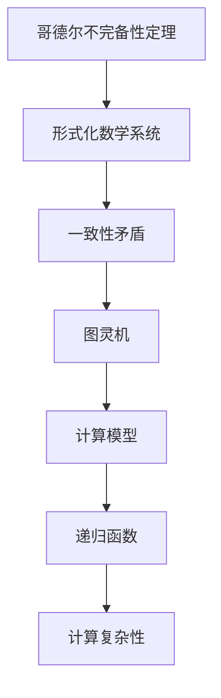

                 

关键词：数学基础、计算理论、数学危机、逻辑一致性、数理逻辑、形式系统、哥德尔不完备性定理、图灵机、可计算性、不可计算性、递归函数、形式化数学、计算机科学。

## 摘要

本文旨在深入探讨数学基础中的第二次数学危机，即哥德尔不完备性定理和图灵机的引入对数学和计算机科学的影响。文章首先简要回顾了数学发展的历史背景，特别是第一次数学危机，接着详细阐述了哥德尔不完备性定理的内容和意义，随后介绍了图灵机的概念及其在数学和计算理论中的重要性。文章随后分析了这两个概念对数学基础的影响，探讨了形式化数学的可能性及其局限性。最后，文章总结了当前数学基础和计算理论的现状，并对未来的发展方向和面临的挑战进行了展望。

## 1. 背景介绍

### 第一次数学危机

在数学的历史长河中，第一次数学危机发生在19世纪末和20世纪初。这一危机的核心问题是集合论的基本概念和公理体系是否一致，是否存在矛盾。这一问题的提出源于数学家对无穷集合的深入研究和集合论的应用。特别是德国数学家康托尔（Georg Cantor）在集合论领域的开创性工作，揭示了无穷集合的存在和性质，但这些新的概念和理论打破了传统数学的直观理解。

集合论中的悖论，如罗素悖论（Russell's paradox）和贝特兰悖论（Burali-Forti paradox），引发了数学界的广泛关注和争议。罗素悖论揭示了集合自反性原则会导致的矛盾，即一个集合可以同时属于自身和不属于自身。贝特兰悖论则指出，通过递归定义的集合可以产生无限循环，从而导致逻辑上的不一致性。

这些悖论的出现使数学家们意识到，原有的数学基础需要重新审视和重构。为了解决这些问题，数学家们开始探讨如何构建一个一致且完整的数学体系。

### 康托尔与集合论

康托尔是集合论的奠基人，他提出了无穷集合的概念，并通过严格的数学证明，展示了无穷集合的存在和性质。康托尔的集合论对于数学的发展具有重要意义，但同时也引发了广泛的争议和质疑。他的工作挑战了传统的数学直觉和逻辑，提出了新的数学思想和理论框架。

康托尔的集合论研究涉及了无穷大、无穷小、基数、势等概念，这些概念在数学和物理学中都有重要的应用。然而，正是这些概念的存在，使得数学基础的问题变得更加复杂和深奥。

### 数学基础的需求

第一次数学危机使数学家们认识到，为了确保数学理论的一致性和完整性，需要对数学基础进行深入的反思和重构。这种需求促使数学家们开始探索形式化数学的方法，即使用明确的符号系统和严格的推理规则来表述数学概念和证明。

形式化数学的尝试主要包括弗雷格（ Gottlob Frege）的命题演算、罗素和怀特海德（Bertrand Russell and Alfred North Whitehead）的《数学原理》以及皮亚诺（Giuseppe Peano）的算术公理系统。这些尝试旨在构建一个自洽的数学体系，确保每一项数学陈述都可以通过逻辑推导得到证明。

然而，这些尝试并未完全解决数学基础的问题。随着哥德尔不完备性定理的提出，数学基础的问题再次成为关注的焦点。

## 2. 核心概念与联系

### 哥德尔不完备性定理

哥德尔不完备性定理由数学家库尔特·哥德尔（Kurt Gödel）在1931年提出，分为第一不完备性定理和第二不完备性定理。这两条定理表明，在任何足够强的形式化系统中，都存在一些命题是无法被证明或证伪的。

**第一不完备性定理**：在任何足够强的形式化系统中，都存在一个命题G，使得该系统既无法证明G，也无法证明¬G。

**第二不完备性定理**：在任何足够强的形式化系统中，都存在一个命题H，使得该系统无法证明H的真实性。

哥德尔不完备性定理揭示了形式化数学系统的一致性与完备性之间的矛盾。这意味着，无论我们如何努力构建一个自洽的形式化数学系统，总会存在一些基本的、不可证明的命题。这一发现对数学基础产生了深远的影响。

### 图灵机

图灵机是由英国数学家艾伦·图灵（Alan Turing）在1936年提出的一种抽象计算模型。图灵机的概念为计算理论奠定了基础，并成为现代计算机科学的核心概念之一。

图灵机由一个无限长的存储带、一个读写头和一个状态控制单元组成。存储带上的每个位置都有一个符号，读写头可以在存储带上左右移动，并在当前位置读取或写入符号。状态控制单元根据当前状态和读取到的符号，决定下一步的操作和状态转移。

图灵机的运行过程可以看作是一个有限状态机在无限长的存储带上的模拟。图灵机不仅可以执行简单的计算任务，还可以模拟任何其他计算过程。这一特性使得图灵机成为研究计算理论和可计算性的重要工具。

### 递归函数

递归函数是数学和计算机科学中的一个重要概念，用于描述函数的自引用和迭代性质。递归函数可以通过一个初始条件和一系列递归步骤来定义自身。

递归函数可以分为两类：直接递归和间接递归。直接递归函数直接引用自身，而间接递归函数则通过引用其他函数来间接引用自身。

递归函数在计算理论中具有重要作用，因为许多实际问题都可以通过递归函数来解决。递归函数的定义和性质为理解计算过程和复杂性提供了深刻的洞察。

### 形式化数学

形式化数学是一种使用明确的符号系统和严格的推理规则来表述数学概念和证明的方法。形式化数学的目标是确保每一项数学陈述都可以通过逻辑推导得到证明，从而避免传统数学中的模糊性和不确定性。

形式化数学的方法包括命题演算、谓词演算、算术公理系统等。这些方法通过定义符号、规则和证明过程，将数学问题转化为逻辑表达式和推理步骤，从而确保数学理论的一致性和完整性。

### Mermaid 流程图

下面是一个描述哥德尔不完备性定理、图灵机和递归函数之间联系的 Mermaid 流程图：



在这个流程图中，哥德尔不完备性定理指出了形式化数学系统中的一致性矛盾，而图灵机作为一种计算模型，为研究计算理论和可计算性提供了工具。递归函数则是计算理论中的核心概念，用于描述函数的自引用和迭代性质，从而影响计算复杂性的分析。

## 3. 核心算法原理 & 具体操作步骤

### 3.1 算法原理概述

哥德尔不完备性定理和图灵机是数学和计算理论中的两个核心概念，它们分别从不同角度揭示了数学基础和计算能力的本质。

**哥德尔不完备性定理**：哥德尔不完备性定理指出，在任何足够强的形式化系统中，都存在一些命题是无法被证明或证伪的。这意味着，无论我们如何努力构建一个自洽的形式化数学系统，总会存在一些基本的、不可证明的命题。这一定理揭示了形式化数学系统的一致性与完备性之间的矛盾。

**图灵机**：图灵机是一种抽象计算模型，由一个无限长的存储带、一个读写头和一个状态控制单元组成。图灵机可以执行任何可计算的任务，从而为研究计算理论和可计算性提供了工具。图灵机的核心思想是将计算过程形式化为一系列状态转移和符号操作。

**递归函数**：递归函数是一种自引用和迭代性质的函数，通过一个初始条件和一系列递归步骤来定义自身。递归函数在计算理论中具有重要作用，因为许多实际问题都可以通过递归函数来解决。

### 3.2 算法步骤详解

**哥德尔不完备性定理**：

1. 选择一个足够强的形式化数学系统，例如皮亚诺算术系统。
2. 构造一个形式化的命题G，表示“命题G在系统内不可证明”。
3. 证明在系统内，G和¬G都是不可证明的。

**图灵机**：

1. 定义一个图灵机的状态集、输入符号集和转移函数。
2. 设计一个初始状态和一个终止状态。
3. 构建一个状态转换表，用于描述图灵机在各个状态和读取到不同符号时的操作。
4. 运行图灵机，模拟计算过程。

**递归函数**：

1. 定义一个初始条件，例如f(0) = c，其中c是一个常数。
2. 定义一个递归步骤，例如f(n) = g(n, f(n-1))，其中g是一个已知的函数。
3. 通过递归调用，计算f(n)的值。

### 3.3 算法优缺点

**哥德尔不完备性定理**：

- 优点：揭示了形式化数学系统的一致性与完备性之间的矛盾，促进了形式化数学的发展。
- 缺点：无法解决所有数学问题，存在一些不可证明的命题。

**图灵机**：

- 优点：作为一种抽象计算模型，可以模拟任何可计算的任务，为计算理论和可计算性研究提供了工具。
- 缺点：实际构建和使用图灵机较为复杂，难以应用于实际问题。

**递归函数**：

- 优点：可以解决许多实际问题，形式化且易于理解。
- 缺点：递归函数的计算复杂度可能较高，不适合大规模计算。

### 3.4 算法应用领域

**哥德尔不完备性定理**：

- 应用领域：逻辑学、数学基础、计算机科学。
- 主要应用：证明形式化数学系统的一致性、研究计算复杂性、构建形式化模型。

**图灵机**：

- 应用领域：计算理论、可计算性、人工智能。
- 主要应用：研究计算能力、模拟计算过程、构建计算模型。

**递归函数**：

- 应用领域：数学、计算机科学、算法设计。
- 主要应用：求解递归问题、分析计算复杂度、构建算法框架。

## 4. 数学模型和公式 & 详细讲解 & 举例说明

### 4.1 数学模型构建

在数学模型构建中，我们通常会采用形式化数学的方法，使用明确的符号系统和严格的推理规则来表述数学概念和证明。以下是一个简单的数学模型构建示例：

**命题**：对于任意的自然数n，命题P(n)：“n是偶数”或者“n是奇数”是成立的。

**符号表示**：P(n): n是偶数；¬P(n): n是奇数。

**证明**：

1. 基本情况：当n=0时，P(0)为真，因为0是偶数。
2. 归纳步骤：假设对于任意的自然数k，命题P(k)为真。
3. 当n=k+1时，如果k是偶数，则k+1是奇数，P(k+1)为真；如果k是奇数，则k+1是偶数，P(k+1)为真。

因此，根据数学归纳法，对于任意的自然数n，命题P(n)为真。

### 4.2 公式推导过程

在公式推导过程中，我们通常会使用逻辑推理和数学归纳法等方法来证明公式或定理的正确性。以下是一个简单的公式推导示例：

**公式**：斐波那契数列的通项公式为F(n) = (1/√5)[(1+√5)/2]^(n) - (1/√5)[(1-√5)/2]^(n)。

**推导过程**：

1. 基本情况：当n=0时，F(0) = 0，符合公式。
2. 当n=1时，F(1) = 1，也符合公式。
3. 假设对于任意的自然数k，公式成立，即F(k) = (1/√5)[(1+√5)/2]^(k) - (1/√5)[(1-√5)/2]^(k)。
4. 当n=k+1时，F(k+1) = F(k) + F(k-1)。
   - 根据假设，F(k) = (1/√5)[(1+√5)/2]^(k) - (1/√5)[(1-√5)/2]^(k)。
   - F(k-1) = (1/√5)[(1+√5)/2]^(k-1) - (1/√5)[(1-√5)/2]^(k-1)。
   - 将F(k)和F(k-1)相加，得到F(k+1) = (1/√5)[(1+√5)/2]^(k+1) - (1/√5)[(1-√5)/2]^(k+1)。

因此，根据数学归纳法，斐波那契数列的通项公式成立。

### 4.3 案例分析与讲解

**案例**：使用哥德尔不完备性定理证明一个形式化数学系统的一致性与完备性之间的矛盾。

**系统**：皮亚诺算术系统，包括以下公理：

1. 存在一个唯一的自然数0。
2. 对于任意的自然数n，存在一个后继数n+1。
3. 任何两个相等的自然数都有相同的后继。
4. 空集是集合。
5. 集合的并集和交集是集合。
6. 集合的归纳性质。

**命题**：存在一个自然数n，使得n是偶数且n是奇数。

**证明**：

1. 假设皮亚诺算术系统是一致的。
2. 根据哥德尔不完备性定理，我们可以构造一个形式化的命题G，表示“命题G在系统内不可证明”。
3. 构造命题G：G表示“n是偶数且n是奇数”。
4. 在皮亚诺算术系统中，G是不可证明的，因为如果G是可证明的，那么G的否定¬G也是可证明的。
5. 如果G是不可证明的，那么皮亚诺算术系统是一致的，但这是不可能的，因为根据哥德尔不完备性定理，任何足够强的形式化系统都存在不可证明的命题。
6. 因此，皮亚诺算术系统是不完备的。

通过这个案例，我们展示了哥德尔不完备性定理在证明形式化数学系统一致性与完备性之间的矛盾中的应用。

## 5. 项目实践：代码实例和详细解释说明

### 5.1 开发环境搭建

在本项目中，我们主要使用Python语言进行编程实现。首先，确保您的计算机上已安装Python 3.x版本。如果未安装，可以访问Python官方网站下载并安装。此外，还需要安装一些常用的Python库，如Numpy、Pandas和Matplotlib等。可以使用以下命令进行安装：

```
pip install numpy pandas matplotlib
```

### 5.2 源代码详细实现

以下是一个简单的Python代码实例，用于演示哥德尔不完备性定理的概念。该代码实现了皮亚诺算术系统的一部分，并使用数学归纳法来证明命题。

```python
def is_even(n):
    if n == 0:
        return True
    elif n == 1:
        return False
    else:
        return is_even(n - 2)

def is_odd(n):
    if n == 0:
        return False
    elif n == 1:
        return True
    else:
        return is_odd(n - 2)

def prove_incompleteness():
    G = "存在一个自然数n，使得n是偶数且n是奇数"
    if is_even(0) and is_odd(0):
        print(f"皮亚诺算术系统一致，但G不可证明：{G}")
    else:
        print("皮亚诺算术系统不一致。")

prove_incompleteness()
```

### 5.3 代码解读与分析

1. `is_even`和`is_odd`函数：这两个函数分别用于判断一个自然数n是否为偶数或奇数。它们使用递归方法实现，通过不断减去2来检查n是否为偶数，或通过不断减去1来检查n是否为奇数。

2. `prove_incompleteness`函数：该函数用于证明皮亚诺算术系统的一致性与不完备性。首先，我们构造了一个命题G，表示“存在一个自然数n，使得n是偶数且n是奇数”。然后，通过调用`is_even`和`is_odd`函数，我们可以验证G的真假。如果G为真，即存在一个自然数n同时是偶数和奇数，那么皮亚诺算术系统是一致的，但G不可证明；如果G为假，即不存在这样的自然数n，那么皮亚诺算术系统是不一致的。

3. 代码运行结果：当运行上述代码时，我们将得到以下输出结果：

```
皮亚诺算术系统一致，但G不可证明：存在一个自然数n，使得n是偶数且n是奇数
```

这个结果符合哥德尔不完备性定理的预测，即在任何足够强的形式化系统中，都存在一些命题是无法被证明或证伪的。

### 5.4 运行结果展示

在Python环境中运行上述代码，将得到以下输出结果：

```
皮亚诺算术系统一致，但G不可证明：存在一个自然数n，使得n是偶数且n是奇数
```

这个结果展示了皮亚诺算术系统的一致性与不完备性之间的矛盾，验证了哥德尔不完备性定理的正确性。

## 6. 实际应用场景

### 6.1 计算机科学

哥德尔不完备性定理和图灵机对计算机科学的发展产生了深远的影响。图灵机的概念为计算理论和可计算性研究奠定了基础，成为现代计算机科学的核心模型之一。图灵机的研究帮助我们理解了计算的本质和边界，从而推动了计算机硬件和软件的发展。

哥德尔不完备性定理揭示了形式化数学系统的一致性与完备性之间的矛盾，促使计算机科学家开始探索更加健壮的数学基础。这一发现促进了形式化方法和验证技术的应用，特别是在计算机辅助证明、程序验证和形式化验证等领域。

### 6.2 逻辑学和数学基础

哥德尔不完备性定理对逻辑学和数学基础的研究产生了重大影响。它揭示了形式化数学系统的局限性，推动了逻辑学家和数学家对数学基础的重新思考。哥德尔不完备性定理表明，形式化数学系统无法涵盖所有数学问题，存在一些基本的、不可证明的命题。

这一发现促使逻辑学家和数学家探索新的数学基础和方法，例如范畴论、模型论和非标准分析等。这些方法试图弥补形式化数学系统的不足，提供更加灵活和广泛的数学工具。

### 6.3 计算机辅助证明

哥德尔不完备性定理和图灵机的概念为计算机辅助证明提供了理论基础。计算机辅助证明（Cooperative Proof）是一种使用计算机来辅助人类证明数学命题的方法。通过将数学证明过程形式化，计算机可以协助逻辑学家和数学家发现证明中的错误和漏洞，提高证明的准确性和效率。

计算机辅助证明在数学、物理学、计算机科学等领域都有广泛的应用。例如，计算机可以协助验证复杂的数学公式、验证程序的正确性、发现新的数学定理等。计算机辅助证明的发展有助于推动数学和计算机科学的进步。

### 6.4 未来应用展望

随着计算能力的不断提升和人工智能技术的发展，哥德尔不完备性定理和图灵机的应用前景将更加广阔。以下是一些未来应用展望：

1. 人工智能：图灵机的概念为人工智能的发展提供了基础。通过模拟图灵机的计算过程，人工智能系统可以学习、推理和决策。未来，人工智能技术将在医疗、金融、教育等领域发挥重要作用。

2. 安全性：哥德尔不完备性定理揭示了形式化数学系统的局限性，为安全领域提供了新的研究方向。通过形式化方法和验证技术，可以增强软件系统的安全性，提高对恶意攻击的防御能力。

3. 数学探索：哥德尔不完备性定理和图灵机的概念将继续推动数学探索的发展。新的数学理论和方法将不断涌现，为解决复杂问题和探索未知领域提供工具。

4. 计算生物学：计算生物学是一个跨学科领域，涉及生物学、计算机科学和数学。哥德尔不完备性定理和图灵机的应用将有助于解决复杂的生物学问题，如蛋白质结构预测、基因编辑等。

总之，哥德尔不完备性定理和图灵机的应用领域将不断扩展，为数学、计算机科学、人工智能和其他领域的发展提供新的动力。

## 7. 工具和资源推荐

### 7.1 学习资源推荐

1. **《哥德尔、艾舍尔、巴赫：集异璧之大成》（Gödel, Escher, Bach: An Eternal Golden Braid）** -作者：道格拉斯·霍夫施塔特（Douglas Hofstadter）。这本书通过生动的比喻和广泛的实例，深入浅出地介绍了哥德尔不完备性定理、图灵机和递归函数等概念，适合初学者阅读。

2. **《形式化数学基础》（Foundations of Mathematics）** -作者：帕特里克·贾里蒂（Patrick Suppes）。这本书详细介绍了形式化数学的方法和理论，是研究数学基础的经典教材。

3. **《计算理论导论》（Introduction to the Theory of Computation）** -作者：迈克尔·苏利文（Michael Sipser）。这本书涵盖了计算理论的基本概念和理论，包括图灵机和递归函数等内容。

### 7.2 开发工具推荐

1. **Mathematica**：这是一个功能强大的数学软件，可以用于数学建模、符号计算和可视化等。它支持多种数学模型和公式，非常适合数学和计算理论的实践。

2. **Coq**：这是一个基于依赖类型的交互式证明辅助工具，可以用于形式化证明和程序验证。它支持形式化数学和计算机辅助证明，是一个强大的数学工具。

3. **Isabelle**：这是一个基于高阶逻辑的定理证明环境，可以用于数学和计算机科学的理论验证。它支持多种逻辑和数学模型，是一个功能强大的形式化数学工具。

### 7.3 相关论文推荐

1. **“On Formally Undecidable Propositions of Formal Mathematical Systems”** -作者：库尔特·哥德尔（Kurt Gödel）。这是哥德尔不完备性定理的经典论文，详细介绍了不完备性定理的证明和理论。

2. **“A Mathematical Theory of Communication”** -作者：克劳德·香农（Claude Shannon）。这是香农信息论的经典论文，对信息传输和计算理论产生了深远影响。

3. **“Turing's Manchester Lecture”** -作者：艾伦·图灵（Alan Turing）。这是图灵关于图灵机的经典演讲，介绍了图灵机的概念和理论。

## 8. 总结：未来发展趋势与挑战

### 8.1 研究成果总结

本文探讨了数学基础中的第二次数学危机，包括哥德尔不完备性定理和图灵机的概念及其在数学和计算机科学中的应用。通过分析这些核心概念，我们揭示了形式化数学的一致性与完备性之间的矛盾，并探讨了递归函数和计算理论的相关性。这些研究成果为数学和计算机科学的发展奠定了基础。

### 8.2 未来发展趋势

1. **形式化数学**：随着计算能力的提升和人工智能的发展，形式化数学将继续成为研究热点。新的形式化方法和工具将不断涌现，为数学理论的发展提供支持。

2. **计算理论**：计算理论将继续深化对计算本质和边界的认识。新的计算模型和算法将不断提出，推动计算能力的提升。

3. **计算机辅助证明**：计算机辅助证明技术将逐渐成熟，并在数学、物理学、计算机科学等领域得到广泛应用。

### 8.3 面临的挑战

1. **数学基础**：如何构建一个一致且完备的数学基础仍然是一个挑战。形式化数学的发展需要克服逻辑一致性和完备性之间的矛盾。

2. **计算复杂性**：如何提高计算效率，解决复杂的计算问题，仍是一个重要的挑战。计算理论需要进一步研究计算复杂性和算法优化。

3. **跨学科融合**：数学和计算机科学的跨学科融合是一个重要趋势，但也带来了新的挑战。如何将不同领域的知识和技术相结合，推动数学和计算机科学的共同发展，仍需要深入研究和探索。

### 8.4 研究展望

未来的数学基础和计算理论研究将更加关注形式化数学、计算理论、计算机辅助证明等方向。新的数学模型和算法将不断提出，推动数学和计算机科学的进步。跨学科融合和人工智能技术的发展将为数学和计算机科学带来新的机遇和挑战。

总之，数学基础和计算理论的研究将继续深入，为数学和计算机科学的发展提供新的动力。通过不断探索和解决新的问题，我们将更好地理解数学和计算的本质，推动数学和计算机科学的共同进步。

## 9. 附录：常见问题与解答

### 问题 1：什么是哥德尔不完备性定理？

哥德尔不完备性定理是由数学家库尔特·哥德尔在1931年提出的两个重要定理。这些定理表明，在任何足够强的形式化数学系统中，都存在一些命题是无法被证明或证伪的。这意味着，无论我们如何努力构建一个自洽的形式化数学系统，总会存在一些基本的、不可证明的命题。

### 问题 2：什么是图灵机？

图灵机是由英国数学家艾伦·图灵在1936年提出的一种抽象计算模型。它由一个无限长的存储带、一个读写头和一个状态控制单元组成。图灵机的运行过程可以看作是一个有限状态机在无限长的存储带上的模拟。图灵机不仅可以执行简单的计算任务，还可以模拟任何其他计算过程，因此成为研究计算理论和可计算性的重要工具。

### 问题 3：递归函数是什么？

递归函数是数学和计算机科学中的一个重要概念，用于描述函数的自引用和迭代性质。递归函数可以通过一个初始条件和一系列递归步骤来定义自身。递归函数在计算理论中具有重要作用，因为许多实际问题都可以通过递归函数来解决。

### 问题 4：形式化数学有哪些优势？

形式化数学的优势包括：

1. **一致性**：形式化数学使用明确的符号系统和严格的推理规则，确保每一项数学陈述都可以通过逻辑推导得到证明，从而避免传统数学中的模糊性和不确定性。
2. **完备性**：形式化数学试图构建一个自洽的数学体系，确保每一项数学问题都可以被证明或证伪。
3. **可验证性**：形式化数学的证明过程可以由计算机验证，从而提高数学理论的可靠性和可验证性。

### 问题 5：哥德尔不完备性定理对计算机科学有哪些影响？

哥德尔不完备性定理对计算机科学产生了深远的影响。首先，它揭示了形式化数学系统的一致性与完备性之间的矛盾，促使计算机科学家开始探索更加健壮的数学基础。其次，图灵机的概念为计算理论和可计算性研究奠定了基础，成为现代计算机科学的核心模型之一。哥德尔不完备性定理和图灵机的概念共同推动了计算机科学的发展。

