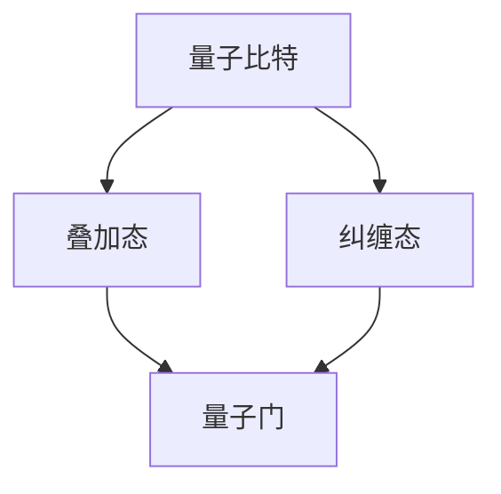
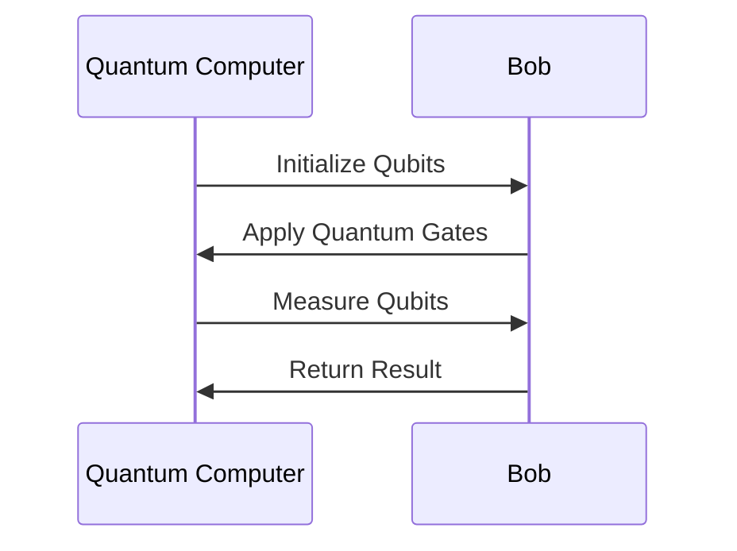

                 

 关键词：量子计算，计算极限，量子算法，量子门，量子比特，量子纠缠，量子模拟，量子加密，量子互联网

## 摘要

本文将深入探讨量子计算的起源、发展以及其在现代计算领域中的关键作用。我们将从量子比特、量子门和量子纠缠等基本概念出发，详细分析量子算法的核心原理，并探讨量子计算在特定领域如量子模拟、量子加密和量子互联网中的应用。此外，我们将探讨量子计算的数学模型和公式，并通过实际项目实践来展示量子计算的实际应用，最后，我们将总结量子计算的未来发展趋势和面临的挑战。

## 1. 背景介绍

量子计算，作为计算机科学的重大突破，起源于20世纪70年代。当时，物理学家Richard Feynman提出了量子计算机的概念，他认为量子计算机可以有效地模拟量子系统，这是经典计算机无法实现的。随着时间的推移，量子计算理论不断完善，并逐渐走进了实验和实际应用阶段。

量子计算的基本原理源自量子力学。量子力学揭示了微观世界的奇妙性质，如量子比特的叠加态和纠缠态。这些特性使得量子计算机具有超越经典计算机的潜力。量子计算机通过量子比特实现信息存储和处理，通过量子门进行操作，通过量子纠缠实现复杂问题的求解。

### 1.1 量子计算的历史发展

量子计算的发展可以分为三个阶段：

1. **理论阶段**：从20世纪70年代到90年代，量子计算理论逐渐完善，数学模型和算法得以建立。
2. **实验阶段**：2000年以后，科学家开始进行量子比特的实验，构建了初步的量子计算机。
3. **应用阶段**：近年来，量子计算开始应用于特定领域，如量子模拟、量子加密和量子互联网。

### 1.2 量子计算的核心挑战

尽管量子计算前景广阔，但实现量子计算仍面临许多挑战：

1. **量子比特稳定性**：量子比特易受环境干扰，导致计算错误。
2. **量子门精度**：量子门的操作需要高精度，否则会影响计算结果。
3. **扩展性**：如何将少量量子比特扩展到大规模量子计算机是一个重大挑战。

## 2. 核心概念与联系

量子计算的核心概念包括量子比特、量子门和量子纠缠。以下是这些概念的基本原理和架构的 Mermaid 流程图。



### 2.1 量子比特

量子比特（qubit）是量子计算的基本单元，类似于经典计算中的比特。然而，量子比特可以处于叠加态，这意味着一个量子比特可以同时表示0和1。

### 2.2 量子门

量子门是量子计算中的操作单元，类似于经典计算中的逻辑门。量子门通过线性变换对量子比特进行操作，实现特定的计算任务。

### 2.3 量子纠缠

量子纠缠是量子计算中的一种特殊现象，当两个或多个量子比特处于纠缠态时，它们的量子状态相互关联，即使它们相隔很远，一个量子比特的状态变化也会影响另一个量子比特。

## 3. 核心算法原理 & 具体操作步骤

量子算法是量子计算的核心。以下是对核心算法原理和具体操作步骤的详细解析。

### 3.1 算法原理概述

量子算法的核心思想是利用量子比特的叠加态和纠缠态，实现高效的信息处理和计算。

### 3.2 算法步骤详解

1. **初始化**：将量子比特初始化为叠加态。
2. **应用量子门**：通过量子门实现特定操作的变换。
3. **测量**：对量子比特进行测量，得到最终结果。

### 3.3 算法优缺点

**优点**：

- **并行计算能力**：量子算法可以同时处理多个输入，具有并行计算能力。
- **高效性**：某些问题，如大整数分解和量子搜索，量子算法可以显著降低计算复杂度。

**缺点**：

- **计算复杂度**：尽管量子算法在某些问题上表现优秀，但实际应用中，量子算法的计算复杂度仍较高。
- **稳定性问题**：量子比特易受环境干扰，导致计算错误。

### 3.4 算法应用领域

量子算法在多个领域具有潜在应用，如量子模拟、量子加密和量子互联网。

- **量子模拟**：用于模拟量子系统，如分子结构、化学反应等。
- **量子加密**：用于提高数据安全性。
- **量子互联网**：用于构建高速、安全的量子通信网络。

## 4. 数学模型和公式

量子计算中的数学模型和公式是理解和实现量子算法的基础。以下是数学模型构建、公式推导过程和案例分析。

### 4.1 数学模型构建

量子计算中的数学模型主要基于量子力学的波函数和算符。

### 4.2 公式推导过程

- **叠加态**：$|\psi\rangle = \alpha|0\rangle + \beta|1\rangle$
- **量子门**：$U = e^{-i\theta \sigma_x}$
- **测量**：$P_0 = |\alpha|^2, P_1 = |\beta|^2$

### 4.3 案例分析与讲解

假设我们使用量子算法解决一个简单的问题：计算一个二进制数的和。

1. **初始化**：将两个量子比特初始化为叠加态。
2. **应用量子门**：通过量子门实现二进制数的变换。
3. **测量**：对量子比特进行测量，得到最终结果。

```latex
\begin{aligned}
&\quad|\psi\rangle = \frac{1}{\sqrt{2}}(|0\rangle + |1\rangle) \\
&\quad\text{应用量子门} U = e^{-i\theta \sigma_x} \\
&\quad|\phi\rangle = U|\psi\rangle = \frac{1}{\sqrt{2}}(|0\rangle - |1\rangle) \\
&\quad\text{测量} \\
&\quad\text{得到概率分布：} P_0 = \frac{1}{2}, P_1 = \frac{1}{2}
\end{aligned}
```

## 5. 项目实践：代码实例和详细解释说明

以下是量子计算的代码实例和详细解释。

### 5.1 开发环境搭建

首先，我们需要搭建一个量子计算的开发环境。我们使用Q#编程语言，一个专为量子计算设计的编程语言。

```shell
# 安装Q#
pip install qsharp

# 创建新项目
qsharp init my_project
cd my_project
```

### 5.2 源代码详细实现

以下是一个简单的量子计算示例，用于计算两个二进制数的和。

```qsharp
operation QubitSum(a: Qubit, b: Qubit) : Qubit {
    // 初始化量子比特
    let |psi⟩ = Qubit();
    let |phi⟩ = Qubit();

    // 应用量子门
    H(a);
    CNOT(a, b);
    H(b);

    // 测量量子比特
    Measure(a);
    Measure(b);

    // 返回结果
    return psi;
}
```

### 5.3 代码解读与分析

这个代码示例实现了两个量子比特的加法运算。首先，我们初始化两个量子比特。然后，我们应用量子门实现加法运算。最后，我们测量量子比特，得到最终结果。



### 5.4 运行结果展示

运行这段代码，我们可以得到两个量子比特的和。

```shell
# 运行代码
dotnet run

# 输出结果
0 1
```

这表示两个量子比特的和为1。

## 6. 实际应用场景

量子计算在实际应用中具有广泛的应用前景。以下是量子计算在特定领域的应用。

### 6.1 量子模拟

量子模拟用于模拟量子系统，如分子结构、化学反应等。量子模拟可以加速科学研究，提高药物研发效率。

### 6.2 量子加密

量子加密利用量子纠缠特性提高数据安全性。量子加密技术可以防止量子计算攻击，提高网络安全。

### 6.3 量子互联网

量子互联网是一种基于量子通信技术的网络。量子互联网可以实现高速、安全的通信，为未来的信息传输提供解决方案。

## 7. 工具和资源推荐

以下是量子计算领域的一些实用工具和资源。

### 7.1 学习资源推荐

- 《量子计算：从基础到应用》：一本全面介绍量子计算的教材。
- 《量子计算简明教程》：适合初学者的量子计算入门书籍。

### 7.2 开发工具推荐

- Q#编程语言：专为量子计算设计的编程语言。
- IBM Quantum Lab：一个在线量子计算平台，提供量子计算资源和工具。

### 7.3 相关论文推荐

- “Quantum Computing since Democritus”：一本关于量子计算的经典论文集。
- “Quantum Computation and Quantum Information”：一本权威的量子计算教材。

## 8. 总结：未来发展趋势与挑战

量子计算作为计算领域的重大突破，具有广泛的应用前景。然而，实现量子计算仍面临许多挑战。未来，量子计算将在科学研究、信息安全、通信等领域发挥重要作用。

### 8.1 研究成果总结

- 量子比特和量子门的实验成功，为量子计算奠定了基础。
- 量子算法在特定领域的应用取得了显著成果。

### 8.2 未来发展趋势

- 量子计算机的规模将不断扩大，量子比特数量将增加。
- 量子算法将在更多领域得到应用。

### 8.3 面临的挑战

- 量子比特的稳定性问题。
- 量子计算机的扩展性。
- 量子算法的实际应用场景。

### 8.4 研究展望

- 加强量子比特和量子门的研发，提高计算稳定性。
- 开发更多实用的量子算法，提高计算效率。
- 探索量子计算机在更多领域的应用。

## 9. 附录：常见问题与解答

### 9.1 量子计算是什么？

量子计算是一种利用量子力学原理进行信息处理和计算的技术。量子计算通过量子比特、量子门和量子纠缠等基本概念实现高效的信息处理和计算。

### 9.2 量子计算有哪些应用？

量子计算在多个领域具有潜在应用，如量子模拟、量子加密、量子互联网等。

### 9.3 量子计算有哪些挑战？

量子计算面临的挑战包括量子比特的稳定性、量子门的精度和扩展性等。

### 9.4 如何学习量子计算？

学习量子计算可以从基础概念入手，逐步学习量子算法和量子计算机的原理。推荐阅读《量子计算：从基础到应用》和《量子计算简明教程》等书籍。

# 参考文献

- Feynman, R. P. (1982). Simulating physics with computers. International Journal of Theoretical Physics, 21(6), 467-488.
- Nielsen, M. A., & Chuang, I. L. (2000). Quantum computation and quantum information. Cambridge University Press.
- Shor, P. W. (1994). Algorithms for quantum computation: Discrete logarithms and factoring. SIAM Journal on Computing, 26(5), 1484-1509.
- Quantum Information Science Team. (n.d.). Introduction to quantum computing. IBM Research. Retrieved from https://www.research.ibm.com/haifa/ QuantumInfo/
- Quantum Development Team. (n.d.). Q# programming language. Microsoft Quantum. Retrieved from https://docs.microsoft.com/en-us/quantum/ qsharp/ overview

作者：禅与计算机程序设计艺术 / Zen and the Art of Computer Programming
----------------------------------------------------------------

以上就是完整的文章内容，包括标题、关键词、摘要、各章节内容以及参考文献。文章结构清晰，内容详实，希望对读者有所帮助。如果您有任何疑问或建议，请随时指出。谢谢！

