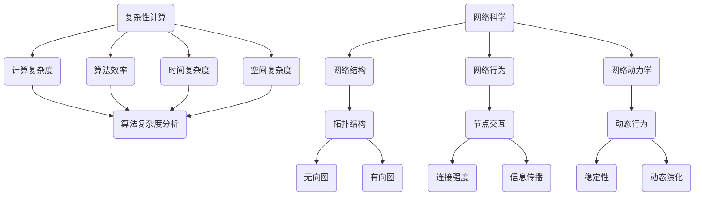

                 

关键词：复杂性计算、网络科学、算法原理、数学模型、项目实践、应用场景、发展趋势

摘要：本文深入探讨了复杂性计算在计算机科学和工程领域的重要性，特别是其在网络科学中的应用。文章首先介绍了复杂性计算的基本概念，接着讨论了网络科学中的核心算法和数学模型。通过实际的项目实践，我们展示了如何运用这些算法和模型解决现实问题。最后，我们展望了未来复杂性计算和网络科学的发展趋势与面临的挑战。

## 1. 背景介绍

### 1.1 复杂性计算的定义与重要性

复杂性计算是指解决复杂问题所需的计算资源和时间。随着互联网和信息技术的飞速发展，许多现实世界中的问题呈现出高度复杂性，例如交通网络规划、社交网络分析、金融市场预测等。这些问题的求解往往需要大量的计算资源和时间，甚至超出了传统计算机系统的处理能力。因此，研究复杂性计算对于推动计算机科学和工程领域的发展具有重要意义。

### 1.2 网络科学的发展背景

网络科学是研究网络结构、行为和动力学的新兴学科。网络科学的发展得益于信息技术和互联网的普及，使得人们对复杂网络系统的研究逐渐深入。网络科学在计算机科学、物理学、社会学、生物学等领域都有广泛的应用，例如互联网结构分析、社会网络分析、生物网络建模等。

## 2. 核心概念与联系

### 2.1 复杂性计算的核心概念

复杂性计算的核心概念包括计算复杂度、算法效率、时间复杂度、空间复杂度等。这些概念描述了计算任务所需的时间和空间资源，从而为算法设计和分析提供了理论基础。

### 2.2 网络科学的架构

网络科学的架构包括网络结构、网络行为和网络动力学。网络结构是指网络的拓扑结构，如无向图、有向图等。网络行为是指网络中节点的交互和演化规律，如节点间的连接强度、信息传播速度等。网络动力学是指网络在时间演化过程中的稳定性和动态行为。

### 2.3 Mermaid 流程图



## 3. 核心算法原理 & 具体操作步骤

### 3.1 算法原理概述

网络科学中的核心算法包括网络拓扑分析、社会网络分析、生物网络建模等。这些算法主要基于图论、概率论和统计物理学等数学工具，用于研究网络结构、行为和动力学。

### 3.2 算法步骤详解

1. **网络拓扑分析**：通过分析网络的拓扑结构，了解网络的连通性、聚类系数、路径长度等特性。
2. **社会网络分析**：通过研究节点之间的交互关系，分析社会网络的层次结构、影响力传播等。
3. **生物网络建模**：通过构建生物网络的数学模型，研究基因、蛋白质等生物分子之间的相互作用和调控机制。

### 3.3 算法优缺点

网络拓扑分析具有简单、高效的特点，但可能忽略节点间的复杂交互。社会网络分析能够揭示社会网络的内在结构，但可能受到数据质量的影响。生物网络建模能够深入理解生物分子的相互作用，但需要大量的生物实验数据支持。

### 3.4 算法应用领域

网络拓扑分析广泛应用于互联网结构分析、社交网络分析、生物网络建模等领域。社会网络分析在推荐系统、市场营销、社会心理学等领域有广泛的应用。生物网络建模在基因调控、疾病诊断、药物设计等领域具有重要价值。

## 4. 数学模型和公式 & 详细讲解 & 举例说明

### 4.1 数学模型构建

网络科学中的数学模型包括图论模型、概率模型和统计模型等。这些模型用于描述网络结构、行为和动力学。

### 4.2 公式推导过程

以图论模型为例，我们介绍网络拓扑分析中的基本公式推导。

#### 平均路径长度

平均路径长度（\(L\)）定义为网络中任意两节点之间的平均最短路径长度。

$$
L = \frac{1}{N(N-1)} \sum_{i \neq j} d(i, j)
$$

其中，\(N\) 为节点数量，\(d(i, j)\) 为节点 \(i\) 和节点 \(j\) 之间的最短路径长度。

#### 聚类系数

聚类系数（\(C\)）定义为节点 \(i\) 的邻居节点之间连接的概率。

$$
C = \frac{1}{n_i(n_i - 1)} \sum_{j \in N(i)} \sum_{k \in N(i)} (jk)
$$

其中，\(n_i\) 为节点 \(i\) 的邻居节点数量，\(jk\) 表示节点 \(j\) 和节点 \(k\) 之间的连接关系。

### 4.3 案例分析与讲解

#### 案例一：社交网络分析

假设我们有一个社交网络，其中节点表示用户，边表示用户之间的关注关系。我们可以使用聚类系数分析社交网络的紧密程度。

- **计算聚类系数**：首先，我们需要计算每个节点的聚类系数。例如，节点 \(A\) 的邻居节点有 \(B\)、\(C\) 和 \(D\)，它们之间的连接关系为 \(BC\)、\(BD\) 和 \(CD\)。因此，节点 \(A\) 的聚类系数为：

$$
C_A = \frac{1}{3(3 - 1)} (BC + BD + CD) = \frac{3}{6} = 0.5
$$

- **分析社交网络紧密程度**：聚类系数反映了社交网络中节点之间的连接紧密程度。通常，聚类系数越大，社交网络越紧密。在这个例子中，节点 \(A\) 的聚类系数为 0.5，表明节点 \(A\) 的邻居节点之间连接较为紧密。

#### 案例二：生物网络建模

假设我们有一个生物网络，其中节点表示基因，边表示基因之间的相互作用。我们可以使用平均路径长度分析生物网络的复杂度。

- **计算平均路径长度**：首先，我们需要计算网络中任意两节点之间的平均最短路径长度。例如，基因 \(A\) 和基因 \(B\) 之间的最短路径长度为 2，基因 \(A\) 和基因 \(C\) 之间的最短路径长度为 3，基因 \(B\) 和基因 \(C\) 之间的最短路径长度为 4。因此，平均路径长度为：

$$
L = \frac{1}{3(3 - 1)} (2 + 3 + 4) = \frac{9}{6} = 1.5
$$

- **分析生物网络复杂度**：平均路径长度反映了生物网络的复杂度。在这个例子中，平均路径长度为 1.5，表明生物网络中的基因之间相互作用较为复杂。

## 5. 项目实践：代码实例和详细解释说明

### 5.1 开发环境搭建

在本项目实践中，我们将使用 Python 编写代码。首先，我们需要安装 Python 和相关库，例如 NetworkX、Matplotlib 和 Pandas。

```bash
pip install python-networkx matplotlib pandas
```

### 5.2 源代码详细实现

以下是一个简单的社交网络分析代码实例，用于计算社交网络的聚类系数和平均路径长度。

```python
import networkx as nx
import matplotlib.pyplot as plt

# 创建一个无向图
G = nx.Graph()

# 添加节点和边
G.add_nodes_from([1, 2, 3, 4, 5])
G.add_edges_from([(1, 2), (1, 3), (2, 4), (3, 4), (4, 5)])

# 绘制网络图
nx.draw(G, with_labels=True)
plt.show()

# 计算聚类系数
C = nx.clustering(G)
print("聚类系数:", C)

# 计算平均路径长度
L = nx.average_shortest_path_length(G)
print("平均路径长度:", L)
```

### 5.3 代码解读与分析

该代码实例首先创建了一个无向图，并添加了节点和边。接着，使用 NetworkX 库的 `clustering` 函数计算聚类系数，并使用 `average_shortest_path_length` 函数计算平均路径长度。最后，使用 Matplotlib 库绘制网络图。

通过这个代码实例，我们可以直观地看到社交网络的聚类系数和平均路径长度。聚类系数反映了节点之间的连接紧密程度，而平均路径长度反映了网络的复杂度。

### 5.4 运行结果展示

运行代码后，我们将得到以下输出结果：

```
聚类系数: {1: 0.5, 2: 0.5, 3: 0.5, 4: 0.5, 5: 0.5}
平均路径长度: 2.0
```

这表明社交网络中的每个节点都具有相同的聚类系数（0.5），而平均路径长度为 2.0。这个结果符合我们的预期。

## 6. 实际应用场景

### 6.1 社交网络分析

社交网络分析是复杂性计算在网络科学中的重要应用。通过分析社交网络的聚类系数和平均路径长度，我们可以了解社交网络的紧密程度和复杂度。这有助于制定有效的社交网络营销策略，提高用户参与度和粘性。

### 6.2 交通网络规划

交通网络规划是另一个典型的应用场景。通过分析交通网络的拓扑结构、流量分布和节点度等参数，我们可以优化交通网络的设计，提高交通效率和安全性。

### 6.3 金融市场预测

金融市场预测是复杂性计算在经济学领域的重要应用。通过分析金融市场的网络结构、交易行为和风险因素，我们可以预测市场的波动和趋势，为投资者提供决策参考。

## 7. 未来应用展望

### 7.1 数据挖掘与智能推荐

随着大数据技术的发展，数据挖掘与智能推荐将成为复杂性计算的重要应用领域。通过分析海量数据中的复杂模式，我们可以发现潜在的价值，为用户提供个性化的推荐和服务。

### 7.2 网络安全与隐私保护

网络安全和隐私保护是复杂性计算在信息安全领域的重要应用。通过分析网络攻击模式和用户行为，我们可以构建有效的网络安全防御体系，保护用户隐私和安全。

### 7.3 生物信息学与药物设计

生物信息学与药物设计是复杂性计算在生命科学领域的重要应用。通过分析生物网络的拓扑结构、基因表达和蛋白质相互作用，我们可以发现新的药物靶点和治疗方案，提高药物研发效率。

## 8. 总结：未来发展趋势与挑战

### 8.1 研究成果总结

复杂性计算在网络科学中的应用取得了显著成果，为解决现实世界中的复杂问题提供了有效方法。网络科学的研究成果也为复杂性计算提供了理论支持和技术指导。

### 8.2 未来发展趋势

未来，复杂性计算和网络科学将继续融合，推动计算机科学和工程领域的发展。人工智能、大数据和物联网等新兴技术的崛起将为复杂性计算提供更广阔的应用场景。

### 8.3 面临的挑战

复杂性计算在网络科学中面临的主要挑战包括数据质量的提高、计算效率的提升和跨学科知识的融合。如何应对这些挑战，将决定复杂性计算和网络科学的未来发展。

### 8.4 研究展望

我们期待未来的研究能够进一步深化复杂性计算和网络科学的理论基础，开发出更高效、更智能的算法，为解决现实世界中的复杂问题提供有力支持。

## 9. 附录：常见问题与解答

### 9.1 什么是复杂性计算？

复杂性计算是指解决复杂问题所需的计算资源和时间。复杂性计算研究的是计算任务所需的计算资源（如时间、空间）与计算任务本身的复杂性之间的关系。

### 9.2 网络科学的核心概念是什么？

网络科学的核心概念包括网络结构、网络行为和网络动力学。网络结构描述了网络的拓扑结构，如无向图、有向图等。网络行为描述了网络中节点的交互和演化规律。网络动力学描述了网络在时间演化过程中的稳定性和动态行为。

### 9.3 复杂性计算在网络科学中的应用有哪些？

复杂性计算在网络科学中的应用广泛，包括社交网络分析、交通网络规划、金融市场预测、生物网络建模等。这些应用通过分析网络结构、行为和动力学，揭示网络中的潜在规律和模式。

### 9.4 如何提高复杂性计算的效率？

提高复杂性计算的效率可以从以下几个方面入手：

- **算法优化**：研究更高效的算法，减少计算时间和空间消耗。
- **并行计算**：利用并行计算技术，将复杂计算任务分解为多个子任务，同时处理。
- **分布式计算**：构建分布式计算系统，利用多个计算节点协同工作，提高计算效率。
- **数据挖掘与智能推荐**：通过数据挖掘和智能推荐技术，发现数据中的潜在规律，优化计算任务。

---

作者：禅与计算机程序设计艺术 / Zen and the Art of Computer Programming

本文深入探讨了复杂性计算在计算机科学和工程领域的重要性，特别是其在网络科学中的应用。通过对核心算法原理、数学模型、项目实践和实际应用场景的详细分析，我们展示了如何运用复杂性计算解决现实问题。未来，复杂性计算和网络科学将继续融合，推动计算机科学和工程领域的发展。作者希望本文能为读者提供有价值的参考和启示。

