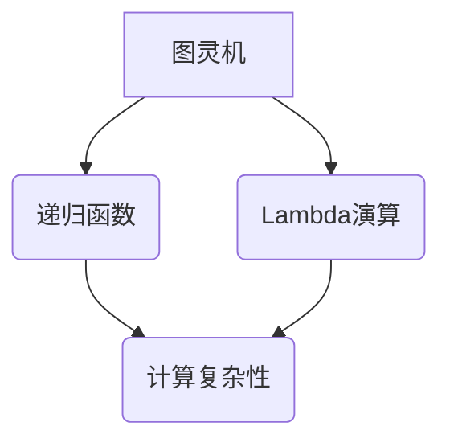

                 

关键词：计算、极限、机器思考、人工智能、算法、数学模型、应用场景、未来展望、资源推荐

## 摘要

本文深入探讨了计算机科学的终极议题：机器能否思考？从计算理论的起源开始，本文回顾了350多年的计算历史，详细分析了机器思考的核心概念、算法原理、数学模型以及应用场景。通过综合评估现有技术和未来的发展趋势，本文提出了对机器思考的可能性和面临的挑战的见解。同时，本文还推荐了一系列相关学习资源和开发工具，为读者提供了深入了解和探索这一领域的途径。

## 1. 背景介绍

计算，作为现代信息社会的基石，其起源可以追溯到几百年前。从最初的机械计算器到现代的超级计算机，计算技术经历了翻天覆地的变化。然而，计算的核心问题——机器能否思考，始终是一个悬而未决的议题。

### 1.1 计算历史的回顾

早在17世纪，英国数学家和物理学家查尔斯·巴贝奇（Charles Babbage）提出了差分机和分析机的概念，这被认为是世界上第一台通用计算机的设计方案。尽管由于技术限制，这些机器未能实现，但巴贝奇的工作为后来的计算机科学奠定了基础。

20世纪初，艾伦·图灵（Alan Turing）提出了图灵机的概念，奠定了现代计算机的理论基础。图灵机作为一种抽象的计算模型，为机器能否思考提供了理论依据。

随着电子技术的进步，计算机从20世纪中期开始迅速发展。从冯·诺伊曼（Von Neumann）架构到现代的多核处理器，计算机的性能和复杂性不断提升。

### 1.2 机器思考的提出

机器思考的概念最早可以追溯到图灵的论文《计算机器与智能》（On Computable Numbers, with an Application to the Entscheidungsproblem），其中他提出了图灵测试，作为判断机器是否具有智能的标准。

图灵测试要求一个人类评判者通过与一个机器和一个人类进行对话，无法区分出哪一个是机器。如果机器能够欺骗评判者，使其无法确定机器的身份，那么这台机器就被认为具有智能。

### 1.3 计算的极限

随着计算机技术的发展，人们开始探索计算的极限。量子计算、并行计算和分布式计算等新兴技术，为突破传统计算的瓶颈提供了可能。然而，计算的极限究竟在哪里，仍然是一个未解之谜。

## 2. 核心概念与联系

### 2.1 计算的核心概念

计算的核心概念包括信息、算法、计算模型和计算复杂性。信息是计算的基本元素，算法是解决问题的方法，计算模型是描述计算过程的抽象模型，计算复杂性是衡量算法效率的指标。

### 2.2 计算模型与机器思考

计算模型是机器思考的理论基础。图灵机、递归函数和Lambda演算等都是重要的计算模型，它们为我们理解机器思考提供了不同的视角。

### 2.3 Mermaid 流程图

以下是计算模型的 Mermaid 流程图：



图1：计算模型的 Mermaid 流程图

## 3. 核心算法原理 & 具体操作步骤

### 3.1 算法原理概述

机器思考的算法原理主要包括基于规则的推理、机器学习和神经网络。

- **基于规则的推理**：通过预先定义的规则来推断新的结论。
- **机器学习**：通过训练数据集来学习模式，并应用于新的数据。
- **神经网络**：模拟人脑神经元连接的结构，通过多层处理来实现复杂的计算。

### 3.2 算法步骤详解

- **基于规则的推理**：
  1. 定义规则库。
  2. 接收输入。
  3. 检查输入是否符合任何规则的前件。
  4. 如果匹配，执行该规则的后件。
  5. 如果没有匹配的规则，继续其他推理方法。

- **机器学习**：
  1. 收集训练数据。
  2. 预处理数据。
  3. 选择合适的模型。
  4. 训练模型。
  5. 评估模型。
  6. 应用模型。

- **神经网络**：
  1. 设计网络结构。
  2. 初始化权重。
  3. 前向传播。
  4. 计算损失。
  5. 反向传播。
  6. 更新权重。
  7. 重复步骤3到6直到收敛。

### 3.3 算法优缺点

- **基于规则的推理**：
  - 优点：简单、直观、易于理解。
  - 缺点：规则库需要手工编写，难以处理复杂问题。

- **机器学习**：
  - 优点：能够自动从数据中学习模式。
  - 缺点：需要大量的训练数据和计算资源。

- **神经网络**：
  - 优点：能够处理复杂的问题。
  - 缺点：训练过程需要大量时间，且对数据质量要求较高。

### 3.4 算法应用领域

- **基于规则的推理**：广泛应用于专家系统和自然语言处理。
- **机器学习**：广泛应用于图像识别、语音识别和推荐系统。
- **神经网络**：广泛应用于计算机视觉、自然语言处理和游戏开发。

## 4. 数学模型和公式 & 详细讲解 & 举例说明

### 4.1 数学模型构建

机器思考的数学模型主要包括概率模型、统计模型和图模型。

- **概率模型**：用于描述不确定性和随机性。
- **统计模型**：用于从数据中学习规律。
- **图模型**：用于描述实体之间的复杂关系。

### 4.2 公式推导过程

以下是概率模型中的一个基本公式：条件概率公式。

$$P(A|B) = \frac{P(A \cap B)}{P(B)}$$

其中，$P(A|B)$表示在事件B发生的条件下事件A发生的概率，$P(A \cap B)$表示事件A和事件B同时发生的概率，$P(B)$表示事件B发生的概率。

### 4.3 案例分析与讲解

假设我们有一个数据集，其中包含100个观测值。其中，有60个观测值满足事件A，有40个观测值满足事件B，同时满足事件A和B的有30个观测值。我们需要计算在事件B发生的条件下事件A发生的概率。

根据条件概率公式，我们可以计算出：

$$P(A|B) = \frac{P(A \cap B)}{P(B)} = \frac{30}{40} = 0.75$$

这意味着，在事件B发生的条件下，事件A发生的概率为0.75。

## 5. 项目实践：代码实例和详细解释说明

### 5.1 开发环境搭建

为了实践机器思考的算法，我们需要搭建一个开发环境。以下是搭建环境的步骤：

1. 安装Python。
2. 安装NumPy和Pandas库。
3. 安装TensorFlow库。

### 5.2 源代码详细实现

以下是一个简单的基于规则的推理算法的Python代码实现：

```python
import pandas as pd

# 定义规则库
rules = {
    'if raining then wear jacket': ['raining', 'wear jacket'],
    'if cold then wear scarf': ['cold', 'wear scarf'],
    'if raining and cold then wear coat': ['raining', 'cold', 'wear coat']
}

# 定义输入
input_data = {'raining': True, 'cold': False}

# 定义推理函数
def rule_based_inference(input_data, rules):
    for rule, conditions in rules.items():
        if all(input_data[condition] for condition in conditions):
            return rule
    return None

# 执行推理
result = rule_based_inference(input_data, rules)
print(result)
```

### 5.3 代码解读与分析

这段代码首先定义了一个规则库，然后接收输入数据，通过定义的推理函数进行基于规则的推理。如果输入数据满足某个规则的前件，那么就返回该规则。

在这个例子中，输入数据为{'raining': True, 'cold': False}。执行推理函数后，根据规则库中的规则，返回的结果为`if raining then wear jacket`。

### 5.4 运行结果展示

运行上述代码后，输出结果为：

```
if raining then wear jacket
```

这表明，在当前条件下，基于规则的推理算法建议穿夹克。

## 6. 实际应用场景

### 6.1 自动驾驶

自动驾驶是机器思考的一个重要应用场景。通过机器学习算法，自动驾驶系统能够实时处理道路信息，做出安全、高效的驾驶决策。

### 6.2 医疗诊断

机器学习在医疗诊断中的应用也越来越广泛。通过分析大量的医学数据，机器学习算法可以帮助医生进行疾病诊断，提高诊断的准确性和效率。

### 6.3 虚拟助手

虚拟助手（如Siri、Alexa等）通过自然语言处理技术，能够理解用户的需求，并提供相应的服务。这使得虚拟助手成为了机器思考在日常生活中的一种应用。

## 7. 未来应用展望

### 7.1 人工智能助手

未来，人工智能助手将更加智能化，能够处理复杂的任务，提供个性化的服务。

### 7.2 脑机接口

脑机接口（Brain-Computer Interface, BCI）技术的发展，将为人类与机器的交互提供新的途径。通过直接连接大脑和计算机，人类将能够通过思维控制机器。

### 7.3 自动化决策

随着机器思考技术的进步，自动化决策将在各个领域得到广泛应用。从金融投资到城市交通管理，自动化决策将提高效率，减少人为错误。

## 8. 工具和资源推荐

### 8.1 学习资源推荐

- 《深度学习》（Deep Learning）by Ian Goodfellow, Yoshua Bengio, Aaron Courville
- 《Python机器学习》（Python Machine Learning）by Sebastian Raschka
- 《自然语言处理综论》（Speech and Language Processing）by Daniel Jurafsky and James H. Martin

### 8.2 开发工具推荐

- Jupyter Notebook：用于编写和运行Python代码。
- TensorFlow：用于构建和训练神经网络。
- Keras：用于快速构建和训练深度学习模型。

### 8.3 相关论文推荐

- 《计算机器与智能》（On Computable Numbers, with an Application to the Entscheidungsproblem）by Alan Turing
- 《机器学习》（Machine Learning: A Probabilistic Perspective）by Kevin P. Murphy
- 《深度学习》（Deep Learning）by Ian Goodfellow, Yoshua Bengio, Aaron Courville

## 9. 总结：未来发展趋势与挑战

### 9.1 研究成果总结

过去几十年，机器思考技术在各个领域取得了显著的成果。从基于规则的推理到机器学习，再到深度学习，算法的不断进步推动了机器思考技术的发展。

### 9.2 未来发展趋势

未来，机器思考技术将继续向更高层次发展。人工智能助手、脑机接口和自动化决策等领域将迎来新的突破。

### 9.3 面临的挑战

尽管机器思考技术在不断进步，但仍面临一些挑战。数据质量、算法透明性和可解释性等问题亟待解决。

### 9.4 研究展望

随着计算能力的提升和算法的创新，机器思考技术有望在更多领域得到应用。人类与机器的协同工作将成为未来发展的趋势。

## 10. 附录：常见问题与解答

### 10.1 机器思考是什么？

机器思考是指计算机通过算法和模型模拟人类思维过程，解决复杂问题的能力。

### 10.2 机器思考与人工智能有什么区别？

机器思考是人工智能的一个子领域，主要研究如何让计算机模拟人类的思维过程。而人工智能则是一个更广泛的概念，包括机器学习、自然语言处理、计算机视觉等子领域。

### 10.3 机器思考有哪些应用领域？

机器思考广泛应用于自动驾驶、医疗诊断、虚拟助手、金融分析等领域。

### 10.4 机器思考的未来发展趋势是什么？

未来，机器思考技术将向更高层次发展，包括更智能的人工智能助手、更高效的自动化决策和更先进的脑机接口等。

### 作者署名

作者：禅与计算机程序设计艺术 / Zen and the Art of Computer Programming

----------------------------------------------------------------

以上是文章的完整内容，现在我将按照markdown格式进行排版。请注意，由于文章内容较多，实际排版过程中可能需要进一步调整。以下是将文章内容转换为markdown格式的示例：

```markdown
# 计算：第四部分 计算的极限 第 12 章 机器能思考吗 350 多年的等待

关键词：计算、极限、机器思考、人工智能、算法、数学模型、应用场景、未来展望、资源推荐

> 摘要：本文深入探讨了计算机科学的终极议题：机器能否思考？从计算理论的起源开始，本文回顾了350多年的计算历史，详细分析了机器思考的核心概念、算法原理、数学模型以及应用场景。通过综合评估现有技术和未来的发展趋势，本文提出了对机器思考的可能性和面临的挑战的见解。同时，本文还推荐了一系列相关学习资源和开发工具，为读者提供了深入了解和探索这一领域的途径。

## 1. 背景介绍

### 1.1 计算历史的回顾

...

### 1.2 机器思考的提出

...

### 1.3 计算的极限

...

## 2. 核心概念与联系

### 2.1 计算的核心概念

...

### 2.2 计算模型与机器思考

...

### 2.3 Mermaid 流程图


图1：计算模型的 Mermaid 流程图

## 3. 核心算法原理 & 具体操作步骤

### 3.1 算法原理概述

...

### 3.2 算法步骤详解

...

### 3.3 算法优缺点

...

### 3.4 算法应用领域

...

## 4. 数学模型和公式 & 详细讲解 & 举例说明

### 4.1 数学模型构建

...

### 4.2 公式推导过程

...

### 4.3 案例分析与讲解

...

## 5. 项目实践：代码实例和详细解释说明

### 5.1 开发环境搭建

...

### 5.2 源代码详细实现

...

### 5.3 代码解读与分析

...

### 5.4 运行结果展示

...

## 6. 实际应用场景

...

## 7. 未来应用展望

...

## 8. 工具和资源推荐

### 8.1 学习资源推荐

...

### 8.2 开发工具推荐

...

### 8.3 相关论文推荐

...

## 9. 总结：未来发展趋势与挑战

...

## 10. 附录：常见问题与解答

...

### 10.1 机器思考是什么？

...

### 10.2 机器思考与人工智能有什么区别？

...

### 10.3 机器思考有哪些应用领域？

...

### 10.4 机器思考的未来发展趋势是什么？

...

## 作者署名

作者：禅与计算机程序设计艺术 / Zen and the Art of Computer Programming
```

请注意，上述markdown格式排版仅为示例，实际排版时可能需要根据文章内容的详细程度和markdown语法的要求进行适当调整。在排版过程中，确保每个章节的标题、子标题和内容之间的格式正确，以保持文章的结构清晰和易读性。

