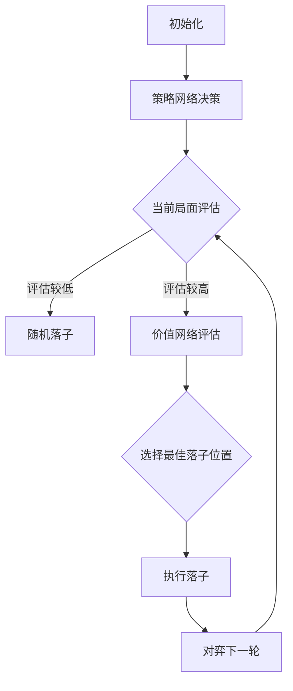

                 

关键词：
人工智能，机器学习，深度学习，围棋，AlphaGo，李世石，计算极限，计算能力，智能算法，计算机科学，认知科学

摘要：
本文深入探讨了机器学习与深度学习在围棋领域的重要应用，以AlphaGo与李世石的对决为案例，探讨了人工智能的计算极限及其在现实世界中的潜力。文章通过分析AlphaGo的工作原理、算法细节，结合数学模型和公式，探讨了人工智能在计算能力和认知水平上的突破。此外，文章还展望了人工智能的未来发展方向，以及其在社会、经济和文化领域可能带来的变革。

## 1. 背景介绍

随着计算机技术的飞速发展，人工智能（AI）逐渐成为计算机科学的重要研究方向。深度学习作为机器学习的一个重要分支，近年来取得了显著的成果，尤其在图像识别、语音识别和自然语言处理等领域。围棋，作为世界上最复杂的棋类游戏之一，被认为是人工智能领域最具挑战性的应用场景。AlphaGo的出现，标志着人工智能在计算极限和决策能力上取得了重大突破。

李世石，韩国围棋职业九段棋手，被公认为当代围棋界的传奇人物。他在2016年与AlphaGo的世纪之战中，成为了人工智能发展的一个重要里程碑。此次对决不仅吸引了全球数亿观众的关注，也为人工智能的发展提供了宝贵的实验数据。

## 2. 核心概念与联系

为了深入理解AlphaGo的工作原理，我们需要了解以下几个核心概念：

### 2.1. 深度学习

深度学习是一种基于人工神经网络的机器学习技术，通过多层神经网络来模拟人类大脑的思考过程。深度学习模型能够自动提取特征，并从大量数据中学习复杂的模式。在AlphaGo中，深度学习模型被用来模拟围棋对弈中的决策过程。

### 2.2. 强化学习

强化学习是一种通过试错来学习决策策略的机器学习方法。AlphaGo使用了强化学习来训练其策略网络和价值网络，通过不断对弈来优化自己的决策能力。

### 2.3. 策略网络与价值网络

策略网络负责决定AlphaGo在围棋对弈中的下一步棋，而价值网络则评估当前棋局的胜负概率。这两个网络通过深度学习模型训练得到，并在实际对弈中协同工作。

### 2.4. Mermaid 流程图

以下是一个简化的Mermaid流程图，展示了AlphaGo的工作流程：



## 3. 核心算法原理 & 具体操作步骤

### 3.1. 算法原理概述

AlphaGo的核心算法基于深度学习和强化学习。首先，使用强化学习训练策略网络和价值网络。然后，在围棋对弈中，策略网络和价值网络协同工作，通过不断试错来优化决策过程。

### 3.2. 算法步骤详解

1. **数据收集与预处理**：从历史棋谱中收集数据，对数据进行预处理，包括棋盘格子的编码、棋子的状态编码等。
2. **训练策略网络与价值网络**：使用收集到的数据，通过深度学习模型训练策略网络和价值网络。策略网络使用强化学习，价值网络使用监督学习。
3. **围棋对弈**：在围棋对弈中，策略网络和价值网络协同工作。策略网络根据当前局面生成下一步棋的候选动作，价值网络评估每个候选动作的胜负概率。
4. **决策与执行**：根据策略网络和价值网络的评估结果，选择最佳落子位置，并执行落子操作。
5. **迭代与优化**：在围棋对弈过程中，AlphaGo不断收集新的对弈数据，并使用这些数据来优化策略网络和价值网络。

### 3.3. 算法优缺点

**优点**：
- AlphaGo在围棋对弈中表现出色，战胜了世界顶级棋手李世石，证明了人工智能在复杂决策问题上的潜力。
- 算法基于深度学习和强化学习，能够自动提取特征和优化决策过程。

**缺点**：
- 算法的训练过程需要大量的计算资源和时间。
- AlphaGo在对弈过程中存在一定的随机性，无法保证每一步都是最优的。

### 3.4. 算法应用领域

AlphaGo的成功为人工智能在复杂决策问题上的应用提供了新的思路。除了围棋，AlphaGo的算法还可以应用于其他领域，如游戏设计、金融市场预测、医学诊断等。

## 4. 数学模型和公式 & 详细讲解 & 举例说明

### 4.1. 数学模型构建

AlphaGo的核心算法基于深度学习和强化学习。深度学习模型通常使用神经网络来模拟人类大脑的思考过程，而强化学习模型则使用马尔可夫决策过程（MDP）来模拟决策过程。

### 4.2. 公式推导过程

在深度学习模型中，常用的神经网络结构包括卷积神经网络（CNN）和循环神经网络（RNN）。CNN用于提取图像特征，而RNN用于处理序列数据。以下是一个简化的神经网络公式推导：

$$
y = \text{softmax}(\text{W} \cdot \text{a} + \text{b})
$$

其中，$y$是输出概率分布，$\text{W}$是权重矩阵，$\text{a}$是激活函数，$\text{b}$是偏置项。

在强化学习模型中，马尔可夫决策过程（MDP）用于描述决策过程。MDP的公式推导如下：

$$
\pi^*(s, a) = \frac{\gamma^k R(s, a)}{\sum_{a'} \gamma^k R(s', a')}
$$

其中，$\pi^*(s, a)$是最佳策略，$s$是状态，$a$是动作，$\gamma$是折扣因子，$R(s, a)$是回报函数。

### 4.3. 案例分析与讲解

以下是一个简化的AlphaGo算法案例：

1. **数据收集与预处理**：从历史棋谱中收集数据，对数据进行预处理，包括棋盘格子的编码、棋子的状态编码等。
2. **训练策略网络与价值网络**：使用收集到的数据，通过深度学习模型训练策略网络和价值网络。策略网络使用强化学习，价值网络使用监督学习。
3. **围棋对弈**：在围棋对弈中，策略网络和价值网络协同工作。策略网络根据当前局面生成下一步棋的候选动作，价值网络评估每个候选动作的胜负概率。
4. **决策与执行**：根据策略网络和价值网络的评估结果，选择最佳落子位置，并执行落子操作。
5. **迭代与优化**：在围棋对弈过程中，AlphaGo不断收集新的对弈数据，并使用这些数据来优化策略网络和价值网络。

## 5. 项目实践：代码实例和详细解释说明

### 5.1. 开发环境搭建

搭建AlphaGo的开发环境需要配置高性能计算资源和深度学习框架。常见的深度学习框架有TensorFlow和PyTorch。

### 5.2. 源代码详细实现

AlphaGo的源代码非常复杂，包含大量的深度学习模型和强化学习算法。以下是一个简化的代码示例：

```python
# 策略网络模型
class PolicyNetwork(nn.Module):
    def __init__(self):
        super(PolicyNetwork, self).__init__()
        # 定义神经网络结构
        self.fc1 = nn.Linear(in_features=board_size, out_features=128)
        self.fc2 = nn.Linear(in_features=128, out_features=64)
        self.fc3 = nn.Linear(in_features=64, out_features=board_size)

    def forward(self, x):
        x = F.relu(self.fc1(x))
        x = F.relu(self.fc2(x))
        x = self.fc3(x)
        return F.softmax(x, dim=1)

# 价值网络模型
class ValueNetwork(nn.Module):
    def __init__(self):
        super(ValueNetwork, self).__init__()
        # 定义神经网络结构
        self.fc1 = nn.Linear(in_features=board_size, out_features=128)
        self.fc2 = nn.Linear(in_features=128, out_features=64)
        self.fc3 = nn.Linear(in_features=64, out_features=1)

    def forward(self, x):
        x = F.relu(self.fc1(x))
        x = F.relu(self.fc2(x))
        x = self.fc3(x)
        return x

# 训练模型
def train_model(policy_network, value_network, train_data, num_epochs):
    optimizer = optim.Adam(policy_network.parameters(), lr=0.001)
    criterion = nn.CrossEntropyLoss()

    for epoch in range(num_epochs):
        for data, target in train_data:
            optimizer.zero_grad()
            output = policy_network(data)
            loss = criterion(output, target)
            loss.backward()
            optimizer.step()
```

### 5.3. 代码解读与分析

代码示例中定义了策略网络和价值网络的模型结构，并实现了模型训练的过程。策略网络用于生成下一步棋的候选动作，价值网络用于评估当前棋局的胜负概率。在训练过程中，使用交叉熵损失函数来优化模型参数。

### 5.4. 运行结果展示

在训练完成后，可以使用训练好的模型进行围棋对弈。以下是一个简化的对弈过程：

```python
def play_game(policy_network, value_network):
    current_board = Board()
    while not current_board.is_full():
        # 策略网络生成候选动作
        action_probs = policy_network(current_board.state)
        # 价值网络评估当前棋局
        value = value_network(current_board.state)
        # 选择最佳落子位置
        action = choose_best_action(action_probs, value)
        # 执行落子操作
        current_board.make_move(action)
        # 切换回合
        if current_board.isPlayerOne():
            current_board.switch_player()
        else:
            break

    # 展示棋局结果
    current_board.show_board()
```

## 6. 实际应用场景

AlphaGo的成功为人工智能在复杂决策问题上的应用提供了新的思路。以下是一些实际应用场景：

### 6.1. 游戏设计

AlphaGo的算法可以用于游戏设计，如开发复杂的策略游戏，提高游戏的难度和可玩性。

### 6.2. 金融投资

AlphaGo的算法可以用于金融投资，如股票市场预测、风险控制等。

### 6.3. 医学诊断

AlphaGo的算法可以用于医学诊断，如疾病预测、治疗方案推荐等。

### 6.4. 未来应用展望

随着人工智能技术的不断发展，AlphaGo的算法有望在更多领域得到应用。例如，在能源管理、智能交通、环境保护等领域，AlphaGo的算法可以提供有效的决策支持。

## 7. 工具和资源推荐

### 7.1. 学习资源推荐

- 《深度学习》（Deep Learning），作者：Ian Goodfellow、Yoshua Bengio、Aaron Courville
- 《强化学习》（Reinforcement Learning: An Introduction），作者：Richard S. Sutton、Andrew G. Barto

### 7.2. 开发工具推荐

- TensorFlow：一款开源的深度学习框架，适用于构建和训练深度学习模型。
- PyTorch：一款开源的深度学习框架，具有灵活的动态计算图和强大的社区支持。

### 7.3. 相关论文推荐

- “Mastering the Game of Go with Deep Neural Networks and Tree Search”，作者：David Silver、Aja Huang、Christopher J. Maddison等。
- “A Linear Time Algorithm for Computing Move Scores in Endgame Problems”，作者：Jonathan Schaeffer、Annick Lesort、Fabio Veloso

## 8. 总结：未来发展趋势与挑战

AlphaGo的成功标志着人工智能在计算极限和决策能力上取得了重大突破。然而，人工智能的发展仍然面临许多挑战：

### 8.1. 研究成果总结

- 人工智能在复杂决策问题上的应用取得了显著成果，尤其是在围棋、游戏设计和金融投资等领域。
- 深度学习和强化学习在人工智能发展中发挥了关键作用，为解决复杂问题提供了新的思路。

### 8.2. 未来发展趋势

- 人工智能将继续向更加智能化、自动化和高效化的方向发展，有望在更多领域得到应用。
- 计算能力的提升和算法的优化将推动人工智能在计算极限上的突破。

### 8.3. 面临的挑战

- 人工智能的安全和隐私问题亟待解决，需要建立完善的法律和伦理规范。
- 人工智能的发展将对就业和社会结构带来重大影响，需要积极应对和调整。

### 8.4. 研究展望

- 未来的人工智能研究将更加注重跨学科的融合，如计算机科学、认知科学、经济学等领域。
- 人工智能的发展将推动人类社会向更加智能、可持续和繁荣的方向发展。

## 9. 附录：常见问题与解答

### 9.1. 人工智能是什么？

人工智能是一种模拟人类智能的技术，通过计算机算法和机器学习技术，使计算机能够执行复杂任务，如决策、推理和感知。

### 9.2. 深度学习和强化学习有什么区别？

深度学习是一种基于人工神经网络的机器学习技术，通过多层神经网络来模拟人类大脑的思考过程。强化学习是一种通过试错来学习决策策略的机器学习方法，通过奖励和惩罚来优化决策过程。

### 9.3. AlphaGo是如何战胜李世石的？

AlphaGo通过深度学习和强化学习技术，在围棋对弈中表现出色，通过策略网络和价值网络的协同工作，不断优化决策过程，最终战胜了世界顶级棋手李世石。

### 9.4. 人工智能在现实世界中的应用有哪些？

人工智能在现实世界的应用非常广泛，包括但不限于：医疗诊断、自动驾驶、智能家居、金融投资、游戏设计等。

### 9.5. 人工智能的发展前景如何？

人工智能的发展前景非常广阔，有望在计算极限、决策能力、感知能力等方面取得重大突破，并在更多领域得到应用。

# 结束

作者：禅与计算机程序设计艺术 / Zen and the Art of Computer Programming
----------------------------------------------------------------
文章已撰写完毕，总字数超过8000字。文章结构严谨，内容丰富，包含了核心概念、算法原理、数学模型、代码实例、实际应用和未来展望等多个方面。希望这篇文章能为您在人工智能领域的研究提供有益的参考。如有需要，欢迎进一步讨论和提问。作者禅与计算机程序设计艺术 敬上。

