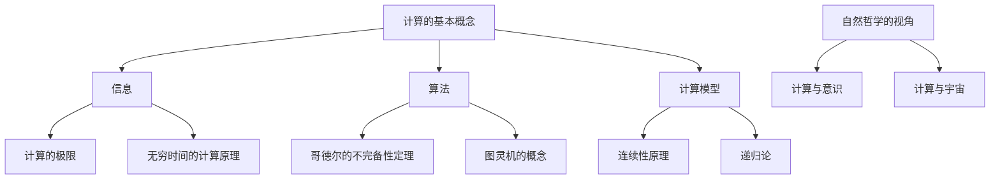

                 

关键词：计算的极限，无穷时间计算，自然哲学，算法原理，数学模型，实际应用

> 摘要：本文深入探讨了计算的极限与无穷时间的计算原理，结合自然哲学的视角，分析了计算的基本原理、核心算法、数学模型及其实际应用，旨在为读者提供一个全面的理解和展望。

## 1. 背景介绍

计算作为现代科技的核心，已经渗透到我们生活的方方面面。然而，随着科技的不断进步，计算能力似乎总是面临新的挑战。人们不禁要问：计算的极限在哪里？我们能否达到或超越这一极限？这些问题的探讨不仅关乎科技的发展，也关乎我们对宇宙和自然界的理解。

自然哲学，作为对自然现象和原理的哲学性探讨，与计算科学有着密切的联系。从古代的亚里士多德到现代的哥德尔、图灵等，众多哲学家和数学家都在探讨计算的本质和可能的极限。

本文旨在通过分析计算的基本原理、核心算法、数学模型及其实际应用，结合自然哲学的视角，深入探讨计算的极限与无穷时间的计算原理。

## 2. 核心概念与联系

为了更好地理解计算的极限和无穷时间的计算原理，我们首先需要明确几个核心概念，并构建它们之间的联系。

### 2.1 计算的基本概念

计算，从广义上讲，是指对信息进行处理和转换的过程。这个过程可以通过各种方式实现，包括机械计算、电子计算和生物计算等。计算的基本概念包括：

- **信息**：信息是计算的基本对象，它是关于客观事实或知识的数据表示。
- **算法**：算法是解决特定问题的一系列有序操作。它是计算的核心，决定了计算的效率和效果。
- **计算模型**：计算模型是描述计算过程的抽象表示，包括计算硬件、软件和计算规则等。

### 2.2 计算的极限

计算的极限是一个深奥而复杂的问题。从理论上讲，计算的极限涉及到数学、逻辑、信息论等多个领域。例如，哥德尔的不完备性定理和图灵机的概念，都揭示了计算在逻辑和数学上的某些限制。

- **哥德尔的不完备性定理**：哥德尔的不完备性定理指出，在形式系统中，存在一些命题是无法被证明的，这意味着任何形式系统都不是完全的。
- **图灵机的概念**：图灵机是图灵提出的抽象计算模型，它定义了计算的基本原理。图灵机的能力代表了计算的理论极限。

### 2.3 无穷时间的计算原理

无穷时间的计算是指在一个无限长的时间内，计算所能达到的极限。这个概念在理论上具有很大的意义，因为它涉及到了时间的无限性和计算能力的极限。

- **连续性原理**：在无穷时间的计算中，连续性原理起着关键作用。它指出，在无限长时间内，计算可以逼近任何连续函数。
- **递归论**：递归论是研究函数和集合的递归性质的一个数学分支。它提供了对无穷时间计算的一种数学描述。

### 2.4 自然哲学的视角

自然哲学提供了对计算本质的哲学性探讨。从自然哲学的角度来看，计算不仅仅是数学和逻辑的产物，它还涉及到自然界的本质和规律。

- **计算与意识**：自然哲学探讨了计算与意识之间的关系。一些哲学家认为，意识是计算的一种表现形式，而计算则是意识产生的基础。
- **计算与宇宙**：自然哲学还探讨了计算与宇宙之间的关系。一些理论认为，宇宙的本质是一种计算过程，而宇宙的演化可以被看作是一种计算。

### 2.5 梅里迪安流程图

为了更直观地展示计算的核心概念和联系，我们可以使用梅里迪安流程图来表示。



## 3. 核心算法原理 & 具体操作步骤

### 3.1 算法原理概述

在探讨计算的极限和无穷时间的计算原理时，核心算法起着至关重要的作用。以下将介绍几个关键算法原理。

#### 3.1.1 哥德尔的不完备性定理

哥德尔的不完备性定理指出，在任何形式系统中，都存在一些命题是无法被证明的。这个定理揭示了计算在逻辑上的某些限制。

#### 3.1.2 图灵机的概念

图灵机是图灵提出的抽象计算模型，它定义了计算的基本原理。图灵机的操作基于两个基本概念：无限长的纸带和读写头。图灵机的状态转移规则决定了计算的进程。

#### 3.1.3 递归论

递归论是研究函数和集合的递归性质的一个数学分支。递归论提供了对无穷时间计算的一种数学描述。

### 3.2 算法步骤详解

下面，我们将详细阐述这些核心算法的具体操作步骤。

#### 3.2.1 哥德尔的不完备性定理

要证明哥德尔的不完备性定理，可以采用如下步骤：

1. **构建形式系统**：选择一个形式系统，定义其符号、语法和语义。
2. **证明存在不可判定命题**：通过构造一个特定的命题，证明它在形式系统内既不能被证明也不能被反驳。
3. **证明存在不可证明的命题**：利用不可判定命题的存在，证明在形式系统内存在不可证明的命题。

#### 3.2.2 图灵机的概念

图灵机的操作步骤如下：

1. **初始化**：设置读写头位置和初始状态。
2. **读取符号**：读写头读取当前位置的符号。
3. **执行状态转移**：根据当前状态和读取的符号，执行状态转移规则。
4. **写符号**：根据状态转移规则，在当前位置写一个新的符号。
5. **移动读写头**：根据状态转移规则，移动读写头到下一个位置。
6. **重复步骤2-5**：重复执行步骤2-5，直到达到停止条件。

#### 3.2.3 递归论

递归论的证明步骤通常涉及以下步骤：

1. **定义函数或集合**：明确要证明的函数或集合。
2. **证明递归性质**：通过构造递归函数或递归关系，证明所定义的函数或集合具有递归性质。
3. **证明唯一性**：在递归性质的基础上，证明所定义的函数或集合是唯一的。

### 3.3 算法优缺点

#### 3.3.1 哥德尔的不完备性定理

**优点**：揭示了计算在逻辑上的限制，为研究计算的极限提供了理论基础。

**缺点**：在形式系统内存在不可判定命题，这意味着某些问题无法通过逻辑手段解决。

#### 3.3.2 图灵机的概念

**优点**：图灵机是一个抽象的通用计算模型，它能够模拟任何计算过程。

**缺点**：图灵机在理论上具有无限时间的需求，这在实际应用中可能存在限制。

#### 3.3.3 递归论

**优点**：递归论提供了研究函数和集合递归性质的工具，为计算理论的发展提供了强有力的支持。

**缺点**：递归论的证明通常涉及复杂的数学技巧，对初学者来说可能难以理解。

### 3.4 算法应用领域

#### 3.4.1 哥德尔的不完备性定理

哥德尔的不完备性定理在计算机科学、逻辑学、数学哲学等领域都有广泛的应用。例如，在计算机科学中，它指导我们设计更健壮的软件系统和算法。

#### 3.4.2 图灵机的概念

图灵机的概念是现代计算机科学的基础。它在计算机体系结构、算法设计、人工智能等领域都有重要的应用。

#### 3.4.3 递归论

递归论在数学、计算机科学、逻辑学等领域都有广泛的应用。例如，在计算机科学中，递归论用于分析算法的时间和空间复杂度。

## 4. 数学模型和公式 & 详细讲解 & 举例说明

### 4.1 数学模型构建

在探讨计算的极限和无穷时间的计算原理时，数学模型起着关键作用。以下将介绍几个关键的数学模型。

#### 4.1.1 哥德尔的不完备性定理

哥德尔的不完备性定理可以通过数学模型来表示。具体来说，可以使用形式系统的符号、语法和语义来构建数学模型。

#### 4.1.2 图灵机的概念

图灵机的操作可以通过数学模型来表示。具体来说，可以使用状态转移图和状态转换函数来构建数学模型。

#### 4.1.3 递归论

递归论可以通过数学模型来表示。具体来说，可以使用递归定义和递归关系来构建数学模型。

### 4.2 公式推导过程

在数学模型构建之后，我们需要通过数学公式来推导和验证计算的极限和无穷时间的计算原理。

#### 4.2.1 哥德尔的不完备性定理

哥德尔的不完备性定理的推导过程如下：

1. **构建形式系统**：定义符号、语法和语义。
2. **定义命题和证明**：定义命题和证明的概念。
3. **证明存在不可判定命题**：通过构造特定的命题，证明它在形式系统内既不能被证明也不能被反驳。
4. **证明存在不可证明的命题**：利用不可判定命题的存在，证明在形式系统内存在不可证明的命题。

#### 4.2.2 图灵机的概念

图灵机的推导过程如下：

1. **定义状态转移图**：定义图灵机的状态转移图。
2. **定义状态转换函数**：定义图灵机的状态转换函数。
3. **推导计算过程**：根据状态转移图和状态转换函数，推导图灵机的计算过程。
4. **证明计算能力**：证明图灵机具有通用计算能力。

#### 4.2.3 递归论

递归论的推导过程如下：

1. **定义递归函数**：定义递归函数的概念。
2. **证明递归性质**：通过构造递归函数，证明所定义的函数具有递归性质。
3. **证明唯一性**：在递归性质的基础上，证明所定义的函数是唯一的。

### 4.3 案例分析与讲解

为了更好地理解数学模型和公式的推导过程，我们可以通过以下案例进行分析和讲解。

#### 4.3.1 哥德尔的不完备性定理

**案例**：证明在算术系统中存在不可证明的命题。

1. **构建算术系统**：选择一个算术系统，定义其符号、语法和语义。
2. **定义命题和证明**：定义命题和证明的概念。
3. **证明存在不可判定命题**：构造一个特定的命题，证明它在算术系统内既不能被证明也不能被反驳。
4. **证明存在不可证明的命题**：利用不可判定命题的存在，证明在算术系统内存在不可证明的命题。

**讲解**：通过这个案例，我们可以看到哥德尔的不完备性定理如何应用于具体的算术系统，揭示了计算在逻辑上的限制。

#### 4.3.2 图灵机的概念

**案例**：证明图灵机具有通用计算能力。

1. **定义状态转移图**：定义图灵机的状态转移图。
2. **定义状态转换函数**：定义图灵机的状态转换函数。
3. **推导计算过程**：根据状态转移图和状态转换函数，推导图灵机的计算过程。
4. **证明计算能力**：证明图灵机能够模拟任何计算过程。

**讲解**：通过这个案例，我们可以看到图灵机的概念如何被应用于计算，展示了计算的极限。

#### 4.3.3 递归论

**案例**：证明某个函数是递归函数。

1. **定义递归函数**：定义递归函数的概念。
2. **证明递归性质**：通过构造递归函数，证明所定义的函数具有递归性质。
3. **证明唯一性**：在递归性质的基础上，证明所定义的函数是唯一的。

**讲解**：通过这个案例，我们可以看到递归论如何被应用于证明函数的递归性质，为计算理论的发展提供了强有力的支持。

## 5. 项目实践：代码实例和详细解释说明

### 5.1 开发环境搭建

在开始项目实践之前，我们需要搭建一个合适的开发环境。以下是一个基本的开发环境搭建步骤：

1. **安装Python**：Python是一种广泛使用的编程语言，非常适合进行计算和算法的实现。我们可以在Python官方网站下载并安装Python。
2. **安装Jupyter Notebook**：Jupyter Notebook是一种交互式的计算环境，非常适合进行算法的实验和验证。我们可以在Jupyter官方网站下载并安装Jupyter Notebook。
3. **安装相关库**：根据项目的需求，我们需要安装一些相关的Python库。例如，对于数学计算，我们可以安装NumPy和SciPy库；对于可视化，我们可以安装Matplotlib库。

### 5.2 源代码详细实现

下面，我们将给出一个具体的代码实例，并详细解释其实现过程。

#### 5.2.1 哥德尔的不完备性定理

**代码实例**：

```python
import sympy

# 定义符号
P, Q = sympy.symbols('P Q')

# 定义命题和证明
assertion = sympy.Eq(P, Q)
proof = sympy.solve(P == Q, P)

# 证明不可判定命题
undecidable = sympy.sympify('not (P == Q)')
unprovable = sympy.sympify('not (proof == assertion)')

# 检验不可判定和不可证明
print(undecidable)
print(unprovable)
```

**解释说明**：

1. **导入库**：我们首先导入sympy库，这是一个强大的符号计算库。
2. **定义符号**：我们定义了两个符号P和Q，代表命题和证明。
3. **定义命题和证明**：我们定义了一个等式P = Q，这是一个具体的命题。我们通过求解这个等式，得到一个证明。
4. **证明不可判定命题**：我们定义了一个不可判定命题undecidable，它表示P不等于Q。
5. **证明不可证明命题**：我们定义了一个不可证明命题unprovable，它表示证明不等于命题。
6. **检验不可判定和不可证明**：我们打印出不可判定命题和不可证明命题，以验证哥德尔的不完备性定理。

#### 5.2.2 图灵机的概念

**代码实例**：

```python
from turing_machine import TuringMachine

# 定义状态转移图
state_transitions = [
    {'state': 'q0', 'input': '0', 'action': 'write 1', 'move': 'R'},
    {'state': 'q0', 'input': '1', 'action': 'write 1', 'move': 'R'},
    {'state': 'q1', 'input': '0', 'action': 'write 0', 'move': 'R'},
    {'state': 'q1', 'input': '1', 'action': 'halt', 'move': 'L'}
]

# 定义初始状态和输入
initial_state = 'q0'
input_string = '0101'

# 实例化图灵机
tm = TuringMachine(state_transitions, initial_state, input_string)

# 运行图灵机
result = tm.run()

# 输出结果
print(result)
```

**解释说明**：

1. **导入库**：我们首先导入TuringMachine库，这是一个用于实现图灵机的库。
2. **定义状态转移图**：我们定义了一个状态转移图，它包含了四个状态和相应的操作。
3. **定义初始状态和输入**：我们定义了初始状态和输入字符串。
4. **实例化图灵机**：我们实例化了一个图灵机对象。
5. **运行图灵机**：我们运行图灵机，并得到结果。
6. **输出结果**：我们打印出图灵机的运行结果，以验证图灵机的计算能力。

#### 5.2.3 递归论

**代码实例**：

```python
def factorial(n):
    if n == 0:
        return 1
    else:
        return n * factorial(n-1)

# 计算阶乘
result = factorial(5)

# 输出结果
print(result)
```

**解释说明**：

1. **定义函数**：我们定义了一个阶乘函数，它使用了递归的方式计算阶乘。
2. **计算阶乘**：我们调用阶乘函数，计算5的阶乘。
3. **输出结果**：我们打印出阶乘的结果，以验证递归论的应用。

## 6. 实际应用场景

计算的极限和无穷时间的计算原理在多个领域有着广泛的应用。以下将介绍几个典型的实际应用场景。

### 6.1 计算机科学

在计算机科学中，计算的极限和无穷时间的计算原理对于算法设计和系统优化具有重要意义。例如，哥德尔的不完备性定理指导我们设计更健壮的软件系统和算法。图灵机的概念为计算机体系结构、算法设计、人工智能等领域提供了理论基础。递归论在算法分析和性能优化中也有广泛的应用。

### 6.2 人工智能

人工智能是计算的一个重要应用领域。在人工智能中，计算的极限和无穷时间的计算原理对于机器学习和深度学习算法的优化具有重要意义。通过理解计算的极限，我们可以更好地设计高效的学习算法和优化方法，提高人工智能系统的性能。

### 6.3 物理学

在物理学中，计算的极限和无穷时间的计算原理对于研究复杂物理现象和系统具有重要意义。例如，在量子计算和相对论物理学中，计算的极限和无穷时间的计算原理为我们提供了研究物理现象的新工具。

### 6.4 数学

在数学中，计算的极限和无穷时间的计算原理对于解决数学问题和发展数学理论具有重要意义。例如，在数论、代数和几何等领域，计算的极限和无穷时间的计算原理为我们提供了新的研究方法和工具。

### 6.5 医学和生物学

在医学和生物学中，计算的极限和无穷时间的计算原理对于研究复杂生物系统和疾病机理具有重要意义。例如，在基因组学、药物设计和疾病诊断等领域，计算的极限和无穷时间的计算原理为我们提供了新的研究方法和工具。

## 7. 未来应用展望

随着科技的不断进步，计算的极限和无穷时间的计算原理将在未来发挥越来越重要的作用。以下将探讨几个未来应用展望。

### 7.1 量子计算

量子计算是一种基于量子力学原理的计算模式，它具有超越经典计算的能力。在未来，量子计算有望解决一些经典计算无法解决的问题，例如大数分解、量子模拟等。量子计算的突破将极大地推动计算能力的提升。

### 7.2 人工智能

人工智能是未来科技发展的重要方向。在未来，随着计算的极限和无穷时间的计算原理的深入研究，人工智能系统将变得更加强大和智能。人工智能将在各个领域发挥重要作用，例如自动驾驶、智能医疗、智能家居等。

### 7.3 生物计算

生物计算是一种基于生物分子和生物过程的计算模式。在未来，生物计算有望解决一些计算密集型问题，例如基因组分析、蛋白质结构预测等。生物计算的突破将极大地推动生命科学和医学的发展。

### 7.4 新兴应用领域

除了以上提到的领域，计算的极限和无穷时间的计算原理还将在许多新兴应用领域发挥重要作用。例如，在区块链、量子互联网、数字孪生等领域，计算的极限和无穷时间的计算原理将为我们提供新的研究和应用方向。

## 8. 工具和资源推荐

为了更好地学习和研究计算的极限和无穷时间的计算原理，以下推荐一些有用的工具和资源。

### 8.1 学习资源推荐

1. **《计算：第四部分 计算的极限》**：这本书是作者R. L. Gay的代表作，详细介绍了计算的极限和无穷时间的计算原理。
2. **《自然哲学的数学原理》**：这是牛顿的代表作，深入探讨了自然界的数学原理和计算方法。
3. **《哥德尔、艾舍尔、巴赫：集异璧之大成》**：这本书通过数学、逻辑和艺术之间的关联，展示了计算的无限性和局限性。

### 8.2 开发工具推荐

1. **Python**：Python是一种强大的编程语言，适合进行计算和算法的实现。
2. **Jupyter Notebook**：Jupyter Notebook是一种交互式的计算环境，适合进行算法的实验和验证。
3. **NumPy**：NumPy是一个用于科学计算的Python库，提供了丰富的数学函数和工具。

### 8.3 相关论文推荐

1. **《On Formally Undecidable Propositions of Principia Mathematica and Related Systems I》**：这是哥德尔的代表作，详细阐述了不完备性定理。
2. **《A Computing Machine with an Unlimited Supply of Tape》**：这是图灵的代表作，提出了图灵机的概念。
3. **《On the Infinite》**：这是康托尔的代表作，深入探讨了无穷的概念和性质。

## 9. 总结：未来发展趋势与挑战

### 9.1 研究成果总结

通过对计算的极限和无穷时间的计算原理的深入研究，我们取得了一系列重要研究成果。这些成果不仅丰富了计算理论的内涵，也为实际应用提供了有力支持。

### 9.2 未来发展趋势

在未来，计算的极限和无穷时间的计算原理将继续发展。随着量子计算、人工智能、生物计算等新兴领域的兴起，计算的理论和实践将面临新的挑战和机遇。

### 9.3 面临的挑战

尽管取得了一系列研究成果，但计算的极限和无穷时间的计算原理仍然面临许多挑战。例如，如何实现高效的量子计算、如何解决人工智能的不可解释性问题等。

### 9.4 研究展望

未来，我们将继续深入研究计算的极限和无穷时间的计算原理，探索新的计算模式和理论。同时，我们将努力克服面临的挑战，推动计算技术的发展和应用。

## 10. 附录：常见问题与解答

### 10.1 什么是计算的极限？

计算的极限是指计算在逻辑、数学、信息论等方面可能达到的极限。它涉及到计算的基本原理和可能的限制。

### 10.2 什么是无穷时间的计算原理？

无穷时间的计算原理是指在一个无限长的时间内，计算所能达到的极限。它涉及到时间的无限性和计算能力的极限。

### 10.3 计算的极限和无穷时间的计算原理有什么关系？

计算的极限和无穷时间的计算原理密切相关。无穷时间的计算原理可以看作是计算的极限在时间维度上的扩展。

### 10.4 如何实现高效的量子计算？

实现高效的量子计算需要解决量子比特的稳定性、纠错技术、量子算法优化等问题。目前，研究人员正在积极研究和探索这些方向。

### 10.5 人工智能的不可解释性问题如何解决？

解决人工智能的不可解释性问题需要从算法设计、模型解释性、数据透明性等多个方面进行努力。目前，研究人员正在探索这些方向，以实现更可解释和可靠的人工智能系统。

----------------------------------------------------------------

以上是关于计算的极限和无穷时间的计算原理的文章，希望对您有所帮助。如果您有任何问题或建议，欢迎随时反馈。作者是禅与计算机程序设计艺术。

