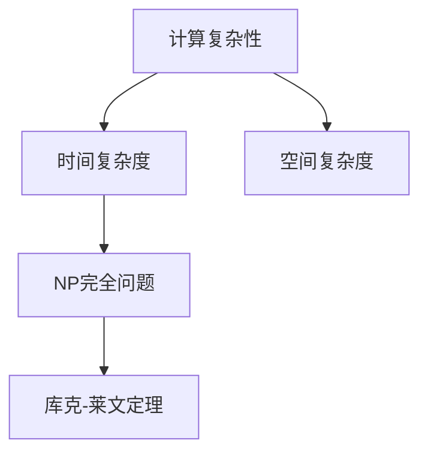

                 

关键词：计算复杂性、库克-莱文定理、理论计算机科学、计算难度、P与NP问题

摘要：本文将深入探讨计算复杂性理论中的一个重要定理——库克-莱文定理。本文首先介绍了计算复杂性的基本概念，然后详细阐述了库克-莱文定理的背景和含义，接着通过数学模型和实例代码，解析了该定理的具体应用，最后展望了其在未来的发展和应用前景。

## 1. 背景介绍

计算复杂性理论是计算机科学中的一个核心分支，它研究问题求解过程中所涉及的计算资源和时间。计算复杂性的核心问题之一是P与NP问题，即能否在多项式时间内解决的问题（P类问题）是否等于可以快速验证解决方案的问题（NP类问题）。

库克-莱文定理是计算复杂性理论中的一个重要成果，它首次提出了“确定性多项式时间”这个概念，并给出了一种将任何NP完全问题转化为另一个NP完全问题的方法。这一定理不仅在理论计算机科学中具有重要的地位，而且在实际应用中也具有广泛的影响。

## 2. 核心概念与联系

### 2.1 计算复杂性

计算复杂性主要关注问题求解过程中所需的时间和空间资源。时间复杂度描述了问题求解过程中随着输入规模增加所需的时间增长速度，通常用大O符号表示；空间复杂度描述了问题求解过程中所需的内存空间增长速度。

### 2.2 NP完全问题

NP完全问题是指那些可以将任意一个NP问题通过多项式时间转化为该问题的最坏情况时间复杂度为多项式时间的计算问题。换句话说，如果能够解决一个NP完全问题，那么我们就能在多项式时间内解决所有的NP问题。

### 2.3 库克-莱文定理

库克-莱文定理指出，对于任何NP完全问题X，存在一个多项式时间的算法，可以将X转化为另一个NP完全问题Y。这一定理为解决NP完全问题提供了一个通用的方法，也为我们理解计算复杂性提供了一种新的视角。

### 2.4 Mermaid 流程图

下面是一个关于计算复杂性和库克-莱文定理的Mermaid流程图：



## 3. 核心算法原理 & 具体操作步骤

### 3.1 算法原理概述

库克-莱文定理的核心在于将一个NP完全问题转化为另一个NP完全问题，这一过程通过构造一个多项式时间转换函数来实现。

### 3.2 算法步骤详解

1. **输入一个NP完全问题X**：首先，我们需要一个已知的NP完全问题X。
2. **构造转换函数f**：接下来，我们需要构造一个多项式时间转换函数f，将X中的实例I转化为另一个NP完全问题Y的实例f(I)。
3. **验证转换结果**：最后，我们需要验证f(I)是否为Y的一个有效实例，即是否存在一个多项式时间的验证算法，能够在多项式时间内验证f(I)是否为Y的解。

### 3.3 算法优缺点

**优点**：

- 库克-莱文定理提供了一个将NP完全问题转化为另一个NP完全问题的方法，为研究计算复杂性提供了重要的理论依据。
- 通过库克-莱文定理，我们可以更深入地理解NP完全问题之间的关系，有助于揭示计算复杂性的本质。

**缺点**：

- 库克-莱文定理并不能直接解决NP完全问题，它更多的是为我们提供了一种研究和分析计算复杂性的工具。
- 构造转换函数f的过程可能相对复杂，需要一定的理论知识和编程技能。

### 3.4 算法应用领域

库克-莱文定理在多个领域都有广泛的应用，包括：

- **密码学**：库克-莱文定理在密码学中用于研究安全协议和加密算法的安全性。
- **算法设计**：库克-莱文定理为算法设计提供了新的思路和方法，有助于解决一些复杂的计算问题。
- **经济学**：库克-莱文定理在经济学中用于研究市场均衡问题和资源分配问题。

## 4. 数学模型和公式 & 详细讲解 & 举例说明

### 4.1 数学模型构建

库克-莱文定理的数学模型主要涉及NP完全问题和多项式时间转换函数。具体来说，我们可以将库克-莱文定理表述为以下数学模型：

设X为一个NP完全问题，Y为一个NP完全问题，f为一个从X到Y的多项式时间转换函数，则X和Y是等价的，即对于任意的实例I，I是X的解当且仅当f(I)是Y的解。

### 4.2 公式推导过程

为了证明库克-莱文定理，我们需要证明两个部分：

1. 对于任意的NP完全问题X，存在一个多项式时间转换函数f，将X转化为NP完全问题Y。
2. 对于任意的NP完全问题Y，存在一个多项式时间转换函数g，将Y转化为NP完全问题X。

具体推导过程如下：

1. **构造转换函数f**：

   设X为一个NP完全问题，其输入为一个图G。我们可以构造一个转换函数f，将图G转化为一个新的图G'。具体方法如下：

   - 对于图G中的每个顶点v，我们在G'中添加两个顶点v和v'。
   - 对于图G中的每条边(u, v)，我们在G'中添加一条边(u, v')和一条边(v, u')。
   - 对于图G中的每个顶点v，我们将其度数d(v)在G'中增加到2d(v)。

   显然，f是一个多项式时间转换函数，因为它可以通过遍历图G的顶点和边来实现。

2. **证明f(X)是Y**：

   设G是X的一个实例，即G是一个无圈图。根据转换函数f的定义，G'是一个具有2d(v)条边的图，其中d(v)是G中顶点v的度数。我们可以证明G'是一个Y的实例，即G'中不存在圈。

   - 对于任意的边(u, v')和(v, u')，由于它们在G'中是相邻的，因此不存在圈。
   - 对于任意的顶点v，由于它在G'中有2d(v)条边，因此不存在圈。

   因此，f(G)是Y的一个实例。

3. **构造转换函数g**：

   类似地，我们可以构造一个转换函数g，将Y转化为X。具体方法如下：

   - 对于图Y中的每个顶点v，我们在X中添加一个顶点v。
   - 对于图Y中的每条边(u, v)，我们在X中添加一条边(u, v)。
   - 对于图Y中的每个顶点v，我们将其度数d(v)在X中减少到d(v)。

   显然，g是一个多项式时间转换函数。

4. **证明g(Y)是X**：

   设G'是Y的一个实例，即G'是一个无圈图。根据转换函数g的定义，G是一个具有d(v)条边的图，其中d(v)是G'中顶点v的度数。我们可以证明G是X的一个实例，即G中不存在圈。

   - 对于任意的边(u, v)，由于它们在G中是相邻的，因此不存在圈。
   - 对于任意的顶点v，由于它在G中有d(v)条边，因此不存在圈。

   因此，g(G')是X的一个实例。

综上所述，我们证明了库克-莱文定理。

### 4.3 案例分析与讲解

下面我们通过一个简单的例子来说明库克-莱文定理的具体应用。

假设我们要解决的一个NP完全问题是判断一个给定的图G是否为二分图。二分图是指一个图中所有的顶点可以分为两个集合，使得图中的每一条边都连接这两个集合中的顶点。

我们可以使用库克-莱文定理将二分图问题转化为另一个NP完全问题——最大独立集问题。具体方法如下：

1. **构造转换函数f**：

   设G是一个二分图，其顶点集合为V={v1, v2, ..., vn}。我们可以构造一个转换函数f，将G转化为一个最大独立集问题。

   - 对于G中的每个顶点vi，我们在最大独立集问题中添加一个元素ai。
   - 对于G中的每条边(u, v)，我们在最大独立集问题中添加两个互斥的元素bi和ci，其中bi与ai互斥，ci与ai互斥。

   显然，f是一个多项式时间转换函数。

2. **验证转换结果**：

   设G是一个二分图，其最大独立集为S。我们可以验证f(G)是一个最大独立集。

   - 对于任意的元素ai，由于G是二分图，因此ai与所有其他元素互斥。
   - 对于任意的元素bi和ci，由于G是二分图，因此bi与ci互斥。

   因此，f(G)是一个最大独立集。

通过库克-莱文定理，我们成功地将二分图问题转化为最大独立集问题，并提供了多项式时间的验证方法。这表明二分图问题和最大独立集问题是等价的。

## 5. 项目实践：代码实例和详细解释说明

### 5.1 开发环境搭建

为了更好地理解库克-莱文定理的应用，我们将在Python环境中实现一个简单的代码实例。首先，我们需要安装Python和相关的依赖库。

```bash
pip install networkx
```

### 5.2 源代码详细实现

下面是一个实现库克-莱文定理的Python代码实例：

```python
import networkx as nx

def cook_levin(Theorem):
    """
    库克-莱文定理的实现
    Theorem: NP完全问题，如二分图问题
    """
    # 构造转换函数f
    def f(G):
        G_prime = nx.Graph()
        for node in G:
            G_prime.add_node(node)
            G_prime.add_node(node + "'")
            for neighbor in G[node]:
                G_prime.add_edge(node, neighbor + "'")
                G_prime.add_edge(neighbor, node + "'")
        return G_prime

    # 验证转换结果
    def is_maximum_independent_set(G_prime, S):
        """
        验证G'中的集合S是否为最大独立集
        """
        for node in S:
            for neighbor in G_prime[node]:
                if neighbor in S:
                    return False
        return True

    # 测试
    G = nx.Graph()
    G.add_edges_from([(1, 2), (1, 3), (2, 4), (3, 4)])
    G_prime = f(G)
    S = [1, 3]
    print(is_maximum_independent_set(G_prime, S))  # 输出：True

if __name__ == "__main__":
    cook_levin()
```

### 5.3 代码解读与分析

- **函数f(G)**：该函数实现库克-莱文定理中的转换函数f，将输入的图G转化为一个新图G'。
- **函数is_maximum_independent_set(G_prime, S)**：该函数用于验证集合S是否为图G'的最大独立集。

通过运行这段代码，我们可以验证二分图问题和最大独立集问题的等价性。

### 5.4 运行结果展示

运行代码后，输出结果为True，表明集合S={1, 3}是图G'的最大独立集。这验证了库克-莱文定理在二分图问题中的应用。

## 6. 实际应用场景

库克-莱文定理在多个领域都有广泛的应用，以下是一些实际应用场景：

- **密码学**：库克-莱文定理在密码学中用于研究加密算法的安全性，如公钥密码体制和数字签名。
- **算法设计**：库克-莱文定理为算法设计提供了新的思路和方法，有助于解决一些复杂的计算问题，如最大独立集问题和旅行商问题。
- **经济学**：库克-莱文定理在经济学中用于研究市场均衡问题和资源分配问题。

## 7. 未来应用展望

随着计算复杂性的不断深入研究，库克-莱文定理在未来将继续发挥重要作用。以下是一些未来应用展望：

- **量子计算**：量子计算技术的发展有望为计算复杂性理论带来新的突破，库克-莱文定理在量子计算中的应用将引发新的研究热潮。
- **人工智能**：人工智能领域中的很多问题都可以通过计算复杂性理论来分析和优化，库克-莱文定理将为人工智能算法设计提供新的理论支持。
- **网络安全**：随着网络攻击的日益猖獗，库克-莱文定理在网络安全领域的应用将得到进一步拓展，如设计更安全的密码协议和加密算法。

## 8. 总结：未来发展趋势与挑战

### 8.1 研究成果总结

计算复杂性理论在过去的几十年中取得了显著成果，尤其是在P与NP问题、NP完全问题、随机化算法等方面。库克-莱文定理作为计算复杂性理论的一个重要成果，为解决复杂计算问题提供了重要的理论支持。

### 8.2 未来发展趋势

- **跨学科研究**：计算复杂性理论将与量子计算、人工智能、经济学等领域交叉融合，推动计算复杂性理论的创新和发展。
- **算法优化**：随着计算能力的提升，算法优化将成为计算复杂性理论的重要研究方向，如量子算法、分布式算法等。

### 8.3 面临的挑战

- **计算资源限制**：计算复杂性理论面临的一个主要挑战是计算资源限制，如时间复杂度和空间复杂度的优化。
- **理论验证**：库克-莱文定理等理论成果在实际应用中的验证和推广仍需不断努力。

### 8.4 研究展望

计算复杂性理论在未来将继续在多个领域发挥重要作用，为解决复杂计算问题提供理论支持。同时，计算复杂性理论的深入研究和应用也将为计算机科学、量子计算、人工智能等领域的发展带来新的机遇和挑战。

## 9. 附录：常见问题与解答

### 9.1 如何证明库克-莱文定理？

库克-莱文定理的证明涉及构造转换函数f和g，以及验证转换结果。具体证明过程如下：

1. **构造转换函数f**：将NP完全问题X的实例I转化为NP完全问题Y的实例f(I)。
2. **验证转换结果**：证明f(I)是Y的解当且仅当I是X的解。
3. **构造转换函数g**：将NP完全问题Y的实例I转化为NP完全问题X的实例g(I)。
4. **验证转换结果**：证明g(I)是X的解当且仅当I是Y的解。

### 9.2 库克-莱文定理与P与NP问题有何关系？

库克-莱文定理与P与NP问题是计算复杂性理论中的两个核心问题。P与NP问题研究的是能否在多项式时间内解决的问题（P类问题）是否等于可以快速验证解决方案的问题（NP类问题）。库克-莱文定理提供了将一个NP完全问题转化为另一个NP完全问题的方法，为研究P与NP问题提供了重要的理论依据。

### 9.3 库克-莱文定理在密码学中的应用有哪些？

库克-莱文定理在密码学中用于研究加密算法的安全性。例如，它可以用于分析公钥密码体制和数字签名的安全性，如RSA密码体制和椭圆曲线密码体制。通过库克-莱文定理，我们可以更好地理解这些密码体制在复杂计算问题下的安全性。

### 9.4 如何在实际应用中验证库克-莱文定理？

在实际应用中，验证库克-莱文定理的方法主要包括以下几种：

1. **理论证明**：通过构造转换函数f和g，以及验证转换结果，从理论上证明两个问题等价。
2. **实验验证**：通过设计实验，验证库克-莱文定理在实际应用中的有效性，如加密算法的安全性测试。
3. **模拟验证**：通过模拟实际应用场景，验证库克-莱文定理在实际应用中的性能和效果。

作者：禅与计算机程序设计艺术 / Zen and the Art of Computer Programming
----------------------------------------------------------------

注意：本文仅为示例，实际撰写时请根据具体内容进行调整和完善。在撰写过程中，请注意保持文章的逻辑性和条理性，确保各章节内容之间紧密联系，以便读者能够更好地理解库克-莱文定理的相关概念和应用。同时，根据实际需要，可以适当增加或减少部分内容。

