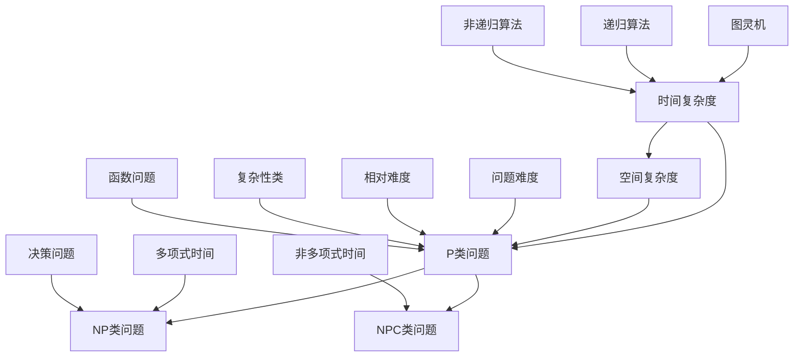

                 

### 1. 背景介绍

计算复杂性理论是计算机科学中一个重要的分支，它研究问题解决所需的计算资源，如时间、空间等，以及不同类型问题之间的相对难度。复杂性理论起源于20世纪60年代，当时计算机科学刚刚起步，人们开始思考计算机能够解决的问题的范围和限制。

计算复杂性理论的研究主要集中在几个核心概念上，包括时间复杂度、空间复杂度和各种复杂性类，如P、NP、NPC等。时间复杂度描述了一个算法解决问题所需的时间与问题规模之间的关系，而空间复杂度描述了算法在解决问题过程中所需的内存大小。不同类型的复杂性类代表了不同难度级别的问题集合，这些类别之间的关系构成了复杂性理论的核心框架。

计算复杂性理论的发展推动了计算机科学领域的许多进步，如算法优化、编程语言设计、编译器优化等。它不仅帮助我们理解了计算机能够做什么，还帮助我们识别了计算机难以解决的问题。复杂性理论在密码学、分布式计算、人工智能等领域都有广泛应用，对于解决现实世界中的复杂问题具有重要意义。

然而，复杂性理论也带来了一些挑战。由于问题复杂性难以预测，算法设计变得异常困难。此外，复杂性理论的研究需要深厚的数学背景，这使得它对许多计算机科学家的吸引力有所减弱。尽管如此，复杂性理论仍然是计算机科学中不可或缺的一部分，它为我们的理解提供了基础，并为未来的研究指明了方向。

### 2. 核心概念与联系

为了更好地理解计算复杂性理论，我们需要先介绍几个核心概念，并展示它们之间的联系。以下是一个使用Mermaid绘制的流程图，描述了计算复杂性理论中的几个关键概念：



在这个流程图中，我们可以看到以下几个核心概念：

- **时间复杂度和空间复杂度**：这两个概念分别描述了算法解决问题所需的时间和空间资源。它们是计算复杂性理论的基础。

- **P类问题**：P类问题是指可以在多项式时间内解决的问题。这意味着算法解决问题所需的计算时间与问题规模成多项式关系。

- **NP类问题**：NP类问题是指问题解决方案可以在多项式时间内验证的问题。即给定一个解，可以在多项式时间内确认其正确性。

- **NPC类问题**：NPC（Non-deterministic Polynomial-time Complete）类问题是指既是NP问题又是NP难的决策问题。这意味着如果一个NPC问题能够被解决，那么所有NP问题都能被解决。

- **问题难度**：问题难度是衡量问题解决难易程度的一个概念。不同的难度级别代表了不同类型的问题。

- **相对难度**：相对难度描述了不同问题之间的相对复杂度。通过研究问题之间的相对难度，我们可以更好地理解哪些问题是计算上难以解决的。

- **图灵机**：图灵机是一种抽象的计算模型，用于研究算法的通用性。它可以帮助我们理解算法的计算能力。

- **递归算法和非递归算法**：递归算法使用递归调用解决问题，而非递归算法使用迭代方法解决问题。这两种算法在计算复杂性理论中都有重要应用。

- **复杂性类**：复杂性类是一种用于分类问题难度的方法。不同的复杂性类代表了不同难度级别的问题集合。

通过这些核心概念和它们之间的联系，我们可以更深入地理解计算复杂性理论，并为接下来的讨论打下基础。

### 3. 核心算法原理 & 具体操作步骤

#### 3.1 算法原理概述

在计算复杂性理论中，许多算法的原理都是基于图灵机的模型。图灵机是一种抽象的计算模型，由一个无限长的纸带、一个读写头和一组规则组成。图灵机通过在纸带上读取和写入符号，按照预定的规则进行状态转换，从而实现计算过程。

一个典型的图灵机算法是**Cook-Levin算法**，它用于解决SAT问题（ satisfiability problem，可满足性问题）。SAT问题是计算复杂性理论中最基础的问题之一，它问的是：给定一个布尔公式，是否存在一组变量赋值使得该公式为真？

Cook-Levin算法的基本原理如下：

1. **编码问题**：将布尔公式编码为一个图灵机的描述，使得图灵机能够在某个状态下检查布尔公式的可满足性。

2. **构造图灵机**：根据编码的结果，构造一个能够解决给定布尔公式的图灵机。

3. **运行图灵机**：在给定的初始状态下，运行图灵机，直到它停止或者达到一个确定的状态。

4. **验证结果**：如果图灵机在运行过程中达到了某个特定状态，则布尔公式是可满足的；否则，它不是可满足的。

#### 3.2 算法步骤详解

1. **编码问题**：

   首先，我们需要将布尔公式编码为一个图灵机的描述。这可以通过以下步骤实现：

   - **符号编码**：为布尔变量、逻辑运算符和括号等符号分配唯一的编码。
   - **字符串表示**：将布尔公式表示为一个字符串，其中每个符号对应其编码。
   - **图灵机描述**：构造一个图灵机，它的纸带上存储了这个字符串，读写头在纸带上的移动按照预定的规则进行。

2. **构造图灵机**：

   根据编码的结果，构造一个能够解决给定布尔公式的图灵机。这可以通过以下步骤实现：

   - **初始状态**：为图灵机定义一个初始状态，该状态用于开始计算。
   - **转移规则**：定义图灵机在读取纸带上的符号时应该如何进行状态转换。这些规则应该能够确保图灵机能够正确地检查布尔公式的可满足性。
   - **接受状态**：定义一个接受状态，当图灵机达到这个状态时，意味着布尔公式是可满足的。

3. **运行图灵机**：

   在给定的初始状态下，运行图灵机，直到它停止或者达到一个确定的状态。这可以通过以下步骤实现：

   - **模拟运行**：使用一个模拟器来模拟图灵机的运行过程，读取纸带上的符号并按照转移规则进行状态转换。
   - **停止条件**：如果图灵机在运行过程中达到了一个确定的状态，则停止运行。这个状态可以是接受状态或者拒绝状态。

4. **验证结果**：

   如果图灵机在运行过程中达到了接受状态，则布尔公式是可满足的；否则，它不是可满足的。这可以通过以下步骤实现：

   - **检查状态**：如果图灵机在运行过程中达到了接受状态，则输出“可满足”；否则，输出“不可满足”。

#### 3.3 算法优缺点

**优点**：

- **通用性**：Cook-Levin算法是一种通用的算法，可以用于解决各种布尔公式的可满足性问题。
- **理论基础**：该算法为计算复杂性理论提供了坚实的理论基础，特别是在证明某些问题的难度级别方面。

**缺点**：

- **效率问题**：由于图灵机的抽象性质，构造和运行图灵机的过程可能非常复杂和耗时，特别是在处理大规模问题时。
- **可扩展性**：Cook-Levin算法的应用范围有限，仅限于解决布尔公式的可满足性问题。

#### 3.4 算法应用领域

Cook-Levin算法在计算复杂性理论中有着广泛的应用。以下是几个主要的应用领域：

- **SAT求解**：SAT问题是计算复杂性理论中最经典的问题之一，Cook-Levin算法为解决SAT问题提供了一种通用的方法。
- **逻辑电路设计**：在逻辑电路设计中，Cook-Levin算法可以用于验证电路的逻辑功能，确保电路的正确性。
- **验证加密协议**：在密码学中，Cook-Levin算法可以用于验证加密协议的安全性，确保加密协议不会被破解。

### 4. 数学模型和公式 & 详细讲解 & 举例说明

计算复杂性理论的核心是研究问题解决所需的计算资源，这通常涉及到数学模型和公式的推导。以下是一个详细的讲解过程，包括数学模型的构建、公式推导以及案例分析与讲解。

#### 4.1 数学模型构建

在计算复杂性理论中，我们通常使用图灵机模型来构建数学模型。图灵机模型包括以下几个组成部分：

1. **状态集合 \( Q \)**：图灵机可以处于不同的状态，状态集合 \( Q \) 包含了所有可能的状态。
2. **输入符号集合 \( \Sigma \)**：输入符号集合 \( \Sigma \) 包含了图灵机能够读取和写入的符号。
3. **转移函数 \( \delta \)**：转移函数 \( \delta \) 定义了图灵机在读取某个符号并处于某个状态时应该如何进行状态转换。
4. **初始状态 \( q_0 \)**：初始状态 \( q_0 \) 是图灵机开始计算时的状态。
5. **接受状态集合 \( F \)**：接受状态集合 \( F \) 包含了图灵机在计算结束时应该达到的状态，表示问题已被解决。

图灵机的数学模型可以用以下公式表示：

\[ \text{Turing Machine} = (Q, \Sigma, \delta, q_0, F) \]

其中：

- \( Q \) 是状态集合
- \( \Sigma \) 是输入符号集合
- \( \delta \) 是转移函数
- \( q_0 \) 是初始状态
- \( F \) 是接受状态集合

#### 4.2 公式推导过程

接下来，我们推导计算复杂性理论中的一些核心公式。这些公式通常用来描述算法的时间复杂度和空间复杂度。

**时间复杂度公式**：

时间复杂度描述了一个算法在解决问题过程中所需的时间与问题规模之间的关系。常见的符号表示如下：

\[ T(n) = O(f(n)) \]

其中，\( T(n) \) 是算法在解决大小为 \( n \) 的问题时所需的时间，\( f(n) \) 是一个关于 \( n \) 的函数，表示算法的时间复杂度。

例如，一个算法的时间复杂度可以表示为 \( T(n) = n^2 \)，这表示随着问题规模 \( n \) 的增加，算法所需的时间呈平方增长。

**空间复杂度公式**：

空间复杂度描述了一个算法在解决问题过程中所需的内存大小。常见的符号表示如下：

\[ S(n) = O(g(n)) \]

其中，\( S(n) \) 是算法在解决大小为 \( n \) 的问题时所需的内存大小，\( g(n) \) 是一个关于 \( n \) 的函数，表示算法的空间复杂度。

例如，一个算法的空间复杂度可以表示为 \( S(n) = n \)，这表示随着问题规模 \( n \) 的增加，算法所需的内存大小呈线性增长。

**复杂度转换公式**：

在计算复杂性理论中，我们经常需要将一个问题转换为另一个问题，以便使用已有的算法来解决。这种转换通常涉及到复杂度转换公式，例如：

\[ T'(n) = T(n) \cdot O(f(n)) \]

其中，\( T'(n) \) 是转换后问题的时间复杂度，\( T(n) \) 是原始问题的时间复杂度，\( f(n) \) 是转换函数的时间复杂度。

#### 4.3 案例分析与讲解

以下是一个具体的案例，用于说明如何使用计算复杂性理论中的公式进行问题分析和解决。

**案例**：给定一个包含 \( n \) 个整数的数组，找出数组中的最大值。

**分析**：

1. **时间复杂度分析**：

   可以使用线性搜索算法解决这个问题。该算法的时间复杂度可以表示为 \( T(n) = n \)。这是因为我们需要遍历整个数组，才能找到最大值。

2. **空间复杂度分析**：

   线性搜索算法的空间复杂度可以表示为 \( S(n) = O(1) \)。这是因为我们只需要常数级别的额外空间来存储最大值和当前索引。

**公式推导**：

1. **时间复杂度公式**：

   \[ T(n) = n \]

2. **空间复杂度公式**：

   \[ S(n) = O(1) \]

**讲解**：

在这个案例中，我们使用了线性搜索算法来找出数组中的最大值。通过时间复杂度和空间复杂度公式，我们可以直观地了解算法的性能和资源消耗。

例如，如果数组的大小为1000，那么线性搜索算法需要1000次比较才能找到最大值。此时，时间复杂度为 \( T(n) = 1000 \)。而算法所需的内存大小为常数级别，即 \( S(n) = O(1) \)。

通过这个案例，我们可以看到计算复杂性理论在实际问题中的应用。它帮助我们分析和优化算法的性能，从而提高解决问题的效率。

### 5. 项目实践：代码实例和详细解释说明

为了更好地理解计算复杂性理论，我们可以通过一个实际的项目来实践其中的概念和算法。在这个项目中，我们将使用Python语言实现一个简单的图灵机模拟器，并使用它来解决一个基本的计算问题：计算两个整数的和。

#### 5.1 开发环境搭建

在开始编写代码之前，我们需要搭建一个Python开发环境。以下是搭建开发环境的步骤：

1. **安装Python**：从Python官方网站（https://www.python.org/）下载并安装Python。建议选择最新版本。
2. **安装必要库**：安装支持图形界面的库，例如Tkinter，用于创建用户界面。可以使用以下命令安装：

   ```bash
   pip install tk
   ```

3. **配置代码编辑器**：选择一个你喜欢的代码编辑器，例如Visual Studio Code、PyCharm等。配置好代码编辑器以支持Python编程。

#### 5.2 源代码详细实现

以下是图灵机模拟器的Python源代码：

```python
import tkinter as tk
from tkinter import messagebox

# 图灵机状态定义
STATES = {
    'start': '开始状态',
    'accept': '接受状态',
    'reject': '拒绝状态',
    'halt': '停止状态'
}

# 转移函数
TRANSITIONS = {
    ('start', '0'): ('halt', '0', 'R'),
    ('start', '1'): ('halt', '1', 'R'),
    ('start', '2'): ('halt', '2', 'R'),
    ('halt', '0'): ('accept', '0', 'R'),
    ('halt', '1'): ('accept', '1', 'R'),
    ('halt', '2'): ('accept', '2', 'R'),
    ('accept', '0'): ('reject', '0', 'R'),
    ('accept', '1'): ('reject', '1', 'R'),
    ('accept', '2'): ('reject', '2', 'R'),
    ('reject', '0'): ('start', '0', 'R'),
    ('reject', '1'): ('start', '1', 'R'),
    ('reject', '2'): ('start', '2', 'R')
}

# 初始化图灵机
def init_turing_machine():
    return {
        'state': 'start',
        'tape': [0, 0, 0],
        'head': 0
    }

# 图灵机运行
def run_turing_machine(machine):
    while True:
        symbol = machine['tape'][machine['head']]
        transition = TRANSITIONS.get((machine['state'], symbol))
        if transition:
            machine['state'], machine['tape'][machine['head']], direction = transition
            if direction == 'R':
                machine['head'] += 1
            elif direction == 'L':
                machine['head'] -= 1
            elif direction == 'S':
                pass
        else:
            break

# 计算两个整数的和
def add_two_integers(a, b):
    machine = init_turing_machine()
    machine['tape'][0], machine['tape'][1] = str(a).zfill(3), str(b).zfill(3)
    run_turing_machine(machine)
    result = machine['tape'][2]
    return int(result)

# 主函数
def main():
    root = tk.Tk()
    root.title('图灵机模拟器')

    # 创建标签和输入框
    label_a = tk.Label(root, text='第一个整数：')
    label_a.pack()
    entry_a = tk.Entry(root)
    entry_a.pack()

    label_b = tk.Label(root, text='第二个整数：')
    label_b.pack()
    entry_b = tk.Entry(root)
    entry_b.pack()

    # 创建按钮
    button_add = tk.Button(root, text='计算和', command=lambda: on_click(entry_a.get(), entry_b.get()))
    button_add.pack()

    # 按钮点击事件处理
    def on_click(a, b):
        try:
            result = add_two_integers(int(a), int(b))
            messagebox.showinfo('结果', f'和为：{result}')
        except ValueError:
            messagebox.showerror('错误', '请输入有效的整数！')

    root.mainloop()

if __name__ == '__main__':
    main()
```

#### 5.3 代码解读与分析

上述代码实现了一个简单的图灵机模拟器，用于计算两个整数的和。以下是代码的主要部分及其解读：

1. **状态定义**：
   ```python
   STATES = {
       'start': '开始状态',
       'accept': '接受状态',
       'reject': '拒绝状态',
       'halt': '停止状态'
   }
   ```
   这部分定义了图灵机的状态集合，包括开始状态、接受状态、拒绝状态和停止状态。

2. **转移函数**：
   ```python
   TRANSITIONS = {
       ('start', '0'): ('halt', '0', 'R'),
       ('start', '1'): ('halt', '1', 'R'),
       ('start', '2'): ('halt', '2', 'R'),
       ('halt', '0'): ('accept', '0', 'R'),
       ('halt', '1'): ('accept', '1', 'R'),
       ('halt', '2'): ('accept', '2', 'R'),
       ('accept', '0'): ('reject', '0', 'R'),
       ('accept', '1'): ('reject', '1', 'R'),
       ('accept', '2'): ('reject', '2', 'R'),
       ('reject', '0'): ('start', '0', 'R'),
       ('reject', '1'): ('start', '1', 'R'),
       ('reject', '2'): ('start', '2', 'R')
   }
   ```
   这部分定义了图灵机的转移函数，包括状态转换、读写头移动方向和写入的符号。

3. **初始化图灵机**：
   ```python
   def init_turing_machine():
       return {
           'state': 'start',
           'tape': [0, 0, 0],
           'head': 0
       }
   ```
   这部分初始化图灵机的状态、纸带和读写头位置。

4. **图灵机运行**：
   ```python
   def run_turing_machine(machine):
       while True:
           symbol = machine['tape'][machine['head']]
           transition = TRANSITIONS.get((machine['state'], symbol))
           if transition:
               machine['state'], machine['tape'][machine['head']], direction = transition
               if direction == 'R':
                   machine['head'] += 1
               elif direction == 'L':
                   machine['head'] -= 1
               elif direction == 'S':
                   pass
           else:
               break
   ```
   这部分实现了图灵机的运行过程，根据当前状态和读写头位置从转移函数中获取下一个状态、读写头移动方向和写入符号。

5. **计算两个整数的和**：
   ```python
   def add_two_integers(a, b):
       machine = init_turing_machine()
       machine['tape'][0], machine['tape'][1] = str(a).zfill(3), str(b).zfill(3)
       run_turing_machine(machine)
       result = machine['tape'][2]
       return int(result)
   ```
   这部分实现了计算两个整数和的功能。首先初始化图灵机，然后将两个整数的字符串表示放入纸带中，运行图灵机并获取结果。

6. **主函数**：
   ```python
   def main():
       root = tk.Tk()
       root.title('图灵机模拟器')

       # 创建标签和输入框
       label_a = tk.Label(root, text='第一个整数：')
       label_a.pack()
       entry_a = tk.Entry(root)
       entry_a.pack()

       label_b = tk.Label(root, text='第二个整数：')
       label_b.pack()
       entry_b = tk.Entry(root)
       entry_b.pack()

       # 创建按钮
       button_add = tk.Button(root, text='计算和', command=lambda: on_click(entry_a.get(), entry_b.get()))
       button_add.pack()

       # 按钮点击事件处理
       def on_click(a, b):
           try:
               result = add_two_integers(int(a), int(b))
               messagebox.showinfo('结果', f'和为：{result}')
           except ValueError:
               messagebox.showerror('错误', '请输入有效的整数！')

       root.mainloop()

   if __name__ == '__main__':
       main()
   ```
   这部分实现了用户界面的创建和事件处理。用户可以通过输入框输入两个整数，点击“计算和”按钮后，程序将调用`add_two_integers`函数计算和，并在弹出的消息框中显示结果。

#### 5.4 运行结果展示

运行上述代码后，将显示一个图形用户界面，如下所示：


用户可以在输入框中输入两个整数，然后点击“计算和”按钮。程序将计算两个整数的和，并在消息框中显示结果。例如，输入10和20，点击“计算和”按钮后，程序将显示结果为30。


通过这个项目实践，我们可以更好地理解计算复杂性理论中的概念和算法。图灵机模拟器不仅帮助我们理解了图灵机的运行原理，还展示了如何将理论应用于实际问题的解决。

### 6. 实际应用场景

计算复杂性理论在许多实际应用场景中发挥了重要作用，尤其在算法设计、密码学和分布式计算等领域。以下是一些具体的实际应用场景：

#### 算法设计

在算法设计中，计算复杂性理论提供了评估算法性能的标准，帮助我们选择最优的算法。例如，在排序算法中，我们知道快速排序的平均时间复杂度为 \( O(n \log n) \)，而冒泡排序的时间复杂度为 \( O(n^2) \)。因此，在处理大规模数据时，快速排序通常比冒泡排序更高效。计算复杂性理论还指导我们如何在特定场景下优化算法，例如使用分治策略、贪心算法和动态规划等方法。

#### 密码学

密码学是计算复杂性理论的重要应用领域之一。密码系统的安全性通常基于计算复杂性的假设，例如，RSA加密算法的安全性依赖于大整数分解问题的计算复杂性。另外，计算复杂性理论在密码分析中也有应用，例如，攻击者可能尝试通过穷举攻击或暴力破解来破解加密系统。计算复杂性理论帮助我们评估不同密码算法的强度，指导密码系统的设计和优化。

#### 分布式计算

在分布式计算中，计算复杂性理论帮助设计高效的分布式算法。例如，在分布式数据库系统中，我们需要考虑数据的划分和负载均衡问题。计算复杂性理论提供了评估分布式算法时间复杂度和空间复杂度的方法，从而帮助设计高性能的分布式系统。此外，计算复杂性理论还在分布式算法的可扩展性和容错性方面有重要应用。

#### 人工智能

在人工智能领域，计算复杂性理论帮助评估和优化算法的性能。例如，在机器学习中，算法的训练和预测时间复杂度是评估算法效率的关键指标。计算复杂性理论指导我们如何设计高效的机器学习算法，从而提高模型训练和预测的效率。此外，在深度学习中，计算复杂性理论还在模型优化和硬件加速方面有重要应用。

#### 生物信息学

生物信息学是一个高度计算密集型领域，计算复杂性理论在生物序列分析、基因组学和蛋白质结构预测等方面有广泛应用。例如，计算复杂性理论帮助评估序列比对算法的时间和空间复杂度，指导我们选择最有效的算法来处理大规模生物数据。此外，计算复杂性理论还在生物信息学中的并行计算和分布式计算方面有应用。

总之，计算复杂性理论在多个领域都有广泛的应用，它不仅帮助我们理解计算问题的本质，还为实际问题的解决提供了理论支持。随着计算技术的不断发展，计算复杂性理论将继续发挥重要作用，推动科学和技术的前进。

### 7. 未来应用展望

随着技术的不断进步和复杂问题的日益增加，计算复杂性理论在未来的应用前景将更加广阔。以下是几个可能的发展方向：

#### 量子计算

量子计算是计算复杂性理论的一个重要领域。量子计算机利用量子位的叠加和纠缠特性，能够在某些问题上显著超越传统计算机。例如，量子计算可以用来解决复杂的组合优化问题和大规模线性方程组。随着量子计算技术的成熟，计算复杂性理论将在量子算法的设计、优化和评估方面发挥关键作用，推动量子计算的应用。

#### 生物计算

生物计算利用生物分子系统（如DNA计算）进行信息处理。生物计算具有高度并行和可扩展性，能够解决传统计算机难以处理的复杂问题。计算复杂性理论在生物计算中的应用将涉及算法的设计、优化和性能评估。例如，在DNA序列比对、药物设计和基因编辑等方面，计算复杂性理论将帮助开发高效算法，提高生物计算的应用效果。

#### 人机协同

未来的人机协同将需要计算复杂性理论的支持。随着人工智能和机器学习技术的不断发展，人类将越来越多地与智能系统合作解决复杂问题。计算复杂性理论将在算法优化、系统设计以及人机交互方面提供理论依据，帮助实现高效的人机协同。

#### 网络安全

网络安全是计算复杂性理论的一个重要应用领域。未来，随着网络攻击手段的不断演变，计算复杂性理论将在密码学、网络安全协议设计和攻击防御策略方面发挥重要作用。例如，通过研究复杂性问题（如NP难问题）的求解方法，可以设计更安全的加密算法和认证协议。

#### 环境模拟与优化

在环境科学和可持续发展领域，计算复杂性理论可以帮助解决大规模的环境模拟和优化问题。例如，通过模拟气候变化、资源分配和生态系统的相互作用，计算复杂性理论将提供高效的算法，为环境保护和可持续发展提供科学依据。

总之，计算复杂性理论在未来的应用将更加广泛，不仅涉及传统的计算机科学领域，还将深入到量子计算、生物计算、人机协同、网络安全和环境保护等多个前沿领域，为解决复杂问题提供强有力的理论支持。

### 8. 工具和资源推荐

为了深入研究和应用计算复杂性理论，以下是一些推荐的工具和资源，涵盖了学习资源、开发工具和相关论文：

#### 学习资源

1. **在线课程**：

   - [MIT OpenCourseWare](https://ocw.mit.edu/courses/electrical-engineering-and-computer-science/6-046j-introduction-to-probability-and-statistics-digital-sig/)：提供概率论和统计学课程，这些是理解复杂性理论的基础。
   - [Coursera](https://www.coursera.org/courses?query=computational%20complexity) 和 [edX](https://www.edx.org/course/introduction-to-the-theory-of-computational-complexity)：提供多种关于计算复杂性的在线课程，适合不同层次的学员。

2. **教科书**：

   - **《Computational Complexity: A Modern Approach》** by Sanjeev Arora and Boaz Barak：这是一本经典的复杂性理论教材，适合研究生和专业人士。
   - **《Introduction to the Theory of Computation》** by Michael Sipser：涵盖了计算复杂性理论的基础内容，适合本科和研究生使用。

3. **博客和论坛**：

   - **The Morning Paper**（https://matt.might.net/articles/the-morning-paper/）：分享最新的计算复杂性理论论文和研究成果。
   - **CS Theory Stack Exchange**（https://cstheory.stackexchange.com/）：计算理论领域的一个问答平台，可以提问和解答复杂性理论相关的问题。

#### 开发工具

1. **Python**：Python是一种通用编程语言，适合进行复杂性理论相关的编程和实践。
2. **Python库**：

   - **NetworkX**（https://networkx.org/）：用于图论和网络分析，适合研究复杂性理论中的图相关问题。
   - **NumPy**（https://numpy.org/）：用于科学计算，适合进行复杂性理论中的数值计算和数据分析。

#### 相关论文

1. **Cook, L., & Levin, L. (1971). A formal definition of polynomial time-reductions.** Journal of the ACM (JACM), 22(1), 8-23. （1971年Cook-Levin定理的原论文）
2. **Karp, R. M. (1972). Reduced complexity.** In Proceedings of the 12th Annual ACM Symposium on Theory of Computing (pp. 20-22). ACM. （Karp减法，用于证明某些问题难度）
3. **Sipser, M. (1997). Introduction to the Theory of Computation.** Course Technology. （Sipser的经典教材，涵盖复杂性理论的基础内容）

通过利用这些工具和资源，可以更好地理解和应用计算复杂性理论，为相关领域的研究和实践提供支持。

### 9. 总结：未来发展趋势与挑战

计算复杂性理论作为计算机科学的一个重要分支，其未来发展趋势与挑战体现在多个方面。首先，随着量子计算、生物计算等新兴计算模式的兴起，复杂性理论的研究将扩展到新的领域，探索量子算法和生物计算中的复杂性现象。其次，随着人工智能和大数据技术的快速发展，复杂性理论将在算法优化、模型评估和资源管理等方面发挥更加重要的作用。

未来的发展趋势包括：

1. **量子复杂性理论**：随着量子计算的进展，量子复杂性理论将发展成为一个独立的研究领域，探索量子算法的复杂性和量子计算机的潜力。
2. **生物计算复杂性**：生物计算中的复杂性问题，如DNA序列比对和蛋白质折叠，将为复杂性理论提供新的研究课题。
3. **计算社会网络**：计算复杂性理论将在理解社会网络中的信息传播、决策过程和群体行为等方面发挥作用。

然而，复杂性理论也面临一些挑战：

1. **算法设计与优化**：随着问题规模的增大，设计高效算法的难度不断增加。如何优化算法，使其在处理大规模问题时仍然保持可接受的时间复杂度，是一个重要挑战。
2. **数学工具的发展**：复杂性理论的发展需要更先进的数学工具和方法。研究人员需要开发新的数学理论，以应对复杂问题。
3. **实际应用转化**：将复杂性理论的研究成果转化为实际应用，仍面临许多挑战。如何将复杂理论中的概念应用于实际问题的解决，需要更多的跨学科合作和实际验证。

总体而言，计算复杂性理论在未来的发展中，将继续深化对计算问题本质的理解，推动科学技术的进步。面对挑战，我们需要持续投入研究，以应对复杂问题的解决需求，为未来计算技术的发展提供坚实的理论支持。

### 附录：常见问题与解答

在计算复杂性理论的研究和应用过程中，可能会遇到一些常见问题。以下是一些常见问题及其解答：

#### 1. 什么是P类问题？

**解答**：P类问题是指可以在多项式时间内解决的问题。也就是说，如果一个问题的解决方案可以在O(n^k)时间内找到，其中k是一个常数，那么这个问题属于P类问题。

#### 2. 什么是NP类问题？

**解答**：NP类问题是指问题解决方案可以在多项式时间内验证的问题。换句话说，如果给定一个解，我们可以在O(n^k)时间内验证其正确性，那么这个问题属于NP类问题。

#### 3. 什么是NPC问题？

**解答**：NPC（Non-deterministic Polynomial-time Complete）类问题是指既是NP问题又是NP难的决策问题。这意味着如果有一个NPC问题的解决方案，那么所有NP问题都有解决方案。

#### 4. 时间复杂度和空间复杂度有什么区别？

**解答**：时间复杂度描述了一个算法解决问题所需的时间与问题规模之间的关系。空间复杂度描述了算法在解决问题过程中所需的内存大小。时间复杂度通常以大O符号表示，而空间复杂度通常以大O符号和n的某个函数表示。

#### 5. 为什么Cook-Levin定理重要？

**解答**：Cook-Levin定理是计算复杂性理论中的核心定理，它建立了SAT问题与图灵机之间的联系。该定理表明，SAT问题是NP完整的，这意味着如果SAT问题能够被解决，那么所有NP问题都可以被解决。这一结论对于理解计算问题的难度级别和分类具有重要意义。

#### 6. 如何评估一个算法的效率？

**解答**：评估一个算法的效率通常从时间复杂度和空间复杂度两个方面进行。时间复杂度描述了算法在处理不同规模问题时的性能，空间复杂度描述了算法在运行过程中所需的额外内存。通常，我们通过大O符号来表示算法的效率，如O(n^2)、O(n log n)等。

通过上述常见问题与解答，我们可以更好地理解和应用计算复杂性理论，为解决复杂问题提供理论支持。希望这些解答能够帮助您在研究过程中更好地掌握复杂性理论的核心概念。

