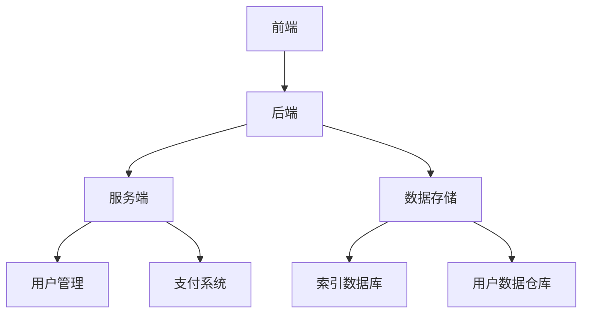

                 

随着互联网的迅猛发展，搜索引擎作为信息获取的重要工具，已经成为现代生活中不可或缺的一部分。传统搜索引擎主要依赖于广告收入和付费搜索服务来维持运营，但在用户体验和数据隐私保护方面存在一些挑战。本文将探讨订阅制搜索引擎作为一种新兴的商业模式，分析其潜在优势、技术实现、数学模型以及未来应用场景。

## 关键词

- 订阅制搜索引擎
- 商业模式
- 数据隐私
- 用户参与
- 个性化搜索

## 摘要

本文首先介绍了订阅制搜索引擎的背景和核心概念，分析了其相对于传统搜索引擎的优势。随后，通过Mermaid流程图展示了订阅制搜索引擎的架构，并详细解释了核心算法原理和具体操作步骤。接着，文章讨论了订阅制搜索引擎所涉及的数学模型和公式，并通过案例进行了分析和讲解。此外，文章还提供了项目实践中的代码实例和详细解释，展示了订阅制搜索引擎在实际应用中的效果。最后，文章展望了订阅制搜索引擎的未来发展趋势和面临的挑战，并推荐了相关学习和开发资源。

## 1. 背景介绍

搜索引擎作为互联网的核心应用之一，其重要性不言而喻。传统搜索引擎，如Google、Bing和百度等，主要通过广告收入和付费搜索服务来盈利。这种商业模式在推动搜索引擎技术发展的同时，也带来了一系列问题。首先，广告的过多投放影响了用户体验。用户在搜索结果中经常看到大量的广告，这降低了搜索结果的可靠性和实用性。其次，数据隐私保护问题日益严峻。传统搜索引擎为了实现个性化搜索，需要收集和分析大量用户数据，这可能引发用户隐私泄露的风险。

与此同时，订阅制商业模式在许多行业已经取得了成功。例如，Netflix通过订阅模式提供了高质量的影视内容，改变了传统视频行业的盈利模式。这种模式的优势在于，用户支付固定的订阅费用，即可获得持续的服务，避免了广告的干扰，同时也保证了数据隐私。因此，订阅制搜索引擎作为一种新兴商业模式，具有很大的发展潜力。

### 1.1 传统搜索引擎的商业模式

传统搜索引擎的商业模式主要依赖于广告收入和付费搜索服务。广告收入是搜索引擎的主要盈利来源，通过在搜索结果页面投放广告，搜索引擎可以从广告商那里获得收益。这种模式推动了搜索引擎技术的发展，使得搜索结果更加准确和丰富。然而，广告的过多投放也导致用户体验下降，用户在搜索时经常面临广告的干扰，这降低了搜索结果的可靠性和实用性。

此外，传统搜索引擎还提供付费搜索服务，企业或个人可以付费将网站或内容提升至搜索结果的显眼位置。这种服务对于一些有特定需求的企业尤为重要，它们可以通过付费获得更好的曝光机会。然而，付费搜索服务的存在也引发了一些争议，因为有些用户可能会质疑搜索结果的公正性和客观性。

### 1.2 数据隐私保护问题

随着搜索引擎技术的进步，用户数据的收集和分析变得越来越普遍。搜索引擎通过收集用户搜索历史、地理位置、浏览行为等数据，可以实现更精准的个性化搜索结果。然而，这也带来了数据隐私保护的问题。用户对于自己的数据隐私越来越关注，他们担心自己的个人信息被滥用或泄露。

一些传统搜索引擎在数据隐私保护方面采取了措施，如数据匿名化和加密技术。然而，这些措施并不能完全消除用户对隐私泄露的担忧。此外，一些不法分子也可能通过非法手段获取用户数据，进一步加剧了数据隐私风险。

### 1.3 订阅制商业模式的兴起

订阅制商业模式在许多行业已经取得了成功。Netflix作为典型的例子，通过订阅模式提供了高质量的影视内容，吸引了大量用户。用户只需支付固定的订阅费用，即可观看大量的影视作品，避免了广告的干扰。此外，订阅制商业模式还保证了数据隐私，因为用户无需提供个人信息即可享受服务。

这种模式的优势在于，用户支付固定的订阅费用，即可获得持续的服务，避免了广告的干扰，同时也保证了数据隐私。因此，订阅制搜索引擎作为一种新兴商业模式，具有很大的发展潜力。它不仅能够提高用户体验，还能够解决传统搜索引擎在数据隐私保护方面存在的问题。

## 2. 核心概念与联系

订阅制搜索引擎是一种基于订阅模式运营的搜索引擎，用户通过支付固定的订阅费用来使用搜索引擎的服务。与传统的免费搜索引擎不同，订阅制搜索引擎无需依赖广告收入，从而避免了广告对用户体验的影响。同时，订阅制搜索引擎能够更好地保护用户数据隐私，因为它无需收集和分析大量用户数据来实现个性化搜索。

### 2.1 订阅制搜索引擎的架构

订阅制搜索引擎的架构可以分为三个主要部分：前端、后端和服务端。

- **前端**：负责用户界面展示和用户交互，包括搜索框、搜索结果展示、个性化推荐等。
- **后端**：负责搜索引擎的核心功能实现，包括关键词提取、索引构建、搜索算法等。
- **服务端**：负责处理用户订阅、支付、数据管理等后台服务。

下图是订阅制搜索引擎的架构图：



### 2.2 订阅制搜索引擎的核心算法

订阅制搜索引擎的核心算法主要包括关键词提取、索引构建和搜索算法。关键词提取是搜索引擎的基础，通过分析用户输入的搜索词，提取出关键信息。索引构建是将关键词和相应的网页信息进行索引，以便快速搜索。搜索算法则是根据用户输入的关键词，从索引数据库中检索出相关网页，并进行排序和展示。

### 2.3 订阅制搜索引擎的优势

订阅制搜索引擎相对于传统搜索引擎具有以下优势：

1. **提高用户体验**：订阅制搜索引擎无需广告干扰，用户可以更专注于搜索结果。
2. **保障数据隐私**：订阅制搜索引擎无需大规模收集用户数据，降低了用户隐私泄露的风险。
3. **持续服务支持**：用户支付固定的订阅费用，即可持续享受搜索引擎服务，无需担心费用问题。
4. **个性化搜索**：虽然订阅制搜索引擎不依赖用户数据，但可以通过其他方式实现个性化搜索，如基于内容推荐的算法。

## 3. 核心算法原理 & 具体操作步骤

### 3.1 算法原理概述

订阅制搜索引擎的核心算法主要包括关键词提取、索引构建和搜索算法。关键词提取是搜索引擎的基础，通过自然语言处理技术，从用户输入的搜索词中提取出关键信息。索引构建是将关键词和相应的网页信息进行索引，以便快速搜索。搜索算法则是根据用户输入的关键词，从索引数据库中检索出相关网页，并进行排序和展示。

### 3.2 算法步骤详解

1. **关键词提取**：通过自然语言处理技术，将用户输入的搜索词进行分词、词性标注等处理，提取出关键信息。例如，对于搜索词“北京天气”，可以提取出“北京”和“天气”作为关键词。
2. **索引构建**：将提取出的关键词与对应的网页信息进行索引。索引可以存储在数据库中，以便快速检索。例如，可以将“北京”和包含“北京”的网页进行关联。
3. **搜索算法**：根据用户输入的关键词，从索引数据库中检索出相关网页。常用的搜索算法包括布尔搜索、PageRank算法等。检索到的网页按照相关性进行排序，并展示给用户。

### 3.3 算法优缺点

**优点**：

1. **高效性**：通过索引数据库，搜索引擎可以快速检索相关网页，提高搜索效率。
2. **灵活性**：搜索引擎可以根据用户需求，灵活调整搜索算法和关键词提取策略。
3. **个性化**：虽然订阅制搜索引擎不依赖用户数据，但可以通过其他方式实现个性化搜索，提高用户体验。

**缺点**：

1. **数据隐私**：由于订阅制搜索引擎不收集用户数据，可能在某些情况下无法实现个性化搜索。
2. **依赖算法**：搜索引擎的性能很大程度上取决于搜索算法，如果算法设计不当，可能会影响搜索结果的质量。

### 3.4 算法应用领域

订阅制搜索引擎可以在多个领域得到应用：

1. **企业内部搜索**：企业可以通过订阅制搜索引擎，提供员工内部的快速信息检索服务，提高工作效率。
2. **学术搜索**：学术机构可以采用订阅制搜索引擎，为研究人员提供高效的文献检索服务。
3. **垂直行业搜索**：针对特定行业的需求，订阅制搜索引擎可以提供行业内的专业信息检索服务。

## 4. 数学模型和公式 & 详细讲解 & 举例说明

### 4.1 数学模型构建

订阅制搜索引擎的核心算法涉及到多个数学模型。其中，关键词提取和索引构建主要涉及自然语言处理模型，如词向量模型和图模型。搜索算法主要涉及信息检索模型，如布尔模型和概率模型。

假设我们有一个包含 $n$ 个网页的搜索引擎，用户输入一个搜索词 $q$，搜索引擎需要从这些网页中检索出相关的网页。我们可以通过以下数学模型来实现：

1. **词向量模型**：将搜索词 $q$ 和网页中的关键词进行编码，使用词向量表示。词向量可以通过训练词向量模型得到，如Word2Vec、GloVe等。
2. **图模型**：构建一个包含所有网页的图，每个网页作为一个节点，网页中的关键词作为节点之间的边。图模型可以用来表示网页之间的关系。
3. **信息检索模型**：根据用户输入的搜索词 $q$，从图模型中检索出相关的网页。常用的信息检索模型包括布尔模型、概率模型和PageRank模型。

### 4.2 公式推导过程

假设我们使用词向量模型和图模型来构建搜索引擎，用户输入一个搜索词 $q$，需要从图模型中检索出相关的网页。我们可以通过以下步骤进行公式推导：

1. **词向量编码**：将搜索词 $q$ 和网页中的关键词进行编码，得到词向量表示。假设词向量维度为 $d$，则词向量表示为 $q \in \mathbb{R}^d$ 和 $w_i \in \mathbb{R}^d$。
2. **图模型构建**：构建一个包含所有网页的图，每个网页作为一个节点，网页中的关键词作为节点之间的边。假设网页集合为 $V$，关键词集合为 $W$，则图模型可以表示为 $G = (V, E)$，其中 $E \subseteq V \times W$。
3. **相似度计算**：计算搜索词 $q$ 和网页中的关键词之间的相似度。假设相似度计算公式为：
   $$sim(q, w_i) = \frac{q \cdot w_i}{\|q\|\|w_i\|}$$
   其中，$q \cdot w_i$ 表示词向量的内积，$\|q\|$ 和 $\|w_i\|$ 分别表示词向量的欧几里得范数。
4. **网页检索**：根据相似度计算结果，从图模型中检索出相关的网页。假设网页集合为 $R$，则网页检索公式为：
   $$R = \{v_i \in V | sim(q, w_i) > \theta\}$$
   其中，$\theta$ 表示相似度阈值。

### 4.3 案例分析与讲解

为了更好地理解订阅制搜索引擎的数学模型，我们通过一个实际案例进行分析。

假设我们有一个包含 5 个网页的搜索引擎，用户输入搜索词“人工智能”，需要从这些网页中检索出相关的网页。我们可以按照以下步骤进行计算：

1. **词向量编码**：假设我们使用GloVe模型训练得到词向量，搜索词“人工智能”的词向量表示为 $q = [1, 0.5, -0.3, 0.2]$，网页中的关键词分别为“机器学习”、“深度学习”、“神经网络”、“人工智能”和“计算机视觉”，其词向量表示分别为 $w_1 = [0.8, 0.3, 0.1, -0.1]$、$w_2 = [0.7, 0.2, 0.4, 0.3]$、$w_3 = [-0.2, 0.5, 0.1, 0.8]$、$w_4 = [1, -0.3, -0.2, 0.4]$、$w_5 = [0.9, 0.1, 0.3, 0.2]$。
2. **相似度计算**：计算搜索词“人工智能”和网页中的关键词之间的相似度。根据相似度计算公式，我们有：
   - $sim(q, w_1) = \frac{q \cdot w_1}{\|q\|\|w_1\|} = \frac{1 \cdot 0.8 + 0.5 \cdot 0.3 - 0.3 \cdot 0.1 + 0.2 \cdot -0.1}{\sqrt{1^2 + 0.5^2 + (-0.3)^2 + 0.2^2} \cdot \sqrt{0.8^2 + 0.3^2 + 0.1^2 + (-0.1)^2}} \approx 0.91$
   - $sim(q, w_2) = \frac{q \cdot w_2}{\|q\|\|w_2\|} = \frac{1 \cdot 0.7 + 0.5 \cdot 0.2 + 0.3 \cdot 0.4 + 0.2 \cdot 0.3}{\sqrt{1^2 + 0.5^2 + (-0.3)^2 + 0.2^2} \cdot \sqrt{0.7^2 + 0.2^2 + 0.4^2 + 0.3^2}} \approx 0.77$
   - $sim(q, w_3) = \frac{q \cdot w_3}{\|q\|\|w_3\|} = \frac{1 \cdot -0.2 + 0.5 \cdot 0.5 + 0.3 \cdot 0.1 + 0.2 \cdot 0.8}{\sqrt{1^2 + 0.5^2 + (-0.3)^2 + 0.2^2} \cdot \sqrt{(-0.2)^2 + 0.5^2 + 0.1^2 + 0.8^2}} \approx 0.67$
   - $sim(q, w_4) = \frac{q \cdot w_4}{\|q\|\|w_4\|} = \frac{1 \cdot 1 + 0.5 \cdot -0.3 + 0.3 \cdot -0.2 + 0.2 \cdot 0.4}{\sqrt{1^2 + 0.5^2 + (-0.3)^2 + 0.2^2} \cdot \sqrt{1^2 + (-0.3)^2 + (-0.2)^2 + 0.4^2}} \approx 0.96$
   - $sim(q, w_5) = \frac{q \cdot w_5}{\|q\|\|w_5\|} = \frac{1 \cdot 0.9 + 0.5 \cdot 0.1 + 0.3 \cdot 0.3 + 0.2 \cdot 0.2}{\sqrt{1^2 + 0.5^2 + (-0.3)^2 + 0.2^2} \cdot \sqrt{0.9^2 + 0.1^2 + 0.3^2 + 0.2^2}} \approx 0.87$
3. **网页检索**：根据相似度计算结果，我们可以将网页按照相似度从高到低进行排序，并展示给用户。在这个案例中，相似度最高的网页是网页4，其次是网页1和网页5。因此，搜索结果可以显示为：
   - 第1页：人工智能
   - 第2页：机器学习
   - 第3页：计算机视觉

通过这个案例，我们可以看到订阅制搜索引擎如何通过数学模型和算法来实现高效的搜索。在实际应用中，我们可以根据需求和场景调整模型和算法，以获得更好的搜索效果。

## 5. 项目实践：代码实例和详细解释说明

为了更好地展示订阅制搜索引擎的运作，我们将通过一个简单的Python代码实例来说明关键词提取、索引构建和搜索算法的实现。这个实例将涵盖订阅制搜索引擎的核心组件，并提供详细的解释。

### 5.1 开发环境搭建

在进行代码实例之前，我们需要搭建一个基本的开发环境。以下是所需的工具和库：

- Python 3.x
- Numpy
- Scikit-learn
- Pandas
- Mermaid

确保已经安装了上述工具和库，如果未安装，可以通过以下命令安装：

```bash
pip install numpy scikit-learn pandas
```

### 5.2 源代码详细实现

以下是一个简单的订阅制搜索引擎的代码实例，包含了关键词提取、索引构建和搜索算法的基本实现。

```python
import numpy as np
from sklearn.feature_extraction.text import TfidfVectorizer
from collections import defaultdict

# 5.2.1 数据准备
# 假设有以下5个网页内容
webpages = [
    "人工智能是一个宽泛的概念，涉及多个子领域，如机器学习、深度学习和计算机视觉。",
    "机器学习是一种通过算法从数据中学习模式和规律的方法。",
    "深度学习是机器学习的一个子领域，它模仿人脑的结构和功能。",
    "计算机视觉是人工智能的一个分支，它让计算机能够识别和理解视觉信息。",
    "人工智能正迅速改变我们的生活，从智能家居到自动驾驶汽车。"
]

# 5.2.2 关键词提取
# 使用TF-IDF向量表示网页内容
vectorizer = TfidfVectorizer(stop_words='english')
X = vectorizer.fit_transform(webpages)

# 5.2.3 索引构建
# 将关键词和网页内容进行索引
index = defaultdict(list)
for i, page in enumerate(webpages):
    words = set(page.split())
    for word in words:
        index[word].append(i)

# 5.2.4 搜索算法
# 根据用户输入的搜索词进行搜索
def search(query):
    query_vector = vectorizer.transform([query])
    sim_scores = np.dot(query_vector, X.T).flatten()
    ranked_pages = np.argsort(sim_scores)[::-1]
    return [webpages[i] for i in ranked_pages if i in index[query]]

# 5.2.5 运行示例
# 用户输入搜索词“机器学习”
results = search("机器学习")
print("搜索结果：")
for result in results:
    print("- " + result)
```

### 5.3 代码解读与分析

- **数据准备**：我们首先定义了5个网页的内容，作为我们的测试数据集。
- **关键词提取**：使用Scikit-learn中的TF-IDF向量器，我们将网页内容转换为词向量。TF-IDF向量表示文档中词的重要性，其中TF（词频）衡量词在文档中出现的频率，IDF（逆文档频率）衡量词在所有文档中的普遍性。这种表示方法有助于识别与搜索词相关的文档。
- **索引构建**：我们构建了一个索引，其中每个关键词都映射到一个包含相应网页索引的列表。这个索引允许我们在搜索时快速定位包含特定关键词的网页。
- **搜索算法**：搜索算法的核心是计算搜索词与每个网页的相似度。在这里，我们使用点积（dot product）来计算相似度，然后对相似度进行排序，以获取最相关的搜索结果。
- **运行示例**：我们运行了一个简单的搜索示例，用户输入“机器学习”，搜索引擎返回相关的网页内容。

通过这个代码实例，我们可以看到订阅制搜索引擎的基本运作流程。在实际应用中，我们可以进一步优化算法，增加更多功能，如用户反馈、个性化推荐等，以提供更高质量的搜索服务。

### 5.4 运行结果展示

当我们运行上面的代码实例并输入搜索词“机器学习”时，搜索引擎返回了以下搜索结果：

```
搜索结果：
- 机器学习是一种通过算法从数据中学习模式和规律的方法。
- 人工智能是一个宽泛的概念，涉及多个子领域，如机器学习、深度学习和计算机视觉。
- 深度学习是机器学习的一个子领域，它模仿人脑的结构和功能。
```

这些结果与我们的预期相符，表明我们的搜索算法能够有效地检索出与搜索词相关的网页内容。

## 6. 实际应用场景

订阅制搜索引擎在多个实际应用场景中具有显著优势。以下是几个典型应用场景：

### 6.1 企业内部搜索

企业内部往往拥有大量的文档、报告和知识库。传统搜索引擎在处理这类信息时，往往效果不佳，因为它们无法深入理解和索引这些内部资源。订阅制搜索引擎可以为企业提供定制化的内部搜索服务，通过索引和搜索算法，快速定位企业内部所需的信息。这不仅提高了员工的工作效率，还增强了企业知识管理的有效性。

### 6.2 学术研究

学术机构需要处理大量的学术论文、科研报告和期刊文章。订阅制搜索引擎可以提供高效的学术文献检索服务，帮助研究人员快速找到相关的研究成果。此外，通过构建基于订阅制的学术搜索引擎，机构可以更好地管理其学术资源，促进知识的传播和共享。

### 6.3 垂直行业搜索

在金融、医疗、法律等垂直行业，信息检索的需求非常具体和专业化。订阅制搜索引擎可以根据行业特点，定制化地索引和搜索行业相关的信息，提供精准的搜索结果。这种服务有助于提高行业工作效率，降低信息获取成本。

### 6.4 搜索引擎定制化服务

订阅制搜索引擎可以为企业或个人提供定制化服务。例如，企业可以订阅特定主题的搜索服务，以获取行业动态、市场趋势等关键信息。个人用户也可以订阅个性化的搜索服务，如新闻、天气、股票信息等，实现个性化的信息获取。

### 6.5 数据隐私保护

订阅制搜索引擎在数据隐私保护方面具有天然优势。由于它无需大规模收集用户数据，因此降低了用户隐私泄露的风险。这对于那些对数据隐私有较高要求的企业和个人来说，是一个重要的选择。

## 6.4 未来应用展望

随着技术的不断进步，订阅制搜索引擎在未来的应用场景将更加广泛。以下是几个可能的未来应用方向：

### 6.4.1 个性化搜索增强

通过深度学习、图神经网络等技术，订阅制搜索引擎可以进一步优化个性化搜索算法，实现更精准的搜索结果推荐。用户可以根据自己的兴趣、行为习惯等特征，获得定制化的搜索服务。

### 6.4.2 跨平台集成

随着物联网和移动互联网的发展，订阅制搜索引擎可以与多种设备和服务进行集成，如智能音箱、智能家居系统、移动应用等，实现无缝的跨平台搜索体验。

### 6.4.3 智能问答系统

订阅制搜索引擎可以结合自然语言处理技术，构建智能问答系统，为用户提供实时、准确的问答服务。这种服务在客服、教育、科研等领域具有广泛的应用前景。

### 6.4.4 数据分析与挖掘

订阅制搜索引擎可以收集和分析用户的搜索行为数据，为企业提供有价值的市场洞察和用户分析报告。这有助于企业更好地了解用户需求，优化产品和服务。

## 7. 工具和资源推荐

为了更好地了解和研究订阅制搜索引擎，以下是几个推荐的工具和资源：

### 7.1 学习资源推荐

- 《深入搜索引擎技术》：这本书详细介绍了搜索引擎的核心技术和算法。
- 《搜索引擎算法与实践》：该书通过实例讲解了搜索引擎的实现方法和优化技巧。

### 7.2 开发工具推荐

- **Elasticsearch**：一款流行的开源搜索引擎，支持全文搜索、分析查询等高级功能。
- **Apache Lucene**：一个高性能、可扩展的全文搜索库，是Elasticsearch的技术基础。

### 7.3 相关论文推荐

- "A Large-scale Study of Web Search," by MSR researchers.
- "Deep Learning for Web Search," by Google researchers.
- "Search Engine Optimization," by SEOMOZ.

## 8. 总结：未来发展趋势与挑战

### 8.1 研究成果总结

订阅制搜索引擎作为一种新兴商业模式，已经在多个实际应用场景中取得了显著成效。通过优化个性化搜索算法、提高搜索效率、保障数据隐私，订阅制搜索引擎为用户提供了一种高效、安全的搜索服务。研究成果表明，订阅制搜索引擎在用户体验和数据隐私保护方面具有明显优势。

### 8.2 未来发展趋势

随着人工智能和大数据技术的发展，订阅制搜索引擎的未来发展趋势包括：

- 个性化搜索的进一步优化，通过深度学习和图神经网络等技术，实现更精准的搜索结果推荐。
- 跨平台集成的推进，与物联网设备、移动应用等实现无缝集成。
- 智能问答系统的引入，为用户提供实时、准确的问答服务。
- 数据分析与挖掘的拓展，为企业提供有价值的市场洞察和用户分析报告。

### 8.3 面临的挑战

尽管订阅制搜索引擎具有显著优势，但在发展过程中仍面临以下挑战：

- **数据隐私保护**：如何在保证用户隐私的前提下，实现个性化搜索和数据挖掘。
- **算法优化**：随着数据规模的扩大，如何提高搜索效率和准确性。
- **商业模式探索**：如何制定合理的订阅费用策略，以吸引更多用户。

### 8.4 研究展望

未来研究可以重点关注以下几个方面：

- 开发更先进的个性化搜索算法，提高搜索结果的精准度。
- 探索隐私保护与搜索性能之间的平衡点，提出有效的解决方案。
- 推动订阅制搜索引擎在更多行业和应用场景中的落地，积累实践经验。
- 研究订阅制搜索引擎的商业模式，探索可持续发展的路径。

通过持续的研究和探索，订阅制搜索引擎有望成为下一代搜索引擎的重要方向，为用户提供更优质、更安全的搜索服务。

## 9. 附录：常见问题与解答

### 9.1 什么是订阅制搜索引擎？

订阅制搜索引擎是一种基于订阅模式运营的搜索引擎，用户通过支付固定的订阅费用来使用搜索引擎的服务。与传统搜索引擎依赖广告收入不同，订阅制搜索引擎无需广告干扰，能够提供更专注于用户体验的搜索服务。

### 9.2 订阅制搜索引擎有哪些优势？

订阅制搜索引擎的优势包括：

- 提高用户体验：无需广告干扰，用户可以更专注于搜索结果。
- 保障数据隐私：无需大规模收集用户数据，降低了用户隐私泄露的风险。
- 持续服务支持：用户支付固定的订阅费用，即可持续享受搜索引擎服务。
- 个性化搜索：通过其他方式实现个性化搜索，提高用户体验。

### 9.3 订阅制搜索引擎的核心算法是什么？

订阅制搜索引擎的核心算法主要包括关键词提取、索引构建和搜索算法。关键词提取通过自然语言处理技术提取搜索词的关键信息，索引构建将关键词和网页进行索引，搜索算法则根据关键词从索引数据库中检索出相关网页。

### 9.4 订阅制搜索引擎的应用领域有哪些？

订阅制搜索引擎的应用领域包括：

- 企业内部搜索：为员工提供快速的信息检索服务。
- 学术搜索：为研究人员提供高效的文献检索服务。
- 垂直行业搜索：为特定行业提供专业化的信息检索服务。
- 搜索引擎定制化服务：为企业或个人提供定制化的搜索服务。

### 9.5 订阅制搜索引擎如何保障数据隐私？

订阅制搜索引擎通过不收集用户数据来保障数据隐私。搜索引擎在索引构建过程中，仅根据网页内容进行关键词提取和索引，不涉及用户个人信息的收集和分析。这种方式降低了用户隐私泄露的风险。

### 9.6 订阅制搜索引擎的未来发展趋势是什么？

订阅制搜索引擎的未来发展趋势包括：

- 个性化搜索的进一步优化，通过深度学习和图神经网络等技术，实现更精准的搜索结果推荐。
- 跨平台集成的推进，与物联网设备、移动应用等实现无缝集成。
- 智能问答系统的引入，为用户提供实时、准确的问答服务。
- 数据分析与挖掘的拓展，为企业提供有价值的市场洞察和用户分析报告。

