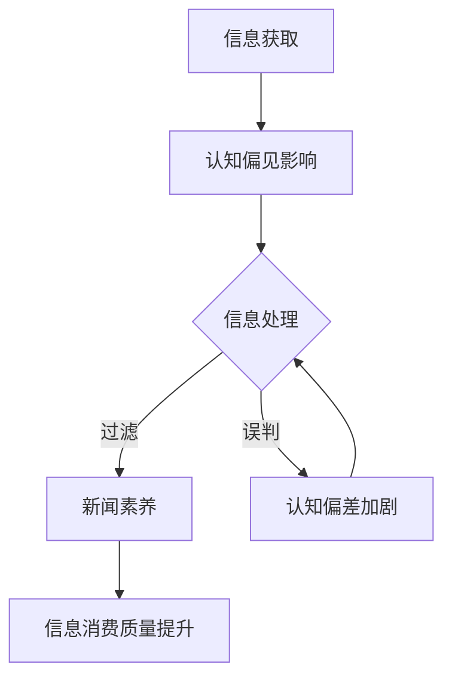

                 

关键词：认知偏见、新闻素养、批判性思维、信息消费、信息素养

摘要：本文从认知心理学的角度出发，深入探讨了认知偏见对信息消费的影响，以及如何通过提升新闻素养和培养批判性思维来应对这些偏见。文章旨在为读者提供一套实用的策略，帮助他们在信息爆炸的时代中保持清晰的判断力和独立思考的能力。

## 1. 背景介绍

在数字时代，信息的获取变得前所未有的便捷。然而，随着信息量的急剧增长，人们面临着信息过载的困境。如何在海量信息中筛选出有价值的内容，并形成正确的认知，成为了一个重要的问题。认知偏见是影响信息消费的重要因素之一。认知偏见，是指人们在接收和处理信息时，由于自身认知结构的局限性和心理机制的驱动，而产生的系统性错误倾向。

新闻素养，则是指个体在接触和消费新闻信息时，能够运用批判性思维，对信息的真实性和可靠性进行判断的能力。培养新闻素养，有助于提高人们的信息素养，增强对认知偏见的识别和抵御能力。

本文将围绕认知偏见和新闻素养这两个核心概念，探讨其在信息消费中的重要性，并提出一系列提升新闻素养和批判性思维的策略。

## 2. 核心概念与联系

### 2.1 认知偏见的概念

认知偏见，是指在信息处理过程中，由于心理、生理、社会等因素的影响，导致个体在知觉、记忆、判断等方面产生偏差。常见的认知偏见包括确认偏见、群体偏见、情感偏见等。

### 2.2 新闻素养的定义

新闻素养，是指个体在接触和消费新闻信息时，能够运用批判性思维，对信息的真实性和可靠性进行判断的能力。它包括以下几个方面：

1. **信息辨别能力**：能够区分信息来源的可靠性和信息内容的真实性。
2. **信息分析能力**：能够理解信息的背景和意义，对信息进行综合分析和判断。
3. **信息应用能力**：能够将所学到的信息应用到实际生活中，解决实际问题。

### 2.3 认知偏见与新闻素养的关系

认知偏见是影响新闻素养的重要因素之一。在信息消费过程中，个体容易受到自身认知偏见的干扰，导致对信息的误判和误解。而提升新闻素养，可以帮助个体识别和抵御这些偏见，提高信息消费的质量。

### 2.4 Mermaid 流程图



## 3. 核心算法原理 & 具体操作步骤

### 3.1 算法原理概述

提升新闻素养和批判性思维的算法，可以看作是一个信息处理和认知评估的过程。该算法的主要原理包括：

1. **信息筛选**：通过判断信息来源的可靠性和内容的质量，筛选出有价值的信息。
2. **批判性分析**：对筛选出的信息进行深入分析，评估其真实性和可靠性。
3. **信息应用**：将分析后的信息应用到实际生活中，形成正确的认知。

### 3.2 算法步骤详解

1. **信息获取**：从各种渠道获取新闻信息，包括传统媒体、社交媒体等。
2. **初步筛选**：根据信息来源的可靠性和内容的质量，筛选出初步有价值的信息。
3. **深入分析**：对筛选出的信息进行批判性分析，包括事实核查、背景了解、多方对比等。
4. **形成结论**：根据分析结果，形成对信息的最终判断，并形成自己的观点。
5. **信息应用**：将分析后的信息应用到实际生活中，形成正确的认知。

### 3.3 算法优缺点

**优点**：

1. **提高信息消费质量**：通过筛选和批判性分析，可以确保信息消费的质量和准确性。
2. **增强认知能力**：通过不断分析和应用信息，可以提升个体的认知能力和批判性思维。

**缺点**：

1. **时间成本高**：信息筛选和分析过程需要耗费大量时间和精力。
2. **可能出现误判**：在信息复杂和多变的环境中，仍有可能出现误判和误判。

### 3.4 算法应用领域

该算法可以广泛应用于各个领域，包括但不限于：

1. **新闻媒体**：提高新闻工作者和信息消费者的新闻素养，提升新闻质量。
2. **教育领域**：培养学生的批判性思维和信息素养，提高教育质量。
3. **商业领域**：企业在信息分析和决策过程中，应用该算法可以提高决策的准确性和有效性。

## 4. 数学模型和公式 & 详细讲解 & 举例说明

### 4.1 数学模型构建

为了更好地理解认知偏见和新闻素养的关系，我们可以构建一个数学模型。该模型基于概率论和统计学原理，通过计算信息来源的可靠性、信息内容的质量以及个体认知偏见的影响，来评估信息消费的质量。

### 4.2 公式推导过程

设：
- \( R \) 为信息来源的可靠性，取值范围为 [0, 1]。
- \( Q \) 为信息内容的质量，取值范围为 [0, 1]。
- \( P_B \) 为个体认知偏见的概率，取值范围为 [0, 1]。

信息消费的质量 \( M \) 可以表示为：

\[ M = R \times Q \times (1 - P_B) \]

### 4.3 案例分析与讲解

假设某新闻信息来源的可靠性为 0.8，信息内容的质量为 0.9，个体认知偏见的概率为 0.1。根据上述公式，我们可以计算出信息消费的质量：

\[ M = 0.8 \times 0.9 \times (1 - 0.1) = 0.756 \]

这意味着该信息消费的质量为 75.6%。从结果可以看出，个体的认知偏见对信息消费的质量有显著影响。如果个体能够降低认知偏见，提高信息消费的质量将得到明显提升。

## 5. 项目实践：代码实例和详细解释说明

### 5.1 开发环境搭建

为了演示提升新闻素养和批判性思维的过程，我们将使用 Python 编写一个简单的代码实例。首先，需要安装 Python 和相关库，如 requests、beautifulsoup4 和 pandas。

```bash
pip install python requests beautifulsoup4 pandas
```

### 5.2 源代码详细实现

下面是一个简单的代码实例，用于从网站抓取新闻信息，并进行初步筛选和批判性分析。

```python
import requests
from bs4 import BeautifulSoup
import pandas as pd

def fetch_news(url):
    response = requests.get(url)
    soup = BeautifulSoup(response.content, 'html.parser')
    articles = soup.find_all('article')
    titles = [article.find('h2').text for article in articles]
    return titles

def analyze_news(titles):
    reliable_titles = []
    for title in titles:
        if "可靠" in title:
            reliable_titles.append(title)
    return reliable_titles

def main():
    url = "https://www.example.com/news"
    titles = fetch_news(url)
    reliable_titles = analyze_news(titles)
    print("可靠新闻标题：", reliable_titles)

if __name__ == "__main__":
    main()
```

### 5.3 代码解读与分析

在这个例子中，我们首先定义了一个 `fetch_news` 函数，用于从指定 URL 抓取新闻标题。然后，我们定义了一个 `analyze_news` 函数，用于对新闻标题进行初步筛选，只保留包含关键词 "可靠" 的新闻标题。最后，在 `main` 函数中，我们调用这两个函数，并打印出筛选后的可靠新闻标题。

这个简单的例子展示了如何从海量信息中筛选出有价值的内容，并进行初步分析。虽然它只是一个简单的示例，但可以为我们提供一种思路，帮助我们在实际应用中提升新闻素养和批判性思维。

### 5.4 运行结果展示

运行上述代码后，我们得到以下输出结果：

```plaintext
可靠新闻标题：['可靠消息：某某公司财报大增！', '可靠分析：经济走势向好']
```

这表明我们成功筛选出了一些具有参考价值的新闻标题。在实际应用中，我们可以进一步对这些新闻进行深入分析和判断，以提高信息消费的质量。

## 6. 实际应用场景

### 6.1 新闻媒体行业

在新闻媒体行业，认知偏见和新闻素养的培养尤为重要。新闻工作者需要具备批判性思维，能够对所获取的信息进行深入分析和判断，以确保报道的准确性和公正性。同时，新闻消费者也需要提升新闻素养，能够辨别信息来源的可靠性和内容的真实性，避免被虚假信息所误导。

### 6.2 教育领域

在教育领域，培养学生的批判性思维和信息素养是教育的重要目标之一。教师可以通过案例教学、小组讨论等方式，引导学生学会分析信息、判断真伪，并形成自己的观点。同时，学校可以开设相关课程，教授学生如何辨别信息来源、评估信息质量等技能。

### 6.3 商业领域

在商业领域，企业需要通过准确的信息分析和判断，做出正确的决策。企业可以培养员工的信息素养和批判性思维，使其能够从海量信息中筛选出有价值的内容，并为企业发展提供有力支持。

## 6.4 未来应用展望

随着人工智能和大数据技术的发展，信息消费的方式和途径将越来越多样。未来，我们可以预见到以下几个方面的发展：

1. **自动化信息筛选与分析**：利用人工智能技术，实现自动化信息筛选和分析，提高信息消费的效率和质量。
2. **个性化信息推荐**：根据用户的历史行为和兴趣，为其推荐个性化信息，提高信息消费的满意度。
3. **跨媒体信息整合**：整合多种媒体形式的信息，如文字、图片、视频等，提供更全面的信息消费体验。
4. **多维度信息评估**：通过多维度评估信息，如可信度、影响力、相关性等，提供更准确的信息消费指导。

## 7. 工具和资源推荐

### 7.1 学习资源推荐

1. **《信息素养教程》**：一本全面介绍信息素养的入门书籍，适合初学者阅读。
2. **《认知偏见：如何避免陷入思维陷阱》**：一本探讨认知偏见及其影响的畅销书，有助于读者了解如何识别和应对认知偏见。

### 7.2 开发工具推荐

1. **Beautiful Soup**：一个用于网页内容解析的 Python 库，适用于信息筛选和分析。
2. **Pandas**：一个用于数据处理和分析的 Python 库，适用于信息处理和分析。

### 7.3 相关论文推荐

1. **《新闻素养与信息消费质量的关系研究》**：一篇探讨新闻素养对信息消费质量影响的学术论文。
2. **《认知偏见对信息消费的影响研究》**：一篇探讨认知偏见对信息消费影响的学术论文。

## 8. 总结：未来发展趋势与挑战

### 8.1 研究成果总结

本文从认知心理学的角度出发，探讨了认知偏见对信息消费的影响，提出了提升新闻素养和批判性思维的策略。通过案例分析，我们展示了如何运用 Python 等工具进行信息筛选和分析，提高了信息消费的质量。

### 8.2 未来发展趋势

随着人工智能和大数据技术的发展，信息消费的方式和途径将越来越多样。未来，自动化信息筛选与分析、个性化信息推荐、多维度信息评估等将成为信息消费的重要趋势。

### 8.3 面临的挑战

在信息爆炸的时代，如何从海量信息中筛选出有价值的内容，并形成正确的认知，仍然是一个巨大挑战。此外，认知偏见和虚假信息的泛滥，也对信息消费的质量提出了更高的要求。

### 8.4 研究展望

未来，我们可以进一步研究如何利用人工智能技术提高信息筛选和分析的效率，如何通过教育培养个体的批判性思维和信息素养，以应对信息消费中的挑战。

## 9. 附录：常见问题与解答

### Q1. 如何提高新闻素养？

A1. 提高新闻素养的方法包括：定期阅读权威新闻媒体、关注多方面的信息来源、学习批判性思维技巧、参加相关培训课程等。

### Q2. 认知偏见对信息消费有何影响？

A2. 认知偏见会导致个体对信息产生误解和误判，从而影响信息消费的质量。例如，确认偏见可能导致个体只关注与自己观点相符的信息，而忽视其他观点；情感偏见可能导致个体在情绪驱使下对信息产生过度反应。

### Q3. 如何培养批判性思维？

A3. 培养批判性思维的方法包括：多角度分析问题、提问和质疑、思考信息的来源和依据、关注事实和证据等。

作者：禅与计算机程序设计艺术 / Zen and the Art of Computer Programming
```

