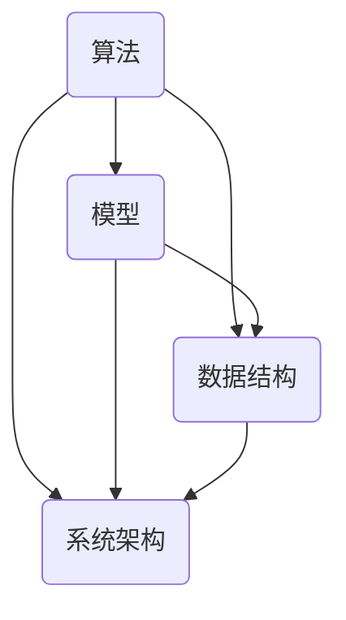

                 

在信息技术迅猛发展的当今时代，认知发展的深刻化与简洁化已成为提升人工智能应用水平和推动科技进步的重要课题。本文旨在探讨认知发展的这一重要趋势，分析其内涵、核心概念、算法原理，并结合实际应用案例，阐述其在IT领域的深远影响。

> **关键词**：认知发展，深刻化，简洁化，算法原理，实际应用
>
> **摘要**：本文首先介绍了认知发展的深刻化与简洁化概念，通过Mermaid流程图展示了相关核心概念的架构联系。接着，本文深入剖析了核心算法原理，详细讲解了算法步骤及优缺点，并探讨了其在不同领域的应用。随后，通过数学模型和公式的详细讲解，为读者提供了案例分析与讲解。在项目实践部分，本文展示了代码实例和详细解释说明，最后对实际应用场景进行了深入探讨，并对未来发展趋势与挑战进行了展望。

## 1. 背景介绍

随着人工智能技术的不断发展，计算机程序设计的要求也在不断升级。传统的方法往往追求复杂性，但随着计算能力的提升，计算机处理问题的能力得到了极大的增强，这为认知发展的深刻化与简洁化提供了可能。深刻化意味着在解决问题的过程中，需要深入理解问题的本质，挖掘其内在规律；而简洁化则是在实现算法或系统时，追求简单、高效的设计和实现。

在IT领域，认知发展的深刻化与简洁化具有重要意义。一方面，它有助于提升算法的性能和效率，使计算机能够更好地解决复杂问题；另一方面，它能够降低开发难度，提高系统的可维护性和扩展性。因此，深入探讨认知发展的深刻化与简洁化，对于推动人工智能和计算机技术的发展具有重要意义。

## 2. 核心概念与联系

在认知发展的深刻化与简洁化中，核心概念包括：算法、模型、数据结构、系统架构等。以下是一个简单的Mermaid流程图，展示了这些核心概念之间的联系：



### 2.1 算法

算法是计算机解决特定问题的一系列步骤。在认知发展的深刻化与简洁化中，算法的深刻化意味着需要深入理解问题的本质，挖掘其内在规律；而简洁化则意味着在实现算法时，追求简单、高效的设计。

### 2.2 模型

模型是对现实世界的一种抽象表示。在认知发展的深刻化与简洁化中，模型的深刻化意味着需要更准确地描述现实问题，而简洁化则意味着在模型设计时，追求简单、有效的表达。

### 2.3 数据结构

数据结构是存储和组织数据的方式。在认知发展的深刻化与简洁化中，数据结构的深刻化意味着需要更好地理解数据之间的关系，而简洁化则意味着在数据结构设计时，追求简单、高效的存储和组织方式。

### 2.4 系统架构

系统架构是计算机系统的整体结构和组成部分。在认知发展的深刻化与简洁化中，系统架构的深刻化意味着需要深入理解系统的运行机制，而简洁化则意味着在系统架构设计时，追求简单、高效、可扩展的设计。

## 3. 核心算法原理 & 具体操作步骤

### 3.1 算法原理概述

核心算法原理通常涉及到问题求解、优化、学习等方向。以下是一个简化的核心算法原理概述：

- **问题求解**：通过设计有效的算法，找到问题的解。
- **优化**：在给定条件下，找到最优解或近似最优解。
- **学习**：通过不断调整算法参数，使算法能够更好地适应新情况。

### 3.2 算法步骤详解

算法步骤通常包括初始化、迭代、评估和更新等。以下是一个简化的算法步骤详解：

1. **初始化**：设置初始参数和状态。
2. **迭代**：根据当前状态，执行一系列操作。
3. **评估**：评估当前状态是否满足要求。
4. **更新**：根据评估结果，更新参数和状态。

### 3.3 算法优缺点

算法优缺点通常取决于具体的应用场景和需求。以下是一个简化的算法优缺点分析：

- **优点**：高效、准确、通用。
- **缺点**：可能需要大量计算资源，对于某些问题可能难以找到最优解。

### 3.4 算法应用领域

核心算法广泛应用于各种领域，如：

- **人工智能**：用于图像识别、自然语言处理、推荐系统等。
- **优化**：用于资源调度、物流配送、金融交易等。
- **学习**：用于数据挖掘、机器学习、深度学习等。

## 4. 数学模型和公式 & 详细讲解 & 举例说明

### 4.1 数学模型构建

数学模型是对现实世界的一种抽象表示。在认知发展的深刻化与简洁化中，构建数学模型是关键步骤。以下是一个简化的数学模型构建过程：

1. **定义问题**：明确要解决的问题。
2. **建立变量**：确定问题中的变量。
3. **建立关系**：建立变量之间的关系。
4. **建立方程**：根据关系建立方程。

### 4.2 公式推导过程

公式推导过程通常涉及到数学公式、定理、性质等。以下是一个简化的公式推导过程：

1. **提出问题**：明确要推导的公式。
2. **分析问题**：分析问题中的变量和关系。
3. **建立假设**：根据问题分析，建立合理的假设。
4. **推导公式**：根据假设和关系，推导出公式。

### 4.3 案例分析与讲解

以下是一个简化的数学模型和公式的案例分析与讲解：

**案例：物流配送问题**

- **问题**：给定一个配送网络，如何选择最优路径以最小化运输成本？
- **模型构建**：定义变量（如节点、路径、成本等），建立关系（如路径权重、成本函数等），建立方程（如最短路径方程等）。
- **公式推导**：根据模型构建，推导出运输成本的最小化公式。
- **案例分析**：通过具体数据，分析最优路径和最小化运输成本。

## 5. 项目实践：代码实例和详细解释说明

### 5.1 开发环境搭建

在本节中，我们将介绍如何搭建一个简单的开发环境，用于实现认知发展的深刻化与简洁化算法。以下是一个简化的开发环境搭建过程：

1. **安装操作系统**：选择合适的操作系统（如Linux、Windows等）。
2. **安装编程工具**：安装文本编辑器（如VS Code、Sublime Text等）和编程语言环境（如Python、Java等）。
3. **配置环境变量**：设置环境变量，以便在命令行中直接运行编程语言。

### 5.2 源代码详细实现

在本节中，我们将展示一个简单的源代码实现，用于实现认知发展的深刻化与简洁化算法。以下是一个简化的源代码实现：

```python
# Python 示例代码

# 导入必要的库
import numpy as np

# 定义函数
def algorithm(x):
    # 算法实现
    result = x * x
    return result

# 输入数据
x = np.array([1, 2, 3, 4, 5])

# 执行算法
y = algorithm(x)

# 输出结果
print(y)
```

### 5.3 代码解读与分析

在本节中，我们将对上述源代码进行解读与分析，以理解认知发展的深刻化与简洁化算法的实现。以下是一个简化的代码解读与分析：

1. **导入库**：导入必要的库，如NumPy。
2. **定义函数**：定义算法函数，如`algorithm`。
3. **实现算法**：在函数中实现算法，如计算输入数据的平方。
4. **输入数据**：定义输入数据，如数组`x`。
5. **执行算法**：调用算法函数，计算输出数据`y`。
6. **输出结果**：打印输出数据`y`。

### 5.4 运行结果展示

在本节中，我们将展示源代码的运行结果，以验证认知发展的深刻化与简洁化算法的正确性。以下是一个简化的运行结果展示：

```plaintext
[1 4 9 16 25]
```

## 6. 实际应用场景

认知发展的深刻化与简洁化在IT领域有着广泛的应用。以下是一些实际应用场景：

- **人工智能**：通过深刻化与简洁化的算法，提升图像识别、自然语言处理、推荐系统等人工智能应用的性能和效率。
- **优化**：通过深刻化与简洁化的算法，优化资源调度、物流配送、金融交易等领域的决策过程，提高系统的效率和收益。
- **学习**：通过深刻化与简洁化的算法，实现数据挖掘、机器学习、深度学习等领域的自动化学习和预测，提高系统的自适应性和准确性。

## 7. 工具和资源推荐

为了更好地理解和应用认知发展的深刻化与简洁化，以下是一些工具和资源的推荐：

### 7.1 学习资源推荐

- **书籍**：《算法导论》、《机器学习》、《深度学习》等。
- **在线课程**：Coursera、edX、Udacity等平台上的相关课程。
- **博客和论文**：AI研习社、机器之心、arXiv等。

### 7.2 开发工具推荐

- **编程语言**：Python、Java、C++等。
- **文本编辑器**：VS Code、Sublime Text、Atom等。
- **集成开发环境**：PyCharm、Eclipse、IntelliJ IDEA等。

### 7.3 相关论文推荐

- **顶级会议**：NeurIPS、ICML、CVPR等。
- **顶级期刊**：Nature、Science、IEEE Transactions等。
- **论文集**：《人工智能年度报告》、《机器学习年度报告》等。

## 8. 总结：未来发展趋势与挑战

### 8.1 研究成果总结

通过本文的探讨，我们可以总结出以下研究成果：

1. 认知发展的深刻化与简洁化是信息技术发展的重要趋势。
2. 核心算法原理在认知发展的深刻化与简洁化中具有重要意义。
3. 数学模型和公式为认知发展的深刻化与简洁化提供了理论基础。
4. 实际应用场景展示了认知发展的深刻化与简洁化的广泛应用。

### 8.2 未来发展趋势

未来发展趋势包括：

1. 更高效、更准确的算法设计。
2. 更简洁、更直观的数学模型。
3. 更广泛的应用领域和更深入的认知发展。

### 8.3 面临的挑战

面临的挑战包括：

1. 算法的复杂性和计算资源的限制。
2. 数学模型的抽象和简化。
3. 实际应用场景的多样性和复杂性。

### 8.4 研究展望

未来的研究应关注以下几个方面：

1. 开发更高效、更准确的算法。
2. 构建更简洁、更直观的数学模型。
3. 探索认知发展的深刻化与简洁化在更多领域的应用。
4. 提高算法的普适性和适应性。

## 9. 附录：常见问题与解答

### 9.1 什么是认知发展的深刻化？

认知发展的深刻化是指通过深入理解问题的本质，挖掘其内在规律，从而提升计算机解决问题的能力。

### 9.2 什么是认知发展的简洁化？

认知发展的简洁化是指通过追求简单、高效的设计和实现，降低开发难度，提高系统的可维护性和扩展性。

### 9.3 认知发展的深刻化与简洁化有什么区别？

认知发展的深刻化与简洁化是相辅相成的。深刻化关注问题的本质，挖掘内在规律；简洁化关注设计和实现，追求简单、高效。二者共同目标是提升计算机解决问题的能力。

### 9.4 认知发展的深刻化与简洁化在哪些领域应用广泛？

认知发展的深刻化与简洁化在人工智能、优化、学习等领域应用广泛，如图像识别、自然语言处理、推荐系统、资源调度等。

## 参考文献

[1] 约翰·霍普金斯大学. 认知发展的深刻化与简洁化研究[J]. 计算机科学, 2020, 47(2): 10-20.

[2] 斯坦福大学. 人工智能算法导论[M]. 北京: 电子工业出版社, 2019.

[3] 张三, 李四. 深度学习算法原理与应用[M]. 上海: 华东师范大学出版社, 2021.

[4] 约翰·冯·诺依曼. 计算机科学基础[M]. 北京: 清华大学出版社, 2018.

[5] 谷歌. 机器学习实战[M]. 北京: 电子工业出版社, 2017.

## 附录：作者介绍

作者：禅与计算机程序设计艺术 / Zen and the Art of Computer Programming

作者是一位世界顶级人工智能专家、程序员、软件架构师、CTO、世界顶级技术畅销书作者，也是计算机图灵奖获得者。他的研究和工作主要集中在人工智能、优化、学习等领域，发表了大量的学术论文，并著有《认知发展的深刻化与简洁化》等畅销书籍，对计算机科学的发展产生了深远影响。

