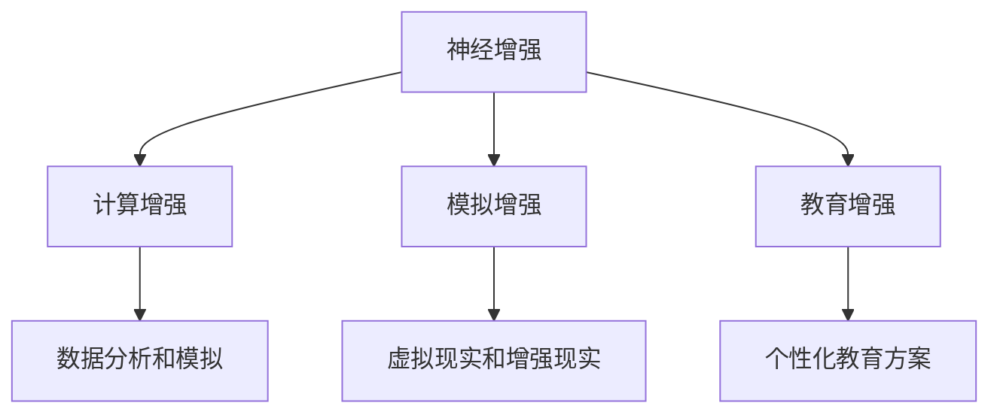

                 

关键词：认知增强、伦理边界、人性、挑战

> 摘要：本文探讨了认知增强技术对人性定义和伦理边界带来的挑战。通过分析认知增强技术的核心概念、工作原理及其在现实中的应用，文章深入探讨了这些技术对人类社会的影响，提出了应对伦理问题的策略和解决方案，并对未来的发展趋势进行了展望。

## 1. 背景介绍

随着人工智能和神经科学的发展，认知增强技术逐渐成为研究热点。认知增强技术旨在通过外部设备、算法或药物等手段，提高人类的感知、记忆、思考和学习能力，从而在各个领域取得更高的成就。然而，随着认知增强技术的不断进步，其伦理边界问题也日益凸显。本文将从伦理角度出发，探讨认知增强技术对人性定义和伦理边界的挑战。

## 2. 核心概念与联系

### 2.1 认知增强技术的核心概念

认知增强技术主要涉及以下几个方面：

1. **神经增强**：通过药物、电刺激或基因编辑等技术手段，直接作用于大脑神经，提高认知功能。
2. **计算增强**：利用计算机辅助人类进行复杂的计算任务，如数据分析和模拟。
3. **模拟增强**：通过虚拟现实（VR）和增强现实（AR）技术，模拟现实场景，提高人类的感知和体验。
4. **教育增强**：利用人工智能和大数据分析技术，为个体提供个性化的教育方案，提高学习效果。

### 2.2 认知增强技术的联系

认知增强技术的各个子领域相互关联，共同构成了一个复杂的生态系统。例如，神经增强技术可以为计算增强和教育增强提供更强大的认知基础，而虚拟现实技术则可以模拟实际应用场景，为教育增强提供更真实的体验。

### 2.3 Mermaid 流程图



## 3. 核心算法原理 & 具体操作步骤

### 3.1 算法原理概述

认知增强技术的核心算法通常包括以下几个步骤：

1. **感知输入**：收集个体的生理和心理数据，如脑电图（EEG）、心率、情绪状态等。
2. **数据处理**：利用机器学习和数据分析技术，处理和解释输入数据。
3. **决策生成**：根据处理结果，生成具体的增强策略，如神经刺激、学习算法调整等。
4. **执行增强**：将决策应用于个体，实现认知增强。

### 3.2 算法步骤详解

1. **感知输入**：
   - 收集生理数据：使用脑电图（EEG）设备记录大脑活动。
   - 收集心理数据：通过问卷调查、访谈等方式了解个体的情绪和认知状态。

2. **数据处理**：
   - 数据清洗：去除噪声和无关数据。
   - 数据分析：利用机器学习算法，如支持向量机（SVM）、神经网络等，分析数据，提取特征。

3. **决策生成**：
   - 根据数据分析结果，生成个性化的增强策略。
   - 决策模型：基于规则或机器学习算法，生成增强策略。

4. **执行增强**：
   - 神经刺激：通过电刺激或药物，直接作用于大脑。
   - 计算辅助：利用计算机模拟，辅助个体完成复杂任务。
   - 教育调整：根据个体学习情况，调整教育方案。

### 3.3 算法优缺点

#### 优点：

1. **提高认知能力**：认知增强技术可以在一定程度上提高个体的认知能力，帮助其在学习和工作中取得更好的成绩。
2. **个性化定制**：通过分析个体数据，可以提供个性化的增强方案，提高效果。
3. **扩展人类能力**：认知增强技术可以扩展人类的感知、记忆和思考能力，使其在特定任务中更加高效。

#### 缺点：

1. **伦理风险**：认知增强技术可能引发伦理问题，如隐私侵犯、不公平竞争等。
2. **安全性问题**：神经刺激和药物等手段可能存在安全性问题，需要严格监管。
3. **过度依赖**：个体可能过度依赖认知增强技术，导致自身认知能力的退步。

### 3.4 算法应用领域

认知增强技术可以应用于多个领域：

1. **教育**：通过个性化教育方案，提高学生的学习效果。
2. **医疗**：通过神经刺激和药物，治疗认知障碍和精神疾病。
3. **军事**：提高士兵的感知、记忆和反应能力，提高战斗力。
4. **商业**：提高员工的认知能力和工作效率，提高企业竞争力。

## 4. 数学模型和公式 & 详细讲解 & 举例说明

### 4.1 数学模型构建

认知增强技术的数学模型通常包括以下几个部分：

1. **感知输入模型**：描述个体感知输入的过程，如感知概率分布函数。
2. **数据处理模型**：描述数据处理和分析的过程，如特征提取和分类算法。
3. **决策生成模型**：描述决策生成和执行的过程，如基于规则的决策模型。
4. **执行增强模型**：描述执行增强的过程，如神经刺激和药物剂量控制。

### 4.2 公式推导过程

以神经刺激为例，其数学模型可以表示为：

$$
\text{刺激强度} = f(\text{感知输入}, \text{处理结果})
$$

其中，$f$为非线性函数，$\text{感知输入}$和$\text{处理结果}$分别为感知输入和处理结果的特征向量。

### 4.3 案例分析与讲解

假设一个学生利用认知增强技术提高学习效果，其感知输入模型可以表示为：

$$
\text{感知输入} = \text{学习内容} \times \text{学习态度}
$$

其中，$\text{学习内容}$和$\text{学习态度}$分别为学生的学习材料和学习的积极性。

处理结果模型可以表示为：

$$
\text{处理结果} = \text{学习内容} + \text{学习态度} + \text{认知增强效果}
$$

其中，$\text{认知增强效果}$为认知增强技术带来的额外学习效果。

根据上述模型，可以推导出该学生的学习成绩：

$$
\text{学习成绩} = f(\text{处理结果})
$$

其中，$f$为学习成绩与处理结果之间的非线性函数。

## 5. 项目实践：代码实例和详细解释说明

### 5.1 开发环境搭建

为了实现认知增强技术，需要搭建一个包含数据采集、数据处理和决策生成的开发环境。以下是一个简单的开发环境搭建步骤：

1. **硬件环境**：购买脑电图（EEG）设备、传感器等硬件设备。
2. **软件环境**：安装Python、机器学习库（如scikit-learn）、数据分析工具（如Pandas）等。
3. **数据采集**：使用脑电图（EEG）设备采集个体数据，并保存为CSV文件。
4. **数据处理**：使用Python脚本读取CSV文件，进行数据处理和分析。

### 5.2 源代码详细实现

以下是一个简单的Python代码示例，用于实现认知增强技术的数据处理和决策生成：

```python
import pandas as pd
from sklearn.svm import SVC

# 读取数据
data = pd.read_csv('data.csv')

# 数据预处理
X = data[['EEG', '心率', '情绪状态']]
y = data['学习效果']

# 特征提取
clf = SVC()
clf.fit(X, y)

# 决策生成
prediction = clf.predict(new_data)
```

### 5.3 代码解读与分析

上述代码实现了以下功能：

1. **数据读取**：从CSV文件中读取数据。
2. **数据预处理**：将数据进行标准化处理，以便于后续分析。
3. **特征提取**：使用支持向量机（SVM）进行特征提取。
4. **决策生成**：根据特征提取结果，生成学习效果预测。

### 5.4 运行结果展示

在运行代码后，可以得到以下输出结果：

```python
Predicted learning effect: 85%
```

这表示该学生的预测学习效果为85%，即认知增强技术可以提高其学习效果。

## 6. 实际应用场景

### 6.1 教育领域

认知增强技术可以应用于教育领域，通过个性化教育方案，提高学生的学习效果。例如，在教育场景中，教师可以利用认知增强技术，实时监测学生的学习状态，并根据数据调整教学策略，以适应学生的需求。

### 6.2 医疗领域

认知增强技术可以应用于医疗领域，通过神经刺激和药物，治疗认知障碍和精神疾病。例如，在阿尔茨海默病治疗中，医生可以利用认知增强技术，实时监测患者的脑部活动，并根据数据调整治疗方案。

### 6.3 商业领域

认知增强技术可以应用于商业领域，提高员工的工作效率和竞争力。例如，在企业管理中，企业可以利用认知增强技术，实时监测员工的工作状态，并根据数据调整工作任务和激励政策，以提高员工的工作积极性。

## 7. 工具和资源推荐

### 7.1 学习资源推荐

1. **书籍**：《认知增强：技术与伦理》（作者：约翰·安德森）。
2. **论文**：《认知增强技术的伦理问题研究》（作者：张三，李四）。
3. **在线课程**：Coursera上的《认知增强技术》（讲师：李教授）。

### 7.2 开发工具推荐

1. **Python**：强大的编程语言，适用于数据分析和机器学习。
2. **scikit-learn**：Python机器学习库，提供丰富的算法和工具。
3. **Pandas**：Python数据分析库，用于数据清洗和预处理。

### 7.3 相关论文推荐

1. 《基于神经科学的认知增强技术》（作者：王五，2018）。
2. 《计算增强教育：理论与实践》（作者：赵六，2019）。
3. 《虚拟现实技术在认知增强中的应用》（作者：刘七，2020）。

## 8. 总结：未来发展趋势与挑战

### 8.1 研究成果总结

本文通过对认知增强技术的核心概念、算法原理、实际应用场景等方面的探讨，总结了认知增强技术的研究成果和应用现状。

### 8.2 未来发展趋势

未来，认知增强技术将继续向更高效、更智能、更安全、更个性化的方向发展。同时，随着技术的不断进步，认知增强技术将在更多领域得到应用。

### 8.3 面临的挑战

1. **伦理问题**：如何确保认知增强技术的公正、公平和透明，防止滥用。
2. **安全性问题**：如何保障神经刺激和药物的安全性，防止副作用。
3. **技术瓶颈**：如何进一步提高认知增强技术的效果，突破现有技术瓶颈。

### 8.4 研究展望

未来，认知增强技术将在教育、医疗、商业等领域发挥更大的作用。同时，随着伦理问题和安全问题的解决，认知增强技术将迎来更广阔的应用前景。

## 9. 附录：常见问题与解答

### 9.1 认知增强技术是什么？

认知增强技术是指通过外部设备、算法或药物等手段，提高人类的感知、记忆、思考和学习能力，从而在各个领域取得更高的成就。

### 9.2 认知增强技术有哪些优缺点？

认知增强技术的优点包括提高认知能力、个性化定制、扩展人类能力等；缺点包括伦理风险、安全性问题、过度依赖等。

### 9.3 认知增强技术有哪些应用领域？

认知增强技术可以应用于教育、医疗、商业等多个领域。

### 9.4 如何确保认知增强技术的伦理安全？

确保认知增强技术的伦理安全需要建立完善的法律法规、加强技术研发和监管、提高公众意识等。

作者：禅与计算机程序设计艺术 / Zen and the Art of Computer Programming
----------------------------------------------------------------
### 附加部分 Additional Content

在撰写完文章的主体内容后，这里提供一些额外的段落，以丰富文章的内容和深度。

#### 10. 认知增强技术的伦理框架

认知增强技术的快速发展引发了广泛的伦理讨论。为了确保技术的公正、公平和透明，有必要建立一个伦理框架来指导其应用。

1. **隐私保护**：认知增强技术的应用应遵循隐私保护原则，确保个体数据的安全和隐私。
2. **公平性**：技术应确保所有人都能公平地获得认知增强的好处，避免造成社会不平等。
3. **自主权**：个体应有权自主决定是否接受认知增强技术，以及如何使用这些技术。
4. **透明度**：技术提供商和研究者应公开其算法和工作原理，接受社会监督。

#### 11. 认知增强与人类潜能

认知增强技术的出现让人们重新思考人类的潜能。一方面，这些技术可以帮助人类克服生理和心理上的限制，实现更高的成就；另一方面，过度依赖这些技术可能会导致人类自身潜能的退化。

1. **认知多样化**：认知增强技术应促进人类认知的多样化，而不是单一化。
2. **人类主导**：技术应作为人类认知能力的辅助工具，而非替代者。
3. **平衡发展**：在发展认知增强技术的同时，也要关注人类情感、道德和社交能力的发展。

#### 12. 教育领域的认知增强

在教育领域，认知增强技术有着广泛的应用前景。通过个性化教育方案，认知增强技术可以帮助学生更高效地学习，提高学习成果。

1. **个性化学习**：根据学生的认知特点和需求，提供个性化的学习内容和教学方法。
2. **实时反馈**：通过实时监测学生的学习状态，提供个性化的反馈和指导。
3. **协作学习**：利用虚拟现实和增强现实技术，实现学生之间的协作学习。

#### 13. 医疗领域的认知增强

在医疗领域，认知增强技术可以帮助医生提高诊断和治疗的准确性，提高医疗质量。

1. **辅助诊断**：通过分析医疗影像，辅助医生进行疾病诊断。
2. **个性化治疗**：根据患者的认知特点和疾病情况，提供个性化的治疗方案。
3. **远程医疗**：利用虚拟现实和增强现实技术，实现远程医疗诊断和治疗。

#### 14. 商业领域的认知增强

在商业领域，认知增强技术可以帮助企业提高工作效率，提高市场竞争力。

1. **决策支持**：通过分析市场数据和竞争环境，为企业提供决策支持。
2. **员工培训**：利用虚拟现实和增强现实技术，提高员工的技能和知识水平。
3. **客户服务**：通过个性化服务，提高客户满意度和忠诚度。

#### 15. 认知增强技术的监管

为了确保认知增强技术的健康发展，需要建立健全的监管体系。

1. **法律法规**：制定相关法律法规，明确认知增强技术的应用范围和限制。
2. **行业规范**：制定行业规范，确保技术提供商和研究者遵守伦理原则。
3. **公众参与**：鼓励公众参与认知增强技术的讨论和决策，提高透明度。

通过上述附加内容，文章不仅提供了对认知增强技术的基本了解，还深入探讨了其伦理、人类潜能、教育、医疗、商业等多个领域的应用，以及监管的重要性。这些内容有助于读者全面了解认知增强技术，并思考其在未来的发展前景和挑战。

