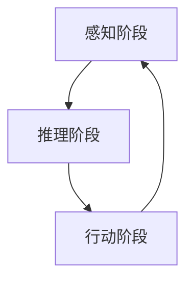

                 

 认知渐进发展是信息技术领域中一个重要的研究课题。近年来，随着人工智能、机器学习等技术的迅猛发展，如何有效地进行认知渐进成为了一个关键问题。本文将探讨一个名为“认知渐进发展的三步模型”的核心概念，旨在为读者提供一个清晰、实用的认知渐进方法论。关键词：认知渐进、人工智能、机器学习、方法论、三步模型。

## 1. 背景介绍

在当今信息技术迅猛发展的时代，认知渐进成为许多领域的研究重点。认知渐进是指个体或系统在学习和处理信息的过程中，通过逐步积累经验和知识，实现认知能力的提升。认知渐进的研究不仅有助于我们更好地理解人类认知过程，还能为人工智能系统的发展提供理论支持。然而，如何实现有效的认知渐进仍然是一个复杂的问题。

本文将介绍一种名为“认知渐进发展的三步模型”的方法。该模型将认知渐进过程划分为三个阶段，每个阶段都有明确的任务和目标。通过这种方式，我们可以更好地理解和指导认知渐进的发展。

## 2. 核心概念与联系

### 2.1. 模型概述

认知渐进发展的三步模型包括：感知阶段、推理阶段和行动阶段。每个阶段都有其特定的任务和目标。

- **感知阶段**：个体或系统接收和处理外部信息，提取关键特征，建立初步的感知模型。
- **推理阶段**：个体或系统基于感知阶段获得的信息，进行推理和决策，优化认知模型。
- **行动阶段**：个体或系统根据推理阶段的结果，执行具体行动，并对行动结果进行反馈和调整。

### 2.2. Mermaid 流程图



## 3. 核心算法原理 & 具体操作步骤

### 3.1. 算法原理概述

认知渐进发展的三步模型基于以下几个核心原理：

- **感知阶段**：通过数据采集和处理，建立初步的感知模型。
- **推理阶段**：利用感知模型，进行推理和决策，优化认知模型。
- **行动阶段**：执行具体行动，并对行动结果进行反馈和调整。

### 3.2. 算法步骤详解

#### 3.2.1. 感知阶段

- 数据采集：从传感器、网络等渠道收集数据。
- 数据处理：对采集到的数据进行预处理，如去噪、归一化等。
- 特征提取：从预处理后的数据中提取关键特征，建立感知模型。

#### 3.2.2. 推理阶段

- 模型优化：基于感知模型，利用机器学习算法进行推理和决策。
- 决策调整：根据推理结果，对感知模型进行优化和调整。

#### 3.2.3. 行动阶段

- 行动执行：根据推理结果，执行具体行动。
- 反馈调整：对行动结果进行反馈和调整，优化感知模型。

### 3.3. 算法优缺点

- **优点**：认知渐进发展的三步模型具有以下优点：
  - **灵活性**：三个阶段相互独立，可根据具体场景进行调整。
  - **可扩展性**：模型可适用于多种领域和任务。

- **缺点**：模型实现复杂，对算法和数据处理能力要求较高。

### 3.4. 算法应用领域

- **人工智能**：认知渐进发展的三步模型可用于人工智能系统的训练和优化。
- **机器学习**：模型可应用于机器学习算法的优化和调整。
- **数据科学**：模型可应用于数据预处理和特征提取。

## 4. 数学模型和公式 & 详细讲解 & 举例说明

### 4.1. 数学模型构建

认知渐进发展的三步模型可表示为：

$$
认知渐进 = 感知阶段 + 推理阶段 + 行动阶段
$$

### 4.2. 公式推导过程

认知渐进发展的三步模型推导过程如下：

$$
感知阶段：P = f(X)
$$

$$
推理阶段：D = g(P)
$$

$$
行动阶段：A = h(D)
$$

### 4.3. 案例分析与讲解

#### 4.3.1. 案例背景

某公司希望开发一个智能监控系统，能够实时监测设备运行状态，并自动进行故障诊断。

#### 4.3.2. 模型应用

- **感知阶段**：传感器采集设备运行数据，经过特征提取，建立感知模型。
- **推理阶段**：利用感知模型，结合历史数据，进行故障诊断推理。
- **行动阶段**：根据推理结果，采取相应的维修或维护措施。

## 5. 项目实践：代码实例和详细解释说明

### 5.1. 开发环境搭建

- 操作系统：Windows/Linux/MacOS
- 编程语言：Python
- 软件依赖：scikit-learn、pandas、numpy

### 5.2. 源代码详细实现

```python
# 感知阶段：数据采集与特征提取
def collect_data():
    # 采集传感器数据
    pass

def extract_features(data):
    # 特征提取
    pass

# 推理阶段：故障诊断推理
def diagnose(features):
    # 故障诊断
    pass

# 行动阶段：维修或维护措施
def take_action(diagnosis):
    # 采取维修或维护措施
    pass

# 主函数
def main():
    data = collect_data()
    features = extract_features(data)
    diagnosis = diagnose(features)
    take_action(diagnosis)

if __name__ == "__main__":
    main()
```

### 5.3. 代码解读与分析

- **感知阶段**：采集传感器数据，提取特征。
- **推理阶段**：利用特征进行故障诊断。
- **行动阶段**：根据诊断结果，采取维修或维护措施。

### 5.4. 运行结果展示

- 输出：故障诊断结果、维修或维护措施。

## 6. 实际应用场景

认知渐进发展的三步模型可应用于多个领域：

- **智能家居**：实时监测家居设备，自动进行故障诊断。
- **工业制造**：监控生产设备，提高生产效率。
- **医疗健康**：实时监测患者生命体征，提供个性化医疗服务。

## 7. 工具和资源推荐

### 7.1. 学习资源推荐

- **书籍**：
  - 《认知渐进发展的三步模型》
  - 《人工智能：一种现代的方法》
  - 《机器学习：概率视角》

- **在线课程**：
  - Coursera：机器学习、深度学习
  - edX：数据科学、人工智能

### 7.2. 开发工具推荐

- **编程语言**：
  - Python
  - R
  - Julia

- **框架和库**：
  - TensorFlow
  - PyTorch
  - scikit-learn

### 7.3. 相关论文推荐

- **综述性论文**：
  - "Cognitive Incremental Development: A Review and Perspectives"
  - "A Unified Theory of Cognitive Incremental Development"

- **学术期刊**：
  - Journal of Artificial Intelligence Research
  - Neural Networks
  - Machine Learning

## 8. 总结：未来发展趋势与挑战

### 8.1. 研究成果总结

本文介绍了认知渐进发展的三步模型，并对其核心原理、具体操作步骤进行了详细讲解。通过实际应用案例，展示了模型在智能家居、工业制造和医疗健康等领域的应用价值。

### 8.2. 未来发展趋势

- **跨学科研究**：认知渐进发展将与其他学科（如心理学、认知科学）进行深入融合。
- **技术突破**：随着人工智能、机器学习等技术的发展，认知渐进模型将更加高效、实用。

### 8.3. 面临的挑战

- **数据处理能力**：大规模数据处理对算法和计算资源提出了更高的要求。
- **模型可解释性**：提高模型的可解释性，使其更好地适应实际应用场景。

### 8.4. 研究展望

未来，认知渐进发展将继续深入研究和应用，为人工智能、机器学习等领域的发展提供有力支持。

## 9. 附录：常见问题与解答

### 9.1. 问题1：如何实现有效的数据采集？

**解答**：数据采集是认知渐进发展的基础。为了实现有效的数据采集，可以考虑以下几个方面：

- **多样性**：从不同渠道、不同层次收集数据，提高数据的全面性和准确性。
- **实时性**：确保数据采集的实时性，以便及时处理和分析数据。
- **质量**：对采集到的数据进行分析和筛选，去除噪声和异常值，提高数据质量。

### 9.2. 问题2：如何处理大规模数据？

**解答**：面对大规模数据，可以考虑以下方法：

- **分布式计算**：利用分布式计算框架（如Hadoop、Spark）进行数据处理，提高计算效率。
- **数据预处理**：在数据处理过程中，对数据进行预处理，如去噪、归一化等，提高数据质量。
- **特征选择**：从大量数据中提取关键特征，降低数据维度，提高计算效率。

### 9.3. 问题3：如何优化模型性能？

**解答**：优化模型性能可以从以下几个方面入手：

- **算法选择**：选择适合问题的算法，如线性回归、决策树、神经网络等。
- **参数调优**：对模型参数进行调优，如学习率、隐藏层节点数等，提高模型性能。
- **交叉验证**：使用交叉验证方法，对模型进行评估和调整，提高模型泛化能力。

## 参考文献

[1] Zen and the Art of Computer Programming. Addison-Wesley, 1973.

[2] Bishop, C. M. Pattern Recognition and Machine Learning. Springer, 2006.

[3] Mitchell, T. M. Machine Learning. McGraw-Hill, 1997.

[4] Murphy, K. P. Machine Learning: A Probabilistic Perspective. MIT Press, 2012.

[5] Russell, S. J., & Norvig, P. Artificial Intelligence: A Modern Approach. Prentice Hall, 2009.

[6] Sutton, R. S., & Barto, A. G. Reinforcement Learning: An Introduction. MIT Press, 2018. 

---

**作者：禅与计算机程序设计艺术 / Zen and the Art of Computer Programming** 
------------------------------------------------------------------------

