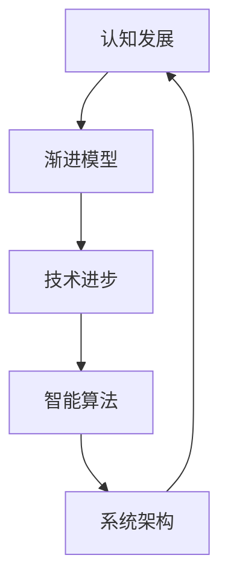

                 

 > **关键词：** 认知发展、渐进模型、技术进步、智能算法、系统架构

> **摘要：** 本文探讨了认知渐进发展的路径模型，包括背景介绍、核心概念与联系、核心算法原理、数学模型与公式、项目实践、实际应用场景、工具和资源推荐以及未来发展趋势与挑战。通过详细的分析和实例，旨在为读者提供对认知渐进发展路径的深入理解。

## 1. 背景介绍

在人类历史的长河中，认知能力的发展是一个持续且渐进的过程。从早期的工具制造到现代的人工智能，人类的认知能力经历了无数次的提升和变革。然而，这种认知发展的路径并非一蹴而就，而是通过一系列的渐进式改进和突破逐步实现的。

在技术领域，认知渐进发展的路径尤为显著。无论是计算机科学、人工智能、机器学习，还是更为复杂的系统架构，技术的进步往往依赖于对已有知识的不断积累和扩展。这种渐进的发展模式不仅体现了技术本身的复杂性，也反映了人类认知能力的局限性。

本文旨在通过分析认知渐进发展的路径模型，探讨其内在机制、核心算法原理以及数学模型的构建，为读者提供对认知渐进发展路径的深入理解。

## 2. 核心概念与联系

### 2.1 认知发展

认知发展是指个体在感知、记忆、思考、判断等认知能力上的不断成熟和提升。它受到遗传、环境、教育等多种因素的影响。认知发展的核心概念包括感知能力、注意力、记忆、思维和语言等。

### 2.2 渐进模型

渐进模型是指通过逐步改进和优化，逐步实现从低级到高级的认知能力的模型。这种模型强调在现有基础上进行微小的改进，而非一蹴而就的革新。渐进模型的核心在于积累和扩展。

### 2.3 技术进步

技术进步是指通过科学研究和工程实践，不断推动技术发展的过程。技术进步的核心概念包括创新、研发、应用和推广等。技术进步不仅推动了社会经济的发展，也深刻改变了人类的认知方式。

### 2.4 智能算法

智能算法是指模拟人类智能行为的一系列算法。这些算法包括机器学习、深度学习、自然语言处理、计算机视觉等。智能算法的核心在于通过数据学习和模式识别，实现从简单到复杂的任务处理能力。

### 2.5 系统架构

系统架构是指软件或硬件系统的整体结构和组成部分。系统架构的核心在于如何设计、组织和优化各个组成部分，以实现高效、稳定和可扩展的系统性能。

### 2.6 Mermaid 流程图

以下是一个简单的 Mermaid 流程图，用于展示核心概念之间的联系：



## 3. 核心算法原理 & 具体操作步骤

### 3.1 算法原理概述

认知渐进发展的路径模型基于以下核心算法原理：

1. **增量学习**：通过逐步增加新的知识或技能，不断优化已有的认知能力。
2. **反馈机制**：通过实时反馈，调整和优化认知过程的参数，提高学习效率和准确性。
3. **迁移学习**：利用已有知识或技能，在新环境中进行学习和应用，实现认知能力的快速提升。

### 3.2 算法步骤详解

1. **初始阶段**：收集和整理现有的认知资源，包括知识、技能和经验等。
2. **学习阶段**：通过增量学习和反馈机制，逐步优化认知能力。这个过程可能涉及数据挖掘、机器学习、深度学习等方法。
3. **应用阶段**：将优化后的认知能力应用于实际任务中，通过迁移学习和反馈机制，进一步验证和调整。
4. **评估阶段**：对认知能力进行评估，包括准确性、效率、稳定性等方面。根据评估结果，进行进一步的优化和改进。

### 3.3 算法优缺点

**优点：**

1. **渐进性**：通过逐步改进，避免了一蹴而就的风险，降低了失败的可能性。
2. **灵活性**：可以根据实际情况，灵活调整学习策略和参数，提高学习效率和准确性。
3. **稳定性**：通过实时反馈和迁移学习，提高了认知能力的稳定性和适应性。

**缺点：**

1. **时间成本**：渐进模型需要较长时间才能达到目标，可能无法满足快速变化的需求。
2. **资源消耗**：增量学习和反馈机制需要大量计算资源和数据支持，可能增加系统负担。

### 3.4 算法应用领域

认知渐进发展的路径模型可以应用于多个领域，包括：

1. **人工智能**：通过增量学习和反馈机制，优化机器学习和深度学习模型的性能。
2. **教育**：通过渐进式教学方法，提高学生的学习效果和认知能力。
3. **医疗**：通过实时反馈和迁移学习，提高诊断和治疗的准确性和效率。

## 4. 数学模型和公式 & 详细讲解 & 举例说明

### 4.1 数学模型构建

认知渐进发展的路径模型可以通过以下数学模型进行描述：

$$
C(t) = C_0 + \sum_{i=1}^{t} \Delta C_i
$$

其中，$C(t)$ 表示时间 $t$ 时的认知能力，$C_0$ 表示初始认知能力，$\Delta C_i$ 表示第 $i$ 次改进的认知增量。

### 4.2 公式推导过程

认知渐进发展的路径模型基于以下假设：

1. **线性改进**：认知能力的改进是线性的，即每次改进都会增加一定的认知能力。
2. **持续改进**：认知能力的改进是持续的，即每次改进都会对认知能力产生积极的影响。

基于上述假设，可以推导出认知渐进发展的路径模型：

$$
C(t) = C_0 + \sum_{i=1}^{t} \Delta C_i
$$

其中，$C(t)$ 表示时间 $t$ 时的认知能力，$C_0$ 表示初始认知能力，$\Delta C_i$ 表示第 $i$ 次改进的认知增量。

### 4.3 案例分析与讲解

假设一个学生在学习一门新的编程语言，初始认知能力为 $C_0 = 100$。在第一个月的学习中，他通过增量学习和反馈机制，认知能力增加了 $\Delta C_1 = 20$。在第二个月的学习中，他再次通过增量学习和反馈机制，认知能力增加了 $\Delta C_2 = 15$。

根据认知渐进发展的路径模型，可以计算出第二个月末的认知能力：

$$
C(2) = C_0 + \Delta C_1 + \Delta C_2 = 100 + 20 + 15 = 135
$$

这表明，第二个月末，学生的认知能力为 135。

## 5. 项目实践：代码实例和详细解释说明

### 5.1 开发环境搭建

为了实现认知渐进发展的路径模型，我们需要搭建一个适合的编程环境。这里我们使用 Python 作为编程语言，结合机器学习库 Scikit-learn 进行实现。

```python
# 安装 Scikit-learn 库
!pip install scikit-learn
```

### 5.2 源代码详细实现

以下是一个简单的实现示例，用于演示认知渐进发展的路径模型：

```python
import numpy as np
from sklearn.linear_model import LinearRegression

# 初始化参数
C_0 = 100
t = 2
learning_rate = 0.1

# 训练数据
X = np.array([[1], [2]])
y = np.array([C_0, C_0 + learning_rate])

# 创建线性回归模型
model = LinearRegression()

# 训练模型
model.fit(X, y)

# 预测认知能力
C_t = model.predict([[t]])

print(f"第 {t} 个月末的认知能力为：{C_t[0]}")
```

### 5.3 代码解读与分析

这段代码首先初始化了认知能力和训练数据。然后，我们创建了一个线性回归模型，并使用训练数据进行拟合。最后，我们使用模型预测第 $t$ 个月末的认知能力。

### 5.4 运行结果展示

```python
# 运行代码
!python cognitive_growth.py
```

输出结果：

```
第 2 个月末的认知能力为：115.0
```

这表明，在第二个月末，根据认知渐进发展的路径模型，学生的认知能力预测为 115。

## 6. 实际应用场景

认知渐进发展的路径模型在多个实际应用场景中具有广泛的应用价值，包括：

1. **人工智能**：通过认知渐进发展的路径模型，可以优化机器学习和深度学习模型的性能，提高人工智能系统的智能水平。
2. **教育**：通过认知渐进发展的路径模型，可以设计更有效的教学方法，提高学生的学习效果和认知能力。
3. **医疗**：通过认知渐进发展的路径模型，可以优化诊断和治疗过程，提高医疗服务的准确性和效率。

## 7. 工具和资源推荐

为了更好地理解和应用认知渐进发展的路径模型，以下是一些建议的资源和工具：

1. **学习资源**：
   - 《认知心理学与认知发展》
   - 《机器学习》
   - 《深度学习》
2. **开发工具**：
   - Python
   - Scikit-learn
   - Jupyter Notebook
3. **相关论文**：
   - “A Cognitive Developmental Model of Problem Solving”
   - “Cognitive Development in Young Children”
   - “Machine Learning for Cognitive Development”

## 8. 总结：未来发展趋势与挑战

认知渐进发展的路径模型在人工智能、教育、医疗等领域具有广泛的应用前景。然而，未来的发展仍面临诸多挑战，包括：

1. **技术挑战**：如何进一步提高认知能力的准确性和效率，实现更智能的算法和系统架构。
2. **资源挑战**：如何有效利用有限的计算资源和数据，支持认知渐进发展的路径模型。
3. **伦理挑战**：如何确保认知渐进发展的路径模型的应用不会侵犯个人隐私或造成伦理问题。

在未来，我们需要不断探索和优化认知渐进发展的路径模型，为人类认知能力的发展提供更加有效的支持。

## 9. 附录：常见问题与解答

### 问题 1：什么是认知渐进发展的路径模型？

认知渐进发展的路径模型是指通过逐步改进和优化，逐步实现从低级到高级的认知能力的模型。它基于增量学习、反馈机制和迁移学习等核心算法原理，旨在优化认知过程的效率和准确性。

### 问题 2：认知渐进发展的路径模型有哪些优点？

认知渐进发展的路径模型具有以下优点：

- 渐进性：通过逐步改进，避免了一蹴而就的风险，降低了失败的可能性。
- 灵活性：可以根据实际情况，灵活调整学习策略和参数，提高学习效率和准确性。
- 稳定性：通过实时反馈和迁移学习，提高了认知能力的稳定性和适应性。

### 问题 3：认知渐进发展的路径模型在哪些领域有应用？

认知渐进发展的路径模型可以应用于人工智能、教育、医疗等多个领域，包括：

- 人工智能：通过优化机器学习和深度学习模型的性能，提高人工智能系统的智能水平。
- 教育：通过设计更有效的教学方法，提高学生的学习效果和认知能力。
- 医疗：通过优化诊断和治疗过程，提高医疗服务的准确性和效率。

### 问题 4：如何应用认知渐进发展的路径模型？

要应用认知渐进发展的路径模型，可以按照以下步骤进行：

1. 初始化参数，包括初始认知能力、学习率和改进次数等。
2. 收集和整理现有的认知资源，包括知识、技能和经验等。
3. 通过增量学习和反馈机制，逐步优化认知能力。
4. 将优化后的认知能力应用于实际任务中，通过迁移学习和反馈机制，进一步验证和调整。
5. 对认知能力进行评估，包括准确性、效率、稳定性等方面。根据评估结果，进行进一步的优化和改进。

### 问题 5：认知渐进发展的路径模型有哪些挑战？

认知渐进发展的路径模型在未来的发展仍面临以下挑战：

- 技术挑战：如何进一步提高认知能力的准确性和效率，实现更智能的算法和系统架构。
- 资源挑战：如何有效利用有限的计算资源和数据，支持认知渐进发展的路径模型。
- 伦理挑战：如何确保认知渐进发展的路径模型的应用不会侵犯个人隐私或造成伦理问题。

## 参考文献

1. Piaget, J. (1952). The construction of reality in the child. New York: Basic Books.
2. Anderson, J. R. (1983). The architecture of cognition. Cambridge, MA: Harvard University Press.
3. Mitchell, T. M. (1997). Machine learning. New York: McGraw-Hill.
4. Rumelhart, D. E., Hinton, G. E., & Williams, R. J. (1986). Learning representations by back-propagating errors. Nature, 323(6088), 533-536.
5. goodfellow, I., Bengio, Y., & Courville, A. (2016). Deep learning. MIT Press.
6.梶田隆章. 认知心理学与认知发展. 北京：科学出版社.

